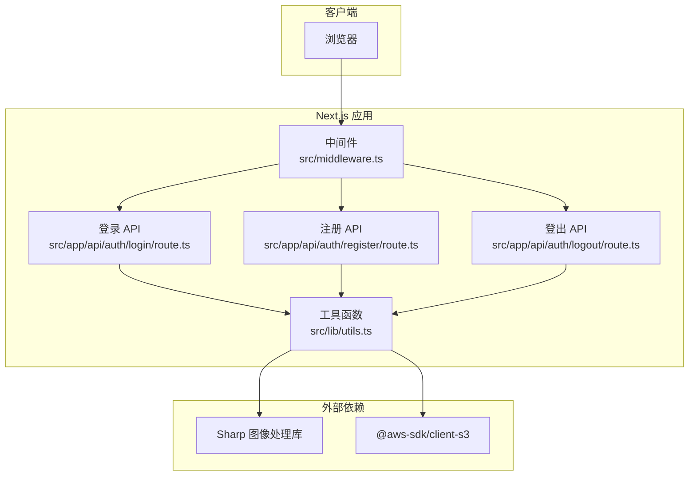
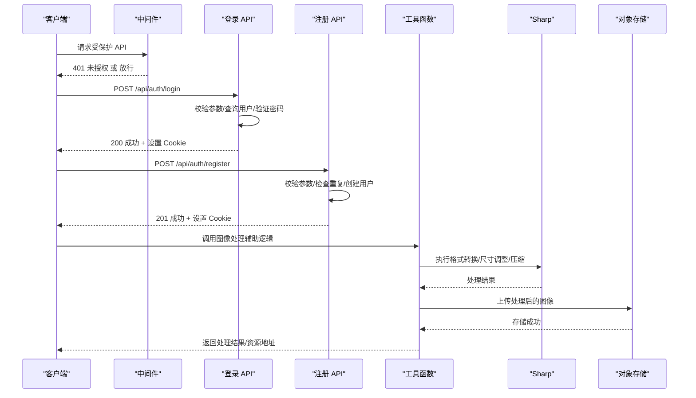
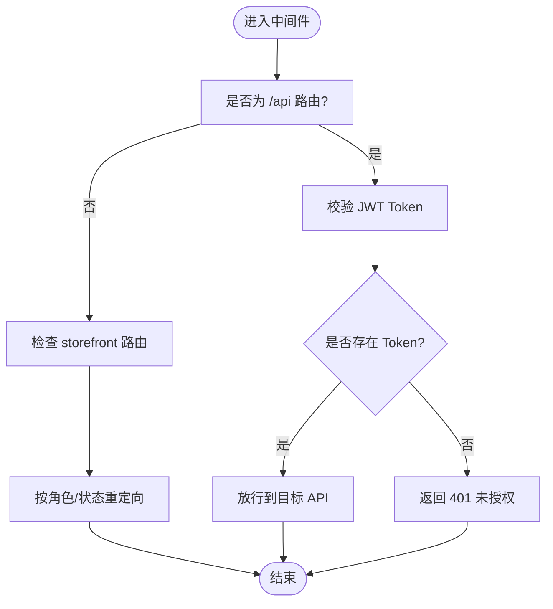
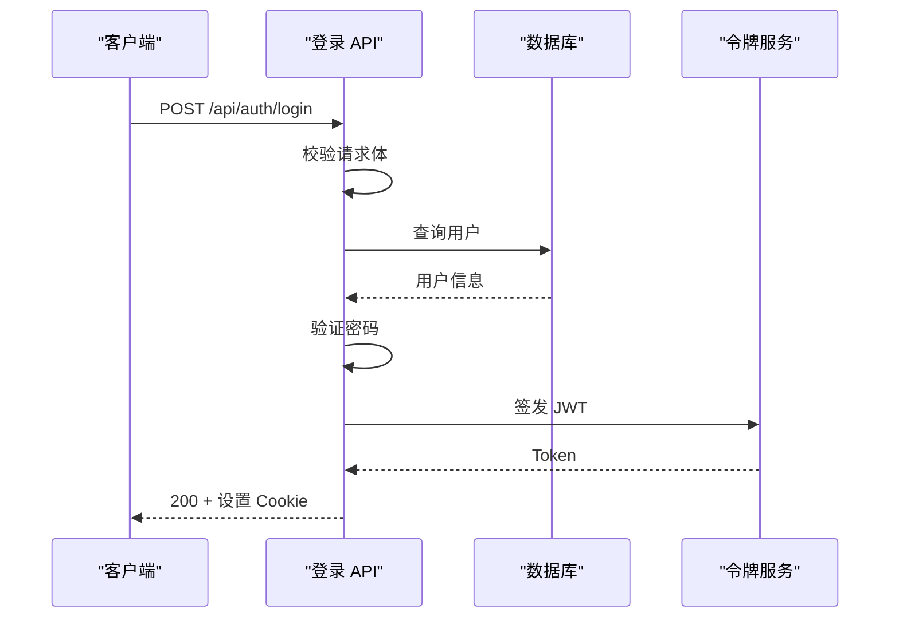
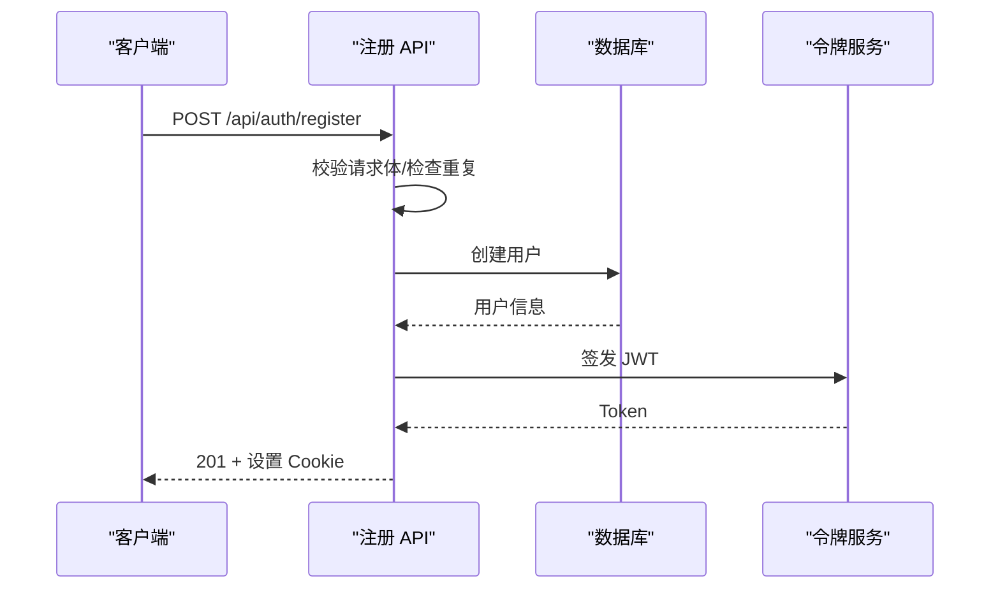
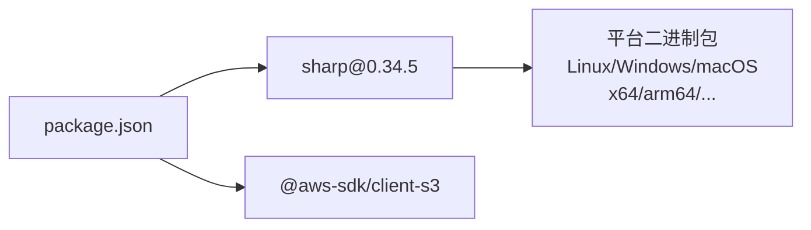

# 图像处理与优化

<cite>
**本文引用的文件**
- [README.md](file://README.md)
- [package.json](file://package.json)
- [package-lock.json](file://package-lock.json)
- [src/middleware.ts](file://src/middleware.ts)
- [src/app/api/auth/login/route.ts](file://src/app/api/auth/login/route.ts)
- [src/app/api/auth/logout/route.ts](file://src/app/api/auth/logout/route.ts)
- [src/app/api/auth/register/route.ts](file://src/app/api/auth/register/route.ts)
- [src/lib/utils.ts](file://src/lib/utils.ts)
</cite>

## 目录
1. [简介](#简介)
2. [项目结构](#项目结构)
3. [核心组件](#核心组件)
4. [架构总览](#架构总览)
5. [详细组件分析](#详细组件分析)
6. [依赖分析](#依赖分析)
7. [性能考量](#性能考量)
8. [故障排查指南](#故障排查指南)
9. [结论](#结论)
10. [附录](#附录)

## 简介
本文件面向开发者，系统化梳理在当前代码库中与“图像处理与优化”相关的能力与实践建议。仓库已引入高性能图像处理库 sharp，并通过 Next.js API 路由提供认证与会话管理能力。本文围绕以下主题展开：
- 使用 Sharp 进行图像格式转换与尺寸调整
- 缩略图生成算法与质量压缩策略
- 批量处理、并发控制与内存管理
- 图像格式支持、兼容性与性能基准建议
- 图像缓存策略、CDN 加速与懒加载实现
- 水印、滤镜与自定义处理管线
- 基于现有中间件与 API 的集成方案

## 项目结构
当前仓库采用 Next.js App Router 结构，认证与会话管理通过中间件与 API 路由实现；图像处理能力通过依赖注入的方式引入 Sharp。下图展示与图像处理相关的模块关系与数据流。

图表来源
- [src/middleware.ts](file://src/middleware.ts)
- [src/app/api/auth/login/route.ts](file://src/app/api/auth/login/route.ts)
- [src/app/api/auth/logout/route.ts](file://src/app/api/auth/logout/route.ts)
- [src/app/api/auth/register/route.ts](file://src/app/api/auth/register/route.ts)
- [src/lib/utils.ts](file://src/lib/utils.ts)
- [package.json](file://package.json)

章节来源
- [README.md:1-37](file://README.md#L1-L37)
- [package.json:11-44](file://package.json#L11-L44)
- [src/middleware.ts:1-148](file://src/middleware.ts#L1-L148)
- [src/app/api/auth/login/route.ts:1-76](file://src/app/api/auth/login/route.ts#L1-L76)
- [src/app/api/auth/logout/route.ts:1-22](file://src/app/api/auth/logout/route.ts#L1-L22)
- [src/app/api/auth/register/route.ts:1-86](file://src/app/api/auth/register/route.ts#L1-L86)
- [src/lib/utils.ts:1-32](file://src/lib/utils.ts#L1-L32)

## 核心组件
- 中间件：统一鉴权与路由保护，确保 API 认证路由在受保护状态下访问。
- 认证 API：登录、注册、登出接口，负责签发与清除认证 Cookie。
- 工具函数：提供通用格式化与辅助能力，可扩展用于图像处理流程的通用逻辑。
- 外部依赖：Sharp 提供高性能图像处理能力；AWS SDK 提供对象存储能力，便于与 CDN/缓存结合。

章节来源
- [src/middleware.ts:31-75](file://src/middleware.ts#L31-L75)
- [src/app/api/auth/login/route.ts:13-75](file://src/app/api/auth/login/route.ts#L13-L75)
- [src/app/api/auth/logout/route.ts:5-21](file://src/app/api/auth/logout/route.ts#L5-L21)
- [src/app/api/auth/register/route.ts:8-85](file://src/app/api/auth/register/route.ts#L8-L85)
- [src/lib/utils.ts:1-32](file://src/lib/utils.ts#L1-L32)
- [package.json:39,12](file://package.json#L39,L12)

## 架构总览
下图展示从客户端到后端 API，再到图像处理与存储的整体流程。该流程适用于上传图片后的处理、生成缩略图、质量压缩与持久化。

图表来源
- [src/middleware.ts:31-75](file://src/middleware.ts#L31-L75)
- [src/app/api/auth/login/route.ts:13-75](file://src/app/api/auth/login/route.ts#L13-L75)
- [src/app/api/auth/register/route.ts:8-85](file://src/app/api/auth/register/route.ts#L8-L85)
- [src/lib/utils.ts:1-32](file://src/lib/utils.ts#L1-L32)
- [package.json:39,12](file://package.json#L39,L12)

## 详细组件分析

### 中间件与认证保护
- 功能要点
  - 对 /api 路由进行统一鉴权，未携带有效 Token 则返回 401。
  - 区分公开路由（如 /api/auth/*）与受保护路由。
  - 支持多语言 storefront 路由的访问控制与重定向。
- 与图像处理的关联
  - 受保护的图像上传/处理 API 可通过中间件保障安全性。
  - 会话状态可用于决定是否对特定图像执行水印、滤镜等个性化处理。

图表来源
- [src/middleware.ts:31-75](file://src/middleware.ts#L31-L75)

章节来源
- [src/middleware.ts:1-148](file://src/middleware.ts#L1-L148)

### 登录 API
- 功能要点
  - 参数校验、用户查询、密码验证。
  - 成功后签发 JWT 并设置 Cookie。
- 与图像处理的关联
  - 可在登录成功后返回用户偏好（如是否启用水印），用于后续图像处理策略。

图表来源
- [src/app/api/auth/login/route.ts:13-75](file://src/app/api/auth/login/route.ts#L13-L75)

章节来源
- [src/app/api/auth/login/route.ts:1-76](file://src/app/api/auth/login/route.ts#L1-L76)

### 注册 API
- 功能要点
  - 参数校验、手机号唯一性检查、密码哈希、创建用户并签发 Token。
- 与图像处理的关联
  - 新用户默认状态可用于决定初始图像处理策略（如是否应用品牌水印）。

图表来源
- [src/app/api/auth/register/route.ts:8-85](file://src/app/api/auth/register/route.ts#L8-L85)

章节来源
- [src/app/api/auth/register/route.ts:1-86](file://src/app/api/auth/register/route.ts#L1-L86)

### 工具函数与图像处理集成点
- 功能要点
  - 提供类名合并、价格/日期格式化、订单号生成等通用能力。
- 与图像处理的关联
  - 可扩展用于：图像处理结果的命名规范、日志记录、错误格式化等。

章节来源
- [src/lib/utils.ts:1-32](file://src/lib/utils.ts#L1-L32)

## 依赖分析
- Sharp 版本与平台支持
  - 依赖版本：0.34.5
  - 平台支持：包含多种操作系统与 CPU 架构的二进制包，满足跨平台部署需求。
- AWS SDK
  - 用于对象存储交互，便于与 CDN/缓存结合实现图像分发与加速。

图表来源
- [package.json:39,12](file://package.json#L39,L12)
- [package-lock.json:2037-2470](file://package-lock.json#L2037-L2470)

章节来源
- [package.json:11-44](file://package.json#L11-L44)
- [package-lock.json:2037-2470](file://package-lock.json#L2037-L2470)

## 性能考量
- 平台与二进制包
  - 仓库已包含多平台 Sharp 二进制包，减少构建期编译成本，提升部署效率。
- 内存与并发
  - 建议在处理高并发上传时，限制同时处理的任务数量，避免内存峰值过高。
  - 对大图处理采用渐进式读取与流式写入，降低内存占用。
- 质量与体积
  - 根据场景选择合适的编码格式（如 WebP、AVIF）与质量参数，平衡清晰度与体积。
- 缓存与 CDN
  - 将处理后的图像缓存在 CDN，结合 ETag/Last-Modified 实现强缓存。
  - 使用懒加载与响应式尺寸，减少首屏带宽压力。
- 数据库与存储
  - 将原始图像与处理产物分离存储，避免数据库膨胀。

## 故障排查指南
- 认证失败
  - 检查中间件是否正确拦截 /api 路由并校验 Token。
  - 确认登录/注册 API 的响应头是否正确设置 Cookie。
- 图像处理异常
  - 确认 Sharp 二进制包与运行环境匹配。
  - 检查输入图像格式是否受支持，必要时进行预转换。
- 存储问题
  - 确认对象存储凭据与权限配置正确，网络连通性正常。

章节来源
- [src/middleware.ts:31-75](file://src/middleware.ts#L31-L75)
- [src/app/api/auth/login/route.ts:13-75](file://src/app/api/auth/login/route.ts#L13-L75)
- [src/app/api/auth/register/route.ts:8-85](file://src/app/api/auth/register/route.ts#L8-L85)

## 结论
当前代码库已具备使用 Sharp 进行高性能图像处理的基础能力，并通过中间件与认证 API 形成安全可控的处理入口。建议在此基础上完善图像处理流水线（格式转换、缩略图、压缩、水印、滤镜），并结合 CDN 与缓存策略实现高效分发与加载。同时，建立完善的并发控制与内存管理机制，确保在高负载下的稳定性与性能表现。

## 附录
- 图像格式支持与兼容性
  - Sharp 支持常见格式（JPEG/PNG/WebP/AVIF/TIFF 等），具体以平台二进制包为准。
  - 建议优先使用 WebP/AVIF 以获得更优体积表现。
- 性能基准建议
  - 在生产环境前进行多场景基准测试（不同分辨率、格式、并发数），记录处理耗时与内存占用。
- 最佳实践清单
  - 输入校验与格式预转换
  - 流式处理与内存上限
  - 缓存策略与 CDN 配置
  - 懒加载与响应式尺寸
  - 水印与滤镜的可配置化
  - 错误监控与降级策略