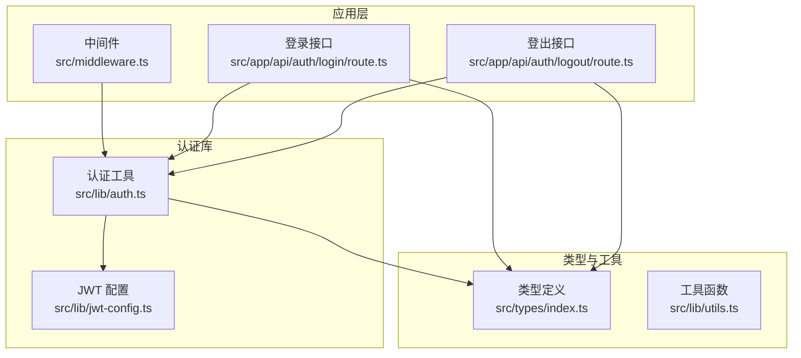
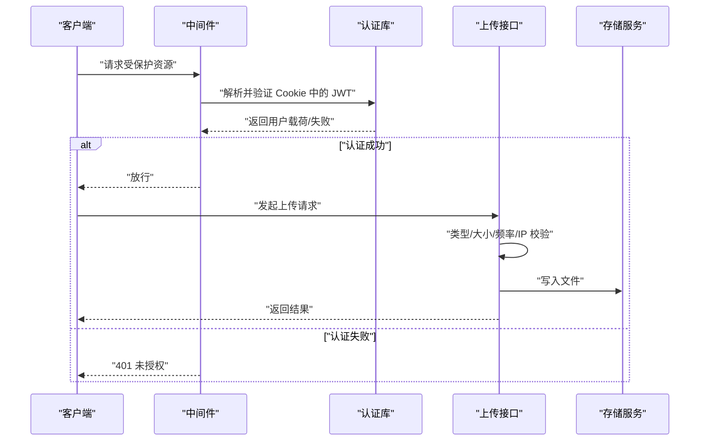
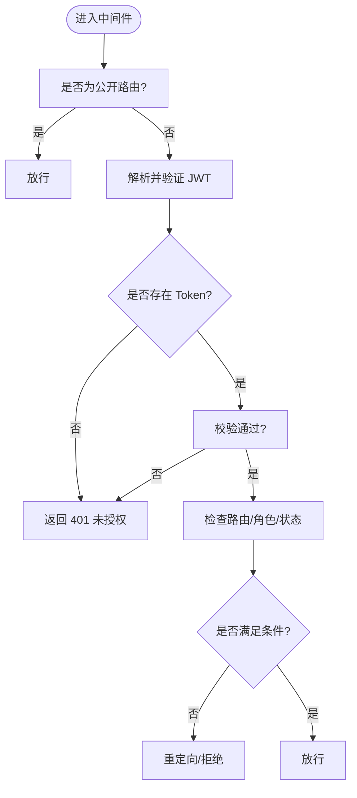
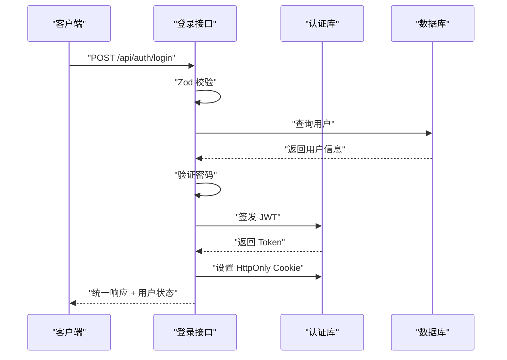
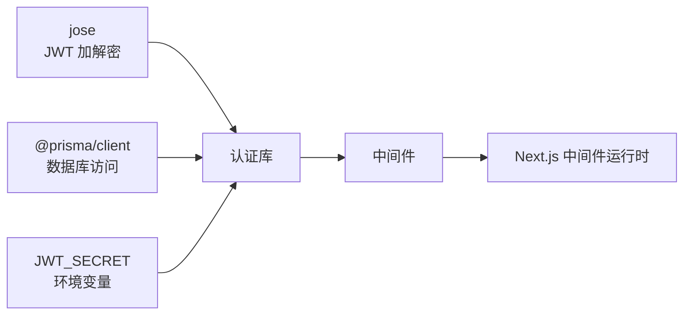

# 安全验证策略

<cite>
**本文引用的文件**
- [src/middleware.ts](file://src/middleware.ts)
- [src/lib/jwt-config.ts](file://src/lib/jwt-config.ts)
- [src/lib/auth.ts](file://src/lib/auth.ts)
- [src/app/api/auth/login/route.ts](file://src/app/api/auth/login/route.ts)
- [src/app/api/auth/logout/route.ts](file://src/app/api/auth/logout/route.ts)
- [src/types/index.ts](file://src/types/index.ts)
- [src/lib/utils.ts](file://src/lib/utils.ts)
- [package.json](file://package.json)
- [package-lock.json](file://package-lock.json)
</cite>

## 目录
1. [引言](#引言)
2. [项目结构](#项目结构)
3. [核心组件](#核心组件)
4. [架构总览](#架构总览)
5. [详细组件分析](#详细组件分析)
6. [依赖关系分析](#依赖关系分析)
7. [性能考虑](#性能考虑)
8. [故障排查指南](#故障排查指南)
9. [结论](#结论)
10. [附录](#附录)

## 引言
本文件围绕文件上传安全验证策略进行系统化梳理与落地建议，结合仓库现有认证与中间件能力，给出可操作的策略清单与实施步骤，覆盖文件类型验证、恶意文件检测、大小限制、上传频率控制、IP 白名单、XSS/CSRF 防护、文件权限控制、路径遍历防范、临时文件管理、哈希校验与重复检测、日志与审计、异常监控等主题。由于当前仓库未发现明确的文件上传接口实现，本文在“现有能力”基础上提出可扩展的实施方案，并以“概念性流程图”辅助理解。

## 项目结构
- Next.js 应用采用 App Router，认证与鉴权通过中间件与 API 路由协同完成。
- 认证使用 JWT，存储于 HttpOnly Cookie，具备 SameSite/Lax/Secure 等基础安全属性。
- 类型系统统一定义了通用响应结构与会话用户模型，便于在上传接口中复用。

图表来源
- [src/middleware.ts:1-148](file://src/middleware.ts#L1-L148)
- [src/app/api/auth/login/route.ts:1-75](file://src/app/api/auth/login/route.ts#L1-L75)
- [src/app/api/auth/logout/route.ts:1-21](file://src/app/api/auth/logout/route.ts#L1-L21)
- [src/lib/auth.ts:1-97](file://src/lib/auth.ts#L1-L97)
- [src/lib/jwt-config.ts:1-9](file://src/lib/jwt-config.ts#L1-L9)
- [src/types/index.ts:1-60](file://src/types/index.ts#L1-L60)
- [src/lib/utils.ts:1-32](file://src/lib/utils.ts#L1-L32)

章节来源
- [src/middleware.ts:1-148](file://src/middleware.ts#L1-L148)
- [src/lib/jwt-config.ts:1-9](file://src/lib/jwt-config.ts#L1-L9)
- [src/lib/auth.ts:1-97](file://src/lib/auth.ts#L1-L97)
- [src/app/api/auth/login/route.ts:1-75](file://src/app/api/auth/login/route.ts#L1-L75)
- [src/app/api/auth/logout/route.ts:1-21](file://src/app/api/auth/logout/route.ts#L1-L21)
- [src/types/index.ts:1-60](file://src/types/index.ts#L1-L60)
- [src/lib/utils.ts:1-32](file://src/lib/utils.ts#L1-L32)

## 核心组件
- 中间件：统一拦截 API 与页面路由，执行 JWT 校验与角色/状态检查；对非公开路由强制认证。
- 认证库：封装签发、验证、设置/清除 Cookie 的能力，提供当前用户查询。
- JWT 配置：集中管理密钥、Cookie 名称、过期时间与最大存活时长。
- 类型系统：统一响应结构与会话用户模型，便于在上传接口中复用。
- 工具函数：提供通用格式化与订单号生成等工具，可作为上传后处理流程的参考。

章节来源
- [src/middleware.ts:1-148](file://src/middleware.ts#L1-L148)
- [src/lib/auth.ts:1-97](file://src/lib/auth.ts#L1-L97)
- [src/lib/jwt-config.ts:1-9](file://src/lib/jwt-config.ts#L1-L9)
- [src/types/index.ts:1-60](file://src/types/index.ts#L1-L60)
- [src/lib/utils.ts:1-32](file://src/lib/utils.ts#L1-L32)

## 架构总览
下图展示了认证与中间件如何为上传接口提供统一的安全基座（概念性）：

（本图为概念性流程，不对应具体源码文件）

## 详细组件分析

### 中间件与认证链路
- 中间件负责：
  - 匹配公开路由（如 /api/auth/*），放行；
  - 对其他 API 路由强制要求有效 JWT；
  - 对管理端与前台路由进行角色与状态约束；
  - 统一重定向与拒绝逻辑。
- 认证库负责：
  - 使用 HS256 签发 JWT；
  - 读取 Cookie 并验证；
  - 设置/清除 HttpOnly Cookie；
  - 查询当前用户完整信息。

图表来源
- [src/middleware.ts:31-137](file://src/middleware.ts#L31-L137)
- [src/lib/auth.ts:57-97](file://src/lib/auth.ts#L57-L97)

章节来源
- [src/middleware.ts:1-148](file://src/middleware.ts#L1-L148)
- [src/lib/auth.ts:1-97](file://src/lib/auth.ts#L1-L97)

### 登录与登出接口
- 登录接口：
  - 使用 Zod Schema 进行输入校验；
  - 查询用户并验证密码；
  - 成功后签发 JWT 并设置 Cookie；
  - 返回统一响应结构与用户状态。
- 登出接口：
  - 清除认证 Cookie；
  - 返回统一响应结构。

图表来源
- [src/app/api/auth/login/route.ts:13-75](file://src/app/api/auth/login/route.ts#L13-L75)
- [src/lib/auth.ts:10-52](file://src/lib/auth.ts#L10-L52)

章节来源
- [src/app/api/auth/login/route.ts:1-75](file://src/app/api/auth/login/route.ts#L1-L75)
- [src/app/api/auth/logout/route.ts:1-21](file://src/app/api/auth/logout/route.ts#L1-L21)
- [src/lib/auth.ts:1-97](file://src/lib/auth.ts#L1-L97)
- [src/types/index.ts:1-60](file://src/types/index.ts#L1-L60)

### 文件上传安全策略（基于现有能力的扩展方案）
以下策略可在现有中间件与认证体系之上扩展实现。由于当前仓库未包含上传接口，请按以下清单在新增的上传路由中逐项落地。

- 文件类型验证
  - 基于白名单扩展 MIME/扩展名校验；
  - 使用安全的文件头识别（魔数）二次校验；
  - 禁止可执行与脚本类扩展（如 .exe/.bat/.sh/.js 等）。
- 恶意文件检测与安全扫描
  - 集成第三方病毒扫描服务（如 ClamAV 或云扫描 API）；
  - 对上传文件进行二次扫描与隔离。
- 文件大小限制
  - 在上传接口设置单文件与总大小上限；
  - 结合 Nginx/网关层限制请求体大小。
- 上传频率控制
  - 基于 IP/用户维度使用速率限制中间件；
  - 参考 express-rate-limit 的配置模式。
- IP 白名单策略
  - 在中间件或网关层维护可信 IP 列表；
  - 对非白名单 IP 拒绝上传请求。
- XSS 防护
  - 对文件名与元数据进行 HTML 转义；
  - 存储路径与链接输出时避免直接拼接用户输入。
- CSRF 保护
  - 为上传接口启用 SameSite Cookie；
  - 使用隐藏字段令牌（CSRF Token）配合后端校验。
- 文件权限控制
  - 上传目录设置最小权限（仅应用进程可写）；
  - 生成随机文件名并禁止执行权限。
- 路径遍历攻击防范
  - 严格清洗文件名，移除路径分隔符与控制字符；
  - 使用安全的临时目录与沙箱隔离。
- 临时文件安全管理
  - 上传采用流式写入与临时文件；
  - 写入完成后原子性移动至目标位置并清理临时文件。
- MD5/SHA 哈希校验与重复文件检测
  - 计算文件哈希并与数据库比对；
  - 发现重复文件则复用存储并返回相同标识。
- 日志记录、审计追踪与异常监控
  - 记录上传事件（时间、IP、用户、文件名、大小、哈希、结果）；
  - 对异常与安全事件触发告警；
  - 结合 APM/日志平台进行集中监控。

（本节为策略说明，不直接分析具体源码文件）

## 依赖关系分析
- 认证与中间件依赖 jose 实现 JWT，依赖 @prisma/client 进行用户查询。
- 中间件依赖环境变量 JWT_SECRET，缺失时抛出错误提示。
- 项目使用 Next.js 16，具备内置中间件与 API 路由能力，适合扩展上传安全中间件。

图表来源
- [src/lib/auth.ts:1-97](file://src/lib/auth.ts#L1-L97)
- [src/lib/jwt-config.ts:1-9](file://src/lib/jwt-config.ts#L1-L9)
- [src/middleware.ts:1-148](file://src/middleware.ts#L1-L148)
- [package.json:11-44](file://package.json#L11-L44)

章节来源
- [src/lib/auth.ts:1-97](file://src/lib/auth.ts#L1-L97)
- [src/lib/jwt-config.ts:1-9](file://src/lib/jwt-config.ts#L1-L9)
- [src/middleware.ts:1-148](file://src/middleware.ts#L1-L148)
- [package.json:11-44](file://package.json#L11-L44)

## 性能考虑
- 上传接口应采用流式处理，避免一次性加载到内存；
- 哈希计算与病毒扫描建议异步化，减少请求延迟；
- 速率限制与 IP 白名单应缓存命中，降低数据库压力；
- 存储层建议使用 CDN/对象存储，开启压缩与缓存策略。

（本节为通用指导，不直接分析具体源码文件）

## 故障排查指南
- JWT 密钥未配置
  - 现象：启动时报错提示未设置 JWT_SECRET；
  - 处理：在环境变量中配置密钥并重启服务。
- 中间件返回 401
  - 现象：访问受保护路由被拒绝；
  - 处理：检查 Cookie 是否存在且未过期，确认签发算法与密钥一致。
- 登录失败
  - 现象：用户名或密码错误；
  - 处理：核对数据库用户是否存在，确认密码哈希验证逻辑。
- 登出无效
  - 现象：登出后仍可访问受保护资源；
  - 处理：确认 Cookie 删除逻辑与前端清除策略一致。

章节来源
- [src/lib/jwt-config.ts:1-9](file://src/lib/jwt-config.ts#L1-L9)
- [src/middleware.ts:31-47](file://src/middleware.ts#L31-L47)
- [src/app/api/auth/login/route.ts:33-47](file://src/app/api/auth/login/route.ts#L33-L47)
- [src/app/api/auth/logout/route.ts:7-13](file://src/app/api/auth/logout/route.ts#L7-L13)

## 结论
当前仓库已具备完善的认证与中间件基础，可作为文件上传安全策略的统一入口。建议在新增上传接口时，遵循本文列出的策略清单，结合现有中间件与认证库能力，构建从入口到存储的全链路安全体系。对于尚未实现的功能（如上传接口、病毒扫描、哈希去重等），可按“概念性流程图”的思路逐步扩展。

## 附录
- 开发者最佳实践
  - 所有外部输入必须经过严格的白名单与长度限制；
  - 上传文件命名采用随机字符串，避免暴露业务信息；
  - 存储路径与文件名严格清洗，防止路径穿越；
  - 对外暴露的下载链接采用签名或短期令牌；
  - 定期轮换 JWT 密钥，确保密钥安全。
- 漏洞防护清单
  - XSS：输入转义、输出编码、CSP；
  - CSRF：SameSite Cookie、CSRF Token；
  - 权限：最小权限原则、访问控制矩阵；
  - 审计：上传事件记录、异常告警、日志留存。

（本节为通用指导，不直接分析具体源码文件）