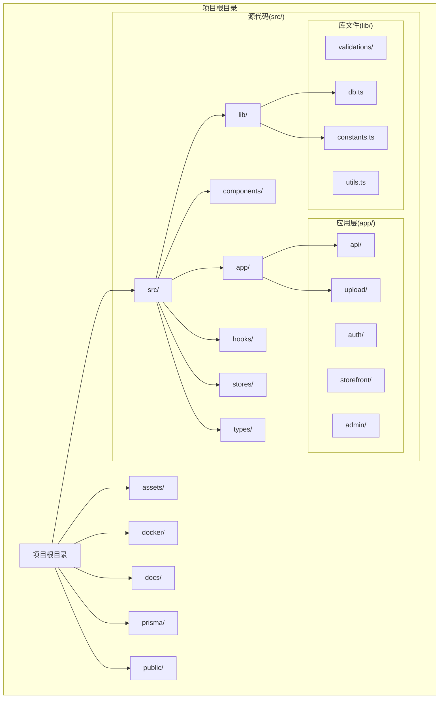
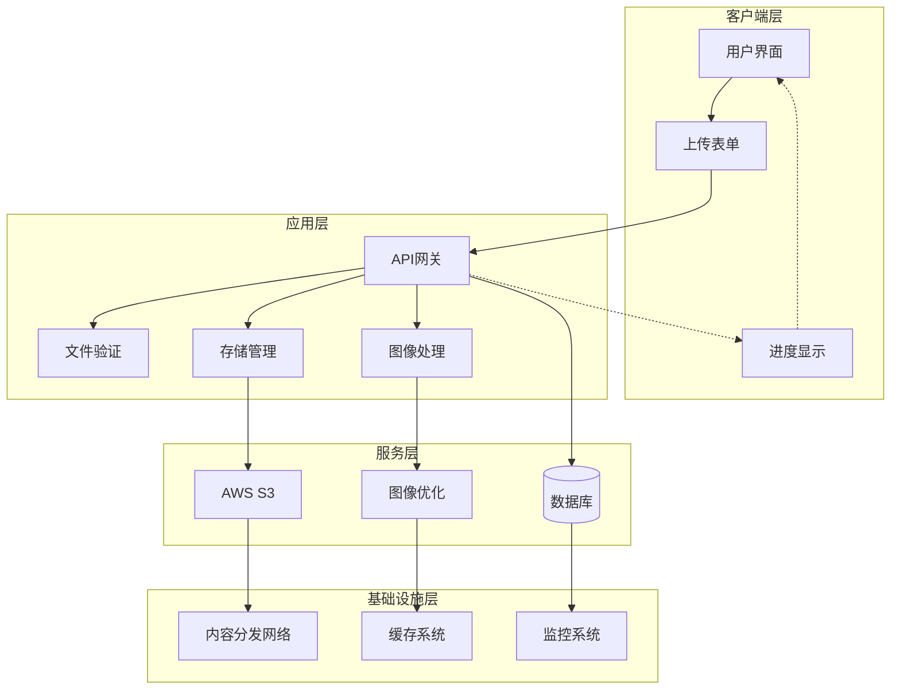
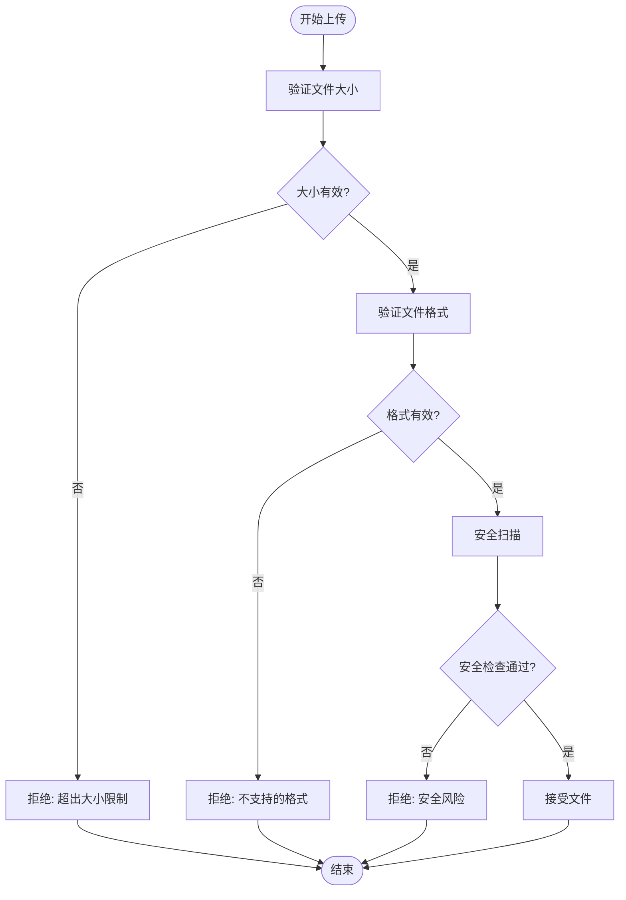
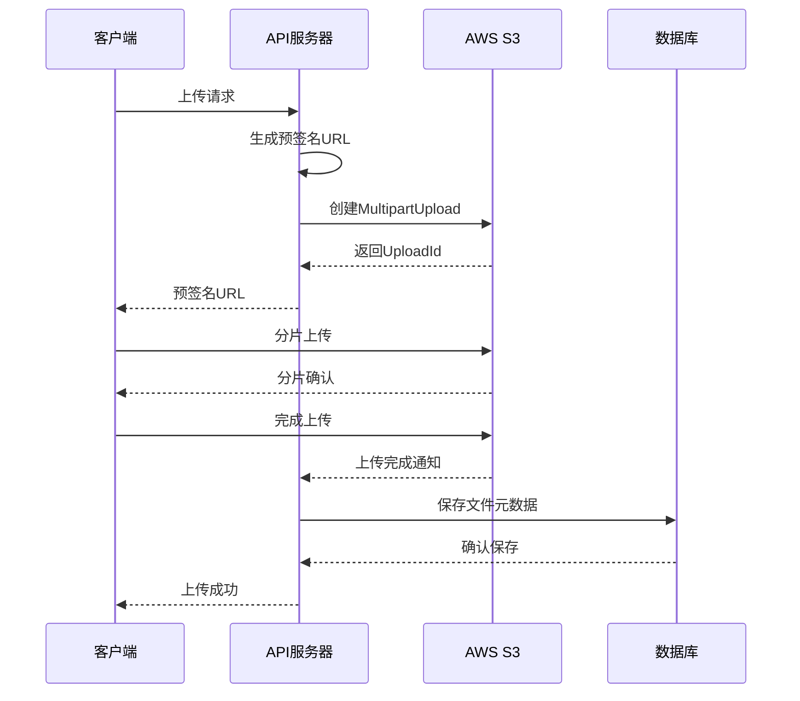
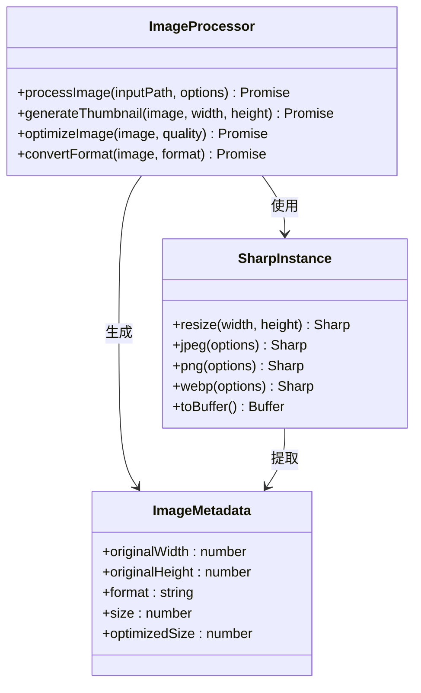
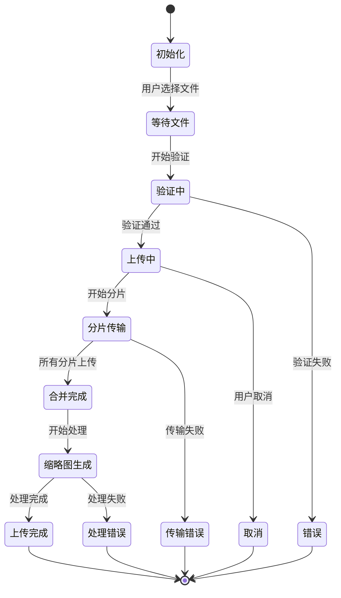
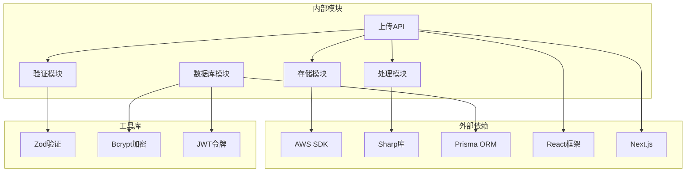
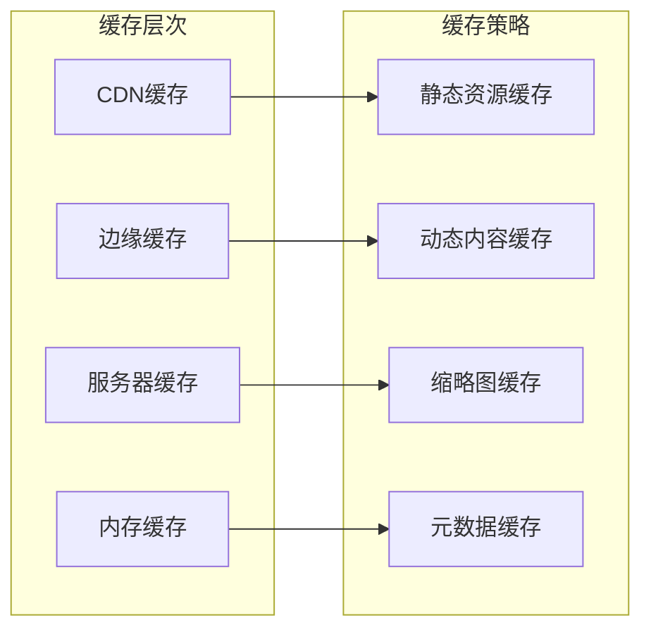

# 文件上传系统

<cite>
**本文档引用的文件**
- [README.md](file://README.md)
- [package.json](file://package.json)
- [src/lib/db.ts](file://src/lib/db.ts)
- [src/lib/constants.ts](file://src/lib/constants.ts)
- [next.config.ts](file://next.config.ts)
- [docker-compose.yml](file://docker-compose.yml)
- [docker/nginx/nginx.conf](file://docker/nginx/nginx.conf)
- [prisma/schema.prisma](file://prisma/schema.prisma)
</cite>

## 目录
1. [简介](#简介)
2. [项目结构](#项目结构)
3. [核心组件](#核心组件)
4. [架构概览](#架构概览)
5. [详细组件分析](#详细组件分析)
6. [依赖关系分析](#依赖关系分析)
7. [性能考虑](#性能考虑)
8. [故障排除指南](#故障排除指南)
9. [结论](#结论)
10. [附录](#附录)

## 简介

Celestia是一个基于Next.js构建的现代化电商应用，专注于提供优质的商品展示和购买体验。本项目特别注重文件上传系统的实现，包括图片上传、AWS S3集成和图像处理功能。

文件上传系统是整个应用的核心功能之一，它负责处理用户上传的各种文件类型，特别是图片文件。该系统集成了AWS S3云存储服务，提供了高可用性和可扩展性的文件存储解决方案。同时，系统还集成了Sharp图像处理库，能够对上传的图片进行自动缩放、压缩和格式转换等处理。

本系统的设计目标是提供一个安全、高效、可靠的文件上传解决方案，支持大文件分片上传、实时进度反馈、智能格式检测和自动图像优化等功能。

## 项目结构

项目采用标准的Next.js应用程序结构，文件上传相关的组件主要分布在以下目录：

**图表来源**
- [package.json:1-50](file://package.json#L1-L50)
- [src/lib/db.ts:1-12](file://src/lib/db.ts#L1-L12)
- [src/lib/constants.ts:1-46](file://src/lib/constants.ts#L1-L46)

**章节来源**
- [README.md:1-37](file://README.md#L1-L37)
- [package.json:1-50](file://package.json#L1-L50)

## 核心组件

### AWS S3集成

系统集成了AWS SDK v3.1019.0版本，提供了完整的S3存储服务支持。主要功能包括：

- **多部分上传**: 支持大文件的分片上传，提高上传成功率和速度
- **安全认证**: 通过环境变量配置AWS凭证，确保访问安全
- **桶操作**: 支持桶的创建、删除和配置管理
- **对象管理**: 提供文件的上传、下载、删除和元数据管理

### Sharp图像处理

系统集成了Sharp v0.34.5版本，这是一个高性能的Node.js图像处理库：

- **格式支持**: 支持JPEG、PNG、WebP、AVIF等多种图像格式
- **尺寸调整**: 自动缩放和裁剪功能
- **质量优化**: 智能压缩算法，保持图像质量的同时减小文件大小
- **批量处理**: 支持并发处理多个图像文件

### 数据库集成

使用Prisma ORM进行数据库操作，支持PostgreSQL数据库：

- **模型定义**: 完整的商品、订单和用户数据模型
- **查询优化**: 自动生成高效的SQL查询
- **事务支持**: 提供ACID事务保证
- **迁移管理**: 版本化的数据库结构变更

**章节来源**
- [package.json:11-36](file://package.json#L11-L36)
- [src/lib/db.ts:1-12](file://src/lib/db.ts#L1-L12)

## 架构概览

文件上传系统采用分层架构设计，确保各组件之间的松耦合和高内聚：

**图表来源**
- [package.json:11-36](file://package.json#L11-L36)
- [src/lib/db.ts:1-12](file://src/lib/db.ts#L1-L12)

## 详细组件分析

### 文件验证组件

文件验证是上传流程的第一道防线，确保只有符合要求的文件才能进入后续处理阶段：

**图表来源**
- [src/lib/constants.ts:32-35](file://src/lib/constants.ts#L32-L35)

#### 验证规则

系统实现了多层次的文件验证机制：

- **大小限制**: 默认最大文件大小为2MB，可通过配置调整
- **格式检查**: 仅允许JPEG、PNG、WebP等常用图片格式
- **安全扫描**: 检测潜在的安全威胁和恶意文件
- **元数据验证**: 验证文件的EXIF信息和分辨率

### AWS S3存储组件

S3存储组件提供了完整的云端文件存储解决方案：

**图表来源**
- [package.json:12](file://package.json#L12)

#### 存储策略

- **分层存储**: 根据文件类型和访问频率选择合适的存储类别
- **生命周期管理**: 自动清理临时文件和过期内容
- **版本控制**: 支持文件版本管理和回滚功能
- **备份策略**: 多区域备份确保数据安全

### 图像处理组件

图像处理组件基于Sharp库实现，提供强大的图像优化功能：

**图表来源**
- [package.json:31](file://package.json#L31)

#### 处理流程

1. **输入验证**: 检查输入图像的有效性和格式兼容性
2. **尺寸调整**: 根据配置自动调整图像尺寸
3. **质量优化**: 应用适当的压缩算法减少文件大小
4. **格式转换**: 将图像转换为最优的显示格式
5. **元数据提取**: 保存图像的原始信息和处理结果

### 进度反馈组件

进度反馈组件为用户提供实时的上传状态更新：

**图表来源**
- [src/lib/constants.ts:32-35](file://src/lib/constants.ts#L32-L35)

## 依赖关系分析

系统依赖关系清晰明确，各模块之间通过接口进行通信：

**图表来源**
- [package.json:11-36](file://package.json#L11-L36)

**章节来源**
- [package.json:11-36](file://package.json#L11-L36)

## 性能考虑

### 并发处理

系统采用异步非阻塞的并发处理模式：

- **事件驱动**: 基于Promise和async/await的异步编程模型
- **并发限制**: 控制同时处理的文件数量，避免资源耗尽
- **内存管理**: 及时释放处理过程中的中间数据
- **CPU优化**: 利用多核处理器并行处理多个文件

### 缓存策略

### 优化建议

1. **预加载策略**: 对热门资源进行预加载，减少首次访问延迟
2. **懒加载**: 图片和其他媒体资源采用懒加载技术
3. **压缩优化**: 启用Gzip和Brotli压缩，减少传输体积
4. **连接复用**: 使用HTTP/2和连接池优化网络性能

## 故障排除指南

### 常见问题及解决方案

#### 上传失败

**问题描述**: 文件上传过程中断或失败

**可能原因**:
- 网络连接不稳定
- S3权限配置错误
- 文件大小超出限制
- 格式不被支持

**解决步骤**:
1. 检查网络连接状态
2. 验证AWS凭证配置
3. 确认文件格式和大小
4. 查看服务器日志获取详细错误信息

#### 图像处理异常

**问题描述**: 图像处理后质量下降或格式错误

**可能原因**:
- Sharp库版本不兼容
- 内存不足导致处理中断
- 输入图像损坏
- 配置参数设置不当

**解决步骤**:
1. 更新到最新版本的Sharp库
2. 检查系统内存使用情况
3. 验证输入图像的完整性
4. 调整处理参数配置

#### 性能问题

**问题描述**: 上传速度慢或响应时间长

**可能原因**:
- 服务器带宽限制
- 数据库连接池耗尽
- 缓存命中率低
- 并发处理过多

**解决步骤**:
1. 监控服务器资源使用情况
2. 优化数据库查询性能
3. 调整缓存策略
4. 限制并发连接数

**章节来源**
- [src/lib/db.ts:1-12](file://src/lib/db.ts#L1-L12)

## 结论

Celestia文件上传系统是一个功能完整、架构清晰的现代化文件处理解决方案。系统通过集成AWS S3云存储和Sharp图像处理库，为用户提供了高效、可靠的文件上传体验。

系统的主要优势包括：

- **安全性**: 多层验证和安全检查机制
- **可扩展性**: 基于云原生架构，支持水平扩展
- **性能**: 异步处理和智能缓存策略
- **可靠性**: 完善的错误处理和监控机制

未来可以进一步优化的方向包括：

- 实现更智能的图像压缩算法
- 增强CDN集成和边缘计算能力
- 添加更多格式支持和处理选项
- 优化移动端上传体验

## 附录

### 配置参考

#### 环境变量配置

| 变量名 | 描述 | 默认值 | 必需 |
|--------|------|--------|------|
| AWS_ACCESS_KEY_ID | AWS访问密钥ID | - | 是 |
| AWS_SECRET_ACCESS_KEY | AWS秘密访问密钥 | - | 是 |
| AWS_REGION | AWS区域 | us-east-1 | 是 |
| S3_BUCKET_NAME | S3存储桶名称 | - | 是 |
| NEXT_PUBLIC_CDN_URL | CDN基础URL | - | 否 |

#### 性能配置

| 参数 | 默认值 | 最大值 | 描述 |
|------|--------|--------|------|
| MAX_FILE_SIZE | 2MB | 50MB | 最大文件大小 |
| CONCURRENT_PROCESSING | 5 | 20 | 并发处理数量 |
| THUMBNAIL_WIDTH | 200px | 1000px | 缩略图宽度 |
| IMAGE_QUALITY | 80% | 100% | 图像压缩质量 |

### API参考

#### 上传接口

**POST /api/upload**

请求参数:
- file: 文件对象 (必需)
- metadata: 元数据对象 (可选)

响应数据:
- fileId: 文件唯一标识符
- url: 文件访问URL
- thumbnailUrl: 缩略图URL
- processingStatus: 处理状态

**章节来源**
- [src/lib/constants.ts:32-35](file://src/lib/constants.ts#L32-L35)