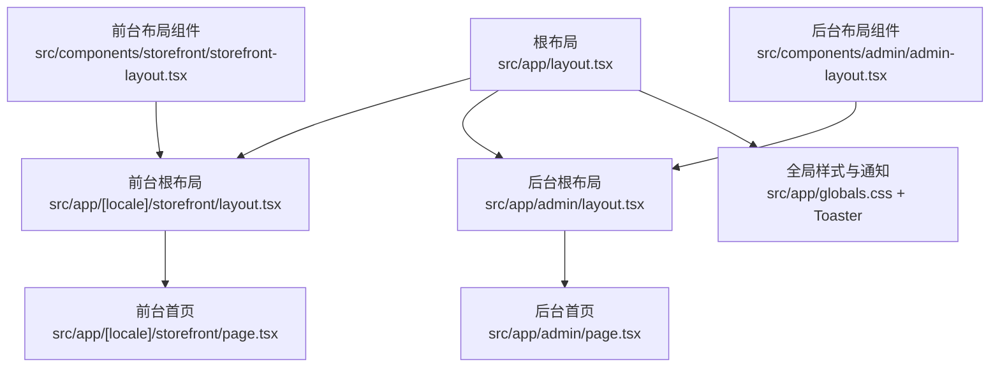
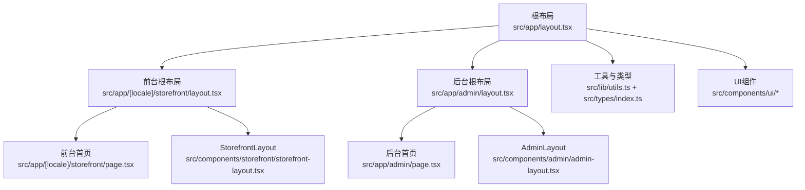
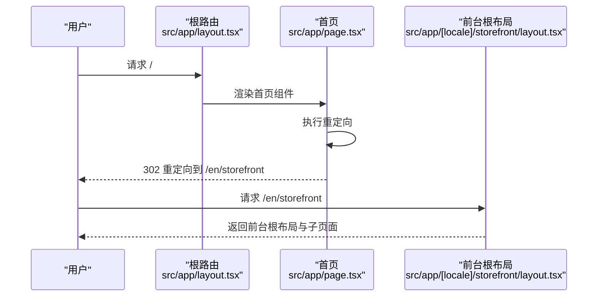
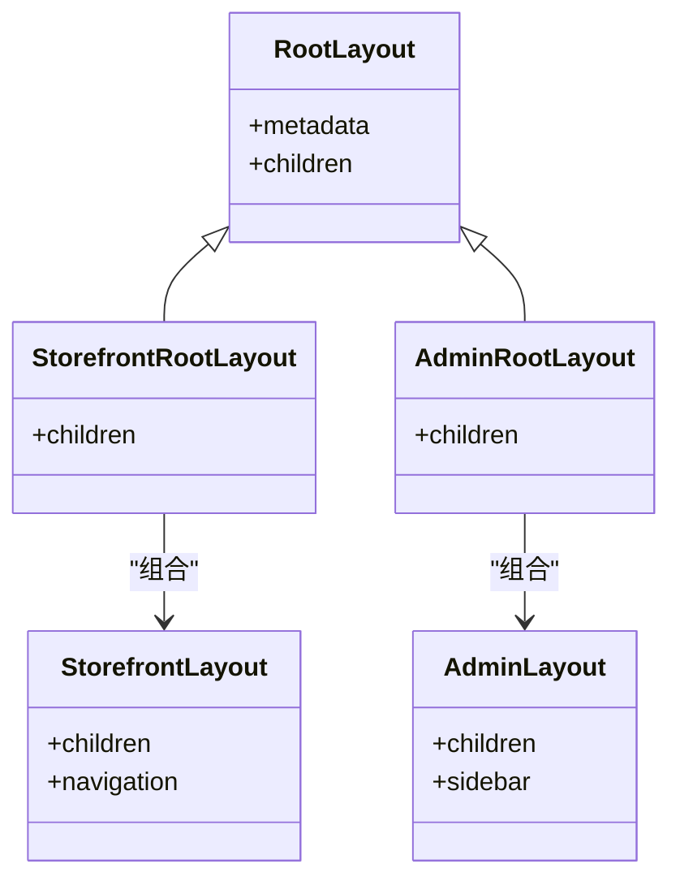
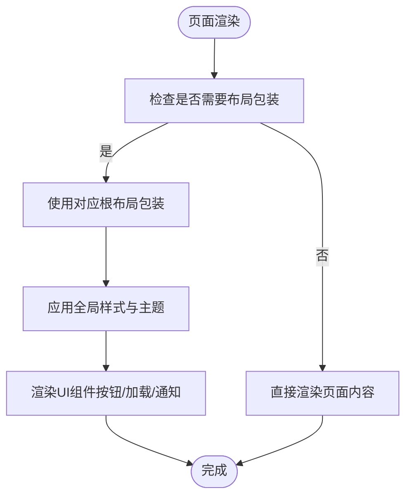
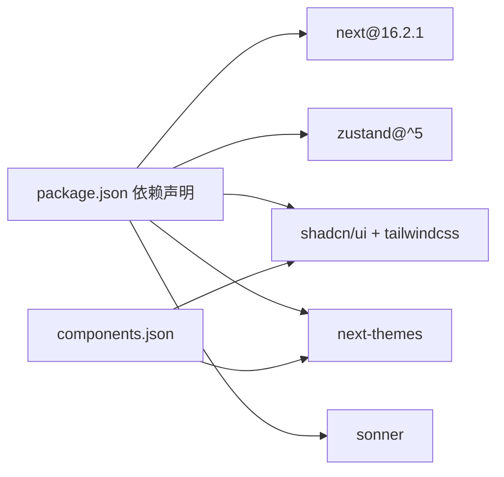

# 前端架构设计

<cite>
**本文引用的文件**
- [README.md](file://README.md)
- [package.json](file://package.json)
- [next.config.ts](file://next.config.ts)
- [src/app/layout.tsx](file://src/app/layout.tsx)
- [src/app/page.tsx](file://src/app/page.tsx)
- [src/app/[locale]/storefront/layout.tsx](file://src/app/[locale]/storefront/layout.tsx)
- [src/app/[locale]/storefront/page.tsx](file://src/app/[locale]/storefront/page.tsx)
- [src/app/admin/layout.tsx](file://src/app/admin/layout.tsx)
- [src/components/admin/admin-layout.tsx](file://src/components/admin/admin-layout.tsx)
- [src/components/storefront/storefront-layout.tsx](file://src/components/storefront/storefront-layout.tsx)
- [src/components/ui/button.tsx](file://src/components/ui/button.tsx)
- [src/components/ui/loading-spinner.tsx](file://src/components/ui/loading-spinner.tsx)
- [src/components/ui/sonner.tsx](file://src/components/ui/sonner.tsx)
- [src/lib/utils.ts](file://src/lib/utils.ts)
- [src/types/index.ts](file://src/types/index.ts)
- [components.json](file://components.json)
</cite>

## 目录
1. [引言](#引言)
2. [项目结构](#项目结构)
3. [核心组件](#核心组件)
4. [架构总览](#架构总览)
5. [详细组件分析](#详细组件分析)
6. [依赖分析](#依赖分析)
7. [性能考虑](#性能考虑)
8. [故障排查指南](#故障排查指南)
9. [结论](#结论)
10. [附录](#附录)

## 引言
本文件面向Celestia项目的前端架构设计，围绕Next.js 16.2.1 App Router进行系统性梳理，重点阐述以下方面：
- 路由系统与页面组件结构（含多语言区域化路由）
- 布局层次与模块化组织
- 组件化架构与父子关系、复用策略
- 状态管理模式（Zustand）的设计与实践要点
- UI组件库（shadcn/ui + Tailwind CSS）的集成与主题定制
- 响应式设计、移动端适配与无障碍访问支持
- 性能优化策略（代码分割、懒加载、缓存）

## 项目结构
项目采用Next.js App Router目录约定，根布局统一注入全局样式与通知组件；应用分为两大前台域：
- 商城前台（storefront）：面向消费者，包含导航、分类、购物车、订单、个人中心等页面
- 后台管理（admin）：面向管理员，包含仪表盘、商品管理、订单管理、客户管理、系统设置等页面
- 多语言支持：通过动态路由段[locale]实现国际化入口

图表来源
- [src/app/layout.tsx:17-42](file://src/app/layout.tsx#L17-L42)
- [src/app/[locale]/storefront/layout.tsx](file://src/app/[locale]/storefront/layout.tsx#L1-L9)
- [src/app/admin/layout.tsx:1-9](file://src/app/admin/layout.tsx#L1-L9)
- [src/components/storefront/storefront-layout.tsx:21-98](file://src/components/storefront/storefront-layout.tsx#L21-L98)
- [src/components/admin/admin-layout.tsx:40-206](file://src/components/admin/admin-layout.tsx#L40-L206)

章节来源
- [README.md:1-37](file://README.md#L1-L37)
- [package.json:11-38](file://package.json#L11-L38)
- [src/app/layout.tsx:17-42](file://src/app/layout.tsx#L17-L42)
- [src/app/[locale]/storefront/layout.tsx:1-L9](file://src/app/[locale]/storefront/layout.tsx#L1-L9)
- [src/app/admin/layout.tsx:1-9](file://src/app/admin/layout.tsx#L1-L9)

## 核心组件
- 根布局与元数据：定义站点标题、字体变量、全局容器与通知系统
- 前台布局：提供顶部导航、桌面主导航、移动端底部导航与内容区
- 后台布局：提供侧边栏导航、移动端抽屉、顶部标题与内容区
- UI基础组件：按钮、加载指示器、消息提示（Toaster）
- 工具函数：类名合并、价格/日期格式化、订单号生成
- 类型定义：API响应、分页、筛选、JWT载荷、会话用户

章节来源
- [src/app/layout.tsx:12-42](file://src/app/layout.tsx#L12-L42)
- [src/components/storefront/storefront-layout.tsx:21-98](file://src/components/storefront/storefront-layout.tsx#L21-L98)
- [src/components/admin/admin-layout.tsx:40-206](file://src/components/admin/admin-layout.tsx#L40-L206)
- [src/components/ui/button.tsx:8-60](file://src/components/ui/button.tsx#L8-L60)
- [src/components/ui/loading-spinner.tsx:14-35](file://src/components/ui/loading-spinner.tsx#L14-L35)
- [src/components/ui/sonner.tsx:7-47](file://src/components/ui/sonner.tsx#L7-L47)
- [src/lib/utils.ts:4-31](file://src/lib/utils.ts#L4-L31)
- [src/types/index.ts:1-58](file://src/types/index.ts#L1-L58)

## 架构总览
下图展示从根布局到各功能域的层级关系与交互路径。

图表来源
- [src/app/layout.tsx:17-42](file://src/app/layout.tsx#L17-L42)
- [src/app/[locale]/storefront/layout.tsx](file://src/app/[locale]/storefront/layout.tsx#L1-L9)
- [src/app/admin/layout.tsx:1-9](file://src/app/admin/layout.tsx#L1-L9)
- [src/app/[locale]/storefront/page.tsx](file://src/app/[locale]/storefront/page.tsx#L1-L26)
- [src/components/storefront/storefront-layout.tsx:21-98](file://src/components/storefront/storefront-layout.tsx#L21-L98)
- [src/components/admin/admin-layout.tsx:40-206](file://src/components/admin/admin-layout.tsx#L40-L206)
- [src/lib/utils.ts:4-31](file://src/lib/utils.ts#L4-L31)
- [src/types/index.ts:1-58](file://src/types/index.ts#L1-L58)

## 详细组件分析

### 路由系统与页面结构
- 入口重定向：根路径重定向至多语言前台入口，确保默认访问路径一致
- 动态路由段：使用[locale]实现多语言入口，便于后续扩展语言切换
- 页面组件：前台与后台各自拥有独立的根布局与页面，便于隔离样式与逻辑

图表来源
- [src/app/page.tsx:1-6](file://src/app/page.tsx#L1-L6)
- [src/app/[locale]/storefront/layout.tsx](file://src/app/[locale]/storefront/layout.tsx#L1-L9)

章节来源
- [src/app/page.tsx:1-6](file://src/app/page.tsx#L1-L6)
- [src/app/[locale]/storefront/layout.tsx:1-L9](file://src/app/[locale]/storefront/layout.tsx#L1-L9)

### 布局层次与模块化组织
- 根布局负责全局样式、字体与通知系统注入
- 前台与后台分别通过各自的根布局封装通用UI骨架
- StorefrontLayout提供桌面与移动端导航、内容区与底部导航
- AdminLayout提供侧边栏、移动端抽屉、顶部标题与内容区

图表来源
- [src/app/layout.tsx:17-42](file://src/app/layout.tsx#L17-L42)
- [src/app/[locale]/storefront/layout.tsx](file://src/app/[locale]/storefront/layout.tsx#L1-L9)
- [src/app/admin/layout.tsx:1-9](file://src/app/admin/layout.tsx#L1-L9)
- [src/components/storefront/storefront-layout.tsx:21-98](file://src/components/storefront/storefront-layout.tsx#L21-L98)
- [src/components/admin/admin-layout.tsx:40-206](file://src/components/admin/admin-layout.tsx#L40-L206)

章节来源
- [src/app/layout.tsx:17-42](file://src/app/layout.tsx#L17-L42)
- [src/components/storefront/storefront-layout.tsx:21-98](file://src/components/storefront/storefront-layout.tsx#L21-L98)
- [src/components/admin/admin-layout.tsx:40-206](file://src/components/admin/admin-layout.tsx#L40-L206)

### 组件化架构与复用策略
- 组件职责清晰：布局组件仅负责结构与导航，业务页面负责内容渲染
- 复用策略：通过根布局与布局组件实现跨页面的统一结构复用
- 变体与尺寸：按钮组件通过变体与尺寸配置实现风格一致性与可扩展性
- 工具函数：集中处理样式合并、格式化与业务辅助方法，降低重复代码

图表来源
- [src/components/ui/button.tsx:8-60](file://src/components/ui/button.tsx#L8-L60)
- [src/components/ui/loading-spinner.tsx:14-35](file://src/components/ui/loading-spinner.tsx#L14-L35)
- [src/components/ui/sonner.tsx:7-47](file://src/components/ui/sonner.tsx#L7-L47)
- [src/lib/utils.ts:4-6](file://src/lib/utils.ts#L4-L6)

章节来源
- [src/components/ui/button.tsx:8-60](file://src/components/ui/button.tsx#L8-L60)
- [src/components/ui/loading-spinner.tsx:14-35](file://src/components/ui/loading-spinner.tsx#L14-L35)
- [src/components/ui/sonner.tsx:7-47](file://src/components/ui/sonner.tsx#L7-L47)
- [src/lib/utils.ts:4-6](file://src/lib/utils.ts#L4-L6)

### 状态管理模式（Zustand）
- 设计理念：以最小API提供高性能、可预测的状态管理，适合中小型应用或局部状态场景
- 全局状态设计：建议将用户会话、购物车、语言偏好、主题模式等拆分为独立store，避免单点臃肿
- 状态持久化：结合浏览器存储（如localStorage/sessionStorage）实现刷新后状态恢复
- 订阅机制：通过store实例的订阅API实现细粒度更新，减少不必要渲染
- 与路由集成：在根布局或根布局包装的页面中初始化store，确保全局可用

章节来源
- [package.json:38-38](file://package.json#L38-L38)
- [src/types/index.ts:42-57](file://src/types/index.ts#L42-L57)

### UI组件库（shadcn/ui + Tailwind CSS）集成与主题定制
- 集成方式：通过配置文件声明Tailwind路径、颜色体系、CSS变量与别名映射
- 主题定制：利用CSS变量与Tailwind变量实现明暗主题联动，配合通知组件与基础UI组件保持视觉一致性
- 图标库：统一使用Lucide图标，保证图标风格一致
- 组件别名：通过aliases简化导入路径，提升开发效率

章节来源
- [components.json:1-25](file://components.json#L1-L25)
- [src/components/ui/sonner.tsx:7-47](file://src/components/ui/sonner.tsx#L7-L47)
- [src/components/ui/button.tsx:8-43](file://src/components/ui/button.tsx#L8-L43)

### 响应式设计、移动端适配与无障碍访问
- 响应式设计：基于Tailwind断点实现桌面与移动端差异化布局
- 移动端适配：前台与后台均提供移动端导航与抽屉，确保在小屏设备上的可用性
- 无障碍访问：按钮组件遵循可访问性规范，提供焦点可见性与键盘导航支持

章节来源
- [src/components/storefront/storefront-layout.tsx:76-95](file://src/components/storefront/storefront-layout.tsx#L76-L95)
- [src/components/admin/admin-layout.tsx:100-174](file://src/components/admin/admin-layout.tsx#L100-L174)
- [src/components/ui/button.tsx:45-58](file://src/components/ui/button.tsx#L45-L58)

### 性能优化策略
- 代码分割：利用Next.js App Router的并行加载与动态导入，按需加载页面与组件
- 懒加载：对非首屏内容（如图片、第三方脚本）采用懒加载策略
- 缓存策略：合理设置静态资源缓存头，利用浏览器缓存与CDN加速
- 组件优化：通过变体与尺寸控制减少不必要的DOM节点与样式计算
- 工具函数：集中处理格式化逻辑，避免重复计算与内存浪费

章节来源
- [src/lib/utils.ts:8-31](file://src/lib/utils.ts#L8-L31)
- [src/components/ui/button.tsx:8-43](file://src/components/ui/button.tsx#L8-L43)

## 依赖分析
- 运行时依赖：Next.js 16.2.1、React 19、Zustand、shadcn/ui、Tailwind CSS、next-themes、sonner等
- 开发依赖：ESLint、TailwindCSS v4、TypeScript等
- 配置：next.config.ts为空配置，components.json定义UI库与Tailwind集成参数

图表来源
- [package.json:11-38](file://package.json#L11-L38)
- [components.json:1-25](file://components.json#L1-L25)

章节来源
- [package.json:11-38](file://package.json#L11-L38)
- [components.json:1-25](file://components.json#L1-L25)
- [next.config.ts:1-7](file://next.config.ts#L1-L7)

## 性能考虑
- 路由与渲染：优先使用App Router的并行加载与流式渲染，减少首屏阻塞
- 样式与主题：通过CSS变量与Tailwind变量实现主题切换的零运行时成本
- 组件体积：使用变体与尺寸裁剪组件样式，避免无谓的类名拼接
- 工具函数：将格式化与计算逻辑集中在工具函数中，减少重复工作

## 故障排查指南
- 样式异常：检查根布局中的全局样式与字体变量是否正确注入
- 通知显示问题：确认通知组件的主题与样式变量是否与主题系统一致
- 导航高亮：核对路径匹配逻辑与页面标题映射表，确保导航状态正确
- 加载状态：使用加载指示器组件确保异步操作期间的用户体验

章节来源
- [src/app/layout.tsx:17-42](file://src/app/layout.tsx#L17-L42)
- [src/components/ui/sonner.tsx:7-47](file://src/components/ui/sonner.tsx#L7-L47)
- [src/components/storefront/storefront-layout.tsx:32-38](file://src/components/storefront/storefront-layout.tsx#L32-L38)
- [src/components/ui/loading-spinner.tsx:14-35](file://src/components/ui/loading-spinner.tsx#L14-L35)

## 结论
本架构以Next.js App Router为核心，通过根布局与功能域布局实现清晰的层次划分；借助shadcn/ui与Tailwind CSS构建一致的UI体系；通过工具函数与类型定义保障可维护性；Zustand作为轻量级状态管理满足当前规模需求。整体设计兼顾性能、可扩展性与可访问性，为后续迭代打下坚实基础。

## 附录
- API响应与分页模型：统一的响应结构与分页参数，便于前后端协作
- 会话与权限：基于JWT的会话模型与角色区分，支撑后台管理权限控制

章节来源
- [src/types/index.ts:1-58](file://src/types/index.ts#L1-L58)