# 前端架构设计

<cite>
**本文引用的文件**
- [package.json](file://package.json)
- [next.config.ts](file://next.config.ts)
- [components.json](file://components.json)
- [src/app/layout.tsx](file://src/app/layout.tsx)
- [src/app/admin/layout.tsx](file://src/app/admin/layout.tsx)
- [src/app/[locale]/storefront/layout.tsx](file://src/app/[locale]/storefront/layout.tsx)
- [src/app/[locale]/storefront/page.tsx](file://src/app/[locale]/storefront/page.tsx)
- [src/app/admin/page.tsx](file://src/app/admin/page.tsx)
- [src/components/admin/admin-layout.tsx](file://src/components/admin/admin-layout.tsx)
- [src/components/storefront/storefront-layout.tsx](file://src/components/storefront/storefront-layout.tsx)
- [src/components/ui/button.tsx](file://src/components/ui/button.tsx)
- [src/components/ui/sonner.tsx](file://src/components/ui/sonner.tsx)
- [src/lib/utils.ts](file://src/lib/utils.ts)
- [src/types/index.ts](file://src/types/index.ts)
- [src/stores/cart.ts](file://src/stores/cart.ts)
- [src/middleware.ts](file://src/middleware.ts)
- [src/i18n/config.ts](file://src/i18n/config.ts)
</cite>

## 更新摘要
**所做更改**
- 新增双模式架构支持（前台客户和管理员用户）的完整文档
- 更新Next.js 16.2.1 App Router架构的详细实现
- 新增shadcn/ui组件系统的集成与定制说明
- 补充React 19.2.4前端架构的技术栈说明
- 增加国际化中间件和权限控制的架构分析
- 完善状态管理模式（Zustand）的购物车实现详解

## 目录
1. [引言](#引言)
2. [项目结构](#项目结构)
3. [核心组件](#核心组件)
4. [架构总览](#架构总览)
5. [详细组件分析](#详细组件分析)
6. [双模式架构设计](#双模式架构设计)
7. [国际化与权限控制](#国际化与权限控制)
8. [状态管理模式](#状态管理模式)
9. [UI组件库集成](#ui组件库集成)
10. [性能优化策略](#性能优化策略)
11. [依赖分析](#依赖分析)
12. [故障排查指南](#故障排查指南)
13. [结论](#结论)
14. [附录](#附录)

## 引言
本文件面向Celestia项目的前端架构设计，围绕Next.js 16.2.1 App Router进行系统性梳理，重点阐述以下方面：
- 双模式架构支持前台客户和管理员用户的完整实现
- Next.js 16.2.1 App Router的路由系统与页面组件结构
- 布局层次与模块化组织，含多语言区域化路由
- 组件化架构与父子关系、复用策略
- 状态管理模式（Zustand）的设计与实践要点
- UI组件库（shadcn/ui + Tailwind CSS）的集成与主题定制
- 国际化中间件与权限控制机制
- 响应式设计、移动端适配与无障碍访问支持
- 性能优化策略（代码分割、懒加载、缓存）

## 项目结构
项目采用Next.js App Router目录约定，根布局统一注入全局样式与通知组件；应用分为两大前台域：
- 商城前台（storefront）：面向消费者，包含导航、分类、购物车、订单、个人中心等页面
- 后台管理（admin）：面向管理员，包含仪表盘、商品管理、订单管理、客户管理、系统设置等页面
- 多语言支持：通过动态路由段[locale]实现国际化入口
- 权限控制：基于JWT的认证中间件实现角色分离

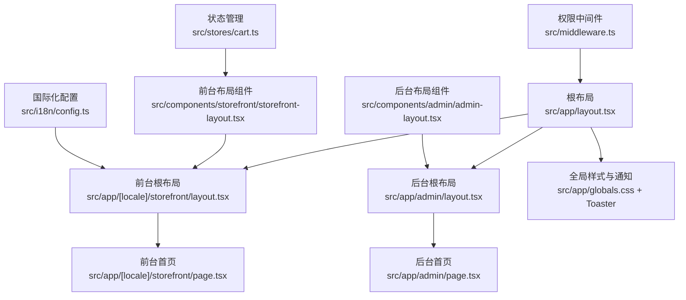

**图表来源**
- [src/app/layout.tsx:17-42](file://src/app/layout.tsx#L17-L42)
- [src/app/[locale]/storefront/layout.tsx:1-L34](file://src/app/[locale]/storefront/layout.tsx#L1-L34)
- [src/app/admin/layout.tsx:1-10](file://src/app/admin/layout.tsx#L1-L10)
- [src/components/storefront/storefront-layout.tsx:21-158](file://src/components/storefront/storefront-layout.tsx#L21-L158)
- [src/components/admin/admin-layout.tsx:46-202](file://src/components/admin/admin-layout.tsx#L46-L202)
- [src/i18n/config.ts:1-4](file://src/i18n/config.ts#L1-L4)
- [src/middleware.ts:40-155](file://src/middleware.ts#L40-L155)
- [src/stores/cart.ts:30-76](file://src/stores/cart.ts#L30-L76)

**章节来源**
- [src/app/layout.tsx:17-42](file://src/app/layout.tsx#L17-L42)
- [src/app/[locale]/storefront/layout.tsx:1-L34](file://src/app/[locale]/storefront/layout.tsx#L1-L34)
- [src/app/admin/layout.tsx:1-10](file://src/app/admin/layout.tsx#L1-L10)

## 核心组件
- 根布局与元数据：定义站点标题、字体变量、全局容器与通知系统
- 前台布局：提供顶部导航、桌面主导航、移动端底部导航与内容区
- 后台布局：提供侧边栏导航、移动端抽屉、顶部标题与内容区
- UI基础组件：按钮、加载指示器、消息提示（Toaster）
- 工具函数：类名合并、价格/日期格式化、订单号生成
- 类型定义：API响应、分页、筛选、JWT载荷、会话用户
- 状态管理：购物车状态管理，支持持久化存储
- 权限中间件：基于JWT的角色验证和路由保护

**章节来源**
- [src/app/layout.tsx:12-42](file://src/app/layout.tsx#L12-L42)
- [src/components/storefront/storefront-layout.tsx:21-158](file://src/components/storefront/storefront-layout.tsx#L21-L158)
- [src/components/admin/admin-layout.tsx:46-202](file://src/components/admin/admin-layout.tsx#L46-L202)
- [src/components/ui/button.tsx:8-61](file://src/components/ui/button.tsx#L8-L61)
- [src/components/ui/sonner.tsx:7-50](file://src/components/ui/sonner.tsx#L7-L50)
- [src/lib/utils.ts:4-32](file://src/lib/utils.ts#L4-L32)
- [src/types/index.ts:1-61](file://src/types/index.ts#L1-L61)
- [src/stores/cart.ts:16-76](file://src/stores/cart.ts#L16-L76)
- [src/middleware.ts:24-31](file://src/middleware.ts#L24-L31)

## 架构总览
下图展示从根布局到各功能域的层级关系与交互路径，体现双模式架构的完整流程。

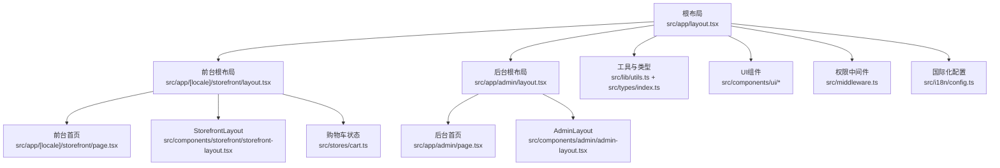

**图表来源**
- [src/app/layout.tsx:17-42](file://src/app/layout.tsx#L17-L42)
- [src/app/[locale]/storefront/layout.tsx:1-L34](file://src/app/[locale]/storefront/layout.tsx#L1-L34)
- [src/app/admin/layout.tsx:1-10](file://src/app/admin/layout.tsx#L1-L10)
- [src/components/storefront/storefront-layout.tsx:21-158](file://src/components/storefront/storefront-layout.tsx#L21-L158)
- [src/components/admin/admin-layout.tsx:46-202](file://src/components/admin/admin-layout.tsx#L46-L202)
- [src/lib/utils.ts:4-32](file://src/lib/utils.ts#L4-L32)
- [src/types/index.ts:1-61](file://src/types/index.ts#L1-L61)
- [src/middleware.ts:40-155](file://src/middleware.ts#L40-L155)
- [src/i18n/config.ts:1-4](file://src/i18n/config.ts#L1-L4)
- [src/stores/cart.ts:30-76](file://src/stores/cart.ts#L30-L76)

## 详细组件分析

### 路由系统与页面结构
- 入口重定向：根路径重定向至多语言前台入口，确保默认访问路径一致
- 动态路由段：使用[locale]实现多语言入口，便于后续扩展语言切换
- 页面组件：前台与后台各自拥有独立的根布局与页面，便于隔离样式与逻辑
- 权限路由：通过中间件实现API、管理后台和前台路由的权限控制

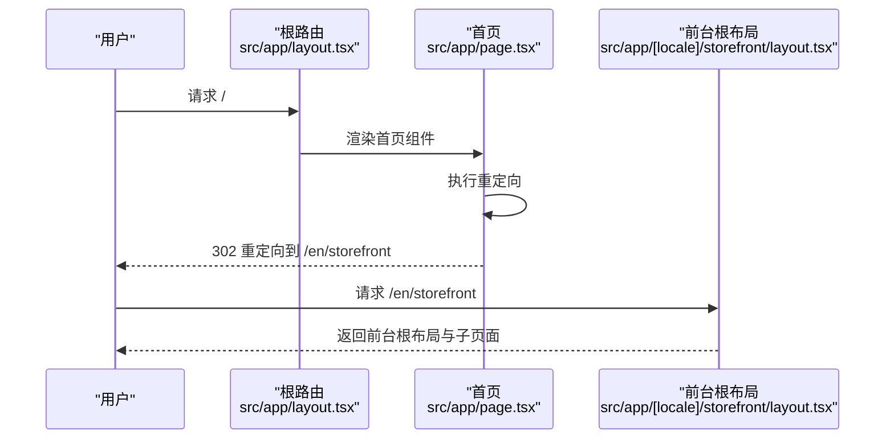

**图表来源**
- [src/app/page.tsx:1-6](file://src/app/page.tsx#L1-L6)
- [src/app/[locale]/storefront/layout.tsx:1-L34](file://src/app/[locale]/storefront/layout.tsx#L1-L34)

**章节来源**
- [src/app/page.tsx:1-6](file://src/app/page.tsx#L1-L6)
- [src/app/[locale]/storefront/layout.tsx:1-L34](file://src/app/[locale]/storefront/layout.tsx#L1-L34)

### 布局层次与模块化组织
- 根布局负责全局样式、字体与通知系统注入
- 前台与后台分别通过各自的根布局封装通用UI骨架
- StorefrontLayout提供桌面与移动端导航、内容区与底部导航
- AdminLayout提供侧边栏、移动端抽屉、顶部标题与内容区

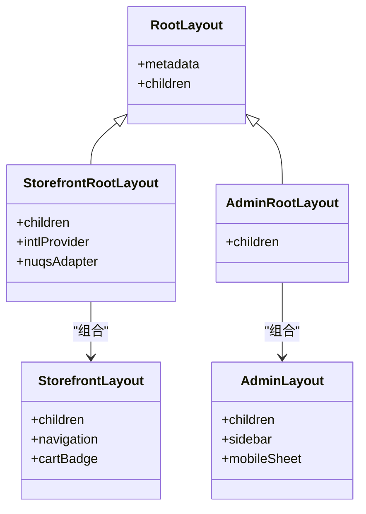

**图表来源**
- [src/app/layout.tsx:17-42](file://src/app/layout.tsx#L17-L42)
- [src/app/[locale]/storefront/layout.tsx:11-L33](file://src/app/[locale]/storefront/layout.tsx#L11-L33)
- [src/app/admin/layout.tsx:3-9](file://src/app/admin/layout.tsx#L3-L9)
- [src/components/storefront/storefront-layout.tsx:32-158](file://src/components/storefront/storefront-layout.tsx#L32-L158)
- [src/components/admin/admin-layout.tsx:46-202](file://src/components/admin/admin-layout.tsx#L46-L202)

**章节来源**
- [src/app/layout.tsx:17-42](file://src/app/layout.tsx#L17-L42)
- [src/components/storefront/storefront-layout.tsx:32-158](file://src/components/storefront/storefront-layout.tsx#L32-L158)
- [src/components/admin/admin-layout.tsx:46-202](file://src/components/admin/admin-layout.tsx#L46-L202)

### 组件化架构与复用策略
- 组件职责清晰：布局组件仅负责结构与导航，业务页面负责内容渲染
- 复用策略：通过根布局与布局组件实现跨页面的统一结构复用
- 变体与尺寸：按钮组件通过变体与尺寸配置实现风格一致性与可扩展性
- 工具函数：集中处理样式合并、格式化与业务辅助方法，降低重复代码
- 状态管理：购物车状态通过Zustand实现，支持持久化存储

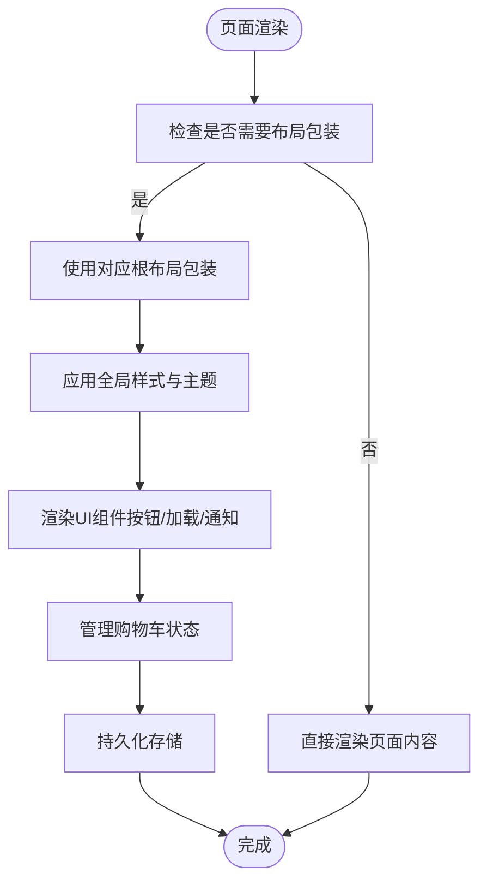

**图表来源**
- [src/components/ui/button.tsx:8-61](file://src/components/ui/button.tsx#L8-L61)
- [src/components/ui/sonner.tsx:7-50](file://src/components/ui/sonner.tsx#L7-L50)
- [src/lib/utils.ts:4-6](file://src/lib/utils.ts#L4-L6)
- [src/stores/cart.ts:30-76](file://src/stores/cart.ts#L30-L76)

**章节来源**
- [src/components/ui/button.tsx:8-61](file://src/components/ui/button.tsx#L8-L61)
- [src/components/ui/sonner.tsx:7-50](file://src/components/ui/sonner.tsx#L7-L50)
- [src/lib/utils.ts:4-6](file://src/lib/utils.ts#L4-L6)
- [src/stores/cart.ts:30-76](file://src/stores/cart.ts#L30-L76)

## 双模式架构设计

### 前台客户模式
前台客户模式面向终端消费者，提供完整的购物流程：
- 商品浏览：支持分类筛选、价格排序、关键词搜索
- 购物车管理：实时购物车状态、数量调整、备注编辑
- 订单处理：订单创建、支付流程、订单历史查看
- 个人中心：用户信息管理、收藏夹、隐私设置

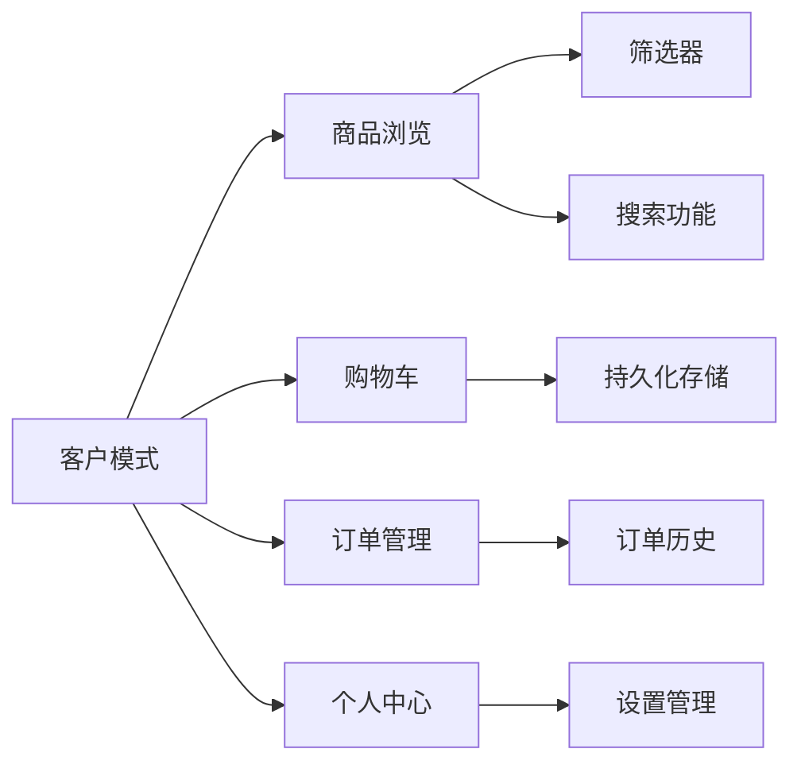

**图表来源**
- [src/app/[locale]/storefront/page.tsx:58-461](file://src/app/[locale]/storefront/page.tsx#L58-L461)
- [src/stores/cart.ts:30-76](file://src/stores/cart.ts#L30-L76)

### 后台管理模式
后台管理模式面向管理员，提供完整的管理系统：
- 仪表盘：销售统计、订单概览、收入图表
- 商品管理：商品 CRUD、库存管理、批量导入
- 订单管理：订单处理、发货跟踪、退款管理
- 客户管理：客户信息、等级管理、行为分析
- 系统设置：配置管理、权限分配、日志监控

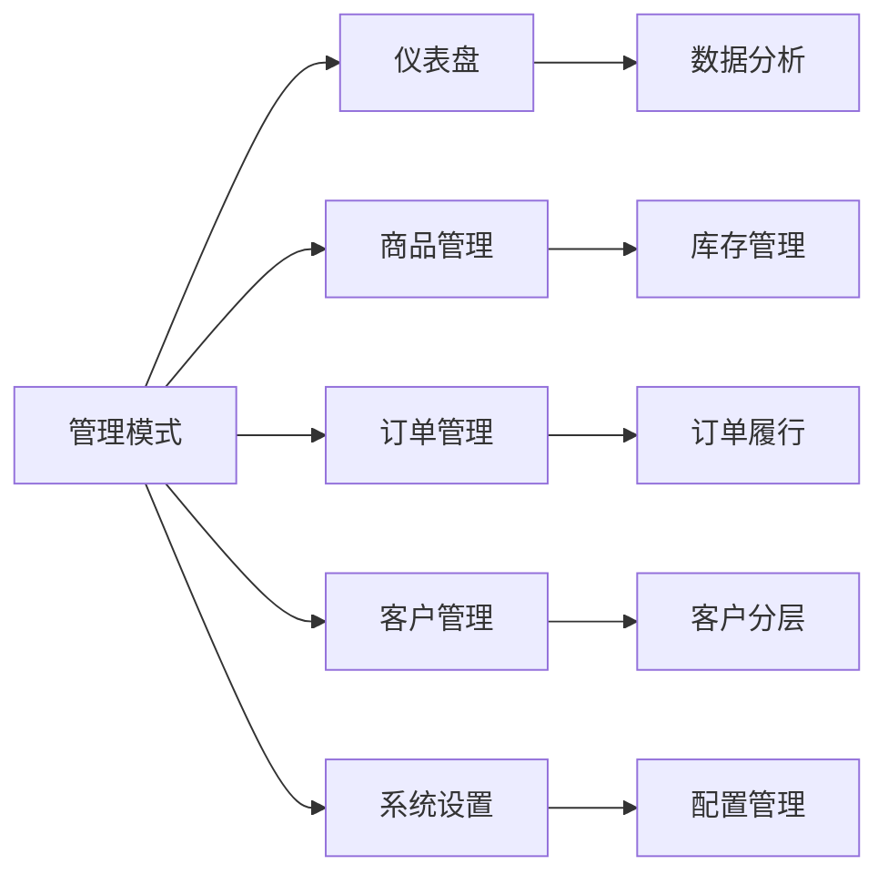

**图表来源**
- [src/app/admin/page.tsx:92-125](file://src/app/admin/page.tsx#L92-L125)
- [src/components/admin/admin-layout.tsx:30-44](file://src/components/admin/admin-layout.tsx#L30-L44)

**章节来源**
- [src/app/[locale]/storefront/page.tsx:58-461](file://src/app/[locale]/storefront/page.tsx#L58-L461)
- [src/app/admin/page.tsx:92-125](file://src/app/admin/page.tsx#L92-L125)
- [src/components/admin/admin-layout.tsx:30-44](file://src/components/admin/admin-layout.tsx#L30-L44)

## 国际化与权限控制

### 国际化中间件
系统采用next-intl实现多语言支持，通过中间件处理语言检测和路由重定向：

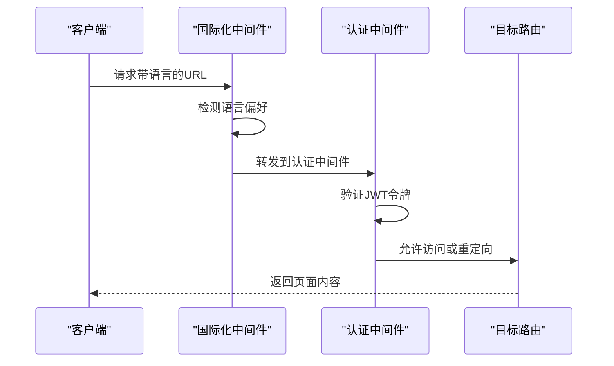

**图表来源**
- [src/middleware.ts:33-38](file://src/middleware.ts#L33-L38)
- [src/middleware.ts:86-151](file://src/middleware.ts#L86-L151)

### 权限控制机制
基于JWT的权限控制系统，支持ADMIN和CUSTOMER两种角色：

| 路由类型 | 角色要求 | 访问控制 | 特殊规则 |
|---------|---------|---------|---------|
| API路由 | 任意登录用户 | JWT验证 | 除认证API外全部需要 |
| 管理后台 | ADMIN | 角色验证 | 登录页除外 |
| 前台路由 | CUSTOMER | 登录验证 | PENDING状态特殊处理 |
| 公共路由 | 无需登录 | 直接访问 | 注册、登录页面 |

**章节来源**
- [src/middleware.ts:40-155](file://src/middleware.ts#L40-L155)
- [src/types/index.ts:41-60](file://src/types/index.ts#L41-L60)
- [src/i18n/config.ts:1-4](file://src/i18n/config.ts#L1-L4)

## 状态管理模式

### Zustand购物车实现
购物车状态管理采用Zustand实现，支持持久化存储和计算属性：

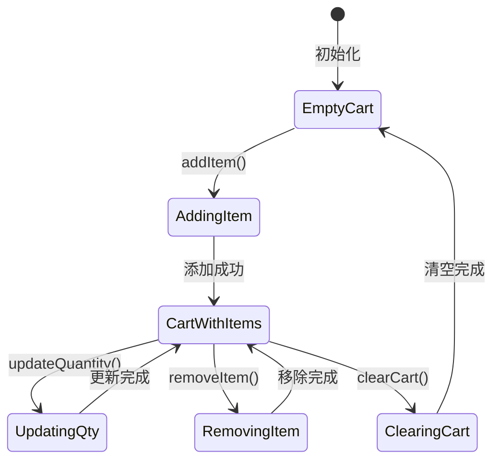

**图表来源**
- [src/stores/cart.ts:30-76](file://src/stores/cart.ts#L30-L76)

### 状态设计特点
- **计算属性**：totalItems自动计算购物车中商品总数
- **持久化存储**：使用localStorage持久化购物车状态
- **原子化操作**：每个操作都是独立的原子状态更新
- **类型安全**：完整的TypeScript类型定义
- **性能优化**：通过状态选择器避免不必要的重新渲染

**章节来源**
- [src/stores/cart.ts:16-76](file://src/stores/cart.ts#L16-L76)
- [src/types/index.ts:4-14](file://src/types/index.ts#L4-L14)

## UI组件库集成

### shadcn/ui集成配置
系统采用shadcn/ui作为核心UI组件库，通过components.json进行统一配置：

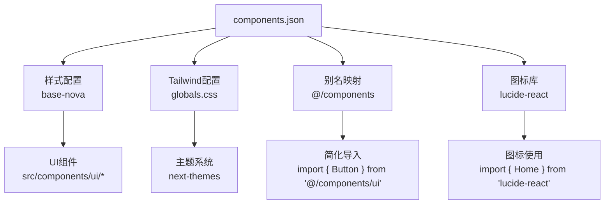

**图表来源**
- [components.json:1-26](file://components.json#L1-L26)
- [src/components/ui/button.tsx:8-61](file://src/components/ui/button.tsx#L8-L61)
- [src/components/ui/sonner.tsx:7-50](file://src/components/ui/sonner.tsx#L7-L50)

### 组件系统特性
- **变体系统**：通过cva实现按钮、输入框等组件的多种变体
- **尺寸控制**：统一的尺寸规格，支持xs、sm、default、lg等
- **主题适配**：与next-themes无缝集成，支持明暗主题切换
- **无障碍支持**：所有组件遵循ARIA标准，支持键盘导航
- **样式合并**：使用clsx和tailwind-merge优化类名处理

**章节来源**
- [components.json:1-26](file://components.json#L1-L26)
- [src/components/ui/button.tsx:8-61](file://src/components/ui/button.tsx#L8-L61)
- [src/components/ui/sonner.tsx:7-50](file://src/components/ui/sonner.tsx#L7-L50)

## 性能优化策略

### Next.js 16.2.1优化特性
- **App Router优势**：并行数据加载、流式传输、增量静态生成
- **代码分割**：自动按需加载页面和组件，减少初始包大小
- **图像优化**：内置next/image支持，自动优化图片格式和尺寸
- **静态导出**：支持output: 'standalone'，便于容器化部署

### 前端性能优化
- **状态优化**：Zustand提供高性能状态管理，避免不必要的重渲染
- **组件优化**：使用React.memo和useMemo优化昂贵计算
- **懒加载**：动态导入重型组件和第三方库
- **缓存策略**：localStorage持久化购物车状态，减少服务器请求
- **动画优化**：使用Framer Motion实现流畅的过渡效果

**章节来源**
- [next.config.ts:4-18](file://next.config.ts#L4-L18)
- [package.json:30-47](file://package.json#L30-L47)
- [src/stores/cart.ts:71-75](file://src/stores/cart.ts#L71-L75)

## 依赖分析
- **运行时依赖**：Next.js 16.2.1、React 19.2.4、Zustand、shadcn/ui、Tailwind CSS、next-themes、sonner、next-intl等
- **开发依赖**：ESLint、TailwindCSS v4、TypeScript、@tailwindcss/postcss等
- **配置文件**：next.config.ts配置国际化插件，components.json定义UI库集成参数

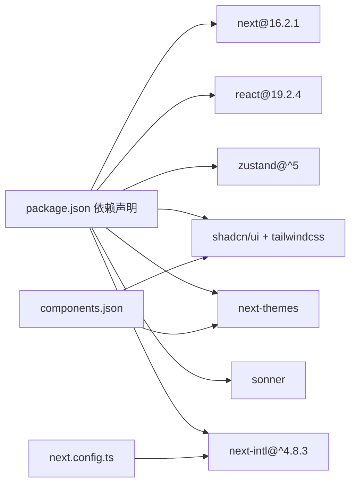

**图表来源**
- [package.json:11-47](file://package.json#L11-L47)
- [components.json:1-26](file://components.json#L1-L26)
- [next.config.ts:1-19](file://next.config.ts#L1-L19)

**章节来源**
- [package.json:11-47](file://package.json#L11-L47)
- [components.json:1-26](file://components.json#L1-L26)
- [next.config.ts:1-19](file://next.config.ts#L1-L19)

## 故障排查指南
- **样式异常**：检查根布局中的全局样式与字体变量是否正确注入
- **通知显示问题**：确认通知组件的主题与样式变量是否与主题系统一致
- **导航高亮**：核对路径匹配逻辑与页面标题映射表，确保导航状态正确
- **购物车状态丢失**：检查localStorage权限和存储容量限制
- **国际化问题**：验证next-intl配置和语言检测逻辑
- **权限错误**：检查JWT令牌格式和中间件路由匹配规则

**章节来源**
- [src/app/layout.tsx:17-42](file://src/app/layout.tsx#L17-L42)
- [src/components/ui/sonner.tsx:7-50](file://src/components/ui/sonner.tsx#L7-L50)
- [src/components/storefront/storefront-layout.tsx:32-43](file://src/components/storefront/storefront-layout.tsx#L32-L43)
- [src/stores/cart.ts:71-75](file://src/stores/cart.ts#L71-L75)
- [src/middleware.ts:40-155](file://src/middleware.ts#L40-L155)

## 结论
本架构以Next.js 16.2.1 App Router为核心，通过根布局与功能域布局实现清晰的层次划分；借助shadcn/ui与Tailwind CSS构建一致的UI体系；通过Zustand实现高效的购物车状态管理；通过国际化中间件和JWT权限控制实现双模式架构的安全性；通过工具函数与类型定义保障可维护性。整体设计兼顾性能、可扩展性与可访问性，为Celestia珠宝品牌的数字化转型提供了坚实的技术基础。

## 附录
- **API响应与分页模型**：统一的响应结构与分页参数，便于前后端协作
- **会话与权限**：基于JWT的会话模型与角色区分，支撑后台管理权限控制
- **国际化支持**：支持英语、阿拉伯语、中文三种语言的完整国际化方案
- **状态持久化**：购物车状态通过localStorage实现跨会话持久化

**章节来源**
- [src/types/index.ts:1-61](file://src/types/index.ts#L1-L61)
- [src/i18n/config.ts:1-4](file://src/i18n/config.ts#L1-L4)
- [src/stores/cart.ts:71-75](file://src/stores/cart.ts#L71-L75)