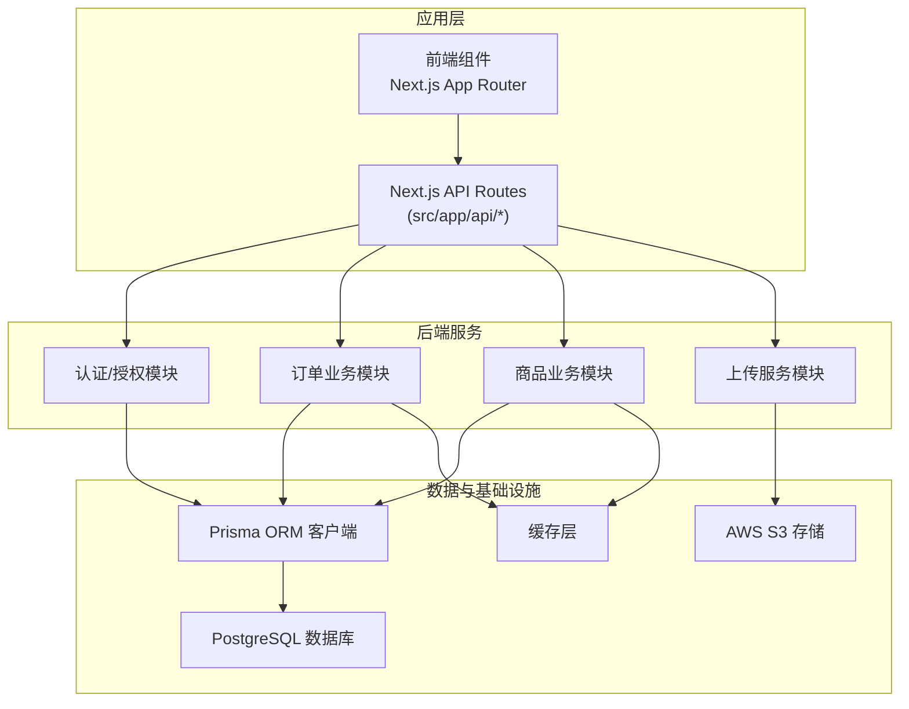
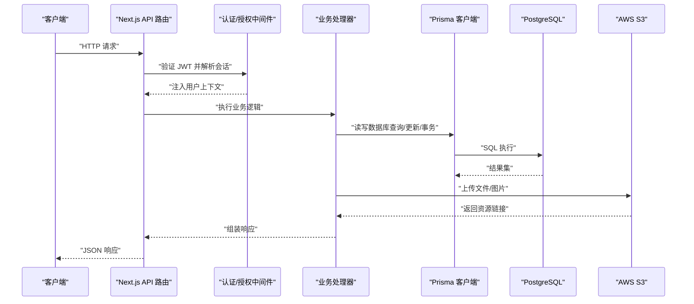
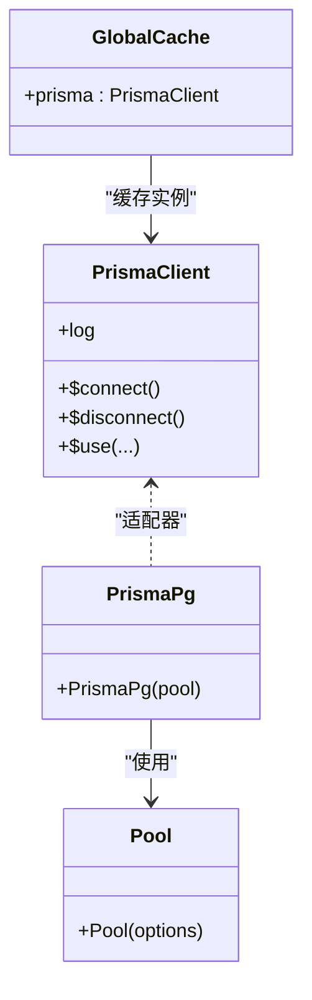
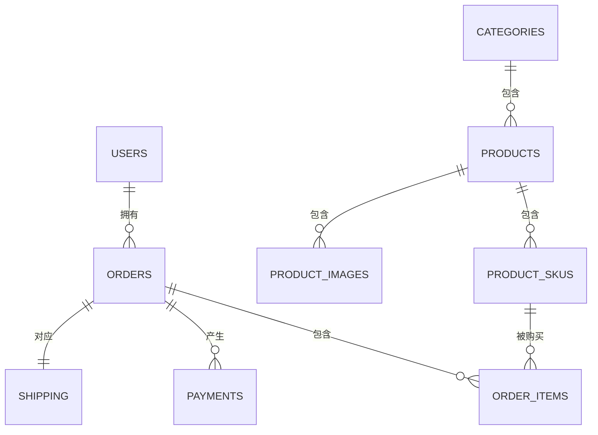
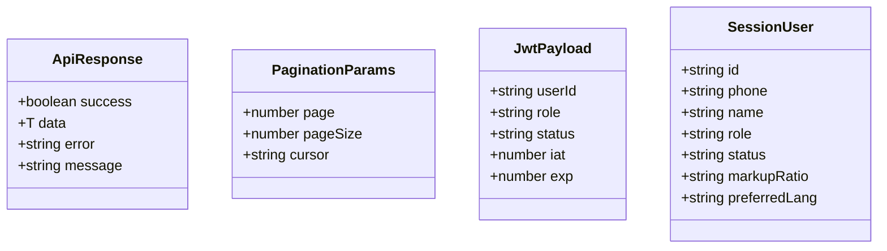
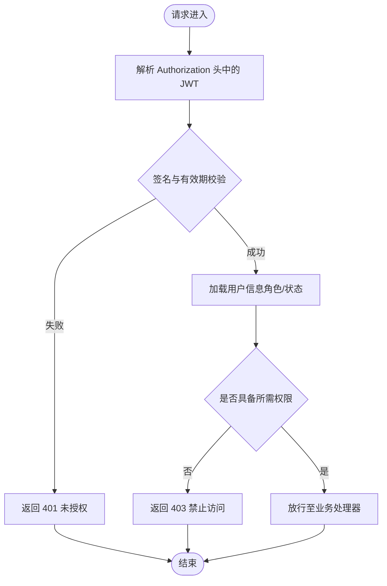
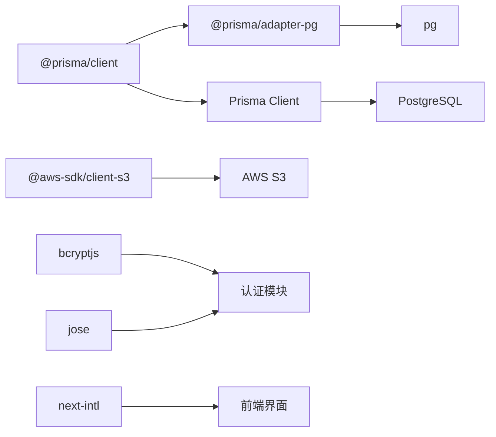

# 后端架构设计

<cite>
**本文档引用的文件**
- [prisma/schema.prisma](file://prisma/schema.prisma)
- [src/lib/db.ts](file://src/lib/db.ts)
- [prisma.config.ts](file://prisma.config.ts)
- [src/lib/constants.ts](file://src/lib/constants.ts)
- [src/lib/utils.ts](file://src/lib/utils.ts)
- [src/types/index.ts](file://src/types/index.ts)
- [package.json](file://package.json)
</cite>

## 目录
1. [简介](#简介)
2. [项目结构](#项目结构)
3. [核心组件](#核心组件)
4. [架构总览](#架构总览)
5. [详细组件分析](#详细组件分析)
6. [依赖分析](#依赖分析)
7. [性能考虑](#性能考虑)
8. [故障排除指南](#故障排除指南)
9. [结论](#结论)
10. [附录](#附录)

## 简介
本文件为 Celestia 项目的后端架构设计文档，聚焦于基于 Prisma ORM 的数据库访问层、Next.js API 路由与中间件体系、认证与授权机制、数据模型设计原则、错误处理与日志监控策略、性能优化方案以及第三方服务集成模式（如 AWS S3）。文档旨在帮助开发者快速理解系统设计，并在后续迭代中保持一致性与可维护性。

## 项目结构
项目采用 Next.js 应用结构，后端逻辑主要集中在以下位置：
- 数据库访问层：通过 Prisma 客户端封装在单例模式中，使用 PostgreSQL 适配器连接数据库。
- 类型与常量：统一定义 API 响应格式、分页参数、订单状态映射、货币与语言等常量。
- 实用工具：提供价格格式化、日期格式化、订单号生成等通用方法。
- 第三方依赖：包含 Prisma、PostgreSQL 客户端、AWS SDK、JWT 处理库等。

**章节来源**
- [src/lib/db.ts:1-18](file://src/lib/db.ts#L1-L18)
- [prisma/schema.prisma:1-281](file://prisma/schema.prisma#L1-L281)
- [package.json:1-52](file://package.json#L1-L52)

## 核心组件
- 数据库访问层（Prisma）：以单例模式初始化 Prisma 客户端，使用 PostgreSQL 适配器，开发环境开启查询日志以便调试。
- API 类型与常量：统一的响应格式、分页参数、订单/订单项状态映射、货币与语言配置。
- 实用工具：价格/日期格式化、订单号生成等。
- 认证与授权：JWT 载荷与会话用户类型定义，结合角色与状态进行权限控制。
- 第三方服务：AWS S3 客户端依赖已引入，可用于图片/文件上传；支付网关可扩展接入。

**章节来源**
- [src/lib/db.ts:1-18](file://src/lib/db.ts#L1-L18)
- [src/lib/constants.ts:1-46](file://src/lib/constants.ts#L1-L46)
- [src/lib/utils.ts:1-32](file://src/lib/utils.ts#L1-L32)
- [src/types/index.ts:1-60](file://src/types/index.ts#L1-L60)
- [package.json:11-38](file://package.json#L11-L38)

## 架构总览
下图展示了从 API 请求到数据库与外部服务的整体交互流程，强调了认证、业务处理、数据持久化与第三方集成的关键节点。

**图表来源**
- [src/lib/db.ts:12-15](file://src/lib/db.ts#L12-L15)
- [src/types/index.ts:41-60](file://src/types/index.ts#L41-L60)

## 详细组件分析

### 数据库访问层（Prisma 单例与连接管理）
- 单例模式：通过全局对象缓存 PrismaClient 实例，避免重复创建连接，提升性能与稳定性。
- PostgreSQL 适配器：使用 PrismaPg 与 pg Pool 连接池配合，支持生产环境连接复用。
- 日志策略：开发环境启用查询日志，便于定位慢查询与异常 SQL；生产环境仅记录错误日志。
- 连接生命周期：在非生产环境将实例挂载至全局对象，确保热重载时共享同一客户端。

**图表来源**
- [src/lib/db.ts:5-17](file://src/lib/db.ts#L5-L17)

**章节来源**
- [src/lib/db.ts:1-18](file://src/lib/db.ts#L1-L18)

### 数据模型与索引策略（Prisma Schema）
- 枚举与状态：用户角色、产品状态、库存状态、订单状态、支付方式、物流方式等，统一管理业务状态流转。
- 实体关系：用户-订单、订单-订单项、商品-SKU、商品-图片、订单-支付、订单-物流等，均通过外键与索引保障查询效率。
- 索引策略：在高频过滤字段上建立索引（如产品分类、订单状态、用户 ID），提升查询性能。
- 字段精度：金额相关字段使用 Decimal 类型并指定精度，保证财务计算准确性。

**图表来源**
- [prisma/schema.prisma:89-281](file://prisma/schema.prisma#L89-L281)

**章节来源**
- [prisma/schema.prisma:1-281](file://prisma/schema.prisma#L1-L281)

### API 类型与常量（统一响应与参数）
- 统一响应格式：success/data/error/message 字段，便于前端一致处理。
- 分页参数：支持页码与游标分页，满足不同场景需求。
- 订单/订单项状态映射：提供中英双语标签与颜色标识，便于管理端展示。
- 货币与语言：定义支持的币种与语言列表，便于国际化展示。
- JWT 载荷与会话用户：明确用户身份、角色与状态，支撑权限控制。

**图表来源**
- [src/types/index.ts:1-60](file://src/types/index.ts#L1-L60)

**章节来源**
- [src/types/index.ts:1-60](file://src/types/index.ts#L1-L60)
- [src/lib/constants.ts:1-46](file://src/lib/constants.ts#L1-L46)

### 实用工具（格式化与订单号生成）
- 价格格式化：根据币种与区域设置输出本地化价格字符串。
- 日期格式化：支持阿拉伯语、中文、英语的日期显示。
- 订单号生成：基于日期与随机字符串生成唯一订单号，便于追踪与检索。

**章节来源**
- [src/lib/utils.ts:1-32](file://src/lib/utils.ts#L1-L32)

### 认证与授权机制（JWT、密码与权限）
- JWT 载荷与会话：定义 JwtPayload 与 SessionUser，包含用户身份、角色与状态，用于鉴权与授权。
- 密码存储：项目依赖 bcryptjs，建议在用户注册/修改密码时进行哈希存储与校验。
- 权限控制：基于用户角色（ADMIN/CUSTOMER）与状态（PENDING/ACTIVE）进行访问控制，管理端与普通用户功能边界清晰。
- 中间件设计：建议在 Next.js API 路由中实现认证中间件，解析 JWT 并注入用户上下文，对敏感接口进行权限校验。

**图表来源**
- [src/types/index.ts:41-60](file://src/types/index.ts#L41-L60)
- [package.json:17](file://package.json#L17)

**章节来源**
- [src/types/index.ts:41-60](file://src/types/index.ts#L41-L60)
- [package.json:17](file://package.json#L17)

### API 路由架构（Next.js API Routes 设计模式）
- 路由组织：采用 Next.js App Router 的约定式路由，将认证、上传等功能拆分为独立 API 路由。
- 中间件系统：建议在 API 层实现统一认证中间件，集中处理 JWT 解析、权限校验与错误处理。
- 请求/响应：统一使用 ApiResponse 格式，便于前后端一致处理。
- 事务处理：对于涉及多表更新（如下单、扣减库存、生成订单项）的复杂流程，建议在业务层使用 Prisma 事务保证一致性。

**章节来源**
- [src/types/index.ts:1-8](file://src/types/index.ts#L1-L8)

### 第三方服务集成（AWS S3 与支付网关）
- AWS S3：项目已引入 @aws-sdk/client-s3，可用于商品图片上传、文件归档等场景。建议在上传前进行鉴权与大小限制检查，并在数据库中仅保存资源链接。
- 支付网关：当前未见具体支付网关实现，可在 API 层新增支付路由，对接外部支付服务（如银行网关、Western Union），并记录支付凭证与状态变更。

**章节来源**
- [package.json:12](file://package.json#L12)

## 依赖分析
- Prisma 生态：@prisma/client、@prisma/adapter-pg、prisma，负责 ORM、适配器与迁移管理。
- 数据库：pg 提供 PostgreSQL 连接池，与 PrismaPg 适配器协同工作。
- 加密与安全：bcryptjs 用于密码哈希，jose 用于 JWT 处理。
- 云服务：@aws-sdk/client-s3 用于 S3 存储集成。
- 国际化与本地化：next-intl 提供多语言支持，配合常量中的语言与货币配置。

**图表来源**
- [package.json:11-38](file://package.json#L11-L38)

**章节来源**
- [package.json:11-38](file://package.json#L11-L38)

## 性能考虑
- 查询优化
  - 使用索引：在高频过滤字段（如产品分类、订单状态、用户 ID）上建立索引，减少全表扫描。
  - 预加载关联：通过 include/select 精准加载所需字段，避免 N+1 查询。
  - 分页策略：优先使用游标分页或基于索引的 limit+offset，避免大偏移量导致的性能问题。
- 缓存策略
  - 读多写少的数据（如商品详情、分类列表）可引入缓存层，降低数据库压力。
  - 对热点数据（如热门商品、首页内容）设置合理过期时间，平衡一致性与性能。
- 并发处理
  - 使用连接池与单例 Prisma 客户端，避免频繁创建/销毁连接。
  - 在高并发场景下，对写操作使用数据库事务与锁机制，确保数据一致性。
- 日志与监控
  - 开发环境开启查询日志，生产环境仅记录错误日志，避免日志风暴。
  - 引入性能指标（如响应时间、吞吐量、错误率）与分布式链路追踪，及时发现瓶颈。

## 故障排除指南
- 数据库连接问题
  - 检查 DATABASE_URL 是否正确配置，连接池参数是否合理。
  - 观察 Prisma 日志（开发环境），定位慢查询与异常 SQL。
- 认证失败
  - 确认 JWT 签名算法与密钥配置正确，检查过期时间与用户状态。
  - 核对中间件是否正确解析 Authorization 头并注入用户上下文。
- 文件上传异常
  - 检查 S3 凭证与桶权限，确认上传大小限制与 MIME 类型白名单。
- 订单状态不一致
  - 对涉及多表更新的流程使用事务包裹，确保原子性与一致性。
  - 在业务层增加幂等性校验，避免重复提交导致的状态错乱。

**章节来源**
- [src/lib/db.ts:12-15](file://src/lib/db.ts#L12-L15)
- [src/types/index.ts:41-60](file://src/types/index.ts#L41-L60)

## 结论
本架构以 Prisma ORM 为核心，结合 Next.js API 路由与中间件体系，构建了清晰的认证授权、数据模型与第三方服务集成框架。通过单例客户端、索引与事务策略、缓存与日志监控，能够在保证一致性的同时提升性能与可维护性。建议在后续迭代中完善支付网关接入、细化权限矩阵，并持续优化查询与缓存策略。

## 附录
- Prisma 配置：通过 prisma.config.ts 指定 schema 与迁移路径，统一数据源配置。
- 常量与类型：集中管理状态映射、分页参数、货币与语言配置，确保跨模块一致性。

**章节来源**
- [prisma.config.ts:1-15](file://prisma.config.ts#L1-L15)
- [src/lib/constants.ts:1-46](file://src/lib/constants.ts#L1-L46)
- [src/types/index.ts:1-60](file://src/types/index.ts#L1-L60)