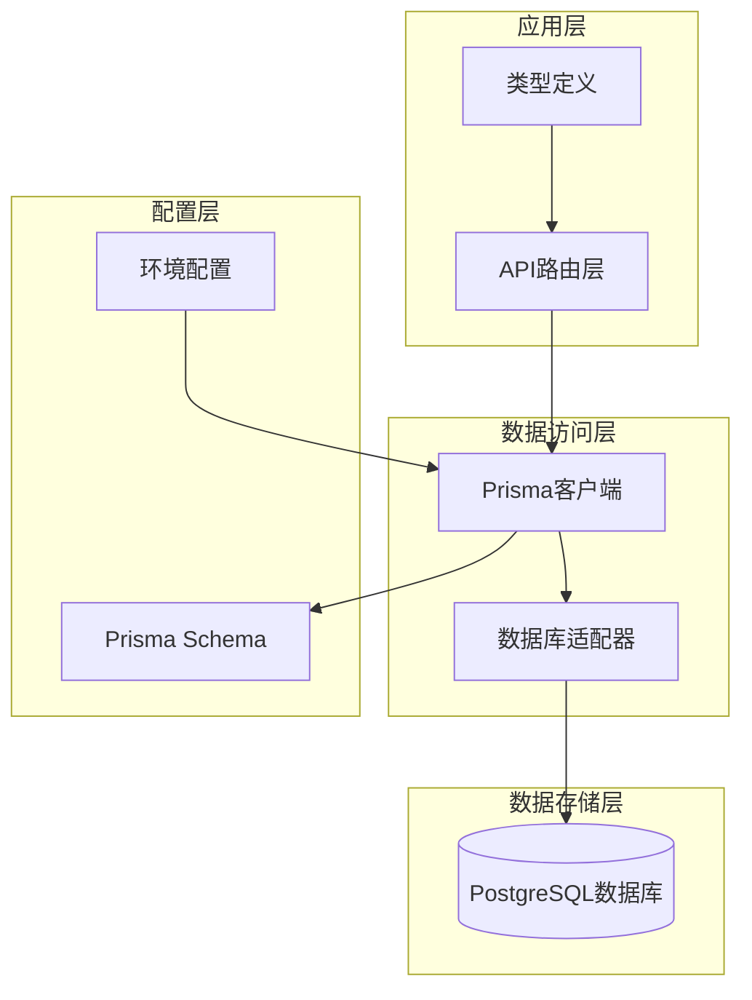
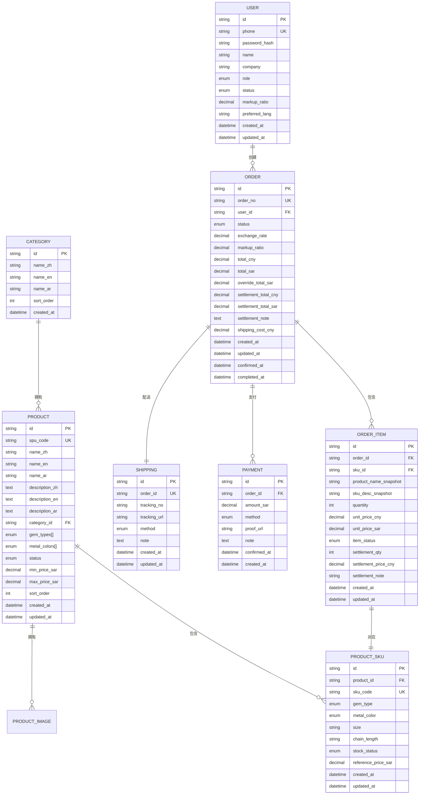
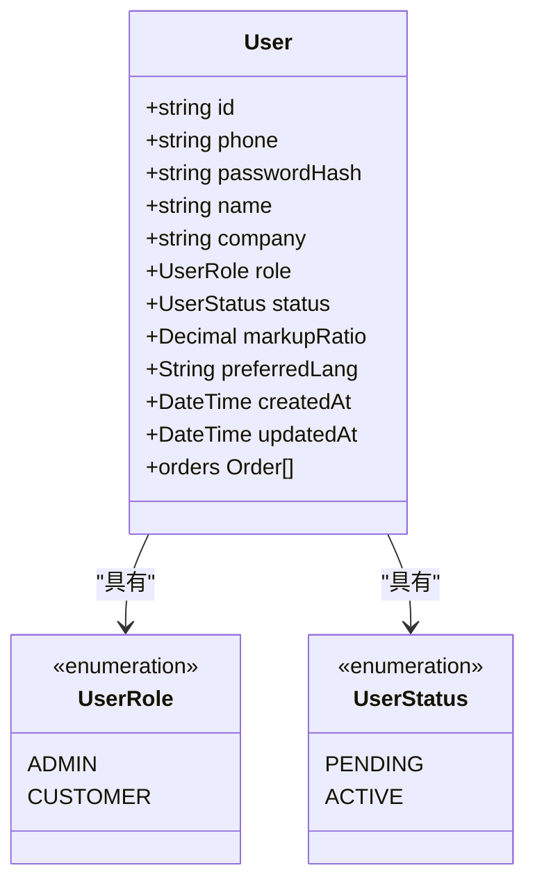
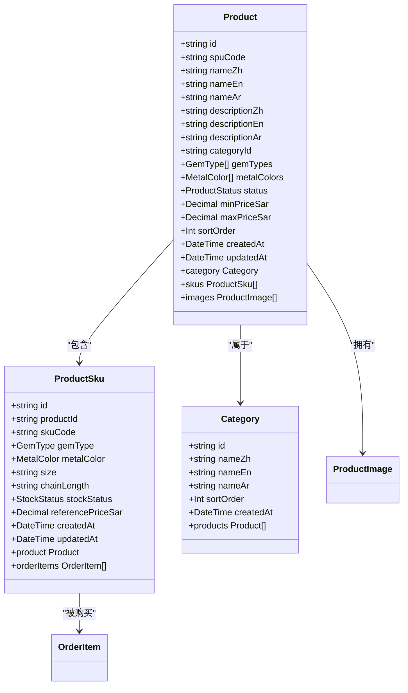
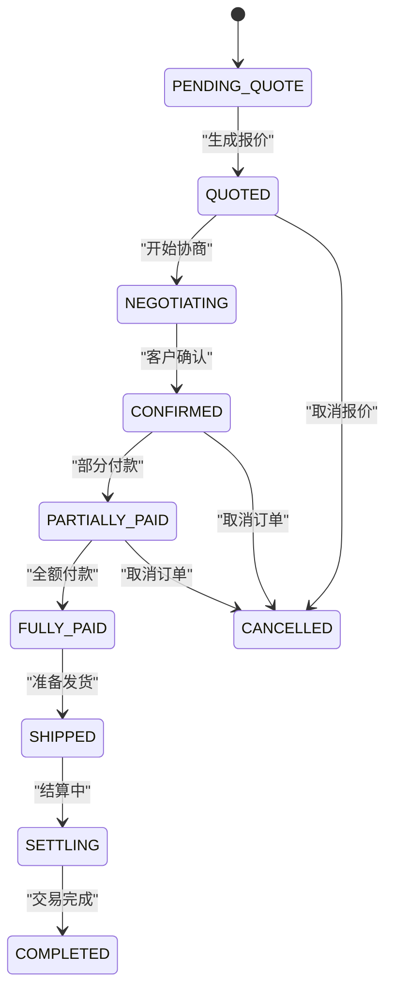
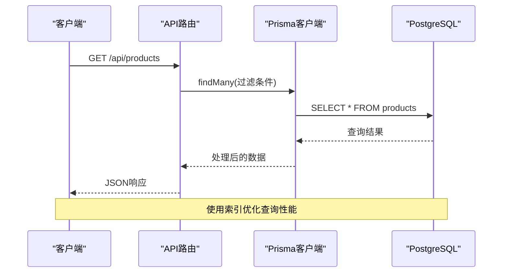
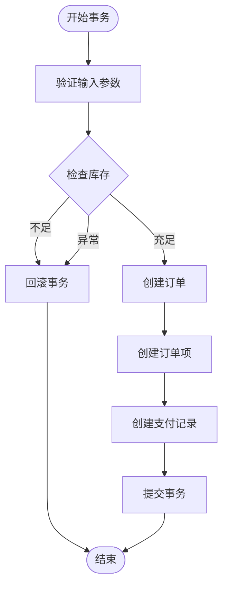
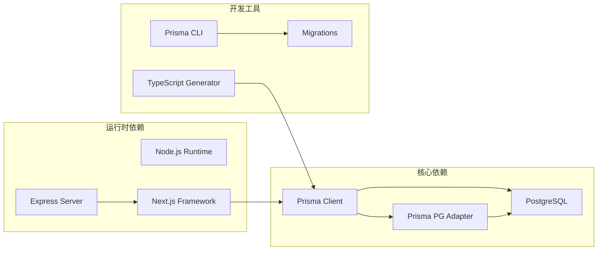
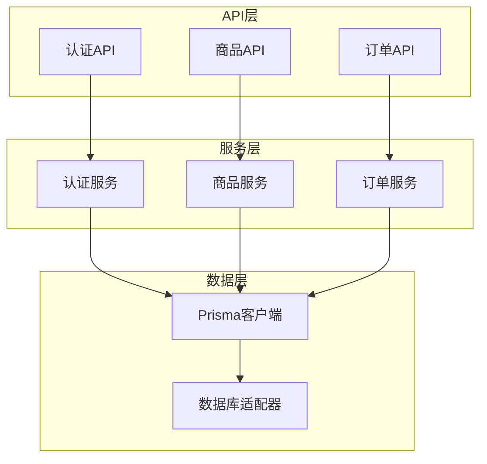
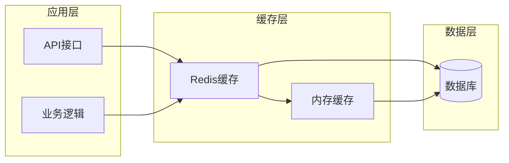

# 数据架构设计

<cite>
**本文档引用的文件**
- [schema.prisma](file://prisma/schema.prisma)
- [db.ts](file://src/lib/db.ts)
- [prisma.config.ts](file://prisma.config.ts)
- [login/route.ts](file://src/app/api/auth/login/route.ts)
- [register/route.ts](file://src/app/api/auth/register/route.ts)
- [index.ts](file://src/types/index.ts)
</cite>

## 目录
1. [简介](#简介)
2. [项目结构](#项目结构)
3. [核心组件](#核心组件)
4. [架构概览](#架构概览)
5. [详细组件分析](#详细组件分析)
6. [依赖关系分析](#依赖关系分析)
7. [性能考虑](#性能考虑)
8. [故障排除指南](#故障排除指南)
9. [结论](#结论)
10. [附录](#附录)

## 简介

Celestia项目采用基于Prisma的数据架构设计，专注于珠宝零售业务场景。该系统通过PostgreSQL数据库存储核心业务数据，包括用户管理、商品目录、订单处理和支付结算等功能模块。

本数据架构文档深入解析了Prisma数据模型设计、数据库表结构、数据访问模式、迁移策略以及安全设计等方面，为系统的稳定运行和扩展提供全面的技术指导。

## 项目结构

项目采用现代化的Next.js架构，数据层通过Prisma ORM实现与数据库的交互。整体项目结构清晰，模块化程度高，便于维护和扩展。

**图表来源**
- [db.ts:1-18](file://src/lib/db.ts#L1-L18)
- [prisma.config.ts:1-15](file://prisma.config.ts#L1-L15)

**章节来源**
- [db.ts:1-18](file://src/lib/db.ts#L1-L18)
- [prisma.config.ts:1-15](file://prisma.config.ts#L1-L15)

## 核心组件

### 数据模型概述

系统采用实体-关系模型设计，包含以下核心实体：

1. **用户管理实体**：支持管理员和客户两种角色
2. **商品目录实体**：包含商品SPU和SKU规格管理
3. **订单处理实体**：完整的订单生命周期管理
4. **支付结算实体**：多渠道支付方式支持
5. **物流配送实体**：订单配送跟踪管理

### 数据库连接配置

系统使用Prisma Client配合PostgreSQL适配器进行数据库连接管理，支持开发和生产环境的不同日志级别配置。

**章节来源**
- [db.ts:1-18](file://src/lib/db.ts#L1-L18)

## 架构概览

**图表来源**
- [schema.prisma:89-280](file://prisma/schema.prisma#L89-L280)

## 详细组件分析

### 用户管理模块

用户模块是整个系统的核心基础，支持多角色权限管理和状态控制。

#### 用户实体设计

**图表来源**
- [schema.prisma:89-106](file://prisma/schema.prisma#L89-L106)
- [schema.prisma:16-24](file://prisma/schema.prisma#L16-L24)

#### 字段类型选择分析

系统采用精确的数值类型来确保金融数据的准确性：

- **Decimal类型**：用于价格计算，精度达到小数点后2位
- **DateTime类型**：支持时间戳记录和更新时间追踪
- **Text类型**：用于长文本描述，如产品详情和备注

**章节来源**
- [schema.prisma:89-106](file://prisma/schema.prisma#L89-L106)

### 商品目录模块

商品目录模块采用SPU-SKU两级结构设计，支持复杂的商品规格管理。

#### 商品实体关系

**图表来源**
- [schema.prisma:122-186](file://prisma/schema.prisma#L122-L186)

#### 库存状态管理

系统通过枚举类型严格控制库存状态，确保库存管理的准确性：

- **IN_STOCK**：有货状态
- **OUT_OF_STOCK**：缺货状态  
- **PRE_ORDER**：预订状态

**章节来源**
- [schema.prisma:151-170](file://prisma/schema.prisma#L151-L170)

### 订单处理模块

订单模块实现了完整的电商订单生命周期管理，从创建到完成的全流程跟踪。

#### 订单状态流转

**图表来源**
- [schema.prisma:49-70](file://prisma/schema.prisma#L49-L70)

#### 订单项状态管理

订单项状态与订单状态保持同步，支持精细化的订单跟踪：

- **PENDING_QUOTE**：待报价状态
- **CONFIRMED**：已确认状态
- **RETURNED**：退货状态
- **CUSTOMER_REMOVED**：客户移除状态

**章节来源**
- [schema.prisma:222-247](file://prisma/schema.prisma#L222-L247)

### 支付结算模块

支付模块支持多种支付方式，满足不同客户的支付需求。

#### 支付方式设计

系统支持以下支付方式：

- **银行转账**：传统银行汇款
- **Western Union**：西联汇款
- **现金支付**：线下现金交易
- **其他方式**：预留扩展接口

**章节来源**
- [schema.prisma:249-264](file://prisma/schema.prisma#L249-L264)

### 数据访问模式

#### 查询优化策略

系统通过合理的索引设计和查询模式实现高效的数据访问：

**图表来源**
- [login/route.ts:29-31](file://src/app/api/auth/login/route.ts#L29-L31)
- [register/route.ts:24-26](file://src/app/api/auth/register/route.ts#L24-L26)

#### 批量操作支持

系统支持批量数据操作，提高数据处理效率：

- **批量插入**：支持商品图片批量上传
- **批量更新**：支持库存状态批量更新
- **批量删除**：支持已删除商品的清理

**章节来源**
- [login/route.ts:13-75](file://src/app/api/auth/login/route.ts#L13-L75)
- [register/route.ts:8-85](file://src/app/api/auth/register/route.ts#L8-L85)

### 事务管理

系统在关键业务操作中使用事务确保数据一致性：

**图表来源**
- [schema.prisma:165](file://prisma/schema.prisma#L165)
- [schema.prisma:260](file://prisma/schema.prisma#L260)

## 依赖关系分析

### 外部依赖关系

系统依赖的关键外部组件：

**图表来源**
- [db.ts:1-3](file://src/lib/db.ts#L1-L3)
- [prisma.config.ts:6-14](file://prisma.config.ts#L6-L14)

### 内部模块依赖

**图表来源**
- [login/route.ts:2-4](file://src/app/api/auth/login/route.ts#L2-L4)
- [register/route.ts:2-4](file://src/app/api/auth/register/route.ts#L2-L4)

**章节来源**
- [db.ts:1-18](file://src/lib/db.ts#L1-L18)
- [prisma.config.ts:1-15](file://prisma.config.ts#L1-L15)

## 性能考虑

### 数据库性能优化

系统通过以下策略优化数据库性能：

1. **索引优化**：为常用查询字段建立索引
   - 用户手机号唯一索引
   - 商品分类关联索引
   - 订单状态查询索引

2. **查询优化**：使用select投影减少数据传输
   - 用户登录时只返回必要字段
   - 注册成功时返回精简用户信息

3. **连接池管理**：合理配置数据库连接池参数

### 缓存策略

虽然当前代码未实现Redis缓存，但系统具备良好的缓存扩展性：

**章节来源**
- [schema.prisma:146](file://prisma/schema.prisma#L146)
- [schema.prisma:217](file://prisma/schema.prisma#L217)

## 故障排除指南

### 常见数据库问题

1. **连接超时问题**
   - 检查DATABASE_URL配置
   - 验证网络连通性
   - 检查PostgreSQL服务状态

2. **查询性能问题**
   - 分析慢查询日志
   - 检查索引使用情况
   - 优化WHERE条件

3. **事务冲突问题**
   - 检查并发访问控制
   - 实施适当的锁机制
   - 优化事务执行时间

### 数据迁移问题

1. **迁移失败处理**
   - 检查迁移文件语法
   - 验证数据库权限
   - 回滚到上一个稳定版本

2. **数据不一致问题**
   - 执行数据完整性检查
   - 手动修复损坏数据
   - 重新应用相关迁移

**章节来源**
- [db.ts:12-15](file://src/lib/db.ts#L12-L15)

## 结论

Celestia项目的数据架构设计体现了现代电商系统的最佳实践。通过精心设计的Prisma数据模型、合理的数据库索引策略和完善的事务管理机制，系统能够有效支持珠宝零售业务的各种复杂场景。

系统的主要优势包括：
- 清晰的实体关系设计
- 精确的数值类型使用
- 完整的订单生命周期管理
- 多种支付方式支持
- 良好的扩展性和维护性

未来可以在现有基础上进一步增强缓存机制、监控告警和自动化运维能力，以支持更大规模的业务发展。

## 附录

### 数据库表结构详情

| 表名 | 主键 | 外键 | 索引 | 约束 |
|------|------|------|------|------|
| users | id | 无 | phone(unique) | 非空约束 |
| categories | id | 无 | 无 | 非空约束 |
| products | id | category_id | category_id, status | 非空约束 |
| product_skus | id | product_id | product_id | 非空约束 |
| product_images | id | product_id | product_id | 非空约束 |
| orders | id | user_id | user_id, status | 非空约束 |
| order_items | id | order_id, sku_id | order_id, sku_id | 非空约束 |
| payments | id | order_id | order_id | 非空约束 |
| shippings | id | order_id(unique) | order_id(unique) | 非空约束 |

### 安全配置建议

1. **数据加密**
   - 敏感字段加密存储
   - 传输层TLS加密
   - 密码哈希存储

2. **访问控制**
   - 角色权限分离
   - API接口鉴权
   - 数据访问限制

3. **审计日志**
   - 操作日志记录
   - 异常事件追踪
   - 审计报告生成