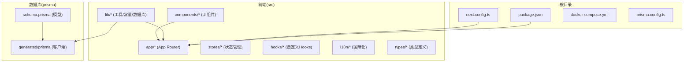
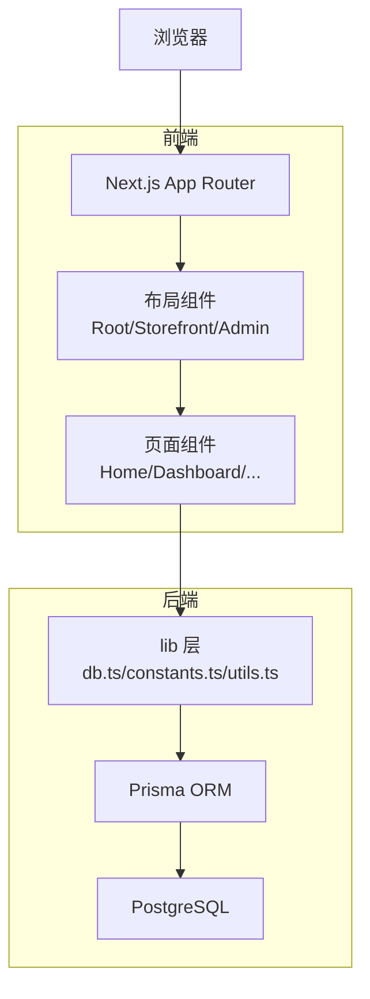
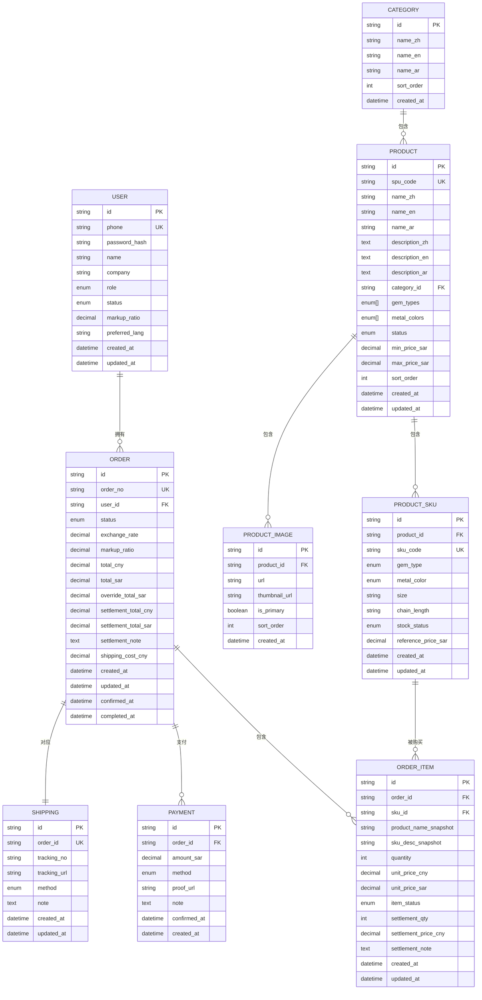
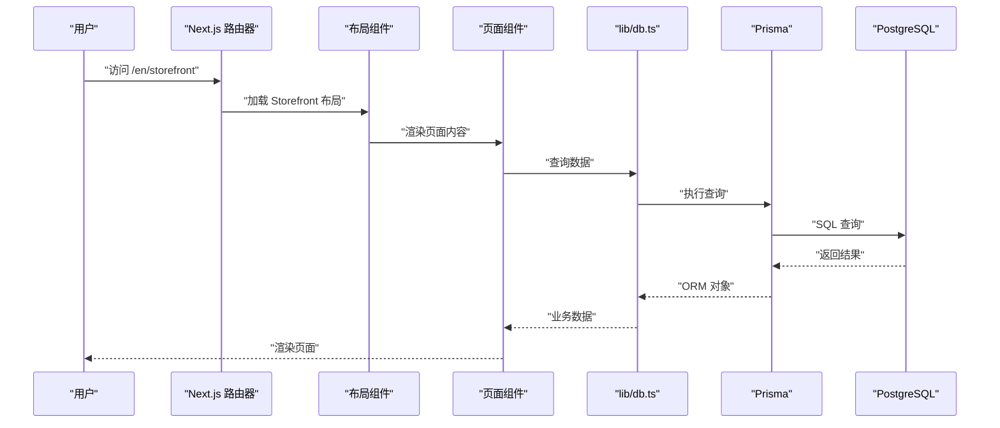
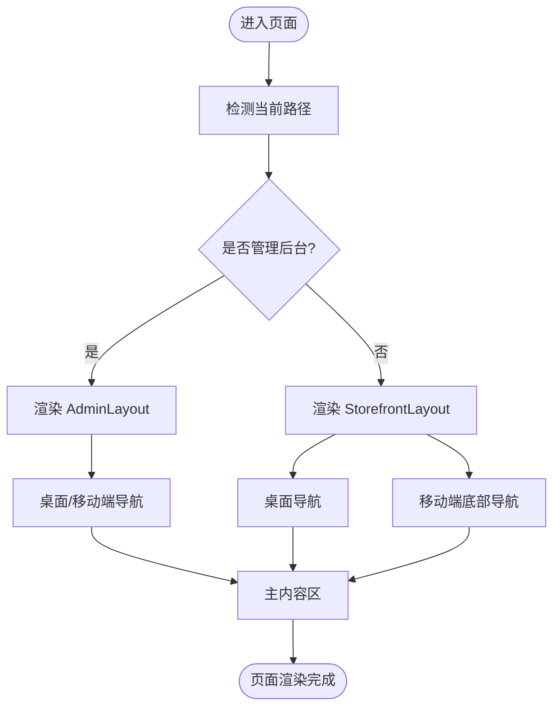
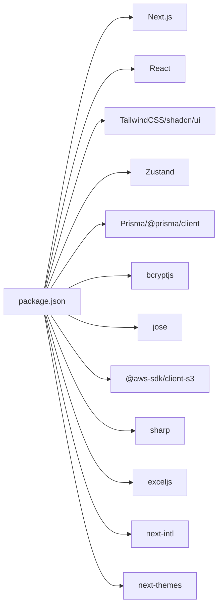

# 架构设计

<cite>
**本文引用的文件**
- [README.md](file://README.md)
- [package.json](file://package.json)
- [next.config.ts](file://next.config.ts)
- [prisma/schema.prisma](file://prisma/schema.prisma)
- [src/lib/db.ts](file://src/lib/db.ts)
- [src/lib/constants.ts](file://src/lib/constants.ts)
- [src/app/layout.tsx](file://src/app/layout.tsx)
- [src/app/[locale]/storefront/layout.tsx](file://src/app/[locale]/storefront/layout.tsx)
- [src/components/storefront/storefront-layout.tsx](file://src/components/storefront/storefront-layout.tsx)
- [src/app/admin/layout.tsx](file://src/app/admin/layout.tsx)
- [src/components/admin/admin-layout.tsx](file://src/components/admin/admin-layout.tsx)
- [src/app/page.tsx](file://src/app/page.tsx)
- [src/app/admin/page.tsx](file://src/app/admin/page.tsx)
- [src/app/[locale]/storefront/page.tsx](file://src/app/[locale]/storefront/page.tsx)
</cite>

## 目录
1. [引言](#引言)
2. [项目结构](#项目结构)
3. [核心组件](#核心组件)
4. [架构总览](#架构总览)
5. [详细组件分析](#详细组件分析)
6. [依赖分析](#依赖分析)
7. [性能考虑](#性能考虑)
8. [故障排查指南](#故障排查指南)
9. [结论](#结论)
10. [附录](#附录)

## 引言
本架构设计文档面向架构师与高级开发者，系统化阐述 Celestia 项目的整体架构与设计理念。项目采用 Next.js App Router 作为前端框架，结合 TypeScript、TailwindCSS 与 shadcn/ui 组件体系，实现现代化的珠宝电商前后端一体化应用。后端以 Prisma ORM 为核心，连接 PostgreSQL 数据库，提供类型安全的数据访问层。系统通过 App Router 的路由约定与布局组件实现清晰的模块边界与职责分离，并在多语言国际化、主题切换、状态管理等方面形成统一的设计与实践。

## 项目结构
项目采用基于功能域的目录组织方式，前端页面与组件按业务域划分，后端数据模型与数据库访问集中在 lib 与 prisma 目录下。整体结构如下：

- 根目录包含构建与运行脚本、Docker 配置、文档与配置文件
- src/app：Next.js App Router 页面与 API 路由，按区域与功能域组织
- src/components：UI 组件与布局组件，支持复用与主题定制
- src/lib：通用工具、常量、数据库连接与业务工具
- prisma：数据库模型定义与迁移配置
- public/assets：静态资源与品牌素材

图表来源
- [package.json:1-50](file://package.json#L1-L50)
- [next.config.ts:1-8](file://next.config.ts#L1-L8)
- [prisma/schema.prisma:1-281](file://prisma/schema.prisma#L1-L281)
- [src/lib/db.ts:1-12](file://src/lib/db.ts#L1-L12)

章节来源
- [README.md:1-37](file://README.md#L1-L37)
- [package.json:1-50](file://package.json#L1-L50)
- [next.config.ts:1-8](file://next.config.ts#L1-L8)

## 核心组件
- 前端框架与构建：Next.js App Router 提供页面路由、布局嵌套、静态生成与服务端渲染能力；TypeScript 提供类型安全；TailwindCSS 与 shadcn/ui 实现一致的视觉与交互体验。
- 数据访问层：Prisma ORM 提供类型安全的数据库操作，支持复杂关联查询与事务处理；通过全局单例 PrismaClient 降低连接开销与重复初始化风险。
- 国际化与主题：next-intl 提供多语言支持；next-themes 提供明暗主题切换；常量集中管理语言、币种、分页与默认加价比例等配置。
- 状态管理：Zustand 用于轻量级前端状态管理，满足购物车、用户会话等场景需求。
- 安全与加密：bcryptjs 用于密码哈希；jose 提供 JWT 相关能力；AWS S3 客户端用于对象存储集成。
- 图像处理：sharp 用于图片压缩与格式转换；exceljs 用于导出报表等场景。

章节来源
- [package.json:11-37](file://package.json#L11-L37)
- [src/lib/db.ts:1-12](file://src/lib/db.ts#L1-L12)
- [src/lib/constants.ts:1-46](file://src/lib/constants.ts#L1-L46)

## 架构总览
系统采用“前端 App Router + 后端 ORM”的分层架构，前端负责页面渲染与交互，后端负责数据持久化与业务规则。App Router 的布局组件提供可复用的头部、侧边栏与移动端导航，形成统一的用户体验。数据流从浏览器请求进入 App Router，经由布局组件与页面组件，调用 lib 层的数据库访问或外部服务，最终返回响应。

图表来源
- [src/app/layout.tsx:17-42](file://src/app/layout.tsx#L17-L42)
- [src/app/[locale]/storefront/layout.tsx:1-10](file://src/app/[locale]/storefront/layout.tsx#L1-L10)
- [src/components/storefront/storefront-layout.tsx:21-99](file://src/components/storefront/storefront-layout.tsx#L21-L99)
- [src/app/admin/layout.tsx:1-10](file://src/app/admin/layout.tsx#L1-L10)
- [src/components/admin/admin-layout.tsx:40-207](file://src/components/admin/admin-layout.tsx#L40-L207)
- [src/lib/db.ts:1-12](file://src/lib/db.ts#L1-L12)
- [prisma/schema.prisma:1-281](file://prisma/schema.prisma#L1-L281)

## 详细组件分析

### 前端架构：React 组件化与状态管理
- 组件化设计：通过布局组件（RootLayout、StorefrontLayout、AdminLayout）实现页面骨架与导航复用，减少重复代码并统一风格。
- 状态管理：使用 Zustand 管理轻量状态（如购物车、用户偏好），避免过度引入复杂状态库带来的学习成本与维护负担。
- 主题与国际化：next-themes 提供主题切换；next-intl 支持 en/ar/zh 多语言；RTL 语言适配与货币符号、分页参数集中管理。
- UI 组件：基于 shadcn/ui 与 TailwindCSS，统一设计令牌与交互反馈；全局通知组件提供一致的用户提示体验。

章节来源
- [src/app/layout.tsx:17-42](file://src/app/layout.tsx#L17-L42)
- [src/components/storefront/storefront-layout.tsx:21-99](file://src/components/storefront/storefront-layout.tsx#L21-L99)
- [src/components/admin/admin-layout.tsx:40-207](file://src/components/admin/admin-layout.tsx#L40-L207)
- [src/lib/constants.ts:1-46](file://src/lib/constants.ts#L1-L46)
- [package.json:36-36](file://package.json#L36-L36)

### 后端架构：Prisma ORM 与 API 设计
- 数据模型：Prisma schema 定义了用户、品类、商品、SKU、图片、订单、订单项、支付与物流等核心实体，枚举类型覆盖业务状态与分类，确保数据一致性与可读性。
- 数据访问：lib/db.ts 通过全局单例模式创建 PrismaClient，开发环境启用日志以便调试，生产环境关闭冗余日志以提升性能。
- API 设计：App Router 的 app/api 目录用于放置 API 路由处理器，遵循 Next.js 的约定式路由与中间件机制，便于扩展认证、限流与审计。

图表来源
- [prisma/schema.prisma:89-281](file://prisma/schema.prisma#L89-L281)

章节来源
- [prisma/schema.prisma:1-281](file://prisma/schema.prisma#L1-L281)
- [src/lib/db.ts:1-12](file://src/lib/db.ts#L1-L12)

### 系统边界与组件交互
- 系统边界：前端通过 Next.js App Router 渲染页面，后端通过 Prisma ORM 访问数据库；API 路由位于 app/api 下，遵循 Next.js 约定。
- 组件交互：RootLayout 作为顶层容器，StorefrontLayout/AdminLayout 在其基础上注入导航与内容区；页面组件仅负责展示与交互逻辑，数据访问通过 lib 层封装。
- 数据流向：浏览器发起请求 → App Router 匹配路由 → 布局组件渲染 → 页面组件执行业务逻辑 → lib/db.ts 调用 Prisma 查询 → 返回结果并渲染。

图表来源
- [src/app/[locale]/storefront/layout.tsx:1-10](file://src/app/[locale]/storefront/layout.tsx#L1-L10)
- [src/components/storefront/storefront-layout.tsx:21-99](file://src/components/storefront/storefront-layout.tsx#L21-L99)
- [src/app/[locale]/storefront/page.tsx:1-26](file://src/app/[locale]/storefront/page.tsx#L1-L26)
- [src/lib/db.ts:1-12](file://src/lib/db.ts#L1-L12)
- [prisma/schema.prisma:1-281](file://prisma/schema.prisma#L1-L281)

章节来源
- [src/app/[locale]/storefront/layout.tsx:1-10](file://src/app/[locale]/storefront/layout.tsx#L1-L10)
- [src/components/storefront/storefront-layout.tsx:21-99](file://src/components/storefront/storefront-layout.tsx#L21-L99)
- [src/app/[locale]/storefront/page.tsx:1-26](file://src/app/[locale]/storefront/page.tsx#L1-L26)
- [src/lib/db.ts:1-12](file://src/lib/db.ts#L1-L12)

### 管理后台与前台布局组件
- 管理后台布局：AdminLayout 提供桌面端与移动端双态导航，支持菜单高亮与退出登录；页面标题根据路径动态生成。
- 前台布局：StorefrontLayout 提供顶部导航与移动端底部导航，支持品牌标识与页面跳转；移动端导航根据当前路径高亮。

图表来源
- [src/components/admin/admin-layout.tsx:40-207](file://src/components/admin/admin-layout.tsx#L40-L207)
- [src/components/storefront/storefront-layout.tsx:21-99](file://src/components/storefront/storefront-layout.tsx#L21-L99)

章节来源
- [src/app/admin/layout.tsx:1-10](file://src/app/admin/layout.tsx#L1-L10)
- [src/components/admin/admin-layout.tsx:40-207](file://src/components/admin/admin-layout.tsx#L40-L207)
- [src/app/[locale]/storefront/layout.tsx:1-10](file://src/app/[locale]/storefront/layout.tsx#L1-L10)
- [src/components/storefront/storefront-layout.tsx:21-99](file://src/components/storefront/storefront-layout.tsx#L21-L99)

### API 路由与认证流程（概念性说明）
- API 路由：位于 app/api 下，遵循 Next.js 约定式路由；可按功能域拆分子目录（如 auth、upload）。
- 认证流程：建议在 API 中间件或路由处理器中进行身份验证与权限校验，结合 JWT 或会话管理；对敏感操作增加速率限制与审计日志。
- 文件上传：结合 AWS S3 客户端进行对象存储上传，支持缩略图生成与格式优化。

（本节为概念性说明，不直接分析具体源文件）

## 依赖分析
- 前端依赖：Next.js 16、React 19、TypeScript、TailwindCSS、shadcn/ui、Lucide React、Zustand、Sonner、next-intl、next-themes。
- 后端依赖：Prisma 7、@prisma/client、bcryptjs、jose、sharp、exceljs、AWS S3 客户端。
- 开发依赖：ESLint、Tailwind PostCSS 插件、TypeScript 类型声明。

图表来源
- [package.json:11-37](file://package.json#L11-L37)

章节来源
- [package.json:1-50](file://package.json#L1-L50)

## 性能考虑
- 构建与运行：使用 Next.js 的静态生成与服务端渲染能力，结合 App Router 的并行数据加载策略，减少首屏渲染时间。
- 数据访问：Prisma 使用全局单例避免重复连接；开发环境开启日志便于定位慢查询，生产环境关闭冗余日志。
- 图像优化：使用 sharp 进行图像压缩与格式转换，结合 CDN 加速静态资源。
- 状态管理：Zustand 轻量高效，适合局部状态管理；避免将大体量数据放入全局状态。
- 国际化：next-intl 按需加载语言包，减少初始包体大小。

（本节提供一般性指导，不直接分析具体源文件）

## 故障排查指南
- 数据库连接问题：检查 PrismaClient 初始化与 NODE_ENV 设置；开发环境可查看查询日志定位异常。
- 路由与布局：确认 App Router 路径与布局组件嵌套关系；移动端导航状态与路径高亮逻辑。
- 国际化与主题：验证语言切换与 RTL 适配；检查主题切换回调与持久化。
- API 路由：核对 app/api 下的路由命名与处理器签名；添加必要的错误处理与状态码返回。

章节来源
- [src/lib/db.ts:1-12](file://src/lib/db.ts#L1-L12)
- [src/components/admin/admin-layout.tsx:40-207](file://src/components/admin/admin-layout.tsx#L40-L207)
- [src/components/storefront/storefront-layout.tsx:21-99](file://src/components/storefront/storefront-layout.tsx#L21-L99)

## 结论
Celestia 项目采用 Next.js App Router 与 Prisma ORM 的现代技术栈，结合组件化与状态管理的最佳实践，实现了清晰的系统边界与良好的可扩展性。通过集中化的常量与配置、统一的主题与国际化方案，以及合理的数据模型设计，项目在保证开发效率的同时兼顾了性能与可维护性。未来可在 API 中间件、监控与日志、缓存策略与灾备方案方面进一步完善，以支撑业务增长与高可用需求。

## 附录
- 入口页面：根路由重定向至多语言前台首页，前台首页提供品牌介绍与欢迎语。
- 常量与配置：集中管理订单状态、币种、分页、默认加价比例与支持语言等，便于统一维护与扩展。

章节来源
- [src/app/page.tsx:1-6](file://src/app/page.tsx#L1-L6)
- [src/app/[locale]/storefront/page.tsx:1-26](file://src/app/[locale]/storefront/page.tsx#L1-L26)
- [src/lib/constants.ts:1-46](file://src/lib/constants.ts#L1-L46)