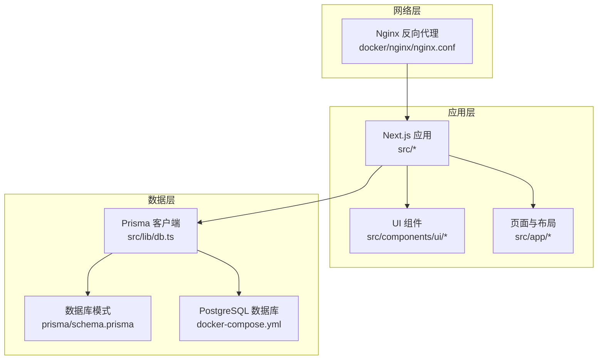
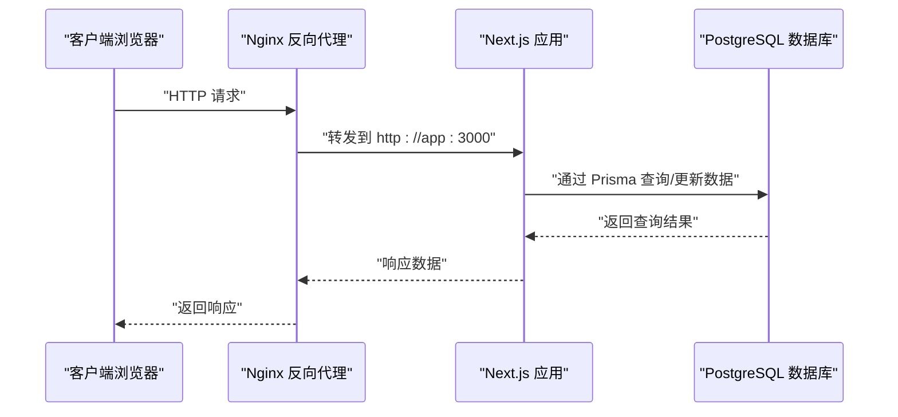
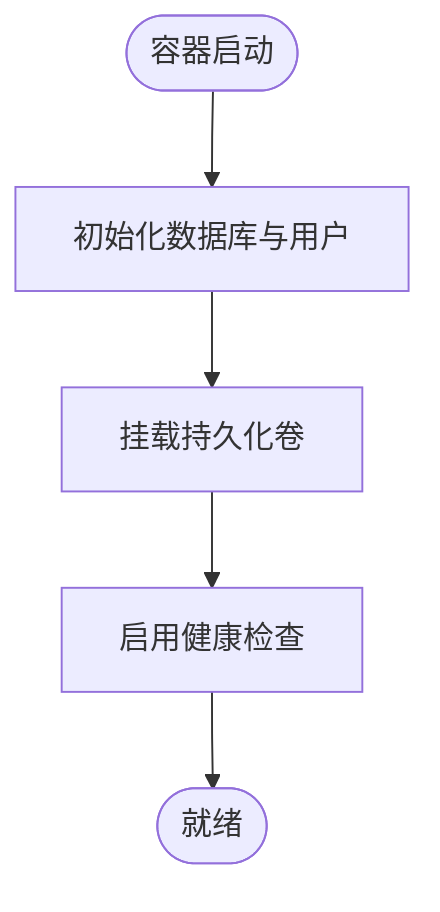
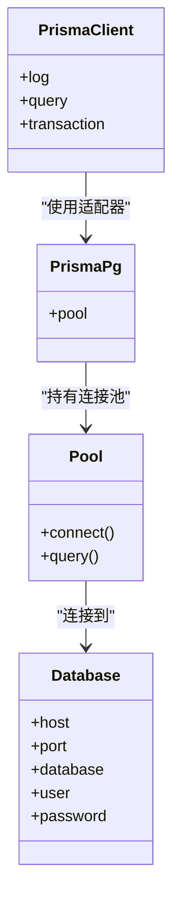
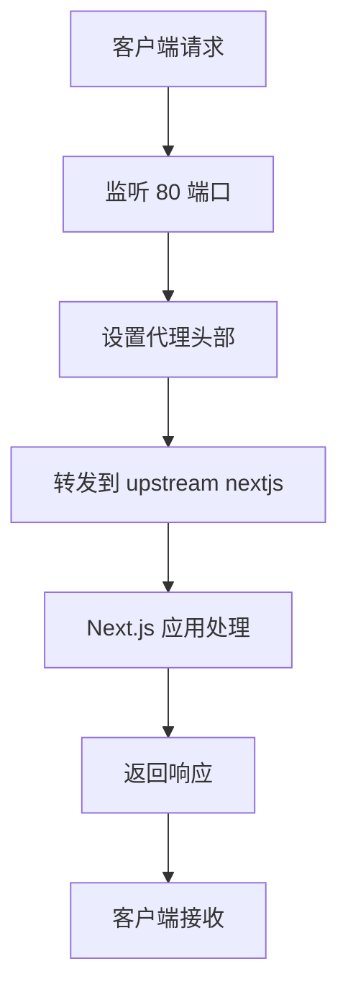

# 部署架构设计

<cite>
**本文档引用的文件**
- [docker-compose.yml](file://docker-compose.yml)
- [nginx.conf](file://docker/nginx/nginx.conf)
- [package.json](file://package.json)
- [README.md](file://README.md)
- [next.config.ts](file://next.config.ts)
- [db.ts](file://src/lib/db.ts)
- [schema.prisma](file://prisma/schema.prisma)
- [loading-spinner.tsx](file://src/components/ui/loading-spinner.tsx)
- [loading.tsx](file://src/app/loading.tsx)
</cite>

## 目录
1. [项目概述](#项目概述)
2. [项目结构](#项目结构)
3. [核心组件](#核心组件)
4. [架构总览](#架构总览)
5. [详细组件分析](#详细组件分析)
6. [依赖关系分析](#依赖关系分析)
7. [性能考虑](#性能考虑)
8. [故障排除指南](#故障排除指南)
9. [结论](#结论)

## 项目概述
本项目是一个基于 Next.js 的前端应用，采用 PostgreSQL 作为数据存储，使用 Prisma 进行数据库建模与访问。当前仓库提供了基础的 Docker Compose 配置和 Nginx 反向代理配置，支持本地开发环境的快速搭建。本文档围绕现有配置，系统化梳理容器化部署架构、反向代理配置、微服务架构设计思路、CI/CD 流水线建议、监控与日志架构以及高可用与扩展性设计。

## 项目结构
项目采用前后端一体化的单体应用结构，核心目录包含：
- docker：容器化相关配置，包含 Nginx 反向代理配置
- src：前端源代码，包含页面、组件、工具函数与数据库连接
- prisma：数据库模式定义与客户端生成
- 根目录：包管理与构建配置文件

**图表来源**
- [docker-compose.yml:1-22](file://docker-compose.yml#L1-L22)
- [nginx.conf:1-26](file://docker/nginx/nginx.conf#L1-L26)
- [db.ts:1-18](file://src/lib/db.ts#L1-L18)
- [schema.prisma:1-281](file://prisma/schema.prisma#L1-L281)

**章节来源**
- [package.json:1-58](file://package.json#L1-L58)
- [README.md:1-37](file://README.md#L1-L37)
- [next.config.ts:1-8](file://next.config.ts#L1-L8)

## 核心组件
- 数据库服务：PostgreSQL 16，通过 Docker Compose 提供持久化存储与健康检查
- 应用服务：Next.js 应用，使用 Prisma 作为 ORM，连接 PostgreSQL
- 反向代理：Nginx，负责请求转发、头部设置与可选的 SSL 终止
- 构建与运行：通过 npm 脚本进行开发、构建与启动

关键实现位置：
- 数据库与卷配置：[docker-compose.yml:1-22](file://docker-compose.yml#L1-L22)
- 数据库连接与 Prisma 初始化：[db.ts:1-18](file://src/lib/db.ts#L1-L18)
- 数据库模式定义：[schema.prisma:1-281](file://prisma/schema.prisma#L1-L281)
- Nginx 反向代理配置：[nginx.conf:1-26](file://docker/nginx/nginx.conf#L1-L26)
- 应用构建与启动脚本：[package.json:5-10](file://package.json#L5-L10)

**章节来源**
- [docker-compose.yml:1-22](file://docker-compose.yml#L1-L22)
- [db.ts:1-18](file://src/lib/db.ts#L1-L18)
- [schema.prisma:1-281](file://prisma/schema.prisma#L1-L281)
- [nginx.conf:1-26](file://docker/nginx/nginx.conf#L1-L26)
- [package.json:5-10](file://package.json#L5-L10)

## 架构总览
下图展示了从客户端到应用、数据库与反向代理的整体交互流程：

**图表来源**
- [nginx.conf:14-24](file://docker/nginx/nginx.conf#L14-L24)
- [db.ts:9-15](file://src/lib/db.ts#L9-L15)
- [docker-compose.yml:2-3](file://docker-compose.yml#L2-L3)

## 详细组件分析

### 数据库服务（PostgreSQL）
- 使用官方 Alpine 镜像，减少体积并提升安全性
- 持久化卷映射至宿主机，确保数据不丢失
- 健康检查使用 pg_isready，周期性检测数据库可用性
- 环境变量配置数据库名称、用户与密码

**图表来源**
- [docker-compose.yml:2-18](file://docker-compose.yml#L2-L18)

**章节来源**
- [docker-compose.yml:2-18](file://docker-compose.yml#L2-L18)

### 应用服务（Next.js + Prisma）
- 应用通过 Prisma 客户端连接 PostgreSQL，使用连接池适配器
- 开发环境下输出查询、错误与警告日志，便于调试
- 生产环境下仅输出错误日志，降低开销

**图表来源**
- [db.ts:1-18](file://src/lib/db.ts#L1-L18)
- [schema.prisma:8-10](file://prisma/schema.prisma#L8-L10)

**章节来源**
- [db.ts:1-18](file://src/lib/db.ts#L1-L18)
- [schema.prisma:8-10](file://prisma/schema.prisma#L8-L10)

### 反向代理（Nginx）
- 将上游服务指向 app:3000，实现请求转发
- 设置必要的代理头部，包括 Host、X-Real-IP、X-Forwarded-For、X-Forwarded-Proto
- 支持 WebSocket 升级与缓存绕过
- 提供可选的 SSL 终止注释块，便于生产环境启用

**图表来源**
- [nginx.conf:14-24](file://docker/nginx/nginx.conf#L14-L24)

**章节来源**
- [nginx.conf:1-26](file://docker/nginx/nginx.conf#L1-L26)

### 构建与运行（Next.js）
- 开发服务器：next dev
- 构建命令：next build
- 启动命令：next start
- ESLint 检查：eslint

**章节来源**
- [package.json:5-10](file://package.json#L5-L10)

### 加载状态与用户体验
- 页面级加载组件：src/app/loading.tsx
- UI 加载指示器：src/components/ui/loading-spinner.tsx
- 统一的加载样式与文案，提升用户感知性能

**章节来源**
- [loading.tsx:1-5](file://src/app/loading.tsx#L1-L5)
- [loading-spinner.tsx:1-35](file://src/components/ui/loading-spinner.tsx#L1-L35)

## 依赖关系分析
应用的核心依赖链如下：
- 应用层依赖 Prisma 客户端与数据库驱动
- Prisma 通过适配器连接 PostgreSQL
- Nginx 作为入口网关，将请求转发给应用
- Docker Compose 管理数据库容器生命周期与健康检查

**图表来源**
- [nginx.conf:14-24](file://docker/nginx/nginx.conf#L14-L24)
- [db.ts:1-18](file://src/lib/db.ts#L1-L18)
- [docker-compose.yml:2-18](file://docker-compose.yml#L2-L18)

**章节来源**
- [package.json:11-44](file://package.json#L11-L44)
- [db.ts:1-18](file://src/lib/db.ts#L1-L18)
- [docker-compose.yml:2-18](file://docker-compose.yml#L2-L18)

## 性能考虑
- 数据库连接池：通过连接池减少连接建立开销，提升并发处理能力
- 日志级别控制：开发环境详细日志，生产环境精简日志，降低 I/O 压力
- 反向代理头部设置：确保应用侧能正确识别客户端 IP、协议与升级请求
- 静态资源优化：建议在生产环境中由 Nginx 或 CDN 提供静态资源服务（当前配置未包含静态资源路径）

## 故障排除指南
- 数据库不可用
  - 检查容器健康状态与日志
  - 验证环境变量与卷挂载
  - 参考：[docker-compose.yml:14-18](file://docker-compose.yml#L14-L18)
- 应用无法连接数据库
  - 确认 DATABASE_URL 环境变量正确
  - 检查 Prisma 初始化逻辑
  - 参考：[db.ts:9-15](file://src/lib/db.ts#L9-L15)
- 反向代理无法转发
  - 检查 upstream 名称与端口
  - 确认代理头部设置
  - 参考：[nginx.conf:14-24](file://docker/nginx/nginx.conf#L14-L24)
- 加载体验问题
  - 使用页面级加载组件与统一加载指示器
  - 参考：[loading.tsx:1-5](file://src/app/loading.tsx#L1-L5)、[loading-spinner.tsx:1-35](file://src/components/ui/loading-spinner.tsx#L1-L35)

**章节来源**
- [docker-compose.yml:14-18](file://docker-compose.yml#L14-L18)
- [db.ts:9-15](file://src/lib/db.ts#L9-L15)
- [nginx.conf:14-24](file://docker/nginx/nginx.conf#L14-L24)
- [loading.tsx:1-5](file://src/app/loading.tsx#L1-L5)
- [loading-spinner.tsx:1-35](file://src/components/ui/loading-spinner.tsx#L1-L35)

## 结论
本项目已具备基础的容器化与反向代理能力，能够支撑本地开发与简单生产场景。为进一步完善部署架构，建议补充以下内容：
- 多阶段 Dockerfile 以优化镜像体积与安全基线
- 容器编排与服务发现（如 Swarm/Kubernetes）以支持弹性与高可用
- CI/CD 流水线（含自动化测试、构建、部署与回滚）
- 监控与日志体系（指标采集、链路追踪与日志聚合）
- 扩展性设计（水平扩展、弹性伸缩与缓存策略）