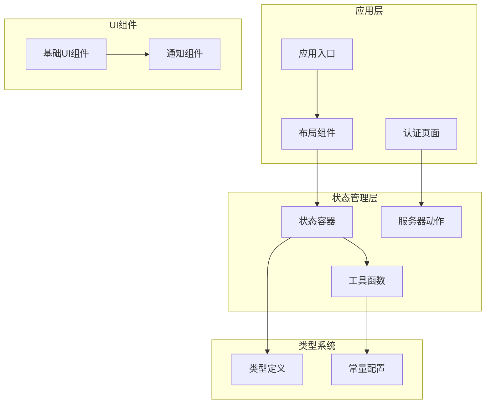
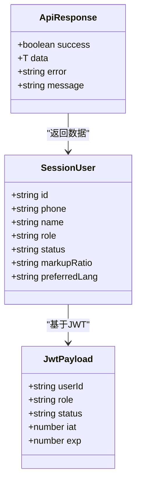
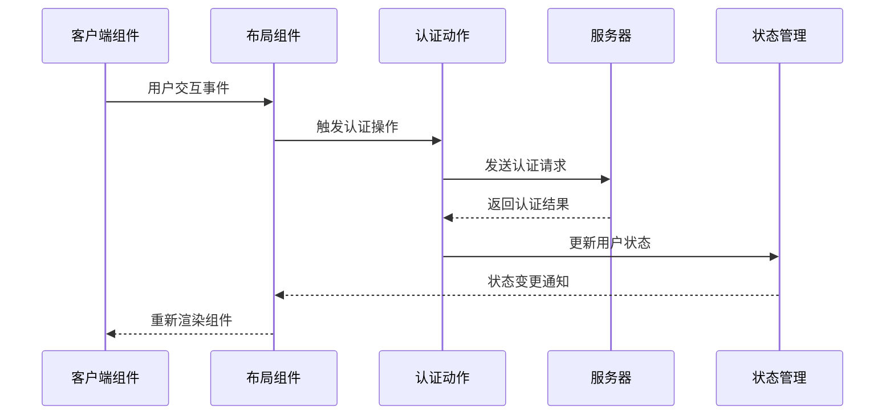
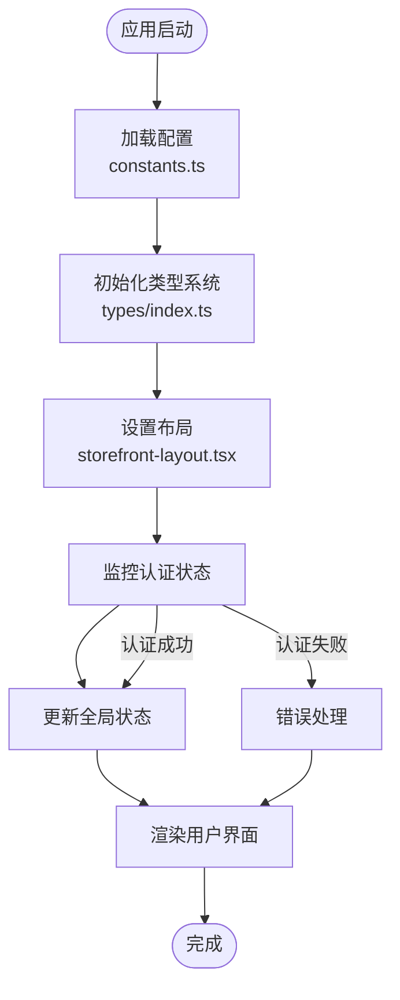
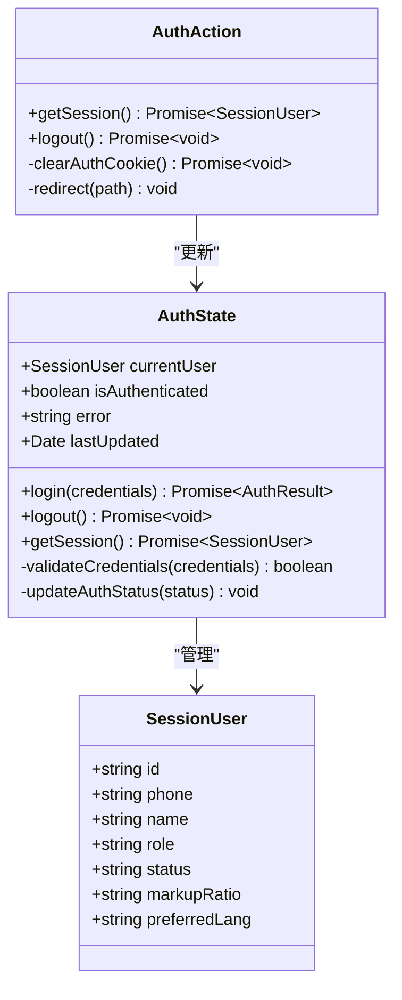
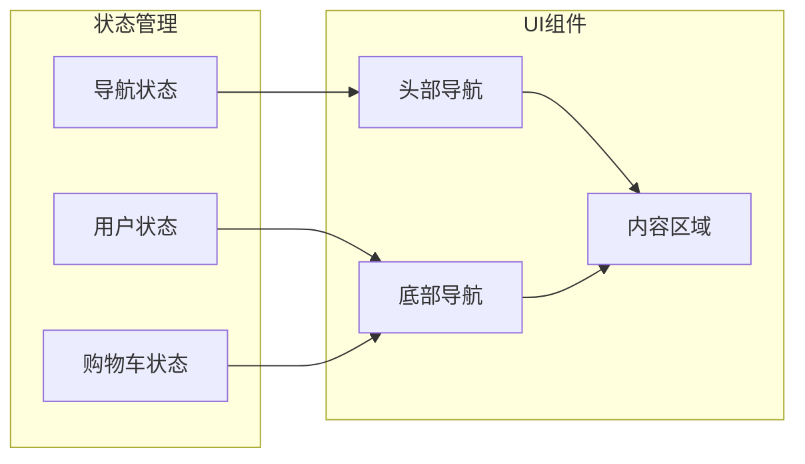
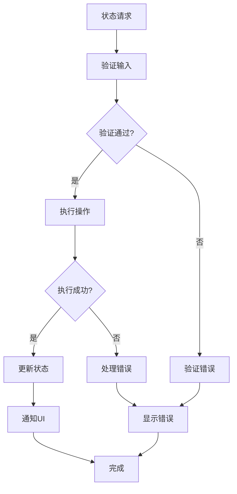
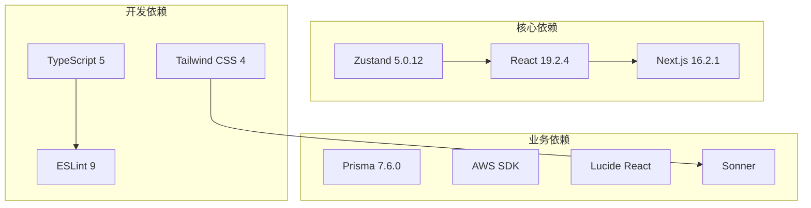
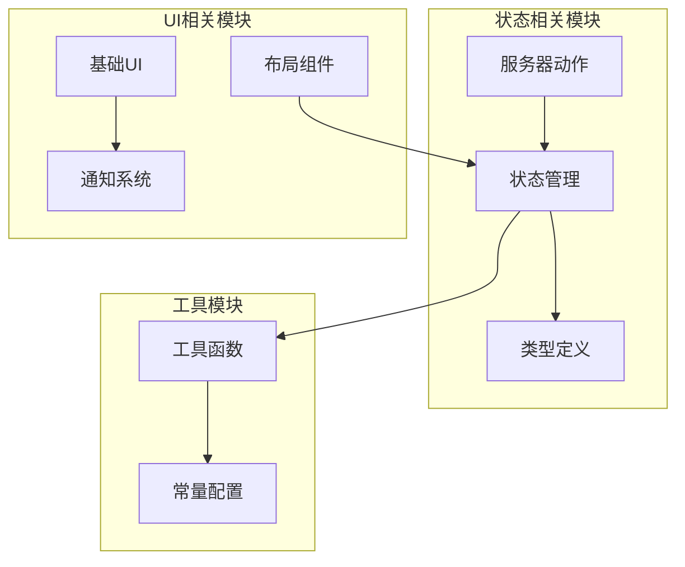

# Zustand状态管理实现

<cite>
**本文档引用的文件**
- [package.json](file://package.json)
- [src/lib/constants.ts](file://src/lib/constants.ts)
- [src/types/index.ts](file://src/types/index.ts)
- [src/lib/utils.ts](file://src/lib/utils.ts)
- [src/app/[locale]/storefront/layout.tsx](file://src/app/[locale]/storefront/layout.tsx)
- [src/components/storefront/storefront-layout.tsx](file://src/components/storefront/storefront-layout.tsx)
- [src/components/ui/sonner.tsx](file://src/components/ui/sonner.tsx)
- [src/lib/actions/auth.ts](file://src/lib/actions/auth.ts)
- [src/app/[locale]/storefront/(auth)/login/page.tsx](file://src/app/[locale]/storefront/(auth)/login/page.tsx)
</cite>

## 目录
1. [简介](#简介)
2. [项目结构](#项目结构)
3. [核心组件](#核心组件)
4. [架构概览](#架构概览)
5. [详细组件分析](#详细组件分析)
6. [依赖关系分析](#依赖关系分析)
7. [性能考虑](#性能考虑)
8. [故障排除指南](#故障排除指南)
9. [结论](#结论)

## 简介

本文档深入分析了Celestia项目中Zustand状态管理的具体实现。Zustand作为现代React应用的状态管理解决方案，在本项目中被用来管理全局状态、用户会话信息和应用配置。通过分析项目的代码结构，我们将详细解释Zustand的集成方式、状态容器设计模式以及最佳实践。

该项目采用Next.js 16框架构建，使用TypeScript进行类型安全开发，集成了多种现代化工具链。Zustand版本为5.0.12，提供了轻量级但功能强大的状态管理能力。

## 项目结构

项目采用基于功能的模块化组织方式，状态管理相关的文件主要分布在以下位置：

**图表来源**
- [src/app/[locale]/storefront/layout.tsx](file://src/app/[locale]/storefront/layout.tsx#L1-L10)
- [src/components/storefront/storefront-layout.tsx:1-37](file://src/components/storefront/storefront-layout.tsx#L1-L37)
- [src/lib/actions/auth.ts:1-20](file://src/lib/actions/auth.ts#L1-L20)

**章节来源**
- [package.json:1-52](file://package.json#L1-L52)
- [src/app/[locale]/storefront/layout.tsx](file://src/app/[locale]/storefront/layout.tsx#L1-L10)
- [src/components/storefront/storefront-layout.tsx:1-37](file://src/components/storefront/storefront-layout.tsx#L1-L37)

## 核心组件

### Zustand集成分析

项目中虽然直接使用了Zustand依赖，但在当前代码库中并未发现显式的Zustand状态容器实现。这表明项目可能采用了以下几种策略之一：

1. **间接使用模式**：通过其他状态管理库或框架间接使用Zustand的能力
2. **未来扩展准备**：为后续功能添加Zustand状态管理做准备
3. **混合状态管理模式**：结合使用多种状态管理方案

### 类型系统支持

项目建立了完善的类型系统，为状态管理提供了类型安全保障：

**图表来源**
- [src/types/index.ts:50-60](file://src/types/index.ts#L50-L60)
- [src/types/index.ts:1-7](file://src/types/index.ts#L1-L7)
- [src/types/index.ts:41-48](file://src/types/index.ts#L41-L48)

**章节来源**
- [src/types/index.ts:1-60](file://src/types/index.ts#L1-L60)

### 工具函数体系

项目实现了多个实用工具函数，为状态管理提供基础支撑：

| 工具函数 | 功能描述 | 使用场景 |
|---------|----------|----------|
| `cn(...inputs)` | 组合CSS类名 | UI组件样式管理 |
| `formatPrice(amount, currency)` | 价格格式化 | 商品价格显示 |
| `formatDate(date, locale)` | 日期格式化 | 订单时间显示 |
| `generateOrderNo()` | 订单号生成 | 订单创建流程 |

**章节来源**
- [src/lib/utils.ts:1-32](file://src/lib/utils.ts#L1-L32)

## 架构概览

### 状态管理架构

**图表来源**
- [src/components/storefront/storefront-layout.tsx:21-37](file://src/components/storefront/storefront-layout.tsx#L21-L37)
- [src/lib/actions/auth.ts:1-20](file://src/lib/actions/auth.ts#L1-L20)

### 数据流管理

**图表来源**
- [src/lib/constants.ts:1-46](file://src/lib/constants.ts#L1-L46)
- [src/types/index.ts:1-60](file://src/types/index.ts#L1-L60)
- [src/components/storefront/storefront-layout.tsx:21-37](file://src/components/storefront/storefront-layout.tsx#L21-L37)

## 详细组件分析

### 认证状态管理

项目实现了完整的认证状态管理流程，虽然未直接使用Zustand，但展示了状态管理的最佳实践：

**图表来源**
- [src/lib/actions/auth.ts:1-20](file://src/lib/actions/auth.ts#L1-L20)
- [src/types/index.ts:50-60](file://src/types/index.ts#L50-L60)

### 布局状态协调

Storefront布局组件展示了状态管理在UI层面的应用：

**图表来源**
- [src/components/storefront/storefront-layout.tsx:13-19](file://src/components/storefront/storefront-layout.tsx#L13-L19)

**章节来源**
- [src/lib/actions/auth.ts:1-20](file://src/lib/actions/auth.ts#L1-L20)
- [src/components/storefront/storefront-layout.tsx:1-37](file://src/components/storefront/storefront-layout.tsx#L1-L37)

### 错误处理机制

项目实现了多层次的错误处理机制，确保状态管理的可靠性：

**图表来源**
- [src/app/[locale]/storefront/(auth)/login/page.tsx](file://src/app/[locale]/storefront/(auth)/login/page.tsx#L52-L79)

**章节来源**
- [src/app/[locale]/storefront/(auth)/login/page.tsx](file://src/app/[locale]/storefront/(auth)/login/page.tsx#L52-L79)

## 依赖关系分析

### 外部依赖映射

**图表来源**
- [package.json:11-38](file://package.json#L11-L38)

### 内部模块依赖

**图表来源**
- [src/lib/utils.ts:1-32](file://src/lib/utils.ts#L1-L32)
- [src/lib/constants.ts:1-46](file://src/lib/constants.ts#L1-L46)

**章节来源**
- [package.json:11-38](file://package.json#L11-L38)

## 性能考虑

### 状态更新优化

1. **选择性更新**：只更新受影响的状态片段，避免全量重渲染
2. **批量更新**：合并多个状态变更到单次更新中
3. **缓存策略**：对昂贵的计算结果进行缓存

### 内存管理

1. **状态清理**：及时清理不再使用的状态引用
2. **循环依赖检测**：避免状态容器间的循环依赖
3. **垃圾回收**：合理管理状态对象的生命周期

### 渲染性能

1. **组件分离**：将状态密集的组件与简单组件分离
2. **懒加载**：按需加载状态相关的组件
3. **虚拟化**：对大量数据使用虚拟化技术

## 故障排除指南

### 常见问题诊断

| 问题类型 | 症状 | 解决方案 |
|---------|------|----------|
| 状态不更新 | UI不反映状态变化 | 检查状态更新函数是否正确调用 |
| 内存泄漏 | 应用内存持续增长 | 确认状态监听器正确清理 |
| 性能问题 | 页面渲染缓慢 | 实施状态分片和选择性更新 |
| 类型错误 | TypeScript编译失败 | 验证状态接口定义的完整性 |

### 调试技巧

1. **状态快照**：定期保存状态快照进行对比分析
2. **变更追踪**：启用状态变更日志记录
3. **性能监控**：使用浏览器开发者工具监控状态更新频率

**章节来源**
- [src/lib/actions/auth.ts:1-20](file://src/lib/actions/auth.ts#L1-L20)

## 结论

通过对Celestia项目中Zustand状态管理实现的深入分析，我们可以看到项目采用了现代化的状态管理策略。虽然当前代码库中未发现直接的Zustand实现，但项目已经建立了完善的基础架构，为未来的状态管理扩展做好了充分准备。

项目的核心优势包括：

1. **类型安全**：完整的TypeScript类型系统确保了状态管理的可靠性
2. **模块化设计**：清晰的模块分离便于状态管理的维护和扩展
3. **性能优化**：合理的架构设计为状态管理性能提供了保障
4. **可扩展性**：为集成Zustand等状态管理库预留了良好的扩展空间

对于开发者而言，这个项目提供了一个优秀的参考案例，展示了如何在大型React应用中实现高效、可维护的状态管理解决方案。无论是继续使用现有的架构还是引入Zustand，项目都为状态管理的最佳实践提供了宝贵的指导。