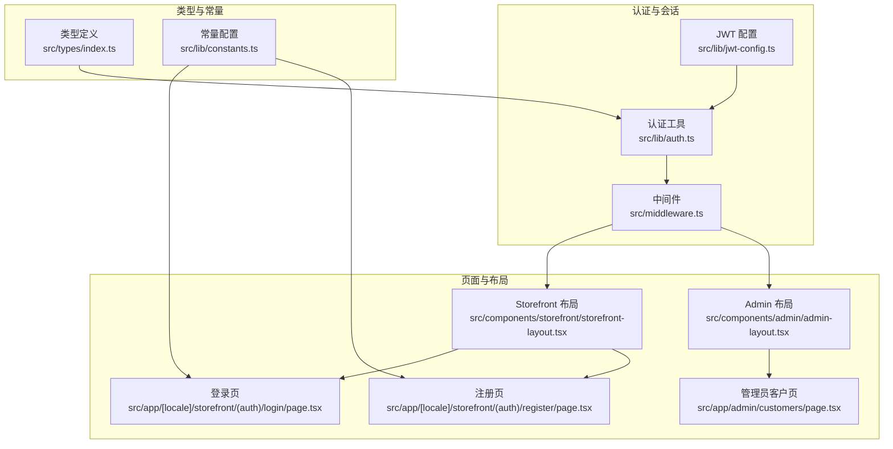
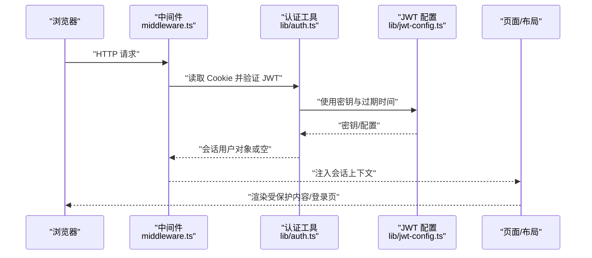
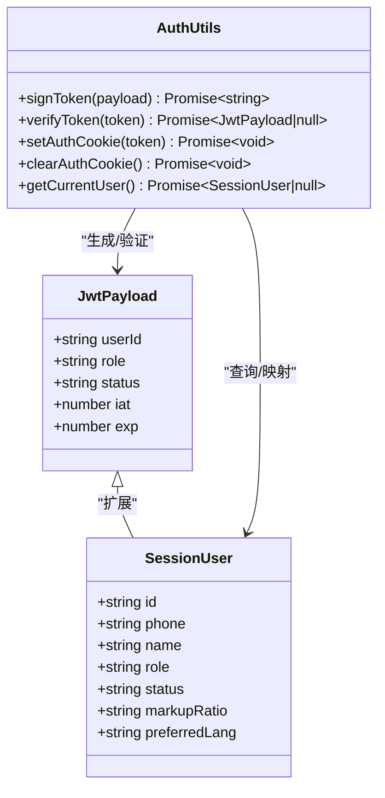
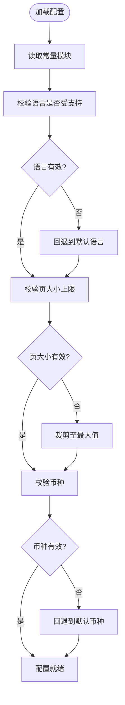
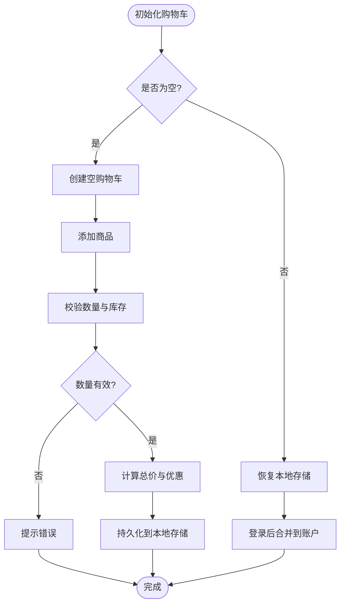
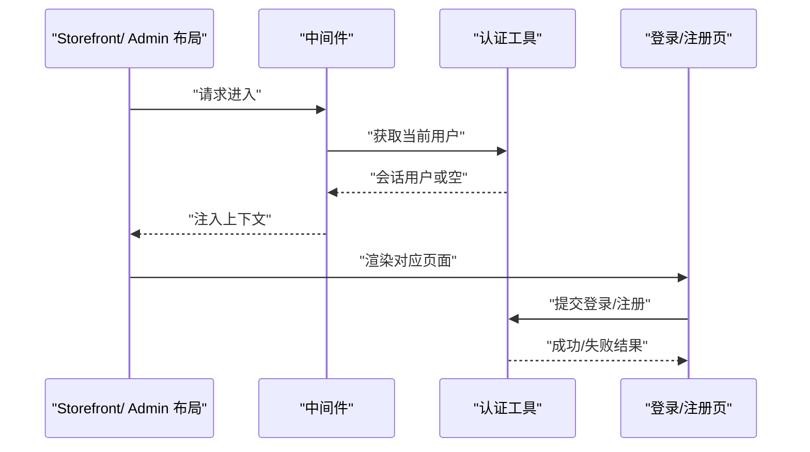
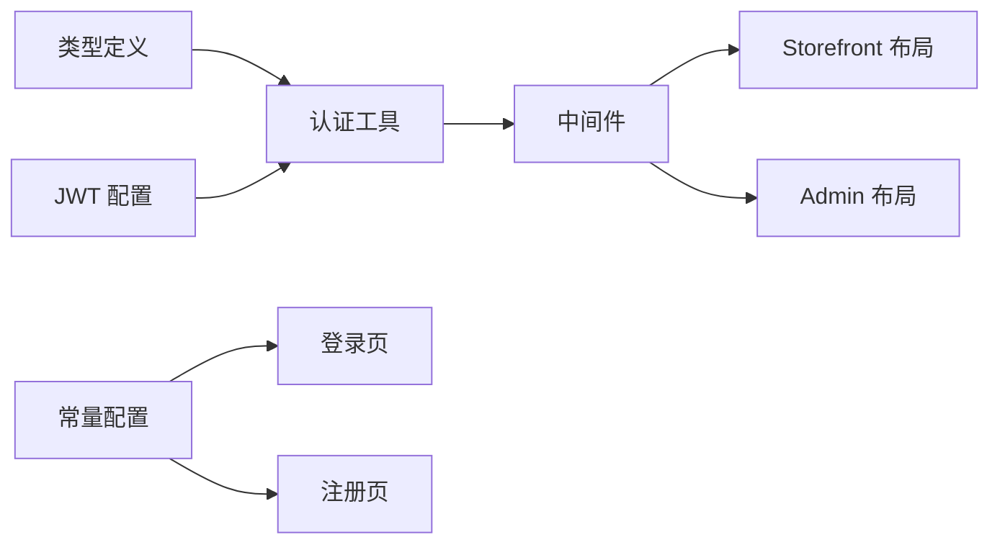

# 全局状态设计

<cite>
**本文引用的文件**
- [src/types/index.ts](file://src/types/index.ts)
- [src/lib/constants.ts](file://src/lib/constants.ts)
- [src/lib/auth.ts](file://src/lib/auth.ts)
- [src/lib/jwt-config.ts](file://src/lib/jwt-config.ts)
- [src/app/[locale]/storefront/(auth)/login/page.tsx](file://src/app/[locale]/storefront/(auth)/login/page.tsx)
- [src/app/[locale]/storefront/(auth)/register/page.tsx](file://src/app/[locale]/storefront/(auth)/register/page.tsx)
- [src/app/admin/customers/page.tsx](file://src/app/admin/customers/page.tsx)
- [src/components/admin/admin-layout.tsx](file://src/components/admin/admin-layout.tsx)
- [src/components/storefront/storefront-layout.tsx](file://src/components/storefront/storefront-layout.tsx)
- [src/middleware.ts](file://src/middleware.ts)
</cite>

## 目录
1. [引言](#引言)
2. [项目结构](#项目结构)
3. [核心组件](#核心组件)
4. [架构总览](#架构总览)
5. [详细组件分析](#详细组件分析)
6. [依赖分析](#依赖分析)
7. [性能考量](#性能考量)
8. [故障排查指南](#故障排查指南)
9. [结论](#结论)
10. [附录](#附录)

## 引言
本文件面向开发者，系统化阐述 Celestia 应用中的“全局状态”设计与实现。尽管项目未采用集中式状态库（如 Redux/Zustand），但通过类型系统、常量配置、认证流程与中间件，形成了清晰的全局状态边界与协作方式。本文围绕以下主题展开：全局状态的架构原则、状态划分策略与层次结构；购物车状态、用户认证状态、应用配置状态的设计思路；命名约定、结构设计与继承关系；状态初始化、默认值与验证规则；可扩展性与未来演进规划。

## 项目结构
项目采用 Next.js App Router 结构，前端状态主要通过以下路径组织：
- 类型与常量：统一在类型定义与常量模块中声明全局可用的数据契约与默认值
- 认证与会话：通过服务端 Cookie 与 JWT 实现跨请求的会话状态
- 页面与布局：在页面层与布局层进行状态的消费与传递
- 中间件：在请求入口处对会话与权限进行统一处理

图表来源
- [src/types/index.ts:1-60](file://src/types/index.ts#L1-L60)
- [src/lib/constants.ts:1-46](file://src/lib/constants.ts#L1-L46)
- [src/lib/auth.ts:1-98](file://src/lib/auth.ts#L1-L98)
- [src/lib/jwt-config.ts:1-9](file://src/lib/jwt-config.ts#L1-L9)
- [src/middleware.ts](file://src/middleware.ts)
- [src/components/storefront/storefront-layout.tsx](file://src/components/storefront/storefront-layout.tsx)
- [src/components/admin/admin-layout.tsx](file://src/components/admin/admin-layout.tsx)
- [src/app/[locale]/storefront/(auth)/login/page.tsx](file://src/app/[locale]/storefront/(auth)/login/page.tsx)
- [src/app/[locale]/storefront/(auth)/register/page.tsx](file://src/app/[locale]/storefront/(auth)/register/page.tsx)
- [src/app/admin/customers/page.tsx](file://src/app/admin/customers/page.tsx)

章节来源
- [src/types/index.ts:1-60](file://src/types/index.ts#L1-L60)
- [src/lib/constants.ts:1-46](file://src/lib/constants.ts#L1-L46)
- [src/lib/auth.ts:1-98](file://src/lib/auth.ts#L1-L98)
- [src/lib/jwt-config.ts:1-9](file://src/lib/jwt-config.ts#L1-L9)
- [src/middleware.ts](file://src/middleware.ts)

## 核心组件
本节聚焦三类“全局状态”的设计与实现要点：

- 用户认证状态（会话）
  - 数据来源：Cookie 中的 JWT，服务端校验后映射为会话用户对象
  - 关键接口：签发、验证、设置 Cookie、清除 Cookie、获取当前用户
  - 生命周期：由中间件在每次请求时注入，页面与布局消费

- 应用配置状态（国际化、分页、货币、加价率等）
  - 数据来源：常量模块导出的配置对象与类型
  - 使用场景：登录/注册表单、列表分页、价格展示、语言切换

- 购物车状态（概念性）
  - 设计建议：以客户端本地状态为主，服务端仅在下单/同步时参与
  - 状态项：商品清单、数量、优惠、总价、收货信息等
  - 与认证状态的关系：匿名与登录用户的购物车可分离存储，登录后合并或迁移

章节来源
- [src/lib/auth.ts:1-98](file://src/lib/auth.ts#L1-L98)
- [src/lib/jwt-config.ts:1-9](file://src/lib/jwt-config.ts#L1-L9)
- [src/lib/constants.ts:1-46](file://src/lib/constants.ts#L1-L46)
- [src/types/index.ts:1-60](file://src/types/index.ts#L1-L60)

## 架构总览
下图展示了“全局状态”的运行时交互：中间件负责加载会话，页面与布局基于会话渲染不同视图；认证工具负责会话的生成与校验；常量模块提供全局配置；类型模块确保数据契约一致。

图表来源
- [src/middleware.ts](file://src/middleware.ts)
- [src/lib/auth.ts:1-98](file://src/lib/auth.ts#L1-L98)
- [src/lib/jwt-config.ts:1-9](file://src/lib/jwt-config.ts#L1-L9)

## 详细组件分析

### 组件一：用户认证状态（会话）
- 设计原则
  - 服务端有界：会话验证与用户查询在服务端完成，避免前端伪造
  - 安全优先：Cookie 使用 httpOnly、secure、sameSite 等安全属性
  - 可观测性：JWT 载荷包含角色与状态，便于中间件快速判定权限

- 状态结构与继承
  - JwtPayload：最小会话载体（用户 ID、角色、状态、签发/过期时间）
  - SessionUser：服务端查询后的完整会话用户对象（含偏好语言、加价率等）
  - 继承关系：SessionUser 可视为 JwtPayload 的“扩展态”，由服务端填充

- 初始化与默认值
  - 初始化：中间件在请求开始时调用认证工具读取 Cookie 并验证
  - 默认值：若无 Cookie 或验证失败，返回空会话，页面据此决定跳转或渲染

- 验证规则
  - 必填字段：userId、role、status
  - 时间有效性：检查 exp 是否过期
  - 存在性：用户记录必须存在且状态有效

- 状态隔离与共享
  - 隔离：每个请求独立验证，避免跨请求污染
  - 共享：中间件将会话注入到后续处理链，页面与布局可直接消费

图表来源
- [src/types/index.ts:41-60](file://src/types/index.ts#L41-L60)
- [src/lib/auth.ts:1-98](file://src/lib/auth.ts#L1-L98)

章节来源
- [src/types/index.ts:41-60](file://src/types/index.ts#L41-L60)
- [src/lib/auth.ts:1-98](file://src/lib/auth.ts#L1-L98)
- [src/lib/jwt-config.ts:1-9](file://src/lib/jwt-config.ts#L1-L9)

### 组件二：应用配置状态（国际化、分页、货币、加价率）
- 设计原则
  - 单一真相源：所有配置集中于常量模块，避免散落字面量
  - 类型安全：导出枚举/联合类型的受控集合，便于编译期校验
  - 国际化友好：状态项包含中英双语标签与 RTL 语言标识

- 状态结构
  - 订单状态配置：包含中文标签、英文标签与颜色标识
  - 订单项状态配置：中文/英文标签
  - 货币配置：币种符号与名称
  - 分页配置：默认页大小与最大页大小
  - 加价率默认值：用于定价策略
  - 语言配置：支持语言列表与 RTL 列表

- 初始化与默认值
  - 初始化：应用启动时加载常量模块，作为全局默认配置
  - 默认值：分页默认值、加价率默认值、语言默认首选项

- 验证规则
  - 语言：必须属于支持列表
  - 分页：页大小不得超出最大限制
  - 货币：必须为已知币种

图表来源
- [src/lib/constants.ts:1-46](file://src/lib/constants.ts#L1-L46)

章节来源
- [src/lib/constants.ts:1-46](file://src/lib/constants.ts#L1-L46)

### 组件三：购物车状态（概念性设计）
- 设计原则
  - 本地优先：购物车在客户端维护，减少服务端压力
  - 登录合并：用户登录后，将匿名购物车迁移到账户下
  - 一致性：与认证状态解耦，避免跨用户污染

- 状态项（建议）
  - 商品清单：商品 ID、规格、数量、单价、小计
  - 优惠：折扣、满减、券码
  - 总价：原价、折后价、税费、运费
  - 收货信息：地址、联系方式
  - 会话关联：匿名/登录用户标识

- 初始化与默认值
  - 初始化：首次访问时创建空购物车
  - 默认值：数量默认 1，总价默认 0，优惠默认空

- 验证规则
  - 数量：必须为正整数且不超过库存
  - 地址：必填字段齐全
  - 价格：非负数，精度符合货币要求

- 状态隔离与共享
  - 隔离：按用户维度隔离（匿名/登录）
  - 共享：登录后通过服务端接口合并购物车

图表来源
- [src/lib/constants.ts:31-38](file://src/lib/constants.ts#L31-L38)

章节来源
- [src/lib/constants.ts:31-38](file://src/lib/constants.ts#L31-L38)

### 组件四：页面与布局中的状态消费
- Storefront 布局与 Admin 布局
  - 根据会话角色显示菜单与功能
  - 在登录/注册页根据会话状态重定向

- 登录/注册页
  - 使用常量模块中的语言与分页配置
  - 通过认证工具发起登录/注册流程

图表来源
- [src/components/storefront/storefront-layout.tsx](file://src/components/storefront/storefront-layout.tsx)
- [src/components/admin/admin-layout.tsx](file://src/components/admin/admin-layout.tsx)
- [src/app/[locale]/storefront/(auth)/login/page.tsx](file://src/app/[locale]/storefront/(auth)/login/page.tsx)
- [src/app/[locale]/storefront/(auth)/register/page.tsx](file://src/app/[locale]/storefront/(auth)/register/page.tsx)
- [src/lib/auth.ts:1-98](file://src/lib/auth.ts#L1-L98)

章节来源
- [src/components/storefront/storefront-layout.tsx](file://src/components/storefront/storefront-layout.tsx)
- [src/components/admin/admin-layout.tsx](file://src/components/admin/admin-layout.tsx)
- [src/app/[locale]/storefront/(auth)/login/page.tsx](file://src/app/[locale]/storefront/(auth)/login/page.tsx)
- [src/app/[locale]/storefront/(auth)/register/page.tsx](file://src/app/[locale]/storefront/(auth)/register/page.tsx)
- [src/lib/auth.ts:1-98](file://src/lib/auth.ts#L1-L98)

## 依赖分析
- 类型与常量
  - 类型定义为认证与页面提供契约约束
  - 常量模块为国际化、分页、货币等提供默认值与校验集合

- 认证工具
  - 依赖 JWT 配置进行签名与验证
  - 依赖数据库查询完善会话用户信息

- 中间件
  - 依赖认证工具加载会话，为后续页面与布局提供上下文

图表来源
- [src/types/index.ts:1-60](file://src/types/index.ts#L1-L60)
- [src/lib/constants.ts:1-46](file://src/lib/constants.ts#L1-L46)
- [src/lib/auth.ts:1-98](file://src/lib/auth.ts#L1-L98)
- [src/lib/jwt-config.ts:1-9](file://src/lib/jwt-config.ts#L1-L9)
- [src/middleware.ts](file://src/middleware.ts)

章节来源
- [src/types/index.ts:1-60](file://src/types/index.ts#L1-L60)
- [src/lib/constants.ts:1-46](file://src/lib/constants.ts#L1-L46)
- [src/lib/auth.ts:1-98](file://src/lib/auth.ts#L1-L98)
- [src/lib/jwt-config.ts:1-9](file://src/lib/jwt-config.ts#L1-L9)
- [src/middleware.ts](file://src/middleware.ts)

## 性能考量
- 会话验证成本
  - JWT 验证为纯内存操作，开销极低
  - 用户查询仅在需要时执行，避免不必要的数据库访问

- 配置缓存
  - 常量模块在应用启动时加载一次，后续复用，无需重复解析

- 页面渲染优化
  - 将会话注入到布局，避免页面重复请求
  - 对高频配置（如分页）在客户端缓存，减少重复计算

## 故障排查指南
- JWT 密钥缺失
  - 现象：启动时报错，提示环境变量未配置
  - 处理：检查环境变量并重新部署

- Cookie 安全属性导致跨域问题
  - 现象：开发环境下无法设置 secure Cookie
  - 处理：在开发环境关闭 secure 或使用 http

- 会话为空
  - 现象：页面显示登录页或权限不足
  - 处理：检查 Cookie 是否被删除、JWT 是否过期、用户是否存在

- 语言/币种不生效
  - 现象：界面语言或货币显示异常
  - 处理：确认语言在支持列表内、币种配置正确

章节来源
- [src/lib/jwt-config.ts:1-9](file://src/lib/jwt-config.ts#L1-L9)
- [src/lib/auth.ts:1-98](file://src/lib/auth.ts#L1-L98)
- [src/lib/constants.ts:1-46](file://src/lib/constants.ts#L1-L46)

## 结论
Celestia 的全局状态通过“类型契约 + 常量配置 + 服务端认证 + 中间件注入”的组合实现，既保证了安全性与一致性，又具备良好的可扩展性。购物车状态建议采用客户端本地状态与服务端合并的模式；认证状态以 JWT 为核心，配合严格的验证与安全属性；应用配置状态集中管理，确保全局一致。未来可在保持现有边界的前提下，引入轻量级状态库或事件驱动模型，进一步降低页面与布局间的耦合。

## 附录
- 状态命名约定（建议）
  - 会话：SessionUser、JwtPayload
  - 配置：SUPPORTED_LOCALES、CURRENCIES、PAGINATION
  - 购物车：Cart、CartItem、CartActions

- 状态结构设计（建议）
  - 使用只读/冻结对象，避免意外修改
  - 为可选字段提供明确的默认值与校验逻辑

- 状态继承关系（建议）
  - 会话扩展：JwtPayload -> SessionUser
  - 配置聚合：基础配置 -> 页面/组件特定配置

- 初始化与验证（建议）
  - 启动阶段：加载常量与默认配置
  - 请求阶段：中间件加载会话并验证
  - 运行阶段：页面/布局消费状态并触发验证