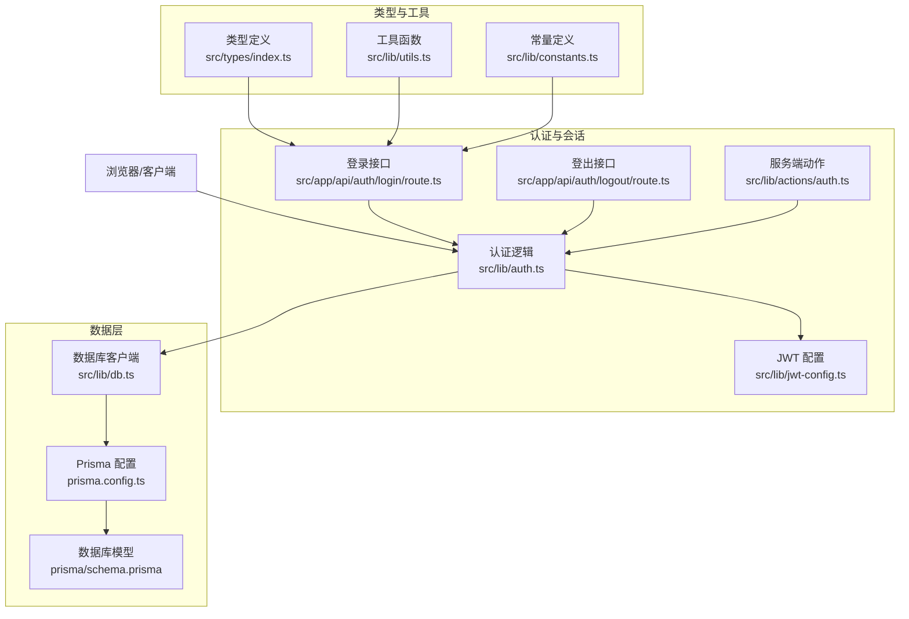
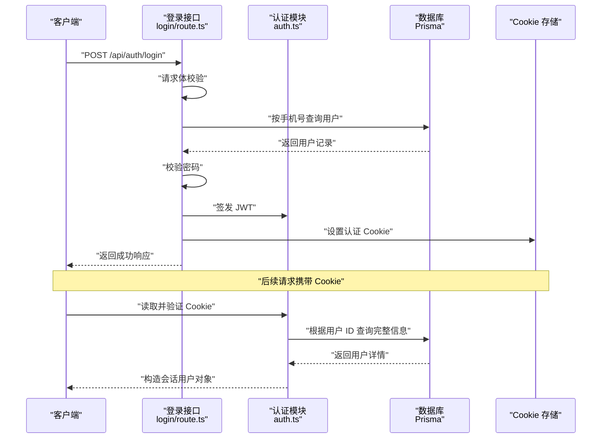
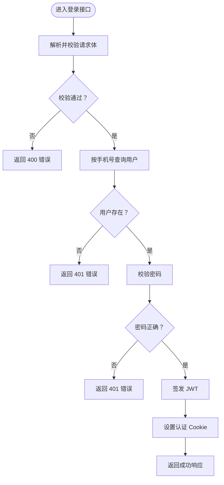
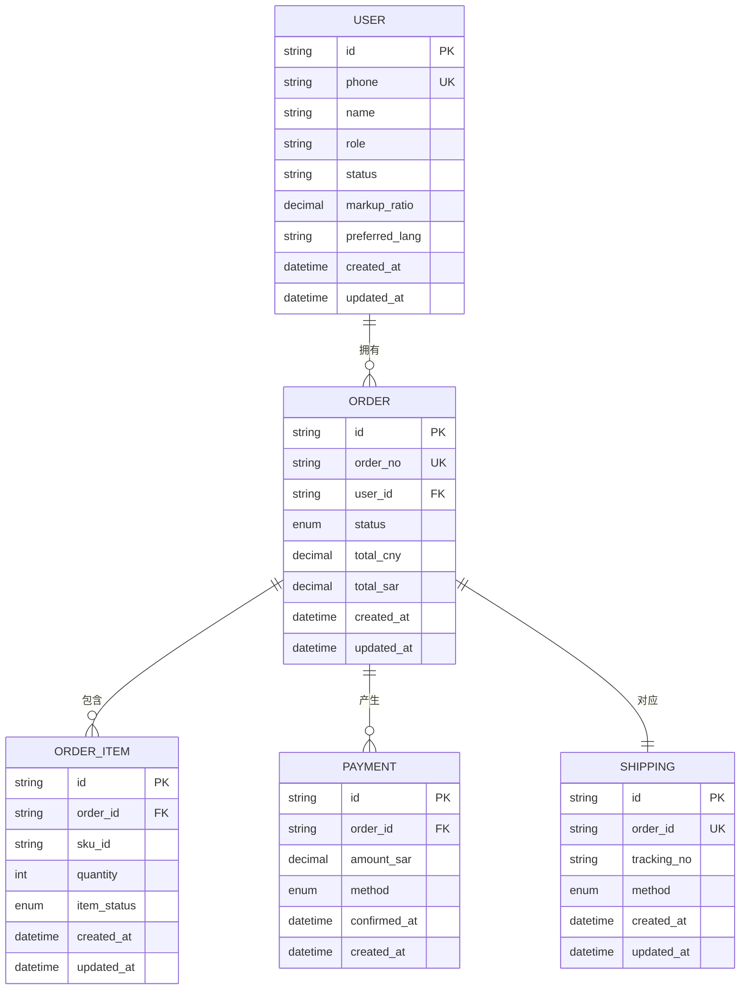
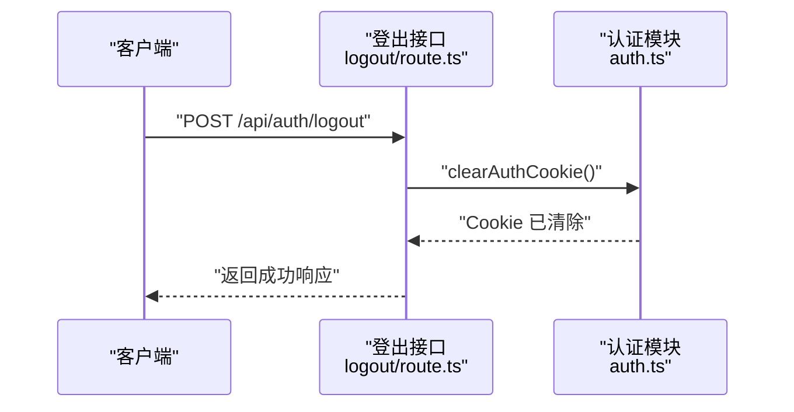
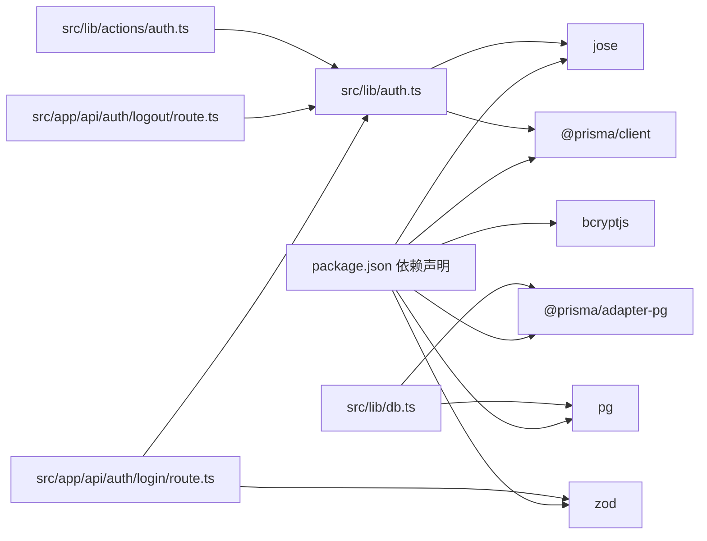

# 状态持久化

<cite>
**本文引用的文件**
- [package.json](file://package.json)
- [prisma.config.ts](file://prisma.config.ts)
- [prisma/schema.prisma](file://prisma/schema.prisma)
- [src/lib/db.ts](file://src/lib/db.ts)
- [src/lib/jwt-config.ts](file://src/lib/jwt-config.ts)
- [src/lib/auth.ts](file://src/lib/auth.ts)
- [src/app/api/auth/login/route.ts](file://src/app/api/auth/login/route.ts)
- [src/app/api/auth/logout/route.ts](file://src/app/api/auth/logout/route.ts)
- [src/lib/actions/auth.ts](file://src/lib/actions/auth.ts)
- [src/types/index.ts](file://src/types/index.ts)
- [src/lib/utils.ts](file://src/lib/utils.ts)
- [src/lib/constants.ts](file://src/lib/constants.ts)
</cite>

## 目录
1. [简介](#简介)
2. [项目结构](#项目结构)
3. [核心组件](#核心组件)
4. [架构总览](#架构总览)
5. [详细组件分析](#详细组件分析)
6. [依赖分析](#依赖分析)
7. [性能考虑](#性能考虑)
8. [故障排除指南](#故障排除指南)
9. [结论](#结论)
10. [附录](#附录)

## 简介
本文件系统性梳理 Celestia 的状态持久化机制，重点覆盖以下方面：
- 会话状态与认证令牌的持久化与恢复
- 数据库存储与 ORM 使用策略
- 状态快照与版本兼容性处理思路
- 性能优化、存储容量管理与清理机制
- 状态同步、冲突解决与一致性保障
- 状态导入导出、备份恢复与迁移策略
- 开发者实现指南与故障排除方法

需要特别说明的是：当前代码库未发现直接使用 localStorage、sessionStorage 或 IndexedDB 的前端状态持久化实现；项目采用基于 Cookie 的 JWT 会话机制与 PostgreSQL 数据库存储。本文将围绕现有实现进行深入分析，并给出可落地的扩展建议。

## 项目结构
与状态持久化直接相关的模块分布如下：
- 认证与会话：JWT 签发/校验、Cookie 设置/清除、服务端中间件读取
- 数据访问：Prisma 客户端初始化与连接池配置
- API 层：登录/登出接口，统一响应格式
- 类型与常量：会话用户类型、状态枚举、分页与货币等常量
- 实用工具：价格/日期格式化、订单号生成等

图表来源
- [src/lib/jwt-config.ts:1-8](file://src/lib/jwt-config.ts#L1-L8)
- [src/lib/auth.ts:1-97](file://src/lib/auth.ts#L1-L97)
- [src/app/api/auth/login/route.ts:1-76](file://src/app/api/auth/login/route.ts#L1-L76)
- [src/app/api/auth/logout/route.ts:1-21](file://src/app/api/auth/logout/route.ts#L1-L21)
- [src/lib/actions/auth.ts:1-20](file://src/lib/actions/auth.ts#L1-L20)
- [prisma.config.ts:1-14](file://prisma.config.ts#L1-L14)
- [prisma/schema.prisma:1-281](file://prisma/schema.prisma#L1-L281)
- [src/lib/db.ts:1-18](file://src/lib/db.ts#L1-L18)
- [src/types/index.ts:1-60](file://src/types/index.ts#L1-L60)
- [src/lib/utils.ts:1-32](file://src/lib/utils.ts#L1-L32)
- [src/lib/constants.ts:1-46](file://src/lib/constants.ts#L1-L46)

章节来源
- [package.json:1-58](file://package.json#L1-L58)
- [prisma.config.ts:1-14](file://prisma.config.ts#L1-L14)
- [prisma/schema.prisma:1-281](file://prisma/schema.prisma#L1-L281)
- [src/lib/db.ts:1-18](file://src/lib/db.ts#L1-L18)
- [src/lib/jwt-config.ts:1-8](file://src/lib/jwt-config.ts#L1-L8)
- [src/lib/auth.ts:1-97](file://src/lib/auth.ts#L1-L97)
- [src/app/api/auth/login/route.ts:1-76](file://src/app/api/auth/login/route.ts#L1-L76)
- [src/app/api/auth/logout/route.ts:1-21](file://src/app/api/auth/logout/route.ts#L1-L21)
- [src/lib/actions/auth.ts:1-20](file://src/lib/actions/auth.ts#L1-L20)
- [src/types/index.ts:1-60](file://src/types/index.ts#L1-L60)
- [src/lib/utils.ts:1-32](file://src/lib/utils.ts#L1-L32)
- [src/lib/constants.ts:1-46](file://src/lib/constants.ts#L1-L46)

## 核心组件
- 会话与认证
  - JWT 密钥、Cookie 名称与过期时间配置
  - 会话用户类型与负载结构
  - 登录时签发 JWT 并设置 Cookie，登出时清除 Cookie
  - 服务端动作封装 getSession 与 logout
- 数据库与 ORM
  - Prisma 客户端通过适配器连接 PostgreSQL
  - 数据模型涵盖用户、品类、商品、订单、支付、物流等
  - 通过 Prisma 查询用户信息以构建会话上下文
- API 层
  - 登录接口：请求体校验、用户查询、密码校验、签发令牌与设置 Cookie
  - 登出接口：清除认证 Cookie 并返回统一响应
- 类型与常量
  - 统一响应格式、分页参数、订单状态与枚举、货币与语言支持等

章节来源
- [src/lib/jwt-config.ts:1-8](file://src/lib/jwt-config.ts#L1-L8)
- [src/types/index.ts:1-60](file://src/types/index.ts#L1-L60)
- [src/app/api/auth/login/route.ts:1-76](file://src/app/api/auth/login/route.ts#L1-L76)
- [src/app/api/auth/logout/route.ts:1-21](file://src/app/api/auth/logout/route.ts#L1-L21)
- [src/lib/actions/auth.ts:1-20](file://src/lib/actions/auth.ts#L1-L20)
- [src/lib/auth.ts:1-97](file://src/lib/auth.ts#L1-L97)
- [prisma/schema.prisma:1-281](file://prisma/schema.prisma#L1-L281)
- [src/lib/db.ts:1-18](file://src/lib/db.ts#L1-L18)

## 架构总览
下图展示了登录到会话恢复的关键流程，以及与数据库交互的关系。

图表来源
- [src/app/api/auth/login/route.ts:13-76](file://src/app/api/auth/login/route.ts#L13-L76)
- [src/lib/auth.ts:57-97](file://src/lib/auth.ts#L57-L97)
- [src/lib/db.ts:12-18](file://src/lib/db.ts#L12-L18)

## 详细组件分析

### 组件一：认证与会话（JWT + Cookie）
- 设计要点
  - 使用 HS256 对称密钥签发 JWT，设置 7 天有效期
  - 将令牌写入 httpOnly Cookie，提升安全性
  - 服务端中间件从 Cookie 读取并验证令牌，再查询数据库获取完整用户信息
  - 提供服务端动作 getSession 与 logout，便于客户端组件调用
- 数据结构与复杂度
  - 会话用户类型包含必要字段，避免在每次请求中加载全量数据
  - 令牌验证为 O(1)，数据库查询为单表唯一键查询，复杂度低
- 错误处理
  - 请求体校验失败返回 400
  - 用户不存在或密码错误返回 401
  - 服务器异常返回 500
- 性能影响
  - Cookie 传输开销小，适合短期会话
  - 每次请求均需验证令牌与查询用户，建议结合缓存与索引优化

图表来源
- [src/app/api/auth/login/route.ts:13-76](file://src/app/api/auth/login/route.ts#L13-L76)

章节来源
- [src/lib/jwt-config.ts:1-8](file://src/lib/jwt-config.ts#L1-L8)
- [src/lib/auth.ts:1-97](file://src/lib/auth.ts#L1-L97)
- [src/app/api/auth/login/route.ts:1-76](file://src/app/api/auth/login/route.ts#L1-L76)
- [src/app/api/auth/logout/route.ts:1-21](file://src/app/api/auth/logout/route.ts#L1-L21)
- [src/lib/actions/auth.ts:1-20](file://src/lib/actions/auth.ts#L1-L20)

### 组件二：数据库与 ORM（Prisma + PostgreSQL）
- 设计要点
  - 通过适配器连接 PostgreSQL，开发环境启用查询日志
  - 数据模型覆盖用户、商品、订单、支付、物流等核心业务实体
  - 使用枚举类型管理状态与分类，确保一致性
- 数据结构与复杂度
  - 主要查询基于唯一键与索引列，复杂度接近 O(log n)/O(1)
  - 建议对高频查询列建立索引，如用户 phone、订单 orderNo、外键列
- 错误处理
  - 数据库异常统一捕获并返回 5xx 错误
- 性能影响
  - 合理使用游标分页与投影查询，减少网络与内存占用
  - 大字段（如文本描述）按需加载，避免不必要的 IO

图表来源
- [prisma/schema.prisma:89-281](file://prisma/schema.prisma#L89-L281)

章节来源
- [prisma/config.ts:1-14](file://prisma.config.ts#L1-L14)
- [prisma/schema.prisma:1-281](file://prisma/schema.prisma#L1-L281)
- [src/lib/db.ts:1-18](file://src/lib/db.ts#L1-L18)

### 组件三：API 层（登录/登出）
- 登录流程
  - 解析 JSON 请求体，使用 Zod 校验
  - 查询用户并校验密码
  - 签发 JWT 并设置 Cookie
  - 返回包含用户信息与状态的成功响应
- 登出流程
  - 清除认证 Cookie
  - 返回统一响应

图表来源
- [src/app/api/auth/logout/route.ts:5-21](file://src/app/api/auth/logout/route.ts#L5-L21)
- [src/lib/auth.ts:48-52](file://src/lib/auth.ts#L48-L52)

章节来源
- [src/app/api/auth/login/route.ts:1-76](file://src/app/api/auth/login/route.ts#L1-L76)
- [src/app/api/auth/logout/route.ts:1-21](file://src/app/api/auth/logout/route.ts#L1-L21)

### 组件四：类型与常量（统一响应、状态枚举、分页与货币）
- 统一响应格式与分页参数
- 订单状态与订单项状态枚举
- 货币、默认加价比例、语言支持等常量
- 价格与日期格式化工具函数

章节来源
- [src/types/index.ts:1-60](file://src/types/index.ts#L1-L60)
- [src/lib/constants.ts:1-46](file://src/lib/constants.ts#L1-L46)
- [src/lib/utils.ts:1-32](file://src/lib/utils.ts#L1-L32)

## 依赖分析
- 外部依赖
  - jose：JWT 签发与校验
  - @prisma/client 与 @prisma/adapter-pg：ORM 与 PostgreSQL 适配
  - pg：PostgreSQL 连接池
  - bcryptjs：密码哈希验证
  - zod：请求体校验
- 内部耦合
  - 认证模块依赖 JWT 配置与数据库客户端
  - API 接口依赖认证模块与类型定义
  - 服务端动作依赖认证模块与路由重定向

图表来源
- [package.json:11-44](file://package.json#L11-L44)
- [src/lib/auth.ts:1-97](file://src/lib/auth.ts#L1-L97)
- [src/app/api/auth/login/route.ts:1-76](file://src/app/api/auth/login/route.ts#L1-L76)
- [src/app/api/auth/logout/route.ts:1-21](file://src/app/api/auth/logout/route.ts#L1-L21)
- [src/lib/actions/auth.ts:1-20](file://src/lib/actions/auth.ts#L1-L20)
- [src/lib/db.ts:1-18](file://src/lib/db.ts#L1-L18)

章节来源
- [package.json:1-58](file://package.json#L1-L58)

## 性能考虑
- 会话与认证
  - 使用 httpOnly Cookie 减少 XSS 风险，但每次请求仍需验证令牌与查询用户
  - 可在服务端缓存近期活跃用户的会话信息，降低数据库压力
- 数据库访问
  - 对常用查询列建立索引（如用户 phone、订单 orderNo、外键列）
  - 使用投影查询仅加载必要字段，避免大字段传输
  - 合理使用游标分页，控制单页大小
- 日志与监控
  - 开发环境开启 Prisma 查询日志，生产环境关闭或降级
  - 对高频接口增加指标埋点与慢查询告警

## 故障排除指南
- 登录失败
  - 请求体校验失败：检查请求体结构与必填字段
  - 用户不存在或密码错误：确认手机号与密码哈希是否匹配
  - 服务器异常：查看后端日志与数据库连接状态
- 登出无效
  - 确认 Cookie 名称与路径配置一致
  - 检查 SameSite 与 Secure 设置是否符合当前协议
- 会话丢失
  - 检查 Cookie 是否被浏览器阻止或过期
  - 确认 JWT 过期时间与服务端配置一致
- 数据库问题
  - 连接池耗尽：检查连接数上限与超时配置
  - 查询缓慢：分析慢查询日志，补充索引或重构查询

章节来源
- [src/app/api/auth/login/route.ts:13-76](file://src/app/api/auth/login/route.ts#L13-L76)
- [src/app/api/auth/logout/route.ts:5-21](file://src/app/api/auth/logout/route.ts#L5-L21)
- [src/lib/auth.ts:57-97](file://src/lib/auth.ts#L57-L97)
- [src/lib/db.ts:9-18](file://src/lib/db.ts#L9-L18)

## 结论
当前实现以 JWT + Cookie 作为会话持久化方案，配合 Prisma 与 PostgreSQL 实现业务数据持久化。该方案具备良好的安全性和可维护性。若未来需要引入前端本地状态持久化（如 localStorage/sessionStorage/IndexedDB），可在不破坏现有认证与数据库层的前提下，新增独立的状态管理模块，并遵循统一的数据序列化与版本兼容策略。

## 附录

### 状态快照与版本兼容
- 快照机制
  - 在关键业务节点（如订单创建、支付完成）生成状态快照
  - 快照包含时间戳、版本号、关键字段与摘要
- 版本兼容
  - 引入 schema 版本字段，升级时提供迁移脚本
  - 对于不兼容变更，保留向后兼容的降级路径

### 状态恢复流程
- 启动阶段
  - 读取 Cookie 验证会话有效性
  - 从数据库加载用户上下文并注入全局状态
- 异常恢复
  - 会话失效时触发重新登录
  - 数据库异常时回退到最小可用状态并提示用户

### 状态同步、冲突解决与一致性
- 同步策略
  - 采用幂等接口与事务保证关键操作一致性
- 冲突解决
  - 对并发更新使用乐观锁或版本号控制
- 一致性保障
  - 使用数据库事务包裹多表更新
  - 对外部依赖（如支付、物流）采用最终一致性设计

### 状态导入导出、备份恢复与迁移
- 导入导出
  - 基于 CSV/JSON 导出业务数据，导入时进行校验与映射
- 备份恢复
  - 定期备份数据库，制定 RPO/RTO 指标
- 迁移策略
  - 使用 Prisma Migrate 管理结构变更
  - 迁移前先在测试环境验证

### 开发者实现指南（扩展建议）
- 选择存储方案
  - 会话：优先使用 httpOnly Cookie + JWT（已实现）
  - 前端临时状态：localStorage/sessionStorage（建议用于非敏感数据）
  - 大体量数据：IndexedDB（建议用于离线场景）
- 序列化与校验
  - 使用结构化克隆或 JSON 序列化，确保跨浏览器兼容
  - 对导入数据进行严格校验与清洗
- 性能优化
  - 分片存储与懒加载
  - 增量更新与去重
- 存储容量管理
  - 设置最大条目数与 TTL
  - 定期清理过期与冗余数据
- 安全与隐私
  - 对敏感数据加密存储
  - 遵循最小权限原则与数据最小化