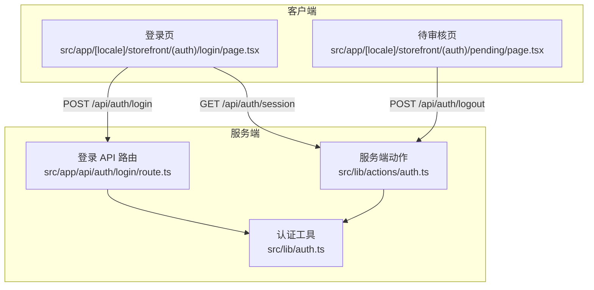
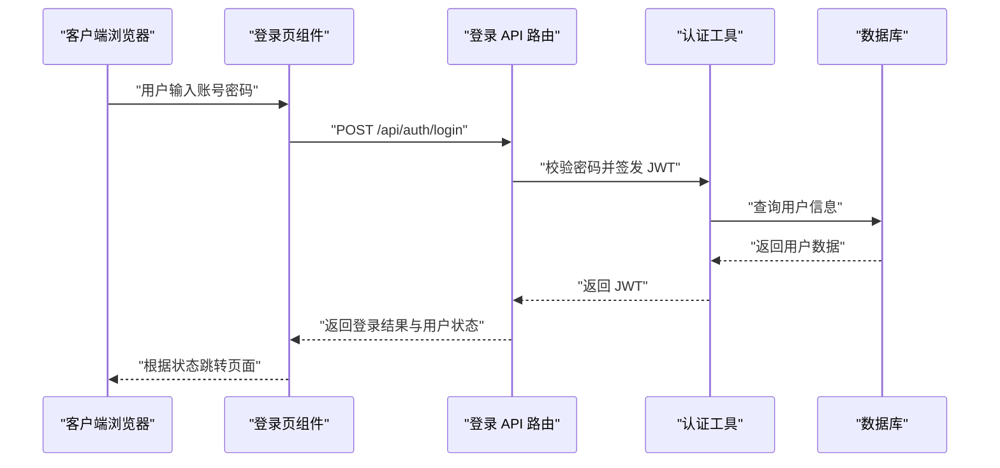
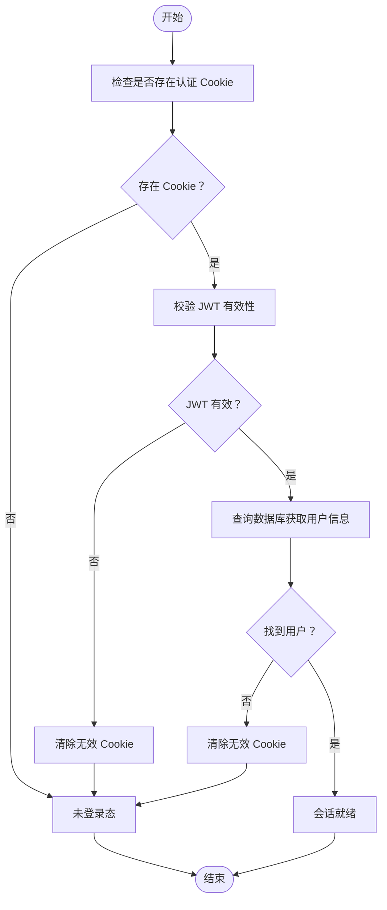
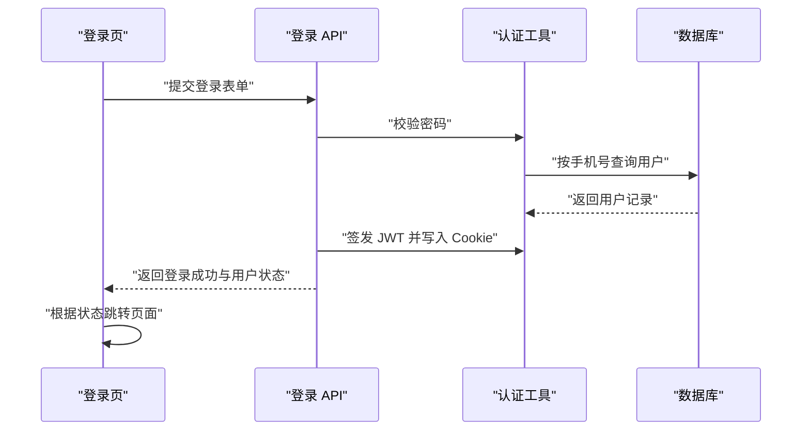
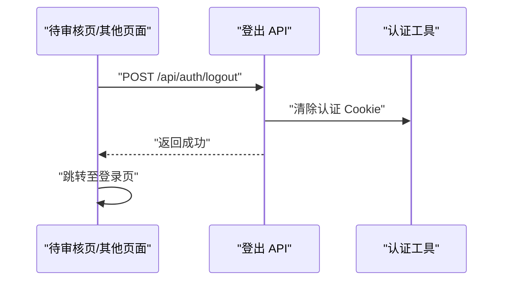
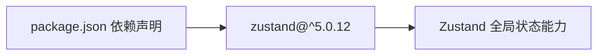

# 状态管理

<cite>
**本文引用的文件**
- [README.md](file://README.md)
- [package.json](file://package.json)
- [src/lib/actions/auth.ts](file://src/lib/actions/auth.ts)
- [src/lib/auth.ts](file://src/lib/auth.ts)
- [src/app/[locale]/storefront/(auth)/login/page.tsx](file://src/app/[locale]/storefront/(auth)/login/page.tsx)
- [src/app/[locale]/storefront/(auth)/pending/page.tsx](file://src/app/[locale]/storefront/(auth)/pending/page.tsx)
- [src/app/api/auth/login/route.ts](file://src/app/api/auth/login/route.ts)
</cite>

## 目录
1. [简介](#简介)
2. [项目结构](#项目结构)
3. [核心组件](#核心组件)
4. [架构总览](#架构总览)
5. [详细组件分析](#详细组件分析)
6. [依赖分析](#依赖分析)
7. [性能考虑](#性能考虑)
8. [故障排查指南](#故障排查指南)
9. [结论](#结论)
10. [附录](#附录)

## 简介
本文件面向前端开发者，系统性梳理 Celestia 的状态管理方案与实现要点。当前代码库中，认证状态通过服务端 Cookie/JWT 与客户端表单交互完成，未直接使用 Zustand 进行前端全局状态管理；但项目已引入 Zustand 依赖，具备扩展为前端 Zustand 状态管理的基础条件。本文将基于现有实现，给出认证状态的端到端流程，并提供以 Zustand 为核心的全局状态设计蓝图、持久化策略、订阅机制、调试与性能优化建议，以及与 UI 组件的最佳绑定实践。

## 项目结构
- 认证相关逻辑集中在服务端 API 与客户端页面之间协作：
  - 客户端登录页发起登录请求，服务端路由处理登录、签发 JWT 并写入 Cookie。
  - 客户端登出页通过 API 触发清除 Cookie，随后重定向至登录页。
  - 服务端工具函数负责签名、校验 JWT、设置/清除 Cookie、查询当前用户。
- 项目依赖中包含 Zustand，可用于后续在客户端引入全局状态管理（如购物车、主题、语言偏好等）。

**图示来源**
- [src/app/[locale]/storefront/(auth)/login/page.tsx](file://src/app/[locale]/storefront/(auth)/login/page.tsx#L1-L93)
- [src/app/[locale]/storefront/(auth)/pending/page.tsx](file://src/app/[locale]/storefront/(auth)/pending/page.tsx#L1-L100)
- [src/app/api/auth/login/route.ts:41-75](file://src/app/api/auth/login/route.ts#L41-L75)
- [src/lib/auth.ts:1-99](file://src/lib/auth.ts#L1-L99)
- [src/lib/actions/auth.ts:1-21](file://src/lib/actions/auth.ts#L1-L21)

**章节来源**
- [README.md:1-37](file://README.md#L1-L37)
- [package.json:1-50](file://package.json#L1-L50)

## 核心组件
- 认证状态载体：服务端 Cookie（名称与过期策略见认证工具），客户端不直接持有认证状态。
- 会话用户模型：包含用户标识、手机号、姓名、角色、加价比例、首选语言等字段。
- 服务端动作：
  - 获取会话：读取 Cookie 并解析 JWT，查询数据库返回会话用户。
  - 登出：清除 Cookie 并重定向。
- 登录流程：客户端提交表单 → 服务端校验密码 → 成功后签发 JWT 写入 Cookie → 返回用户状态 → 客户端根据状态跳转。

**章节来源**
- [src/lib/auth.ts:1-99](file://src/lib/auth.ts#L1-L99)
- [src/lib/actions/auth.ts:1-21](file://src/lib/actions/auth.ts#L1-L21)
- [src/app/[locale]/storefront/(auth)/login/page.tsx](file://src/app/[locale]/storefront/(auth)/login/page.tsx#L1-L93)
- [src/app/[locale]/storefront/(auth)/pending/page.tsx](file://src/app/[locale]/storefront/(auth)/pending/page.tsx#L1-L100)
- [src/app/api/auth/login/route.ts:41-75](file://src/app/api/auth/login/route.ts#L41-L75)

## 架构总览
下图展示认证状态在客户端与服务端之间的流转路径，以及与 Zustand 扩展点的关系示意（概念性，非现有实现映射）：

[此图为概念性流程图，不对应具体源码文件，故无“图示来源”]

## 详细组件分析

### 认证状态与会话生命周期
- 会话建立：客户端登录成功后，服务端将 JWT 写入 Cookie；后续请求可携带该 Cookie 进行身份识别。
- 会话读取：服务端动作读取 Cookie，验证 JWT，再查询数据库获取完整用户信息。
- 会话结束：客户端触发登出，服务端清除 Cookie 并重定向。

**章节来源**
- [src/lib/auth.ts:60-98](file://src/lib/auth.ts#L60-L98)
- [src/lib/actions/auth.ts:10-12](file://src/lib/actions/auth.ts#L10-L12)
- [src/app/[locale]/storefront/(auth)/login/page.tsx](file://src/app/[locale]/storefront/(auth)/login/page.tsx#L52-L79)
- [src/app/[locale]/storefront/(auth)/pending/page.tsx](file://src/app/[locale]/storefront/(auth)/pending/page.tsx#L22-L44)

### 登录流程（客户端到服务端）
- 客户端登录页收集表单数据，发起登录请求。
- 服务端路由校验凭据，签发 JWT 并设置 Cookie。
- 服务端返回登录结果与用户状态，客户端根据状态跳转至首页或待审核页。

**图示来源**
- [src/app/[locale]/storefront/(auth)/login/page.tsx](file://src/app/[locale]/storefront/(auth)/login/page.tsx#L52-L79)
- [src/app/api/auth/login/route.ts:41-75](file://src/app/api/auth/login/route.ts#L41-L75)
- [src/lib/auth.ts:13-47](file://src/lib/auth.ts#L13-L47)

**章节来源**
- [src/app/[locale]/storefront/(auth)/login/page.tsx](file://src/app/[locale]/storefront/(auth)/login/page.tsx#L1-L93)
- [src/app/api/auth/login/route.ts:41-75](file://src/app/api/auth/login/route.ts#L41-L75)
- [src/lib/auth.ts:1-99](file://src/lib/auth.ts#L1-L99)

### 登出流程（客户端到服务端）
- 客户端点击登出按钮，向服务端发送登出请求。
- 服务端清除 Cookie 并返回结果，客户端收到后跳转至登录页。

**图示来源**
- [src/app/[locale]/storefront/(auth)/pending/page.tsx](file://src/app/[locale]/storefront/(auth)/pending/page.tsx#L22-L44)
- [src/lib/actions/auth.ts:17-20](file://src/lib/actions/auth.ts#L17-L20)
- [src/lib/auth.ts:52-55](file://src/lib/auth.ts#L52-L55)

**章节来源**
- [src/app/[locale]/storefront/(auth)/pending/page.tsx](file://src/app/[locale]/storefront/(auth)/pending/page.tsx#L1-L100)
- [src/lib/actions/auth.ts:1-21](file://src/lib/actions/auth.ts#L1-L21)
- [src/lib/auth.ts:52-55](file://src/lib/auth.ts#L52-L55)

### 基于 Zustand 的全局状态设计蓝图（概念性）
以下为引入 Zustand 后的推荐设计思路，便于后续扩展购物车、主题、语言偏好等全局状态。该部分为概念性内容，用于指导实现。

- 状态域划分
  - 用户认证状态：存放当前会话用户信息（仅在需要时由客户端本地缓存，优先以服务端会话为准）。
  - 应用配置状态：主题、语言、货币单位等。
  - 购物车状态：商品列表、数量、总价、选中项等。
- 状态持久化策略
  - 使用持久化中间件将关键状态存储到本地存储，实现刷新后恢复。
  - 对敏感信息（如令牌）避免持久化，或采用加密存储。
- 订阅机制
  - 使用选择器订阅模式，仅在必要字段变化时触发组件重渲染。
  - 对复杂状态可结合浅比较中间件减少不必要重渲染。
- 更新流程
  - 动作函数集中管理状态变更，保持不可变更新。
  - 异步操作通过动作函数封装，统一错误处理与回滚策略。
- 与 UI 绑定
  - 在页面组件中通过 Hook 订阅所需状态片段，避免跨层级传递。
  - 对高频更新状态采用局部状态或上下文隔离，降低全局抖动。

[本节为概念性设计，不对应具体源码文件，故无“章节来源”]

## 依赖分析
- 项目依赖中包含 Zustand，版本满足 v5，具备引入全局状态管理的能力。
- 当前认证状态完全由服务端 Cookie/JWT 管理，未见前端 Zustand 使用痕迹。

**图示来源**
- [package.json:36-36](file://package.json#L36-L36)

**章节来源**
- [package.json:1-50](file://package.json#L1-L50)

## 性能考虑
- 减少不必要的重渲染
  - 使用选择器订阅模式，仅订阅所需字段。
  - 对大对象状态采用分片存储，避免单一状态变动引发大面积重渲染。
- 持久化与内存管理
  - 对超大状态（如日志、缓存）谨慎持久化，定期清理过期数据。
  - 对频繁更新的临时状态尽量保留在内存，不写入持久层。
- 异步与并发
  - 将异步副作用收敛到动作函数中，避免在渲染阶段执行 IO。
  - 对重复请求进行去重或节流，防止并发写入导致状态错乱。

[本节为通用性能建议，不对应具体源码文件，故无“章节来源”]

## 故障排查指南
- 登录失败
  - 检查服务端登录路由是否正确校验密码并返回状态。
  - 确认客户端表单提交的数据格式与服务端期望一致。
- Cookie 未生效
  - 检查 Cookie 设置是否包含正确的安全标志、域名与路径。
  - 确认浏览器未禁用第三方 Cookie 或隐私模式。
- 会话丢失
  - 核对 JWT 过期时间与客户端重试策略。
  - 确认服务端清除 Cookie 的动作是否被调用。
- 状态不更新（若引入 Zustand）
  - 检查动作函数是否正确更新状态且未被选择器过滤。
  - 排查持久化中间件是否覆盖了最新状态。

**章节来源**
- [src/app/api/auth/login/route.ts:41-75](file://src/app/api/auth/login/route.ts#L41-L75)
- [src/lib/auth.ts:38-47](file://src/lib/auth.ts#L38-L47)
- [src/app/[locale]/storefront/(auth)/login/page.tsx](file://src/app/[locale]/storefront/(auth)/login/page.tsx#L52-L79)
- [src/app/[locale]/storefront/(auth)/pending/page.tsx](file://src/app/[locale]/storefront/(auth)/pending/page.tsx#L22-L44)

## 结论
- 当前认证状态由服务端主导，客户端通过 API 与 Cookie 完成会话管理，流程清晰、安全可控。
- 项目已具备引入 Zustand 的基础条件，建议后续按域拆分状态、采用持久化与订阅优化策略，逐步替换部分前端状态为客户端管理，提升交互响应与离线体验。
- 在引入 Zustand 时，应坚持“最小必要状态”“不可变更新”“选择性订阅”的设计原则，配合调试与性能监控工具，确保状态管理的可维护性与稳定性。

## 附录
- 相关实现位置参考
  - 登录页与表单校验：[src/app/[locale]/storefront/(auth)/login/page.tsx](file://src/app/[locale]/storefront/(auth)/login/page.tsx#L1-L93)
  - 待审核页与登出流程：[src/app/[locale]/storefront/(auth)/pending/page.tsx](file://src/app/[locale]/storefront/(auth)/pending/page.tsx#L1-L100)
  - 登录 API 处理与 JWT 签发：[src/app/api/auth/login/route.ts:41-75](file://src/app/api/auth/login/route.ts#L41-L75)
  - 认证工具（JWT 签发/校验、Cookie 设置/清除、当前用户查询）：[src/lib/auth.ts:1-99](file://src/lib/auth.ts#L1-L99)
  - 服务端动作（获取会话、登出）：[src/lib/actions/auth.ts:1-21](file://src/lib/actions/auth.ts#L1-L21)
  - 依赖声明（含 Zustand）：[package.json:1-50](file://package.json#L1-L50)