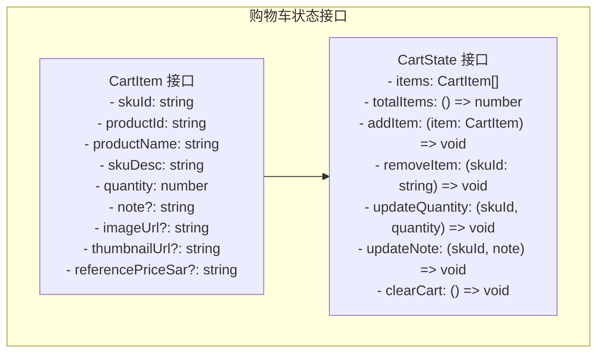
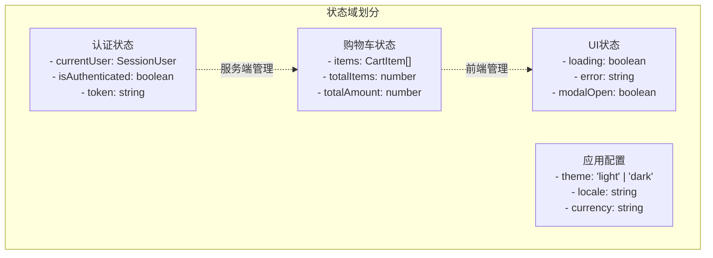
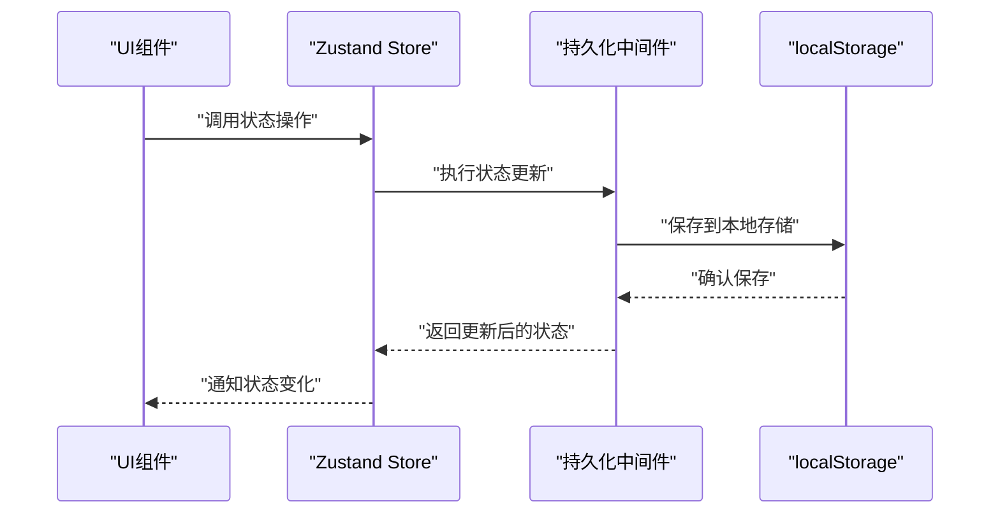
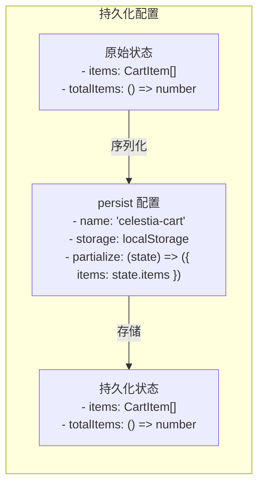
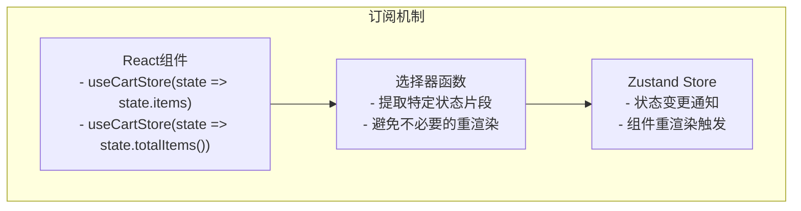
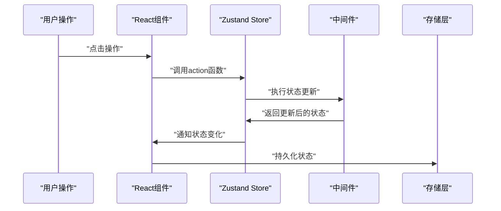

# 状态管理

<cite>
**本文引用的文件**
- [cart.ts](file://src/stores/cart.ts)
- [page.tsx](file://src/app/[locale]/storefront/cart/page.tsx)
- [page.tsx](file://src/app/[locale]/storefront/products/[id]/page.tsx)
- [cart-badge.tsx](file://src/components/storefront/cart-badge.tsx)
- [layout.tsx](file://src/app/[locale]/storefront/layout.tsx)
- [package.json](file://package.json)
- [auth.ts](file://src/lib/actions/auth.ts)
- [auth.ts](file://src/lib/auth.ts)
- [route.ts](file://src/app/api/auth/login/route.ts)
- [page.tsx](file://src/app/[locale]/storefront/(auth)/login/page.tsx)
- [page.tsx](file://src/app/[locale]/storefront/(auth)/pending/page.tsx)
</cite>

## 更新摘要
**所做更改**
- 新增Zustand购物车状态管理实现详解
- 补充状态持久化机制和UI组件绑定实践
- 更新状态管理模式和订阅机制说明
- 增强状态调试和性能优化策略

## 目录
1. [简介](#简介)
2. [Zustand购物车状态管理](#zustand购物车状态管理)
3. [全局状态设计](#全局状态设计)
4. [状态持久化策略](#状态持久化策略)
5. [状态订阅与响应机制](#状态订阅与响应机制)
6. [核心业务状态实现](#核心业务状态实现)
7. [状态管理最佳实践](#状态管理最佳实践)
8. [性能优化与内存管理](#性能优化与内存管理)
9. [状态调试与故障排查](#状态调试与故障排查)
10. [结论](#结论)

## 简介

Celestia采用混合状态管理模式：认证状态通过服务端Cookie/JWT管理，而购物车等前端状态通过Zustand实现。本文档详细说明Zustand状态管理的实现细节，包括购物车状态管理、全局状态设计、状态持久化策略、状态订阅机制和状态更新流程。

**章节来源**
- [package.json:47](file://package.json#L47)
- [cart.ts:1-76](file://src/stores/cart.ts#L1-L76)

## Zustand购物车状态管理

### 状态接口定义

购物车状态通过Zustand的create函数创建，定义了完整的状态接口和操作方法：



**图示来源**
- [cart.ts:4-28](file://src/stores/cart.ts#L4-L28)

### 核心状态操作

购物车状态提供了完整的CRUD操作和计算属性：

#### 添加商品
```typescript
addItem: (newItem) => set((state) => {
  const existing = state.items.find(i => i.skuId === newItem.skuId)
  if (existing) {
    return {
      items: state.items.map(i =>
        i.skuId === newItem.skuId
          ? { ...i, quantity: i.quantity + newItem.quantity }
          : i
      ),
    }
  }
  return { items: [...state.items, newItem] }
})
```

#### 更新数量
```typescript
updateQuantity: (skuId, quantity) => set((state) => ({
  items: quantity <= 0
    ? state.items.filter(i => i.skuId !== skuId)
    : state.items.map(i =>
        i.skuId === skuId ? { ...i, quantity } : i
      ),
}))
```

#### 计算属性
```typescript
totalItems: () => get().items.reduce((sum, item) => sum + item.quantity, 0)
```

**章节来源**
- [cart.ts:30-75](file://src/stores/cart.ts#L30-L75)

## 全局状态设计

### 状态域划分策略

基于Celestia的实际需求，建议采用以下状态域划分：



### 状态继承关系



**图示来源**
- [cart.ts:31-74](file://src/stores/cart.ts#L31-L74)

**章节来源**
- [cart.ts:16-28](file://src/stores/cart.ts#L16-L28)

## 状态持久化策略

### 持久化中间件配置

Zustand的persist中间件提供了完整的状态持久化解决方案：



**图示来源**
- [cart.ts:71-74](file://src/stores/cart.ts#L71-L74)

### 持久化策略优势

1. **自动恢复**：页面刷新后自动恢复购物车状态
2. **选择性持久化**：只持久化必要的状态数据
3. **版本兼容**：支持状态结构变更的兼容处理
4. **性能优化**：避免不必要的状态序列化

**章节来源**
- [cart.ts:30-75](file://src/stores/cart.ts#L30-L75)

## 状态订阅与响应机制

### 选择器订阅模式

Zustand支持多种订阅模式，推荐使用选择器订阅以优化性能：



**图示来源**
- [cart-badge.tsx:15](file://src/components/storefront/cart-badge.tsx#L15)
- [page.tsx:30](file://src/app/[locale]/storefront/cart/page.tsx#L30)

### 订阅优化策略

1. **精确选择**：只订阅需要的状态片段
2. **计算属性缓存**：避免重复计算
3. **批量更新**：合并多个状态更新
4. **防抖处理**：高频状态更新的节流

**章节来源**
- [cart-badge.tsx:13-34](file://src/components/storefront/cart-badge.tsx#L13-L34)
- [page.tsx:24-70](file://src/app/[locale]/storefront/cart/page.tsx#L24-L70)

## 核心业务状态实现

### 购物车状态集成

#### 产品详情页集成
```typescript
// 从购物车store中提取addItem方法
const addItem = useCartStore(state => state.addItem);

// 处理加入购物车操作
const handleAddToCart = () => {
  // 验证SKU选择
  // 构建购物车项
  addItem({
    skuId: selectedSku.id,
    productId: product.id,
    productName: getProductName(),
    skuDesc: skuDescParts.join(' / '),
    quantity: quantity,
    imageUrl: product.images[0]?.url,
    thumbnailUrl: product.images[0]?.thumbnailUrl,
    referencePriceSar: selectedSku.referencePriceSar?.toString(),
  });
};
```

#### 购物车页面集成
```typescript
// 解构购物车状态和操作方法
const { items, updateQuantity, removeItem, updateNote, clearCart, totalItems } = useCartStore();

// 处理数量变化
const handleQuantityChange = (skuId: string, delta: number) => {
  const item = items.find((i) => i.skuId === skuId);
  if (item) {
    const newQuantity = item.quantity + delta;
    if (newQuantity > 0) {
      updateQuantity(skuId, newQuantity);
    }
  }
};
```

**章节来源**
- [page.tsx:152-227](file://src/app/[locale]/storefront/products/[id]/page.tsx#L152-L227)
- [page.tsx:30-70](file://src/app/[locale]/storefront/cart/page.tsx#L30-L70)

### UI组件绑定实践

#### 购物车徽章组件
```typescript
// 使用选择器订阅总商品数
const totalItems = useCartStore(state => state.totalItems());

// 避免hydration不匹配问题
const [mounted, setMounted] = useState(false);
useEffect(() => setMounted(true), []);
```

#### 底部导航集成
```typescript
// 在StorefrontLayout中集成购物车徽章
<CartBadge locale={locale} />

// 导航项配置
{ href: `/${locale}/storefront/cart`, icon: Grid3X3, label: t("cart"), isCart: true }
```

**章节来源**
- [cart-badge.tsx:13-34](file://src/components/storefront/cart-badge.tsx#L13-L34)
- [layout.tsx:32-40](file://src/app/[locale]/storefront/layout.tsx#L32-L40)

## 状态管理最佳实践

### 设计原则

1. **单一职责原则**：每个状态域负责特定业务领域
2. **不可变更新**：使用不可变数据结构更新状态
3. **选择性订阅**：只订阅必要的状态片段
4. **计算属性分离**：将计算逻辑与状态存储分离

### 状态更新流程



### 错误处理策略

1. **操作失败回滚**：状态更新失败时自动回滚
2. **异常捕获**：在action函数中统一处理异常
3. **状态恢复**：从持久化存储恢复状态
4. **降级处理**：网络异常时的本地状态处理

## 性能优化与内存管理

### 重渲染优化

1. **选择器订阅**：使用选择器避免不必要的组件重渲染
2. **浅比较**：利用Zustand的浅比较机制
3. **计算属性缓存**：缓存昂贵的计算结果
4. **批量更新**：合并多个状态更新操作

### 内存管理策略

1. **状态精简**：只存储必要的状态数据
2. **定时清理**：定期清理过期的购物车项
3. **内存泄漏防护**：及时清理事件监听器
4. **存储容量控制**：限制持久化状态的大小

### 异步操作优化

1. **并发控制**：避免同时执行多个异步操作
2. **请求去重**：对重复的请求进行去重处理
3. **错误重试**：实现智能的错误重试机制
4. **加载状态管理**：合理管理异步操作的加载状态

## 状态调试与故障排查

### 调试工具集成

1. **Redux DevTools**：支持Zustand的Redux DevTools扩展
2. **状态快照**：支持状态的快照和回放
3. **时间旅行调试**：支持状态的历史回溯
4. **性能分析**：分析状态更新的性能影响

### 常见问题排查

#### 购物车状态不同步
- 检查localStorage权限和容量
- 验证状态序列化和反序列化过程
- 确认多标签页间的同步机制

#### 状态更新延迟
- 检查action函数的异步处理
- 验证选择器订阅的准确性
- 确认组件的重渲染触发时机

#### 内存泄漏问题
- 检查组件卸载时的状态清理
- 验证事件监听器的移除
- 确认持久化中间件的正确配置

**章节来源**
- [cart.ts:30-75](file://src/stores/cart.ts#L30-L75)

## 结论

Celestia的Zustand状态管理实现了购物车等核心业务状态的前端管理，通过持久化中间件确保了状态的持久性和用户体验的连续性。结合服务端认证状态管理，形成了完整的状态管理体系。

### 关键优势

1. **混合管理模式**：认证状态服务端管理，购物车状态前端管理
2. **持久化支持**：自动恢复购物车状态，提升用户体验
3. **性能优化**：选择器订阅和计算属性缓存减少重渲染
4. **易于扩展**：模块化的状态设计支持功能扩展

### 发展方向

1. **状态域扩展**：逐步引入应用配置、用户偏好等状态域
2. **调试增强**：集成更完善的调试工具和监控机制
3. **性能监控**：实现状态管理的性能指标监控
4. **团队协作**：建立状态管理的开发规范和最佳实践

通过持续优化状态管理策略，Celestia能够为用户提供更加流畅和可靠的应用体验，同时为未来的功能扩展奠定坚实的技术基础。