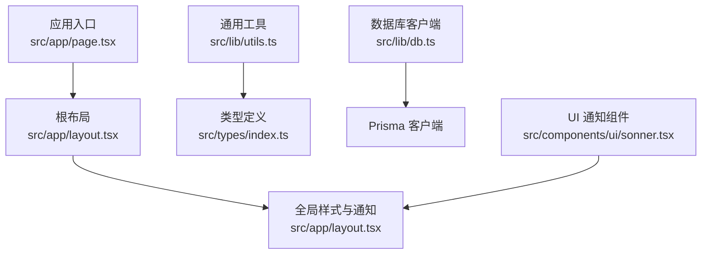
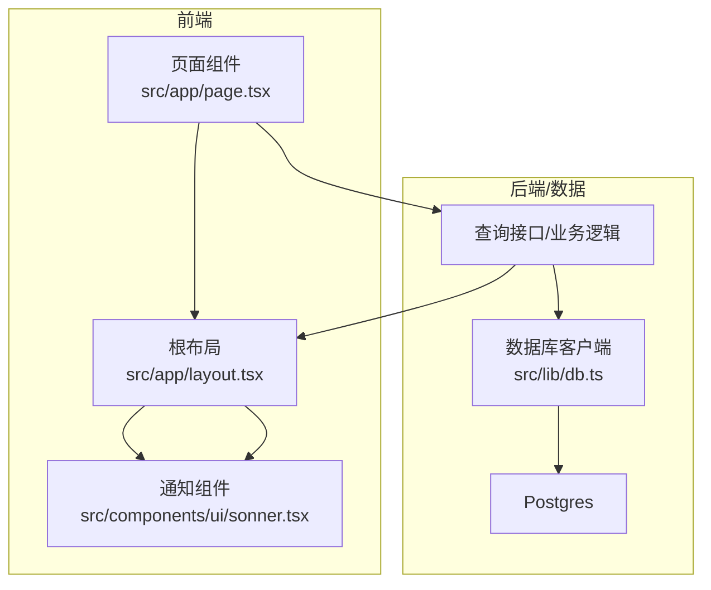
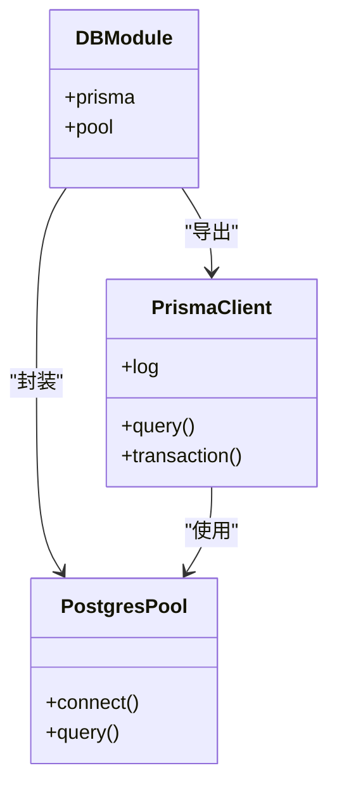
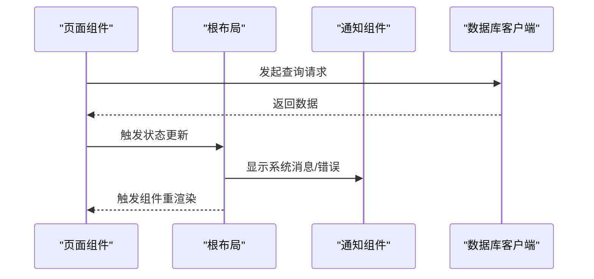
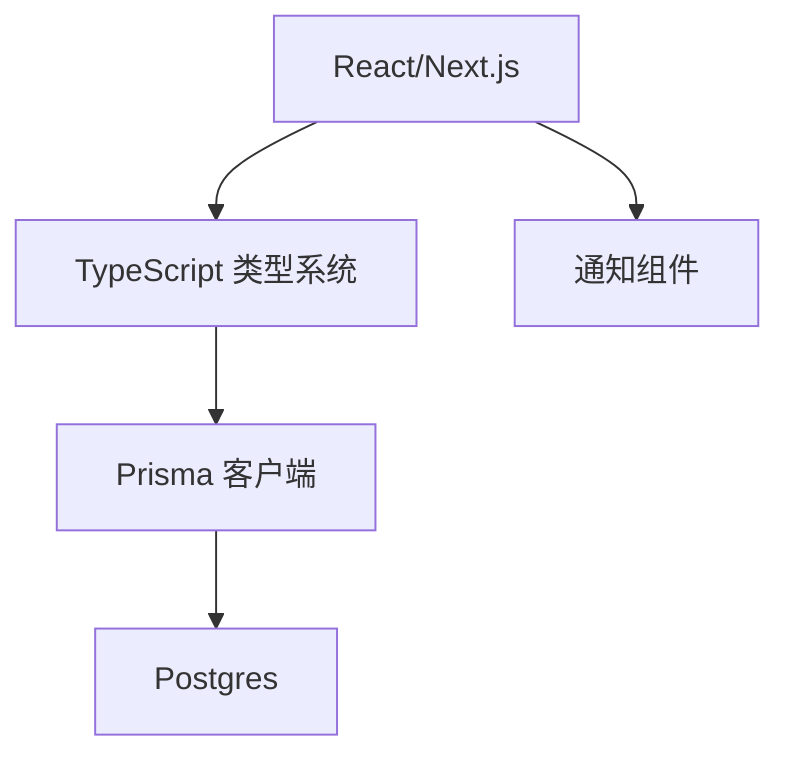

# 状态订阅与响应

<cite>
**本文引用的文件**
- [README.md](file://README.md)
- [package.json](file://package.json)
- [src/app/layout.tsx](file://src/app/layout.tsx)
- [src/app/page.tsx](file://src/app/page.tsx)
- [src/lib/db.ts](file://src/lib/db.ts)
- [src/lib/utils.ts](file://src/lib/utils.ts)
- [src/types/index.ts](file://src/types/index.ts)
- [src/components/ui/sonner.tsx](file://src/components/ui/sonner.tsx)
</cite>

## 目录
1. [简介](#简介)
2. [项目结构](#项目结构)
3. [核心组件](#核心组件)
4. [架构总览](#架构总览)
5. [详细组件分析](#详细组件分析)
6. [依赖关系分析](#依赖关系分析)
7. [性能考量](#性能考量)
8. [故障排查指南](#故障排查指南)
9. [结论](#结论)
10. [附录](#附录)

## 简介
本文件面向开发者，系统性阐述 Celestia 项目中的“状态订阅与响应”机制。基于仓库现有代码，我们将从架构视角梳理状态订阅的实现原理、订阅者模式与响应式更新流程；解释状态变化监听、事件触发与组件重新渲染的完整链路；并给出订阅管理、生命周期与优化策略的实践建议。同时，结合项目中已有的类型定义、数据库连接与 UI 工具，提供状态选择器模式、过滤与组合的实现思路，并覆盖性能影响、内存泄漏预防与订阅清理机制，以及状态调试、变更追踪与日志记录的建议方案。

## 项目结构
该项目采用 Next.js App Router 结构，前端页面通过路由组织，全局布局与通知组件在根布局中统一注入。数据库访问通过 Prisma 客户端封装，通用工具函数提供格式化等辅助能力。类型定义集中于 types/index.ts，便于跨模块共享。

图表来源
- [src/app/page.tsx:1-6](file://src/app/page.tsx#L1-L6)
- [src/app/layout.tsx:1-43](file://src/app/layout.tsx#L1-L43)
- [src/lib/utils.ts:1-32](file://src/lib/utils.ts#L1-L32)
- [src/types/index.ts:1-60](file://src/types/index.ts#L1-L60)
- [src/lib/db.ts:1-18](file://src/lib/db.ts#L1-L18)
- [src/components/ui/sonner.tsx](file://src/components/ui/sonner.tsx)

章节来源
- [README.md:1-37](file://README.md#L1-L37)
- [src/app/page.tsx:1-6](file://src/app/page.tsx#L1-L6)
- [src/app/layout.tsx:1-43](file://src/app/layout.tsx#L1-L43)
- [src/lib/db.ts:1-18](file://src/lib/db.ts#L1-L18)
- [src/lib/utils.ts:1-32](file://src/lib/utils.ts#L1-L32)
- [src/types/index.ts:1-60](file://src/types/index.ts#L1-L60)

## 核心组件
- 全局布局与通知
  - 根布局负责注入全局样式与通知组件，确保应用级状态变更（如错误提示）能以统一方式呈现。
- 数据库客户端
  - 通过 Prisma 客户端与 Postgres 连接池建立持久化层，为业务状态提供数据源。
- 类型系统
  - 统一的 API 响应、分页、筛选与会话用户等类型，为状态选择器与过滤逻辑提供契约基础。
- 通用工具
  - 提供价格、日期格式化与订单号生成等工具，便于在状态处理与 UI 展示中复用。

章节来源
- [src/app/layout.tsx:1-43](file://src/app/layout.tsx#L1-L43)
- [src/lib/db.ts:1-18](file://src/lib/db.ts#L1-L18)
- [src/types/index.ts:1-60](file://src/types/index.ts#L1-L60)
- [src/lib/utils.ts:1-32](file://src/lib/utils.ts#L1-L32)

## 架构总览
下图展示从页面到数据库与通知系统的整体交互路径，体现状态订阅与响应的关键节点：页面发起请求、后端返回数据、状态更新、UI 通知与组件重渲染。

图表来源
- [src/app/page.tsx:1-6](file://src/app/page.tsx#L1-L6)
- [src/app/layout.tsx:1-43](file://src/app/layout.tsx#L1-L43)
- [src/lib/db.ts:1-18](file://src/lib/db.ts#L1-L18)
- [src/components/ui/sonner.tsx](file://src/components/ui/sonner.tsx)

## 详细组件分析

### 页面与路由状态
- 首页重定向至多语言前台，作为应用状态的初始入口，后续状态订阅围绕前台页面展开。
- 路由层不直接承载复杂状态逻辑，但可作为状态订阅的触发点或上下文边界。

章节来源
- [src/app/page.tsx:1-6](file://src/app/page.tsx#L1-L6)

### 根布局与通知响应
- 根布局注入全局样式与通知组件，是应用级状态变更的最终落点之一。
- 通知组件用于展示系统消息与错误提示，体现“响应式更新”的 UI 表现。

章节来源
- [src/app/layout.tsx:1-43](file://src/app/layout.tsx#L1-L43)
- [src/components/ui/sonner.tsx](file://src/components/ui/sonner.tsx)

### 数据库客户端与状态数据源
- 使用 Prisma 客户端与 Postgres 连接池，提供稳定的数据访问能力。
- 在状态订阅场景中，数据库查询结果可作为状态源，驱动 UI 更新。

图表来源
- [src/lib/db.ts:1-18](file://src/lib/db.ts#L1-L18)

章节来源
- [src/lib/db.ts:1-18](file://src/lib/db.ts#L1-L18)

### 类型系统与状态契约
- 统一的响应、分页、筛选与会话用户类型，为状态选择器与过滤逻辑提供强类型约束。
- 建议在状态订阅中以类型为依据进行字段选择与校验，避免运行期错误。

章节来源
- [src/types/index.ts:1-60](file://src/types/index.ts#L1-L60)

### 工具函数与状态处理
- 价格、日期格式化与订单号生成等工具，可在状态处理与 UI 展示阶段复用，减少重复逻辑。
- 建议将格式化逻辑与状态选择器解耦，保持状态纯净。

章节来源
- [src/lib/utils.ts:1-32](file://src/lib/utils.ts#L1-L32)

### 状态订阅与响应流程（概念性）
以下序列图展示一个典型的状态订阅与响应流程，包括请求发起、数据获取、状态更新与 UI 呈现：

说明
- 该图为概念性流程示意，用于帮助理解状态订阅与响应的整体路径。

## 依赖关系分析
- 项目使用 React 与 Next.js 生态，类型系统与构建配置由 TypeScript 与 Next 配置支撑。
- 数据访问依赖 Prisma 与 Postgres，开发环境开启查询日志以便调试。
- UI 通知依赖自定义通知组件，统一错误与提示信息的展示风格。

图表来源
- [package.json](file://package.json)
- [src/lib/db.ts:1-18](file://src/lib/db.ts#L1-L18)

章节来源
- [package.json](file://package.json)
- [src/lib/db.ts:1-18](file://src/lib/db.ts#L1-L18)

## 性能考量
- 查询日志与开发体验
  - 开发环境下启用 Prisma 查询日志，有助于定位慢查询与异常调用，但需注意生产环境关闭以降低开销。
- 连接池与并发
  - 合理配置连接池大小与超时时间，避免高并发下的连接争用与堆积。
- UI 呈现与重渲染
  - 将通知与状态更新解耦，避免不必要的全局重渲染；仅在必要时触发局部更新。
- 工具函数与计算
  - 复用格式化与工具函数，减少重复计算；对高频操作考虑缓存策略。

## 故障排查指南
- 数据库连接问题
  - 检查 DATABASE_URL 环境变量与连接池配置；确认 Prisma 客户端初始化是否成功。
- 日志与调试
  - 开发环境开启 Prisma 查询日志，定位异常 SQL 与慢查询；结合浏览器网络面板检查接口响应。
- UI 通知
  - 若通知未显示，检查根布局中通知组件的注入位置与样式配置；确认状态更新是否正确触发。
- 内存泄漏与订阅清理
  - 在组件卸载时清理定时器、事件监听与订阅；避免闭包持有过期引用导致 GC 无法回收。

章节来源
- [src/lib/db.ts:1-18](file://src/lib/db.ts#L1-L18)
- [src/app/layout.tsx:1-43](file://src/app/layout.tsx#L1-L43)

## 结论
本项目在状态订阅与响应方面具备清晰的分层：页面负责触发，布局负责统一呈现，数据库提供数据源，类型系统提供契约保障。通过合理的订阅管理、生命周期控制与优化策略，可实现高效、稳定的响应式更新。建议在实际开发中进一步完善状态选择器、过滤与组合模式，并强化调试与日志体系，持续提升性能与可维护性。

## 附录
- 状态选择器模式
  - 基于类型定义与筛选参数，构建可复用的选择器函数，隔离状态读取逻辑。
- 状态过滤与组合
  - 利用类型系统约束输入输出，组合多个选择器形成复合状态；在 UI 层按需消费。
- 订阅优化策略
  - 合理拆分订阅粒度、合并请求、去抖与节流；在组件卸载时清理订阅，防止内存泄漏。
- 调试与日志
  - 开发环境启用查询日志与网络面板监控；在布局层统一处理错误与提示，便于快速定位问题。