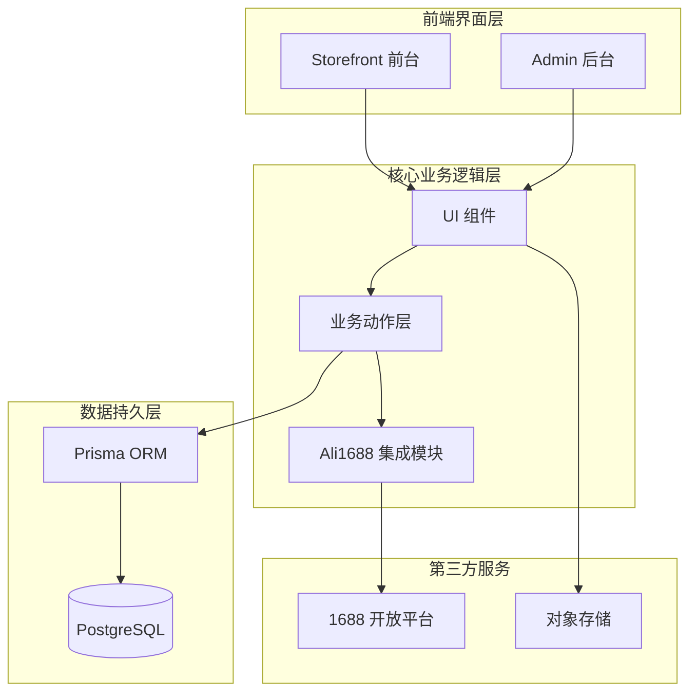
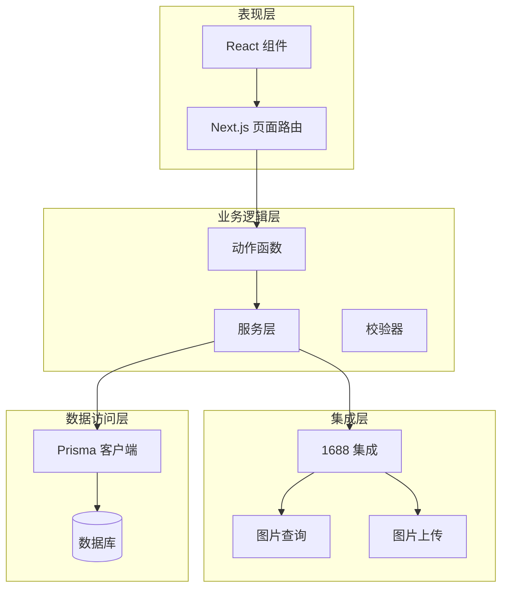
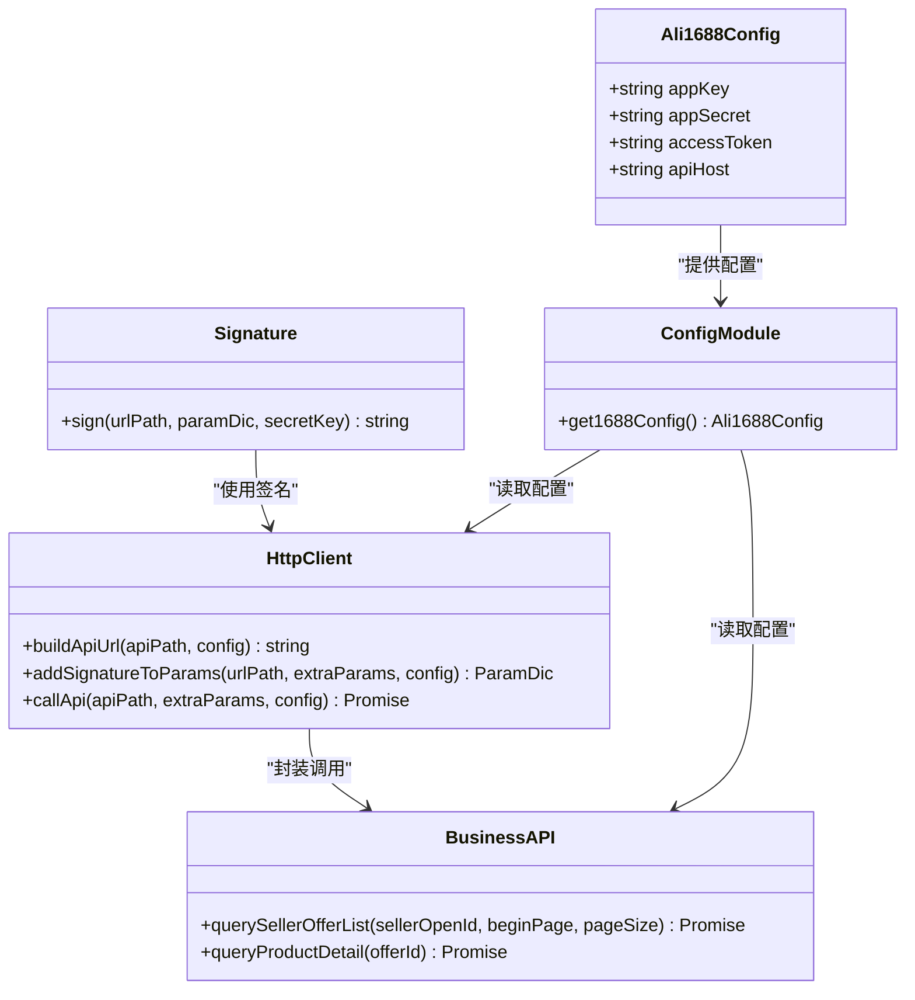
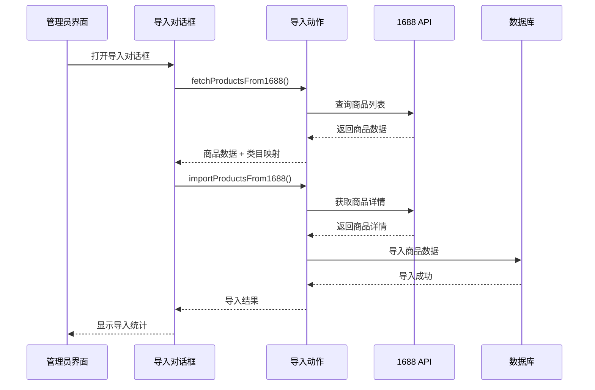
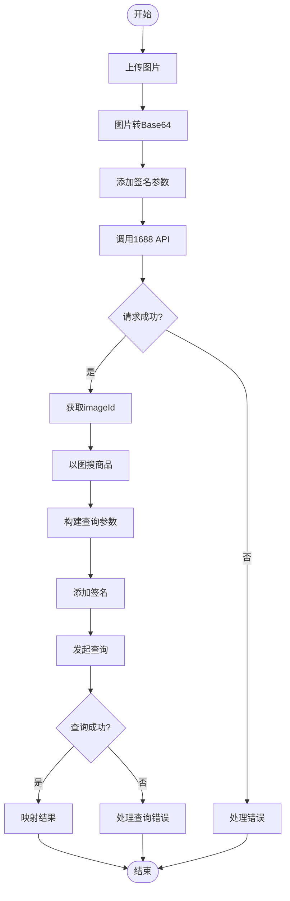
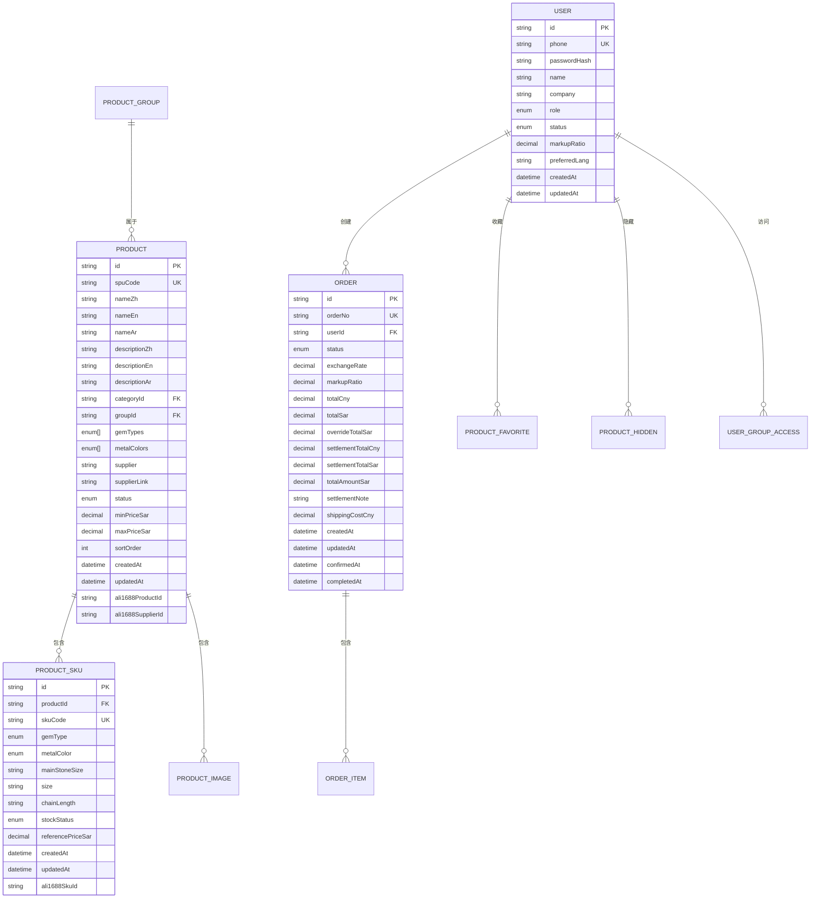
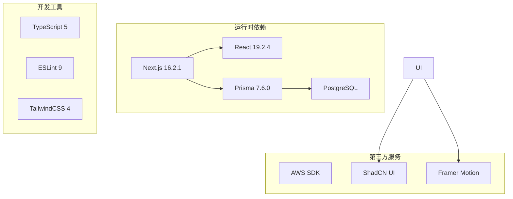

# 1688集成系统

<cite>
**本文档引用的文件**
- [README.md](file://README.md)
- [package.json](file://package.json)
- [src/lib/ali1688/index.ts](file://src/lib/ali1688/index.ts)
- [src/lib/ali1688/config.ts](file://src/lib/ali1688/config.ts)
- [src/lib/ali1688/signature.ts](file://src/lib/ali1688/signature.ts)
- [src/lib/ali1688/client.ts](file://src/lib/ali1688/client.ts)
- [src/lib/ali1688/api.ts](file://src/lib/ali1688/api.ts)
- [docs/1688 demo/integration-1688/index.ts](file://docs/1688 demo/integration-1688/index.ts)
- [docs/1688 demo/integration-1688/CAPABILITIES.md](file://docs/1688 demo/integration-1688/CAPABILITIES.md)
- [docs/1688 demo/integration-1688/image-query.ts](file://docs/1688 demo/integration-1688/image-query.ts)
- [docs/1688 demo/integration-1688/image-upload.ts](file://docs/1688 demo/integration-1688/image-upload.ts)
- [docs/1688 demo/integration-1688/image-query-types.ts](file://docs/1688 demo/integration-1688/image-query-types.ts)
- [src/components/admin/ali1688-import-dialog.tsx](file://src/components/admin/ali1688-import-dialog.tsx)
- [src/components/admin/ali1688-sync-dialog.tsx](file://src/components/admin/ali1688-sync-dialog.tsx)
- [prisma/schema.prisma](file://prisma/schema.prisma)
</cite>

## 目录
1. [项目概述](#项目概述)
2. [项目结构](#项目结构)
3. [核心组件](#核心组件)
4. [架构总览](#架构总览)
5. [详细组件分析](#详细组件分析)
6. [依赖关系分析](#依赖关系分析)
7. [性能考虑](#性能考虑)
8. [故障排除指南](#故障排除指南)
9. [结论](#结论)

## 项目概述
本项目是一个基于 Next.js 的电商系统，集成了阿里巴巴 1688 开放平台的能力，主要包含以下功能：
- 1688 商品数据获取与同步
- 1688 图片上传与以图搜商品
- 商品导入与库存管理
- 前台商品浏览与后台管理功能

系统通过严格的模块化设计，确保所有 1688 开放平台调用都通过统一的入口模块完成，保证了安全性和一致性。

## 项目结构
项目采用 Next.js 16.2.1 框架，整体结构清晰，模块职责分明：

**图表来源**
- [src/lib/ali1688/index.ts:1-27](file://src/lib/ali1688/index.ts#L1-L27)
- [src/components/admin/ali1688-import-dialog.tsx:1-544](file://src/components/admin/ali1688-import-dialog.tsx#L1-L544)
- [prisma/schema.prisma:1-350](file://prisma/schema.prisma#L1-L350)

**章节来源**
- [README.md:1-37](file://README.md#L1-L37)
- [package.json:1-62](file://package.json#L1-L62)

## 核心组件
系统的核心组件围绕 1688 集成模块构建，主要包括：

### 1688 集成模块
- **配置管理**：从环境变量读取 1688 API 配置
- **签名算法**：实现 1688 API 请求签名机制
- **HTTP 客户端**：封装统一的 API 调用流程
- **业务 API**：提供商品查询和详情获取功能

### 数据模型
系统使用 Prisma ORM 管理数据库模型，包括用户、商品、订单、分类等核心实体。

**章节来源**
- [src/lib/ali1688/config.ts:1-31](file://src/lib/ali1688/config.ts#L1-L31)
- [src/lib/ali1688/signature.ts:1-36](file://src/lib/ali1688/signature.ts#L1-L36)
- [src/lib/ali1688/client.ts:1-107](file://src/lib/ali1688/client.ts#L1-L107)
- [prisma/schema.prisma:121-156](file://prisma/schema.prisma#L121-L156)

## 架构总览
系统采用分层架构设计，确保各层职责清晰：

**图表来源**
- [src/lib/ali1688/api.ts:1-87](file://src/lib/ali1688/api.ts#L1-L87)
- [docs/1688 demo/integration-1688/image-query.ts:1-194](file://docs/1688 demo/integration-1688/image-query.ts#L1-L194)
- [docs/1688 demo/integration-1688/image-upload.ts:1-100](file://docs/1688 demo/integration-1688/image-upload.ts#L1-L100)

## 详细组件分析

### 1688 集成模块架构

**图表来源**
- [src/lib/ali1688/config.ts:6-31](file://src/lib/ali1688/config.ts#L6-L31)
- [src/lib/ali1688/signature.ts:17-36](file://src/lib/ali1688/signature.ts#L17-L36)
- [src/lib/ali1688/client.ts:20-107](file://src/lib/ali1688/client.ts#L20-L107)
- [src/lib/ali1688/api.ts:37-87](file://src/lib/ali1688/api.ts#L37-L87)

### 商品导入流程

**图表来源**
- [src/components/admin/ali1688-import-dialog.tsx:100-175](file://src/components/admin/ali1688-import-dialog.tsx#L100-L175)
- [src/lib/ali1688/api.ts:37-87](file://src/lib/ali1688/api.ts#L37-L87)

### 图片上传与以图搜流程

**图表来源**
- [docs/1688 demo/integration-1688/image-upload.ts:30-99](file://docs/1688 demo/integration-1688/image-upload.ts#L30-L99)
- [docs/1688 demo/integration-1688/image-query.ts:79-193](file://docs/1688 demo/integration-1688/image-query.ts#L79-L193)

**章节来源**
- [src/lib/ali1688/index.ts:1-27](file://src/lib/ali1688/index.ts#L1-L27)
- [docs/1688 demo/integration-1688/CAPABILITIES.md:1-72](file://docs/1688 demo/integration-1688/CAPABILITIES.md#L1-L72)

### 数据模型关系

**图表来源**
- [prisma/schema.prisma:85-350](file://prisma/schema.prisma#L85-L350)

**章节来源**
- [prisma/schema.prisma:1-350](file://prisma/schema.prisma#L1-L350)

## 依赖关系分析
系统依赖关系清晰，主要依赖包括：

**图表来源**
- [package.json:11-46](file://package.json#L11-L46)

**章节来源**
- [package.json:1-62](file://package.json#L1-L62)

## 性能考虑
系统在性能方面采用了多项优化措施：

### 1688 API 调用优化
- **批量处理**：支持分页获取商品数据，避免一次性请求过多数据
- **缓存策略**：建议在业务层实现适当的缓存机制
- **并发控制**：限制同时发起的 API 请求数量

### 数据库性能
- **索引优化**：为常用查询字段建立索引
- **连接池**：使用 Prisma 连接池管理数据库连接
- **查询优化**：避免 N+1 查询问题

### 前端性能
- **懒加载**：图片和组件按需加载
- **状态管理**：使用 Zustand 进行轻量级状态管理
- **代码分割**：Next.js 自动进行代码分割

## 故障排除指南

### 1688 API 配置问题
**症状**：启动时抛出配置缺失错误
**解决方案**：
1. 检查环境变量是否正确设置
2. 确认 ALI_1688_APP_KEY、ALI_1688_APP_SECRET、ALI_1688_ACCESS_TOKEN 是否存在
3. 验证 API Host 设置是否正确

### 签名验证失败
**症状**：1688 API 返回签名错误
**解决方案**：
1. 检查时间戳是否正确添加
2. 确认参数排序是否符合要求
3. 验证 AppSecret 是否正确

### 图片上传失败
**症状**：图片上传后无法获取 imageId
**解决方案**：
1. 检查图片格式是否支持
2. 确认 Base64 编码是否正确
3. 验证上传参数格式

**章节来源**
- [src/lib/ali1688/config.ts:18-31](file://src/lib/ali1688/config.ts#L18-L31)
- [src/lib/ali1688/client.ts:73-107](file://src/lib/ali1688/client.ts#L73-L107)
- [docs/1688 demo/integration-1688/image-upload.ts:55-99](file://docs/1688 demo/integration-1688/image-upload.ts#L55-L99)

## 结论
本 1688 集成系统通过模块化的设计和严格的约束机制，成功实现了与阿里巴巴开放平台的安全集成。系统的主要优势包括：

1. **安全性**：所有 1688 调用都通过统一入口，防止了安全漏洞
2. **可维护性**：清晰的模块划分和职责分离
3. **扩展性**：良好的架构设计支持未来功能扩展
4. **可靠性**：完善的错误处理和异常恢复机制

系统目前实现了核心的 1688 集成功能，包括商品数据获取、图片上传和以图搜商品等关键能力，为后续的功能扩展奠定了坚实的基础。