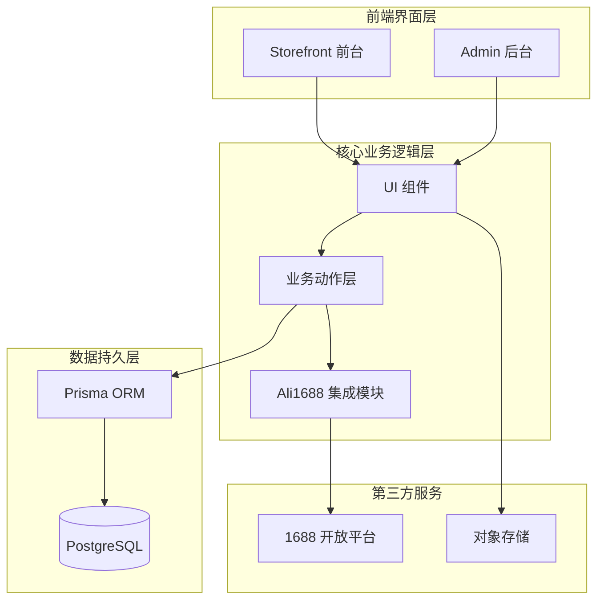
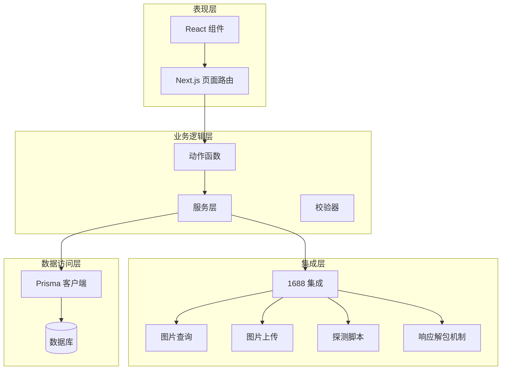
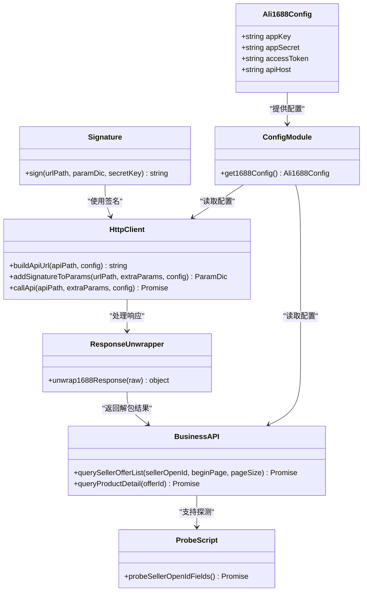
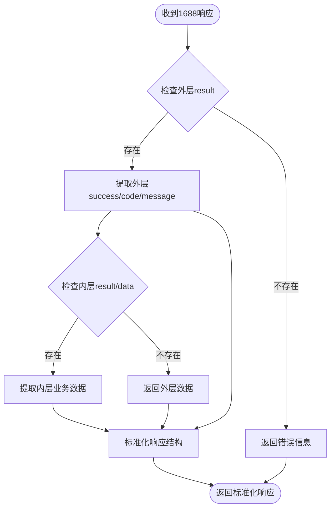
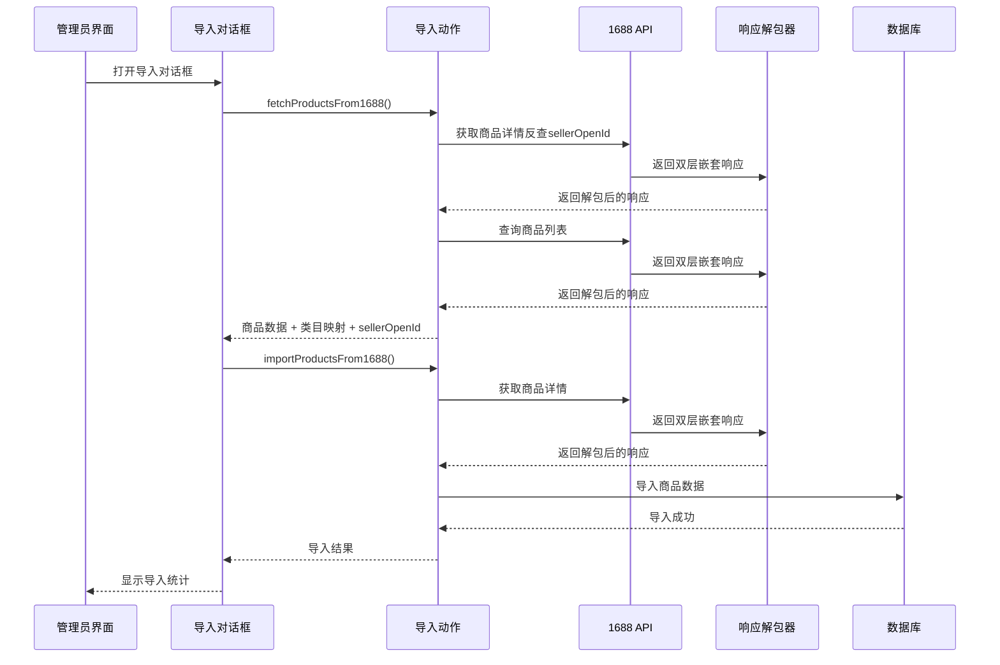
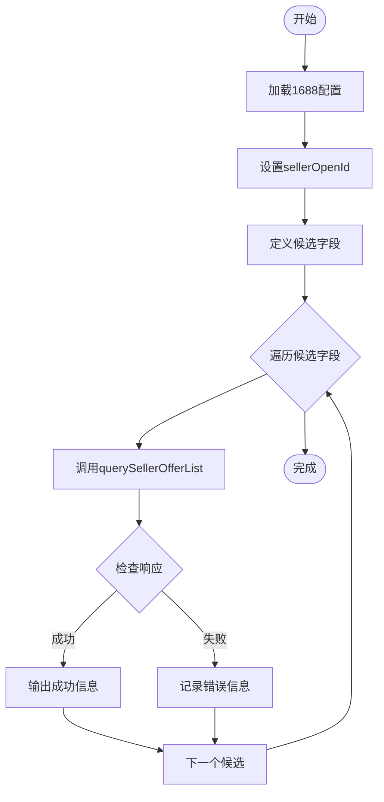
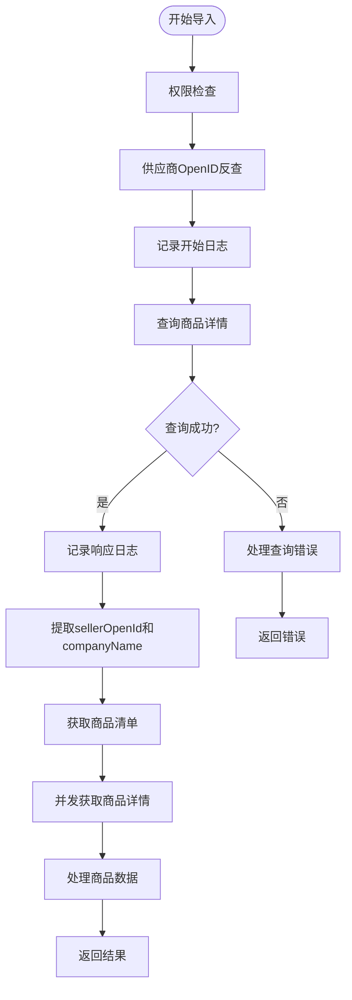
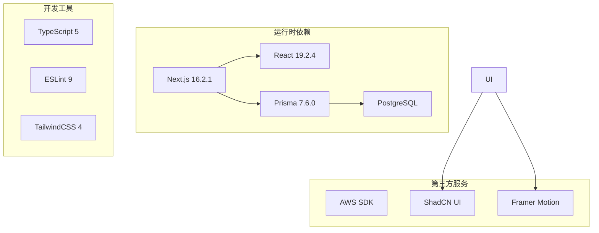

# 1688集成系统

<cite>
**本文档引用的文件**
- [README.md](file://README.md)
- [package.json](file://package.json)
- [src/lib/ali1688/index.ts](file://src/lib/ali1688/index.ts)
- [src/lib/ali1688/config.ts](file://src/lib/ali1688/config.ts)
- [src/lib/ali1688/signature.ts](file://src/lib/ali1688/signature.ts)
- [src/lib/ali1688/client.ts](file://src/lib/ali1688/client.ts)
- [src/lib/ali1688/api.ts](file://src/lib/ali1688/api.ts)
- [src/lib/ali1688/types.ts](file://src/lib/ali1688/types.ts)
- [src/lib/actions/ali1688-import.ts](file://src/lib/actions/ali1688-import.ts)
- [docs/1688 demo/integration-1688/index.ts](file://docs/1688 demo/integration-1688/index.ts)
- [docs/1688 demo/integration-1688/CAPABILITIES.md](file://docs/1688 demo/integration-1688/CAPABILITIES.md)
- [docs/1688 demo/integration-1688/image-query.ts](file://docs/1688 demo/integration-1688/image-query.ts)
- [docs/1688 demo/integration-1688/image-upload.ts](file://docs/1688 demo/integration-1688/image-upload.ts)
- [docs/1688 demo/integration-1688/image-query-types.ts](file://docs/1688 demo/integration-1688/image-query-types.ts)
- [docs/1688 demo/integration-1688/run-1688-query-seller-offer-list.ts](file://docs/1688 demo/integration-1688/run-1688-query-seller-offer-list.ts)
- [docs/1688 demo/integration-1688/run-1688-query-product-detail.ts](file://docs/1688 demo/integration-1688/run-1688-query-product-detail.ts)
- [src/components/admin/ali1688-import-dialog.tsx](file://src/components/admin/ali1688-import-dialog.tsx)
- [src/components/admin/ali1688-sync-dialog.tsx](file://src/components/admin/ali1688-sync-dialog.tsx)
- [prisma/schema.prisma](file://prisma/schema.prisma)
- [prisma/migrations/20260517000001_add_ali1688_fields/migration.sql](file://prisma/migrations/20260517000001_add_ali1688_fields/migration.sql)
</cite>

## 更新摘要
**变更内容**
- 新增Ali1688响应解包机制，实现unwrap1688Response函数统一处理双层嵌套响应
- 增强API端点优化，改进数据处理流程和错误处理机制
- 优化商品导入系统的响应处理，提升数据提取准确性
- 新增数据库字段支持ali1688_product_id、ali1688_supplier_id、ali1688_sku_id
- 改进探测脚本功能，增强sellerOpenId字段探测能力

## 目录
1. [项目概述](#项目概述)
2. [项目结构](#项目结构)
3. [核心组件](#核心组件)
4. [架构总览](#架构总览)
5. [详细组件分析](#详细组件分析)
6. [依赖关系分析](#依赖关系分析)
7. [性能考虑](#性能考虑)
8. [故障排除指南](#故障排除指南)
9. [结论](#结论)

## 项目概述
本项目是一个基于 Next.js 的电商系统，集成了阿里巴巴 1688 开放平台的能力，主要包含以下功能：
- 1688 商品数据获取与同步
- 1688 图片上传与以图搜商品
- 商品导入与库存管理
- 前台商品浏览与后台管理功能

系统通过严格的模块化设计，确保所有 1688 开放平台调用都通过统一的入口模块完成，保证了安全性和一致性。**更新** 新增了响应解包机制，统一处理1688 API的双层嵌套响应结构。

## 项目结构
项目采用 Next.js 16.2.1 框架，整体结构清晰，模块职责分明：

**图表来源**
- [src/lib/ali1688/index.ts:1-27](file://src/lib/ali1688/index.ts#L1-L27)
- [src/components/admin/ali1688-import-dialog.tsx:1-553](file://src/components/admin/ali1688-import-dialog.tsx#L1-L553)
- [prisma/schema.prisma:1-350](file://prisma/schema.prisma#L1-L350)

**章节来源**
- [README.md:1-37](file://README.md#L1-L37)
- [package.json:1-62](file://package.json#L1-L62)

## 核心组件
系统的核心组件围绕 1688 集成模块构建，主要包括：

### 1688 集成模块
- **配置管理**：从环境变量读取 1688 API 配置
- **签名算法**：实现 1688 API 请求签名机制
- **HTTP 客户端**：封装统一的 API 调用流程
- **业务 API**：提供商品查询和详情获取功能
- **响应解包机制**：统一处理1688 API的双层嵌套响应结构

### 数据模型
系统使用 Prisma ORM 管理数据库模型，包括用户、商品、订单、分类等核心实体。**更新** 新增ali1688相关字段支持。

**章节来源**
- [src/lib/ali1688/config.ts:1-31](file://src/lib/ali1688/config.ts#L1-L31)
- [src/lib/ali1688/signature.ts:1-36](file://src/lib/ali1688/signature.ts#L1-L36)
- [src/lib/ali1688/client.ts:1-107](file://src/lib/ali1688/client.ts#L1-L107)
- [src/lib/ali1688/api.ts:25-63](file://src/lib/ali1688/api.ts#L25-L63)
- [prisma/schema.prisma:121-156](file://prisma/schema.prisma#L121-L156)

## 架构总览
系统采用分层架构设计，确保各层职责清晰：

**图表来源**
- [src/lib/ali1688/api.ts:1-129](file://src/lib/ali1688/api.ts#L1-L129)
- [docs/1688 demo/integration-1688/image-query.ts:1-194](file://docs/1688 demo/integration-1688/image-query.ts#L1-L194)
- [docs/1688 demo/integration-1688/image-upload.ts:1-100](file://docs/1688 demo/integration-1688/image-upload.ts#L1-L100)
- [docs/1688 demo/integration-1688/run-1688-query-seller-offer-list.ts:1-164](file://docs/1688 demo/integration-1688/run-1688-query-seller-offer-list.ts#L1-L164)

## 详细组件分析

### 1688 集成模块架构

**图表来源**
- [src/lib/ali1688/config.ts:6-31](file://src/lib/ali1688/config.ts#L6-L31)
- [src/lib/ali1688/signature.ts:17-36](file://src/lib/ali1688/signature.ts#L17-L36)
- [src/lib/ali1688/client.ts:20-107](file://src/lib/ali1688/client.ts#L20-L107)
- [src/lib/ali1688/api.ts:25-63](file://src/lib/ali1688/api.ts#L25-L63)
- [src/lib/ali1688/api.ts:77-129](file://src/lib/ali1688/api.ts#L77-L129)
- [docs/1688 demo/integration-1688/run-1688-query-seller-offer-list.ts:25-164](file://docs/1688 demo/integration-1688/run-1688-query-seller-offer-list.ts#L25-L164)

### 响应解包机制详解
**新增** 系统现在包含一个专门的响应解包机制，用于统一处理1688 API的双层嵌套响应结构：

**图表来源**
- [src/lib/ali1688/api.ts:25-63](file://src/lib/ali1688/api.ts#L25-L63)

### 商品导入流程

**图表来源**
- [src/components/admin/ali1688-import-dialog.tsx:100-175](file://src/components/admin/ali1688-import-dialog.tsx#L100-L175)
- [src/lib/actions/ali1688-import.ts:217-390](file://src/lib/actions/ali1688-import.ts#L217-L390)
- [src/lib/ali1688/api.ts:77-129](file://src/lib/ali1688/api.ts#L77-L129)

### 探测脚本功能
新增的run-1688-query-seller-offer-list.ts演示脚本提供了完整的sellerOpenId字段探测功能：

**图表来源**
- [docs/1688 demo/integration-1688/run-1688-query-seller-offer-list.ts:131-158](file://docs/1688 demo/integration-1688/run-1688-query-seller-offer-list.ts#L131-L158)

### 图片上传与以图搜流程

**图表来源**
- [docs/1688 demo/integration-1688/image-upload.ts:30-99](file://docs/1688 demo/integration-1688/image-upload.ts#L30-L99)
- [docs/1688 demo/integration-1688/image-query.ts:79-193](file://docs/1688 demo/integration-1688/image-query.ts#L79-L193)

### 增强的错误处理和调试能力
**更新** 系统现在具备了全面的错误处理和调试能力，特别是在fetchProductsFrom1688函数中：

- **供应商OpenID反查操作的日志记录**：在第240行开始的完整日志记录流程
- **详细的错误信息输出**：包括响应体截断显示（第253行的JSON字符串截断）
- **多层级的try-catch保护**：从API调用到数据处理的完整保护
- **并发池的错误处理**：promisePool函数中的单个项失败处理

**图表来源**
- [src/lib/actions/ali1688-import.ts:240-282](file://src/lib/actions/ali1688-import.ts#L240-L282)
- [src/lib/actions/ali1688-import.ts:330-343](file://src/lib/actions/ali1688-import.ts#L330-L343)

**章节来源**
- [src/lib/ali1688/index.ts:1-27](file://src/lib/ali1688/index.ts#L1-L27)
- [docs/1688 demo/integration-1688/CAPABILITIES.md:1-72](file://docs/1688 demo/integration-1688/CAPABILITIES.md#L1-L72)
- [src/lib/actions/ali1688-import.ts:240-282](file://src/lib/actions/ali1688-import.ts#L240-L282)

### 数据模型关系

**图表来源**
- [prisma/schema.prisma:85-350](file://prisma/schema.prisma#L85-L350)

**章节来源**
- [prisma/schema.prisma:1-350](file://prisma/schema.prisma#L1-L350)

## 依赖关系分析
系统依赖关系清晰，主要依赖包括：

**图表来源**
- [package.json:11-46](file://package.json#L11-L46)

**章节来源**
- [package.json:1-62](file://package.json#L1-L62)

## 性能考虑
系统在性能方面采用了多项优化措施：

### 1688 API 调用优化
- **批量处理**：支持分页获取商品数据，避免一次性请求过多数据
- **缓存策略**：建议在业务层实现适当的缓存机制
- **并发控制**：限制同时发起的 API 请求数量
- **探测脚本优化**：run-1688-query-seller-offer-list.ts脚本支持并行字段探测
- **增强的错误处理**：减少因单点故障导致的性能影响
- **响应解包优化**：统一处理双层嵌套响应，提升数据提取效率

### 数据库性能
- **索引优化**：为常用查询字段建立索引
- **连接池**：使用 Prisma 连接池管理数据库连接
- **查询优化**：避免 N+1 查询问题
- **新增字段优化**：ali1688相关字段支持提升数据关联效率

### 前端性能
- **懒加载**：图片和组件按需加载
- **状态管理**：使用 Zustand 进行轻量级状态管理
- **代码分割**：Next.js 自动进行代码分割

## 故障排除指南

### 1688 API 配置问题
**症状**：启动时抛出配置缺失错误
**解决方案**：
1. 检查环境变量是否正确设置
2. 确认 ALI_1688_APP_KEY、ALI_1688_APP_SECRET、ALI_1688_ACCESS_TOKEN 是否存在
3. 验证 API Host 设置是否正确

### 签名验证失败
**症状**：1688 API 返回签名错误
**解决方案**：
1. 检查时间戳是否正确添加
2. 确认参数排序是否符合要求
3. 验证 AppSecret 是否正确

### 图片上传失败
**症状**：图片上传后无法获取 imageId
**解决方案**：
1. 检查图片格式是否支持
2. 确认 Base64 编码是否正确
3. 验证上传参数格式

### sellerOpenId 字段探测问题
**症状**：run-1688-query-seller-offer-list.ts脚本无法确定正确的字段名
**解决方案**：
1. 确认 SELLER_ID 或 ALI_1688_TEST_SELLER_ID 环境变量设置正确
2. 检查1688 API访问权限
3. 验证提供的sellerOpenId格式是否正确
4. 查看控制台输出的详细日志信息

### 导入对话框用户体验问题
**症状**：导入过程中出现sellerOpenId或companyName相关错误
**解决方案**：
1. 确认商品详情中包含sellerOpenId和companyName字段
2. 检查fetchProductsFrom1688函数的返回数据结构
3. 验证导入对话框的状态管理逻辑
4. 查看控制台中的详细错误日志

### 响应解包机制问题
**症状**：API响应解包失败或数据提取不准确
**解决方案**：
1. 检查unwrap1688Response函数的实现逻辑
2. 验证1688 API响应的双层嵌套结构
3. 确认success字段的布尔值处理（支持true和字符串'true'）
4. 查看响应解包过程中的错误处理机制

### 数据库字段映射问题
**症状**：ali1688相关字段无法正确映射到数据库
**解决方案**：
1. 确认数据库迁移已正确执行
2. 检查prisma/schema.prisma中的字段定义
3. 验证字段类型和约束条件
4. 查看数据库连接和权限配置

### 增强的调试支持
**症状**：导入过程中的具体错误定位困难
**解决方案**：
1. 查看fetchProductsFrom1688函数中的详细日志输出
2. 关注供应商OpenID反查操作的日志（第240-276行）
3. 检查并发获取商品详情时的错误处理（第337行）
4. 使用run-1688-query-seller-offer-list.ts脚本进行字段探测
5. 利用响应解包机制的错误信息进行问题诊断

**章节来源**
- [src/lib/ali1688/config.ts:18-31](file://src/lib/ali1688/config.ts#L18-L31)
- [src/lib/ali1688/client.ts:73-107](file://src/lib/ali1688/client.ts#L73-L107)
- [src/lib/ali1688/api.ts:25-63](file://src/lib/ali1688/api.ts#L25-L63)
- [docs/1688 demo/integration-1688/image-upload.ts:55-99](file://docs/1688 demo/integration-1688/image-upload.ts#L55-L99)
- [docs/1688 demo/integration-1688/run-1688-query-seller-offer-list.ts:131-158](file://docs/1688 demo/integration-1688/run-1688-query-seller-offer-list.ts#L131-L158)
- [src/components/admin/ali1688-import-dialog.tsx:100-175](file://src/components/admin/ali1688-import-dialog.tsx#L100-L175)
- [src/lib/actions/ali1688-import.ts:240-282](file://src/lib/actions/ali1688-import.ts#L240-L282)

## 结论
本 1688 集成系统通过模块化的设计和严格的约束机制，成功实现了与阿里巴巴开放平台的安全集成。**更新** 新增的响应解包机制进一步提升了系统的稳定性和可靠性。系统的主要优势包括：

1. **安全性**：所有 1688 调用都通过统一入口，防止了安全漏洞
2. **可维护性**：清晰的模块划分和职责分离
3. **扩展性**：良好的架构设计支持未来功能扩展
4. **可靠性**：完善的错误处理和异常恢复机制
5. **易用性**：新增的探测脚本和改进的导入对话框提升了用户体验
6. **可观测性**：全面的console日志记录和错误处理机制
7. **数据完整性**：响应解包机制确保数据提取的准确性和一致性
8. **数据库支持**：新增ali1688相关字段支持，提升数据关联能力

系统目前实现了核心的 1688 集成功能，包括商品数据获取、图片上传和以图搜商品等关键能力，为后续的功能扩展奠定了坚实的基础。新增的unwrap1688Response函数和响应解包机制进一步增强了系统的调试和诊断能力，而改进的导入对话框则提供了更好的用户体验。特别是增强的错误处理和调试能力，使得系统在生产环境中更加稳定可靠，能够快速定位和解决各种技术问题。

**更新** 响应解包机制的引入标志着系统在数据处理方面的成熟度提升，为未来的功能扩展和维护提供了更好的基础。