# 后台布局架构

<cite>
**本文档引用的文件**
- [admin-layout.tsx](file://src/components/admin/admin-layout.tsx)
- [layout.tsx](file://src/app/admin/layout.tsx)
- [page.tsx](file://src/app/admin/page.tsx)
- [globals.css](file://src/app/globals.css)
- [button.tsx](file://src/components/ui/button.tsx)
- [utils.ts](file://src/lib/utils.ts)
- [index.ts](file://src/types/index.ts)
- [constants.ts](file://src/lib/constants.ts)
- [package.json](file://package.json)
</cite>

## 目录
1. [简介](#简介)
2. [项目结构](#项目结构)
3. [核心组件](#核心组件)
4. [架构概览](#架构概览)
5. [详细组件分析](#详细组件分析)
6. [依赖关系分析](#依赖关系分析)
7. [性能考虑](#性能考虑)
8. [故障排除指南](#故障排除指南)
9. [结论](#结论)

## 简介

Celestia珠宝管理后台采用现代化的响应式设计架构，基于Next.js 16框架构建。本项目的核心是AdminLayout组件，它实现了优雅的后台管理界面布局，具备桌面端固定侧边栏和移动端滑动侧边栏的双重适配能力。

该布局系统采用了深色主题设计（#0A0A0A背景），结合金色装饰元素（#C9A96E），营造出高端珠宝品牌的视觉体验。系统通过Tailwind CSS实现响应式布局，支持从移动端到桌面端的无缝切换。

## 项目结构

项目采用模块化的文件组织方式，后台布局相关的文件分布如下：

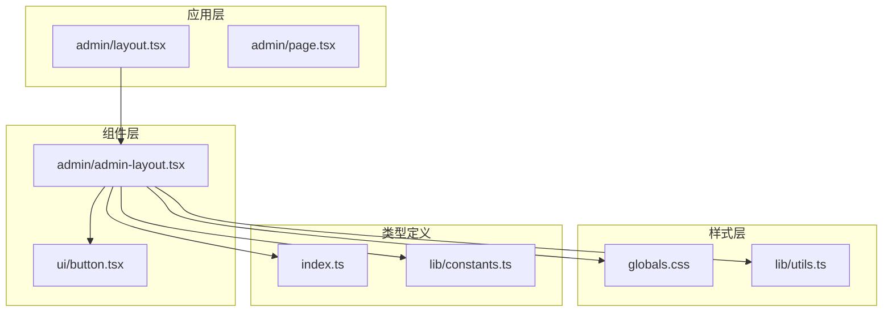

**图表来源**
- [admin-layout.tsx:1-207](file://src/components/admin/admin-layout.tsx#L1-L207)
- [layout.tsx:1-10](file://src/app/admin/layout.tsx#L1-L10)
- [globals.css:1-137](file://src/app/globals.css#L1-L137)

**章节来源**
- [admin-layout.tsx:1-207](file://src/components/admin/admin-layout.tsx#L1-L207)
- [layout.tsx:1-10](file://src/app/admin/layout.tsx#L1-L10)

## 核心组件

### AdminLayout组件概述

AdminLayout是整个后台管理系统的核心布局组件，负责管理页面的整体结构和交互行为。该组件实现了以下关键功能：

- **响应式布局系统**：桌面端固定侧边栏，移动端滑动侧边栏
- **导航系统**：菜单项高亮和活动状态管理
- **头部导航**：面包屑导航和用户信息显示
- **移动端适配**：手势操作和触摸友好的交互设计

### 组件状态管理

组件使用React的useState钩子管理侧边栏的打开/关闭状态：

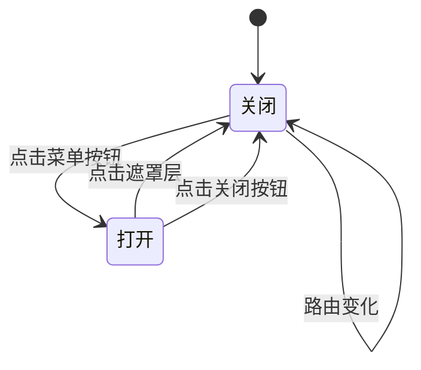

**图表来源**
- [admin-layout.tsx:42](file://src/components/admin/admin-layout.tsx#L42)

### 导航系统设计

导航系统通过静态配置实现，包含五个主要菜单项：

| 菜单项 | 路径 | 图标 | 功能描述 |
|--------|------|------|----------|
| 仪表盘 | /admin | LayoutDashboard | 系统概览和统计信息 |
| 商品管理 | /admin/products | Package | 商品信息管理 |
| 订单管理 | /admin/orders | ShoppingBag | 订单处理和跟踪 |
| 客户管理 | /admin/customers | Users | 客户信息维护 |
| 系统设置 | /admin/settings | Settings | 系统配置和设置 |

**章节来源**
- [admin-layout.tsx:24-38](file://src/components/admin/admin-layout.tsx#L24-L38)

## 架构概览

### 整体架构设计

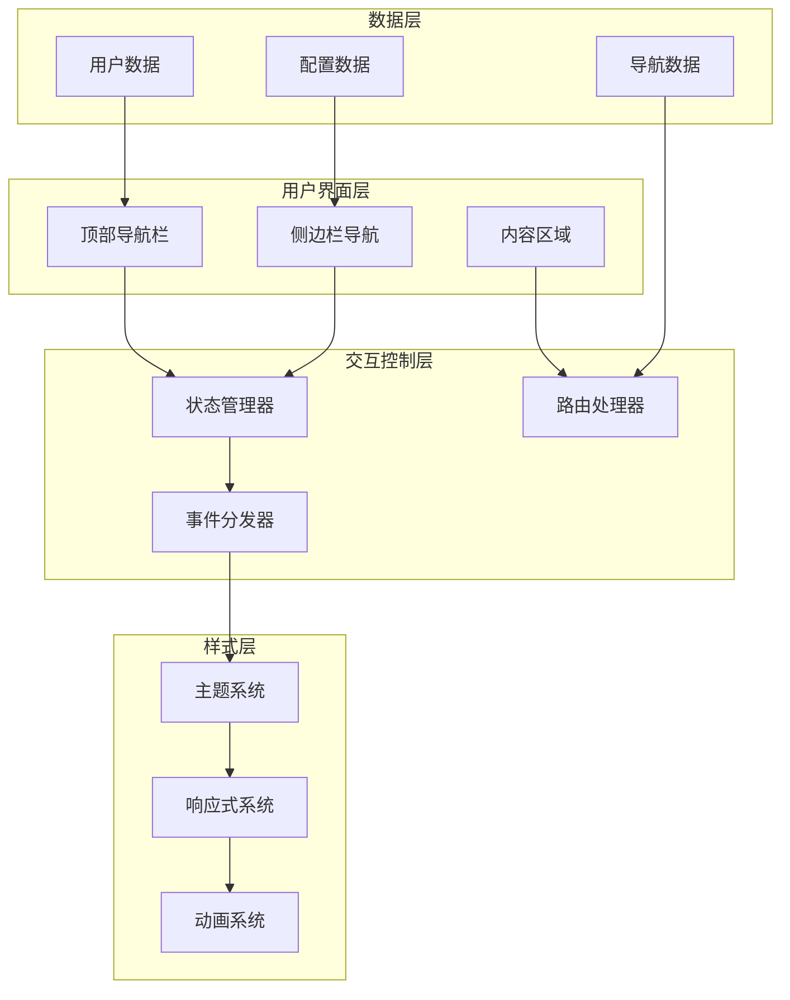

**图表来源**
- [admin-layout.tsx:40-206](file://src/components/admin/admin-layout.tsx#L40-L206)
- [globals.css:51-125](file://src/app/globals.css#L51-L125)

### 数据流架构

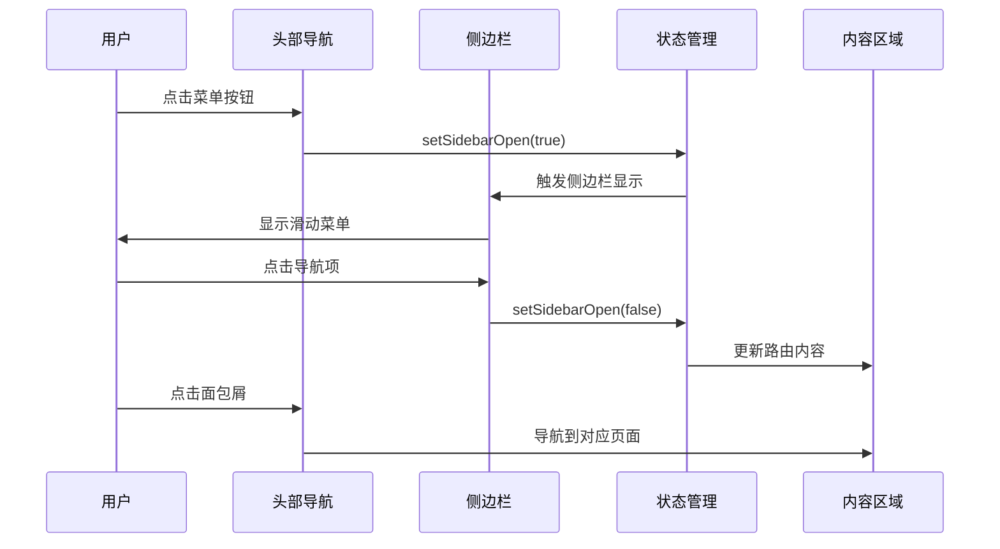

**图表来源**
- [admin-layout.tsx:109-174](file://src/components/admin/admin-layout.tsx#L109-L174)
- [admin-layout.tsx:181-188](file://src/components/admin/admin-layout.tsx#L181-L188)

## 详细组件分析

### 响应式布局系统

#### 桌面端布局

桌面端采用固定宽度的侧边栏设计，宽度为256像素（w-64）。侧边栏包含品牌Logo、导航菜单和退出登录功能。

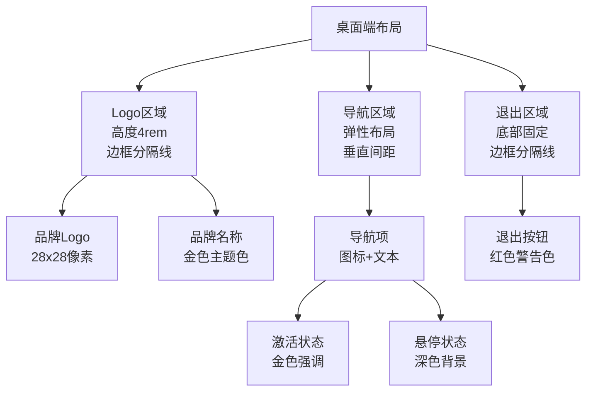

**图表来源**
- [admin-layout.tsx:49-98](file://src/components/admin/admin-layout.tsx#L49-L98)

#### 移动端布局

移动端采用滑动侧边栏设计，通过CSS变换实现平滑的展开/收起效果。侧边栏宽度同样为256像素，但通过transform属性控制其位置。

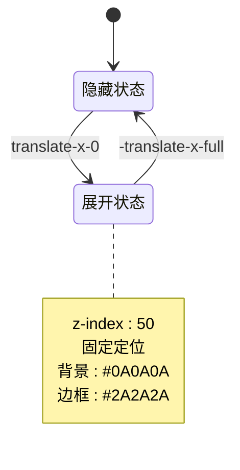

**图表来源**
- [admin-layout.tsx:110-113](file://src/components/admin/admin-layout.tsx#L110-L113)

#### 响应式断点设计

系统使用Tailwind CSS的响应式断点系统：

| 断点 | 类名 | 最小宽度 | 设备类型 |
|------|------|----------|----------|
| 移动端 | 默认 | 0px | 手机、平板横屏 |
| 小平板 | sm | 640px | 平板竖屏 |
| 中平板 | md | 768px | 大平板 |
| 大平板 | lg | 1024px | 桌面端 |
| 超大屏 | xl | 1280px | 超宽屏显示器 |

**章节来源**
- [admin-layout.tsx:49](file://src/components/admin/admin-layout.tsx#L49)
- [admin-layout.tsx:110](file://src/components/admin/admin-layout.tsx#L110)

### 导航系统实现

#### 活动状态管理

导航系统的活动状态通过URL路径匹配实现，支持精确匹配和前缀匹配两种模式：

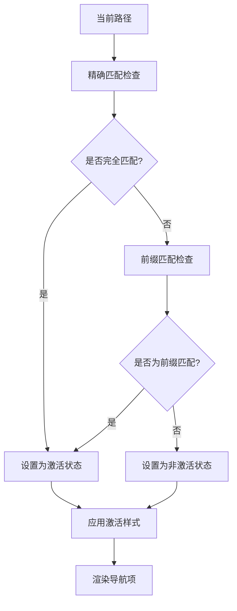

**图表来源**
- [admin-layout.tsx:67](file://src/components/admin/admin-layout.tsx#L67)
- [admin-layout.tsx:142](file://src/components/admin/admin-layout.tsx#L142)

#### 导航项配置

每个导航项包含以下属性：

| 属性 | 类型 | 描述 | 示例值 |
|------|------|------|--------|
| href | string | 导航链接地址 | "/admin/products" |
| icon | ComponentType | 图标组件 | Package |
| label | string | 菜单标签文本 | "商品管理" |

**章节来源**
- [admin-layout.tsx:24-30](file://src/components/admin/admin-layout.tsx#L24-L30)

### 头部导航设计

#### 面包屑导航

头部导航包含面包屑导航和用户信息显示区域。面包屑根据当前路径动态生成页面标题。

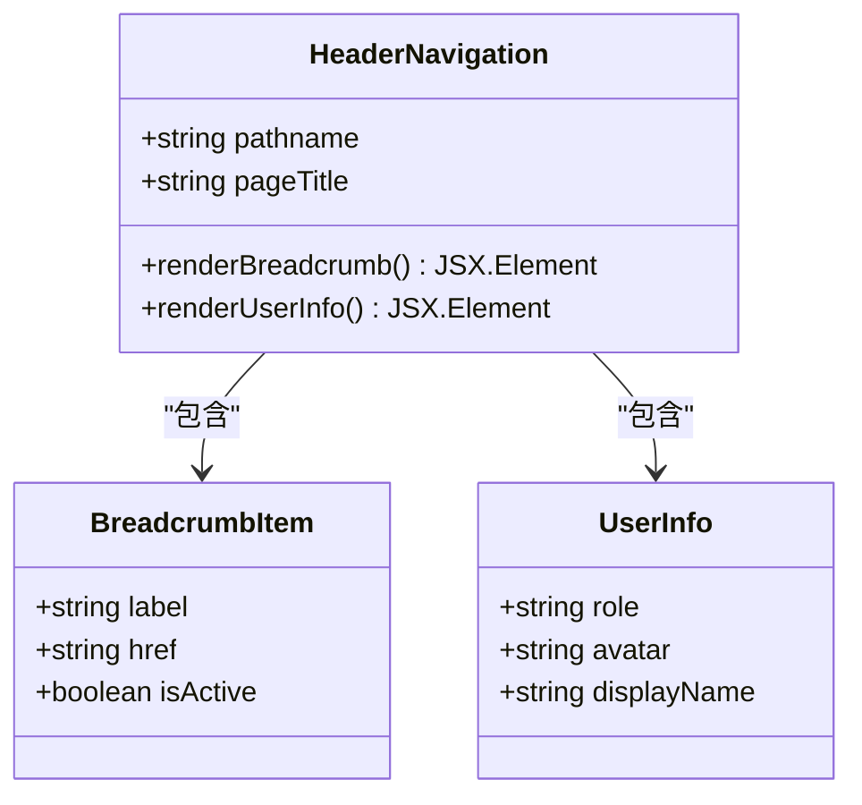

**图表来源**
- [admin-layout.tsx:179-199](file://src/components/admin/admin-layout.tsx#L179-L199)

#### 用户信息展示

用户信息区域包含角色标识和头像显示，采用圆形头像设计，背景使用金色半透明效果。

**章节来源**
- [admin-layout.tsx:191-198](file://src/components/admin/admin-layout.tsx#L191-L198)

### 移动端适配机制

#### 触摸交互优化

移动端侧边栏采用触摸友好的交互设计：

- **滑动手势**：支持从屏幕边缘滑动打开侧边栏
- **点击遮罩**：点击半透明遮罩层自动关闭侧边栏
- **返回按钮**：侧边栏顶部提供明确的关闭按钮

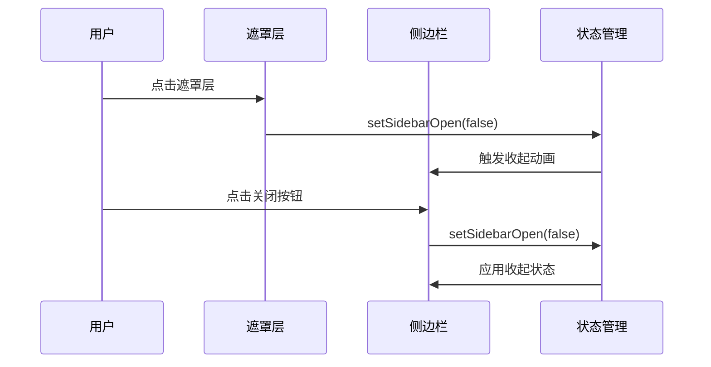

**图表来源**
- [admin-layout.tsx:101-106](file://src/components/admin/admin-layout.tsx#L101-L106)
- [admin-layout.tsx:129-136](file://src/components/admin/admin-layout.tsx#L129-L136)

#### 屏幕尺寸适配

系统针对不同屏幕尺寸提供优化的布局：

- **小屏幕（<1024px）**：侧边栏变为滑动菜单，顶部显示汉堡菜单
- **大屏幕（≥1024px）**：侧边栏固定显示，导航项水平排列
- **超大屏幕（≥1280px）**：内容区域增加内边距，提升可读性

**章节来源**
- [admin-layout.tsx:184](file://src/components/admin/admin-layout.tsx#L184)
- [admin-layout.tsx:202](file://src/components/admin/admin-layout.tsx#L202)

### 样式系统架构

#### 主题色彩体系

系统采用深色主题设计，核心色彩包括：

| 色彩类别 | HEX值 | 使用场景 |
|----------|-------|----------|
| 背景色 | #0A0A0A | 页面背景、侧边栏背景 |
| 主色调 | #C9A96E | 强调色、激活状态、链接颜色 |
| 辅助色 | #1A1A1A | 卡片背景、悬停状态 |
| 边框色 | #2A2A2A | 分割线、边框、容器边框 |
| 文字色 | #F5F5F5 | 主要文字、标题文字 |
| 次文字色 | #A0A0A0 | 次要文字、占位符文字 |

#### Tailwind CSS集成

系统通过Tailwind CSS实现原子化样式设计，支持：

- **响应式断点**：sm、md、lg、xl等断点
- **颜色变量**：通过CSS变量实现主题定制
- **间距系统**：基于4px的网格系统
- **字体系统**：可变字体支持，字号递增

**章节来源**
- [globals.css:51-125](file://src/app/globals.css#L51-L125)

## 依赖关系分析

### 组件依赖图

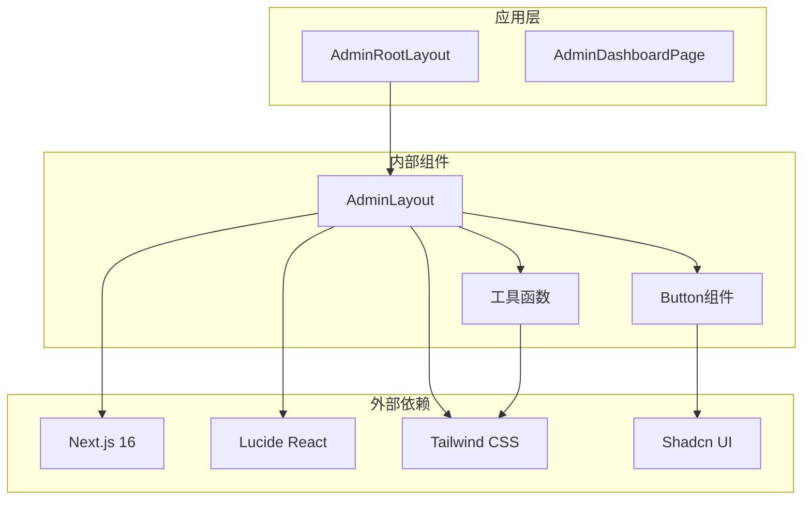

**图表来源**
- [admin-layout.tsx:3](file://src/components/admin/admin-layout.tsx#L3-L18)
- [button.tsx:1](file://src/components/ui/button.tsx#L1)

### 外部依赖分析

系统的主要外部依赖包括：

| 依赖包 | 版本 | 用途 | 重要性 |
|--------|------|------|--------|
| next | 16.2.1 | Web框架 | 核心 |
| lucide-react | ^1.7.0 | 图标库 | UI组件 |
| tailwindcss | ^4 | CSS框架 | 样式系统 |
| class-variance-authority | ^0.7.1 | 组件变体 | UI组件 |
| clsx | ^2.1.1 | 类名合并 | 工具函数 |
| tailwind-merge | ^3.5.0 | Tailwind合并 | 工具函数 |

**章节来源**
- [package.json:11-38](file://package.json#L11-L38)

### 内部模块依赖

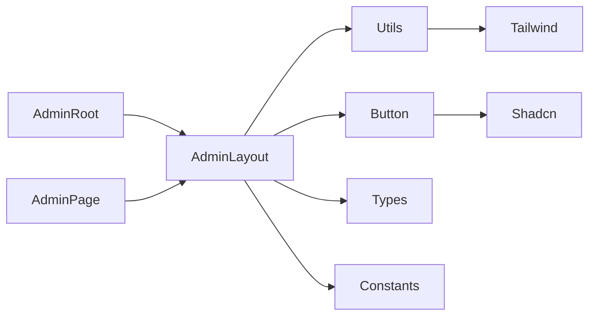

**图表来源**
- [admin-layout.tsx:16](file://src/components/admin/admin-layout.tsx#L16)
- [button.tsx:6](file://src/components/ui/button.tsx#L6)

## 性能考虑

### 渲染优化策略

1. **条件渲染**：移动端侧边栏仅在需要时渲染，减少DOM节点数量
2. **状态最小化**：只维护必要的sidebarOpen状态，避免不必要的重渲染
3. **CSS过渡**：使用硬件加速的CSS变换实现流畅的动画效果

### 内存管理

- **事件监听器**：侧边栏关闭时自动清理事件监听器
- **图片优化**：使用Next.js Image组件实现图片懒加载和优化
- **样式缓存**：Tailwind CSS预编译，减少运行时计算

### 加载性能

- **代码分割**：Next.js自动进行代码分割
- **资源压缩**：生产环境自动启用Gzip压缩
- **字体优化**：可变字体支持，减少字体文件大小

## 故障排除指南

### 常见问题及解决方案

#### 侧边栏无法关闭

**问题描述**：移动端侧边栏点击遮罩层或关闭按钮后无法正常关闭

**可能原因**：
1. 状态更新函数未正确调用
2. 事件冒泡阻止了默认行为
3. CSS变换冲突

**解决方案**：
1. 检查setSidebarOpen函数的调用链
2. 确认onClick事件处理器的正确性
3. 验证CSS变换类名的优先级

#### 导航高亮不准确

**问题描述**：导航菜单项的激活状态与实际页面不匹配

**可能原因**：
1. 路径匹配逻辑错误
2. 前缀匹配规则不当
3. 动态路由参数影响

**解决方案**：
1. 检查pathname比较逻辑
2. 验证前缀匹配的正则表达式
3. 添加路由参数处理

#### 样式显示异常

**问题描述**：颜色显示不符合预期或响应式断点失效

**可能原因**：
1. CSS变量未正确设置
2. Tailwind配置冲突
3. 浏览器兼容性问题

**解决方案**：
1. 检查CSS变量定义
2. 验证Tailwind配置文件
3. 测试不同浏览器的兼容性

**章节来源**
- [admin-layout.tsx:41](file://src/components/admin/admin-layout.tsx#L41)
- [admin-layout.tsx:67](file://src/components/admin/admin-layout.tsx#L67)

## 结论

Celestia后台布局架构展现了现代Web应用的最佳实践，通过精心设计的响应式系统和优雅的交互体验，为珠宝管理后台提供了专业而高效的用户界面。

该架构的主要优势包括：

1. **优秀的响应式设计**：完美适配从移动端到桌面端的各种设备
2. **清晰的组件分离**：布局、导航、样式各司其职，便于维护和扩展
3. **高性能的实现**：通过合理的状态管理和条件渲染优化性能
4. **可定制的主题系统**：基于CSS变量的主题定制，易于扩展

未来可以考虑的改进方向：
- 添加更多的键盘导航支持
- 实现更丰富的动画效果
- 增强无障碍访问功能
- 优化移动端触摸体验