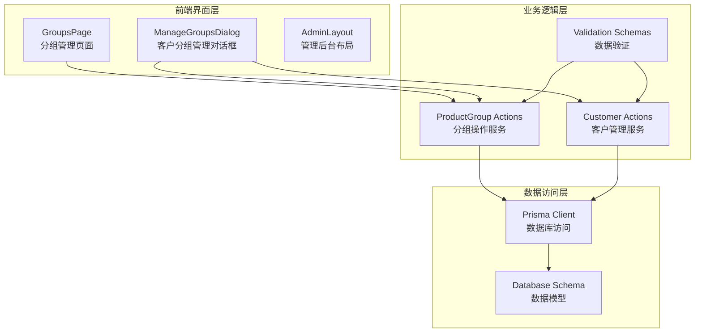
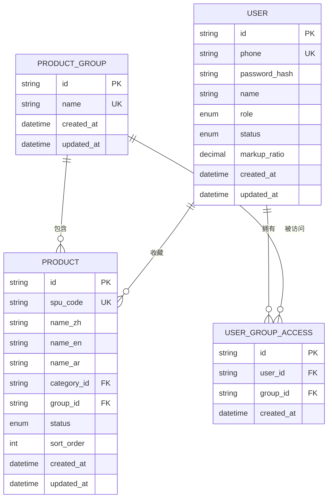
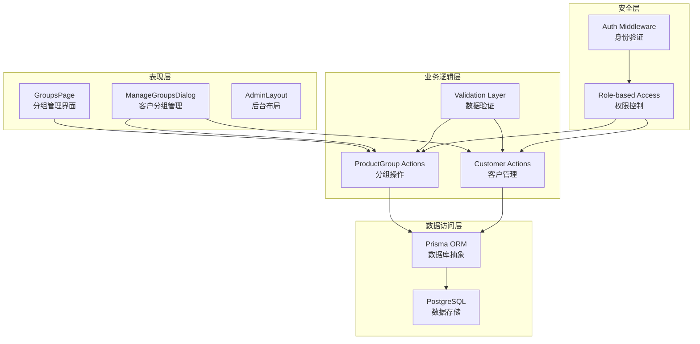
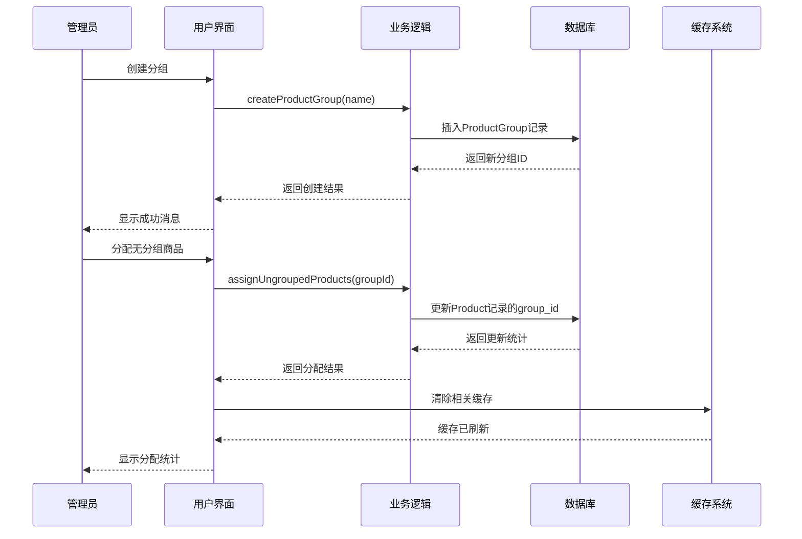
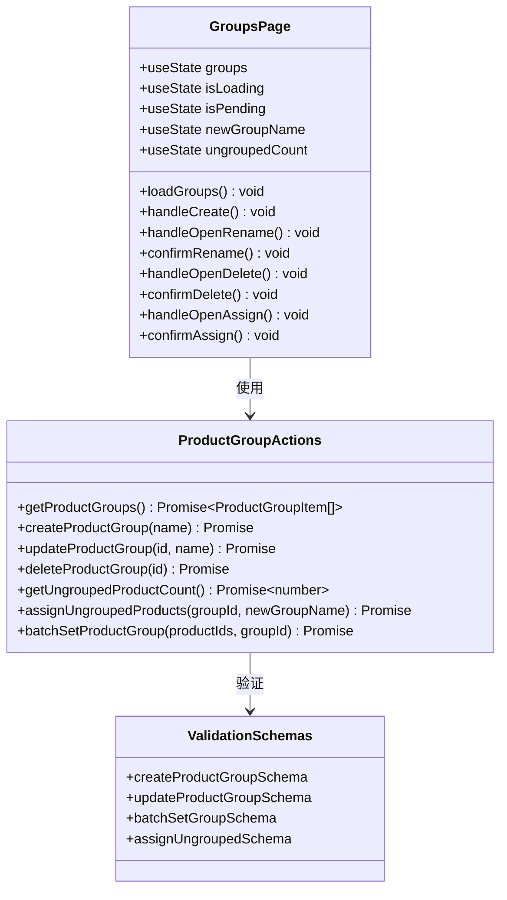
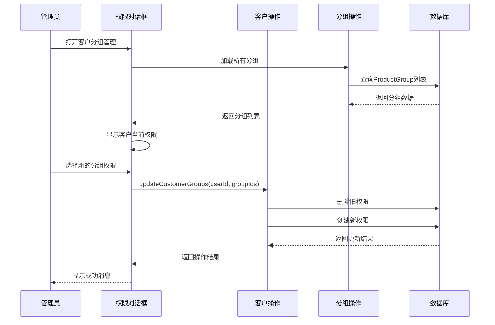
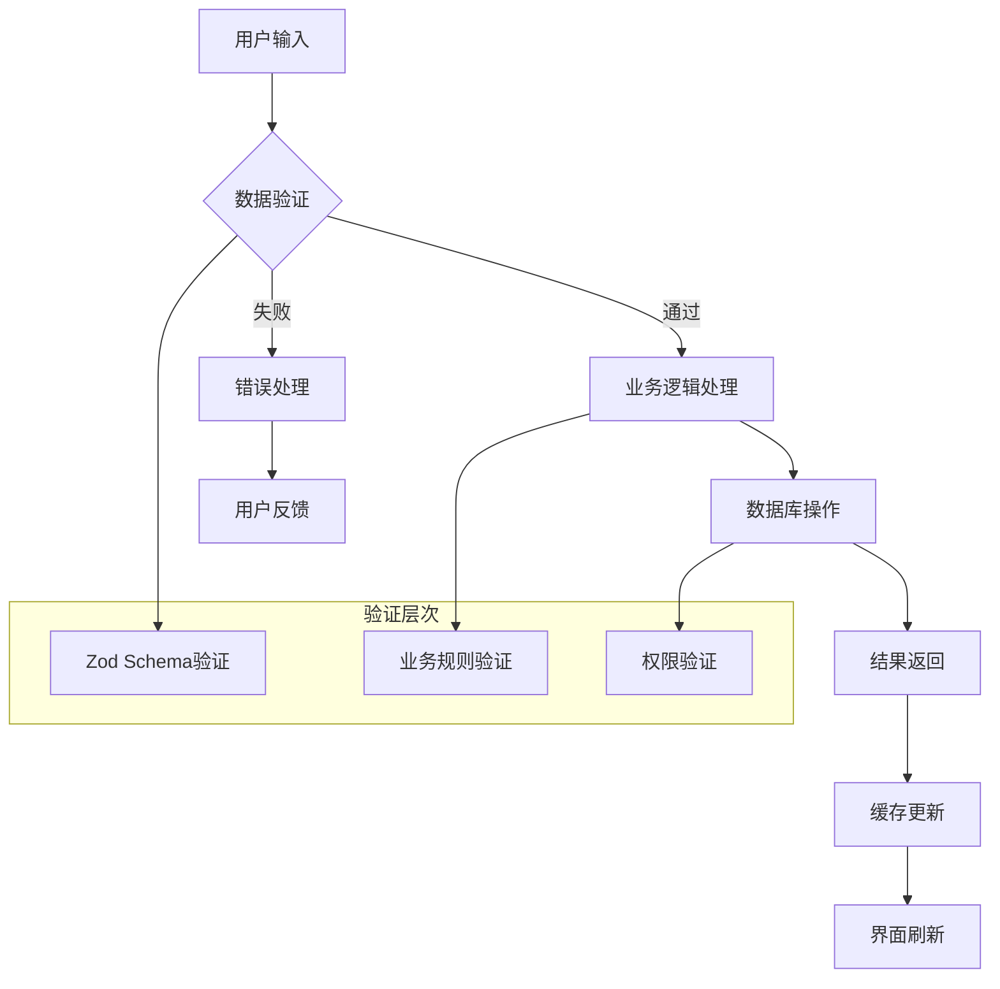
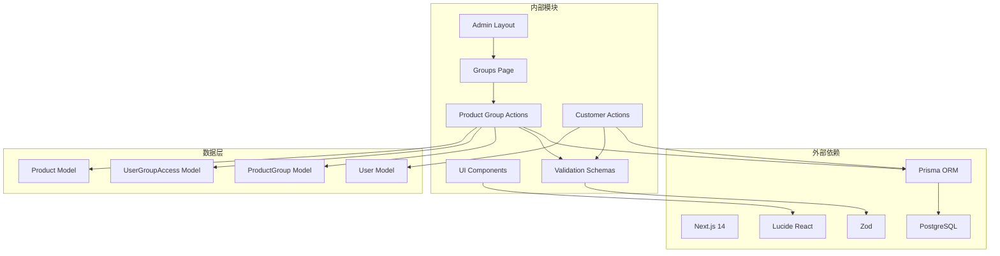

# 产品分组管理

<cite>
**本文档引用的文件**
- [prisma/schema.prisma](file://prisma/schema.prisma)
- [src/lib/db.ts](file://src/lib/db.ts)
- [src/app/admin/groups/page.tsx](file://src/app/admin/groups/page.tsx)
- [src/lib/actions/product-group.ts](file://src/lib/actions/product-group.ts)
- [src/lib/validations/product-group.ts](file://src/lib/validations/product-group.ts)
- [src/components/admin/admin-layout.tsx](file://src/components/admin/admin-layout.tsx)
- [src/components/admin/manage-groups-dialog.tsx](file://src/components/admin/manage-groups-dialog.tsx)
- [src/lib/actions/customer.ts](file://src/lib/actions/customer.ts)
- [src/components/ui/dialog.tsx](file://src/components/ui/dialog.tsx)
- [src/components/ui/table.tsx](file://src/components/ui/table.tsx)
</cite>

## 目录
1. [简介](#简介)
2. [项目结构](#项目结构)
3. [核心组件](#核心组件)
4. [架构概览](#架构概览)
5. [详细组件分析](#详细组件分析)
6. [依赖关系分析](#依赖关系分析)
7. [性能考虑](#性能考虑)
8. [故障排除指南](#故障排除指南)
9. [结论](#结论)

## 简介

产品分组管理系统是 Celestia 商城平台的核心功能模块之一，用于管理和控制商品的分类展示和客户可见性。该系统通过数据库层面的分组机制，实现了灵活的商品组织方式，支持管理员对商品进行逻辑分组，并根据客户权限控制商品的可见范围。

系统采用 Next.js 14 的 App Router 架构，结合 Prisma ORM 实现数据持久化，提供完整的 CRUD 操作和批量管理功能。通过分组管理，管理员可以实现精细化的商品展示策略，提升用户体验和销售转化率。

## 项目结构

产品分组管理功能在项目中的组织结构如下：

**图表来源**
- [src/app/admin/groups/page.tsx:1-553](file://src/app/admin/groups/page.tsx#L1-553)
- [src/lib/actions/product-group.ts:1-287](file://src/lib/actions/product-group.ts#L1-287)
- [src/lib/actions/customer.ts:1-376](file://src/lib/actions/customer.ts#L1-376)

**章节来源**
- [src/app/admin/groups/page.tsx:1-553](file://src/app/admin/groups/page.tsx#L1-553)
- [src/components/admin/admin-layout.tsx:1-202](file://src/components/admin/admin-layout.tsx#L1-202)

## 核心组件

### 数据模型设计

系统采用三层数据模型来实现产品分组管理：

**图表来源**
- [prisma/schema.prisma:321-346](file://prisma/schema.prisma#L321-L346)

### 核心数据结构

系统定义了以下核心数据结构：

**ProductGroupItem 接口**
- `id`: 分组唯一标识符
- `name`: 分组名称
- `productCount`: 分组内商品数量
- `createdAt`: 创建时间

**CustomerListItem 接口**
- `id`: 客户唯一标识符
- `phone`: 客户电话号码
- `name`: 客户姓名
- `company`: 所属公司
- `role`: 用户角色
- `status`: 用户状态
- `markupRatio`: 加价比例
- `preferredLang`: 偏好语言
- `createdAt`: 注册时间
- `orderCount`: 订单数量
- `groups`: 分组权限列表

**章节来源**
- [src/lib/actions/product-group.ts:6-11](file://src/lib/actions/product-group.ts#L6-L11)
- [src/lib/actions/customer.ts:33-45](file://src/lib/actions/customer.ts#L33-L45)

## 架构概览

产品分组管理采用分层架构设计，确保职责分离和代码可维护性：

**图表来源**
- [src/app/admin/groups/page.tsx:1-553](file://src/app/admin/groups/page.tsx#L1-553)
- [src/lib/actions/product-group.ts:1-287](file://src/lib/actions/product-group.ts#L1-287)
- [src/lib/actions/customer.ts:1-376](file://src/lib/actions/customer.ts#L1-376)

### 控制流程

系统的核心控制流程包括分组管理、权限控制和数据同步：

**图表来源**
- [src/lib/actions/product-group.ts:47-221](file://src/lib/actions/product-group.ts#L47-L221)

**章节来源**
- [src/lib/actions/product-group.ts:13-246](file://src/lib/actions/product-group.ts#L13-L246)

## 详细组件分析

### 分组管理页面

分组管理页面是用户交互的核心界面，提供了完整的分组生命周期管理功能：

**图表来源**
- [src/app/admin/groups/page.tsx:48-553](file://src/app/admin/groups/page.tsx#L48-L553)
- [src/lib/actions/product-group.ts:13-287](file://src/lib/actions/product-group.ts#L13-L287)
- [src/lib/validations/product-group.ts:1-21](file://src/lib/validations/product-group.ts#L1-L21)

#### 核心功能特性

**1. 实时数据加载**
- 使用 React Suspense 实现异步数据加载
- 支持数据刷新和缓存优化
- 提供加载状态反馈

**2. 分组操作管理**
- 创建新分组：支持名称验证和重复检查
- 重命名分组：实时验证名称有效性
- 删除分组：提供安全确认机制
- 批量分配：支持无分组商品的一键分配

**3. 用户界面设计**
- 响应式布局适配不同设备
- 直观的操作按钮和状态指示
- 友好的错误处理和用户反馈

**章节来源**
- [src/app/admin/groups/page.tsx:77-104](file://src/app/admin/groups/page.tsx#L77-L104)
- [src/app/admin/groups/page.tsx:115-143](file://src/app/admin/groups/page.tsx#L115-L143)

### 客户分组权限管理

客户分组权限管理功能允许管理员精确控制每个客户的商品可见范围：

**图表来源**
- [src/components/admin/manage-groups-dialog.tsx:27-164](file://src/components/admin/manage-groups-dialog.tsx#L27-L164)
- [src/lib/actions/customer.ts:222-263](file://src/lib/actions/customer.ts#L222-L263)

#### 权限控制机制

**1. 事务性操作保证**
- 使用数据库事务确保权限更新的一致性
- 自动清理旧权限并创建新权限
- 支持批量权限操作

**2. 安全验证**
- 严格的管理员身份验证
- 客户权限的最小化原则
- 操作日志和审计跟踪

**章节来源**
- [src/components/admin/manage-groups-dialog.tsx:38-85](file://src/components/admin/manage-groups-dialog.tsx#L38-L85)
- [src/lib/actions/customer.ts:222-263](file://src/lib/actions/customer.ts#L222-L263)

### 数据验证和安全

系统实现了多层次的数据验证和安全控制机制：

**图表来源**
- [src/lib/validations/product-group.ts:1-21](file://src/lib/validations/product-group.ts#L1-L21)
- [src/lib/actions/product-group.ts:50-88](file://src/lib/actions/product-group.ts#L50-L88)

#### 验证规则

**1. 分组名称验证**
- 长度限制：1-50字符
- 必填验证：不能为空
- 唯一性验证：防止重复名称

**2. 权限验证**
- 管理员身份验证
- 操作权限检查
- 数据访问控制

**章节来源**
- [src/lib/validations/product-group.ts:3-20](file://src/lib/validations/product-group.ts#L3-L20)
- [src/lib/actions/product-group.ts:15-18](file://src/lib/actions/product-group.ts#L15-L18)

## 依赖关系分析

产品分组管理系统的依赖关系体现了清晰的分层架构：

**图表来源**
- [src/app/admin/groups/page.tsx:1-553](file://src/app/admin/groups/page.tsx#L1-553)
- [src/lib/actions/product-group.ts:1-287](file://src/lib/actions/product-group.ts#L1-287)
- [prisma/schema.prisma:321-346](file://prisma/schema.prisma#L321-L346)

### 模块耦合度分析

**低耦合设计**
- UI组件与业务逻辑分离
- 数据验证独立于业务逻辑
- 数据模型与应用逻辑解耦

**依赖方向**
- 表现层依赖业务逻辑层
- 业务逻辑层依赖数据访问层
- 数据访问层依赖数据库驱动

**章节来源**
- [src/lib/db.ts:1-18](file://src/lib/db.ts#L1-L18)
- [prisma/schema.prisma:1-347](file://prisma/schema.prisma#L1-L347)

## 性能考虑

### 数据库优化

**索引策略**
- ProductGroup.name: 唯一索引，支持快速查找
- ProductGroup.id: 主键索引，支持高效关联
- UserGroupAccess: 复合唯一索引，防止重复权限

**查询优化**
- 使用select投影减少数据传输
- 实现分页查询避免大数据集加载
- 缓存常用查询结果

### 前端性能

**渲染优化**
- 使用React Suspense实现渐进式加载
- 实现虚拟滚动处理大量数据
- 优化重渲染频率

**网络优化**
- 实现请求去重和缓存
- 支持离线操作和数据同步
- 优化图片和资源加载

## 故障排除指南

### 常见问题及解决方案

**1. 分组创建失败**
- 检查分组名称是否为空或过长
- 验证分组名称是否已存在
- 确认管理员权限

**2. 权限更新异常**
- 检查数据库连接状态
- 验证事务完整性
- 查看权限冲突情况

**3. 数据同步问题**
- 检查缓存失效机制
- 验证数据一致性
- 监控数据库锁等待

**章节来源**
- [src/lib/actions/product-group.ts:82-88](file://src/lib/actions/product-group.ts#L82-L88)
- [src/lib/actions/customer.ts:256-262](file://src/lib/actions/customer.ts#L256-L262)

### 调试工具

**开发工具**
- Prisma Studio: 数据库可视化工具
- Chrome DevTools: 前端调试和性能分析
- PostgreSQL日志: 数据库查询监控

**监控指标**
- API响应时间
- 数据库查询性能
- 内存使用情况
- 错误率统计

## 结论

产品分组管理系统通过精心设计的架构和完善的业务逻辑，为 Celestia 平台提供了强大的商品组织和权限控制能力。系统的主要优势包括：

**技术优势**
- 清晰的分层架构，职责分离明确
- 完善的数据验证和安全控制
- 高效的数据库设计和查询优化
- 用户友好的界面设计和交互体验

**业务价值**
- 支持灵活的商品分类和展示策略
- 实现精细化的客户权限管理
- 提供高效的批量操作功能
- 确保数据一致性和系统稳定性

该系统为电商平台的商品管理提供了坚实的技术基础，能够满足不同规模企业的业务需求，并具备良好的扩展性和维护性。