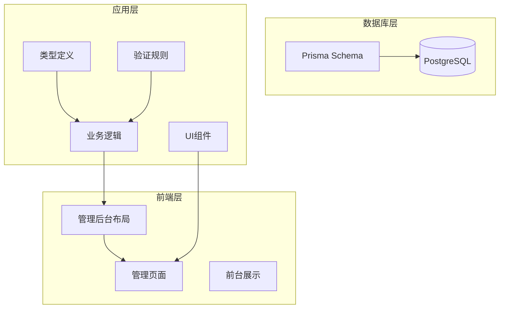
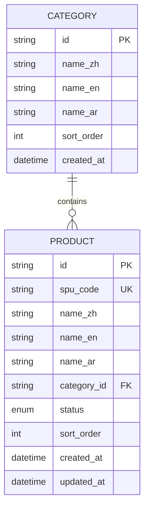
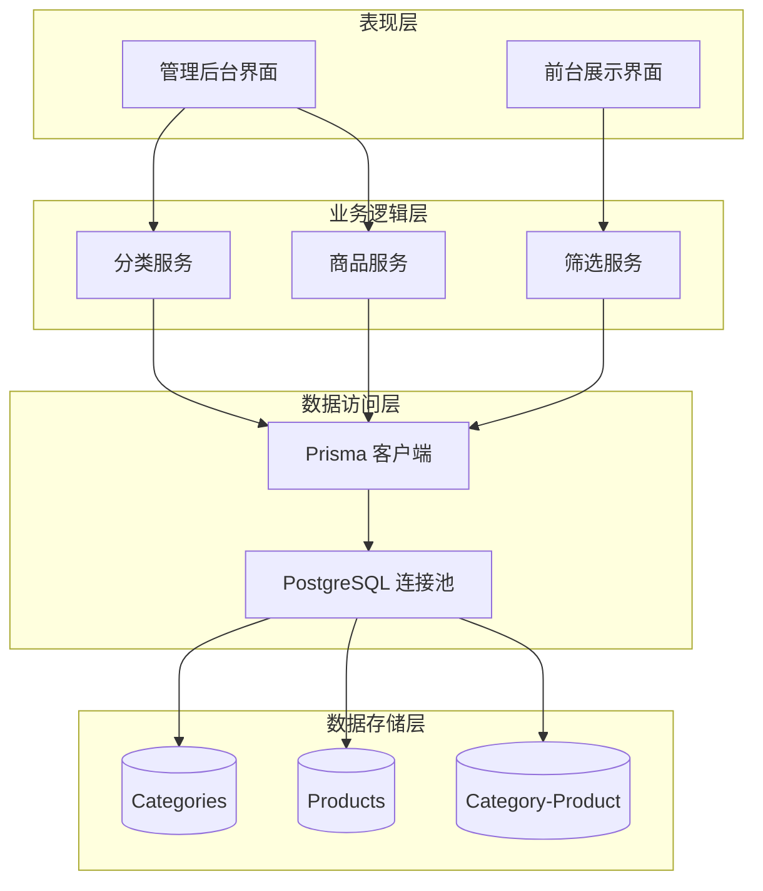
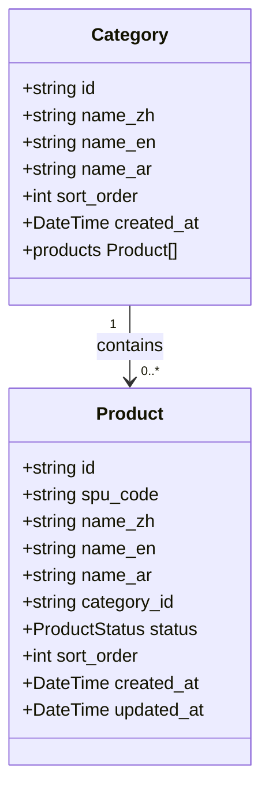
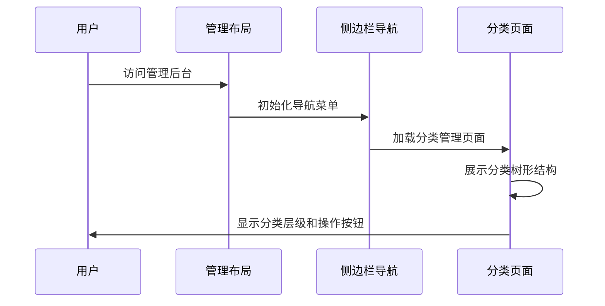
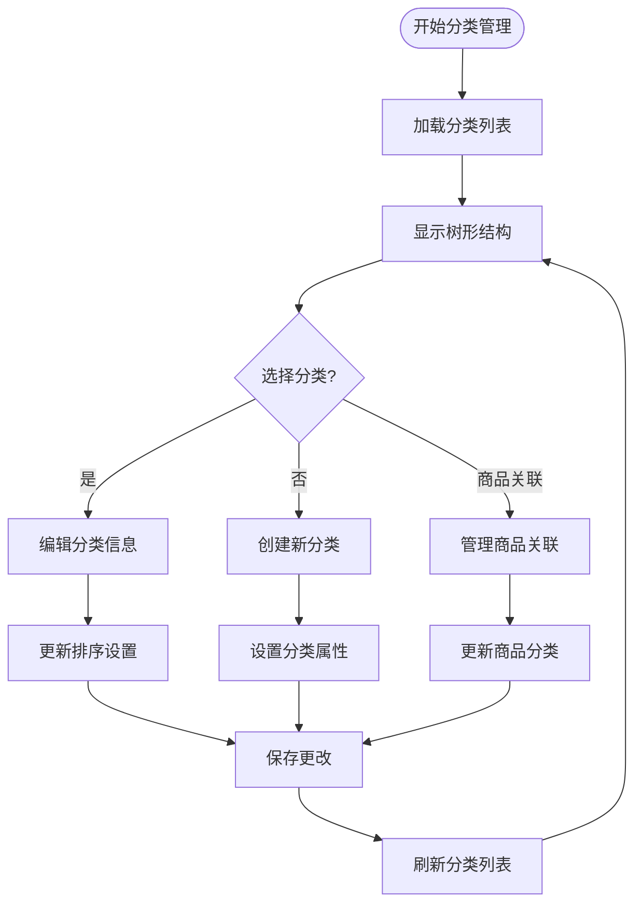
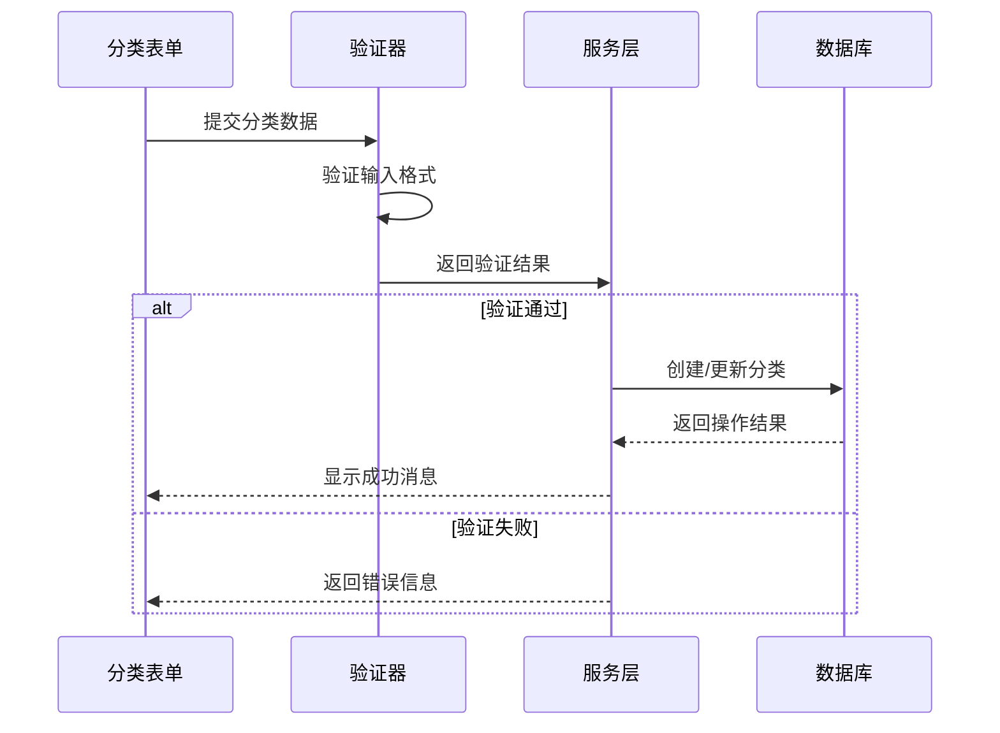
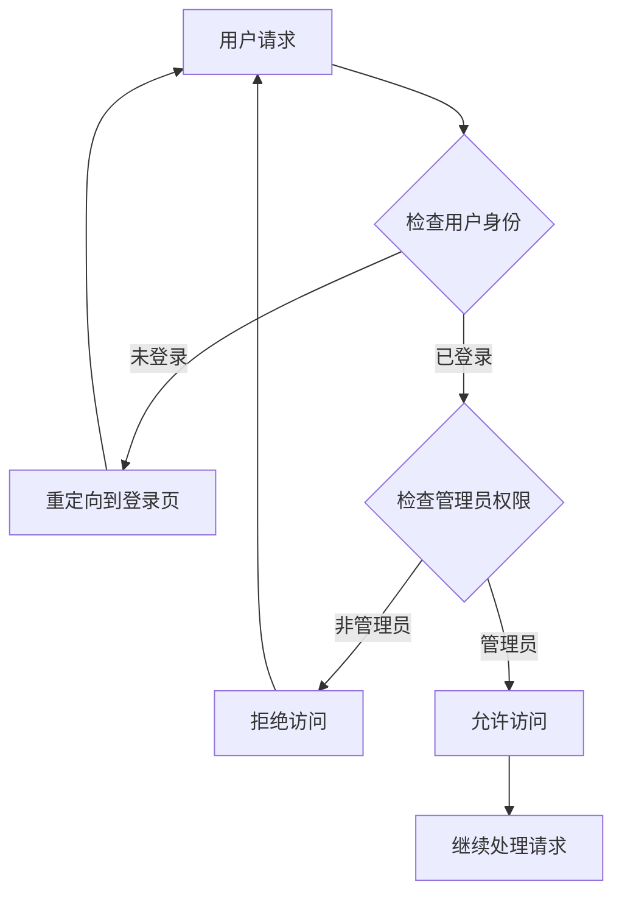
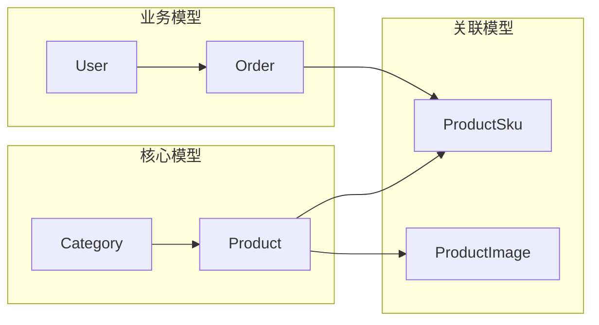

# 商品分类管理

<cite>
**本文档引用的文件**
- [prisma/schema.prisma](file://prisma/schema.prisma)
- [src/lib/db.ts](file://src/lib/db.ts)
- [src/types/index.ts](file://src/types/index.ts)
- [src/lib/validations/product.ts](file://src/lib/validations/product.ts)
- [src/components/admin/admin-layout.tsx](file://src/components/admin/admin-layout.tsx)
- [src/app/admin/layout.tsx](file://src/app/admin/layout.tsx)
- [src/app/admin/page.tsx](file://src/app/admin/page.tsx)
- [src/app/admin/login/page.tsx](file://src/app/admin/login/page.tsx)
- [src/lib/actions/customer.ts](file://src/lib/actions/customer.ts)
</cite>

## 目录
1. [简介](#简介)
2. [项目结构](#项目结构)
3. [核心组件](#核心组件)
4. [架构概览](#架构概览)
5. [详细组件分析](#详细组件分析)
6. [依赖分析](#依赖分析)
7. [性能考虑](#性能考虑)
8. [故障排除指南](#故障排除指南)
9. [结论](#结论)

## 简介

商品分类管理是 Celestia 项目中的核心功能模块，负责珠宝首饰类商品的分类体系管理。该系统基于 Prisma ORM 和 Next.js 构建，提供了完整的分类层级结构设计、分类树形展示、分类关联关系和分类筛选功能。

系统采用多语言支持（中英文阿拉伯文）的分类命名体系，支持商品与分类的双向关联关系，并集成了权限控制和数据同步机制。分类管理功能包括分类创建和编辑流程、分类排序和层级调整、分类属性配置和分类 SEO 设置等完整功能。

## 项目结构

基于当前代码库分析，商品分类管理功能主要分布在以下结构中：

**图表来源**
- [prisma/schema.prisma:108-120](file://prisma/schema.prisma#L108-L120)
- [src/lib/db.ts:1-18](file://src/lib/db.ts#L1-L18)
- [src/types/index.ts:1-59](file://src/types/index.ts#L1-L59)

**章节来源**
- [prisma/schema.prisma:108-120](file://prisma/schema.prisma#L108-L120)
- [src/lib/db.ts:1-18](file://src/lib/db.ts#L1-L18)
- [src/types/index.ts:1-59](file://src/types/index.ts#L1-L59)

## 核心组件

### 数据模型设计

系统的核心数据模型围绕分类(Category)和商品(Product)展开，建立了清晰的一对多关联关系：

**图表来源**
- [prisma/schema.prisma:108-120](file://prisma/schema.prisma#L108-L120)
- [prisma/schema.prisma:122-149](file://prisma/schema.prisma#L122-L149)

### 类型系统

系统使用 TypeScript 接口定义了完整的类型系统，包括分页参数、筛选条件和 API 响应格式：

- **分页参数**: 支持游标分页和传统分页两种方式
- **筛选参数**: 针对商品分类的筛选条件
- **API 响应**: 统一的响应格式，包含成功状态、数据和错误信息

**章节来源**
- [src/types/index.ts:1-59](file://src/types/index.ts#L1-L59)
- [src/lib/validations/product.ts:1-14](file://src/lib/validations/product.ts#L1-L14)

## 架构概览

商品分类管理系统的整体架构采用分层设计，确保了良好的可维护性和扩展性：

**图表来源**
- [src/lib/db.ts:1-18](file://src/lib/db.ts#L1-L18)
- [prisma/schema.prisma:108-149](file://prisma/schema.prisma#L108-L149)

## 详细组件分析

### 分类层级结构设计

#### 多语言支持的分类命名

系统实现了完整的多语言分类命名支持，每个分类都包含三种语言的名称：

**图表来源**
- [prisma/schema.prisma:108-120](file://prisma/schema.prisma#L108-L120)
- [prisma/schema.prisma:122-149](file://prisma/schema.prisma#L122-L149)

#### 分类排序机制

系统支持灵活的分类排序功能，通过 `sort_order` 字段实现：

**章节来源**
- [prisma/schema.prisma:114](file://prisma/schema.prisma#L114)
- [prisma/schema.prisma:138](file://prisma/schema.prisma#L138)

### 分类树形展示

#### 管理后台布局集成

管理后台提供了完整的分类管理界面，集成了侧边栏导航和页面标题系统：

**图表来源**
- [src/components/admin/admin-layout.tsx:24-38](file://src/components/admin/admin-layout.tsx#L24-L38)
- [src/app/admin/layout.tsx:1-9](file://src/app/admin/layout.tsx#L1-L9)

**章节来源**
- [src/components/admin/admin-layout.tsx:1-206](file://src/components/admin/admin-layout.tsx#L1-L206)
- [src/app/admin/layout.tsx:1-9](file://src/app/admin/layout.tsx#L1-L9)

### 分类关联关系

#### 商品与分类的关联管理

系统实现了商品与分类之间的多对一关联关系，支持商品的分类归属管理：

**图表来源**
- [prisma/schema.prisma:142](file://prisma/schema.prisma#L142)
- [prisma/schema.prisma:117](file://prisma/schema.prisma#L117)

**章节来源**
- [prisma/schema.prisma:122-149](file://prisma/schema.prisma#L122-L149)

### 分类筛选功能

#### 商品筛选参数设计

系统提供了完善的商品筛选功能，支持按分类、宝石类型、金属颜色等多种条件进行筛选：

**章节来源**
- [src/types/index.ts:24-32](file://src/types/index.ts#L24-L32)
- [src/lib/validations/product.ts:1-14](file://src/lib/validations/product.ts#L1-L14)

### 分类创建和编辑流程

#### 表单验证和数据处理

系统采用 Zod 进行表单验证，确保数据的完整性和一致性：

**图表来源**
- [src/lib/validations/product.ts:3-11](file://src/lib/validations/product.ts#L3-L11)
- [src/lib/actions/customer.ts:32-40](file://src/lib/actions/customer.ts#L32-L40)

**章节来源**
- [src/lib/validations/product.ts:1-14](file://src/lib/validations/product.ts#L1-L14)
- [src/lib/actions/customer.ts:1-203](file://src/lib/actions/customer.ts#L1-L203)

### 分类属性配置

#### 多语言属性管理

系统支持分类的多语言属性配置，包括名称、描述等文本内容：

**章节来源**
- [prisma/schema.prisma:111-113](file://prisma/schema.prisma#L111-L113)

### 权限控制机制

#### 管理员权限验证

系统实现了严格的权限控制机制，确保只有管理员才能访问和修改分类信息：

**图表来源**
- [src/lib/actions/customer.ts:32-40](file://src/lib/actions/customer.ts#L32-L40)
- [src/app/admin/login/page.tsx:33-53](file://src/app/admin/login/page.tsx#L33-L53)

**章节来源**
- [src/lib/actions/customer.ts:1-203](file://src/lib/actions/customer.ts#L1-L203)
- [src/app/admin/login/page.tsx:1-53](file://src/app/admin/login/page.tsx#L1-L53)

## 依赖分析

### 数据库依赖关系

系统的核心依赖关系主要体现在 Prisma 的数据模型设计上：

**图表来源**
- [prisma/schema.prisma:108-186](file://prisma/schema.prisma#L108-L186)

### 外部依赖

系统依赖的关键外部库包括：

- **Prisma**: ORM 框架，提供类型安全的数据库访问
- **Next.js**: Web 框架，提供服务端渲染和静态生成
- **Zod**: 类型验证库，确保数据完整性
- **Lucide React**: 图标库，提供界面图标

**章节来源**
- [prisma/schema.prisma:4-6](file://prisma/schema.prisma#L4-L6)
- [src/lib/db.ts:1-18](file://src/lib/db.ts#L1-L18)

## 性能考虑

### 查询优化策略

系统在数据库层面采用了多种优化策略：

1. **索引优化**: 在 `category_id` 和 `status` 字段上建立索引，提高查询性能
2. **连接池管理**: 使用 PostgreSQL 连接池，减少连接开销
3. **分页查询**: 实现游标分页，避免大数据集的全量查询

### 缓存机制

系统集成了 Next.js 的缓存机制，通过 `revalidatePath` 实现数据的实时更新：

**章节来源**
- [prisma/schema.prisma:146](file://prisma/schema.prisma#L146)
- [prisma/schema.prisma:147](file://prisma/schema.prisma#L147)
- [src/lib/actions/customer.ts:169](file://src/lib/actions/customer.ts#L169)

## 故障排除指南

### 常见问题及解决方案

#### 数据库连接问题

当遇到数据库连接异常时，首先检查环境变量配置和连接字符串格式。

#### 权限验证失败

如果管理员登录失败，检查用户角色和状态字段是否正确设置。

#### 分页查询异常

当分页查询返回空结果时，验证分页参数的有效性和索引配置。

**章节来源**
- [src/lib/db.ts:9](file://src/lib/db.ts#L9)
- [src/lib/actions/customer.ts:32-40](file://src/lib/actions/customer.ts#L32-L40)

## 结论

商品分类管理功能展现了现代电商系统的核心架构特点：清晰的数据模型设计、完善的权限控制机制、灵活的筛选功能和良好的扩展性。系统通过多语言支持、分类关联管理和权限控制，为珠宝首饰类商品提供了完整的分类管理体系。

未来可以考虑的功能扩展包括：分类层级的动态调整、SEO 优化功能、分类统计分析报表等，这些都将基于现有的架构基础进行开发和集成。