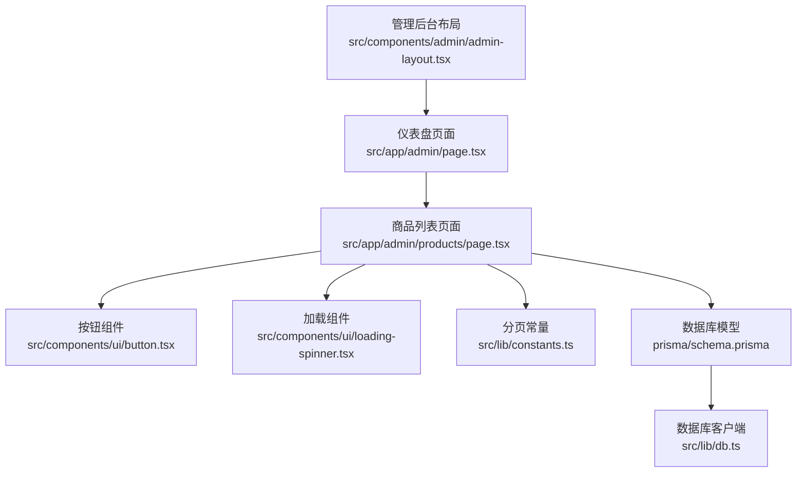
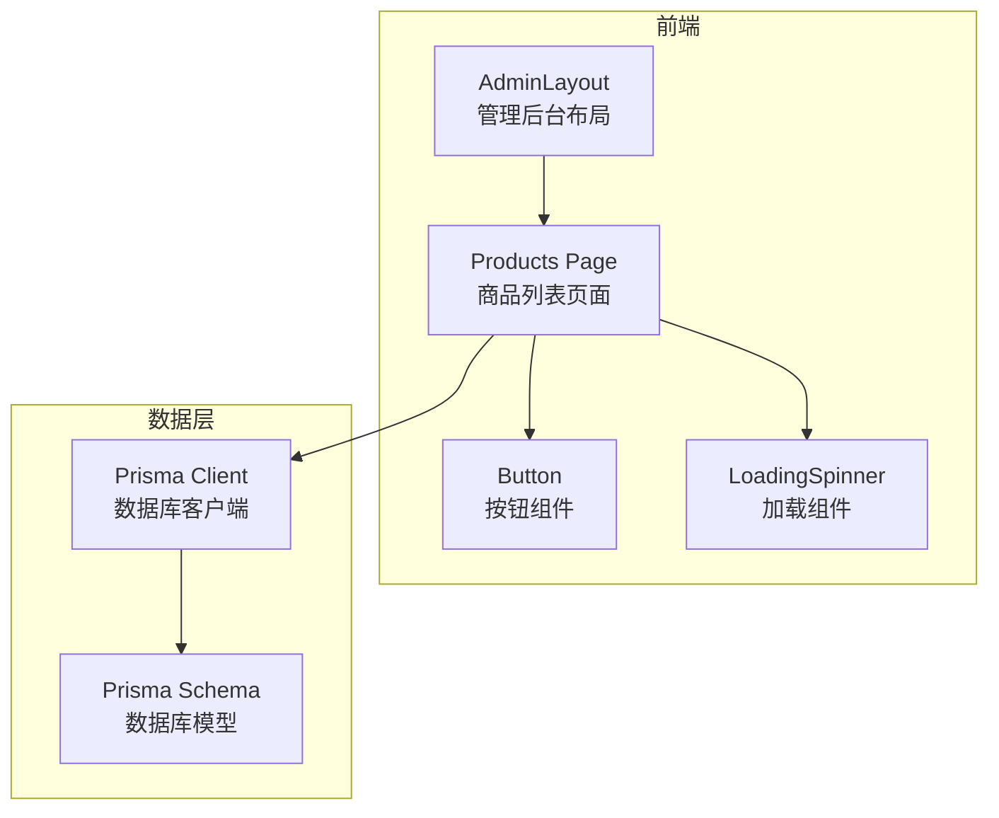
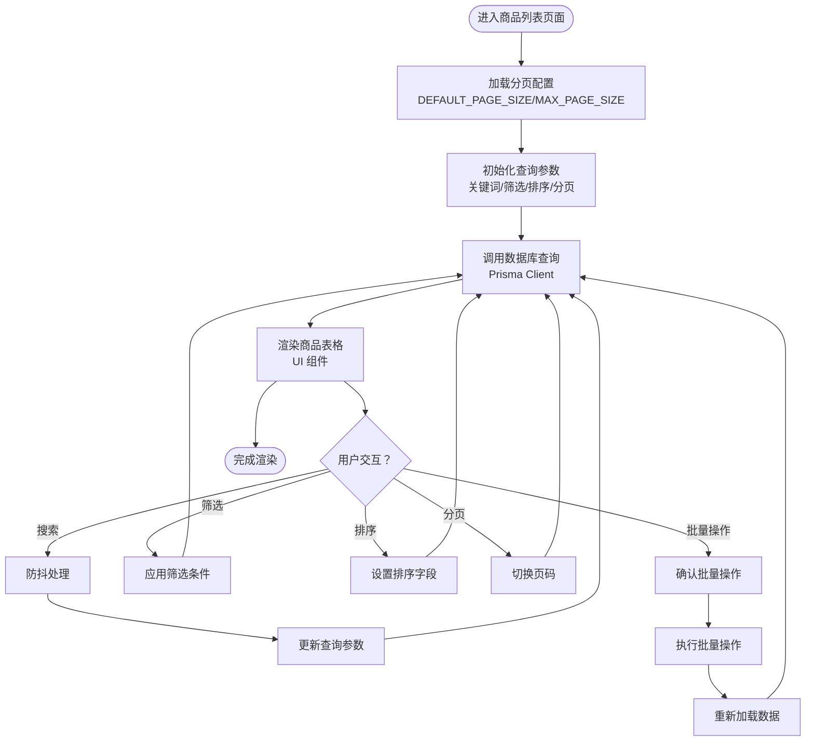
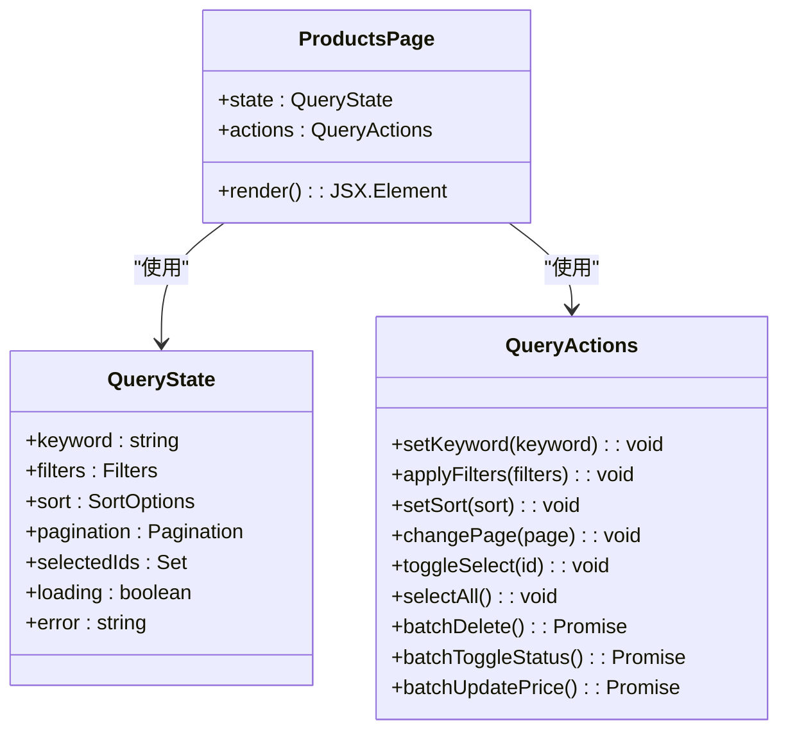
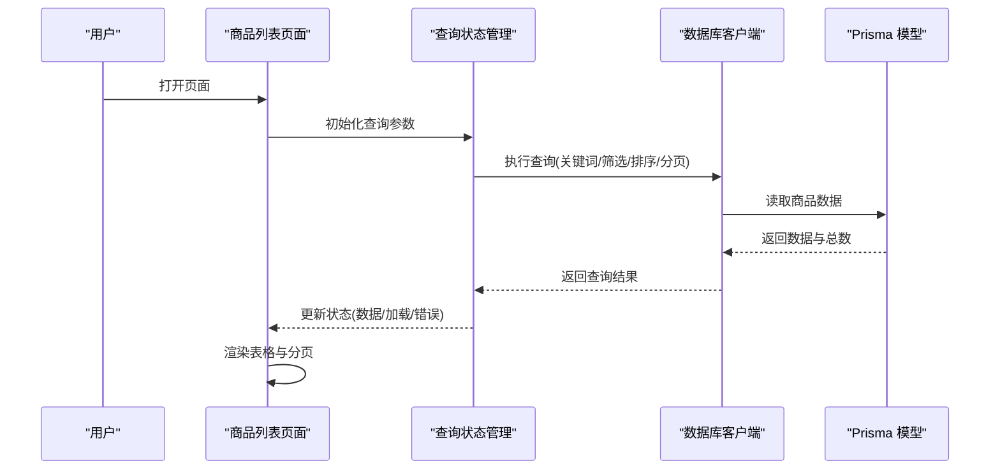
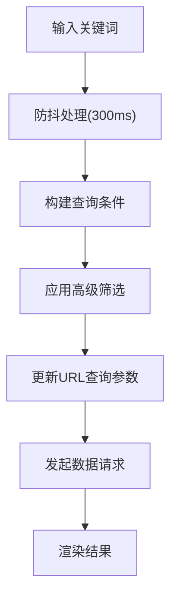
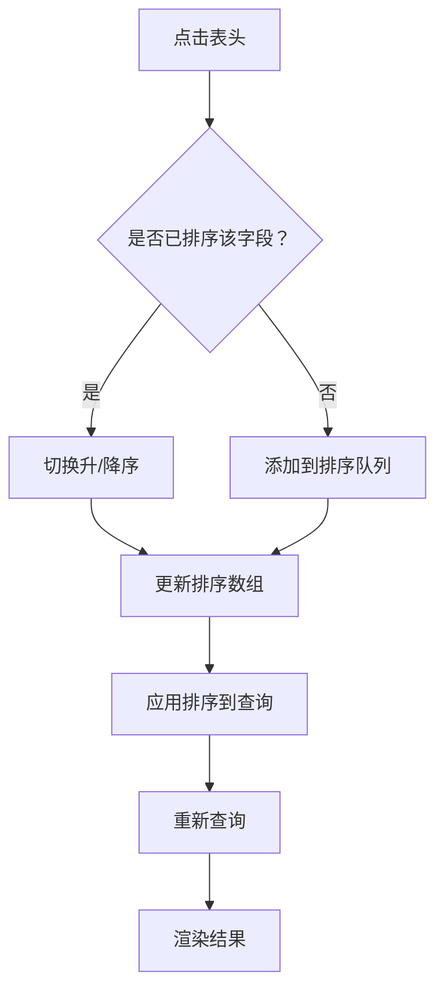
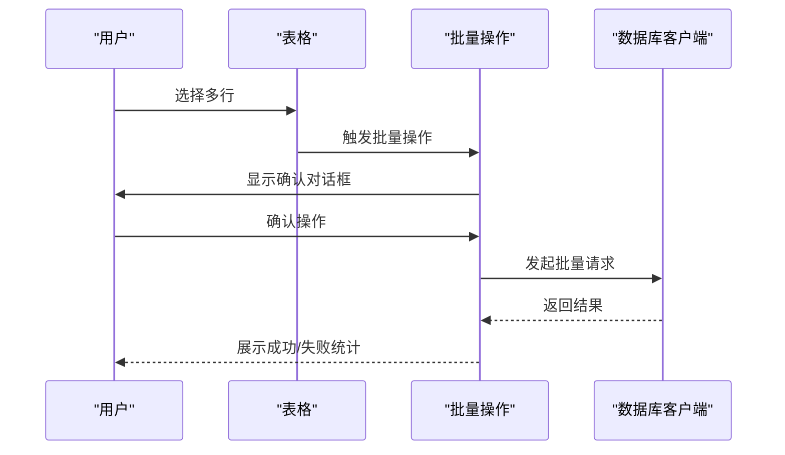
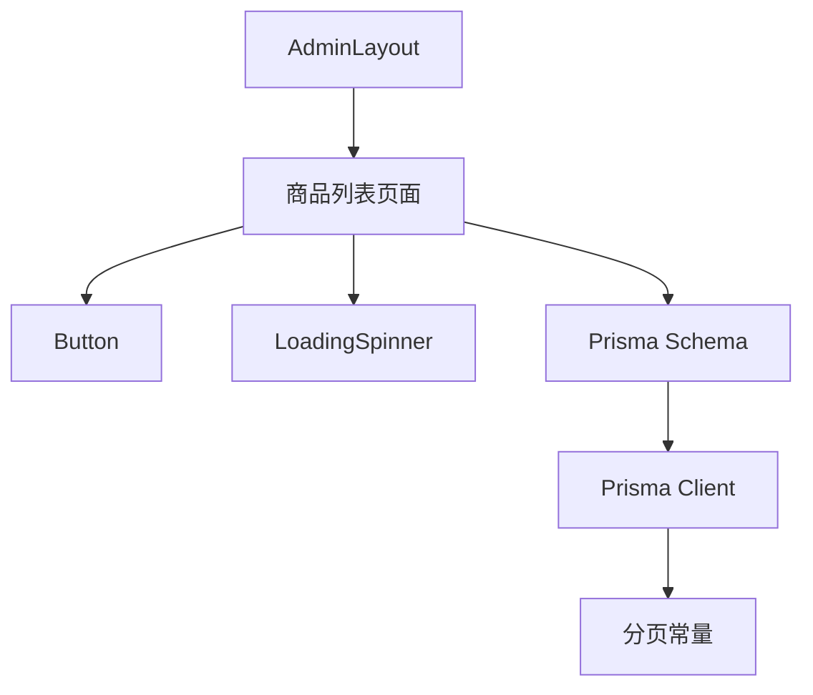

# 商品列表管理

<cite>
**本文引用的文件**
- [src/app/admin/page.tsx](file://src/app/admin/page.tsx)
- [src/components/admin/admin-layout.tsx](file://src/components/admin/admin-layout.tsx)
- [src/lib/constants.ts](file://src/lib/constants.ts)
- [src/lib/db.ts](file://src/lib/db.ts)
- [prisma/schema.prisma](file://prisma/schema.prisma)
- [src/components/ui/button.tsx](file://src/components/ui/button.tsx)
- [src/components/ui/loading-spinner.tsx](file://src/components/ui/loading-spinner.tsx)
</cite>

## 目录
1. [简介](#简介)
2. [项目结构](#项目结构)
3. [核心组件](#核心组件)
4. [架构概览](#架构概览)
5. [详细组件分析](#详细组件分析)
6. [依赖分析](#依赖分析)
7. [性能考虑](#性能考虑)
8. [故障排除指南](#故障排除指南)
9. [结论](#结论)
10. [附录](#附录)

## 简介
本文件聚焦于商品列表管理功能的设计与实现，涵盖分页机制、搜索与筛选、排序、批量操作以及数据获取与渲染流程。当前仓库中已包含管理后台布局与基础常量配置，但商品列表页面的具体实现尚未在现有文件中出现。本文将基于现有基础设施（数据库模型、分页常量、UI 组件）给出完整的实现蓝图与最佳实践，帮助开发者快速落地商品列表管理功能。

## 项目结构
管理后台采用 Next.js App Router 的目录组织方式，商品列表页面应位于管理后台路由下。现有结构中已提供管理后台布局与仪表盘入口，商品列表页面可作为“商品管理”子页面进行扩展。

图表来源
- [src/components/admin/admin-layout.tsx:40-206](file://src/components/admin/admin-layout.tsx#L40-L206)
- [src/app/admin/page.tsx:10-56](file://src/app/admin/page.tsx#L10-L56)
- [src/lib/constants.ts:31-35](file://src/lib/constants.ts#L31-L35)
- [prisma/schema.prisma:123-149](file://prisma/schema.prisma#L123-L149)
- [src/lib/db.ts:1-18](file://src/lib/db.ts#L1-L18)

章节来源
- [src/components/admin/admin-layout.tsx:40-206](file://src/components/admin/admin-layout.tsx#L40-L206)
- [src/app/admin/page.tsx:10-56](file://src/app/admin/page.tsx#L10-L56)
- [src/lib/constants.ts:31-35](file://src/lib/constants.ts#L31-L35)
- [prisma/schema.prisma:123-149](file://prisma/schema.prisma#L123-L149)
- [src/lib/db.ts:1-18](file://src/lib/db.ts#L1-L18)

## 核心组件
- 管理后台布局：提供侧边栏导航、移动端响应式交互与页面标题管理。
- 仪表盘页面：展示统计卡片与占位内容，作为商品列表页面的入口引导。
- 分页常量：定义默认页大小与最大页大小，为分页逻辑提供统一约束。
- 数据库模型：商品（Product）、SKU（ProductSku）、图片（ProductImage）等模型，支撑商品列表的数据结构与查询。
- UI 组件：按钮与加载指示器，用于用户交互与异步加载状态反馈。

章节来源
- [src/components/admin/admin-layout.tsx:24-38](file://src/components/admin/admin-layout.tsx#L24-L38)
- [src/app/admin/page.tsx:3-8](file://src/app/admin/page.tsx#L3-L8)
- [src/lib/constants.ts:31-35](file://src/lib/constants.ts#L31-L35)
- [prisma/schema.prisma:123-149](file://prisma/schema.prisma#L123-L149)
- [src/components/ui/button.tsx:45-61](file://src/components/ui/button.tsx#L45-L61)
- [src/components/ui/loading-spinner.tsx:14-35](file://src/components/ui/loading-spinner.tsx#L14-L35)

## 架构概览
商品列表管理的整体架构由“前端页面 + 布局 + UI 组件 + 数据层”构成。页面通过数据库客户端访问 Prisma 模型，结合分页常量与查询参数实现高效的数据检索；UI 组件负责交互与状态反馈；布局组件提供一致的导航体验。

图表来源
- [src/components/admin/admin-layout.tsx:40-206](file://src/components/admin/admin-layout.tsx#L40-L206)
- [src/components/ui/button.tsx:45-61](file://src/components/ui/button.tsx#L45-L61)
- [src/components/ui/loading-spinner.tsx:14-35](file://src/components/ui/loading-spinner.tsx#L14-L35)
- [src/lib/db.ts:12-17](file://src/lib/db.ts#L12-L17)
- [prisma/schema.prisma:123-149](file://prisma/schema.prisma#L123-L149)

## 详细组件分析

### 商品列表页面（概念设计）
商品列表页面应包含以下核心能力：
- 分页机制：支持每页显示数量（默认 20，最大 100）、页码导航与数据加载。
- 搜索与筛选：关键词搜索、高级筛选（品类、状态、价格区间、库存状态等）、搜索历史。
- 排序：按价格、销量、时间等字段排序，支持多字段排序。
- 批量操作：批量删除、批量上下架、批量修改价格。
- 数据获取与渲染：从数据库读取商品数据，渲染表格组件，处理加载与错误状态。
- 状态管理：集中管理查询参数、选中项、加载状态与错误提示。
- 用户体验：防抖搜索、骨架屏、空状态提示、批量操作确认与进度反馈。

图表来源
- [src/lib/constants.ts:31-35](file://src/lib/constants.ts#L31-L35)
- [src/lib/db.ts:12-17](file://src/lib/db.ts#L12-L17)
- [prisma/schema.prisma:123-149](file://prisma/schema.prisma#L123-L149)

章节来源
- [src/lib/constants.ts:31-35](file://src/lib/constants.ts#L31-L35)
- [src/lib/db.ts:12-17](file://src/lib/db.ts#L12-L17)
- [prisma/schema.prisma:123-149](file://prisma/schema.prisma#L123-L149)

### 表格组件与状态管理（概念设计）
- 表格组件：支持列定义、行选择、分页条、排序指示器与加载状态。
- 状态管理：集中维护查询参数（关键词、筛选、排序、分页）、选中项集合、批量操作状态与错误信息。
- 用户体验：骨架屏占位、空状态提示、批量操作确认对话框、操作成功/失败反馈。

图表来源
- [src/components/ui/button.tsx:45-61](file://src/components/ui/button.tsx#L45-L61)
- [src/components/ui/loading-spinner.tsx:14-35](file://src/components/ui/loading-spinner.tsx#L14-L35)

章节来源
- [src/components/ui/button.tsx:45-61](file://src/components/ui/button.tsx#L45-L61)
- [src/components/ui/loading-spinner.tsx:14-35](file://src/components/ui/loading-spinner.tsx#L14-L35)

### 数据获取与渲染流程（概念设计）
- 查询参数构建：根据关键词、筛选条件、排序规则与分页参数生成查询条件。
- 数据库访问：通过 Prisma 客户端执行查询，返回商品列表与总数。
- 渲染策略：加载时显示骨架屏或加载指示器，数据为空时显示空状态提示，错误时显示错误信息与重试按钮。

图表来源
- [src/lib/db.ts:12-17](file://src/lib/db.ts#L12-L17)
- [prisma/schema.prisma:123-149](file://prisma/schema.prisma#L123-L149)

章节来源
- [src/lib/db.ts:12-17](file://src/lib/db.ts#L12-L17)
- [prisma/schema.prisma:123-149](file://prisma/schema.prisma#L123-L149)

### 搜索与筛选（概念设计）
- 关键词搜索：支持输入防抖，避免频繁请求；支持多字段匹配（名称、描述、SPU 编码等）。
- 高级筛选：品类、状态、价格区间、库存状态、创建时间范围等；支持多选与组合筛选。
- 搜索历史：本地存储最近搜索关键词，提供快捷选择与清除历史功能。
- 条件持久化：将筛选条件同步到 URL 查询参数，便于分享与刷新后恢复。

图表来源
- [src/lib/constants.ts:31-35](file://src/lib/constants.ts#L31-L35)

章节来源
- [src/lib/constants.ts:31-35](file://src/lib/constants.ts#L31-L35)

### 排序与多字段排序（概念设计）
- 字段排序：支持价格、销量、时间等字段升序/降序；点击切换排序方向。
- 多字段排序：优先级排序（如先按销量再按价格），通过排序数组表达。
- 排序状态：在表格表头显示排序指示器，保持与 URL 同步。

图表来源
- [prisma/schema.prisma:123-149](file://prisma/schema.prisma#L123-L149)

章节来源
- [prisma/schema.prisma:123-149](file://prisma/schema.prisma#L123-L149)

### 批量操作（概念设计）
- 可选项：批量删除、批量上下架、批量修改价格。
- 确认流程：弹出确认对话框，显示将要影响的商品数量与变更详情。
- 并发控制：限制同时执行的批量操作数量，显示进度与错误汇总。
- 结果反馈：成功/失败计数，支持一键重试失败项。

图表来源
- [src/components/ui/button.tsx:45-61](file://src/components/ui/button.tsx#L45-L61)
- [src/lib/db.ts:12-17](file://src/lib/db.ts#L12-L17)

章节来源
- [src/components/ui/button.tsx:45-61](file://src/components/ui/button.tsx#L45-L61)
- [src/lib/db.ts:12-17](file://src/lib/db.ts#L12-L17)

## 依赖分析
- 布局与导航：管理后台布局组件提供统一的导航与页面标题，商品列表页面应复用该布局以保证一致性。
- UI 组件：按钮与加载组件用于交互与状态反馈，建议在表格操作与加载场景中统一使用。
- 数据层：Prisma 模型定义了商品、SKU、图片等实体关系，查询时需合理使用关联与索引。
- 分页配置：分页常量为前端分页逻辑提供约束，避免过大页码导致性能问题。

图表来源
- [src/components/admin/admin-layout.tsx:40-206](file://src/components/admin/admin-layout.tsx#L40-L206)
- [src/components/ui/button.tsx:45-61](file://src/components/ui/button.tsx#L45-L61)
- [src/components/ui/loading-spinner.tsx:14-35](file://src/components/ui/loading-spinner.tsx#L14-L35)
- [prisma/schema.prisma:123-149](file://prisma/schema.prisma#L123-L149)
- [src/lib/db.ts:12-17](file://src/lib/db.ts#L12-L17)
- [src/lib/constants.ts:31-35](file://src/lib/constants.ts#L31-L35)

章节来源
- [src/components/admin/admin-layout.tsx:40-206](file://src/components/admin/admin-layout.tsx#L40-L206)
- [src/components/ui/button.tsx:45-61](file://src/components/ui/button.tsx#L45-L61)
- [src/components/ui/loading-spinner.tsx:14-35](file://src/components/ui/loading-spinner.tsx#L14-L35)
- [prisma/schema.prisma:123-149](file://prisma/schema.prisma#L123-L149)
- [src/lib/db.ts:12-17](file://src/lib/db.ts#L12-L17)
- [src/lib/constants.ts:31-35](file://src/lib/constants.ts#L31-L35)

## 性能考虑
- 分页与查询优化：使用分页常量限制每页数量，避免一次性加载过多数据；对常用查询字段建立索引（如状态、分类、创建时间）。
- 防抖与节流：搜索输入采用防抖，筛选变更采用节流，减少不必要的请求。
- 懒加载与虚拟滚动：在大数据量场景下，优先考虑虚拟滚动与分页懒加载。
- 缓存策略：对静态筛选项与热门查询结果进行缓存，提升响应速度。
- 并发控制：批量操作限制并发数，避免数据库压力过大。

## 故障排除指南
- 数据库连接异常：检查环境变量与连接池配置，确保 Prisma 客户端初始化正确。
- 查询超时：优化查询条件与索引，必要时拆分复杂查询或增加分页粒度。
- 分页参数非法：校验页码与页大小，防止超出最大值或小于 1。
- UI 交互异常：确认按钮与加载组件的禁用状态逻辑，避免重复提交。
- 状态不一致：确保查询参数与 URL 同步，防止刷新后状态丢失。

章节来源
- [src/lib/db.ts:12-17](file://src/lib/db.ts#L12-L17)
- [src/lib/constants.ts:31-35](file://src/lib/constants.ts#L31-L35)
- [src/components/ui/button.tsx:45-61](file://src/components/ui/button.tsx#L45-L61)
- [src/components/ui/loading-spinner.tsx:14-35](file://src/components/ui/loading-spinner.tsx#L14-L35)

## 结论
商品列表管理功能需要从前端页面、布局、UI 组件与数据层协同实现。基于现有基础设施，建议以管理后台布局为基础，结合分页常量与 Prisma 模型，设计完善的搜索、筛选、排序与批量操作流程，并通过状态管理与用户体验优化提升整体可用性。后续可在商品管理路由下实现具体页面，逐步完善各模块细节。

## 附录
- 最佳实践清单
  - 使用分页常量约束每页数量，避免性能问题。
  - 对高频查询字段建立数据库索引。
  - 在搜索与筛选场景中使用防抖与节流。
  - 批量操作前进行二次确认，提供失败重试与汇总反馈。
  - 将查询参数同步到 URL，增强可分享性与可恢复性。
  - 使用统一的 UI 组件库，保证交互一致性与可维护性。