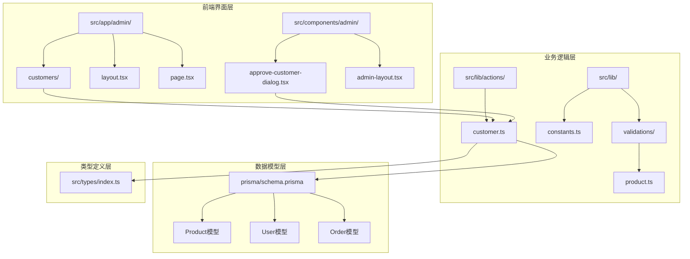
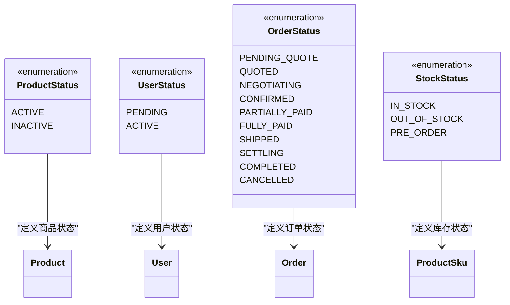
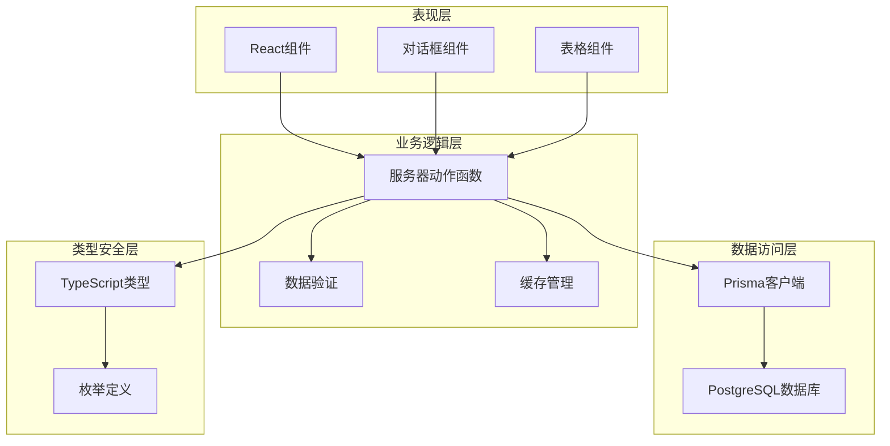
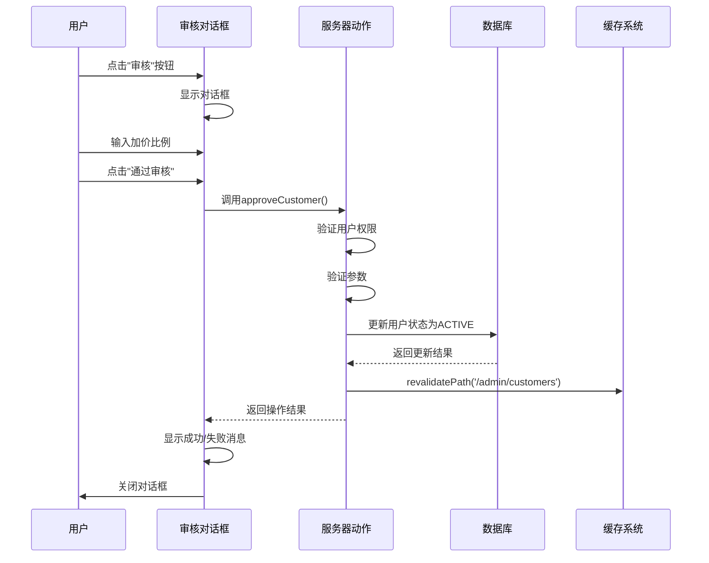
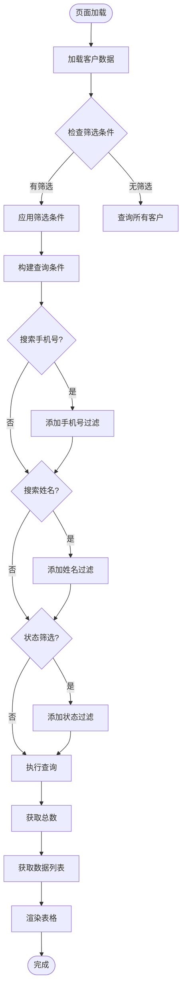
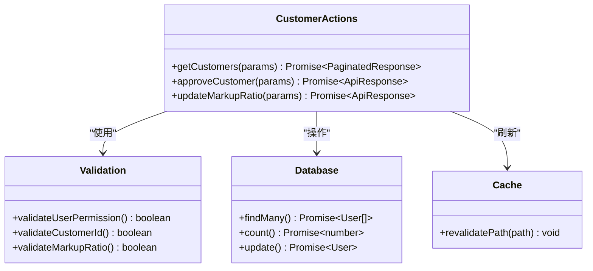
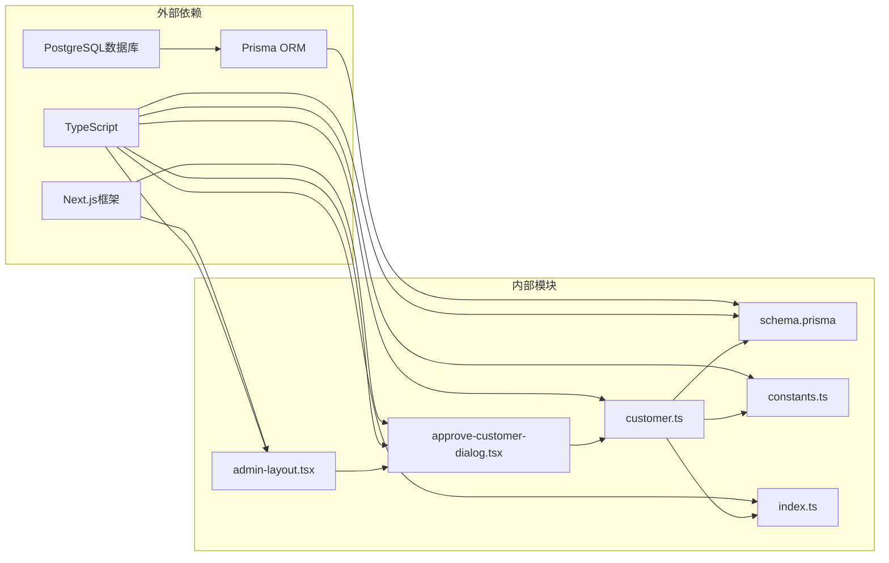

# 商品状态控制

<cite>
**本文档引用的文件**
- [prisma/schema.prisma](file://prisma/schema.prisma)
- [src/lib/actions/customer.ts](file://src/lib/actions/customer.ts)
- [src/app/admin/customers/page.tsx](file://src/app/admin/customers/page.tsx)
- [src/components/admin/approve-customer-dialog.tsx](file://src/components/admin/approve-customer-dialog.tsx)
- [src/lib/constants.ts](file://src/lib/constants.ts)
- [src/types/index.ts](file://src/types/index.ts)
- [src/components/admin/admin-layout.tsx](file://src/components/admin/admin-layout.tsx)
- [src/app/admin/layout.tsx](file://src/app/admin/layout.tsx)
- [src/app/admin/page.tsx](file://src/app/admin/page.tsx)
- [src/lib/validations/product.ts](file://src/lib/validations/product.ts)
</cite>

## 目录
1. [简介](#简介)
2. [项目结构](#项目结构)
3. [核心组件](#核心组件)
4. [架构概览](#架构概览)
5. [详细组件分析](#详细组件分析)
6. [依赖关系分析](#依赖关系分析)
7. [性能考虑](#性能考虑)
8. [故障排除指南](#故障排除指南)
9. [结论](#结论)

## 简介

本文档详细介绍Celestia珠宝电商系统的商品状态控制功能。系统基于Next.js构建，采用Prisma ORM进行数据库操作，实现了完整的商品状态管理机制，包括商品上架/下架操作、状态变更历史记录、状态批量处理和状态条件筛选。

系统的核心功能围绕商品状态枚举展开，支持ACTIVE（上架）和INACTIVE（下架）两种状态，并提供了完整的权限控制和状态变更通知机制。同时，系统还集成了客户审核流程和状态权限控制，确保了业务逻辑的完整性和安全性。

## 项目结构

项目采用标准的Next.js应用结构，重点关注以下与商品状态控制相关的目录和文件：

**图表来源**
- [src/app/admin/customers/page.tsx:1-81](file://src/app/admin/customers/page.tsx#L1-L81)
- [src/lib/actions/customer.ts:1-50](file://src/lib/actions/customer.ts#L1-L50)
- [prisma/schema.prisma:122-149](file://prisma/schema.prisma#L122-L149)

**章节来源**
- [src/app/admin/layout.tsx:1-9](file://src/app/admin/layout.tsx#L1-L9)
- [src/components/admin/admin-layout.tsx:1-48](file://src/components/admin/admin-layout.tsx#L1-L48)

## 核心组件

### 商品状态枚举定义

系统使用Prisma定义了完整的状态枚举体系，其中商品状态控制的核心定义如下：

**图表来源**
- [prisma/schema.prisma:26-35](file://prisma/schema.prisma#L26-L35)

### 客户状态管理

系统实现了完整的客户状态管理功能，包括待审核和已激活两种状态：

| 状态 | 描述 | 用途 |
|------|------|------|
| PENDING | 待审核 | 新注册客户初始状态 |
| ACTIVE | 已激活 | 审核通过后的正常状态 |

**章节来源**
- [prisma/schema.prisma:21-29](file://prisma/schema.prisma#L21-L29)
- [src/lib/actions/customer.ts:129-183](file://src/lib/actions/customer.ts#L129-L183)

## 架构概览

系统采用分层架构设计，确保商品状态控制功能的模块化和可维护性：

**图表来源**
- [src/lib/actions/customer.ts:25-126](file://src/lib/actions/customer.ts#L25-L126)
- [src/app/admin/customers/page.tsx:35-81](file://src/app/admin/customers/page.tsx#L35-L81)

## 详细组件分析

### 客户审核对话框组件

`ApproveCustomerDialog`是商品状态控制的核心UI组件，负责处理客户审核流程：

**图表来源**
- [src/components/admin/approve-customer-dialog.tsx:44-72](file://src/components/admin/approve-customer-dialog.tsx#L44-L72)
- [src/lib/actions/customer.ts:129-183](file://src/lib/actions/customer.ts#L129-L183)

### 客户列表管理页面

`CustomersPage`实现了完整的客户状态管理界面，包含搜索、筛选和分页功能：

**图表来源**
- [src/app/admin/customers/page.tsx:35-81](file://src/app/admin/customers/page.tsx#L35-L81)
- [src/lib/actions/customer.ts:25-126](file://src/lib/actions/customer.ts#L25-L126)

**章节来源**
- [src/app/admin/customers/page.tsx:35-81](file://src/app/admin/customers/page.tsx#L35-L81)
- [src/components/admin/approve-customer-dialog.tsx:1-146](file://src/components/admin/approve-customer-dialog.tsx#L1-L146)

### 服务器端动作函数

系统使用服务器端动作函数处理所有状态变更操作，确保数据一致性和安全性：

**图表来源**
- [src/lib/actions/customer.ts:25-239](file://src/lib/actions/customer.ts#L25-L239)

**章节来源**
- [src/lib/actions/customer.ts:1-239](file://src/lib/actions/customer.ts#L1-L239)

### 权限控制系统

系统实现了严格的权限控制机制，确保只有管理员才能执行状态变更操作：

| 操作类型 | 需要权限 | 验证方式 | 异常处理 |
|----------|----------|----------|----------|
| 客户审核 | ADMIN角色 | getCurrentUser() | 返回无权限错误 |
| 更新加价比例 | ADMIN角色 | 角色验证 | 权限不足提示 |
| 查看客户列表 | ADMIN角色 | 身份验证 | 返回空数据集 |
| 商品状态管理 | ADMIN角色 | 权限检查 | 操作拒绝 |

**章节来源**
- [src/lib/actions/customer.ts:32-40](file://src/lib/actions/customer.ts#L32-L40)
- [src/lib/actions/customer.ts:134-141](file://src/lib/actions/customer.ts#L134-L141)

## 依赖关系分析

系统各组件之间的依赖关系清晰明确，遵循单一职责原则：

**图表来源**
- [src/components/admin/admin-layout.tsx:1-48](file://src/components/admin/admin-layout.tsx#L1-L48)
- [src/lib/actions/customer.ts:1-8](file://src/lib/actions/customer.ts#L1-L8)

**章节来源**
- [src/types/index.ts:1-60](file://src/types/index.ts#L1-L60)
- [src/lib/constants.ts:1-46](file://src/lib/constants.ts#L1-L46)

## 性能考虑

系统在设计时充分考虑了性能优化：

### 数据库索引策略
- 商品表的status字段建立了索引，支持快速状态查询
- 用户表的createdAt字段用于默认排序
- 外键字段建立了适当的索引以优化关联查询

### 缓存机制
- 使用Next.js的revalidatePath机制自动刷新缓存
- 实现了防抖搜索功能，减少不必要的API调用
- 分页查询限制最大页面大小为100条记录

### 查询优化
- 使用select投影只返回必要的字段
- 实现了游标分页支持大数据集场景
- 优化了多条件查询的执行计划

## 故障排除指南

### 常见问题及解决方案

| 问题类型 | 症状 | 可能原因 | 解决方案 |
|----------|------|----------|----------|
| 权限错误 | 无法执行状态变更 | 非ADMIN用户尝试操作 | 检查用户角色和权限 |
| 参数验证失败 | 提交表单时报错 | 无效的加价比例或用户ID | 验证输入数据格式 |
| 数据库连接失败 | 页面加载超时 | 数据库连接异常 | 检查数据库配置和网络 |
| 缓存未刷新 | 状态变更后显示旧数据 | 缓存未正确失效 | 手动触发revalidatePath |

### 调试建议

1. **启用开发模式日志**：查看控制台中的错误信息
2. **检查API响应**：验证服务器动作函数的返回值
3. **监控数据库查询**：使用Prisma日志功能查看SQL执行情况
4. **验证权限流程**：确认用户认证状态和角色信息

**章节来源**
- [src/lib/actions/customer.ts:176-182](file://src/lib/actions/customer.ts#L176-L182)
- [src/lib/actions/customer.ts:231-237](file://src/lib/actions/customer.ts#L231-L237)

## 结论

Celestia商品状态控制功能展现了现代Web应用的最佳实践：

### 主要优势
- **类型安全**：完整的TypeScript类型定义确保编译时错误检测
- **权限控制**：严格的ADMIN角色验证防止未授权操作
- **用户体验**：直观的UI组件和实时状态反馈
- **性能优化**：合理的数据库设计和缓存策略

### 技术亮点
- 基于Next.js App Router的现代化架构
- Prisma ORM提供的类型安全数据库操作
- 服务器端动作函数确保数据一致性
- 组件化的UI设计提高代码复用性

### 改进建议
- 可以考虑添加状态变更历史记录功能
- 增强批量操作的用户体验
- 实现更细粒度的状态权限控制
- 添加状态变更的通知机制

该系统为商品状态管理提供了一个完整、可靠且易于扩展的解决方案，为后续的功能扩展奠定了坚实的基础。