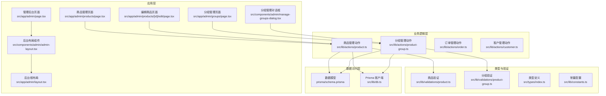
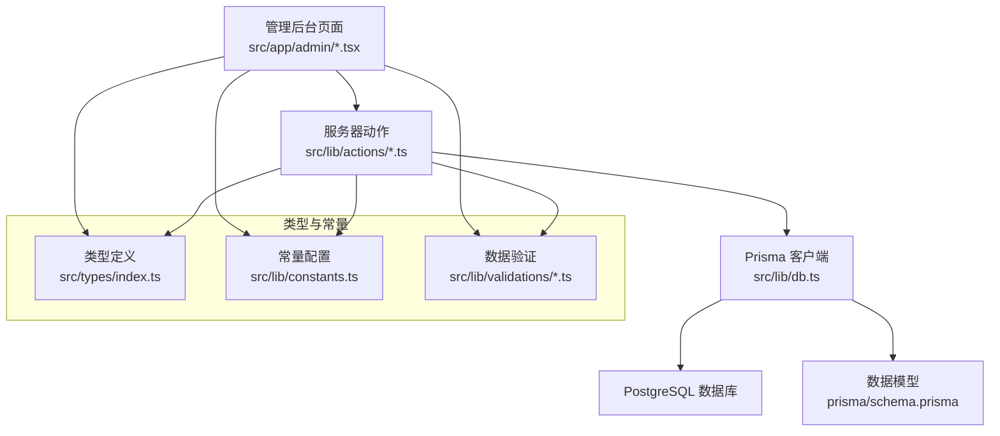
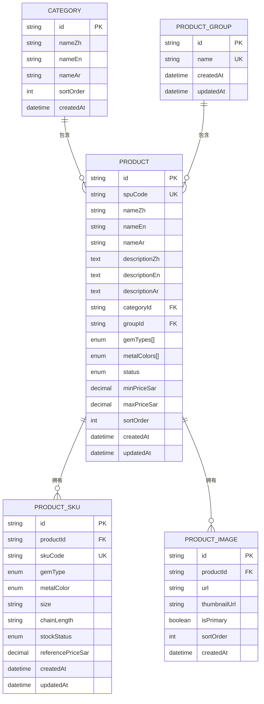
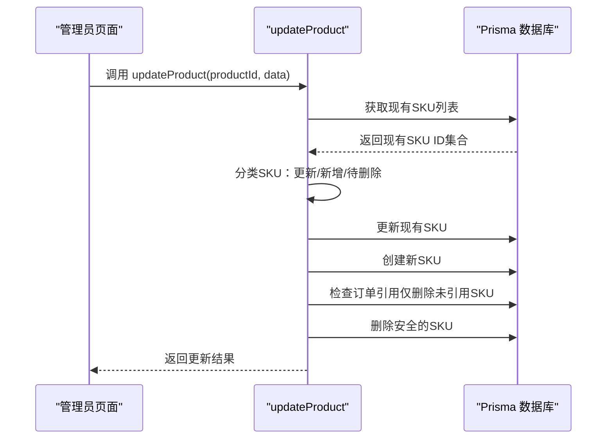
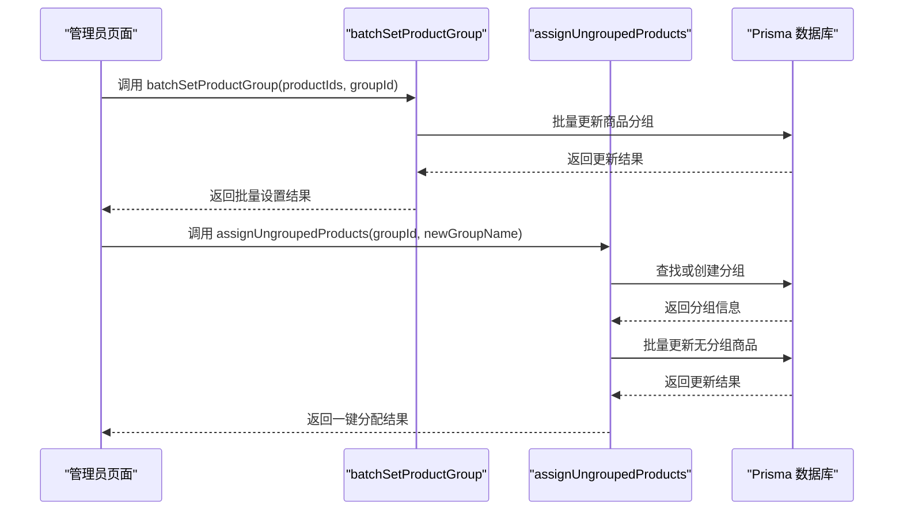
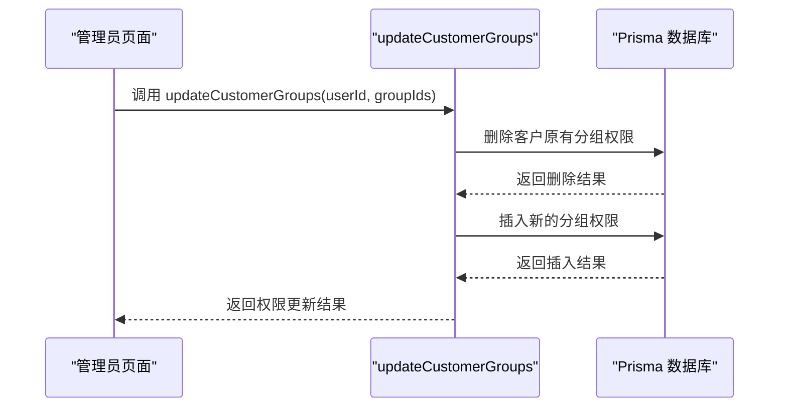
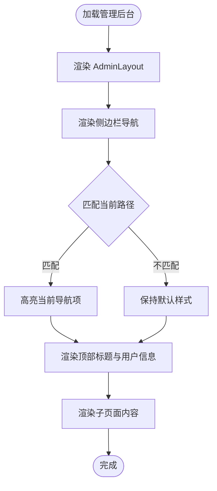
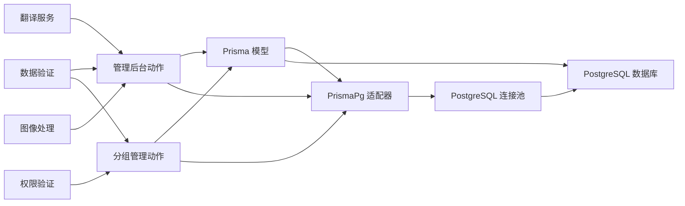

# 商品管理系统

<cite>
**本文档引用的文件**
- [README.md](file://README.md)
- [schema.prisma](file://prisma/schema.prisma)
- [db.ts](file://src/lib/db.ts)
- [index.ts](file://src/types/index.ts)
- [constants.ts](file://src/lib/constants.ts)
- [admin-layout.tsx](file://src/components/admin/admin-layout.tsx)
- [page.tsx](file://src/app/admin/page.tsx)
- [layout.tsx](file://src/app/admin/layout.tsx)
- [customer.ts](file://src/lib/actions/customer.ts)
- [product.ts](file://src/lib/actions/product.ts)
- [product-group.ts](file://src/lib/actions/product-group.ts)
- [product-group.ts](file://src/lib/validations/product-group.ts)
- [product.ts](file://src/lib/validations/product.ts)
- [sku-editor.tsx](file://src/components/admin/sku-editor.tsx)
- [products-page.tsx](file://src/app/admin/products/page.tsx)
- [edit-product-page.tsx](file://src/app/admin/products/[id]/edit/page.tsx)
- [groups-page.tsx](file://src/app/admin/groups/page.tsx)
- [manage-groups-dialog.tsx](file://src/components/admin/manage-groups-dialog.tsx)
</cite>

## 更新摘要
**变更内容**
- 新增商品分组功能章节，包含分组数据模型、管理界面和批量操作
- 更新商品管理服务以支持分组筛选和批量分组分配
- 新增分组权限管理功能，支持客户可见性控制
- 更新商品列表筛选功能，增加分组筛选选项
- 新增一键分配无分组商品功能

## 目录
1. [简介](#简介)
2. [项目结构](#项目结构)
3. [核心组件](#核心组件)
4. [架构概览](#架构概览)
5. [详细组件分析](#详细组件分析)
6. [依赖分析](#依赖分析)
7. [性能考虑](#性能考虑)
8. [故障排除指南](#故障排除指南)
9. [结论](#结论)
10. [附录](#附录)

## 简介
本文件为 Celestia 珠宝商品管理系统的综合技术文档。系统基于 Next.js 构建，采用 Prisma ORM 进行数据库访问，支持多语言与国际化，并提供管理后台以进行商品、订单与客户的统一管理。

当前仓库已实现以下能力：
- 管理后台布局与导航
- 客户管理（分页、搜索、状态筛选、加价比例配置）
- 商品数据模型（SPU/SKU/图片/分类/分组/价格/状态）
- 订单与支付相关模型
- 基础认证与权限控制（ADMIN/CUSTOMER 角色）
- **重大改进：SKU更新机制从全量替换改为增量更新，支持精确更新、新增和安全删除**
- **新增功能：商品分组管理，支持批量分组分配和客户分组权限控制**

## 项目结构
项目采用 Next.js App Router 的目录结构，主要模块如下：
- 应用入口与页面：src/app/admin/* 提供管理后台页面与布局
- 组件层：src/components/admin/* 提供后台通用布局组件
- 类型定义：src/types/index.ts 定义 API 响应、分页与筛选参数等
- 数据库与常量：src/lib/db.ts 提供 Prisma 客户端；src/lib/constants.ts 提供常量配置
- 数据模型：prisma/schema.prisma 定义用户、商品、订单等核心模型
- **业务逻辑层**：src/lib/actions/* 提供商品管理、订单管理、分组管理等核心业务逻辑

**图表来源**
- [page.tsx:1-57](file://src/app/admin/page.tsx#L1-L57)
- [admin-layout.tsx:1-207](file://src/components/admin/admin-layout.tsx#L1-L207)
- [layout.tsx:1-10](file://src/app/admin/layout.tsx#L1-L10)
- [products-page.tsx:1-572](file://src/app/admin/products/page.tsx#L1-L572)
- [edit-product-page.tsx:1-645](file://src/app/admin/products/[id]/edit/page.tsx#L1-L645)
- [groups-page.tsx:1-553](file://src/app/admin/groups/page.tsx#L1-L553)
- [manage-groups-dialog.tsx:1-164](file://src/components/admin/manage-groups-dialog.tsx#L1-L164)
- [product.ts:1-1131](file://src/lib/actions/product.ts#L1-L1131)
- [product-group.ts:1-287](file://src/lib/actions/product-group.ts#L1-L287)
- [product.ts:1-81](file://src/lib/validations/product.ts#L1-L81)
- [product-group.ts:1-21](file://src/lib/validations/product-group.ts#L1-L21)
- [index.ts:1-60](file://src/types/index.ts#L1-L60)
- [constants.ts:1-46](file://src/lib/constants.ts#L1-L46)
- [schema.prisma:1-347](file://prisma/schema.prisma#L1-L347)
- [db.ts:1-18](file://src/lib/db.ts#L1-L18)

**章节来源**
- [README.md:1-37](file://README.md#L1-L37)
- [schema.prisma:1-347](file://prisma/schema.prisma#L1-L347)
- [db.ts:1-18](file://src/lib/db.ts#L1-L18)
- [index.ts:1-60](file://src/types/index.ts#L1-L60)
- [constants.ts:1-46](file://src/lib/constants.ts#L1-L46)
- [admin-layout.tsx:1-207](file://src/components/admin/admin-layout.tsx#L1-L207)
- [page.tsx:1-57](file://src/app/admin/page.tsx#L1-L57)
- [layout.tsx:1-10](file://src/app/admin/layout.tsx#L1-L10)
- [products-page.tsx:1-572](file://src/app/admin/products/page.tsx#L1-L572)
- [edit-product-page.tsx:1-645](file://src/app/admin/products/[id]/edit/page.tsx#L1-L645)
- [groups-page.tsx:1-553](file://src/app/admin/groups/page.tsx#L1-L553)
- [manage-groups-dialog.tsx:1-164](file://src/components/admin/manage-groups-dialog.tsx#L1-L164)
- [product.ts:1-1131](file://src/lib/actions/product.ts#L1-L1131)
- [product-group.ts:1-287](file://src/lib/actions/product-group.ts#L1-L287)
- [product.ts:1-81](file://src/lib/validations/product.ts#L1-L81)
- [product-group.ts:1-21](file://src/lib/validations/product-group.ts#L1-L21)

## 核心组件
- 管理后台布局与导航：提供侧边栏、移动端适配、页面标题与退出登录功能
- **商品管理服务**：提供商品列表、创建、更新、上下架切换、删除等完整CRUD操作
- **商品分组管理**：提供分组创建、更新、删除、批量分配和一键分配功能
- **SKU增量更新机制**：支持现有SKU的精确更新、新SKU的创建以及订单引用保护
- 客户管理服务：提供分页、搜索、状态筛选、审核通过与加价比例更新
- 数据模型：用户、品类、商品（SPU）、SKU、分组、图片、订单、支付、物流等
- 类型与常量：统一的 API 响应格式、分页参数、排序与筛选枚举、默认加价比例、支持语言等

**章节来源**
- [admin-layout.tsx:24-38](file://src/components/admin/admin-layout.tsx#L24-L38)
- [customer.ts:24-126](file://src/lib/actions/customer.ts#L24-L126)
- [product.ts:496-863](file://src/lib/actions/product.ts#L496-L863)
- [product-group.ts:13-145](file://src/lib/actions/product-group.ts#L13-L145)
- [schema.prisma:321-346](file://prisma/schema.prisma#L321-L346)
- [index.ts:1-60](file://src/types/index.ts#L1-L60)
- [constants.ts:31-46](file://src/lib/constants.ts#L31-L46)

## 架构概览
系统采用分层架构：
- 表现层：Next.js 页面与组件（管理后台页面与布局）
- 业务层：服务器动作（Server Actions），如商品管理、分组管理相关操作
- 数据访问层：Prisma 客户端，连接 PostgreSQL
- 数据模型层：Prisma Schema 定义实体关系与索引

**图表来源**
- [page.tsx:1-57](file://src/app/admin/page.tsx#L1-L57)
- [admin-layout.tsx:1-207](file://src/components/admin/admin-layout.tsx#L1-L207)
- [products-page.tsx:1-572](file://src/app/admin/products/page.tsx#L1-L572)
- [edit-product-page.tsx:1-645](file://src/app/admin/products/[id]/edit/page.tsx#L1-L645)
- [groups-page.tsx:1-553](file://src/app/admin/groups/page.tsx#L1-L553)
- [manage-groups-dialog.tsx:1-164](file://src/components/admin/manage-groups-dialog.tsx#L1-L164)
- [product.ts:1-1131](file://src/lib/actions/product.ts#L1-L1131)
- [product-group.ts:1-287](file://src/lib/actions/product-group.ts#L1-L287)
- [customer.ts:1-239](file://src/lib/actions/customer.ts#L1-L239)
- [db.ts:1-18](file://src/lib/db.ts#L1-L18)
- [schema.prisma:1-347](file://prisma/schema.prisma#L1-L347)
- [index.ts:1-60](file://src/types/index.ts#L1-L60)
- [constants.ts:1-46](file://src/lib/constants.ts#L1-L46)
- [product.ts:1-81](file://src/lib/validations/product.ts#L1-L81)
- [product-group.ts:1-21](file://src/lib/validations/product-group.ts#L1-L21)

## 详细组件分析

### 商品数据模型（SPU/SKU/图片/分类/分组）
商品模型采用 SPU（标准产品单元）+ SKU（库存量单位）的设计，支持多语言名称与描述、宝石类型与金属颜色组合、价格区间、状态与排序等字段。图片模型支持主图与缩略图、排序与创建时间。分类模型支持多语言名称与排序。**新增分组模型**支持商品分组管理，包括分组名称、创建时间等字段。

**图表来源**
- [schema.prisma:108-186](file://prisma/schema.prisma#L108-L186)
- [schema.prisma:321-346](file://prisma/schema.prisma#L321-L346)

**章节来源**
- [schema.prisma:108-186](file://prisma/schema.prisma#L108-L186)
- [schema.prisma:321-346](file://prisma/schema.prisma#L321-L346)

### 商品管理服务（完整CRUD操作）
该服务提供了完整的商品管理功能，包括商品列表、创建、更新、上下架切换、删除等操作：

#### 商品列表管理
- 支持分页、搜索、筛选（品类、状态、关键词、**分组**）
- 支持多种排序方式（价格升序、价格降序、最新、最热）
- 支持游标分页，适合大数据量场景
- **新增分组筛选功能**：支持按分组ID筛选，包括无分组商品

#### 商品创建与更新
- **重大改进**：SKU更新采用增量机制而非全量替换
- 支持多语言名称与描述的自动翻译
- 自动计算价格区间（minPriceSar/maxPriceSar）
- **支持分组设置**：在创建和更新时可设置商品分组

#### SKU增量更新机制
**更新** 采用全新的增量更新策略，支持以下操作：

1. **精确更新**：对现有SKU进行精确更新（通过id标识）
2. **新增SKU**：为商品添加新的SKU变体
3. **安全删除**：仅删除未被订单引用的SKU
4. **订单引用保护**：被订单引用的SKU保留在数据库中

**图表来源**
- [product.ts:750-838](file://src/lib/actions/product.ts#L750-L838)

**章节来源**
- [product.ts:244-392](file://src/lib/actions/product.ts#L244-L392)
- [product.ts:496-863](file://src/lib/actions/product.ts#L496-L863)
- [product.ts:750-838](file://src/lib/actions/product.ts#L750-L838)

### 商品分组管理服务
**新增功能**：提供完整的商品分组管理能力，包括分组创建、更新、删除、批量分配和一键分配功能。

#### 分组管理功能
- **分组创建**：支持创建新的商品分组，名称唯一约束
- **分组更新**：支持修改分组名称，名称唯一约束
- **分组删除**：支持删除分组，删除前需确认
- **分组列表**：支持获取分组列表及商品数量统计
- **无分组商品统计**：支持统计无分组商品数量

#### 批量分组操作
- **批量设置分组**：支持对多个商品批量设置分组
- **一键分配无分组商品**：支持将所有无分组商品分配到指定分组
- **根据名称获取或创建分组**：支持按名称查找分组，不存在则自动创建

**图表来源**
- [product-group.ts:226-246](file://src/lib/actions/product-group.ts#L226-L246)
- [product-group.ts:171-221](file://src/lib/actions/product-group.ts#L171-L221)

**章节来源**
- [product-group.ts:13-145](file://src/lib/actions/product-group.ts#L13-L145)
- [product-group.ts:171-246](file://src/lib/actions/product-group.ts#L171-L246)
- [product-group.ts:251-286](file://src/lib/actions/product-group.ts#L251-L286)

### 客户分组权限管理
**新增功能**：支持为客户设置可见的商品分组权限，实现精细化的商品访问控制。

#### 权限管理功能
- **分组权限设置**：支持为客户设置可见的分组列表
- **权限同步**：支持批量更新客户分组权限
- **权限验证**：在商品访问时验证客户权限

**图表来源**
- [manage-groups-dialog.tsx:66-85](file://src/components/admin/manage-groups-dialog.tsx#L66-L85)

**章节来源**
- [manage-groups-dialog.tsx:1-164](file://src/components/admin/manage-groups-dialog.tsx#L1-L164)
- [customer.ts:159-241](file://src/lib/actions/customer.ts#L159-L241)

### 管理后台布局与导航
后台布局组件提供：
- 固定侧边栏与移动端抽屉菜单
- 导航项：仪表盘、商品管理、**分组管理**、订单管理、客户管理、系统设置
- 页面标题动态显示
- 退出登录跳转

**图表来源**
- [admin-layout.tsx:40-206](file://src/components/admin/admin-layout.tsx#L40-L206)

**章节来源**
- [admin-layout.tsx:24-38](file://src/components/admin/admin-layout.tsx#L24-L38)
- [admin-layout.tsx:40-206](file://src/components/admin/admin-layout.tsx#L40-L206)

### 商品管理前端组件
**商品管理页面**：提供商品列表展示、搜索、筛选、批量操作功能，**新增分组筛选功能**

**编辑商品页面**：提供完整的商品编辑界面，包括基本信息、SKU配置、图片管理、**分组设置**

**分组管理页面**：提供分组列表管理界面，支持分组创建、更新、删除、批量分配和一键分配

**分组管理对话框**：支持为客户设置可见的分组权限

**SKU编辑器组件**：支持SKU的动态添加、删除、移动和字段编辑

**章节来源**
- [products-page.tsx:1-572](file://src/app/admin/products/page.tsx#L1-L572)
- [edit-product-page.tsx:1-645](file://src/app/admin/products/[id]/edit/page.tsx#L1-L645)
- [groups-page.tsx:1-553](file://src/app/admin/groups/page.tsx#L1-L553)
- [manage-groups-dialog.tsx:1-164](file://src/components/admin/manage-groups-dialog.tsx#L1-L164)
- [sku-editor.tsx:60-95](file://src/components/admin/sku-editor.tsx#L60-L95)

### 类型与常量
- API 响应格式：统一 success/data/error/message 字段
- 分页参数：page、pageSize、cursor（游标分页）
- 商品筛选参数：categoryId、gemType、metalColor、keyword、sortBy、status、**groupIds**
- 订单筛选参数：status、userId、keyword
- **分组验证**：支持分组名称长度限制，批量操作支持空分组
- **SKU验证**：支持id字段用于增量更新，确保数据完整性
- JWT 负载与会话用户结构
- 分页默认值与最大值
- 默认加价比例
- 支持语言与 RTL 语言

**章节来源**
- [index.ts:1-60](file://src/types/index.ts#L1-L60)
- [constants.ts:31-46](file://src/lib/constants.ts#L31-L46)
- [product.ts:152-181](file://src/lib/actions/product.ts#L152-L181)
- [product.ts:26-29](file://src/lib/validations/product.ts#L26-L29)
- [product-group.ts:12-20](file://src/lib/validations/product-group.ts#L12-L20)

## 依赖分析
- 数据库连接：通过 PrismaPg 适配器连接 PostgreSQL，开发环境启用查询日志
- 模型依赖：Product 依赖 Category（外键），ProductGroup 依赖 UserGroupAccess（级联删除），ProductSku 依赖 Product（级联删除），ProductImage 依赖 Product（级联删除）
- 权限模型：User 模型包含角色与状态枚举，用于后台权限控制
- **业务逻辑依赖**：商品管理动作依赖验证模块、翻译服务、图像处理服务，**分组管理依赖权限验证**
- **分组权限依赖**：客户分组权限通过 UserGroupAccess 模型管理

**图表来源**
- [db.ts:1-18](file://src/lib/db.ts#L1-L18)
- [schema.prisma:1-347](file://prisma/schema.prisma#L1-L347)
- [product.ts:1-10](file://src/lib/actions/product.ts#L1-L10)
- [product-group.ts:1-4](file://src/lib/actions/product-group.ts#L1-L4)

**章节来源**
- [db.ts:1-18](file://src/lib/db.ts#L1-L18)
- [schema.prisma:1-347](file://prisma/schema.prisma#L1-L347)
- [product.ts:1-10](file://src/lib/actions/product.ts#L1-L10)
- [product-group.ts:1-4](file://src/lib/actions/product-group.ts#L1-L4)

## 性能考虑
- 分页与索引：商品与订单模型已在关键字段建立索引，建议在商品列表查询时使用索引字段进行过滤与排序
- 游标分页：类型定义中提供 cursor 参数，可在大数据量场景下使用游标分页提升性能
- 缓存刷新：服务器动作中使用 revalidatePath 刷新缓存，避免陈旧数据
- 最大页大小限制：常量中限制最大页大小，防止过大请求影响性能
- **增量更新优化**：SKU增量更新避免了全量删除重建，显著提升了大规模商品的更新性能
- **订单引用检查**：通过一次性查询订单引用，避免多次数据库往返
- **分组筛选优化**：商品列表支持分组筛选，使用 AND 条件组合提高查询效率
- **批量操作优化**：分组批量设置和一键分配使用 updateMany 提升操作性能

## 故障排除指南
- 权限不足：当非 ADMIN 用户调用管理接口时，返回空列表或错误提示
- 参数校验失败：如用户ID为空、加价比例小于等于0，返回相应错误信息
- 数据库异常：捕获异常并记录日志，返回空分页结果或错误响应
- 缓存问题：调用更新操作后需触发 revalidatePath 以刷新缓存
- **SKU更新失败**：检查SKU ID是否存在、订单引用状态、价格格式等
- **订单引用保护**：被订单引用的SKU无法删除，这是预期行为
- **分组管理异常**：检查分组名称唯一性、批量操作参数有效性
- **分组权限设置失败**：确认客户ID有效、分组ID存在且权限更新成功

**章节来源**
- [customer.ts:32-40](file://src/lib/actions/customer.ts#L32-L40)
- [customer.ts:143-158](file://src/lib/actions/customer.ts#L143-L158)
- [customer.ts:176-182](file://src/lib/actions/customer.ts#L176-L182)
- [customer.ts:200-214](file://src/lib/actions/customer.ts#L200-L214)
- [customer.ts:231-237](file://src/lib/actions/customer.ts#L231-L237)
- [product.ts:821-838](file://src/lib/actions/product.ts#L821-L838)
- [product-group.ts:82-88](file://src/lib/actions/product-group.ts#L82-L88)
- [product-group.ts:115-121](file://src/lib/actions/product-group.ts#L115-L121)

## 结论
本仓库提供了管理后台的基础框架、权限控制与客户管理的完整实现，同时具备完善的商品数据模型与枚举定义。基于现有结构，可快速扩展商品管理功能，包括商品列表的分页/搜索/排序/批量操作、商品编辑与创建（表单验证/图片上传/属性配置）、**基于增量更新的库存管理（精确更新/新增/安全删除/订单引用保护）**、分类管理（层级/关联/筛选）、**分组管理（创建/更新/删除/批量分配/一键分配）**以及状态管理（上架/下架/促销/推荐位）。

**重大改进**：SKU更新机制的增量更新策略显著提升了系统的数据完整性和操作安全性，同时保持了良好的性能表现。**新增的分组管理功能**为商品组织和客户权限控制提供了强大的支持，增强了系统的灵活性和可扩展性。

## 附录

### API 接口规范（基于现有类型）
- 分页请求参数
  - page: number（默认 1）
  - pageSize: number（默认 20，最大 100）
  - cursor: string（游标分页）
- 商品筛选参数
  - categoryId: string
  - gemType: string
  - metalColor: string
  - keyword: string
  - sortBy: 'price_asc' | 'price_desc' | 'newest' | 'popular'
  - status: string（管理端用）
  - **groupIds: string[]（分组筛选，支持无分组）**
- 订单筛选参数
  - status: string
  - userId: string（管理端按客户筛选）
  - keyword: string（按订单号搜索）
- **分组管理参数**
  - **createProductGroup**: name: string（1-50字符）
  - **updateProductGroup**: id: string, name: string（1-50字符）
  - **batchSetGroup**: productIds: string[], groupId: string | null
  - **assignUngrouped**: groupId: string | null, newGroupName?: string
- **SKU更新参数**
  - id: string（用于增量更新的现有SKU标识）
  - gemType: string
  - metalColor: string
  - size: string
  - chainLength: string
  - stockStatus: string
  - referencePriceSar: string
- 会话用户与 JWT 负载
  - SessionUser：id、phone、name、role、status、markupRatio、preferredLang
  - JwtPayload：userId、role、status、iat、exp

**章节来源**
- [index.ts:9-39](file://src/types/index.ts#L9-L39)
- [index.ts:50-59](file://src/types/index.ts#L50-L59)
- [product.ts:152-181](file://src/lib/actions/product.ts#L152-L181)
- [product.ts:26-29](file://src/lib/validations/product.ts#L26-L29)
- [product-group.ts:12-20](file://src/lib/validations/product-group.ts#L12-L20)

### 数据模型字段说明（节选）
- 用户：phone（唯一）、role、status、markupRatio、preferredLang
- 品类：nameZh/nameEn/nameAr、sortOrder
- 商品（SPU）：spuCode（唯一）、多语言名称/描述、categoryId、**groupId**、gemTypes、metalColors、status、min/maxPriceSar、sortOrder
- **分组**：name（唯一）、createdAt、updatedAt
- **SKU**：skuCode（唯一）、gemType、metalColor、size、chainLength、stockStatus、referencePriceSar
- 图片：url、thumbnailUrl、isPrimary、sortOrder

**章节来源**
- [schema.prisma:89-186](file://prisma/schema.prisma#L89-L186)
- [schema.prisma:321-346](file://prisma/schema.prisma#L321-L346)

### SKU增量更新最佳实践
**更新** 基于增量更新机制的SKU管理最佳实践：

1. **精确更新策略**
   - 为每个SKU提供唯一的id标识
   - 仅更新需要变更的字段
   - 保持SKU编码的稳定性

2. **新增SKU流程**
   - 不提供id字段的新SKU会被创建
   - 自动生成唯一的skuCode
   - 支持批量新增多个SKU变体

3. **安全删除原则**
   - 仅删除未被任何订单引用的SKU
   - 被订单引用的SKU保留在数据库中
   - 确保订单历史数据的完整性

4. **性能优化建议**
   - 合理控制SKU数量，避免过度细分
   - 使用批量操作减少数据库往返
   - 定期清理长期未使用的SKU

### 分组管理最佳实践
**新增功能**：基于分组管理功能的最佳实践：

1. **分组设计原则**
   - 合理规划分组层次，避免过度细分
   - 使用有意义的分组名称，便于管理和识别
   - 定期清理不再使用的分组

2. **批量操作策略**
   - 使用批量设置功能快速分配商品分组
   - 一键分配无分组商品时注意分组容量
   - 批量操作前做好数据备份

3. **权限控制建议**
   - 为不同客户群体设置合适的分组权限
   - 定期审查客户分组权限，确保准确性
   - 结合其他权限控制机制实现多层次保护

4. **性能优化建议**
   - 合理控制分组数量，避免过多分组影响查询性能
   - 使用分组筛选时注意查询条件的组合
   - 定期清理无分组商品，保持数据整洁

**章节来源**
- [product.ts:750-838](file://src/lib/actions/product.ts#L750-L838)
- [product.ts:821-838](file://src/lib/actions/product.ts#L821-L838)
- [product-group.ts:171-246](file://src/lib/actions/product-group.ts#L171-L246)
- [product-group.ts:251-286](file://src/lib/actions/product-group.ts#L251-L286)