# 商品编辑与创建

<cite>
**本文档引用的文件**
- [README.md](file://README.md)
- [schema.prisma](file://prisma/schema.prisma)
- [index.ts](file://src/types/index.ts)
- [constants.ts](file://src/lib/constants.ts)
- [utils.ts](file://src/lib/utils.ts)
- [db.ts](file://src/lib/db.ts)
- [form-group.tsx](file://src/components/ui/form-group.tsx)
- [page.tsx](file://src/app/admin/login/page.tsx)
- [product.ts](file://src/lib/actions/product.ts)
- [sku-editor.tsx](file://src/components/admin/sku-editor.tsx)
- [edit.page.tsx](file://src/app/admin/products/[id]/edit/page.tsx)
- [new.page.tsx](file://src/app/admin/products/new/page.tsx)
- [product.ts](file://src/lib/validations/product.ts)
</cite>

## 更新摘要
**所做更改**
- 更新了SKU管理章节，反映增量更新功能的实现
- 新增了唯一SKU代码生成机制的详细说明
- 增加了订单引用保护的SKU删除策略
- 更新了商品编辑流程图，体现增量更新逻辑
- 新增了SKU编辑器组件的详细功能说明

## 目录
1. [简介](#简介)
2. [项目结构](#项目结构)
3. [核心组件](#核心组件)
4. [架构概览](#架构概览)
5. [详细组件分析](#详细组件分析)
6. [依赖关系分析](#依赖关系分析)
7. [性能考虑](#性能考虑)
8. [故障排除指南](#故障排除指南)
9. [结论](#结论)
10. [附录](#附录)

## 简介

本文档全面介绍Celestia项目中的商品编辑与创建功能。该项目基于Next.js构建，采用TypeScript开发，使用Prisma ORM进行数据库操作。商品管理系统支持多语言内容管理、SKU规格配置、图片上传与管理等功能。

系统采用现代化的技术栈，包括：
- Next.js应用框架
- TypeScript类型安全
- Prisma ORM数据库抽象层
- shadcn/ui组件库
- Tailwind CSS样式框架
- Zod表单验证

**更新** 本版本重点增强了商品编辑功能，引入了更精细的SKU管理机制，包括增量更新、唯一SKU代码生成和订单引用保护等高级功能。

## 项目结构

项目采用模块化的目录结构，主要包含以下关键目录：

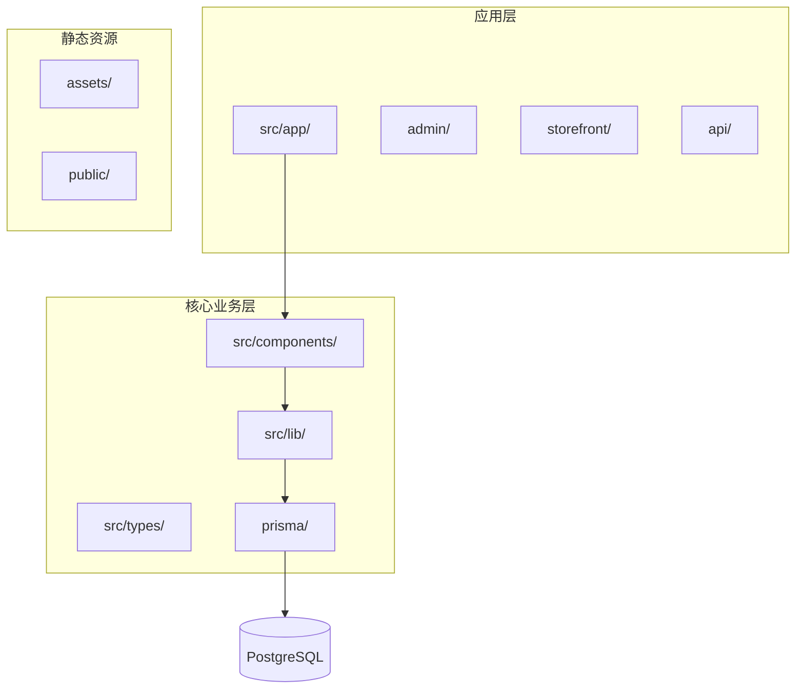

**图表来源**
- [README.md:1-37](file://README.md#L1-L37)
- [schema.prisma:1-281](file://prisma/schema.prisma#L1-L281)

**章节来源**
- [README.md:1-37](file://README.md#L1-L37)

## 核心组件

### 数据模型设计

系统的核心数据模型围绕商品（Product）展开，采用SPU+SKU的两级结构设计：

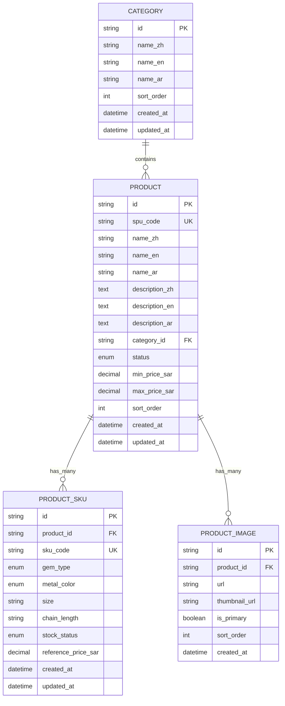

**图表来源**
- [schema.prisma:122-186](file://prisma/schema.prisma#L122-L186)

### 类型系统

项目建立了完整的类型系统，确保类型安全：

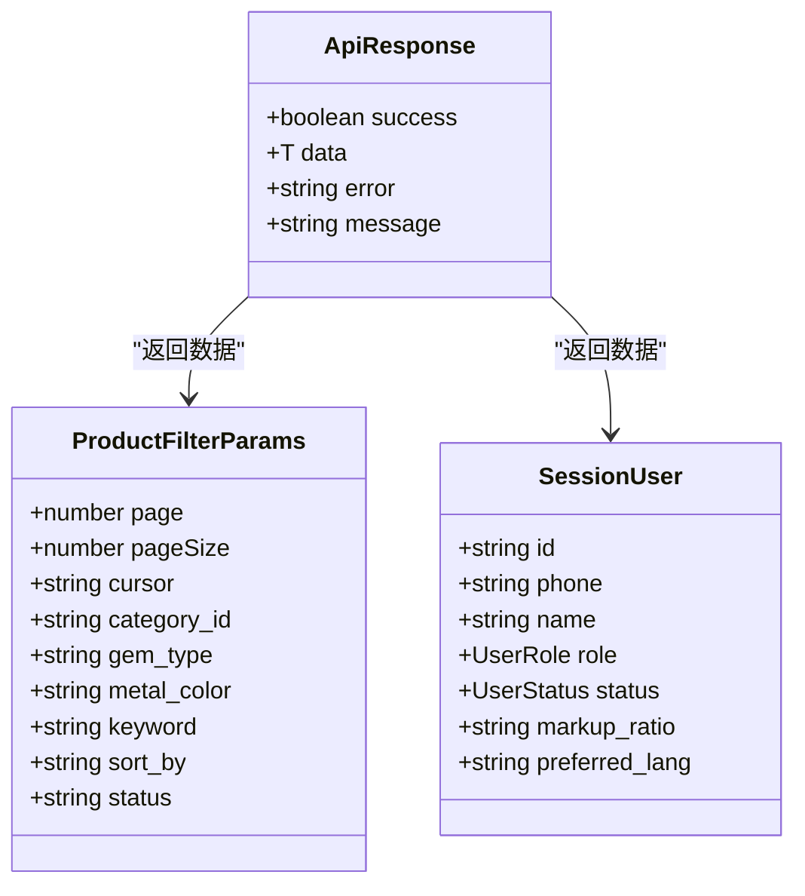

**图表来源**
- [index.ts:1-60](file://src/types/index.ts#L1-L60)

**章节来源**
- [schema.prisma:122-186](file://prisma/schema.prisma#L122-L186)
- [index.ts:1-60](file://src/types/index.ts#L1-L60)

## 架构概览

系统采用分层架构设计，清晰分离关注点：

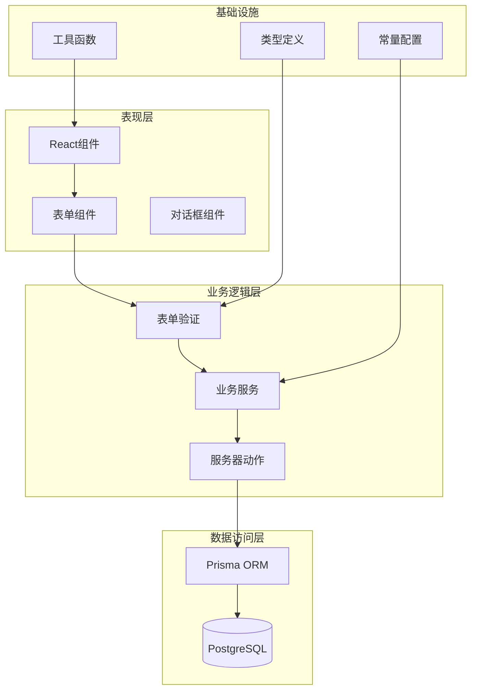

**图表来源**
- [db.ts:1-17](file://src/lib/db.ts#L1-L17)
- [constants.ts:1-46](file://src/lib/constants.ts#L1-L46)

## 详细组件分析

### 商品表单组件

#### 基础表单布局

表单采用统一的FormGroup组件，提供一致的用户体验：

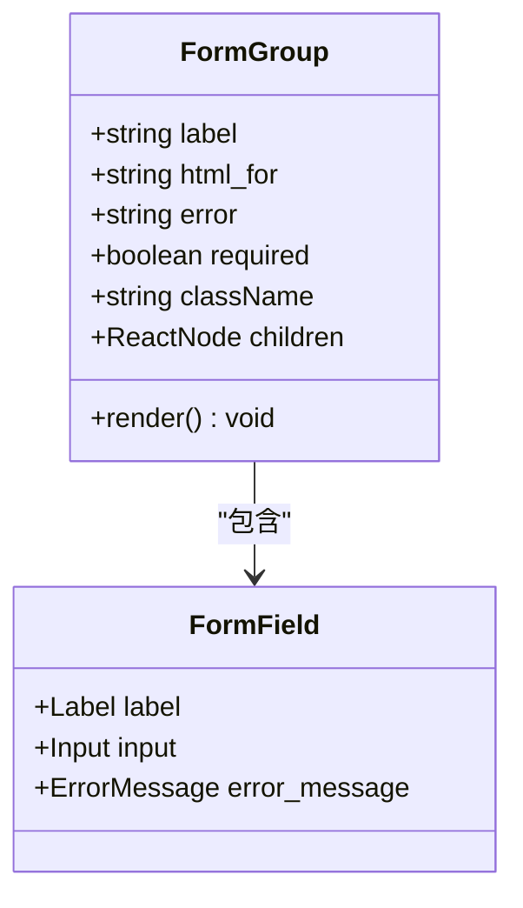

**图表来源**
- [form-group.tsx:1-24](file://src/components/ui/form-group.tsx#L1-L24)

#### 多语言内容管理

系统支持三种语言的商品内容管理：

| 字段 | 中文 | 英文 | 阿拉伯文 |
|------|------|------|----------|
| `name_zh` | 商品名称（中文） | 商品名称（英文） | 商品名称（阿拉伯文） |
| `description_zh` | 描述（中文） | 描述（英文） | 描述（阿拉伯文） |

#### 规格属性配置

SKU规格系统支持多种属性组合：

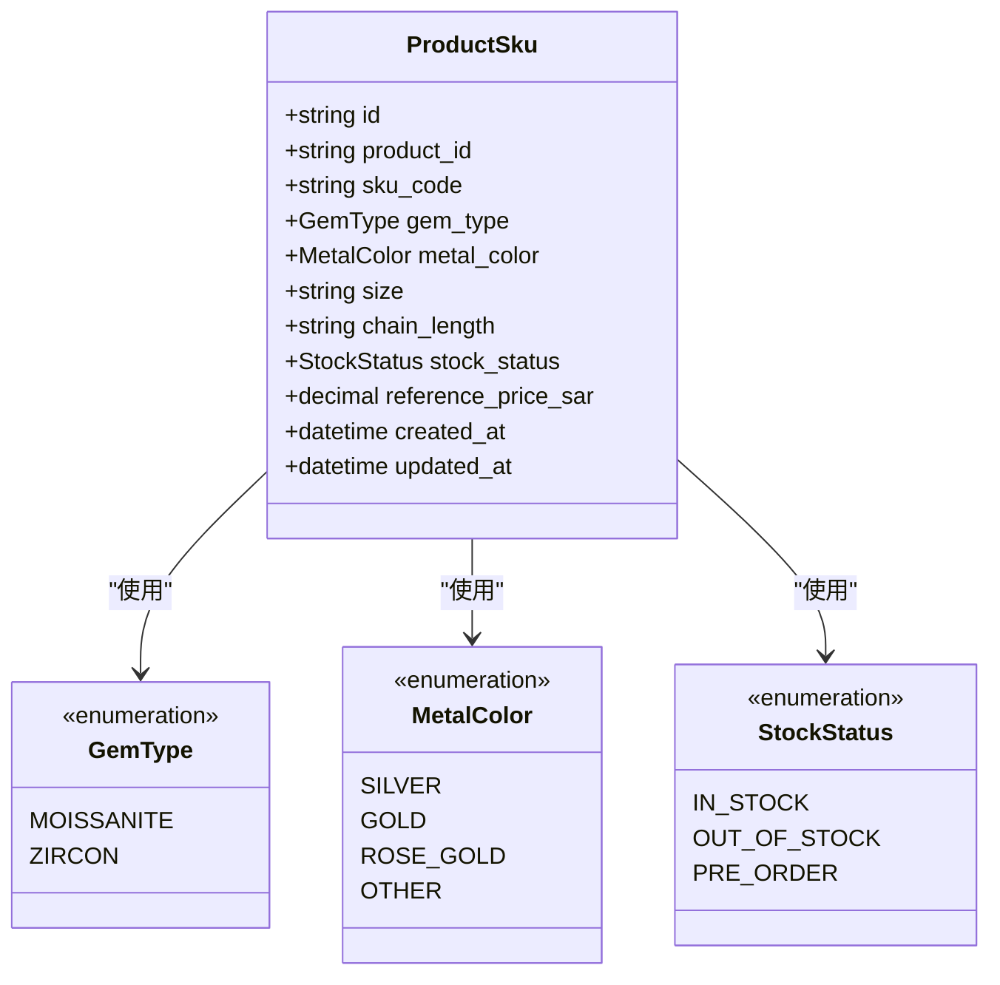

**图表来源**
- [schema.prisma:151-170](file://prisma/schema.prisma#L151-L170)

#### 图片上传与管理

图片系统支持主图设置和排序功能：

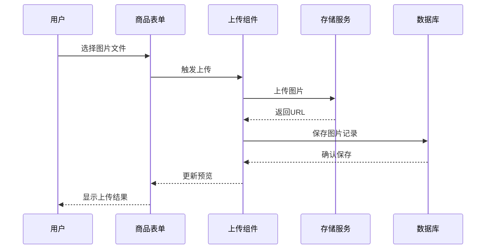

**图表来源**
- [schema.prisma:172-186](file://prisma/schema.prisma#L172-L186)

**章节来源**
- [form-group.tsx:1-24](file://src/components/ui/form-group.tsx#L1-L24)
- [schema.prisma:151-186](file://prisma/schema.prisma#L151-L186)

### SKU管理增强功能

#### 增量更新机制

系统实现了精细的SKU增量更新功能，支持对现有SKU进行精确修改：

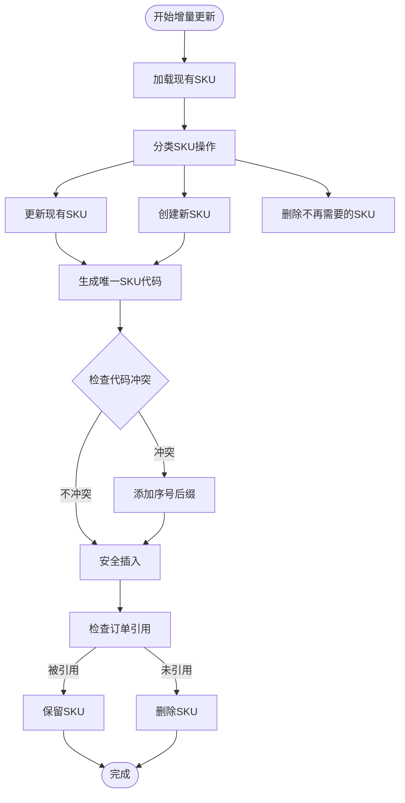

**图表来源**
- [product.ts:750-838](file://src/lib/actions/product.ts#L750-L838)

#### 唯一SKU代码生成

系统实现了智能的SKU代码生成机制，确保每个SKU都有唯一的标识符：

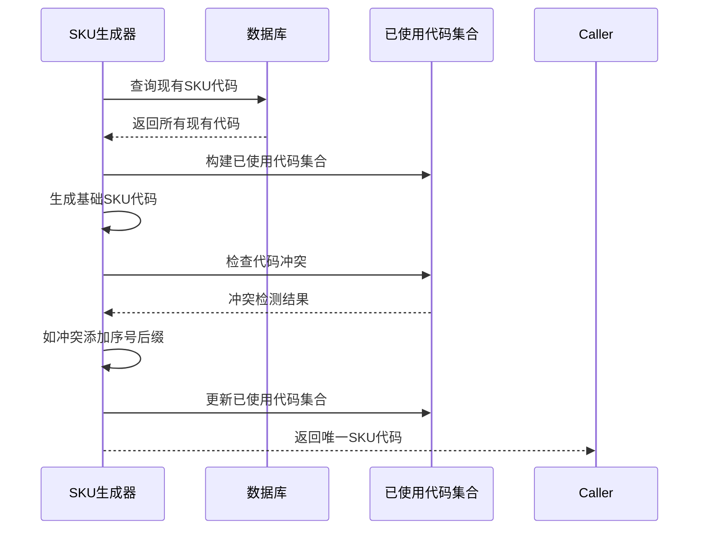

**图表来源**
- [product.ts:790-804](file://src/lib/actions/product.ts#L790-L804)

#### 订单引用保护

系统实现了订单引用保护机制，确保历史订单数据的完整性：

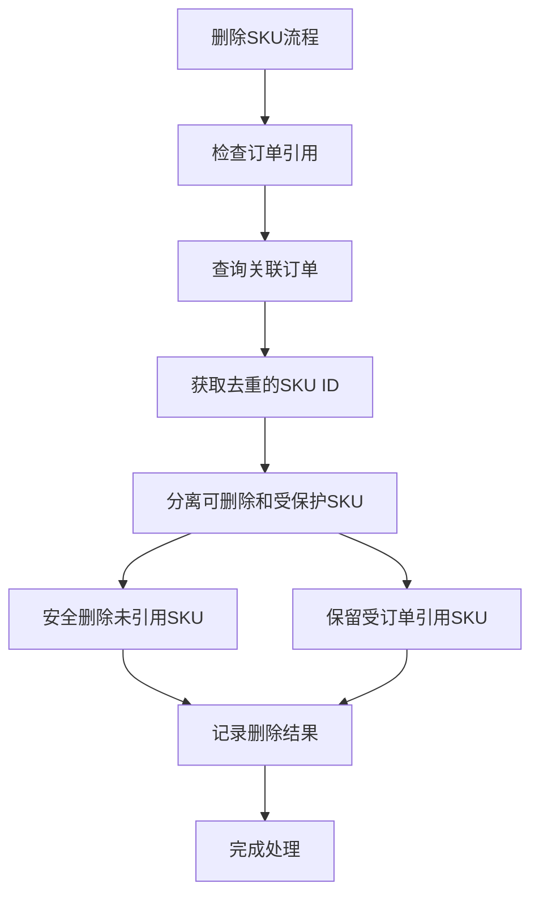

**图表来源**
- [product.ts:821-837](file://src/lib/actions/product.ts#L821-L837)

**章节来源**
- [product.ts:750-838](file://src/lib/actions/product.ts#L750-L838)
- [product.ts:790-804](file://src/lib/actions/product.ts#L790-L804)
- [product.ts:821-837](file://src/lib/actions/product.ts#L821-L837)

### SKU编辑器组件

#### 功能特性

SKU编辑器是一个高度交互的组件，提供完整的SKU管理功能：

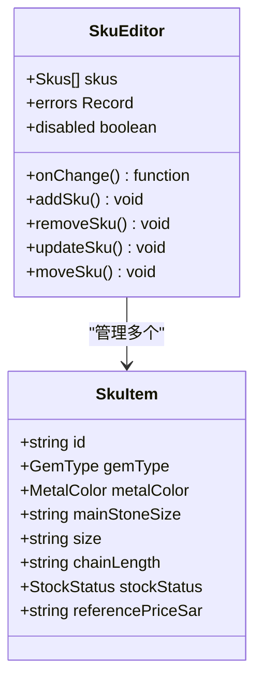

**图表来源**
- [sku-editor.tsx:24-40](file://src/components/admin/sku-editor.tsx#L24-L40)

#### 用户界面交互

SKU编辑器提供直观的用户界面，支持多种操作：

| 操作 | 用户界面元素 | 功能描述 |
|------|-------------|----------|
| 添加SKU | 添加按钮 | 在表格末尾添加新的SKU配置行 |
| 删除SKU | 删除图标按钮 | 从列表中移除指定的SKU（至少保留一个） |
| 移动SKU | 上下箭头按钮 | 调整SKU在列表中的顺序 |
| 编辑属性 | 下拉选择框和输入框 | 修改宝石类型、金属颜色、尺寸等属性 |
| 价格设置 | 数字输入框 | 设置SKU的参考价格 |

**章节来源**
- [sku-editor.tsx:60-307](file://src/components/admin/sku-editor.tsx#L60-L307)

### 表单验证系统

#### 登录表单验证

系统使用Zod进行表单验证，确保数据完整性：

**图表来源**
- [page.tsx:13-16](file://src/app/admin/login/page.tsx#L13-L16)

#### API响应格式

所有API调用遵循统一的响应格式：

| 字段 | 类型 | 描述 | 必需 |
|------|------|------|------|
| `success` | boolean | 请求是否成功 | 是 |
| `data` | T | 返回的数据对象 | 否 |
| `error` | string | 错误消息 | 否 |
| `message` | string | 业务消息 | 否 |

**章节来源**
- [page.tsx:20-31](file://src/app/admin/login/page.tsx#L20-L31)

### CRUD操作实现

#### 创建商品流程

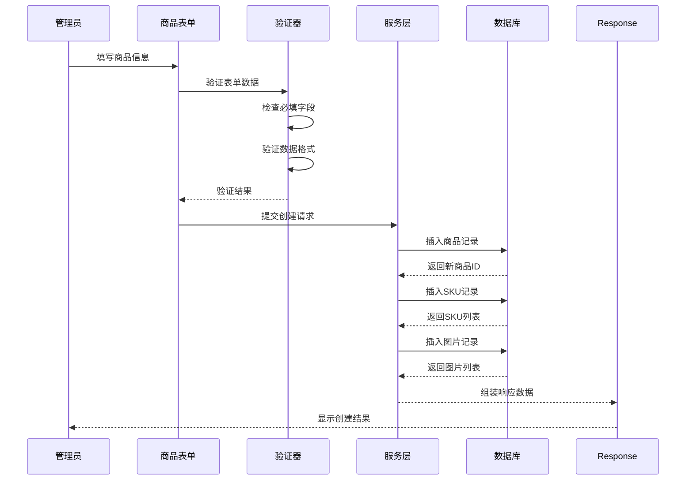

#### 更新商品流程

**更新** 增量更新流程体现了精细化的SKU管理能力：

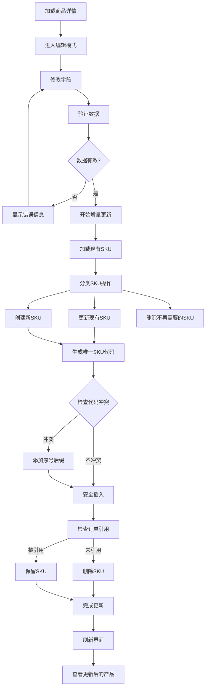

**图表来源**
- [schema.prisma:122-149](file://prisma/schema.prisma#L122-L149)
- [product.ts:750-838](file://src/lib/actions/product.ts#L750-L838)

**章节来源**
- [schema.prisma:122-149](file://prisma/schema.prisma#L122-L149)
- [product.ts:750-838](file://src/lib/actions/product.ts#L750-L838)

## 依赖关系分析

### 数据库连接管理

系统使用Prisma作为ORM层，提供类型安全的数据库操作：

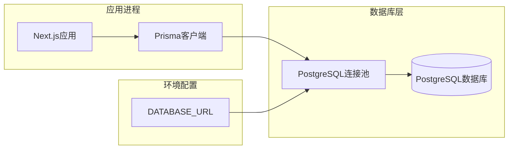

**图表来源**
- [db.ts:1-17](file://src/lib/db.ts#L1-L17)

### 工具函数体系

系统提供了丰富的工具函数支持：

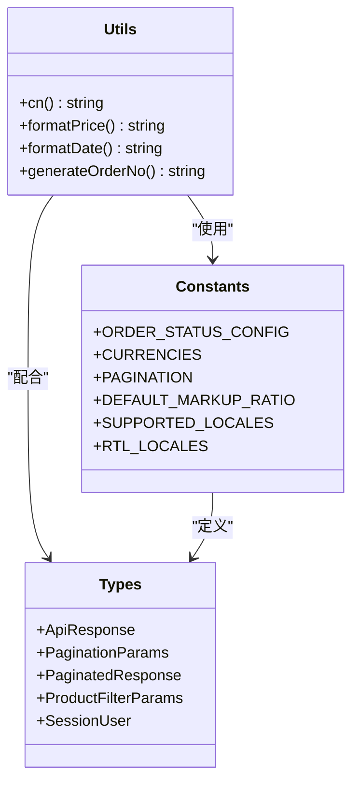

**图表来源**
- [utils.ts:1-32](file://src/lib/utils.ts#L1-L32)
- [constants.ts:1-46](file://src/lib/constants.ts#L1-L46)
- [index.ts:1-60](file://src/types/index.ts#L1-L60)

**章节来源**
- [db.ts:1-17](file://src/lib/db.ts#L1-L17)
- [utils.ts:1-32](file://src/lib/utils.ts#L1-L32)
- [constants.ts:1-46](file://src/lib/constants.ts#L1-L46)
- [index.ts:1-60](file://src/types/index.ts#L1-L60)

## 性能考虑

### 数据库优化

系统在数据库层面采用了多项优化策略：

1. **索引优化**：为常用查询字段建立索引
2. **连接池管理**：使用PostgreSQL连接池提高并发性能
3. **查询优化**：Prisma自动生成高效的SQL查询

### 前端性能

1. **组件懒加载**：大型组件按需加载
2. **状态管理**：合理使用React状态提升性能
3. **样式优化**：Tailwind CSS提供高效的样式编译

## 故障排除指南

### 常见问题及解决方案

#### 数据库连接问题

**症状**：应用启动时报数据库连接错误
**解决方案**：
1. 检查DATABASE_URL环境变量配置
2. 验证PostgreSQL服务状态
3. 确认网络连接正常

#### 表单验证错误

**症状**：表单提交时出现验证错误
**解决方案**：
1. 检查必填字段是否完整
2. 验证数据格式是否正确
3. 查看具体的错误提示信息

#### 图片上传失败

**症状**：图片上传过程中断或失败
**解决方案**：
1. 检查文件大小限制
2. 验证文件格式支持
3. 确认存储空间充足

#### SKU管理异常

**症状**：SKU更新时出现代码冲突或删除错误
**解决方案**：
1. 检查SKU代码生成逻辑
2. 验证订单引用检查机制
3. 确认数据库事务完整性

**章节来源**
- [db.ts:1-17](file://src/lib/db.ts#L1-L17)

## 结论

Celestia的商品编辑与创建功能展现了现代电商系统的最佳实践。系统采用模块化设计，具有良好的可扩展性和维护性。通过SPU+SKU的两级结构设计，能够灵活处理复杂的商品规格配置需求。

**更新** 最新版本显著增强了SKU管理功能，引入了增量更新、唯一代码生成和订单引用保护等高级特性，大大提升了系统的数据完整性和用户体验。

关键技术特点包括：
- 类型安全的TypeScript实现
- 灵活的多语言内容管理
- 完整的表单验证体系
- 高效的数据库操作
- 用户友好的界面设计
- 精细的SKU增量更新机制
- 智能的SKU代码生成系统
- 完善的订单引用保护

未来可以考虑的功能增强：
- 添加商品版本控制
- 实现更丰富的SEO优化功能
- 增强图片处理能力
- 优化移动端用户体验
- 扩展SKU属性管理功能

## 附录

### 开发环境设置

1. 安装依赖：`npm install`
2. 设置数据库：`npx prisma migrate dev`
3. 启动开发服务器：`npm run dev`

### API端点规范

系统遵循RESTful API设计原则，提供标准的HTTP状态码和响应格式。

### 部署指南

1. 构建应用：`npm run build`
2. 设置环境变量
3. 部署到生产环境

### SKU管理最佳实践

1. **增量更新**：优先使用增量更新而非全量替换
2. **代码生成**：利用系统自动生成唯一SKU代码
3. **订单保护**：谨慎删除SKU，确保历史订单不受影响
4. **数据验证**：严格验证SKU属性和价格信息
5. **性能优化**：批量操作时注意数据库性能影响