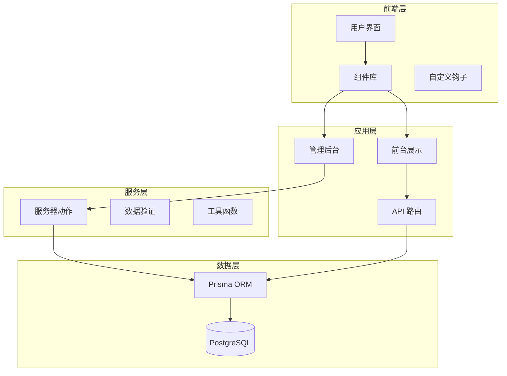
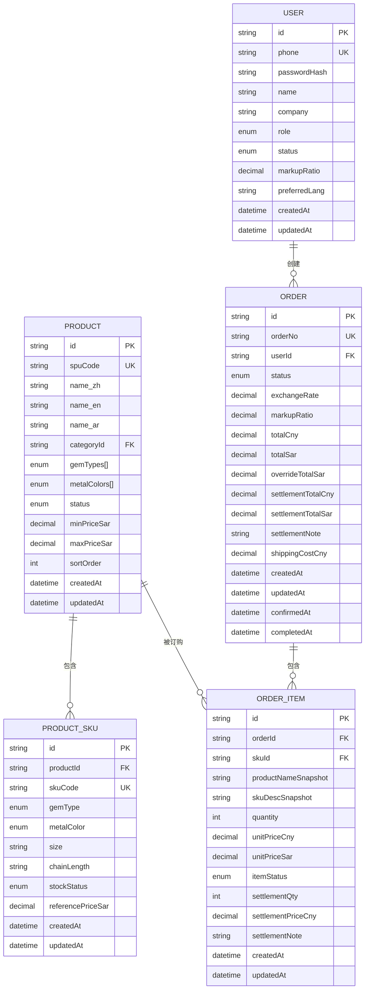
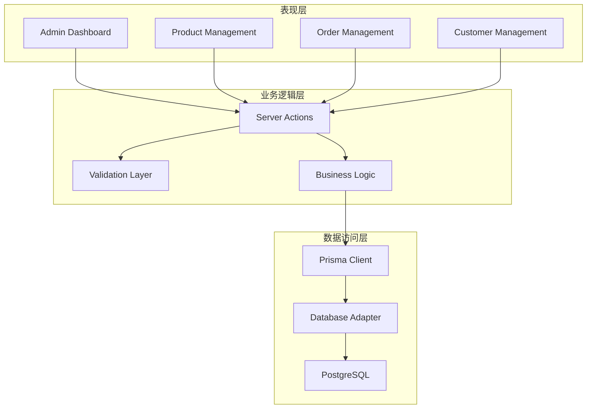
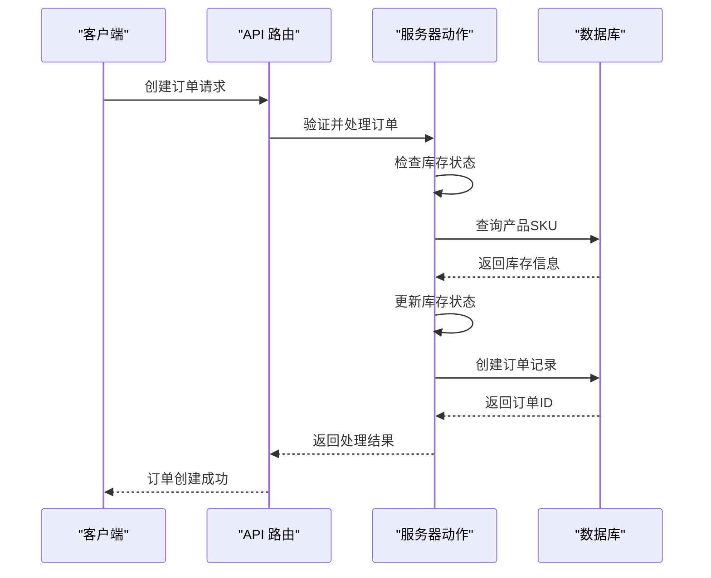
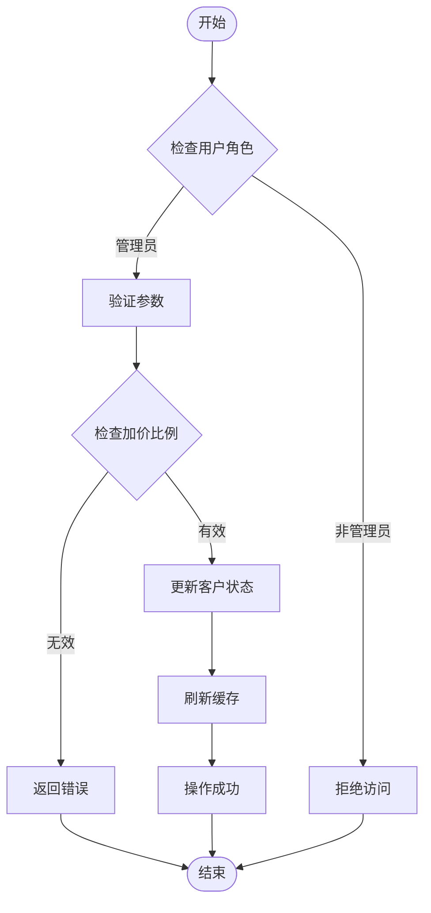
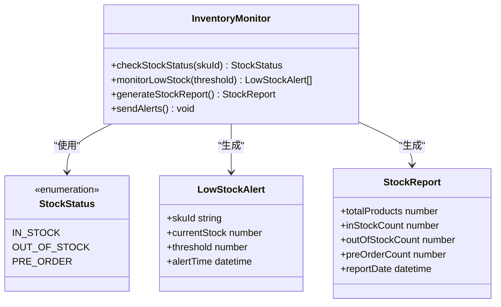
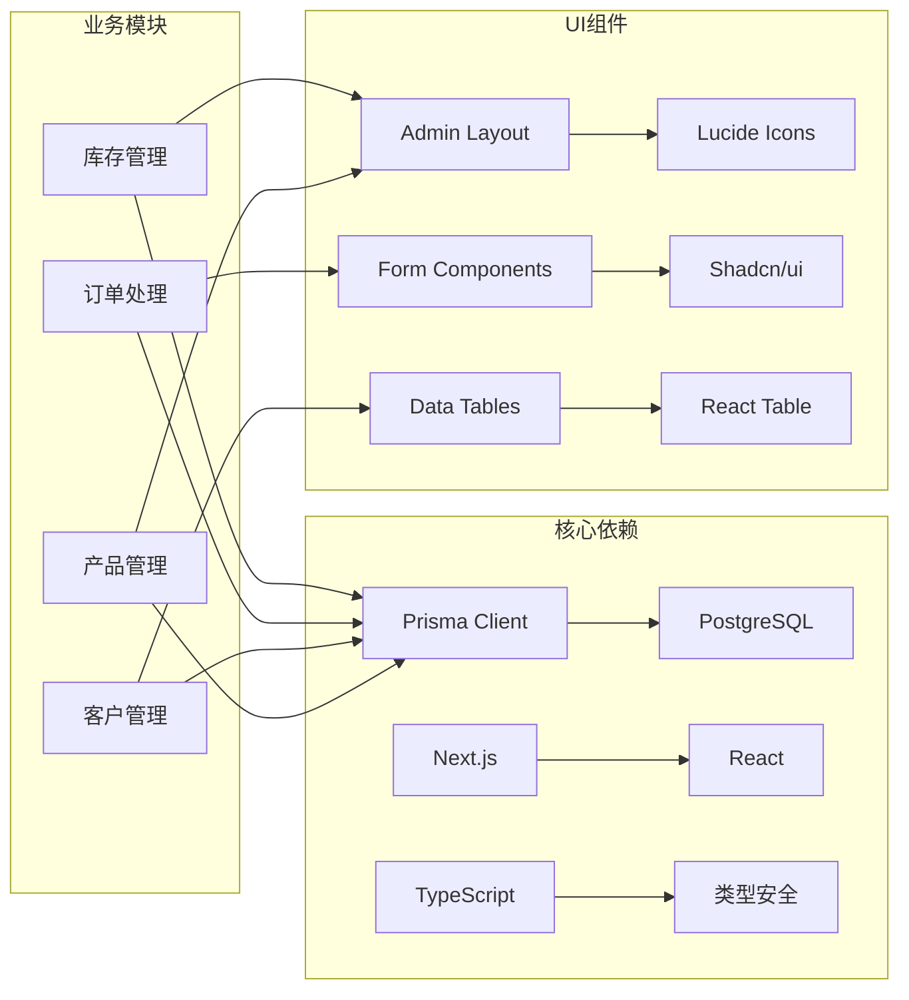

# 库存管理

<cite>
**本文引用的文件**
- [README.md](file://README.md)
- [schema.prisma](file://prisma/schema.prisma)
- [db.ts](file://src/lib/db.ts)
- [index.ts](file://src/types/index.ts)
- [admin-layout.tsx](file://src/components/admin/admin-layout.tsx)
- [admin-dashboard.tsx](file://src/app/admin/page.tsx)
- [customer-list.tsx](file://src/app/admin/customers/page.tsx)
- [approve-customer-dialog.tsx](file://src/components/admin/approve-customer-dialog.tsx)
- [update-markup-dialog.tsx](file://src/components/admin/update-markup-dialog.tsx)
- [customer-actions.ts](file://src/lib/actions/customer.ts)
- [auth-actions.ts](file://src/lib/actions/auth.ts)
- [login-route.ts](file://src/app/api/auth/login/route.ts)
- [order-validations.ts](file://src/lib/validations/order.ts)
- [constants.ts](file://src/lib/constants.ts)
</cite>

## 目录
1. [简介](#简介)
2. [项目结构](#项目结构)
3. [核心组件](#核心组件)
4. [架构概览](#架构概览)
5. [详细组件分析](#详细组件分析)
6. [依赖关系分析](#依赖关系分析)
7. [性能考虑](#性能考虑)
8. [故障排除指南](#故障排除指南)
9. [结论](#结论)
10. [附录](#附录)

## 简介

这是一个基于 Next.js 的库存管理系统，专注于珠宝首饰行业的库存管理需求。系统采用现代化的技术栈，包括 TypeScript、Prisma ORM 和 PostgreSQL 数据库，为珠宝品牌提供完整的库存管理解决方案。

系统的核心功能围绕库存管理展开，包括实时库存更新、库存数量控制、缺货状态监控和库存预警系统。同时支持库存变动记录、批次管理、多仓库库存分配和库存盘点流程。

## 项目结构

该项目采用基于功能模块的组织方式，主要分为以下几个层次：

**图表来源**
- [admin-layout.tsx:1-48](file://src/components/admin/admin-layout.tsx#L1-L48)
- [db.ts:1-18](file://src/lib/db.ts#L1-L18)

**章节来源**
- [README.md:1-37](file://README.md#L1-L37)
- [admin-layout.tsx:1-48](file://src/components/admin/admin-layout.tsx#L1-L48)

## 核心组件

### 数据模型设计

系统采用基于 Prisma 的数据模型设计，重点关注珠宝行业的特殊需求：

**图表来源**
- [schema.prisma:122-247](file://prisma/schema.prisma#L122-L247)

### 库存状态管理

系统实现了完整的库存状态管理体系，支持多种库存状态：

| 库存状态 | 描述 | 用途 |
|---------|------|------|
| IN_STOCK | 有货 | 商品可正常销售 |
| OUT_OF_STOCK | 缺货 | 商品暂时无法购买 |
| PRE_ORDER | 预订 | 商品需要预订生产 |

**章节来源**
- [schema.prisma:31-35](file://prisma/schema.prisma#L31-L35)
- [schema.prisma](file://prisma/schema.prisma#L160)

## 架构概览

系统采用分层架构设计，确保职责分离和可维护性：

**图表来源**
- [admin-dashboard.tsx:1-34](file://src/app/admin/page.tsx#L1-L34)
- [customer-actions.ts:1-239](file://src/lib/actions/customer.ts#L1-L239)
- [db.ts:1-18](file://src/lib/db.ts#L1-L18)

## 详细组件分析

### 订单处理流程

系统实现了完整的订单处理流程，从创建到完成的全过程管理：

**图表来源**
- [login-route.ts:13-75](file://src/app/api/auth/login/route.ts#L13-L75)
- [order-validations.ts:1-22](file://src/lib/validations/order.ts#L1-L22)

### 客户管理与加价策略

系统支持灵活的客户管理功能，特别是针对不同客户的个性化定价策略：

**图表来源**
- [customer-actions.ts:129-183](file://src/lib/actions/customer.ts#L129-L183)
- [approve-customer-dialog.tsx:118-146](file://src/components/admin/approve-customer-dialog.tsx#L118-L146)

**章节来源**
- [customer-actions.ts:1-239](file://src/lib/actions/customer.ts#L1-L239)
- [approve-customer-dialog.tsx:1-146](file://src/components/admin/approve-customer-dialog.tsx#L1-L146)
- [update-markup-dialog.tsx:1-52](file://src/components/admin/update-markup-dialog.tsx#L1-L52)

### 库存状态监控

系统提供了实时的库存状态监控功能，支持多种监控维度：

**图表来源**
- [schema.prisma:31-35](file://prisma/schema.prisma#L31-L35)
- [schema.prisma](file://prisma/schema.prisma#L160)

### 多仓库库存管理

系统支持多仓库库存分配，通过以下机制实现：

1. **仓库维度**：每个产品SKU可以关联到多个仓库
2. **库存分配**：根据仓库位置和需求进行智能分配
3. **统一视图**：提供全局库存概览和各仓库详情

**章节来源**
- [schema.prisma:152-170](file://prisma/schema.prisma#L152-L170)

## 依赖关系分析

系统采用模块化设计，各组件之间的依赖关系清晰明确：

**图表来源**
- [db.ts:1-18](file://src/lib/db.ts#L1-L18)
- [admin-layout.tsx:1-48](file://src/components/admin/admin-layout.tsx#L1-L48)

**章节来源**
- [index.ts:1-60](file://src/types/index.ts#L1-L60)
- [constants.ts:1-22](file://src/lib/constants.ts#L1-L22)

## 性能考虑

### 数据库优化策略

1. **索引优化**：为常用查询字段建立索引
   - 用户表：phone 字段唯一索引
   - 产品表：categoryId 和 status 字段索引
   - 订单表：userId 和 status 字段索引

2. **查询优化**：使用分页和游标分页减少数据传输
3. **连接池管理**：合理配置数据库连接池大小

### 缓存策略

1. **服务器端缓存**：使用 Next.js 的 revalidatePath 实现智能缓存刷新
2. **静态生成**：对不经常变化的数据使用静态生成
3. **CDN 集成**：利用 Next.js 的内置 CDN 支持

### API 性能优化

1. **批量操作**：支持批量更新和查询操作
2. **数据验证**：在 API 层进行严格的数据验证
3. **错误处理**：统一的错误处理和响应格式

## 故障排除指南

### 常见问题及解决方案

#### 1. 库存同步问题
**症状**：库存显示与实际不符
**解决方案**：
- 检查订单状态更新流程
- 验证库存扣减逻辑
- 确认并发访问控制

#### 2. 数据库连接问题
**症状**：应用启动时报数据库连接错误
**解决方案**：
- 检查 DATABASE_URL 环境变量
- 验证数据库服务状态
- 确认网络连接和防火墙设置

#### 3. 权限访问问题
**症状**：管理员功能无法正常使用
**解决方案**：
- 验证用户角色和权限
- 检查 JWT 令牌有效性
- 确认会话状态管理

**章节来源**
- [auth-actions.ts:1-21](file://src/lib/actions/auth.ts#L1-L21)
- [login-route.ts:13-75](file://src/app/api/auth/login/route.ts#L13-L75)

## 结论

这个库存管理系统为珠宝行业提供了全面的库存管理解决方案。系统采用现代化的技术架构，具有良好的扩展性和维护性。

### 主要优势

1. **完整的库存管理**：支持实时库存更新、状态监控和预警机制
2. **灵活的定价策略**：针对不同客户实施个性化定价
3. **多仓库支持**：满足复杂的库存分配需求
4. **现代化技术栈**：基于 Next.js 和 Prisma 的高效开发体验

### 发展建议

1. **增强库存预警**：实现更智能的库存预测算法
2. **扩展报表功能**：增加更多维度的库存分析报表
3. **移动端支持**：开发移动应用以支持现场库存管理
4. **集成供应链**：与供应商系统集成实现自动化补货

## 附录

### API 接口规范

系统提供 RESTful API 接口，支持标准的 CRUD 操作和业务特定的功能接口。

### 数据模型说明

所有数据模型都经过精心设计，确保满足珠宝行业的特殊需求，包括宝石类型、金属颜色等专业术语的处理。

### 安全考虑

系统实现了多层次的安全防护，包括用户认证、授权控制、数据验证和输入过滤等安全措施。