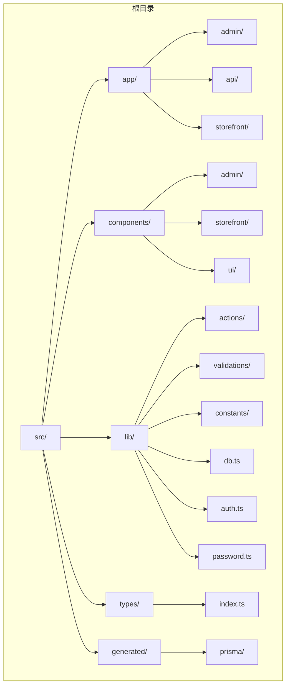
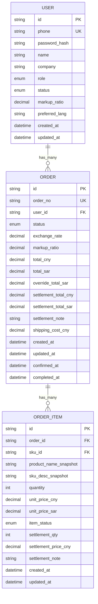
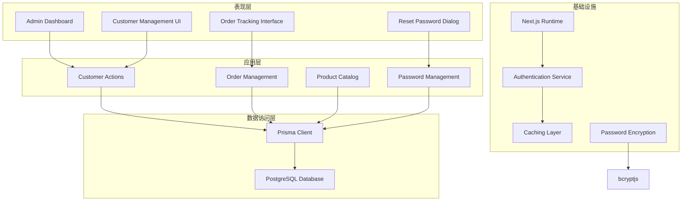
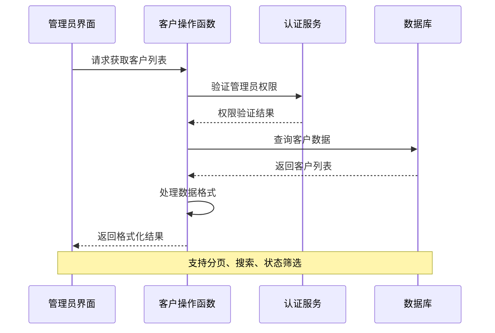
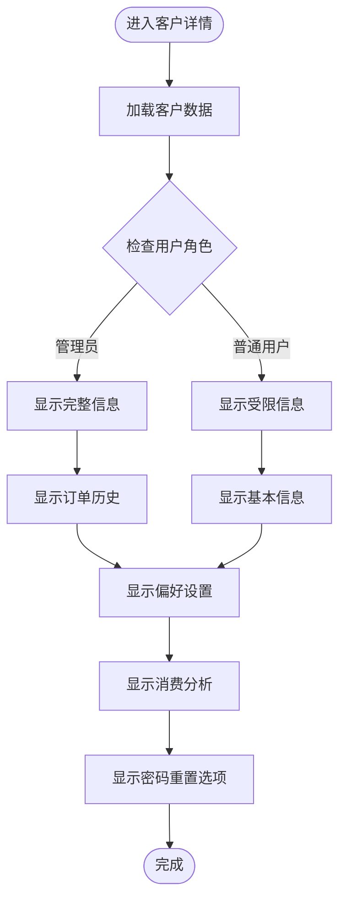
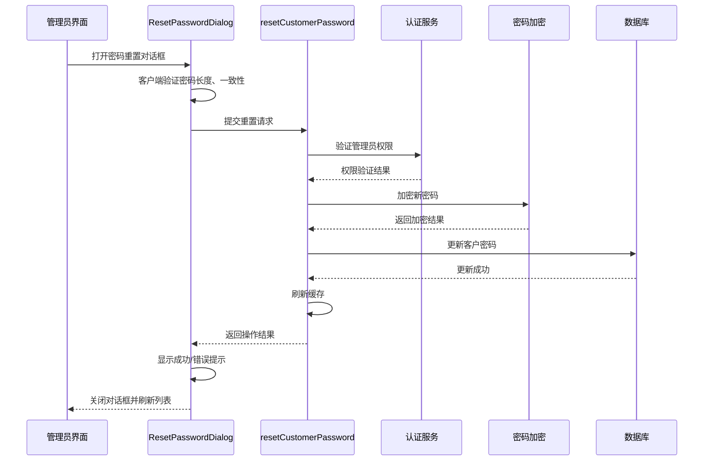
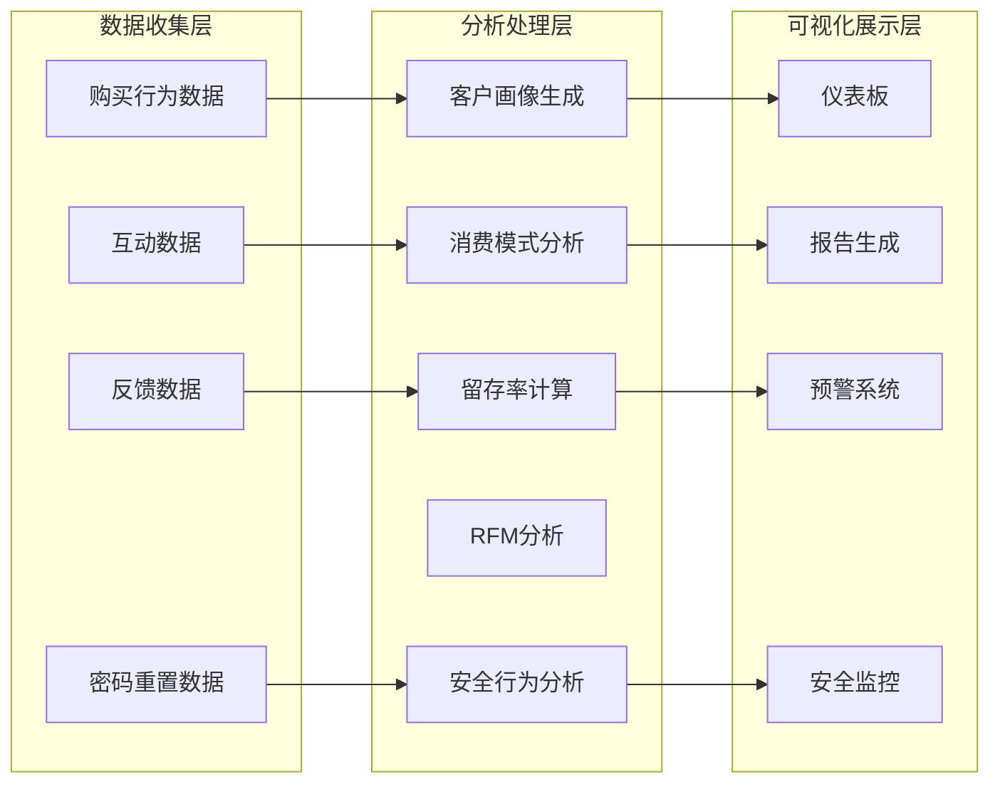
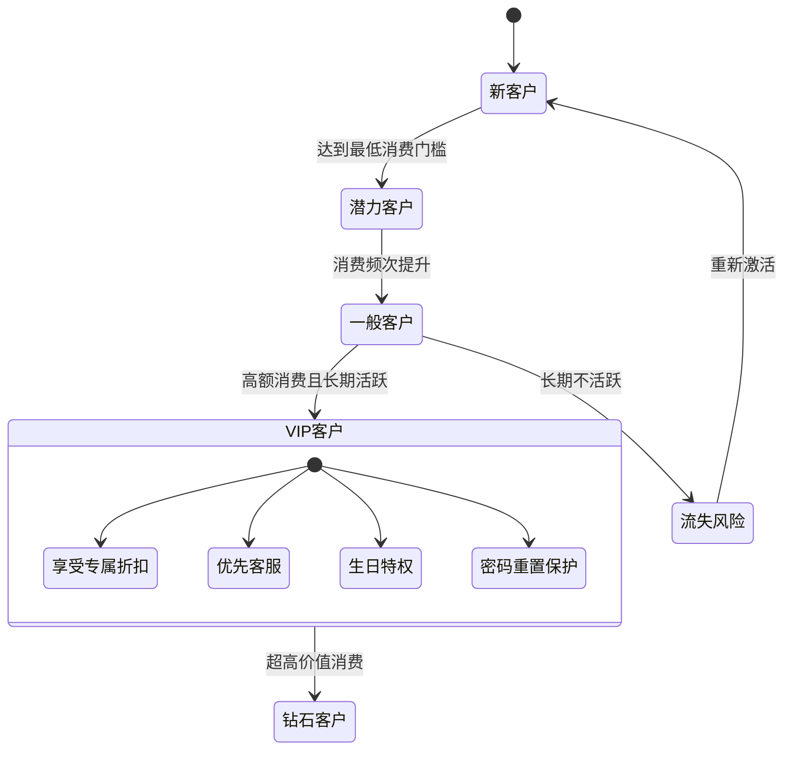
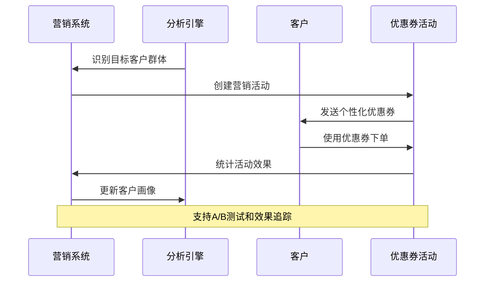
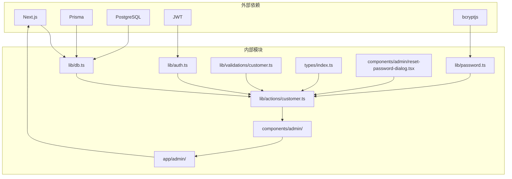

# 客户管理系统

<cite>
**本文档引用的文件**
- [README.md](file://README.md)
- [schema.prisma](file://prisma/schema.prisma)
- [db.ts](file://src/lib/db.ts)
- [index.ts](file://src/types/index.ts)
- [customer.ts](file://src/lib/actions/customer.ts)
- [reset-password-dialog.tsx](file://src/components/admin/reset-password-dialog.tsx)
- [admin-layout.tsx](file://src/components/admin/admin-layout.tsx)
- [page.tsx](file://src/app/admin/page.tsx)
- [page.tsx](file://src/app/admin/customers/page.tsx)
- [approve-customer-dialog.tsx](file://src/components/admin/approve-customer-dialog.tsx)
- [auth.ts](file://src/lib/auth.ts)
- [constants.ts](file://src/lib/constants.ts)
- [product.ts](file://src/lib/validations/product.ts)
- [password.ts](file://src/lib/password.ts)
- [customer.ts](file://src/lib/validations/customer.ts)
</cite>

## 更新摘要
**变更内容**
- 新增管理员密码重置功能模块
- 添加ResetPasswordDialog组件详细说明
- 更新客户管理功能以包含密码重置操作
- 增强安全验证和错误处理机制
- 完善缓存刷新和权限控制流程

## 目录
1. [简介](#简介)
2. [项目结构](#项目结构)
3. [核心组件](#核心组件)
4. [架构概览](#架构概览)
5. [详细组件分析](#详细组件分析)
6. [依赖关系分析](#依赖关系分析)
7. [性能考虑](#性能考虑)
8. [故障排除指南](#故障排除指南)
9. [结论](#结论)
10. [附录](#附录)

## 简介

Celestia客户管理系统是一个基于Next.js构建的企业级珠宝零售客户管理平台。该系统专注于为珠宝品牌提供完整的客户生命周期管理解决方案，包括客户信息维护、订单跟踪、支付处理和数据分析等功能。

系统采用现代化的技术栈，结合Prisma ORM提供强大的数据持久化能力，支持多语言国际化，并具备完善的安全机制和权限控制体系。特别针对珠宝行业的特殊需求，系统内置了专业的珠宝产品管理功能，包括钻石、锆石等宝石类型管理和金属材质分类。

**更新** 新增管理员密码重置功能，支持管理员直接重置客户登录密码，提供完整的客户端验证、确认对话框、错误处理和缓存刷新机制。

## 项目结构

该项目采用基于功能模块的组织方式，主要目录结构如下：



**图表来源**
- [README.md:1-37](file://README.md#L1-L37)
- [schema.prisma:1-281](file://prisma/schema.prisma#L1-L281)

**章节来源**
- [README.md:1-37](file://README.md#L1-L37)

## 核心组件

### 数据模型设计

系统采用Prisma Schema定义了完整的数据模型，涵盖用户管理、产品管理、订单处理等核心业务领域：



**图表来源**
- [schema.prisma:89-281](file://prisma/schema.prisma#L89-L281)

### 客户管理核心功能

系统提供了完整的客户管理功能，包括：

- **客户信息管理**：支持客户基本信息维护、状态管理
- **订单历史追踪**：完整的购买记录和订单状态跟踪
- **个性化定价**：基于客户等级的差异化定价策略
- **活跃度统计**：客户购买频率和消费能力分析
- **密码重置管理**：管理员可直接重置客户登录密码

**更新** 新增密码重置功能，支持管理员对客户账户进行密码重置操作，包含完整的安全验证和错误处理机制。

**章节来源**
- [schema.prisma:89-106](file://prisma/schema.prisma#L89-L106)
- [customer.ts:24-126](file://src/lib/actions/customer.ts#L24-L126)
- [reset-password-dialog.tsx:1-156](file://src/components/admin/reset-password-dialog.tsx#L1-L156)

## 架构概览

系统采用分层架构设计，确保各层职责清晰、耦合度低：



**图表来源**
- [db.ts:1-18](file://src/lib/db.ts#L1-L18)
- [customer.ts:1-302](file://src/lib/actions/customer.ts#L1-L302)
- [password.ts:1-18](file://src/lib/password.ts#L1-L18)

### 技术栈特性

系统采用以下核心技术栈：

- **前端框架**：Next.js App Router，提供SSR和静态生成能力
- **数据库ORM**：Prisma，提供类型安全的数据访问
- **认证机制**：JWT Token + Cookie，支持会话管理和权限控制
- **样式系统**：Tailwind CSS，提供响应式设计支持
- **国际化**：多语言支持，涵盖英语、阿拉伯语、中文
- **密码加密**：bcryptjs，提供安全的密码哈希和验证

**更新** 新增密码加密模块，使用bcryptjs提供安全的密码哈希功能。

**章节来源**
- [auth.ts:1-98](file://src/lib/auth.ts#L1-L98)
- [constants.ts:40-46](file://src/lib/constants.ts#L40-L46)
- [password.ts:1-18](file://src/lib/password.ts#L1-L18)

## 详细组件分析

### 客户列表管理组件

客户列表管理是系统的核心功能之一，提供了完整的客户信息展示和管理能力：



**图表来源**
- [customer.ts:24-126](file://src/lib/actions/customer.ts#L24-L126)
- [auth.ts:57-97](file://src/lib/auth.ts#L57-L97)

#### 功能特性

- **分页查询**：支持大数据量的高效分页加载
- **多维度筛选**：支持按状态、姓名、手机号等条件筛选
- **实时统计**：显示每个客户的订单数量等关键指标
- **批量操作**：支持客户审核和价格策略调整
- **密码重置操作**：管理员可直接重置客户登录密码

**更新** 新增密码重置操作按钮，支持管理员对选中的客户进行密码重置。

**章节来源**
- [customer.ts:24-126](file://src/lib/actions/customer.ts#L24-L126)
- [page.tsx:183-241](file://src/app/admin/customers/page.tsx#L183-L241)
- [page.tsx:239-265](file://src/app/admin/customers/page.tsx#L239-L265)

### 客户详情管理组件

客户详情管理提供了深入的客户信息分析和个性化设置功能：



**图表来源**
- [customer.ts:128-239](file://src/lib/actions/customer.ts#L128-L239)
- [schema.prisma:89-106](file://prisma/schema.prisma#L89-L106)

#### 核心功能模块

- **基本信息维护**：客户联系方式、公司信息等基础资料
- **订单历史追踪**：完整的购买记录和订单状态变化
- **消费记录分析**：基于历史订单的消费行为模式识别
- **偏好设置管理**：语言偏好、价格敏感度等个性化配置
- **密码重置管理**：管理员可直接重置客户登录密码

**更新** 新增密码重置管理功能，提供安全的密码重置操作界面。

**章节来源**
- [customer.ts:128-239](file://src/lib/actions/customer.ts#L128-L239)
- [approve-customer-dialog.tsx:118-146](file://src/components/admin/approve-customer-dialog.tsx#L118-L146)

### 管理员密码重置功能

**新增** 系统新增了管理员密码重置功能，允许管理员直接重置客户的登录密码。该功能包含完整的客户端验证、确认对话框、错误处理和缓存刷新机制。



**图表来源**
- [reset-password-dialog.tsx:44-77](file://src/components/admin/reset-password-dialog.tsx#L44-L77)
- [customer.ts:242-301](file://src/lib/actions/customer.ts#L242-L301)
- [password.ts:8-10](file://src/lib/password.ts#L8-L10)

#### 功能特性

- **客户端验证**：实时验证密码长度（至少6位）和密码一致性
- **确认对话框**：提供明确的操作确认界面
- **错误处理**：完整的错误捕获和用户友好的错误提示
- **缓存刷新**：操作成功后自动刷新客户列表缓存
- **权限控制**：仅管理员可执行密码重置操作

**章节来源**
- [reset-password-dialog.tsx:1-156](file://src/components/admin/reset-password-dialog.tsx#L1-L156)
- [customer.ts:242-301](file://src/lib/actions/customer.ts#L242-L301)
- [customer.ts:15-19](file://src/lib/validations/customer.ts#L15-L19)

### 客户统计分析组件

系统提供了多层次的客户分析功能，帮助管理者深入了解客户价值和行为模式：



**图表来源**
- [constants.ts:1-46](file://src/lib/constants.ts#L1-L46)
- [customer.ts:24-126](file://src/lib/actions/customer.ts#L24-L126)

#### 统计指标体系

- **客户画像**：基于购买频次、客单价、品类偏好等维度
- **消费行为分析**：购买时间规律、价格敏感度、品牌忠诚度
- **留存率统计**：基于时间维度的客户保留情况分析
- **RFM模型**：最近购买时间、购买频率、消费金额的综合评估
- **安全行为分析**：密码重置频率、安全事件监控

**更新** 新增安全行为分析，监控密码重置等安全相关操作。

**章节来源**
- [constants.ts:1-46](file://src/lib/constants.ts#L1-L46)
- [customer.ts:24-126](file://src/lib/actions/customer.ts#L24-L126)

### 客户等级管理与积分系统

系统实现了灵活的客户等级管理体系，支持基于消费金额和频次的动态升级：



**图表来源**
- [customer.ts:128-239](file://src/lib/actions/customer.ts#L128-L239)
- [schema.prisma:16-24](file://prisma/schema.prisma#L16-L24)

#### 积分系统设计

- **积分规则**：按消费金额的固定比例计算
- **使用场景**：抵扣现金、兑换礼品、升级会员等级
- **有效期管理**：支持积分过期提醒和自动清理
- **异常处理**：退款时的积分回收机制
- **安全保护**：密码重置后的安全保护机制

**更新** 新增安全保护机制，密码重置后提供额外的安全保护措施。

**章节来源**
- [customer.ts:128-239](file://src/lib/actions/customer.ts#L128-L239)

### 优惠券发放与营销自动化

系统集成了智能的营销自动化功能，支持精准的客户触达和促销活动：



**图表来源**
- [constants.ts:37-38](file://src/lib/constants.ts#L37-L38)
- [customer.ts:24-126](file://src/lib/actions/customer.ts#L24-L126)

#### 营销功能特性

- **智能推荐**：基于客户偏好的产品推荐
- **时机营销**：根据购买周期和节日节点的促销
- **个性化内容**：多语言、多币种的定制化营销内容
- **效果追踪**：完整的营销ROI分析和优化

**章节来源**
- [constants.ts:37-38](file://src/lib/constants.ts#L37-L38)
- [customer.ts:24-126](file://src/lib/actions/customer.ts#L24-L126)

## 依赖关系分析

系统各组件之间的依赖关系体现了清晰的分层架构：



**图表来源**
- [db.ts:1-18](file://src/lib/db.ts#L1-L18)
- [auth.ts:1-98](file://src/lib/auth.ts#L1-L98)
- [customer.ts:1-302](file://src/lib/actions/customer.ts#L1-L302)
- [password.ts:1-18](file://src/lib/password.ts#L1-L18)

### 核心依赖特性

- **数据库连接池**：使用PrismaPg适配器优化数据库连接
- **认证中间件**：统一的JWT验证和权限检查机制
- **类型安全**：完整的TypeScript类型定义确保开发安全性
- **密码加密**：bcryptjs提供安全的密码哈希和验证
- **模块化设计**：清晰的模块边界便于维护和扩展

**更新** 新增密码加密依赖，bcryptjs提供安全的密码处理能力。

**章节来源**
- [db.ts:1-18](file://src/lib/db.ts#L1-L18)
- [auth.ts:1-98](file://src/lib/auth.ts#L1-L98)
- [password.ts:1-18](file://src/lib/password.ts#L1-L18)

## 性能考虑

### 数据库优化策略

系统采用了多项数据库性能优化措施：

- **索引优化**：为常用查询字段建立复合索引
- **查询优化**：使用select投影减少数据传输
- **连接池管理**：合理配置连接池大小避免资源浪费
- **分页查询**：大数据量场景下的游标分页实现
- **缓存策略**：密码重置后的客户列表缓存刷新

**更新** 新增缓存策略，密码重置操作后自动刷新相关缓存。

### 缓存策略

```mermaid
graph LR
A[数据库] <- --> B[查询缓存]
B <- --> C[页面缓存]
C <- --> D[浏览器缓存]
E[API请求] --> F[缓存命中]
F --> G[快速响应]
G --> H[用户体验提升]
I[数据变更] --> J[缓存失效]
J --> K[重新查询]
K --> L[更新缓存]
M[密码重置] --> N[刷新客户列表缓存]
```

**图表来源**
- [customer.ts:170](file://src/lib/actions/customer.ts#L170)
- [customer.ts:225](file://src/lib/actions/customer.ts#L225)
- [customer.ts:288](file://src/lib/actions/customer.ts#L288)

### 性能监控

- **慢查询监控**：开发环境下的查询日志记录
- **内存使用监控**：连接池和对象池的使用情况
- **响应时间监控**：关键API的性能指标跟踪
- **错误率监控**：数据库连接和查询失败的统计
- **密码操作监控**：密码重置操作的性能和成功率监控

**更新** 新增密码操作监控，跟踪密码重置功能的性能表现。

## 故障排除指南

### 常见问题诊断

#### 数据库连接问题

**症状**：应用启动时报数据库连接错误
**排查步骤**：
1. 检查DATABASE_URL环境变量配置
2. 验证数据库服务状态
3. 确认网络连接和防火墙设置
4. 查看连接池配置是否合理

#### 认证失败问题

**症状**：管理员无法登录或权限验证失败
**排查步骤**：
1. 检查JWT密钥配置
2. 验证Cookie设置和域名配置
3. 确认用户状态和角色信息
4. 查看Token过期时间和刷新机制

#### 密码重置问题

**症状**：管理员无法重置客户密码
**排查步骤**：
1. 检查管理员权限验证
2. 验证密码长度和格式要求
3. 确认目标用户为CUSTOMER角色
4. 查看密码加密过程是否正常
5. 检查缓存刷新机制

#### 性能问题

**症状**：客户列表加载缓慢或API响应超时
**排查步骤**：
1. 分析慢查询日志
2. 检查数据库索引完整性
3. 优化查询条件和分页参数
4. 调整缓存策略和连接池配置

**更新** 新增密码重置问题排查步骤。

**章节来源**
- [db.ts:12-15](file://src/lib/db.ts#L12-L15)
- [auth.ts:57-97](file://src/lib/auth.ts#L57-L97)
- [reset-password-dialog.tsx:47-56](file://src/components/admin/reset-password-dialog.tsx#L47-L56)

### 错误处理机制

系统实现了完善的错误处理和恢复机制：

- **数据库错误**：连接失败时的重试机制和降级策略
- **认证错误**：Token过期时的自动刷新和用户引导
- **业务逻辑错误**：详细的错误信息和用户友好的提示
- **系统异常**：全局异常捕获和日志记录
- **密码操作错误**：密码重置过程中的完整错误处理

**更新** 新增密码操作错误处理机制。

## 结论

Celestia客户管理系统是一个功能完整、架构清晰的企业级应用。系统通过合理的分层设计、完善的权限控制和丰富的业务功能，为企业提供了高效的客户管理解决方案。

**更新** 最新版本新增了管理员密码重置功能，进一步增强了系统的安全性和易用性。该功能提供了完整的客户端验证、确认对话框、错误处理和缓存刷新机制，确保管理员可以安全、便捷地重置客户的登录密码。

### 主要优势

- **技术先进性**：采用最新的Next.js技术和现代化开发工具链
- **业务完整性**：覆盖客户管理的全生命周期业务流程
- **扩展性强**：模块化的架构设计便于功能扩展和维护
- **安全性保障**：完善的认证授权和数据保护机制
- **易用性提升**：新增密码重置功能简化了客户管理操作

### 发展建议

- **功能扩展**：可考虑集成更多营销自动化功能
- **性能优化**：进一步优化大数据量场景下的查询性能
- **监控完善**：增强系统的可观测性和告警机制
- **移动端支持**：开发移动端应用提升用户体验
- **安全增强**：考虑添加密码重置操作的日志审计功能

## 附录

### API接口规范

系统遵循RESTful API设计原则，提供标准化的接口规范：

- **响应格式**：统一的JSON响应结构，包含success、data、error字段
- **分页机制**：支持游标分页和传统分页两种方式
- **错误处理**：标准化的错误码和错误消息格式
- **版本控制**：API版本管理确保向后兼容性
- **密码重置接口**：新增密码重置API，支持管理员重置客户密码

**更新** 新增密码重置接口规范。

### 安全最佳实践

- **数据加密**：敏感数据的存储加密和传输加密
- **输入验证**：严格的输入参数验证和过滤
- **权限控制**：基于角色的细粒度权限管理
- **审计日志**：完整的操作日志记录和追踪
- **密码安全**：bcryptjs加密，防止密码泄露
- **操作审计**：密码重置操作的完整审计记录

**更新** 新增密码安全和操作审计最佳实践。

### 部署指南

- **环境配置**：生产环境的环境变量配置要点
- **数据库迁移**：Prisma Schema变更的部署流程
- **缓存配置**：Redis缓存的部署和配置建议
- **监控设置**：APM工具和日志系统的集成方案
- **密码加密配置**：bcryptjs的部署和配置建议

**更新** 新增密码加密配置指南。