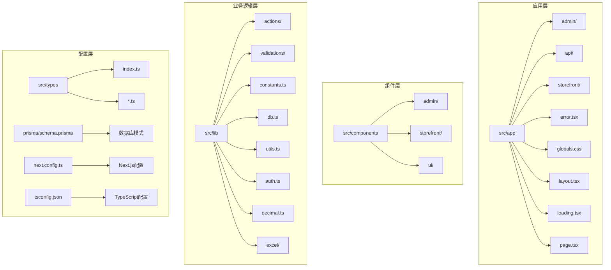
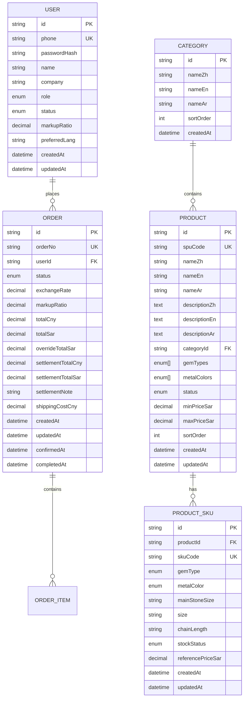
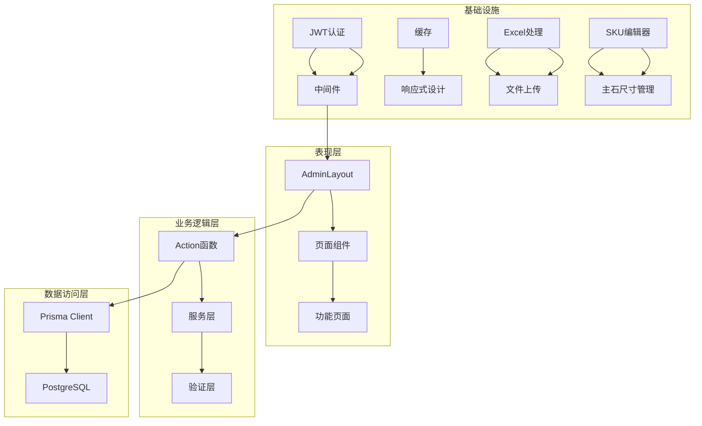
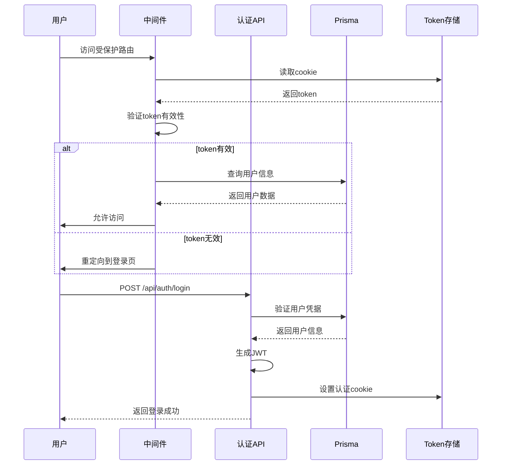
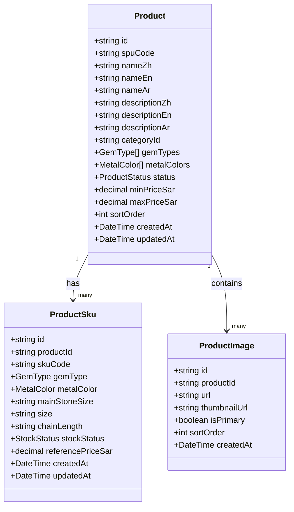
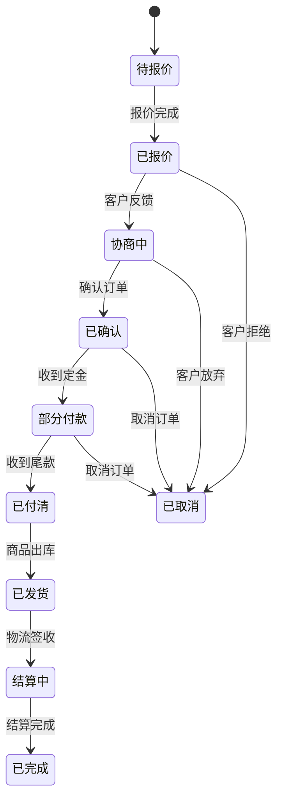
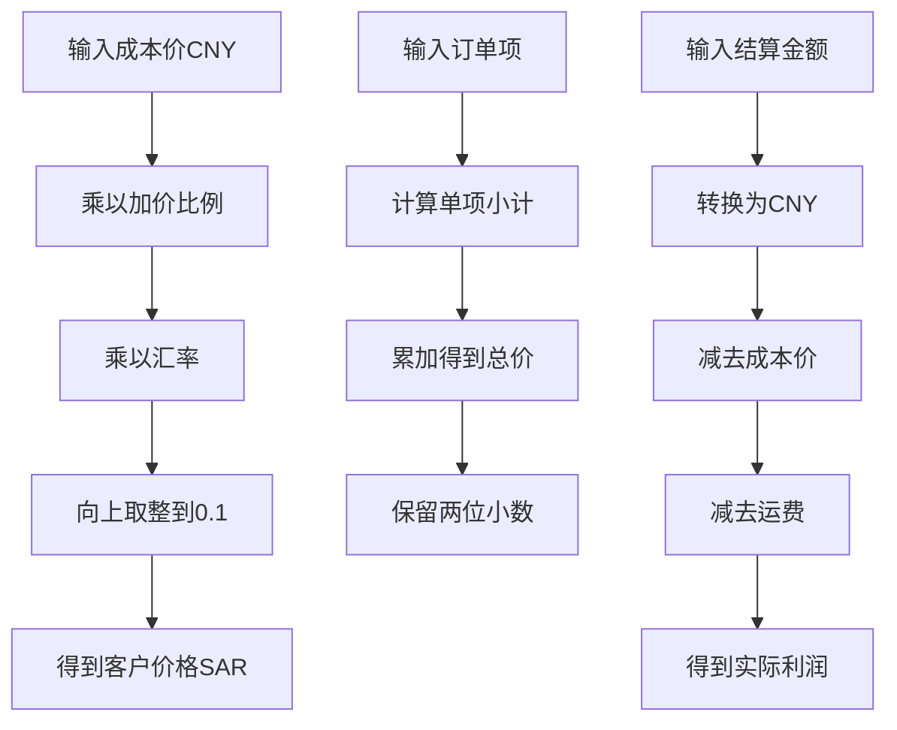
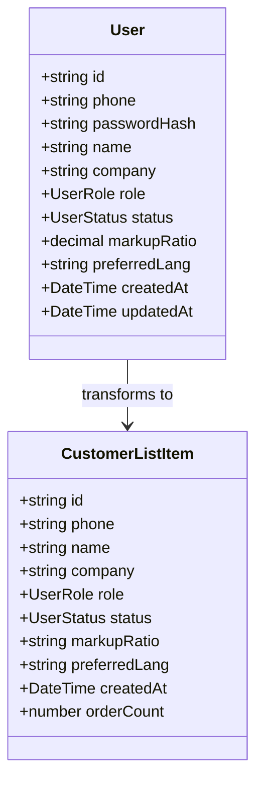
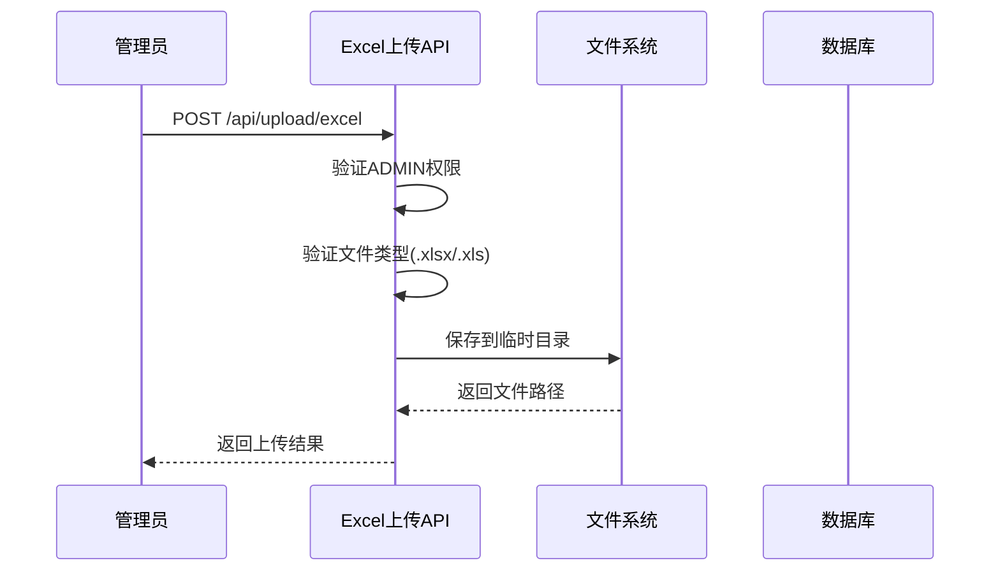
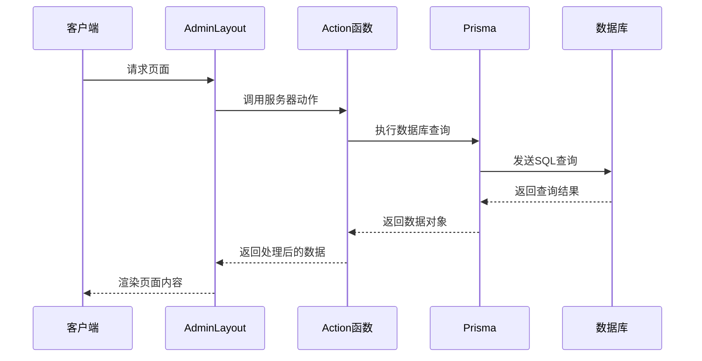

# 管理后台系统

<cite>
**本文档引用的文件**
- [src/components/admin/admin-layout.tsx](file://src/components/admin/admin-layout.tsx)
- [src/app/admin/layout.tsx](file://src/app/admin/layout.tsx)
- [src/app/admin/page.tsx](file://src/app/admin/page.tsx)
- [src/lib/constants.ts](file://src/lib/constants.ts)
- [src/types/index.ts](file://src/types/index.ts)
- [src/lib/db.ts](file://src/lib/db.ts)
- [src/lib/utils.ts](file://src/lib/utils.ts)
- [prisma/schema.prisma](file://prisma/schema.prisma)
- [src/middleware.ts](file://src/middleware.ts)
- [src/lib/auth.ts](file://src/lib/auth.ts)
- [src/app/api/auth/login/route.ts](file://src/app/api/auth/login/route.ts)
- [src/app/api/auth/logout/route.ts](file://src/app/api/auth/logout/route.ts)
- [src/lib/actions/customer.ts](file://src/lib/actions/customer.ts)
- [src/components/ui/button.tsx](file://src/components/ui/button.tsx)
- [src/lib/decimal.ts](file://src/lib/decimal.ts)
- [package.json](file://package.json)
- [src/app/api/upload/excel/route.ts](file://src/app/api/upload/excel/route.ts)
- [src/app/admin/products/page.tsx](file://src/app/admin/products/page.tsx)
- [src/app/admin/orders/page.tsx](file://src/app/admin/orders/page.tsx)
- [src/app/admin/customers/page.tsx](file://src/app/admin/customers/page.tsx)
- [src/components/admin/sku-editor.tsx](file://src/components/admin/sku-editor.tsx)
- [src/app/admin/products/[id]/edit/page.tsx](file://src/app/admin/products/[id]/edit/page.tsx)
- [src/lib/actions/product.ts](file://src/lib/actions/product.ts)
- [src/lib/excel/sku-expander.ts](file://src/lib/excel/sku-expander.ts)
- [src/lib/excel/parser.ts](file://src/lib/excel/parser.ts)
- [scripts/generate-import-template.ts](file://scripts/generate-import-template.ts)
</cite>

## 更新摘要
**所做更改**
- 更新了管理布局组件的导航结构，移除了settings导航项
- 更新了导航模块表格，反映了简化的管理员界面
- 更新了系统设置功能章节，移除了相关的配置说明
- 更新了Excel导入导出功能章节，反映了主石尺寸管理的增强

## 目录
1. [简介](#简介)
2. [项目结构](#项目结构)
3. [核心组件](#核心组件)
4. [架构概览](#架构概览)
5. [详细组件分析](#详细组件分析)
6. [Excel导入导出功能](#excel导入导出功能)
7. [依赖关系分析](#依赖关系分析)
8. [性能考虑](#性能考虑)
9. [故障排除指南](#故障排除指南)
10. [结论](#结论)
11. [附录](#附录)

## 简介

Celestia管理后台系统是一个基于Next.js 16构建的专业珠宝管理平台，专为Celestia珠宝品牌设计。该系统提供了完整的后台管理功能，包括商品管理、订单处理、客户关系管理和系统设置等核心业务模块。

系统采用现代化的技术栈，结合了TypeScript类型安全、Prisma ORM数据持久化、JWT认证机制和响应式UI设计，为企业级珠宝管理提供了强大而灵活的解决方案。

**更新** 管理后台界面已简化，移除了settings导航项，专注于核心业务功能。新增Excel导入导出功能，支持批量商品数据处理和模板下载。**新增主石尺寸信息管理功能**，SKU编辑器支持主石尺寸(mm)的精确管理，提升珠宝商品规格的精细化程度。

## 项目结构

该项目采用基于功能的组织方式，主要分为以下几个核心区域：



**图表来源**
- [src/app/admin/layout.tsx:1-10](file://src/app/admin/layout.tsx#L1-L10)
- [src/components/admin/admin-layout.tsx:1-199](file://src/components/admin/admin-layout.tsx#L1-L199)
- [prisma/schema.prisma:1-316](file://prisma/schema.prisma#L1-L316)

**章节来源**
- [src/app/admin/layout.tsx:1-10](file://src/app/admin/layout.tsx#L1-L10)
- [src/components/admin/admin-layout.tsx:1-199](file://src/components/admin/admin-layout.tsx#L1-L199)
- [prisma/schema.prisma:1-316](file://prisma/schema.prisma#L1-L316)

## 核心组件

### 管理布局组件

AdminLayout组件是整个管理后台的核心布局组件，实现了响应式设计和完整的导航系统。

#### 组件特性

- **响应式设计**：支持桌面端和移动端的自适应布局
- **动态导航**：根据当前路径高亮显示活动菜单项
- **权限控制**：集成JWT认证和角色权限验证
- **主题设计**：采用深色主题配色方案，符合珠宝品牌的高端定位

#### 导航结构

系统提供四个主要功能模块（已移除settings导航项）：

| 模块 | 路径 | 功能描述 |
|------|------|----------|
| 仪表盘 | `/admin` | 系统概览和统计数据展示 |
| 商品管理 | `/admin/products` | 商品列表、编辑、创建和库存管理，支持Excel导入导出 |
| 订单管理 | `/admin/orders` | 订单列表查看、状态更新和详情管理 |
| 客户管理 | `/admin/customers` | 客户列表查看、详情管理和统计分析 |

**更新** 管理后台界面已简化，移除了settings导航项，专注于核心业务功能。导航结构从原来的五个模块精简为四个模块，提升了界面简洁性和操作效率。

**章节来源**
- [src/components/admin/admin-layout.tsx:29-41](file://src/components/admin/admin-layout.tsx#L29-L41)
- [src/components/admin/admin-layout.tsx:67-86](file://src/components/admin/admin-layout.tsx#L67-L86)

### 数据模型架构

系统采用Prisma ORM进行数据持久化，定义了完整的珠宝管理数据模型：



**图表来源**
- [prisma/schema.prisma:85-316](file://prisma/schema.prisma#L85-L316)

**章节来源**
- [prisma/schema.prisma:1-316](file://prisma/schema.prisma#L1-L316)

## 架构概览

系统采用分层架构设计，确保了良好的可维护性和扩展性：



**图表来源**
- [src/components/admin/admin-layout.tsx:43-199](file://src/components/admin/admin-layout.tsx#L43-L199)
- [src/lib/auth.ts:1-98](file://src/lib/auth.ts#L1-L98)
- [src/middleware.ts:1-165](file://src/middleware.ts#L1-L165)

### 认证与授权流程



**图表来源**
- [src/middleware.ts:24-31](file://src/middleware.ts#L24-L31)
- [src/app/api/auth/login/route.ts:13-75](file://src/app/api/auth/login/route.ts#L13-L75)
- [src/lib/auth.ts:38-55](file://src/lib/auth.ts#L38-L55)

**章节来源**
- [src/middleware.ts:1-165](file://src/middleware.ts#L1-L165)
- [src/lib/auth.ts:1-98](file://src/lib/auth.ts#L1-L98)
- [src/app/api/auth/login/route.ts:1-75](file://src/app/api/auth/login/route.ts#L1-L75)

## 详细组件分析

### 商品管理系统

商品管理系统是整个后台的核心功能之一，提供了完整的珠宝商品生命周期管理。

#### 数据模型设计

商品系统采用SPU+SKU的两级产品模型：

- **SPU（Standard Product Unit）**：标准商品单元，代表商品的基本信息和属性
- **SKU（Stock Keeping Unit）**：库存单位，代表具体可销售的商品规格



**图表来源**
- [prisma/schema.prisma:120-188](file://prisma/schema.prisma#L120-L188)

#### 商品管理功能

系统支持以下商品管理功能：

1. **商品列表管理**：支持按分类、宝石类型、金属颜色、关键词等多维度筛选
2. **商品编辑创建**：提供完整的商品信息编辑界面，支持多语言内容管理
3. **库存管理**：实时跟踪SKU级别的库存状态和价格信息
4. **图片管理**：支持商品图片的上传、排序和主图设置
5. **Excel导入导出**：支持批量商品数据的导入和模板下载

**更新** **主石尺寸信息管理**：SKU编辑器新增主石尺寸(mm)字段，支持精确的宝石规格管理，特别适用于戒指类商品的主石尺寸标注。

**章节来源**
- [prisma/schema.prisma:120-188](file://prisma/schema.prisma#L120-L188)
- [src/lib/constants.ts:25-29](file://src/lib/constants.ts#L25-L29)

### 订单管理系统

订单管理系统实现了完整的珠宝交易流程管理，支持复杂的定价和结算机制。

#### 订单状态流转



**图表来源**
- [src/lib/constants.ts:1-13](file://src/lib/constants.ts#L1-L13)

#### 订单定价机制

系统采用灵活的定价策略，支持多种货币和汇率计算：



**图表来源**
- [src/lib/decimal.ts:10-96](file://src/lib/decimal.ts#L10-L96)

**章节来源**
- [src/lib/constants.ts:1-23](file://src/lib/constants.ts#L1-L23)
- [src/lib/decimal.ts:1-96](file://src/lib/decimal.ts#L1-L96)

### 客户管理系统

客户管理系统提供了完整的客户关系管理功能，支持多角色和多语言环境。

#### 客户数据模型



**图表来源**
- [prisma/schema.prisma:85-104](file://prisma/schema.prisma#L85-L104)
- [src/lib/actions/customer.ts:10-22](file://src/lib/actions/customer.ts#L10-L22)

#### 客户管理功能

系统提供以下客户管理功能：

1. **客户列表查看**：支持按状态、搜索关键词等条件筛选客户
2. **详情管理**：查看客户详细信息和历史订单记录
3. **统计分析**：提供客户数量、活跃度等关键指标统计
4. **审核管理**：支持客户注册申请的审核和状态变更
5. **加价比例管理**：支持为不同客户设置个性化的加价比例

**章节来源**
- [src/lib/actions/customer.ts:24-126](file://src/lib/actions/customer.ts#L24-L126)

### 系统设置功能

**更新** 管理后台界面已简化，移除了settings导航项和相关功能。系统不再提供独立的系统设置页面，所有配置和管理功能集中在核心业务模块中。

#### 配置常量

系统定义了多个重要的配置常量：

| 配置项 | 值 | 描述 |
|--------|-----|------|
| DEFAULT_PAGE_SIZE | 20 | 默认分页大小 |
| MAX_PAGE_SIZE | 100 | 最大分页大小 |
| DEFAULT_MARKUP_RATIO | 1.15 | 默认加价比例 |
| SUPPORTED_LOCALES | ['en', 'ar', 'zh'] | 支持的语言 |
| RTL_LOCALES | ['ar'] | 从右到左语言 |

**章节来源**
- [src/lib/constants.ts:31-49](file://src/lib/constants.ts#L31-L49)

### SKU编辑器组件

SKU编辑器是商品管理的核心组件，负责管理商品的SKU规格信息。

#### 组件特性

- **多规格管理**：支持宝石类型、金属底色、主石尺寸、尺码、链长度等多维度规格
- **动态表格**：提供SKU的增删改查和排序功能
- **实时验证**：对SKU字段进行实时验证和错误提示
- **批量操作**：支持SKU的批量添加、删除和重新排序

#### SKU字段说明

| 字段名 | 类型 | 必填 | 描述 |
|--------|------|------|------|
| gemType | GemType | 是 | 宝石类型（莫桑石/锆石） |
| metalColor | MetalColor | 是 | 金属底色（银色/金色/玫瑰金/其他） |
| mainStoneSize | string | 否 | 主石尺寸（mm），如 "8"、"10" |
| size | string | 否 | 尺码，如 "6"、"7"、"8" |
| chainLength | string | 否 | 链长度（cm），如 "40"、"45"、"50" |
| stockStatus | StockStatus | 是 | 库存状态（有货/缺货/预订） |
| referencePriceSar | string | 是 | 参考价格（SAR） |

**更新** **主石尺寸字段**：新增mainStoneSize字段，用于精确记录主石的直径尺寸（以毫米为单位），特别适用于戒指类商品的规格管理。

**章节来源**
- [src/components/admin/sku-editor.tsx:24-40](file://src/components/admin/sku-editor.tsx#L24-L40)
- [src/components/admin/sku-editor.tsx:100-130](file://src/components/admin/sku-editor.tsx#L100-L130)

## Excel导入导出功能

系统新增了完整的Excel导入导出功能，支持批量商品数据处理。

### Excel上传功能



**图表来源**
- [src/app/api/upload/excel/route.ts:22-88](file://src/app/api/upload/excel/route.ts#L22-L88)

### 商品Excel导入流程

系统支持通过Excel模板批量导入商品数据：

1. **模板下载**：管理员可下载Excel模板文件
2. **数据填充**：按照模板格式填写商品信息，包括新增的主石尺寸字段
3. **文件上传**：通过Excel导入功能上传文件
4. **数据验证**：系统自动验证数据格式和完整性
5. **批量插入**：验证通过后批量插入数据库

### Excel模板功能

- **模板下载**：提供标准化的Excel模板文件
- **字段映射**：自动映射Excel列与数据库字段
- **数据校验**：内置数据格式和范围验证
- **错误报告**：导入失败时提供详细的错误信息

**更新** **Excel模板增强**：Excel模板新增"主石尺寸(mm)"列，支持批量导入SKU规格信息，提升商品数据管理效率。

**章节来源**
- [src/app/api/upload/excel/route.ts:1-89](file://src/app/api/upload/excel/route.ts#L1-L89)
- [src/app/admin/products/page.tsx:339-356](file://src/app/admin/products/page.tsx#L339-L356)

## 依赖关系分析

系统采用了现代化的技术栈，各组件之间的依赖关系清晰明确：

```mermaid
graph TB
subgraph "前端依赖"
A[next] --> A1[React 19]
B[lucide-react] --> B1[图标库]
C[tailwindcss] --> C1[样式框架]
D[shadcn/ui] --> D1[组件库]
E[@tanstack/react-table] --> E1[表格组件]
F[framer-motion] --> F1[动画库]
G[exceljs] --> G1[Excel处理]
H[Lucide Icons] --> H1[图标系统]
I[Shadcn UI] --> I1[组件系统]
end
subgraph "后端依赖"
J[prisma] --> J1[ORM框架]
K[@prisma/client] --> K1[数据库客户端]
L[jose] --> L1[JWT处理]
M[bcryptjs] --> M2[密码加密]
N[decimal.js] --> N1[高精度计算]
O[react-dropzone] --> O1[文件拖拽]
P[ExcelJS] --> P1[Excel处理]
end
subgraph "开发工具"
Q[typescript] --> Q1[类型安全]
R[eslint] --> R2[代码检查]
S[tailwind-merge] --> S1[样式合并]
T[ExcelJS] --> T1[Excel处理]
end
```

**图表来源**
- [package.json:11-47](file://package.json#L11-L47)

### 数据流分析



**图表来源**
- [src/components/admin/admin-layout.tsx:43-199](file://src/components/admin/admin-layout.tsx#L43-L199)
- [src/lib/actions/customer.ts:24-126](file://src/lib/actions/customer.ts#L24-L126)

**章节来源**
- [package.json:1-62](file://package.json#L1-L62)
- [src/lib/db.ts:1-18](file://src/lib/db.ts#L1-L18)

## 性能考虑

### 数据库优化

系统在数据库层面采用了多项优化措施：

1. **索引策略**：为常用查询字段建立索引，包括用户ID、订单状态等
2. **查询优化**：使用Prisma的关联查询减少N+1问题
3. **分页处理**：实现游标分页避免大数据集的性能问题

### 前端性能

1. **懒加载**：使用Next.js的路由懒加载机制
2. **缓存策略**：合理使用React缓存和Next.js缓存
3. **响应式设计**：优化移动端性能体验
4. **表格虚拟化**：使用React Table实现大数据集的高效渲染

### 安全考虑

1. **JWT安全**：使用强密钥和适当的过期时间
2. **输入验证**：所有API请求都经过Zod验证
3. **权限控制**：严格的路由级别权限验证
4. **文件安全**：Excel文件上传进行类型和大小验证

## 故障排除指南

### 常见问题及解决方案

#### 认证相关问题

**问题**：用户无法登录后台
**可能原因**：
- JWT密钥配置错误
- 用户状态异常
- 密码验证失败

**解决步骤**：
1. 检查JWT_SECRET环境变量配置
2. 验证用户状态是否为ACTIVE
3. 确认密码哈希验证正常

#### 数据库连接问题

**问题**：页面加载缓慢或数据库连接失败
**解决步骤**：
1. 检查DATABASE_URL环境变量配置
2. 验证Prisma客户端初始化
3. 查看数据库服务器状态

#### 权限访问问题

**问题**：管理员无法访问特定功能
**解决步骤**：
1. 检查用户角色是否为ADMIN
2. 验证中间件权限配置
3. 确认路由访问控制

#### Excel导入问题

**问题**：Excel文件上传失败
**可能原因**：
- 文件类型不支持
- 文件大小超限
- 权限不足

**解决步骤**：
1. 确认文件扩展名为.xlsx或.xls
2. 检查文件大小限制
3. 验证管理员权限
4. 查看服务器磁盘空间

#### SKU编辑问题

**问题**：主石尺寸信息无法正确保存
**可能原因**：
- 数据库字段未正确映射
- Excel模板字段缺失
- 前端验证规则冲突

**解决步骤**：
1. 检查Prisma schema中mainStoneSize字段定义
2. 验证Excel模板是否包含主石尺寸列
3. 确认SKU编辑器组件正确处理该字段
4. 查看数据库中SKU记录的字段映射

**章节来源**
- [src/middleware.ts:24-31](file://src/middleware.ts#L24-L31)
- [src/lib/auth.ts:60-98](file://src/lib/auth.ts#L60-L98)
- [src/app/api/upload/excel/route.ts:44-59](file://src/app/api/upload/excel/route.ts#L44-L59)

## 结论

Celestia管理后台系统是一个功能完整、架构清晰的企业级珠宝管理平台。系统采用现代化的技术栈和最佳实践，提供了以下核心优势：

1. **完整的业务覆盖**：涵盖了珠宝行业的核心业务流程
2. **强大的技术基础**：基于TypeScript、Prisma和Next.js构建
3. **优秀的用户体验**：响应式设计和直观的操作界面
4. **严格的安全保障**：完善的认证授权和数据验证机制
5. **良好的扩展性**：模块化的架构设计便于功能扩展
6. **高效的批量处理**：新增Excel导入导出功能，支持批量商品数据处理
7. **精细的规格管理**：SKU编辑器支持主石尺寸等关键规格信息的精确管理
8. **简化的界面设计**：移除不必要的settings导航项，专注于核心业务功能

**更新** 管理后台界面已简化，移除了settings导航项，提升了界面简洁性和操作效率。新增的Excel导入导出功能和主石尺寸管理功能大大提升了商品数据管理的效率和精确度，支持批量操作、模板化数据处理和规格信息的精细化管理，为管理员提供了更加便捷和专业的后台管理体验。

该系统为Celestia珠宝品牌提供了专业、可靠、高效的后台管理解决方案，能够满足现代珠宝企业的管理需求。

## 附录

### 开发者指南

#### 环境要求
- Node.js 16+
- PostgreSQL数据库
- Prisma CLI（可选）

#### 本地开发步骤
1. 克隆项目到本地
2. 安装依赖：`npm install`
3. 配置数据库连接
4. 运行开发服务器：`npm run dev`

#### 部署建议
1. 使用生产环境配置
2. 配置JWT密钥和数据库连接
3. 设置反向代理和SSL证书
4. 配置监控和日志记录

### 管理员操作手册

#### 登录流程
1. 访问管理后台登录页面
2. 输入手机号和密码
3. 点击登录按钮
4. 成功登录后进入仪表盘

#### 基本操作
1. **商品管理**：添加新商品、编辑现有商品信息、管理库存、批量导入Excel数据
2. **订单处理**：查看订单详情、更新订单状态、处理客户咨询、删除订单
3. **客户管理**：查看客户信息、处理客户申请、修改客户加价比例、分析客户行为

#### Excel导入操作
1. **下载模板**：点击"下载模板"按钮获取Excel模板
2. **填写数据**：按照模板格式填写商品信息，包括新增的主石尺寸字段
3. **上传文件**：点击"Excel导入"按钮上传文件
4. **确认导入**：系统验证数据后进行批量导入

#### SKU编辑操作
1. **添加SKU**：点击"添加SKU"按钮创建新的规格组合
2. **编辑规格**：通过下拉菜单选择宝石类型、金属底色等规格
3. **设置主石尺寸**：在主石尺寸字段输入具体的尺寸数值（mm）
4. **管理库存**：设置每个SKU的库存状态和参考价格
5. **调整顺序**：使用上下箭头按钮调整SKU的显示顺序

#### 数据安全
- 所有敏感数据传输均通过HTTPS加密
- 用户密码采用bcrypt加密存储
- 管理员操作均有审计日志记录
- 定期备份数据库和重要文件
- Excel文件上传进行类型和大小验证