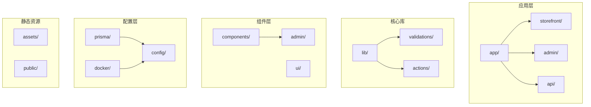
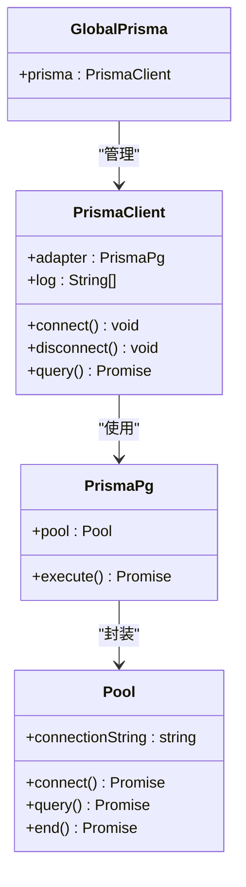
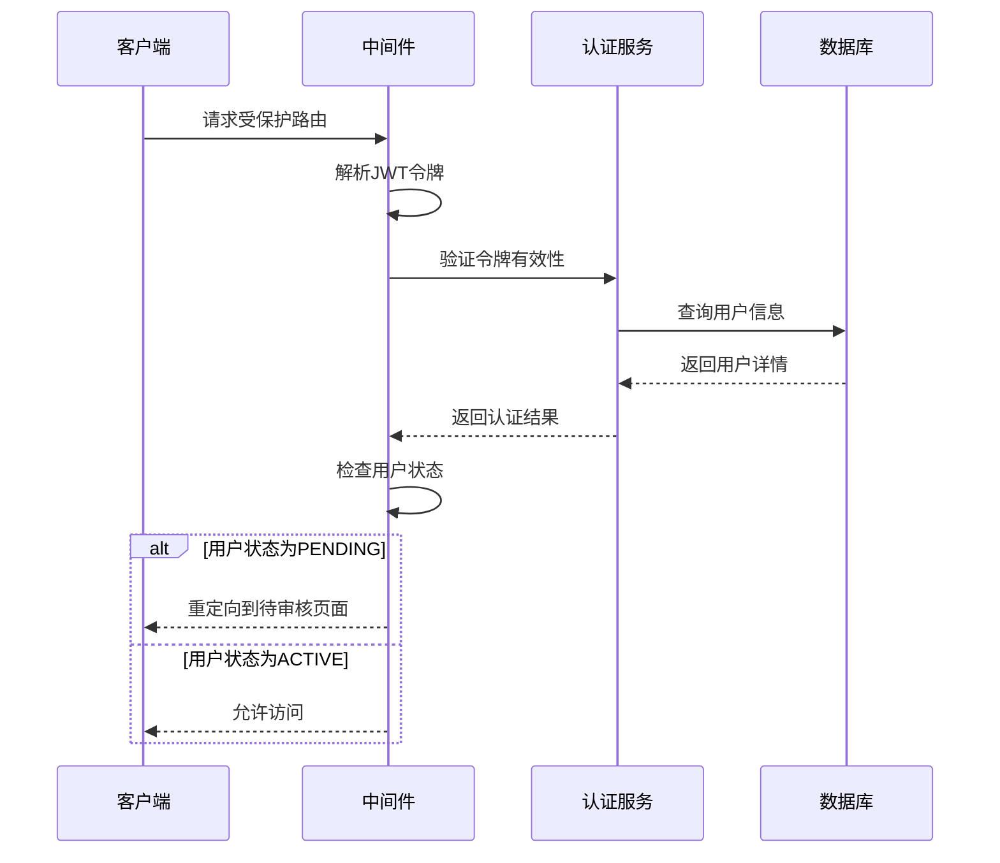
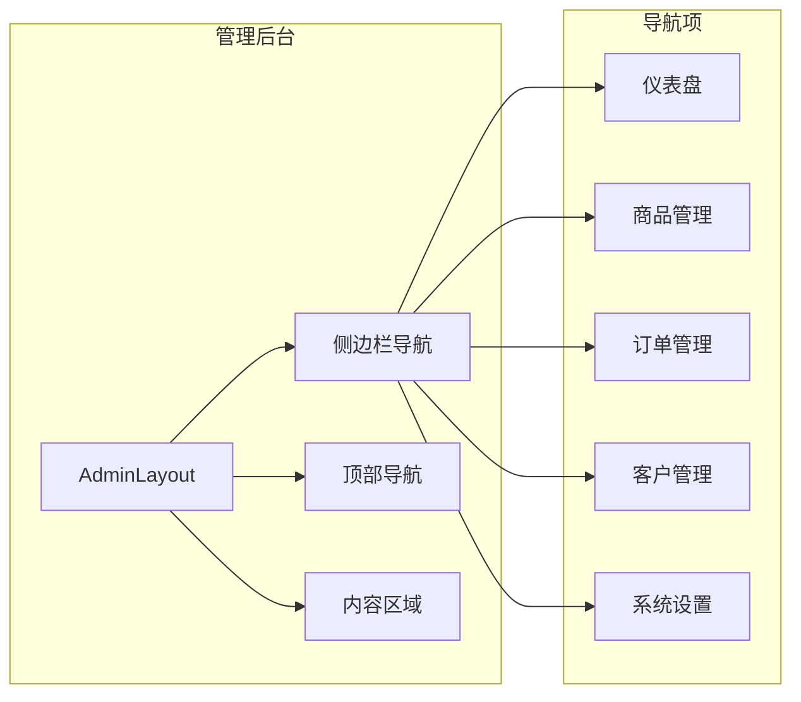
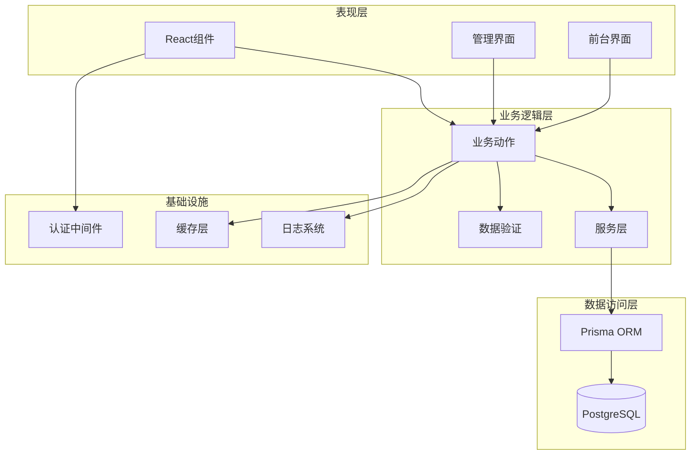
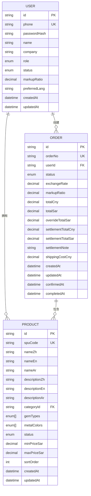
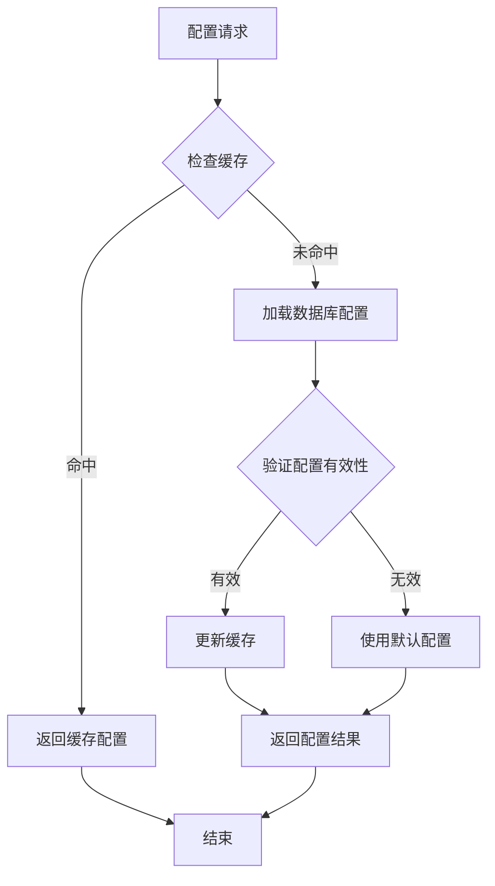
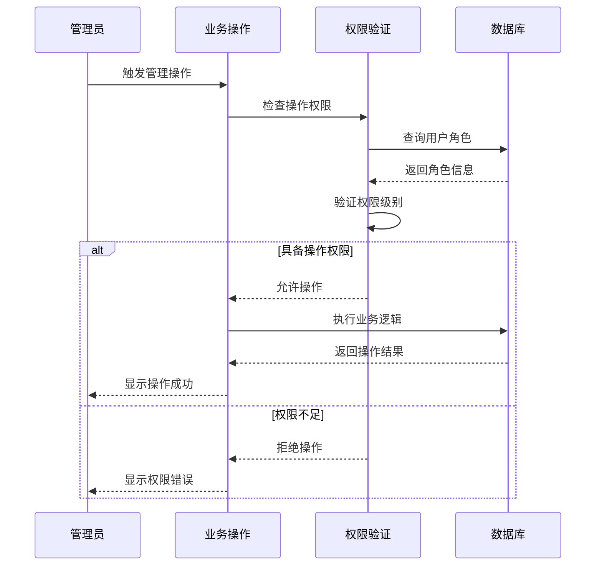
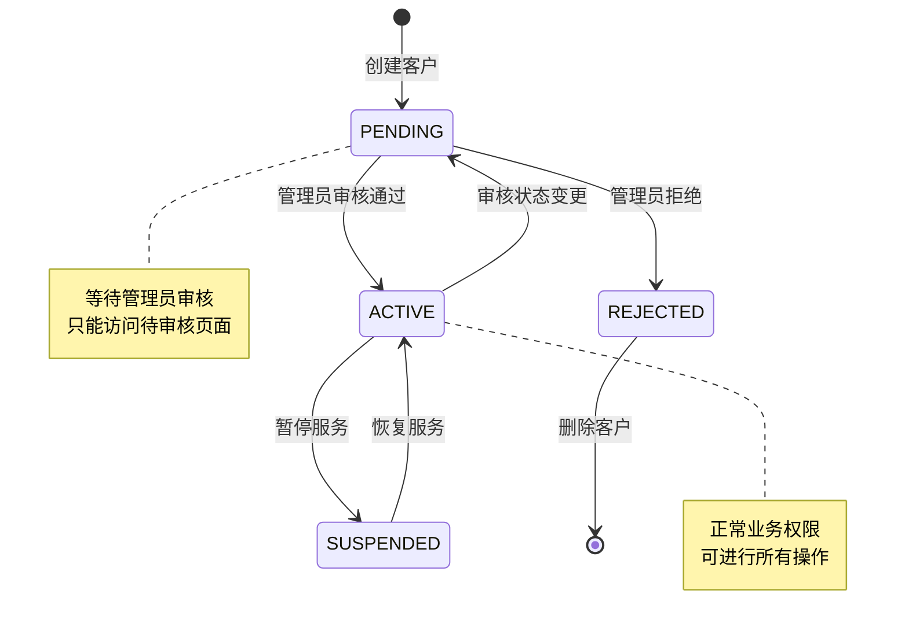
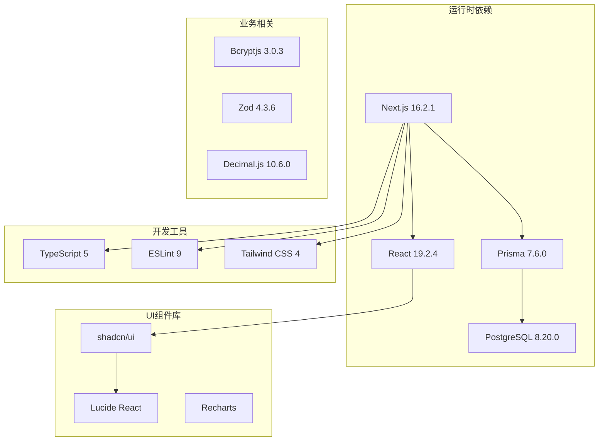

# 系统设置管理

<cite>
**本文档引用的文件**
- [README.md](file://README.md)
- [package.json](file://package.json)
- [docker-compose.yml](file://docker-compose.yml)
- [src/lib/db.ts](file://src/lib/db.ts)
- [prisma/schema.prisma](file://prisma/schema.prisma)
- [prisma.config.ts](file://prisma.config.ts)
- [src/components/admin/admin-layout.tsx](file://src/components/admin/admin-layout.tsx)
- [src/app/admin/layout.tsx](file://src/app/admin/layout.tsx)
- [src/app/admin/page.tsx](file://src/app/admin/page.tsx)
- [src/lib/constants.ts](file://src/lib/constants.ts)
- [src/lib/actions/customer.ts](file://src/lib/actions/customer.ts)
- [src/components/admin/approve-customer-dialog.tsx](file://src/components/admin/approve-customer-dialog.tsx)
- [src/app/admin/login/page.tsx](file://src/app/admin/login/page.tsx)
- [src/middleware.ts](file://src/middleware.ts)
</cite>

## 目录
1. [简介](#简介)
2. [项目结构](#项目结构)
3. [核心组件](#核心组件)
4. [架构概览](#架构概览)
5. [详细组件分析](#详细组件分析)
6. [依赖关系分析](#依赖关系分析)
7. [性能考虑](#性能考虑)
8. [故障排除指南](#故障排除指南)
9. [结论](#结论)
10. [附录](#附录)

## 简介

Celestia珠宝管理系统是一个基于Next.js构建的企业级电商管理平台，专注于珠宝产品的全生命周期管理。系统采用现代化的技术栈，包括TypeScript、PostgreSQL数据库、Prisma ORM等，为珠宝零售商提供完整的商品、订单、客户管理解决方案。

系统的核心特色包括：
- **多语言支持**：支持英语、阿拉伯语、中文的国际化界面
- **灵活的定价体系**：基于客户级别的差异化定价策略
- **完整的订单管理**：从报价到完成的全流程订单跟踪
- **安全的权限控制**：基于角色的访问控制和操作审计
- **可扩展的架构**：模块化的组件设计支持功能扩展

## 项目结构

项目采用基于功能的组织方式，主要目录结构如下：

**图表来源**
- [src/app/admin/layout.tsx:1-9](file://src/app/admin/layout.tsx#L1-L9)
- [src/components/admin/admin-layout.tsx:1-207](file://src/components/admin/admin-layout.tsx#L1-L207)

**章节来源**
- [README.md:1-37](file://README.md#L1-L37)
- [package.json:1-58](file://package.json#L1-L58)

## 核心组件

### 数据库连接与配置

系统使用Prisma作为ORM工具，通过PostgreSQL提供数据持久化服务。数据库连接配置采用了全局单例模式以确保连接池的有效管理。

**图表来源**
- [src/lib/db.ts:1-18](file://src/lib/db.ts#L1-L18)

### 权限控制系统

系统实现了基于角色的访问控制(RBAC)，支持管理员和客户两种基本角色，并通过中间件实现路由级别的权限验证。

**图表来源**
- [src/middleware.ts:114-138](file://src/middleware.ts#L114-L138)

### 管理后台布局

管理后台采用响应式设计，提供统一的导航结构和操作界面。

**图表来源**
- [src/components/admin/admin-layout.tsx:24-38](file://src/components/admin/admin-layout.tsx#L24-L38)

**章节来源**
- [src/lib/db.ts:1-18](file://src/lib/db.ts#L1-L18)
- [src/middleware.ts:114-138](file://src/middleware.ts#L114-L138)
- [src/components/admin/admin-layout.tsx:1-207](file://src/components/admin/admin-layout.tsx#L1-L207)

## 架构概览

系统采用分层架构设计，各层职责明确，便于维护和扩展。

**图表来源**
- [src/lib/db.ts:1-18](file://src/lib/db.ts#L1-L18)
- [prisma/schema.prisma:1-281](file://prisma/schema.prisma#L1-L281)

## 详细组件分析

### 数据模型设计

系统采用实体关系模型设计，核心数据模型包括用户、商品、订单等业务实体。

**图表来源**
- [prisma/schema.prisma:89-280](file://prisma/schema.prisma#L89-L280)

### 配置管理流程

系统配置管理采用集中式管理模式，通过环境变量和数据库配置实现灵活的参数控制。

**图表来源**
- [src/lib/constants.ts:1-45](file://src/lib/constants.ts#L1-L45)

### 权限管理实现

系统实现了细粒度的权限控制，支持基于角色的操作权限验证。

**图表来源**
- [src/lib/actions/customer.ts:129-151](file://src/lib/actions/customer.ts#L129-L151)

**章节来源**
- [prisma/schema.prisma:89-280](file://prisma/schema.prisma#L89-L280)
- [src/lib/constants.ts:1-45](file://src/lib/constants.ts#L1-L45)
- [src/lib/actions/customer.ts:129-151](file://src/lib/actions/customer.ts#L129-L151)

### 客户管理功能

系统提供了完整的客户生命周期管理功能，包括客户审核、定价策略配置等。

**图表来源**
- [src/middleware.ts:114-138](file://src/middleware.ts#L114-L138)

**章节来源**
- [src/middleware.ts:114-138](file://src/middleware.ts#L114-L138)
- [src/lib/actions/customer.ts:129-151](file://src/lib/actions/customer.ts#L129-L151)

## 依赖关系分析

系统依赖关系清晰，主要外部依赖包括数据库、认证、UI组件等。

**图表来源**
- [package.json:11-44](file://package.json#L11-L44)

**章节来源**
- [package.json:1-58](file://package.json#L1-L58)

## 性能考虑

系统在设计时充分考虑了性能优化，主要体现在以下几个方面：

### 数据库性能优化
- 使用连接池管理数据库连接
- 合理的索引设计支持高频查询
- 分页查询避免大数据集加载
- 事务处理保证数据一致性

### 缓存策略
- 内存缓存减少数据库查询
- 配置参数缓存提升启动速度
- 图片资源缓存优化加载性能

### 响应式设计
- 移动端适配优化用户体验
- 按需加载减少初始包大小
- 组件懒加载提升首屏速度

## 故障排除指南

### 常见问题及解决方案

**数据库连接问题**
- 检查DATABASE_URL环境变量配置
- 验证PostgreSQL服务状态
- 确认网络连接和防火墙设置

**权限访问问题**
- 验证JWT令牌有效性
- 检查用户状态是否为ACTIVE
- 确认中间件配置正确

**性能问题诊断**
- 监控数据库查询时间
- 检查缓存命中率
- 分析前端资源加载情况

**章节来源**
- [docker-compose.yml:1-22](file://docker-compose.yml#L1-L22)
- [src/lib/db.ts:1-18](file://src/lib/db.ts#L1-L18)

## 结论

Celestia系统设置管理展现了现代企业级应用的设计理念，通过合理的架构设计、完善的数据模型和严格的权限控制，为企业提供了可靠的珠宝管理解决方案。系统具备良好的扩展性和维护性，能够适应业务的持续发展需求。

主要优势包括：
- 清晰的分层架构便于维护
- 完善的权限控制保障安全
- 灵活的配置管理支持业务变化
- 性能优化确保系统稳定运行

## 附录

### 最佳实践建议

**配置管理最佳实践**
- 使用环境变量管理敏感配置
- 实施配置版本控制
- 建立配置变更审批流程
- 定期备份配置数据

**安全配置建议**
- 强制HTTPS传输
- 实施JWT令牌过期机制
- 定期轮换密钥
- 监控异常访问行为

**性能优化建议**
- 实施CDN加速静态资源
- 优化数据库查询索引
- 使用缓存层减少重复计算
- 监控系统性能指标

### 升级迁移方案

**数据库迁移**
- 使用Prisma Migrate进行版本管理
- 备份生产数据后再执行迁移
- 在测试环境验证迁移脚本
- 制定回滚计划

**前端升级**
- 逐步更新依赖包版本
- 兼容性测试确保功能正常
- 用户界面回归测试
- 性能基准测试对比