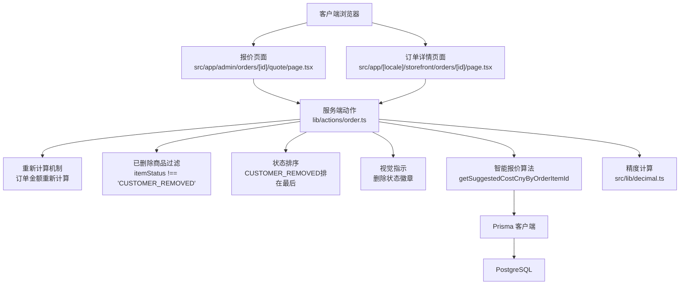
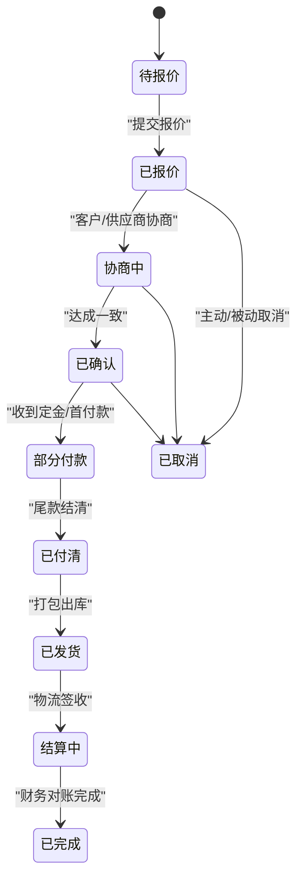
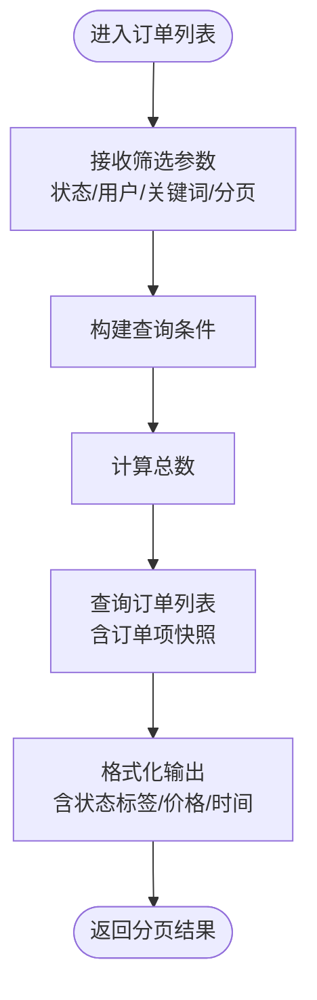
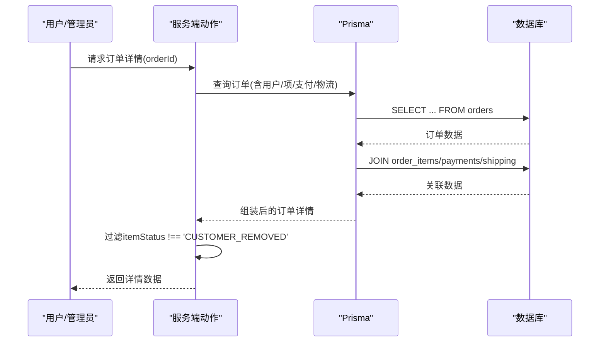
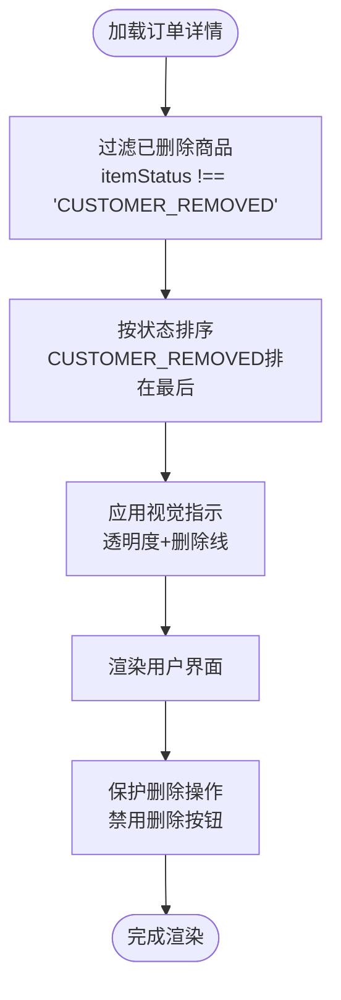
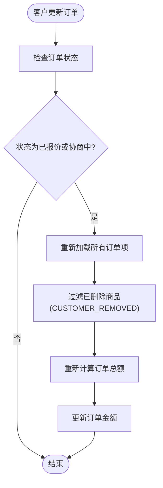
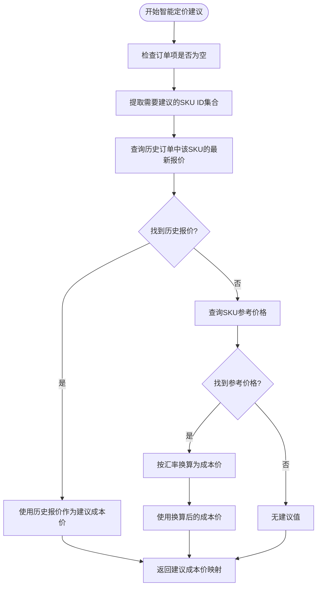
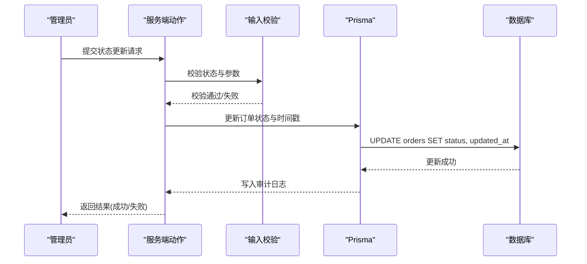
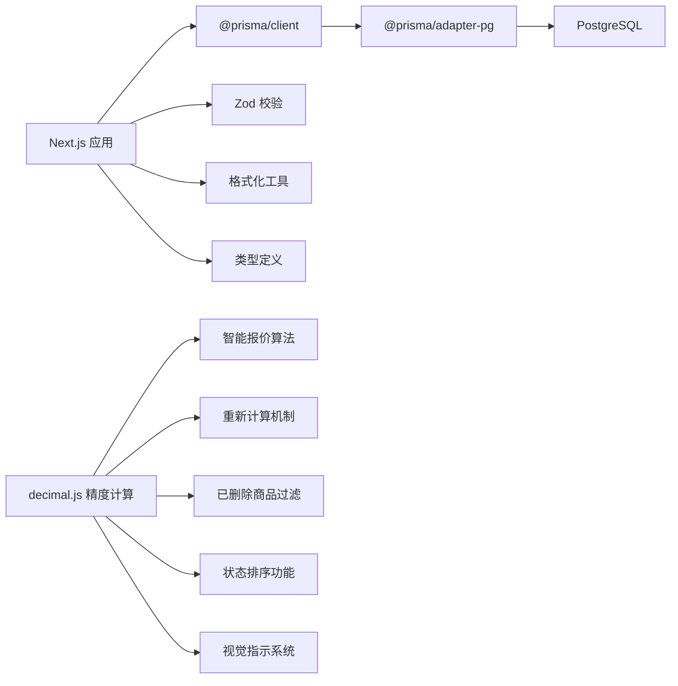

# 订单管理系统

<cite>
**本文引用的文件**
- [README.md](file://README.md)
- [schema.prisma](file://prisma/schema.prisma)
- [index.ts](file://src/types/index.ts)
- [db.ts](file://src/lib/db.ts)
- [constants.ts](file://src/lib/constants.ts)
- [utils.ts](file://src/lib/utils.ts)
- [order.ts](file://src/lib/validations/order.ts)
- [customer.ts](file://src/lib/actions/customer.ts)
- [package.json](file://package.json)
- [page.tsx](file://src/app/admin/orders/[id]/quote/page.tsx)
- [order.ts](file://src/lib/actions/order.ts)
- [decimal.ts](file://src/lib/decimal.ts)
- [page.tsx](file://src/app/[locale]/storefront/orders/[id]/page.tsx)
- [en.json](file://src/i18n/messages/en.json)
- [zh.json](file://src/i18n/messages/zh.json)
</cite>

## 更新摘要
**变更内容**
- 新增已删除商品显示优化功能：在报价页面和订单详情页面中添加了CUSTOMER_REMOVED状态过滤、排序和视觉指示
- 更新订单状态配置：新增CUSTOMER_REMOVED订单项状态
- 增强用户体验：通过视觉样式和状态徽章清晰标识已删除商品
- 完善交互逻辑：防止删除最后一个商品，确保订单完整性

## 目录
1. [简介](#简介)
2. [项目结构](#项目结构)
3. [核心组件](#核心组件)
4. [架构总览](#架构总览)
5. [详细组件分析](#详细组件分析)
6. [依赖分析](#依赖分析)
7. [性能考虑](#性能考虑)
8. [故障排查指南](#故障排查指南)
9. [结论](#结论)
10. [附录](#附录)

## 简介
本文件为 Celestia 订单管理系统的权威技术文档，面向产品、开发与运维团队，系统性阐述订单数据模型、状态机设计、业务流程控制、权限与审计、以及可扩展的 API 接口规范。文档同时提供端到端流程示例与可视化图示，帮助读者快速理解并落地实现。

**更新** 本版本重点更新了订单报价系统的重要改进：修复了报价中客户修改商品后订单总价不变的关键bug，新增了customerUpdateOrder函数中的重新计算机制，确保当客户移除商品时订单总额正确更新。同时更新了报价页面和订单详情页面的itemStatus过滤逻辑，防止已删除商品被计入计算。**新增已删除商品显示优化功能**，在报价页面和订单详情页面中实现了CUSTOMER_REMOVED状态的过滤、排序和视觉指示，包括过滤已删除商品、按状态排序、视觉样式和删除状态徽章。

## 项目结构
该仓库采用 Next.js 应用结构，订单相关能力主要由 Prisma 数据模型与前端服务端动作（Server Actions）构成，并通过统一的类型与常量进行约束与校验。

```mermaid
graph TB
subgraph "应用层"
UI["页面与组件<br/>storefront/admin"]
API["API 路由<br/>/api/*"]
ACTIONS["服务端动作<br/>lib/actions/*"]
RECOMPUTE["重新计算机制<br/>订单金额重新计算"]
ENDQUOTE["智能报价算法<br/>getSuggestedCostCnyByOrderItemId"]
FILTER["已删除商品过滤<br/>itemStatus !== 'CUSTOMER_REMOVED'"]
SORT["状态排序<br/>CUSTOMER_REMOVED排在最后"]
VISUAL["视觉指示<br/>删除状态徽章"]
END
subgraph "数据层"
PRISMA["Prisma 客户端"]
DB["PostgreSQL"]
END
subgraph "配置层"
CONST["常量与配置<br/>src/lib/constants.ts"]
I18N["国际化<br/>src/i18n/messages/*"]
END
TYPES["类型定义<br/>src/types/index.ts"]
VALID["输入校验<br/>src/lib/validations/order.ts"]
DECIMAL["精度计算<br/>src/lib/decimal.ts"]
UI --> API
API --> ACTIONS
ACTIONS --> RECOMPUTE
ACTIONS --> ENDQUOTE
ACTIONS --> FILTER
ACTIONS --> SORT
ACTIONS --> VISUAL
ACTIONS --> PRISMA
PRISMA --> DB
ACTIONS --> TYPES
ACTIONS --> CONST
ACTIONS --> I18N
VALID --> ACTIONS
DECIMAL --> ACTIONS
```

**图表来源**
- [db.ts:1-18](file://src/lib/db.ts#L1-L18)
- [schema.prisma:1-281](file://prisma/schema.prisma#L1-L281)
- [index.ts:1-60](file://src/types/index.ts#L1-L60)
- [constants.ts:15-23](file://src/lib/constants.ts#L15-L23)
- [page.tsx:1-753](file://src/app/admin/orders/[id]/quote/page.tsx#L1-L753)
- [page.tsx:1-991](file://src/app/[locale]/storefront/orders/[id]/page.tsx#L1-L991)
- [order.ts:104-171](file://src/lib/actions/order.ts#L104-L171)
- [decimal.ts:1-96](file://src/lib/decimal.ts#L1-L96)

**章节来源**
- [README.md:1-37](file://README.md#L1-L37)
- [package.json:1-54](file://package.json#L1-L54)

## 核心组件
- 数据模型与枚举：基于 Prisma schema 定义的用户、品类、商品、订单、订单项、支付、物流等模型，以及订单状态、支付方式、物流方式等枚举。
- 类型与常量：统一的 API 响应格式、分页参数、订单筛选参数、默认加价比例、币种与语言支持等。
- 输入校验：使用 Zod 对创建订单、提交报价等关键输入进行严格校验。
- 服务端动作：封装订单相关的 CRUD 与状态变更逻辑，结合权限控制与缓存刷新。
- **智能报价算法**：新增基于相似订单和SKU参考价格的智能定价建议功能。
- **重新计算机制**：新增订单金额重新计算功能，确保客户修改商品后订单总价正确更新。
- **已删除商品过滤**：新增itemStatus过滤逻辑，防止CUSTOMER_REMOVED状态的商品被计入计算和显示。
- **状态排序功能**：在报价页面中实现按itemStatus排序，将已删除商品排在最后。
- **视觉指示系统**：为已删除商品添加视觉样式和删除状态徽章，提升用户体验。
- 数据访问：通过 Prisma 客户端连接 PostgreSQL，提供强类型查询与写入。

**章节来源**
- [schema.prisma:1-281](file://prisma/schema.prisma#L1-L281)
- [index.ts:1-60](file://src/types/index.ts#L1-L60)
- [constants.ts:15-23](file://src/lib/constants.ts#L15-L23)
- [order.ts:1-22](file://src/lib/validations/order.ts#L1-L22)
- [db.ts:1-18](file://src/lib/db.ts#L1-L18)
- [page.tsx:1-753](file://src/app/admin/orders/[id]/quote/page.tsx#L1-L753)
- [page.tsx:1-991](file://src/app/[locale]/storefront/orders/[id]/page.tsx#L1-L991)
- [order.ts:104-171](file://src/lib/actions/order.ts#L104-L171)

## 架构总览
订单管理采用"前端页面 + 服务端动作 + 智能报价算法 + 重新计算机制 + 已删除商品过滤 + 状态排序 + 视觉指示 + Prisma + PostgreSQL"的分层架构。服务端动作负责权限校验、输入校验、业务规则执行与数据持久化；智能报价算法提供成本价建议；重新计算机制确保订单金额的准确性；已删除商品过滤确保数据完整性；状态排序提升用户体验；视觉指示增强界面可读性；类型与常量确保跨模块的一致性；Prisma 提供数据库抽象与关系映射。



**图表来源**
- [page.tsx:1-753](file://src/app/admin/orders/[id]/quote/page.tsx#L1-L753)
- [page.tsx:1-991](file://src/app/[locale]/storefront/orders/[id]/page.tsx#L1-L991)
- [order.ts:104-171](file://src/lib/actions/order.ts#L104-L171)
- [order.ts:638-662](file://src/lib/actions/order.ts#L638-L662)
- [decimal.ts:1-96](file://src/lib/decimal.ts#L1-L96)

## 详细组件分析

### 数据模型与状态机
订单模型包含主表、订单项、支付、物流等关联实体；状态机覆盖从"待报价"到"已完成/已取消"的完整生命周期。状态转换需遵循业务规则，如报价后才能进入协商、确认、付款、发货、结算与完成等阶段。

```mermaid
erDiagram
USER {
string id PK
string phone UK
string name
enum role
enum status
decimal markup_ratio
string preferred_lang
}
ORDER {
string id PK
string orderNo UK
string userId FK
enum status
decimal exchange_rate
decimal markup_ratio
decimal total_cny
decimal total_sar
decimal override_total_sar
decimal settlement_total_cny
decimal settlement_total_sar
string settlement_note
decimal shipping_cost_cny
datetime created_at
datetime updated_at
datetime confirmed_at
datetime completed_at
}
ORDER_ITEM {
string id PK
string orderId FK
string skuId FK
string product_name_snapshot
string sku_desc_snapshot
int quantity
decimal unit_price_cny
decimal unit_price_sar
enum item_status
int settlement_qty
decimal settlement_price_cny
string settlement_note
datetime created_at
datetime updated_at
}
PAYMENT {
string id PK
string orderId FK
decimal amount_sar
enum method
string proof_url
string note
datetime confirmed_at
datetime created_at
}
SHIPPING {
string id PK
string orderId FK UK
string tracking_no
string tracking_url
enum method
string note
datetime created_at
datetime updated_at
}
USER ||--o{ ORDER : "拥有"
ORDER ||--o{ ORDER_ITEM : "包含"
ORDER ||--o{ PAYMENT : "产生"
ORDER ||--|| SHIPPING : "对应"
```

**图表来源**
- [schema.prisma:89-280](file://prisma/schema.prisma#L89-L280)

**章节来源**
- [schema.prisma:49-83](file://prisma/schema.prisma#L49-L83)
- [schema.prisma:188-280](file://prisma/schema.prisma#L188-L280)

### 订单状态机与流转
- 状态枚举：包含待报价、已报价、协商中、已确认、部分付款、已付清、已发货、结算中、已完成、已取消。
- 状态转换：建议在服务端动作中实现状态转换校验，确保前置条件满足（如报价完成、金额匹配、库存可用等），并在每次变更时记录时间戳与审计信息。
- 自动通知与日志：可在状态变更后触发异步任务，发送邮件/短信通知与写入审计日志。



**图表来源**
- [schema.prisma:49-60](file://prisma/schema.prisma#L49-L60)

### 订单列表与筛选
- 筛选维度：状态、用户 ID（管理端）、关键词（订单号）。
- 分页策略：支持游标分页与偏移分页，结合最大页大小限制。
- 性能优化：为用户 ID 与状态建立索引，避免全表扫描。



**图表来源**
- [index.ts:34-39](file://src/types/index.ts#L34-L39)
- [schema.prisma:188-220](file://prisma/schema.prisma#L188-L220)

### 订单详情管理
- 订单信息：订单号、下单人、状态、汇率、加价比例、总价、结算信息、物流信息。
- 商品明细：订单项快照（名称、描述、数量、单价、小计、结算信息），**新增itemStatus过滤逻辑**。
- 物流跟踪：物流单号、追踪链接、运输方式、备注。
- **已删除商品处理**：在订单详情页面中过滤掉itemStatus为CUSTOMER_REMOVED的商品，确保只显示有效商品。
- **视觉样式**：为已删除商品添加透明度和删除线样式，提升视觉识别效果。



**图表来源**
- [schema.prisma:188-280](file://prisma/schema.prisma#L188-L280)

### 已删除商品显示优化
**新增功能** 系统现在提供完整的已删除商品显示优化功能，包括：

- **过滤逻辑**：在订单详情页面和报价页面中都实现了`itemStatus !== "CUSTOMER_REMOVED"`的过滤逻辑
- **状态排序**：在报价页面中实现按itemStatus排序，将CUSTOMER_REMOVED状态的商品排在最后
- **视觉指示**：为已删除商品添加视觉样式和删除状态徽章，包括透明度、删除线和"已删除"徽章
- **交互保护**：在可修改状态下禁用删除按钮，防止删除最后一个商品



**图表来源**
- [page.tsx:450-452](file://src/app/[locale]/storefront/orders/[id]/page.tsx#L450-L452)
- [page.tsx:522-526](file://src/app/admin/orders/[id]/quote/page.tsx#L522-L526)
- [page.tsx:557-561](file://src/app/admin/orders/[id]/quote/page.tsx#L557-L561)
- [page.tsx:589-599](file://src/app/[locale]/storefront/orders/[id]/page.tsx#L589-L599)

### 客户更新订单与重新计算机制
**更新** 新增了关键的重新计算机制，修复了客户修改商品后订单总价不变的问题：

- **重新计算逻辑**：当订单状态为"已报价"或"协商中"时，系统会重新查询所有订单项并计算新的订单总额
- **itemStatus过滤**：在重新计算过程中，会跳过状态为"CUSTOMER_REMOVED"的已删除商品
- **精度保证**：使用decimal.js确保金融计算的精确性
- **事务保证**：重新计算在数据库事务中执行，确保数据一致性



**图表来源**
- [order.ts:638-662](file://src/lib/actions/order.ts#L638-L662)

### 智能定价建议算法
**新增功能** 系统现在提供智能定价建议功能，通过以下三个优先级为订单项推荐成本价：

- **优先级1（最高）**：使用相同SKU在其他订单中的最新报价作为建议成本价
- **优先级2（次高）**：使用SKU的参考价格（SAR）按当前汇率换算为成本价
- **优先级3（最低）**：无建议值时返回空

该算法通过复杂的SQL查询实现，使用窗口函数按SKU分组并选择最新的历史报价。



**图表来源**
- [order.ts:104-171](file://src/lib/actions/order.ts#L104-L171)
- [order.ts:1114-1214](file://src/lib/actions/order.ts#L1114-L1214)

### 订单状态更新与审计
- 权限控制：仅管理员可执行状态更新。
- 输入校验：确保状态值合法且满足前置条件。
- 审计日志：记录操作人、时间、旧状态、新状态、备注。
- 自动通知：状态变更后触发通知（邮件/短信）。



**图表来源**
- [order.ts:1-22](file://src/lib/validations/order.ts#L1-L22)
- [schema.prisma:188-220](file://prisma/schema.prisma#L188-L220)

### 订单统计分析（概念性）
- 销售报表：按时间、状态、品类、SKU 维度汇总订单数与金额。
- 收入统计：区分已付款、结算中、已完成三档收入。
- 客户分析：客户下单频次、客单价、复购率、地域分布。
- 实现建议：在服务端动作中聚合查询，或引入物化视图/OLAP 以提升性能。

### API 接口文档（概念性）
- 订单列表
  - 方法：GET
  - 路径：/api/orders
  - 查询参数：status、userId、keyword、page、pageSize、cursor
  - 响应：分页对象，包含订单项快照与状态标签
- 订单详情
  - 方法：GET
  - 路径：/api/orders/{id}
  - 响应：订单详情（含用户、订单项、支付、物流）
- 状态更新
  - 方法：PATCH
  - 路径：/api/orders/{id}/status
  - 请求体：{ status, note? }
  - 响应：操作结果
- 创建报价
  - 方法：POST
  - 路径：/api/orders/quote
  - 请求体：{ orderId, exchangeRate, markupRatio, items: [{orderItemId, unitPriceCny}] }
  - 响应：操作结果

## 依赖分析
- Prisma 客户端与适配器：通过 @prisma/adapter-pg 连接 PostgreSQL，提供强类型 ORM 能力。
- 类型系统：TypeScript + Zod，确保前后端契约一致与输入安全。
- 分页与格式化：统一的分页参数与价格/日期格式化工具。
- **智能报价算法**：基于窗口函数的复杂SQL查询，使用ROW_NUMBER()进行历史数据排名。
- **精度计算**：使用 decimal.js 确保金融计算的精确性。
- **重新计算机制**：在订单状态为"已报价"或"协商中"时自动重新计算订单总额。
- **已删除商品过滤**：在订单详情和报价页面中使用itemStatus过滤逻辑。
- **状态排序功能**：在报价页面中实现按itemStatus排序。
- **视觉指示系统**：使用TailwindCSS类名实现删除商品的视觉样式。
- 包管理：Next.js 16、React 19、TailwindCSS、ExcelJS（报表导出）、AWS SDK（附件存储）等。



**图表来源**
- [package.json:11-40](file://package.json#L11-L40)
- [db.ts:1-18](file://src/lib/db.ts#L1-L18)
- [order.ts:1-22](file://src/lib/validations/order.ts#L1-L22)
- [utils.ts:1-32](file://src/lib/utils.ts#L1-L32)
- [index.ts:1-60](file://src/types/index.ts#L1-L60)
- [decimal.ts:1-96](file://src/lib/decimal.ts#L1-L96)
- [order.ts:104-171](file://src/lib/actions/order.ts#L104-L171)

**章节来源**
- [package.json:1-54](file://package.json#L1-L54)
- [db.ts:1-18](file://src/lib/db.ts#L1-L18)

## 性能考虑
- 索引策略：为订单的 userId、status 建立索引，加速筛选与排序。
- 分页限制：最大页大小限制与游标分页，避免大偏移查询。
- N+1 查询：在查询订单列表时一次性加载关联数据，减少数据库往返。
- **智能报价算法优化**：使用窗口函数和CTE（公用表表达式）优化历史数据查询性能。
- **重新计算优化**：仅在订单状态为"已报价"或"协商中"时执行重新计算，避免不必要的性能开销。
- **itemStatus过滤**：在重新计算和页面渲染时都使用itemStatus过滤，减少无效数据处理。
- **排序优化**：在报价页面中使用JavaScript排序，避免数据库层面的复杂排序逻辑。
- **视觉样式优化**：使用CSS类名而非内联样式，提升渲染性能。
- 缓存刷新：服务端动作完成后调用 revalidatePath，确保 UI 与缓存一致性。
- 大字段分离：物流与支付等可选字段延迟加载，减少主列表查询负载。

## 故障排查指南
- 权限不足：检查当前用户角色是否为 ADMIN，服务端动作会拒绝非管理员请求。
- 参数校验失败：确认输入符合 Zod 规则（正数、非空、字符串长度限制等）。
- 数据库连接问题：检查 DATABASE_URL 环境变量与网络连通性。
- 缓存未刷新：确认 revalidatePath 的路径与页面路由一致。
- 审计缺失：确认状态变更后是否正确记录日志与发送通知。
- **智能报价算法问题**：检查SKU历史报价数据是否存在，确认汇率转换逻辑正确。
- **重新计算问题**：检查订单状态是否为"已报价"或"协商中"，确认itemStatus过滤逻辑正常工作。
- **订单金额不正确**：确认重新计算机制是否正确执行，检查CUSTOMER_REMOVED商品是否被正确过滤。
- **已删除商品显示问题**：检查itemStatus过滤逻辑是否正确应用，确认状态排序功能正常工作。
- **视觉指示异常**：检查TailwindCSS类名是否正确应用，确认删除状态徽章显示正常。

**章节来源**
- [customer.ts:32-40](file://src/lib/actions/customer.ts#L32-L40)
- [order.ts:1-22](file://src/lib/validations/order.ts#L1-L22)
- [db.ts:9-15](file://src/lib/db.ts#L9-L15)

## 结论
本系统以 Prisma 为核心的数据层，配合严格的类型与输入校验、清晰的状态机与权限控制，提供了可扩展的订单管理能力。通过服务端动作统一处理业务逻辑与数据一致性，辅以分页与索引优化，能够支撑从订单列表到详情、状态更新与统计分析的完整场景。**新增的智能定价建议算法**进一步提升了报价效率，通过历史数据和SKU参考价格为管理员提供准确的成本价建议。**重新计算机制**确保了客户修改商品后的订单金额准确性，修复了关键的bug。**已删除商品显示优化功能**显著提升了用户体验，通过过滤、排序和视觉指示确保用户能够清晰地识别和管理已删除的商品。建议后续补充 API 文档与异步通知机制，完善可观测性与可维护性。

## 附录

### 订单操作流程示例（概念性）
- 创建报价：客户下单 → 系统生成订单 → 管理员提交报价（汇率、加价比例、单价）→ 订单进入"已报价"
- 确认与付款：客户确认 → 订单进入"已确认" → 收到部分/全款 → 状态推进至"部分付款/已付清"
- 发货与完成：打包出库 → 填写物流信息 → "已发货" → 物流签收 → "结算中" → 财务对账 → "已完成"

### 已删除商品显示优化工作原理
**新增功能** 已删除商品显示优化通过以下步骤实现：

1. **状态定义**：在ORDER_ITEM_STATUS_CONFIG中定义CUSTOMER_REMOVED状态，提供中英文标签
2. **过滤处理**：在订单详情页面和报价页面中使用`itemStatus !== "CUSTOMER_REMOVED"`过滤逻辑
3. **排序逻辑**：在报价页面中实现按itemStatus排序，将CUSTOMER_REMOVED状态的商品排在最后
4. **视觉样式**：为已删除商品添加透明度、删除线和"已删除"徽章
5. **交互保护**：在可修改状态下禁用删除按钮，防止删除最后一个商品

该功能通过前端JavaScript实现，无需额外的数据库查询，显著提升了用户体验和界面可读性。

### 智能报价算法工作原理
**更新** 新增的智能定价建议算法通过以下步骤工作：

1. **数据收集**：提取需要建议成本价的订单项及其对应的SKU ID
2. **历史查询**：使用窗口函数查询相同SKU在其他订单中的最新报价
3. **参考价转换**：对于没有历史报价的SKU，查询SKU参考价格并按当前汇率换算
4. **优先级应用**：按照历史报价 > 参考价格 > 无建议的优先级返回结果
5. **结果映射**：将建议成本价映射回对应的订单项ID

该算法通过单次复杂查询即可获取所有建议值，避免了多次数据库往返，显著提升了报价页面的响应速度。

### 重新计算机制工作原理
**更新** 新增的重新计算机制通过以下步骤确保订单金额的准确性：

1. **状态检查**：仅在订单状态为"已报价"或"协商中"时执行重新计算
2. **数据加载**：重新查询所有订单项，包括已删除的商品
3. **过滤处理**：跳过状态为"CUSTOMER_REMOVED"的已删除商品
4. **金额计算**：对每个有效订单项计算小计并累加得到新的订单总额
5. **精度保证**：使用decimal.js确保计算的精确性
6. **数据更新**：在数据库事务中更新订单的totalCny和totalSar字段

该机制修复了客户修改商品后订单总价不变的关键bug，确保了订单金额的实时准确性。