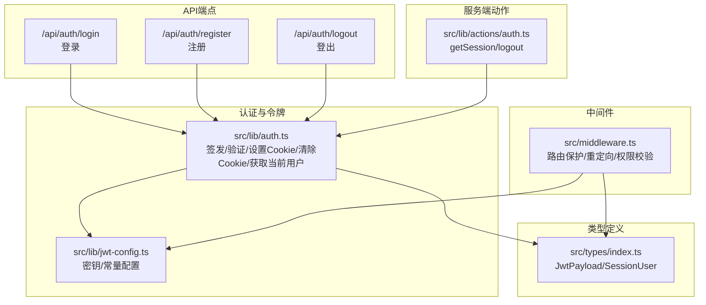
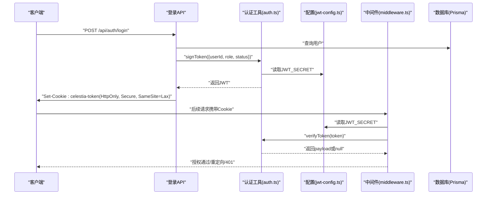
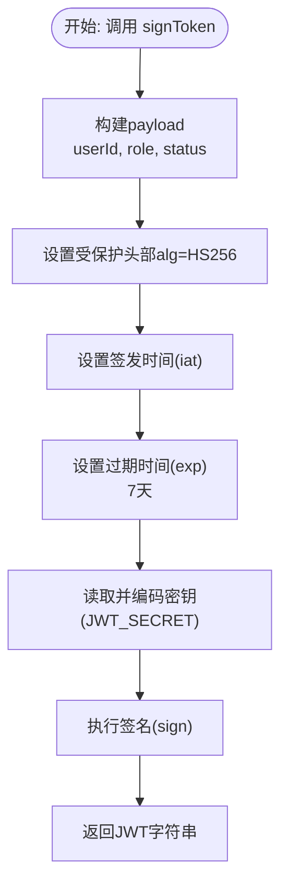
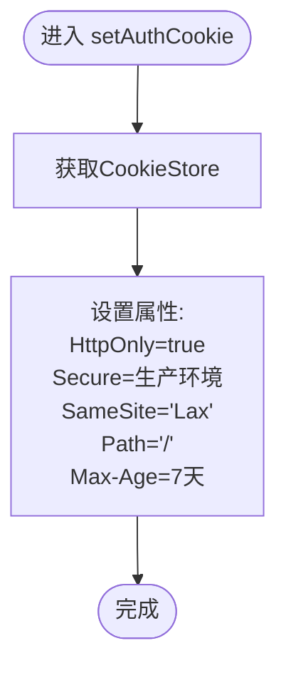
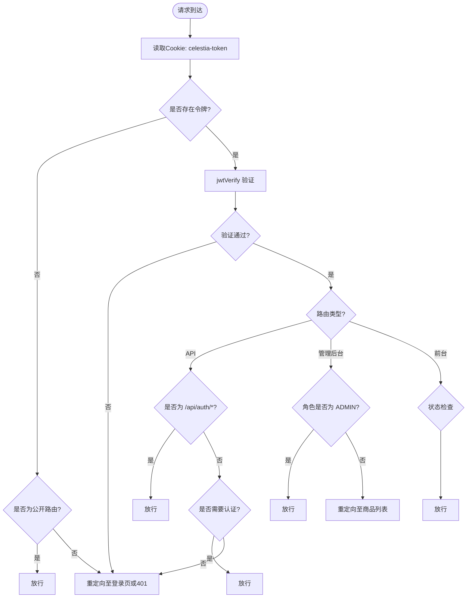
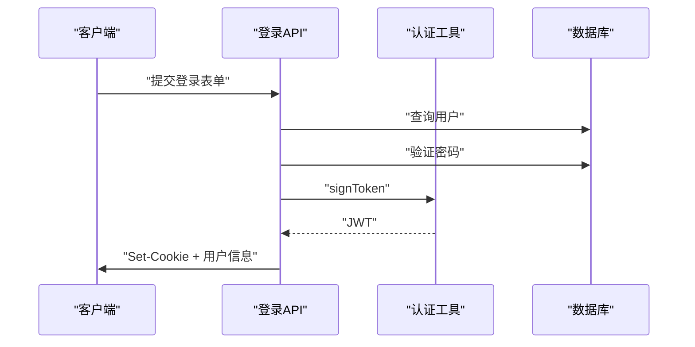
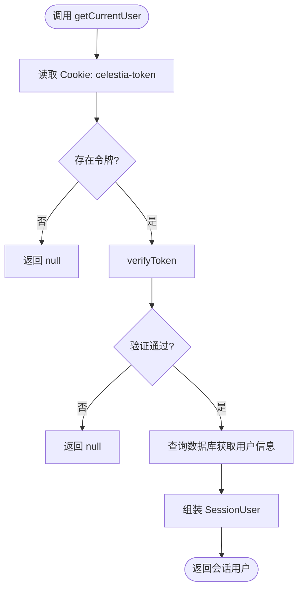
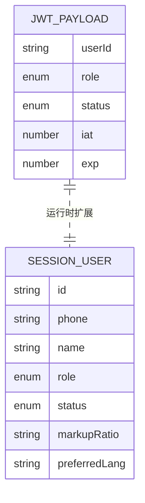
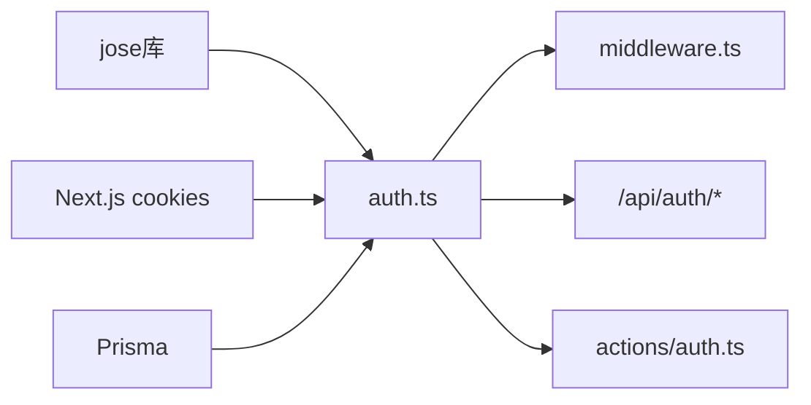

# JWT令牌管理

<cite>
**本文引用的文件**
- [src/lib/auth.ts](file://src/lib/auth.ts)
- [src/lib/jwt-config.ts](file://src/lib/jwt-config.ts)
- [src/middleware.ts](file://src/middleware.ts)
- [src/app/api/auth/login/route.ts](file://src/app/api/auth/login/route.ts)
- [src/app/api/auth/register/route.ts](file://src/app/api/auth/register/route.ts)
- [src/app/api/auth/logout/route.ts](file://src/app/api/auth/logout/route.ts)
- [src/lib/actions/auth.ts](file://src/lib/actions/auth.ts)
- [src/types/index.ts](file://src/types/index.ts)
- [package.json](file://package.json)
</cite>

## 目录
1. [简介](#简介)
2. [项目结构](#项目结构)
3. [核心组件](#核心组件)
4. [架构总览](#架构总览)
5. [详细组件分析](#详细组件分析)
6. [依赖关系分析](#依赖关系分析)
7. [性能考量](#性能考量)
8. [故障排除指南](#故障排除指南)
9. [结论](#结论)
10. [附录](#附录)

## 简介
本文件面向Celestia项目的JWT令牌管理系统，系统采用对称加密算法（HS256）签发与验证JWT，并通过HttpOnly Cookie承载令牌，结合Next.js中间件实现路由级权限控制。本文档围绕以下主题展开：
- JWT生成算法、签名机制与有效期管理
- signToken函数实现原理与payload结构设计
- setAuthCookie函数的Cookie设置逻辑与安全属性
- 令牌验证流程、中间件集成与路由保护机制
- 令牌刷新策略、过期处理与安全最佳实践
- 令牌调试技巧、常见问题排查与性能优化建议
- 客户端存储方案（localStorage vs sessionStorage）与安全考虑

## 项目结构
JWT相关能力主要分布在以下模块：
- 认证与令牌工具：src/lib/auth.ts
- JWT配置与密钥管理：src/lib/jwt-config.ts
- 中间件路由保护：src/middleware.ts
- API认证端点：src/app/api/auth/*
- 服务端动作（Server Actions）：src/lib/actions/auth.ts
- 类型定义：src/types/index.ts
- 依赖声明：package.json（使用jose库）

图表来源
- [src/lib/auth.ts:1-98](file://src/lib/auth.ts#L1-L98)
- [src/lib/jwt-config.ts:1-9](file://src/lib/jwt-config.ts#L1-L9)
- [src/middleware.ts:1-148](file://src/middleware.ts#L1-L148)
- [src/app/api/auth/login/route.ts:1-76](file://src/app/api/auth/login/route.ts#L1-L76)
- [src/app/api/auth/register/route.ts:1-85](file://src/app/api/auth/register/route.ts#L1-L85)
- [src/app/api/auth/logout/route.ts:1-21](file://src/app/api/auth/logout/route.ts#L1-L21)
- [src/lib/actions/auth.ts:1-20](file://src/lib/actions/auth.ts#L1-L20)
- [src/types/index.ts:41-60](file://src/types/index.ts#L41-L60)

章节来源
- [src/lib/auth.ts:1-98](file://src/lib/auth.ts#L1-L98)
- [src/lib/jwt-config.ts:1-9](file://src/lib/jwt-config.ts#L1-L9)
- [src/middleware.ts:1-148](file://src/middleware.ts#L1-L148)
- [src/app/api/auth/login/route.ts:1-76](file://src/app/api/auth/login/route.ts#L1-L76)
- [src/app/api/auth/register/route.ts:1-85](file://src/app/api/auth/register/route.ts#L1-L85)
- [src/app/api/auth/logout/route.ts:1-21](file://src/app/api/auth/logout/route.ts#L1-L21)
- [src/lib/actions/auth.ts:1-20](file://src/lib/actions/auth.ts#L1-L20)
- [src/types/index.ts:41-60](file://src/types/index.ts#L41-L60)

## 核心组件
- JWT签发与验证：基于jose库的SignJWT与jwtVerify，使用HS256对称算法，密钥来自环境变量并编码为TextEncoder格式。
- Cookie管理：通过Next.js cookies API设置HttpOnly、Secure、SameSite、Max-Age等属性；默认名称为celestia-token，有效期7天。
- 中间件保护：在API、管理后台、前台路由上进行统一鉴权与重定向；支持公开路由与页面白名单。
- 会话获取：从Cookie读取令牌，验证后查询数据库返回完整用户信息。

章节来源
- [src/lib/auth.ts:10-18](file://src/lib/auth.ts#L10-L18)
- [src/lib/auth.ts:23-30](file://src/lib/auth.ts#L23-L30)
- [src/lib/auth.ts:35-44](file://src/lib/auth.ts#L35-L44)
- [src/lib/auth.ts:57-97](file://src/lib/auth.ts#L57-L97)
- [src/lib/jwt-config.ts:1-9](file://src/lib/jwt-config.ts#L1-L9)
- [src/middleware.ts:31-138](file://src/middleware.ts#L31-L138)

## 架构总览
下图展示了从登录到中间件保护、再到API访问的整体流程。

图表来源
- [src/app/api/auth/login/route.ts:49-51](file://src/app/api/auth/login/route.ts#L49-L51)
- [src/lib/auth.ts:10-18](file://src/lib/auth.ts#L10-L18)
- [src/lib/jwt-config.ts:5](file://src/lib/jwt-config.ts#L5)
- [src/middleware.ts:35-46](file://src/middleware.ts#L35-L46)
- [src/lib/auth.ts:23-30](file://src/lib/auth.ts#L23-L30)

## 详细组件分析

### JWT生成与签名机制
- 算法与密钥
  - 使用HS256对称算法，密钥来源于环境变量JWT_SECRET，经TextEncoder编码后传入SignJWT.sign。
  - 若未配置密钥，应用启动时会抛出错误，确保生产环境强制配置。
- payload结构
  - 包含userId、role、status三个字段，分别标识用户ID、角色（ADMIN/CUSTOMER）、账户状态（PENDING/ACTIVE）。
  - 同时自动设置iat（签发时间）与exp（过期时间），默认7天。
- 过期时间管理
  - 通过setExpirationTime('7d')设定有效期；COOKIE_MAX_AGE同样为7天，保证Cookie与令牌有效期一致。

图表来源
- [src/lib/auth.ts:10-18](file://src/lib/auth.ts#L10-L18)
- [src/lib/jwt-config.ts:5](file://src/lib/jwt-config.ts#L5)

章节来源
- [src/lib/auth.ts:10-18](file://src/lib/auth.ts#L10-L18)
- [src/lib/jwt-config.ts:1-9](file://src/lib/jwt-config.ts#L1-L9)
- [src/types/index.ts:42-48](file://src/types/index.ts#L42-L48)

### Cookie设置与安全属性
- Cookie名称：celestia-token
- 安全属性
  - HttpOnly: true，防止XSS窃取
  - Secure: 在生产环境启用，要求HTTPS传输
  - SameSite: Lax，平衡CSRF防护与第三方登录场景
  - Path: '/'，作用域全局
  - Max-Age: 7天，与令牌有效期一致
- 设置时机：登录成功后立即设置，确保后续请求可被中间件识别。

图表来源
- [src/lib/auth.ts:35-44](file://src/lib/auth.ts#L35-L44)
- [src/lib/jwt-config.ts:6-8](file://src/lib/jwt-config.ts#L6-L8)

章节来源
- [src/lib/auth.ts:35-44](file://src/lib/auth.ts#L35-L44)
- [src/lib/jwt-config.ts:6-8](file://src/lib/jwt-config.ts#L6-L8)

### 令牌验证与中间件集成
- 验证流程
  - 中间件从请求Cookie中读取令牌，若存在则调用verifyToken进行验证。
  - jwtVerify失败将返回null，中间件据此判断是否放行或返回401。
- 路由保护策略
  - API保护：除/api/auth外的所有/api路由均需有效令牌。
  - 管理后台：仅ADMIN角色可访问，已登录但非ADMIN将重定向至商品列表。
  - 前台路由：根据用户状态（PENDING/ACTIVE）与角色进行重定向；未登录则跳转登录页。
  - 公开路由：/api/auth/*免登录。
- 匹配器：对/api、/admin、/:locale/storefront进行匹配，确保中间件生效范围。

图表来源
- [src/middleware.ts:31-138](file://src/middleware.ts#L31-L138)
- [src/lib/auth.ts:23-30](file://src/lib/auth.ts#L23-L30)

章节来源
- [src/middleware.ts:5-14](file://src/middleware.ts#L5-L14)
- [src/middleware.ts:31-138](file://src/middleware.ts#L31-L138)
- [src/lib/auth.ts:23-30](file://src/lib/auth.ts#L23-L30)

### 登录与注册流程
- 登录
  - 校验输入、查询用户、验证密码，成功后调用signToken与setAuthCookie，返回用户信息与状态。
- 注册
  - 输入校验、检查手机号重复、密码加密、创建用户、签发令牌并设置Cookie。
- 登出
  - 提供API与Server Action两种方式，清除Cookie并重定向。

图表来源
- [src/app/api/auth/login/route.ts:13-75](file://src/app/api/auth/login/route.ts#L13-L75)
- [src/app/api/auth/register/route.ts:8-85](file://src/app/api/auth/register/route.ts#L8-L85)
- [src/app/api/auth/logout/route.ts:5-21](file://src/app/api/auth/logout/route.ts#L5-L21)
- [src/lib/actions/auth.ts:17-20](file://src/lib/actions/auth.ts#L17-L20)

章节来源
- [src/app/api/auth/login/route.ts:13-75](file://src/app/api/auth/login/route.ts#L13-L75)
- [src/app/api/auth/register/route.ts:8-85](file://src/app/api/auth/register/route.ts#L8-L85)
- [src/app/api/auth/logout/route.ts:5-21](file://src/app/api/auth/logout/route.ts#L5-L21)
- [src/lib/actions/auth.ts:17-20](file://src/lib/actions/auth.ts#L17-L20)

### 会话获取与用户信息加载
- getCurrentUser流程
  - 从Cookie读取令牌，若不存在或验证失败则返回null。
  - 成功后查询数据库获取用户完整信息，组装为SessionUser返回。
- 适用场景：服务端渲染、Server Actions、API内部逻辑需要用户上下文时。

图表来源
- [src/lib/auth.ts:57-97](file://src/lib/auth.ts#L57-L97)

章节来源
- [src/lib/auth.ts:57-97](file://src/lib/auth.ts#L57-L97)

### 类型模型与数据结构
- JwtPayload：包含userId、role、status以及标准的iat/exp。
- SessionUser：在JwtPayload基础上扩展id、phone、name、markupRatio、preferredLang等业务字段。
- 用途：API响应、中间件payload类型约束、前端消费。

图表来源
- [src/types/index.ts:42-60](file://src/types/index.ts#L42-L60)

章节来源
- [src/types/index.ts:42-60](file://src/types/index.ts#L42-L60)

## 依赖关系分析
- jose库：提供SignJWT与jwtVerify，是JWT生成与验证的核心。
- Next.js cookies API：用于设置/读取/删除HttpOnly Cookie。
- Prisma：用于用户信息查询与状态校验。
- 中间件与API：共同构成路由级保护体系。

图表来源
- [package.json:22](file://package.json#L22)
- [src/lib/auth.ts:1-5](file://src/lib/auth.ts#L1-L5)
- [src/middleware.ts:2-3](file://src/middleware.ts#L2-L3)
- [src/app/api/auth/login/route.ts:4](file://src/app/api/auth/login/route.ts#L4)

章节来源
- [package.json:22](file://package.json#L22)
- [src/lib/auth.ts:1-5](file://src/lib/auth.ts#L1-L5)
- [src/middleware.ts:2-3](file://src/middleware.ts#L2-L3)

## 性能考量
- 令牌体积：payload仅包含必要字段，减少Cookie大小与网络传输开销。
- 验证成本：每次请求均需jwtVerify，建议：
  - 将中间件匹配范围限定在需要保护的路径，避免对静态资源与公开路由频繁校验。
  - 对高频API可考虑缓存短期校验结果（如内存缓存），但需配合严格的失效策略。
- 数据库查询：getCurrentUser会进行一次用户信息查询，建议：
  - 在高并发场景下使用连接池与索引优化。
  - 对频繁使用的用户信息可在服务端缓存（带失效与一致性策略）。
- Cookie大小：7天有效期与HttpOnly属性不会显著增加服务器负担，但应避免在payload中加入大字段。

## 故障排除指南
- 环境变量缺失
  - 现象：应用启动时报错提示未设置JWT_SECRET。
  - 处理：在环境变量中配置JWT_SECRET，确保值有效且长度足够。
- 401未授权
  - 现象：访问受保护API返回401。
  - 排查：确认Cookie是否正确设置（HttpOnly、Secure、SameSite）、域名与路径是否匹配、令牌是否过期。
- 重定向异常
  - 现象：登录后未跳转至预期页面。
  - 排查：检查中间件中PUBLIC_ROUTES与AUTH_PAGES配置，确认payload中的role与status是否符合预期。
- 登录/注册失败
  - 现象：输入正确信息仍提示错误。
  - 排查：查看API返回的错误信息，确认Prisma查询、密码校验与signToken流程是否正常。
- 令牌调试
  - 方法：在浏览器开发者工具Network面板查看Set-Cookie头；在服务端日志中记录verifyToken结果；使用在线JWT解码工具查看payload内容（不泄露密钥）。

章节来源
- [src/lib/jwt-config.ts:2-4](file://src/lib/jwt-config.ts#L2-L4)
- [src/middleware.ts:39-46](file://src/middleware.ts#L39-L46)
- [src/app/api/auth/login/route.ts:33-47](file://src/app/api/auth/login/route.ts#L33-L47)
- [src/app/api/auth/register/route.ts:23-33](file://src/app/api/auth/register/route.ts#L23-L33)

## 结论
该JWT系统以jose为核心，结合HttpOnly Cookie与Next.js中间件，实现了简洁而安全的认证与授权机制。通过明确的payload结构、严格的Cookie安全属性与完善的路由保护策略，系统在易用性与安全性之间取得良好平衡。建议在生产环境中强化密钥轮换、引入短令牌+刷新机制、监控异常登录与重放攻击，并持续优化数据库查询与中间件匹配范围以提升性能。

## 附录

### 令牌刷新策略与过期处理
- 当前实现
  - 令牌有效期固定为7天，Cookie有效期亦为7天；未实现自动刷新。
- 建议方案
  - 短令牌（如15-60分钟）+ 刷新令牌（Refresh Token）：登录成功发放短令牌（Cookie），同时发放长周期刷新令牌（存储于安全的HttpOnly Cookie或后端会话）。
  - 刷新流程：短令牌即将过期时，客户端携带刷新令牌向后端申请新短令牌；后端验证刷新令牌并签发新短令牌，必要时更新刷新令牌。
  - 过期处理：中间件在验证失败时统一返回401并触发前端重新登录流程。

### 安全最佳实践
- 密钥管理
  - 使用强随机密钥，定期轮换；避免硬编码与版本库泄露。
- Cookie安全
  - 生产环境启用Secure；跨站场景谨慎使用SameSite；严格控制Path与Domain。
- 传输安全
  - 强制HTTPS；禁用明文Cookie传输。
- 日志与监控
  - 记录认证事件与异常；监控高频失败登录与异常地理位置。

### 客户端存储方案（localStorage vs sessionStorage）
- localStorage
  - 特性：持久化存储，跨标签页共享。
  - 风险：易受XSS攻击，一旦泄露可长期使用。
  - 适用：不推荐用于存放敏感令牌。
- sessionStorage
  - 特性：仅当前会话有效，关闭标签页即清空。
  - 风险：仍受XSS影响，但生命周期更短。
  - 适用：仍不推荐存放敏感令牌。
- 推荐做法
  - 优先使用HttpOnly Cookie承载JWT；如需前端状态同步，仅存放非敏感信息（如用户ID、角色标记），并配合严格的XSS防护与CSP策略。