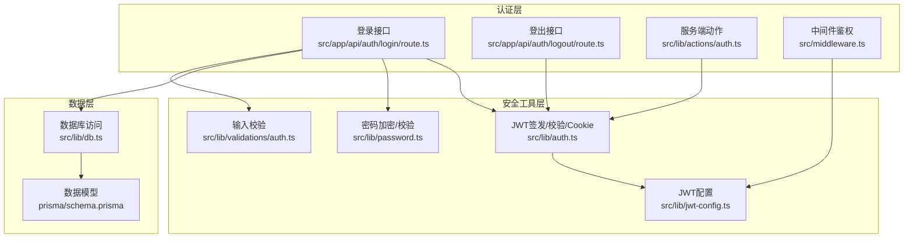
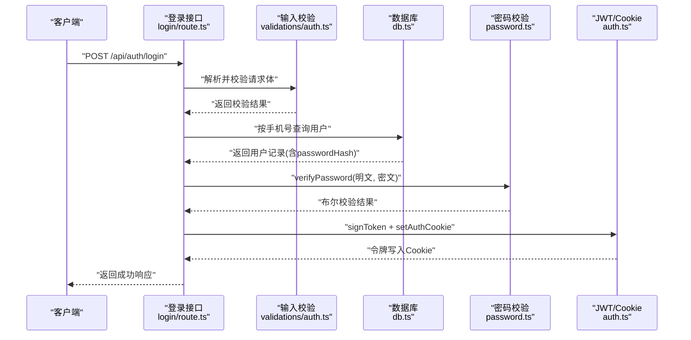
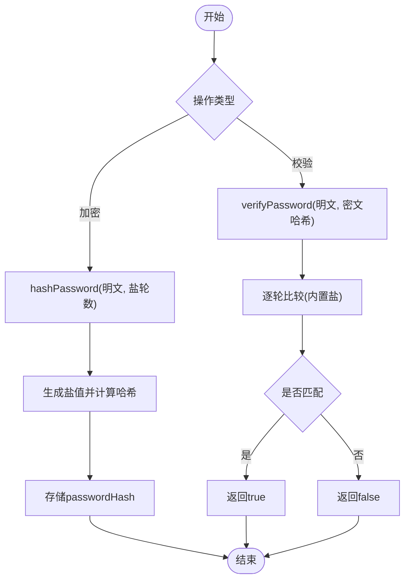
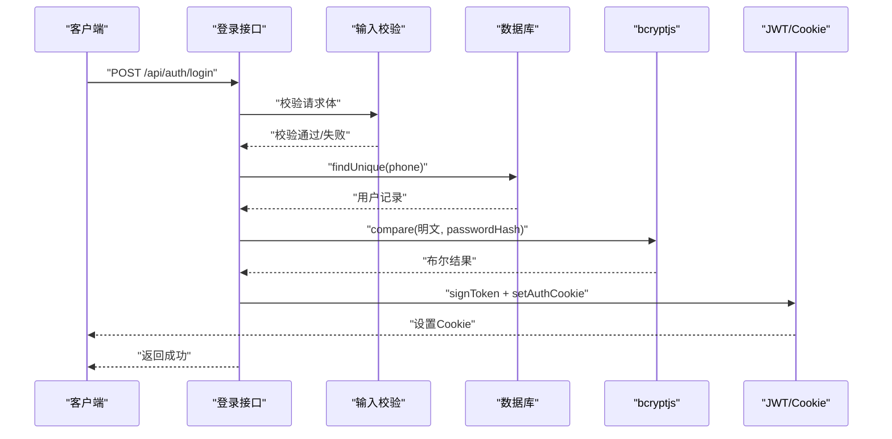
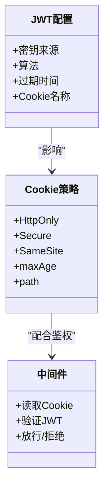
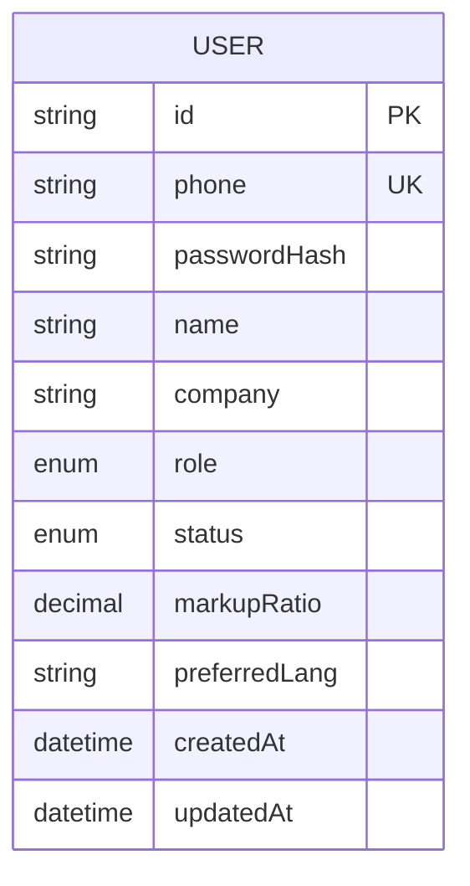
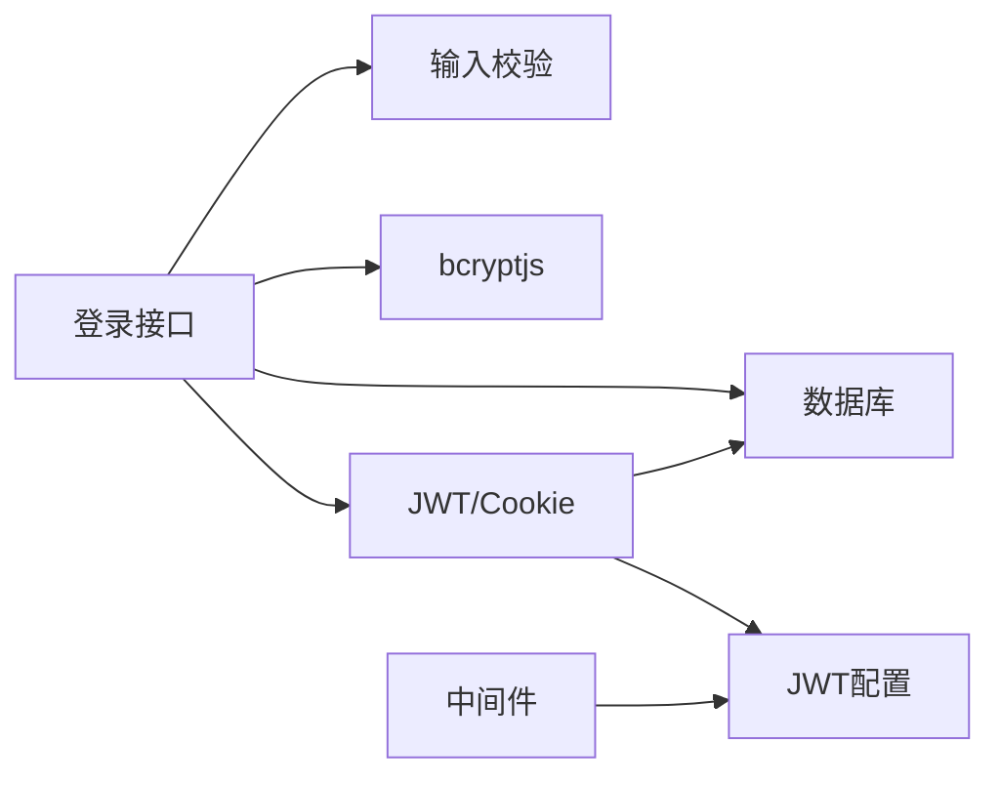

# 密码安全与加密

<cite>
**本文引用的文件**
- [src/lib/password.ts](file://src/lib/password.ts)
- [src/app/api/auth/login/route.ts](file://src/app/api/auth/login/route.ts)
- [src/lib/validations/auth.ts](file://src/lib/validations/auth.ts)
- [src/lib/auth.ts](file://src/lib/auth.ts)
- [src/lib/jwt-config.ts](file://src/lib/jwt-config.ts)
- [src/middleware.ts](file://src/middleware.ts)
- [src/app/api/auth/logout/route.ts](file://src/app/api/auth/logout/route.ts)
- [src/lib/actions/auth.ts](file://src/lib/actions/auth.ts)
- [src/lib/db.ts](file://src/lib/db.ts)
- [prisma/schema.prisma](file://prisma/schema.prisma)
</cite>

## 目录
1. [简介](#简介)
2. [项目结构](#项目结构)
3. [核心组件](#核心组件)
4. [架构总览](#架构总览)
5. [详细组件分析](#详细组件分析)
6. [依赖关系分析](#依赖关系分析)
7. [性能考量](#性能考量)
8. [故障排查指南](#故障排查指南)
9. [结论](#结论)
10. [附录](#附录)

## 简介
本文件面向Celestia密码安全系统，围绕bcryptjs密码加密库的集成与使用展开，系统化阐述以下主题：
- bcryptjs在密码加密与校验中的应用
- verifyPassword函数的哈希验证流程、盐值生成策略与性能调优参数
- 密码强度验证规则、字符集限制与安全要求
- 密码重置流程、临时令牌机制与安全传输协议
- 密码存储最佳实践、安全审计要点与合规性考虑
- 密码策略配置指南、攻击防护措施与安全事件响应流程
- 客户端密码处理、传输加密与存储安全的完整解决方案

## 项目结构
与密码安全直接相关的模块分布如下：
- 加密与校验：src/lib/password.ts
- 认证接口：src/app/api/auth/login/route.ts、src/app/api/auth/logout/route.ts
- 校验规则：src/lib/validations/auth.ts
- JWT签发与Cookie管理：src/lib/auth.ts、src/lib/jwt-config.ts
- 中间件鉴权：src/middleware.ts
- 服务端动作：src/lib/actions/auth.ts
- 数据访问：src/lib/db.ts
- 数据模型：prisma/schema.prisma

图表来源
- [src/app/api/auth/login/route.ts:1-76](file://src/app/api/auth/login/route.ts#L1-L76)
- [src/app/api/auth/logout/route.ts:1-21](file://src/app/api/auth/logout/route.ts#L1-L21)
- [src/lib/password.ts:1-18](file://src/lib/password.ts#L1-L18)
- [src/lib/auth.ts:1-97](file://src/lib/auth.ts#L1-L97)
- [src/lib/jwt-config.ts:1-8](file://src/lib/jwt-config.ts#L1-L8)
- [src/middleware.ts:1-48](file://src/middleware.ts#L1-L48)
- [src/lib/validations/auth.ts:1-17](file://src/lib/validations/auth.ts#L1-L17)
- [src/lib/db.ts:1-17](file://src/lib/db.ts#L1-L17)
- [prisma/schema.prisma:89-106](file://prisma/schema.prisma#L89-L106)

章节来源
- [src/app/api/auth/login/route.ts:1-76](file://src/app/api/auth/login/route.ts#L1-L76)
- [src/lib/password.ts:1-18](file://src/lib/password.ts#L1-L18)
- [src/lib/auth.ts:1-97](file://src/lib/auth.ts#L1-L97)
- [src/lib/jwt-config.ts:1-8](file://src/lib/jwt-config.ts#L1-L8)
- [src/middleware.ts:1-48](file://src/middleware.ts#L1-L48)
- [src/app/api/auth/logout/route.ts:1-21](file://src/app/api/auth/logout/route.ts#L1-L21)
- [src/lib/actions/auth.ts:1-20](file://src/lib/actions/auth.ts#L1-L20)
- [src/lib/db.ts:1-17](file://src/lib/db.ts#L1-L17)
- [prisma/schema.prisma:89-106](file://prisma/schema.prisma#L89-L106)

## 核心组件
- 密码加密与校验：通过bcryptjs实现，固定盐轮数以平衡安全性与性能。
- 输入校验：基于Zod对手机号与密码进行最小长度等约束。
- JWT签发与校验：使用HS256算法签发7天有效期令牌，并通过HttpOnly/Secure/SameSite Cookie存储。
- 中间件鉴权：拦截受保护API，验证JWT有效性。
- 数据模型：用户表包含phone唯一索引与passwordHash字段。

章节来源
- [src/lib/password.ts:1-18](file://src/lib/password.ts#L1-L18)
- [src/lib/validations/auth.ts:1-17](file://src/lib/validations/auth.ts#L1-L17)
- [src/lib/auth.ts:1-97](file://src/lib/auth.ts#L1-L97)
- [src/lib/jwt-config.ts:1-8](file://src/lib/jwt-config.ts#L1-L8)
- [prisma/schema.prisma:89-106](file://prisma/schema.prisma#L89-L106)

## 架构总览
下图展示登录流程中各组件的交互顺序：

图表来源
- [src/app/api/auth/login/route.ts:13-75](file://src/app/api/auth/login/route.ts#L13-L75)
- [src/lib/validations/auth.ts:3-6](file://src/lib/validations/auth.ts#L3-L6)
- [src/lib/db.ts:1-17](file://src/lib/db.ts#L1-L17)
- [src/lib/password.ts:8-17](file://src/lib/password.ts#L8-L17)
- [src/lib/auth.ts:10-44](file://src/lib/auth.ts#L10-L44)

## 详细组件分析

### 组件A：bcryptjs密码加密与校验
- 实现要点
  - 固定盐轮数（SALT_ROUNDS）用于生成盐值与哈希，确保跨平台一致性与可重复性。
  - 提供hashPassword与verifyPassword两个核心函数，分别负责加密与校验。
- 性能与安全
  - 盐轮数越高，计算成本越大，越抗暴力破解；但也会增加服务器延迟。当前配置需结合硬件能力评估。
  - bcryptjs自动内嵌盐值，无需额外存储盐段，简化了密钥管理复杂度。
- 数据结构与复杂度
  - 哈希生成与比较均为O(1)时间复杂度，实际耗时由盐轮数决定。
- 优化建议
  - 在生产环境定期基准测试，动态调整盐轮数以维持目标延迟。
  - 对于高并发场景，建议引入异步队列或限流策略，避免峰值抖动。

图表来源
- [src/lib/password.ts:3-17](file://src/lib/password.ts#L3-L17)

章节来源
- [src/lib/password.ts:1-18](file://src/lib/password.ts#L1-L18)

### 组件B：登录流程与鉴权
- 请求处理
  - 使用Zod对请求体进行严格校验，拒绝非法格式。
  - 通过手机号查询用户，若不存在则返回认证失败。
  - 使用verifyPassword进行密码校验，失败则返回认证失败。
  - 成功后签发JWT并设置HttpOnly/Secure Cookie。
- 中间件保护
  - 除公开路由外，所有受保护API均需携带有效JWT，否则返回401。
- 会话管理
  - 服务端动作提供logout功能，清除Cookie并重定向至登录页。

图表来源
- [src/app/api/auth/login/route.ts:13-75](file://src/app/api/auth/login/route.ts#L13-L75)
- [src/lib/validations/auth.ts:3-6](file://src/lib/validations/auth.ts#L3-L6)
- [src/lib/db.ts:1-17](file://src/lib/db.ts#L1-L17)
- [src/lib/password.ts:8-17](file://src/lib/password.ts#L8-L17)
- [src/lib/auth.ts:10-44](file://src/lib/auth.ts#L10-L44)

章节来源
- [src/app/api/auth/login/route.ts:1-76](file://src/app/api/auth/login/route.ts#L1-L76)
- [src/lib/validations/auth.ts:1-17](file://src/lib/validations/auth.ts#L1-L17)
- [src/lib/db.ts:1-17](file://src/lib/db.ts#L1-L17)
- [src/lib/password.ts:1-18](file://src/lib/password.ts#L1-L18)
- [src/lib/auth.ts:1-97](file://src/lib/auth.ts#L1-L97)
- [src/middleware.ts:1-48](file://src/middleware.ts#L1-L48)
- [src/app/api/auth/logout/route.ts:1-21](file://src/app/api/auth/logout/route.ts#L1-L21)
- [src/lib/actions/auth.ts:1-20](file://src/lib/actions/auth.ts#L1-L20)

### 组件C：JWT配置与Cookie策略
- JWT配置
  - HS256算法，7天过期时间，密钥来自环境变量。
- Cookie策略
  - HttpOnly防止XSS窃取，Secure仅HTTPS传输，SameSite缓解CSRF，maxAge与路径限定提升安全性。
- 中间件
  - 从Cookie读取令牌并验证，未携带或无效则统一返回401。

图表来源
- [src/lib/jwt-config.ts:1-8](file://src/lib/jwt-config.ts#L1-L8)
- [src/lib/auth.ts:35-44](file://src/lib/auth.ts#L35-L44)
- [src/middleware.ts:31-48](file://src/middleware.ts#L31-L48)

章节来源
- [src/lib/jwt-config.ts:1-8](file://src/lib/jwt-config.ts#L1-L8)
- [src/lib/auth.ts:1-97](file://src/lib/auth.ts#L1-L97)
- [src/middleware.ts:1-48](file://src/middleware.ts#L1-L48)

### 组件D：数据模型与密码存储
- 用户模型
  - phone为唯一键，passwordHash存储bcryptjs生成的哈希值。
- 存储安全
  - 不存储明文密码；盐值随哈希一并保存，无需单独存储。
- 合规与审计
  - 建议对敏感字段进行脱敏日志输出，审计用户变更与登录行为。

图表来源
- [prisma/schema.prisma:89-106](file://prisma/schema.prisma#L89-L106)

章节来源
- [prisma/schema.prisma:89-106](file://prisma/schema.prisma#L89-L106)

## 依赖关系分析
- 组件耦合
  - 登录接口依赖输入校验、数据库、密码校验与JWT/Cookie模块。
  - 中间件依赖JWT配置与Cookie读取。
  - JWT/Cookie依赖密钥配置。
- 外部依赖
  - bcryptjs：密码加密与校验。
  - jose：JWT签发与验证。
  - prisma/pg：数据库访问。
- 潜在风险
  - 密钥泄露将导致JWT伪造；Cookie策略不当可能引发XSS/CSRF。
  - 盐轮数过高可能导致认证延迟显著上升。

图表来源
- [src/app/api/auth/login/route.ts:1-76](file://src/app/api/auth/login/route.ts#L1-L76)
- [src/lib/validations/auth.ts:1-17](file://src/lib/validations/auth.ts#L1-L17)
- [src/lib/db.ts:1-17](file://src/lib/db.ts#L1-L17)
- [src/lib/password.ts:1-18](file://src/lib/password.ts#L1-L18)
- [src/lib/auth.ts:1-97](file://src/lib/auth.ts#L1-L97)
- [src/lib/jwt-config.ts:1-8](file://src/lib/jwt-config.ts#L1-L8)
- [src/middleware.ts:1-48](file://src/middleware.ts#L1-L48)

章节来源
- [src/app/api/auth/login/route.ts:1-76](file://src/app/api/auth/login/route.ts#L1-L76)
- [src/lib/validations/auth.ts:1-17](file://src/lib/validations/auth.ts#L1-L17)
- [src/lib/db.ts:1-17](file://src/lib/db.ts#L1-L17)
- [src/lib/password.ts:1-18](file://src/lib/password.ts#L1-L18)
- [src/lib/auth.ts:1-97](file://src/lib/auth.ts#L1-L97)
- [src/lib/jwt-config.ts:1-8](file://src/lib/jwt-config.ts#L1-L8)
- [src/middleware.ts:1-48](file://src/middleware.ts#L1-L48)

## 性能考量
- 盐轮数权衡
  - 当前固定为12，建议在生产环境进行基准测试，确保平均认证延迟满足SLA。
- 并发与缓存
  - 可引入速率限制与登录尝试次数限制，降低暴力破解风险。
  - 对热点用户信息进行缓存，减少数据库压力。
- 数据库优化
  - 确保phone字段建立唯一索引，提高查询效率。
- 传输安全
  - 强制HTTPS，禁用HTTP明文传输，避免密码在传输阶段被截获。

## 故障排查指南
- 常见错误与定位
  - 输入校验失败：检查请求体格式与字段长度。
  - 用户不存在：确认手机号是否正确且已注册。
  - 密码校验失败：核对明文密码与数据库中passwordHash是否匹配。
  - JWT无效：检查Cookie是否存在、是否过期、是否被篡改。
  - 中间件拒绝：确认请求头/Cookie携带有效令牌。
- 日志与监控
  - 记录认证失败次数与IP地址，便于识别异常行为。
  - 监控认证接口延迟与错误率，及时发现性能问题。
- 安全事件响应
  - 发现异常登录或暴力破解迹象，立即冻结账户并通知用户。
  - 更换JWT密钥并清理受影响会话，发布安全公告。

章节来源
- [src/app/api/auth/login/route.ts:13-75](file://src/app/api/auth/login/route.ts#L13-L75)
- [src/lib/validations/auth.ts:3-6](file://src/lib/validations/auth.ts#L3-L6)
- [src/lib/auth.ts:23-30](file://src/lib/auth.ts#L23-L30)
- [src/middleware.ts:31-48](file://src/middleware.ts#L31-L48)

## 结论
本方案采用bcryptjs进行密码加密与校验，结合Zod输入校验、HS256 JWT与安全Cookie策略，构建了完整的认证与会话管理体系。通过固定盐轮数与中间件统一鉴权，兼顾了安全性与可用性。建议在生产环境中持续优化盐轮数、强化传输加密与日志审计，并制定完善的安全事件响应流程，以满足更高的安全与合规要求。

## 附录

### A. 密码强度与字符集要求
- 最小长度：至少6个字符（当前规则）。
- 字符集：允许常见字符集，建议鼓励使用字母、数字与特殊字符组合以提升强度。
- 策略建议
  - 引入复杂度规则（大小写字母、数字、特殊字符）。
  - 禁止常见弱口令与键盘序列为默认密码。
  - 提供密码强度可视化反馈。

章节来源
- [src/lib/validations/auth.ts:3-6](file://src/lib/validations/auth.ts#L3-L6)

### B. 密码重置流程与临时令牌机制
- 流程概述
  - 用户提交手机号，系统发送带过期时间的临时令牌（如邮件/短信）。
  - 用户使用令牌访问重置接口，新密码经bcryptjs加密后更新。
- 安全要求
  - 令牌一次性或有限次使用，过期即失效。
  - 传输通道必须HTTPS，令牌不可记录在日志中。
  - 重置完成后立即撤销旧令牌并强制用户重新登录。

[本节为概念性内容，不直接对应具体源文件]

### C. 客户端密码处理与传输加密
- 客户端
  - 明文密码在前端仅用于表单提交，不持久化到本地存储。
  - 表单提交前进行前端校验，减少无效请求。
- 传输
  - 强制HTTPS，避免中间人攻击。
  - Cookie启用Secure与HttpOnly，降低XSS与会话劫持风险。
- 存储
  - 服务器端仅存储passwordHash，不保留明文或可逆信息。

章节来源
- [src/lib/auth.ts:35-44](file://src/lib/auth.ts#L35-L44)
- [src/lib/jwt-config.ts:1-8](file://src/lib/jwt-config.ts#L1-L8)

### D. 密码存储最佳实践与合规性
- 最佳实践
  - 使用强哈希算法（bcryptjs）与足够高的盐轮数。
  - 不同用户盐值独立生成，避免彩虹表攻击。
  - 审计日志脱敏，禁止记录明文密码。
- 合规性
  - 符合数据最小化原则，仅存储必要字段。
  - 提供用户删除其个人数据的途径（GDPR等）。
  - 定期进行安全评估与渗透测试。

[本节为通用指导，不直接对应具体源文件]