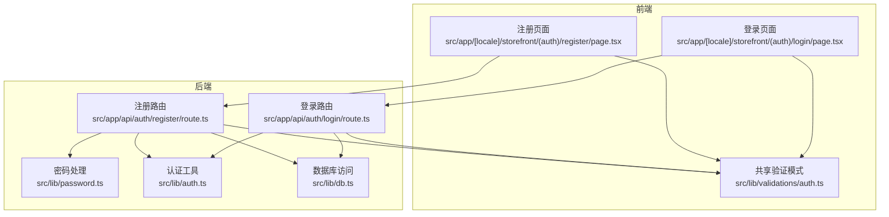
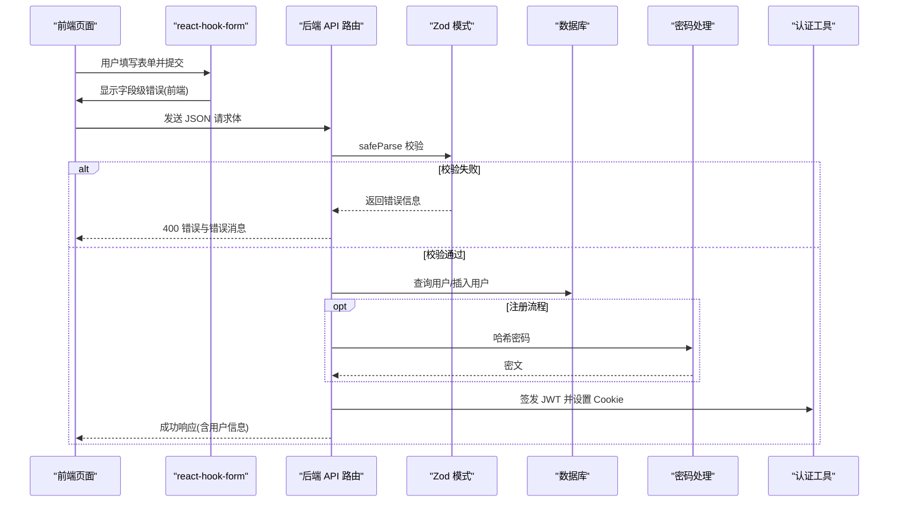
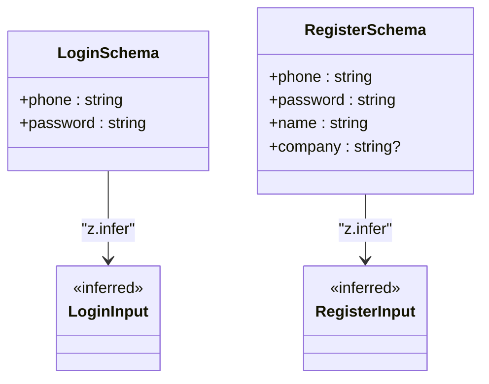
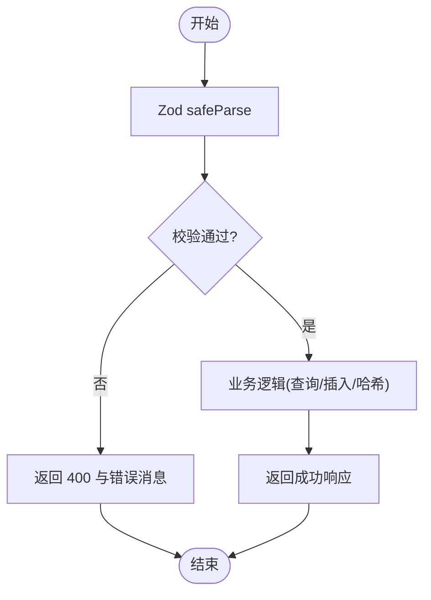
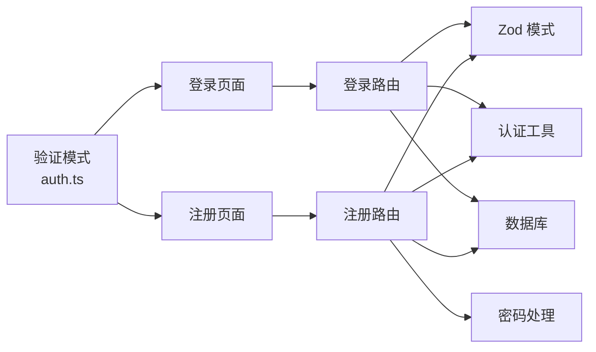

# 数据验证与模式

<cite>
**本文引用的文件**
- [src/lib/validations/auth.ts](file://src/lib/validations/auth.ts)
- [src/app/[locale]/storefront/(auth)/login/page.tsx](file://src/app/[locale]/storefront/(auth)/login/page.tsx)
- [src/app/[locale]/storefront/(auth)/register/page.tsx](file://src/app/[locale]/storefront/(auth)/register/page.tsx)
- [src/app/api/auth/login/route.ts](file://src/app/api/auth/login/route.ts)
- [src/app/api/auth/register/route.ts](file://src/app/api/auth/register/route.ts)
- [src/lib/password.ts](file://src/lib/password.ts)
- [src/lib/auth.ts](file://src/lib/auth.ts)
- [src/lib/db.ts](file://src/lib/db.ts)
- [src/types/index.ts](file://src/types/index.ts)
- [src/middleware.ts](file://src/middleware.ts)
- [src/lib/jwt-config.ts](file://src/lib/jwt-config.ts)
</cite>

## 目录
1. [引言](#引言)
2. [项目结构](#项目结构)
3. [核心组件](#核心组件)
4. [架构总览](#架构总览)
5. [详细组件分析](#详细组件分析)
6. [依赖关系分析](#依赖关系分析)
7. [性能考量](#性能考量)
8. [故障排查指南](#故障排查指南)
9. [结论](#结论)
10. [附录](#附录)

## 引言
本文件聚焦于 Celestia 认证系统的“数据验证与模式”模块，系统性梳理前端表单验证、后端 Zod 模式验证、密码处理、错误处理与用户体验优化，并给出扩展方法、最佳实践与性能优化建议。目标是帮助开发者在不直接阅读代码的情况下，也能快速理解并维护该验证体系。

## 项目结构
认证相关的关键位置如下：
- 前端页面：登录与注册页面分别定义了各自的表单验证模式，并通过 react-hook-form 与 zod-resolver 进行绑定。
- 后端 API：登录与注册接口均使用 Zod 模式进行请求体校验；注册流程还包含手机号唯一性检查与密码哈希处理。
- 共享验证：登录与注册共享同一套 Zod 模式，确保前后端一致的验证规则。
- 类型与响应：统一的响应接口类型与会话用户类型贯穿前后端。

图表来源
- [src/app/[locale]/storefront/(auth)/login/page.tsx](file://src/app/[locale]/storefront/(auth)/login/page.tsx#L1-L156)
- [src/app/[locale]/storefront/(auth)/register/page.tsx](file://src/app/[locale]/storefront/(auth)/register/page.tsx#L1-L214)
- [src/lib/validations/auth.ts:1-17](file://src/lib/validations/auth.ts#L1-L17)
- [src/app/api/auth/login/route.ts:1-76](file://src/app/api/auth/login/route.ts#L1-L76)
- [src/app/api/auth/register/route.ts:1-86](file://src/app/api/auth/register/route.ts#L1-L86)
- [src/lib/password.ts:1-18](file://src/lib/password.ts#L1-L18)
- [src/lib/auth.ts:1-98](file://src/lib/auth.ts#L1-L98)
- [src/lib/db.ts:1-18](file://src/lib/db.ts#L1-L18)

章节来源
- [src/lib/validations/auth.ts:1-17](file://src/lib/validations/auth.ts#L1-L17)
- [src/app/[locale]/storefront/(auth)/login/page.tsx](file://src/app/[locale]/storefront/(auth)/login/page.tsx#L1-L156)
- [src/app/[locale]/storefront/(auth)/register/page.tsx](file://src/app/[locale]/storefront/(auth)/register/page.tsx#L1-L214)
- [src/app/api/auth/login/route.ts:1-76](file://src/app/api/auth/login/route.ts#L1-L76)
- [src/app/api/auth/register/route.ts:1-86](file://src/app/api/auth/register/route.ts#L1-L86)
- [src/lib/password.ts:1-18](file://src/lib/password.ts#L1-L18)
- [src/lib/auth.ts:1-98](file://src/lib/auth.ts#L1-L98)
- [src/lib/db.ts:1-18](file://src/lib/db.ts#L1-L18)

## 核心组件
- Zod 验证模式
  - 登录模式：包含手机号与密码字段，限制长度与最小长度。
  - 注册模式：包含手机号、密码、姓名与可选公司名，限制长度与最小长度。
  - 类型推断：通过 z.infer 生成输入类型，保证前后端一致。
- 前端表单
  - 登录与注册页面各自定义了表单模式，并通过 zodResolver 绑定到 react-hook-form。
  - 注册页面额外使用 refine 实现“确认密码”一致性校验。
- 后端 API
  - 登录与注册接口均使用对应 Zod 模式进行 safeParse 校验。
  - 注册接口还执行手机号唯一性检查与密码哈希处理。
- 密码处理
  - 使用 bcryptjs 对密码进行哈希与验证。
- 认证与会话
  - 使用 jose 签发 JWT，设置 httpOnly Cookie，提供获取当前用户与清除 Cookie 的工具函数。
- 类型与响应
  - 统一的 ApiResponse 接口与 SessionUser 类型，便于前后端契约一致。

章节来源
- [src/lib/validations/auth.ts:1-17](file://src/lib/validations/auth.ts#L1-L17)
- [src/app/[locale]/storefront/(auth)/login/page.tsx](file://src/app/[locale]/storefront/(auth)/login/page.tsx#L13-L16)
- [src/app/[locale]/storefront/(auth)/register/page.tsx](file://src/app/[locale]/storefront/(auth)/register/page.tsx#L13-L22)
- [src/app/api/auth/login/route.ts:13-24](file://src/app/api/auth/login/route.ts#L13-L24)
- [src/app/api/auth/register/route.ts:9-19](file://src/app/api/auth/register/route.ts#L9-L19)
- [src/lib/password.ts:1-18](file://src/lib/password.ts#L1-L18)
- [src/lib/auth.ts:1-98](file://src/lib/auth.ts#L1-L98)
- [src/types/index.ts:1-60](file://src/types/index.ts#L1-L60)

## 架构总览
下图展示了从前端表单提交到后端验证与数据库交互的整体流程，以及错误处理与响应返回的关键节点。

图表来源
- [src/app/[locale]/storefront/(auth)/login/page.tsx](file://src/app/[locale]/storefront/(auth)/login/page.tsx#L52-L79)
- [src/app/[locale]/storefront/(auth)/register/page.tsx](file://src/app/[locale]/storefront/(auth)/register/page.tsx#L60-L89)
- [src/app/api/auth/login/route.ts:13-75](file://src/app/api/auth/login/route.ts#L13-L75)
- [src/app/api/auth/register/route.ts:9-85](file://src/app/api/auth/register/route.ts#L9-L85)
- [src/lib/validations/auth.ts:1-17](file://src/lib/validations/auth.ts#L1-L17)
- [src/lib/password.ts:1-18](file://src/lib/password.ts#L1-L18)
- [src/lib/auth.ts:1-98](file://src/lib/auth.ts#L1-L98)
- [src/lib/db.ts:1-18](file://src/lib/db.ts#L1-L18)

## 详细组件分析

### Zod 验证模式设计与实现
- 设计原则
  - 字段约束：必填、最大/最小长度、可选字段。
  - 类型安全：通过 z.infer 推导类型，避免手写重复类型。
  - 可复用：登录与注册模式在后端与前端共享，减少不一致风险。
- loginSchema
  - 字段 phone：字符串，最小长度与最大长度限制。
  - 字段 password：字符串，最小长度限制。
- registerSchema
  - 字段 phone：字符串，最小长度与最大长度限制。
  - 字段 password：字符串，最小长度限制。
  - 字段 name：字符串，最小长度与最大长度限制。
  - 字段 company：字符串，最大长度限制且可选。
- 类型推断
  - LoginInput/ RegisterInput：基于 Zod 模式的类型推断，确保前后端一致。

图表来源
- [src/lib/validations/auth.ts:3-13](file://src/lib/validations/auth.ts#L3-L13)
- [src/lib/validations/auth.ts:15-16](file://src/lib/validations/auth.ts#L15-L16)

章节来源
- [src/lib/validations/auth.ts:1-17](file://src/lib/validations/auth.ts#L1-L17)

### 手机号格式验证
- 当前实现
  - 前端与后端均采用字符串长度约束，未对手机号格式进行正则或更严格的格式校验。
- 建议
  - 在前端增加格式提示与输入限制（如仅允许数字、长度范围），在后端使用 Zod 的 refine 或 nativeEnum/regex 进行更严格校验。
  - 若需支持国际号码，可引入库（如 libphonenumber-js）并在 Zod 中封装自定义验证器。

章节来源
- [src/lib/validations/auth.ts:3-13](file://src/lib/validations/auth.ts#L3-L13)
- [src/app/[locale]/storefront/(auth)/login/page.tsx](file://src/app/[locale]/storefront/(auth)/login/page.tsx#L13-L16)
- [src/app/[locale]/storefront/(auth)/register/page.tsx](file://src/app/[locale]/storefront/(auth)/register/page.tsx#L13-L19)

### 密码强度检查
- 当前实现
  - 仅限制最小长度，未强制包含大小写字母、数字或特殊字符等强度要求。
- 建议
  - 在前端即时提示密码强度（长度、字符种类），在后端使用 Zod refine 结合正则表达式进行强约束。
  - 保持与注册页面的“确认密码”一致性校验配合。

章节来源
- [src/lib/validations/auth.ts:3-13](file://src/lib/validations/auth.ts#L3-L13)
- [src/app/[locale]/storefront/(auth)/register/page.tsx](file://src/app/[locale]/storefront/(auth)/register/page.tsx#L13-L22)

### 必填字段约束与数据类型验证
- 必填字段
  - 登录：phone、password。
  - 注册：phone、password、name。
- 数据类型
  - 所有字段均为字符串类型，后续可通过 Zod 的 transform 或 nativeEnum 等增强类型约束。
- 前端展示
  - react-hook-form 将字段错误映射到对应控件下方，提升即时反馈体验。

章节来源
- [src/lib/validations/auth.ts:3-13](file://src/lib/validations/auth.ts#L3-L13)
- [src/app/[locale]/storefront/(auth)/login/page.tsx](file://src/app/[locale]/storefront/(auth)/login/page.tsx#L99-L117)
- [src/app/[locale]/storefront/(auth)/register/page.tsx](file://src/app/[locale]/storefront/(auth)/register/page.tsx#L109-L175)

### 验证错误处理机制
- 前端
  - 表单级错误：通过 zodResolver 抛出字段级错误，UI 层渲染对应提示。
  - 网络错误：捕获 fetch 异常并显示通用网络错误提示。
- 后端
  - Zod 校验失败：返回 400，错误消息来自第一个问题项。
  - 业务异常：如手机号已存在（注册）、凭据无效（登录）、内部错误（500）。
  - 统一响应：使用 ApiResponse 接口，保证前后端契约一致。

图表来源
- [src/app/api/auth/login/route.ts:13-24](file://src/app/api/auth/login/route.ts#L13-L24)
- [src/app/api/auth/register/route.ts:9-19](file://src/app/api/auth/register/route.ts#L9-L19)
- [src/types/index.ts:1-7](file://src/types/index.ts#L1-L7)

章节来源
- [src/app/[locale]/storefront/(auth)/login/page.tsx](file://src/app/[locale]/storefront/(auth)/login/page.tsx#L52-L79)
- [src/app/[locale]/storefront/(auth)/register/page.tsx](file://src/app/[locale]/storefront/(auth)/register/page.tsx#L60-L89)
- [src/app/api/auth/login/route.ts:13-75](file://src/app/api/auth/login/route.ts#L13-L75)
- [src/app/api/auth/register/route.ts:9-85](file://src/app/api/auth/register/route.ts#L9-L85)
- [src/types/index.ts:1-7](file://src/types/index.ts#L1-L7)

### 错误消息本地化与用户体验优化
- 错误消息本地化
  - 当前错误消息为英文字符串；建议在后端根据 Accept-Language 或用户偏好语言动态选择本地化消息。
- 用户体验优化
  - 前端即时反馈：字段级错误与网络错误提示。
  - 提交态禁用按钮与加载指示器，避免重复提交。
  - 注册成功后引导至待审核页面，登录成功后根据状态跳转不同页面。

章节来源
- [src/app/[locale]/storefront/(auth)/login/page.tsx](file://src/app/[locale]/storefront/(auth)/login/page.tsx#L38-L79)
- [src/app/[locale]/storefront/(auth)/register/page.tsx](file://src/app/[locale]/storefront/(auth)/register/page.tsx#L43-L89)
- [src/app/api/auth/login/route.ts:64-67](file://src/app/api/auth/login/route.ts#L64-L67)

### 验证模式的扩展方法、自定义验证器与复杂业务规则
- 扩展方法
  - 在现有 loginSchema/registerSchema 基础上新增 refine 规则，如“确认密码”一致性。
  - 引入 transform 对输入进行清洗（如去除多余空格）。
- 自定义验证器
  - 使用 Zod 的 refine 或 regex 定义手机号格式、密码强度等规则。
  - 将常用规则抽象为可复用的 Zod 函数，集中管理。
- 复杂业务规则
  - 注册时的手机号唯一性检查、登录时的状态判断（ACTIVE/PENDING）。
  - 会话状态与权限控制结合中间件进行统一拦截。

章节来源
- [src/app/[locale]/storefront/(auth)/register/page.tsx](file://src/app/[locale]/storefront/(auth)/register/page.tsx#L19-L22)
- [src/app/api/auth/register/route.ts:23-33](file://src/app/api/auth/register/route.ts#L23-L33)
- [src/app/api/auth/login/route.ts:33-47](file://src/app/api/auth/login/route.ts#L33-L47)
- [src/middleware.ts:31-47](file://src/middleware.ts#L31-L47)

### 前后端验证一致性、错误反馈与调试工具
- 一致性
  - 登录与注册共享同一套 Zod 模式，减少前后端差异导致的联调成本。
- 错误反馈
  - 前端：字段级错误与网络错误提示。
  - 后端：统一 400/401/409/500 状态码与错误消息。
- 调试工具
  - 开发环境开启 Prisma 日志，便于定位数据库层问题。
  - 建议在 API 层增加日志记录请求体与响应体，便于排查。

章节来源
- [src/lib/validations/auth.ts:1-17](file://src/lib/validations/auth.ts#L1-L17)
- [src/lib/db.ts:12-15](file://src/lib/db.ts#L12-L15)
- [src/app/api/auth/login/route.ts:68-74](file://src/app/api/auth/login/route.ts#L68-L74)
- [src/app/api/auth/register/route.ts:78-84](file://src/app/api/auth/register/route.ts#L78-L84)

## 依赖关系分析
- 组件耦合
  - 前端页面依赖共享验证模式与 react-hook-form。
  - 后端路由依赖 Zod 模式、数据库与认证工具。
  - 密码处理与认证工具相互独立，职责清晰。
- 外部依赖
  - Zod：类型与验证。
  - bcryptjs：密码哈希与验证。
  - jose：JWT 签发与校验。
  - Prisma/PostgreSQL：数据持久化。
- 潜在循环依赖
  - 未发现直接循环导入；验证模式与工具函数分层清晰。

图表来源
- [src/lib/validations/auth.ts:1-17](file://src/lib/validations/auth.ts#L1-L17)
- [src/app/[locale]/storefront/(auth)/login/page.tsx](file://src/app/[locale]/storefront/(auth)/login/page.tsx#L1-L156)
- [src/app/[locale]/storefront/(auth)/register/page.tsx](file://src/app/[locale]/storefront/(auth)/register/page.tsx#L1-L214)
- [src/app/api/auth/login/route.ts:1-76](file://src/app/api/auth/login/route.ts#L1-L76)
- [src/app/api/auth/register/route.ts:1-86](file://src/app/api/auth/register/route.ts#L1-L86)
- [src/lib/password.ts:1-18](file://src/lib/password.ts#L1-L18)
- [src/lib/auth.ts:1-98](file://src/lib/auth.ts#L1-L98)
- [src/lib/db.ts:1-18](file://src/lib/db.ts#L1-L18)

章节来源
- [src/lib/validations/auth.ts:1-17](file://src/lib/validations/auth.ts#L1-L17)
- [src/app/api/auth/login/route.ts:1-76](file://src/app/api/auth/login/route.ts#L1-L76)
- [src/app/api/auth/register/route.ts:1-86](file://src/app/api/auth/register/route.ts#L1-L86)
- [src/lib/password.ts:1-18](file://src/lib/password.ts#L1-L18)
- [src/lib/auth.ts:1-98](file://src/lib/auth.ts#L1-L98)
- [src/lib/db.ts:1-18](file://src/lib/db.ts#L1-L18)

## 性能考量
- 前端
  - 使用 zodResolver 与 react-hook-form，避免不必要的重渲染；在高频输入场景中可考虑防抖。
- 后端
  - Zod 解析为 O(n)（n 为字段数），通常可忽略；数据库查询为瓶颈时，优先优化索引与查询语句。
  - 密码哈希使用固定轮数，注意在高并发下的 CPU 占用，必要时考虑异步队列或降级策略。
- 缓存与幂等
  - 对于重复的校验结果（如手机号唯一性），可在缓存层做短期缓存以降低数据库压力。

## 故障排查指南
- 常见问题
  - 400 错误：请求体不符合 Zod 模式，检查字段名称与类型。
  - 401 错误：登录凭据无效或用户不存在。
  - 409 错误：注册手机号已存在。
  - 500 错误：服务器内部异常，查看后端日志。
- 调试步骤
  - 前端：确认 zodResolver 是否正确绑定，字段错误是否被正确渲染。
  - 后端：打印请求体与 Zod 解析结果，检查 Prisma 查询与数据库连接。
  - 认证：确认 Cookie 是否正确设置，JWT 秘钥是否配置。

章节来源
- [src/app/api/auth/login/route.ts:13-75](file://src/app/api/auth/login/route.ts#L13-L75)
- [src/app/api/auth/register/route.ts:9-85](file://src/app/api/auth/register/route.ts#L9-L85)
- [src/lib/db.ts:12-15](file://src/lib/db.ts#L12-L15)
- [src/lib/jwt-config.ts:1-8](file://src/lib/jwt-config.ts#L1-L8)

## 结论
本验证体系以 Zod 为核心，结合 react-hook-form 实现了前后端一致的表单验证与错误反馈。通过共享模式与统一响应类型，提升了开发效率与一致性。建议在后续迭代中增强手机号格式与密码强度校验、完善错误消息本地化与会话状态控制，并持续优化性能与可维护性。

## 附录
- 最佳实践
  - 始终在前后端同时进行验证，前端用于即时反馈，后端用于安全边界。
  - 使用 Zod 的 refine 与 transform 扩展复杂规则与数据清洗。
  - 将常用验证规则抽象为可复用模块，集中管理。
- 常见场景
  - 登录：校验手机号与密码，核验用户状态，签发 JWT。
  - 注册：校验基本信息与确认密码，检查手机号唯一性，哈希密码并创建用户。
- 调试建议
  - 开启 Prisma 日志，记录关键请求与响应。
  - 在 API 层增加统一错误包装与上下文日志。