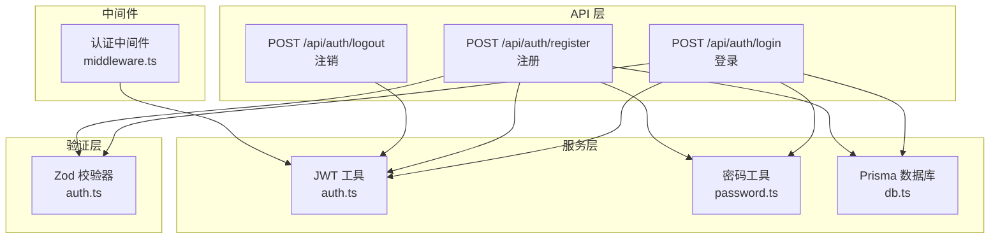
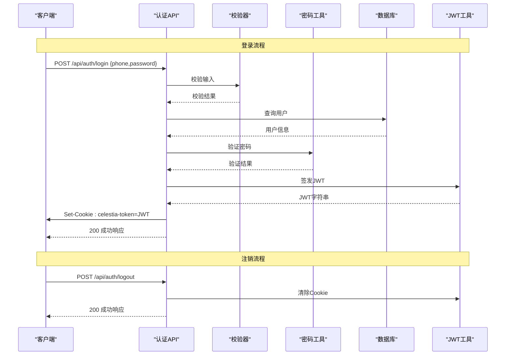
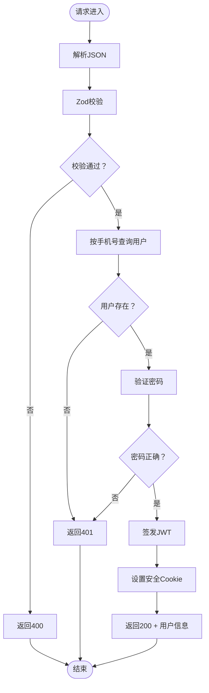
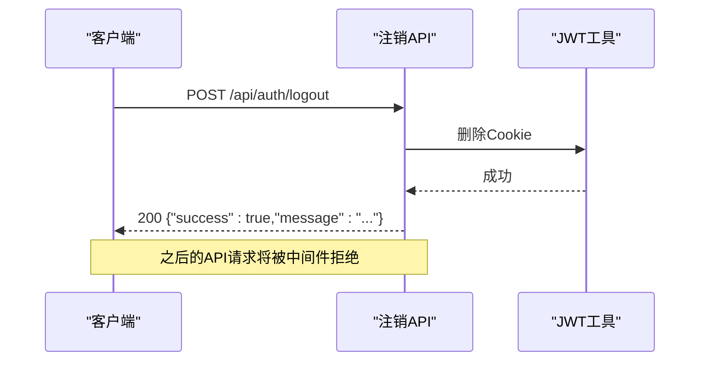
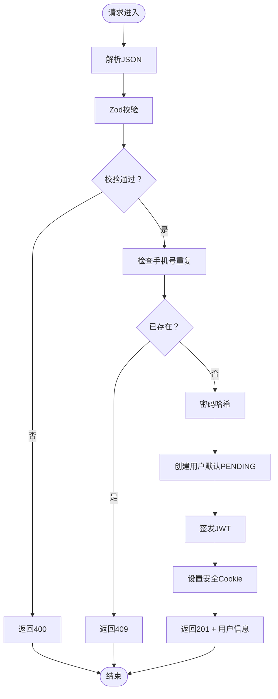
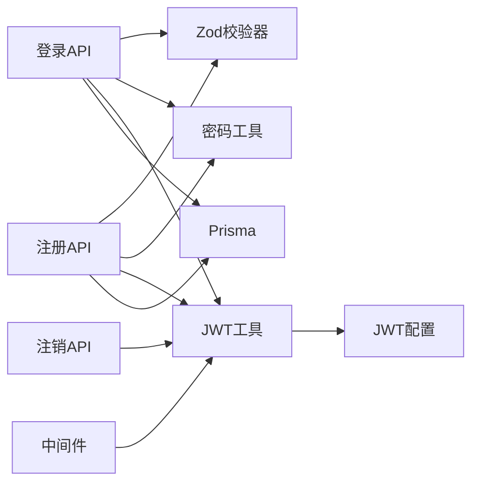

# 用户认证API

<cite>
**本文档引用的文件**
- [src/app/api/auth/login/route.ts](file://src/app/api/auth/login/route.ts)
- [src/app/api/auth/register/route.ts](file://src/app/api/auth/register/route.ts)
- [src/app/api/auth/logout/route.ts](file://src/app/api/auth/logout/route.ts)
- [src/lib/validations/auth.ts](file://src/lib/validations/auth.ts)
- [src/lib/auth.ts](file://src/lib/auth.ts)
- [src/lib/password.ts](file://src/lib/password.ts)
- [src/lib/jwt-config.ts](file://src/lib/jwt-config.ts)
- [src/middleware.ts](file://src/middleware.ts)
- [src/types/index.ts](file://src/types/index.ts)
</cite>

## 目录
1. [简介](#简介)
2. [项目结构](#项目结构)
3. [核心组件](#核心组件)
4. [架构总览](#架构总览)
5. [详细组件分析](#详细组件分析)
6. [依赖关系分析](#依赖关系分析)
7. [性能考虑](#性能考虑)
8. [故障排除指南](#故障排除指南)
9. [结论](#结论)
10. [附录](#附录)

## 简介
本文件为 Celestia 用户认证API的权威技术文档，覆盖登录、注销、注册三大核心端点的设计与实现细节。内容包括：
- 请求参数与响应格式规范
- 错误处理策略与状态码说明
- 令牌签发与Cookie管理机制
- 数据验证规则与重复用户检查流程
- 完整的请求/响应示例与最佳实践
- 客户端调用指南与常见问题解答

## 项目结构
认证相关代码采用按功能模块组织的方式，核心文件分布如下：
- API端点：位于 `src/app/api/auth/{login,register,logout}/route.ts`
- 数据校验：位于 `src/lib/validations/auth.ts`
- 认证工具：位于 `src/lib/auth.ts`、`src/lib/password.ts`、`src/lib/jwt-config.ts`
- 中间件：位于 `src/middleware.ts`
- 类型定义：位于 `src/types/index.ts`

图表来源
- [src/app/api/auth/login/route.ts:1-76](file://src/app/api/auth/login/route.ts#L1-L76)
- [src/app/api/auth/register/route.ts:1-84](file://src/app/api/auth/register/route.ts#L1-L84)
- [src/app/api/auth/logout/route.ts:1-22](file://src/app/api/auth/logout/route.ts#L1-L22)
- [src/lib/validations/auth.ts:1-17](file://src/lib/validations/auth.ts#L1-L17)
- [src/lib/auth.ts:1-98](file://src/lib/auth.ts#L1-L98)
- [src/lib/password.ts:1-18](file://src/lib/password.ts#L1-L18)
- [src/middleware.ts:1-148](file://src/middleware.ts#L1-L148)

章节来源
- [src/app/api/auth/login/route.ts:1-76](file://src/app/api/auth/login/route.ts#L1-L76)
- [src/app/api/auth/register/route.ts:1-84](file://src/app/api/auth/register/route.ts#L1-L84)
- [src/app/api/auth/logout/route.ts:1-22](file://src/app/api/auth/logout/route.ts#L1-L22)
- [src/lib/validations/auth.ts:1-17](file://src/lib/validations/auth.ts#L1-L17)
- [src/lib/auth.ts:1-98](file://src/lib/auth.ts#L1-L98)
- [src/lib/password.ts:1-18](file://src/lib/password.ts#L1-L18)
- [src/lib/jwt-config.ts:1-9](file://src/lib/jwt-config.ts#L1-L9)
- [src/middleware.ts:1-148](file://src/middleware.ts#L1-L148)
- [src/types/index.ts:1-60](file://src/types/index.ts#L1-L60)

## 核心组件
- 登录端点：接收手机号与密码，验证后签发JWT并写入安全Cookie
- 注册端点：接收手机号、密码、姓名、可选公司，进行重复性检查与密码加密后创建用户
- 注销端点：清除认证Cookie，使当前会话失效
- 校验器：使用Zod对输入参数进行严格校验
- 认证工具：封装JWT签发/验证、Cookie设置/删除、用户查询
- 中间件：统一拦截API请求，校验JWT有效性并控制访问权限

章节来源
- [src/app/api/auth/login/route.ts:13-75](file://src/app/api/auth/login/route.ts#L13-L75)
- [src/app/api/auth/register/route.ts:8-83](file://src/app/api/auth/register/route.ts#L8-L83)
- [src/app/api/auth/logout/route.ts:5-21](file://src/app/api/auth/logout/route.ts#L5-L21)
- [src/lib/validations/auth.ts:3-13](file://src/lib/validations/auth.ts#L3-L13)
- [src/lib/auth.ts:10-52](file://src/lib/auth.ts#L10-L52)
- [src/middleware.ts:31-47](file://src/middleware.ts#L31-L47)

## 架构总览
认证系统采用“无状态令牌 + 服务端Cookie”的方案：
- 客户端通过登录接口获取JWT并存储在HttpOnly Cookie中
- 后续API请求由中间件自动校验Cookie中的JWT
- 注销时清除Cookie即刻失效，无需服务端维护黑名单

图表来源
- [src/app/api/auth/login/route.ts:13-75](file://src/app/api/auth/login/route.ts#L13-L75)
- [src/app/api/auth/logout/route.ts:5-21](file://src/app/api/auth/logout/route.ts#L5-L21)
- [src/lib/validations/auth.ts:3-6](file://src/lib/validations/auth.ts#L3-L6)
- [src/lib/password.ts:15-17](file://src/lib/password.ts#L15-L17)
- [src/lib/auth.ts:35-52](file://src/lib/auth.ts#L35-L52)
- [src/lib/jwt-config.ts:6-8](file://src/lib/jwt-config.ts#L6-L8)

## 详细组件分析

### 登录 API（POST /api/auth/login）
- 功能概述：验证手机号与密码，成功后签发JWT并设置安全Cookie
- 请求参数
  - phone: 字符串，长度5-20，必填
  - password: 字符串，至少6位，必填
- 响应数据
  - success: 布尔值
  - data: 包含用户标识、手机号、姓名、角色、markupRatio、preferredLang、status
  - message: 成功提示
- 状态码
  - 200：登录成功
  - 400：请求参数无效
  - 401：手机号或密码错误
  - 500：服务器内部错误
- 关键流程
  1) 解析JSON请求体
  2) 使用Zod校验器校验参数
  3) 查询用户并验证密码
  4) 签发JWT并设置Cookie
  5) 返回用户信息与状态

图表来源
- [src/app/api/auth/login/route.ts:13-75](file://src/app/api/auth/login/route.ts#L13-L75)
- [src/lib/validations/auth.ts:3-6](file://src/lib/validations/auth.ts#L3-L6)
- [src/lib/password.ts:15-17](file://src/lib/password.ts#L15-L17)
- [src/lib/auth.ts:35-52](file://src/lib/auth.ts#L35-L52)

章节来源
- [src/app/api/auth/login/route.ts:13-75](file://src/app/api/auth/login/route.ts#L13-L75)
- [src/lib/validations/auth.ts:3-6](file://src/lib/validations/auth.ts#L3-L6)
- [src/lib/password.ts:15-17](file://src/lib/password.ts#L15-L17)
- [src/lib/auth.ts:35-52](file://src/lib/auth.ts#L35-L52)
- [src/types/index.ts:51-59](file://src/types/index.ts#L51-L59)

### 注销 API（POST /api/auth/logout）
- 功能概述：清除认证Cookie，使当前会话立即失效
- 行为说明
  - 清除名为 celestia-token 的HttpOnly Cookie
  - 不需要请求体
- 响应数据
  - success: 布尔值
  - message: 成功提示
- 状态码
  - 200：注销成功
  - 500：服务器内部错误
- 令牌失效机制
  - 由于使用HttpOnly Cookie存储JWT，清除Cookie即可使前端无法携带令牌
  - 中间件将拒绝无有效令牌的后续API请求

图表来源
- [src/app/api/auth/logout/route.ts:5-21](file://src/app/api/auth/logout/route.ts#L5-L21)
- [src/lib/auth.ts:49-52](file://src/lib/auth.ts#L49-L52)
- [src/middleware.ts:31-47](file://src/middleware.ts#L31-L47)

章节来源
- [src/app/api/auth/logout/route.ts:5-21](file://src/app/api/auth/logout/route.ts#L5-L21)
- [src/lib/auth.ts:49-52](file://src/lib/auth.ts#L49-L52)
- [src/middleware.ts:31-47](file://src/middleware.ts#L31-L47)

### 注册 API（POST /api/auth/register）
- 功能概述：创建新用户，进行重复性检查与密码加密
- 请求参数
  - phone: 字符串，长度5-20，必填
  - password: 字符串，至少6位，必填
  - name: 字符串，长度1-100，必填
  - company: 字符串，最大200，可选
- 响应数据
  - success: 布尔值
  - data: 包含用户标识、手机号、姓名、角色、markupRatio、preferredLang
  - message: 成功提示
- 状态码
  - 201：注册成功
  - 400：请求参数无效
  - 409：手机号已被注册
  - 500：服务器内部错误
- 关键流程
  1) 解析JSON请求体
  2) 使用Zod校验器校验参数
  3) 检查手机号是否已存在
  4) 对密码进行哈希处理
  5) 创建用户（默认角色为CUSTOMER，状态为PENDING）
  6) 签发JWT并设置Cookie
  7) 返回用户信息

图表来源
- [src/app/api/auth/register/route.ts:8-83](file://src/app/api/auth/register/route.ts#L8-L83)
- [src/lib/validations/auth.ts:8-13](file://src/lib/validations/auth.ts#L8-L13)
- [src/lib/password.ts:8-10](file://src/lib/password.ts#L8-L10)
- [src/lib/auth.ts:35-52](file://src/lib/auth.ts#L35-L52)

章节来源
- [src/app/api/auth/register/route.ts:8-83](file://src/app/api/auth/register/route.ts#L8-L83)
- [src/lib/validations/auth.ts:8-13](file://src/lib/validations/auth.ts#L8-L13)
- [src/lib/password.ts:8-10](file://src/lib/password.ts#L8-L10)
- [src/lib/auth.ts:35-52](file://src/lib/auth.ts#L35-L52)
- [src/types/index.ts:51-59](file://src/types/index.ts#L51-L59)

### 数据模型与类型
- 通用响应格式
  - success: 布尔值
  - data: 可选的数据对象
  - error: 可选的错误信息
  - message: 可选的消息
- 会话用户类型（SessionUser）
  - id: 用户唯一标识
  - phone: 手机号
  - name: 姓名
  - role: 角色（ADMIN/CUSTOMER）
  - status: 状态（PENDING/ACTIVE）
  - markupRatio: 浮点数以字符串形式表示
  - preferredLang: 语言偏好

章节来源
- [src/types/index.ts:1-7](file://src/types/index.ts#L1-L7)
- [src/types/index.ts:51-59](file://src/types/index.ts#L51-L59)

## 依赖关系分析
- 组件耦合
  - API端点依赖校验器、密码工具、JWT工具与数据库
  - 中间件依赖JWT工具进行令牌验证
  - Cookie名称与过期时间集中配置于jwt-config
- 外部依赖
  - jose：JWT签发与验证
  - bcryptjs：密码哈希与比较
  - zod：输入参数校验
  - Prisma：数据库访问

图表来源
- [src/app/api/auth/login/route.ts:1-76](file://src/app/api/auth/login/route.ts#L1-L76)
- [src/app/api/auth/register/route.ts:1-84](file://src/app/api/auth/register/route.ts#L1-L84)
- [src/app/api/auth/logout/route.ts:1-22](file://src/app/api/auth/logout/route.ts#L1-L22)
- [src/lib/validations/auth.ts:1-17](file://src/lib/validations/auth.ts#L1-L17)
- [src/lib/password.ts:1-18](file://src/lib/password.ts#L1-L18)
- [src/lib/auth.ts:1-98](file://src/lib/auth.ts#L1-L98)
- [src/lib/jwt-config.ts:1-9](file://src/lib/jwt-config.ts#L1-L9)
- [src/middleware.ts:1-148](file://src/middleware.ts#L1-L148)

章节来源
- [src/app/api/auth/login/route.ts:1-76](file://src/app/api/auth/login/route.ts#L1-L76)
- [src/app/api/auth/register/route.ts:1-84](file://src/app/api/auth/register/route.ts#L1-L84)
- [src/app/api/auth/logout/route.ts:1-22](file://src/app/api/auth/logout/route.ts#L1-L22)
- [src/lib/validations/auth.ts:1-17](file://src/lib/validations/auth.ts#L1-L17)
- [src/lib/auth.ts:1-98](file://src/lib/auth.ts#L1-L98)
- [src/lib/jwt-config.ts:1-9](file://src/lib/jwt-config.ts#L1-L9)
- [src/middleware.ts:1-148](file://src/middleware.ts#L1-L148)

## 性能考虑
- 密码哈希成本：使用固定轮数的哈希算法，平衡安全性与性能
- JWT有效期：默认7天，建议结合业务场景调整
- Cookie属性：HttpOnly防止XSS窃取，Secure仅生产环境启用
- 数据库查询：登录与注册均基于手机号索引查询，避免全表扫描
- 中间件拦截：统一认证逻辑减少重复代码

## 故障排除指南
- 400 错误（参数无效）
  - 检查请求体是否为合法JSON
  - 确认字段长度与格式符合校验规则
- 401 错误（未授权/凭据无效）
  - 确认手机号与密码正确
  - 检查Cookie是否被正确发送
- 409 错误（手机号已注册）
  - 提示用户更换手机号或引导登录
- 500 错误（服务器内部错误）
  - 查看服务端日志定位异常
  - 检查数据库连接与JWT密钥配置
- Cookie相关问题
  - 确保浏览器允许第三方Cookie（如跨域）
  - 生产环境务必启用HTTPS以支持Secure Cookie

章节来源
- [src/app/api/auth/login/route.ts:18-24](file://src/app/api/auth/login/route.ts#L18-L24)
- [src/app/api/auth/register/route.ts:13-19](file://src/app/api/auth/register/route.ts#L13-L19)
- [src/app/api/auth/register/route.ts:28-33](file://src/app/api/auth/register/route.ts#L28-L33)
- [src/lib/auth.ts:35-52](file://src/lib/auth.ts#L35-L52)
- [src/lib/jwt-config.ts:6-8](file://src/lib/jwt-config.ts#L6-L8)

## 结论
本认证体系以Zod校验确保输入质量，bcrypt保障密码安全，JWT配合HttpOnly Cookie实现无状态认证，并通过中间件统一拦截与权限控制。整体设计简洁可靠，易于扩展与维护。

## 附录

### 请求/响应示例

- 登录成功响应
  - 状态码：200
  - 示例数据：
    - success: true
    - data: {id, phone, name, role, markupRatio, preferredLang, status}
    - message: "登录成功"

- 注册成功响应
  - 状态码：201
  - 示例数据：
    - success: true
    - data: {id, phone, name, role, markupRatio, preferredLang}
    - message: "注册成功"

- 典型错误响应
  - 参数无效：400，{success:false, error:"字段校验失败信息"}
  - 凭据无效：401，{success:false, error:"手机号或密码错误"}
  - 用户已存在：409，{success:false, error:"手机号已被注册"}
  - 服务器错误：500，{success:false, error:"内部错误"}

### 最佳实践
- 客户端
  - 使用HTTPS传输，确保Cookie Secure生效
  - 在每次请求时自动携带Cookie
  - 登录成功后跳转至受保护页面
  - 注销后清除本地存储的敏感数据
- 服务端
  - 严格配置JWT_SECRET与Cookie过期时间
  - 对敏感操作增加二次确认
  - 记录必要的审计日志但不泄露敏感信息