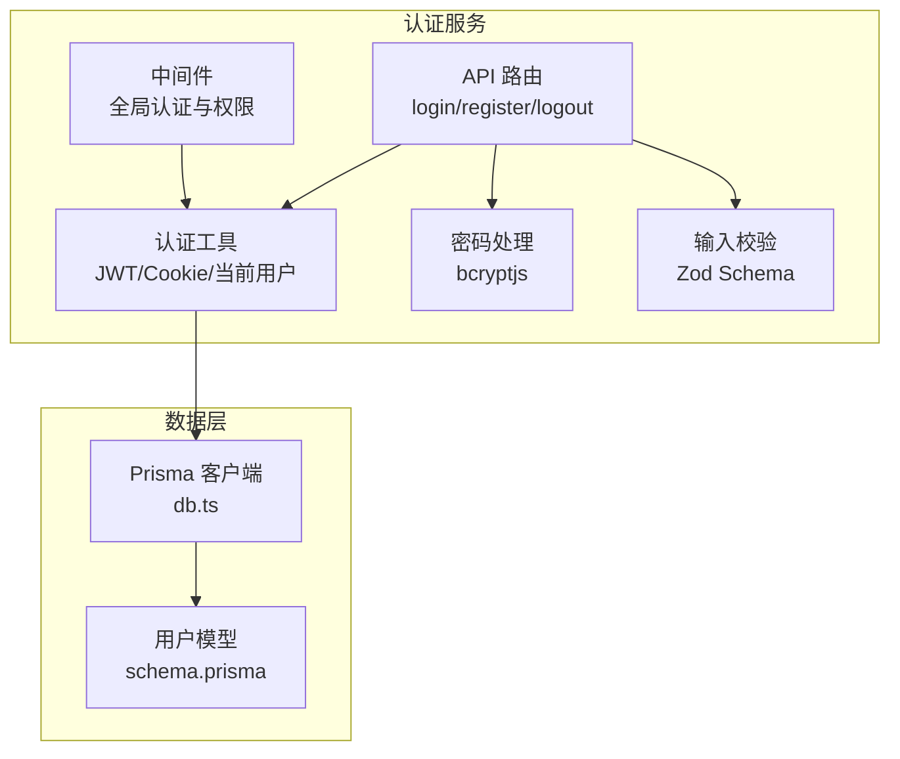
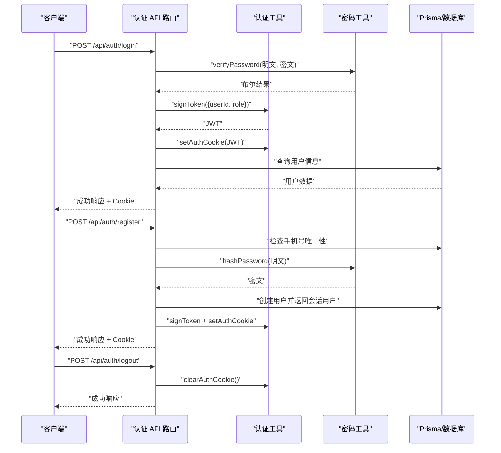
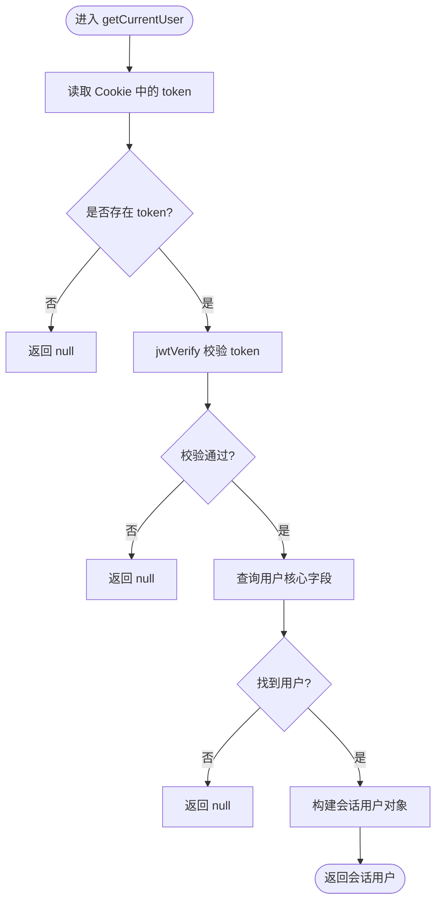
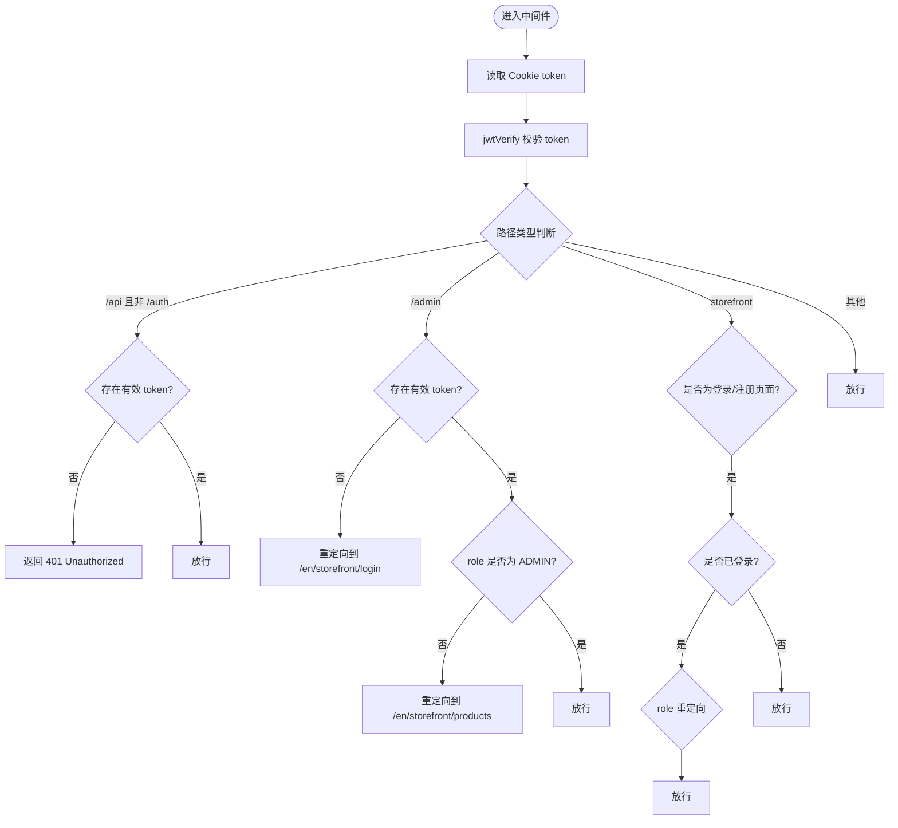
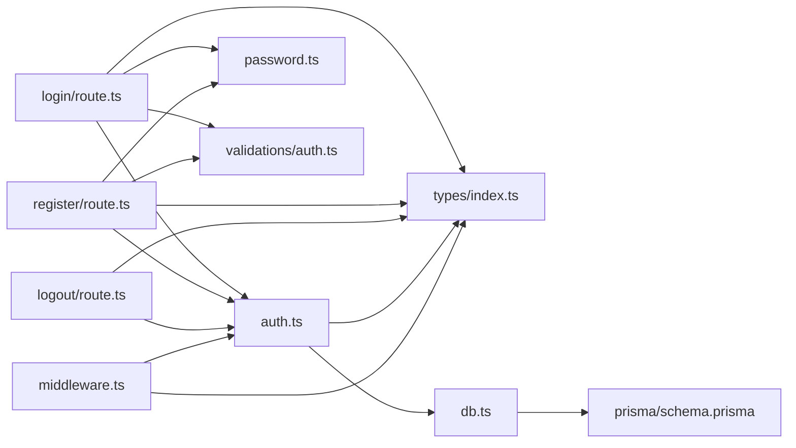

# 认证系统

<cite>
**本文引用的文件**
- [src/lib/auth.ts](file://src/lib/auth.ts)
- [src/lib/password.ts](file://src/lib/password.ts)
- [src/lib/db.ts](file://src/lib/db.ts)
- [src/lib/validations/auth.ts](file://src/lib/validations/auth.ts)
- [src/middleware.ts](file://src/middleware.ts)
- [src/types/index.ts](file://src/types/index.ts)
- [src/app/api/auth/login/route.ts](file://src/app/api/auth/login/route.ts)
- [src/app/api/auth/register/route.ts](file://src/app/api/auth/register/route.ts)
- [src/app/api/auth/logout/route.ts](file://src/app/api/auth/logout/route.ts)
- [src/lib/actions/auth.ts](file://src/lib/actions/auth.ts)
- [prisma/schema.prisma](file://prisma/schema.prisma)
</cite>

## 目录
1. [简介](#简介)
2. [项目结构](#项目结构)
3. [核心组件](#核心组件)
4. [架构总览](#架构总览)
5. [详细组件分析](#详细组件分析)
6. [依赖关系分析](#依赖关系分析)
7. [性能考量](#性能考量)
8. [故障排查指南](#故障排查指南)
9. [结论](#结论)
10. [附录](#附录)

## 简介
本文件为 Celestia 认证系统的完整技术文档，覆盖用户注册与登录流程、JWT 令牌管理、会话与权限控制、API 设计与错误处理、认证中间件与路由保护、以及安全策略与最佳实践。系统采用 Next.js App Router 的 API 路由与中间件进行统一认证与权限控制，并使用 Prisma 作为数据访问层。

## 项目结构
认证相关的核心文件分布如下：
- 路由层：登录、注册、登出 API 路由位于 src/app/api/auth/
- 认证工具：JWT 签发/校验、Cookie 管理、当前用户查询位于 src/lib/auth.ts
- 密码处理：bcryptjs 加密与校验位于 src/lib/password.ts
- 数据访问：Prisma 客户端初始化位于 src/lib/db.ts
- 输入校验：Zod Schema 定义位于 src/lib/validations/auth.ts
- 中间件：全局认证与权限控制位于 src/middleware.ts
- 类型定义：通用响应格式、JWT 载荷、会话用户类型位于 src/types/index.ts
- 数据模型：用户表结构定义位于 prisma/schema.prisma

图表来源
- [src/app/api/auth/login/route.ts:1-75](file://src/app/api/auth/login/route.ts#L1-L75)
- [src/app/api/auth/register/route.ts:1-84](file://src/app/api/auth/register/route.ts#L1-L84)
- [src/app/api/auth/logout/route.ts:1-22](file://src/app/api/auth/logout/route.ts#L1-L22)
- [src/lib/auth.ts:1-99](file://src/lib/auth.ts#L1-L99)
- [src/lib/password.ts:1-18](file://src/lib/password.ts#L1-L18)
- [src/lib/validations/auth.ts:1-17](file://src/lib/validations/auth.ts#L1-L17)
- [src/middleware.ts:1-112](file://src/middleware.ts#L1-L112)
- [src/lib/db.ts:1-12](file://src/lib/db.ts#L1-L12)
- [prisma/schema.prisma:89-106](file://prisma/schema.prisma#L89-L106)

章节来源
- [src/app/api/auth/login/route.ts:1-75](file://src/app/api/auth/login/route.ts#L1-L75)
- [src/app/api/auth/register/route.ts:1-84](file://src/app/api/auth/register/route.ts#L1-L84)
- [src/app/api/auth/logout/route.ts:1-22](file://src/app/api/auth/logout/route.ts#L1-L22)
- [src/lib/auth.ts:1-99](file://src/lib/auth.ts#L1-L99)
- [src/lib/password.ts:1-18](file://src/lib/password.ts#L1-L18)
- [src/lib/validations/auth.ts:1-17](file://src/lib/validations/auth.ts#L1-L17)
- [src/middleware.ts:1-112](file://src/middleware.ts#L1-L112)
- [src/lib/db.ts:1-12](file://src/lib/db.ts#L1-L12)
- [prisma/schema.prisma:89-106](file://prisma/schema.prisma#L89-L106)

## 核心组件
- JWT 令牌管理
  - 签发：基于 HS256 算法，载荷包含 userId 与 role，有效期 7 天
  - 校验：使用相同密钥验证签名与过期时间
  - 存储：通过 httpOnly、secure、sameSite=lax 的 Cookie 保存，路径为根路径，最大存活时间为 7 天
- 密码加密与校验
  - 使用 bcryptjs，盐值轮数为 12，确保安全性与性能平衡
- 会话与当前用户
  - 从 Cookie 读取并校验 JWT，随后查询数据库返回会话用户信息
- API 路由
  - 登录：校验输入、查询用户、校验密码、签发 JWT 并设置 Cookie
  - 注册：校验输入、检查手机号唯一性、加密密码、创建用户、签发 JWT 并设置 Cookie
  - 登出：清除认证 Cookie
- 中间件
  - 对 /api（除 /api/auth/*）进行认证拦截
  - 对 /admin 进行角色限制（仅 ADMIN）
  - 对 storefront 路由进行登录态与角色重定向控制
- 类型与校验
  - 统一响应格式 ApiResponse
  - JWT 载荷 JwtPayload
  - 会话用户 SessionUser
  - Zod 登录/注册 Schema

章节来源
- [src/lib/auth.ts:6-55](file://src/lib/auth.ts#L6-L55)
- [src/lib/password.ts:3-17](file://src/lib/password.ts#L3-L17)
- [src/app/api/auth/login/route.ts:13-75](file://src/app/api/auth/login/route.ts#L13-L75)
- [src/app/api/auth/register/route.ts:8-84](file://src/app/api/auth/register/route.ts#L8-L84)
- [src/app/api/auth/logout/route.ts:5-21](file://src/app/api/auth/logout/route.ts#L5-L21)
- [src/middleware.ts:33-102](file://src/middleware.ts#L33-L102)
- [src/types/index.ts:2-57](file://src/types/index.ts#L2-L57)
- [src/lib/validations/auth.ts:3-13](file://src/lib/validations/auth.ts#L3-L13)

## 架构总览
认证系统采用“API 路由 + 中间件 + 工具函数”的分层架构：
- API 层负责业务入口与数据持久化
- 工具层负责 JWT、Cookie、当前用户与密码处理
- 中间件层负责全局认证与权限控制
- 类型与校验层保证接口一致性与输入安全

图表来源
- [src/app/api/auth/login/route.ts:13-75](file://src/app/api/auth/login/route.ts#L13-L75)
- [src/app/api/auth/register/route.ts:8-84](file://src/app/api/auth/register/route.ts#L8-L84)
- [src/app/api/auth/logout/route.ts:5-21](file://src/app/api/auth/logout/route.ts#L5-L21)
- [src/lib/auth.ts:13-55](file://src/lib/auth.ts#L13-L55)
- [src/lib/password.ts:8-17](file://src/lib/password.ts#L8-L17)
- [src/lib/db.ts:1-12](file://src/lib/db.ts#L1-L12)

## 详细组件分析

### JWT 与 Cookie 管理
- 签发与校验
  - 使用 HS256 算法，密钥来自环境变量，未配置时使用回退密钥
  - 载荷包含 userId、role、签发时间与过期时间
- Cookie 策略
  - httpOnly 防止 XSS 读取
  - secure 在生产环境启用，要求 HTTPS
  - sameSite=lax 平衡 CSRF 与第三方场景
  - maxAge=7 天，路径为根路径
- 当前用户
  - 从 Cookie 读取 JWT，校验失败或用户不存在则返回空
  - 从数据库查询用户核心字段并转换为会话用户对象

图表来源
- [src/lib/auth.ts:60-98](file://src/lib/auth.ts#L60-L98)

章节来源
- [src/lib/auth.ts:6-55](file://src/lib/auth.ts#L6-L55)
- [src/lib/auth.ts:60-98](file://src/lib/auth.ts#L60-L98)

### 密码加密与校验
- 加密
  - 使用 bcryptjs，固定盐值轮数为 12
- 校验
  - 将明文与数据库中的哈希值比较，返回布尔结果

章节来源
- [src/lib/password.ts:3-17](file://src/lib/password.ts#L3-L17)

### API 端点设计

#### 登录
- 方法与路径
  - POST /api/auth/login
- 请求体
  - 字段 phone、password，使用 Zod 校验
- 成功响应
  - 状态码 200，data 包含会话用户信息与用户状态
- 错误响应
  - 400：请求体校验失败
  - 401：用户名或密码错误
  - 500：服务器内部错误

章节来源
- [src/app/api/auth/login/route.ts:13-75](file://src/app/api/auth/login/route.ts#L13-L75)
- [src/lib/validations/auth.ts:3-6](file://src/lib/validations/auth.ts#L3-L6)
- [src/types/index.ts:2-7](file://src/types/index.ts#L2-L7)

#### 注册
- 方法与路径
  - POST /api/auth/register
- 请求体
  - 字段 phone、password、name、company（可选），使用 Zod 校验
- 成功响应
  - 状态码 201，data 包含会话用户信息
- 错误响应
  - 400：请求体校验失败
  - 409：手机号已注册
  - 500：服务器内部错误

章节来源
- [src/app/api/auth/register/route.ts:8-84](file://src/app/api/auth/register/route.ts#L8-L84)
- [src/lib/validations/auth.ts:8-13](file://src/lib/validations/auth.ts#L8-L13)
- [src/types/index.ts:2-7](file://src/types/index.ts#L2-L7)

#### 登出
- 方法与路径
  - POST /api/auth/logout
- 成功响应
  - 状态码 200
- 错误响应
  - 500：服务器内部错误

章节来源
- [src/app/api/auth/logout/route.ts:5-21](file://src/app/api/auth/logout/route.ts#L5-L21)

### 中间件与路由保护
- 全局 API 认证
  - 对 /api（除 /api/auth/*）进行认证拦截，无有效 token 返回 401
- 管理后台权限
  - 对 /admin 路由进行角色限制，非 ADMIN 角色重定向至商品列表
- Storefront 路由保护
  - 登录/注册页面：已登录用户按角色重定向
  - 其他 storefront 页面：未登录重定向至登录页
- 匹配器
  - 监听 /api/:path*、/admin/:path*、/:locale/storefront/:path*

图表来源
- [src/middleware.ts:33-102](file://src/middleware.ts#L33-L102)

章节来源
- [src/middleware.ts:7-112](file://src/middleware.ts#L7-L112)

### 权限控制与会话管理
- 角色枚举
  - ADMIN、CUSTOMER
- 用户状态
  - PENDING、ACTIVE
- 会话用户
  - 包含 id、phone、name、role、markupRatio（字符串形式）、preferredLang
- Server Actions
  - 提供 getSession 与 logout（Server Action），用于客户端组件安全调用

章节来源
- [prisma/schema.prisma:16-24](file://prisma/schema.prisma#L16-L24)
- [src/types/index.ts:41-57](file://src/types/index.ts#L41-L57)
- [src/lib/actions/auth.ts:10-20](file://src/lib/actions/auth.ts#L10-L20)

## 依赖关系分析

图表来源
- [src/app/api/auth/login/route.ts:1-75](file://src/app/api/auth/login/route.ts#L1-L75)
- [src/app/api/auth/register/route.ts:1-84](file://src/app/api/auth/register/route.ts#L1-L84)
- [src/app/api/auth/logout/route.ts:1-22](file://src/app/api/auth/logout/route.ts#L1-L22)
- [src/lib/auth.ts:1-99](file://src/lib/auth.ts#L1-L99)
- [src/lib/password.ts:1-18](file://src/lib/password.ts#L1-L18)
- [src/lib/validations/auth.ts:1-17](file://src/lib/validations/auth.ts#L1-L17)
- [src/middleware.ts:1-112](file://src/middleware.ts#L1-L112)
- [src/lib/db.ts:1-12](file://src/lib/db.ts#L1-L12)
- [src/types/index.ts:1-58](file://src/types/index.ts#L1-L58)
- [prisma/schema.prisma:89-106](file://prisma/schema.prisma#L89-L106)

章节来源
- [src/app/api/auth/login/route.ts:1-75](file://src/app/api/auth/login/route.ts#L1-L75)
- [src/app/api/auth/register/route.ts:1-84](file://src/app/api/auth/register/route.ts#L1-L84)
- [src/app/api/auth/logout/route.ts:1-22](file://src/app/api/auth/logout/route.ts#L1-L22)
- [src/lib/auth.ts:1-99](file://src/lib/auth.ts#L1-L99)
- [src/lib/password.ts:1-18](file://src/lib/password.ts#L1-L18)
- [src/lib/validations/auth.ts:1-17](file://src/lib/validations/auth.ts#L1-L17)
- [src/middleware.ts:1-112](file://src/middleware.ts#L1-L112)
- [src/lib/db.ts:1-12](file://src/lib/db.ts#L1-L12)
- [src/types/index.ts:1-58](file://src/types/index.ts#L1-L58)
- [prisma/schema.prisma:89-106](file://prisma/schema.prisma#L89-L106)

## 性能考量
- JWT 体积小、校验轻量，适合高并发场景
- bcrypt 轮数固定为 12，在安全性与性能之间取得平衡
- 中间件仅在匹配路径执行，避免对静态资源与公开路由的不必要开销
- Cookie 采用 httpOnly，减少前端存储带来的额外校验成本

## 故障排查指南
- 登录失败
  - 检查请求体是否符合 Zod 校验
  - 确认手机号是否存在且密码正确
  - 查看服务器日志定位异常
- 注册失败
  - 检查手机号是否已被注册
  - 确认密码强度与长度
- 401 未授权
  - 确认 Cookie 是否携带且未过期
  - 检查 JWT 密钥配置
- 中间件重定向异常
  - 检查路径匹配规则与语言前缀
  - 确认用户角色与登录状态

章节来源
- [src/app/api/auth/login/route.ts:18-47](file://src/app/api/auth/login/route.ts#L18-L47)
- [src/app/api/auth/register/route.ts:13-33](file://src/app/api/auth/register/route.ts#L13-L33)
- [src/middleware.ts:41-98](file://src/middleware.ts#L41-L98)

## 结论
该认证系统以 JWT 为核心，结合中间件与 API 路由实现了完善的用户注册、登录、登出与权限控制。通过 bcryptjs 实现安全的密码存储，借助 httpOnly Cookie 降低 XSS 风险；中间件对 API 与页面路由进行统一保护，满足多角色与多语言场景需求。建议在生产环境中严格管理 JWT 密钥与 HTTPS 配置，并持续监控与审计认证相关日志。

## 附录

### API 端点一览
- 登录
  - 方法：POST
  - 路径：/api/auth/login
  - 请求体：phone、password
  - 响应：success、data（含会话用户与状态）、message
- 注册
  - 方法：POST
  - 路径：/api/auth/register
  - 请求体：phone、password、name、company（可选）
  - 响应：success、data（会话用户）、message
- 登出
  - 方法：POST
  - 路径：/api/auth/logout
  - 响应：success、message

章节来源
- [src/app/api/auth/login/route.ts:13-75](file://src/app/api/auth/login/route.ts#L13-L75)
- [src/app/api/auth/register/route.ts:8-84](file://src/app/api/auth/register/route.ts#L8-L84)
- [src/app/api/auth/logout/route.ts:5-21](file://src/app/api/auth/logout/route.ts#L5-L21)

### 安全策略与最佳实践
- XSS 防护
  - 使用 httpOnly Cookie 存储 token
  - 生产环境启用 secure
- CSRF 防护
  - 启用 sameSite=lax，结合后端中间件校验
- SQL 注入防护
  - 使用 Prisma ORM，自动参数化查询
- 密码安全
  - bcryptjs 固定轮数，避免弱口令
- 日志与监控
  - 记录认证异常与中间件拦截事件，定期审计

章节来源
- [src/lib/auth.ts:38-47](file://src/lib/auth.ts#L38-L47)
- [src/lib/password.ts:3-17](file://src/lib/password.ts#L3-L17)
- [src/lib/db.ts:1-12](file://src/lib/db.ts#L1-L12)
- [src/middleware.ts:41-48](file://src/middleware.ts#L41-L48)