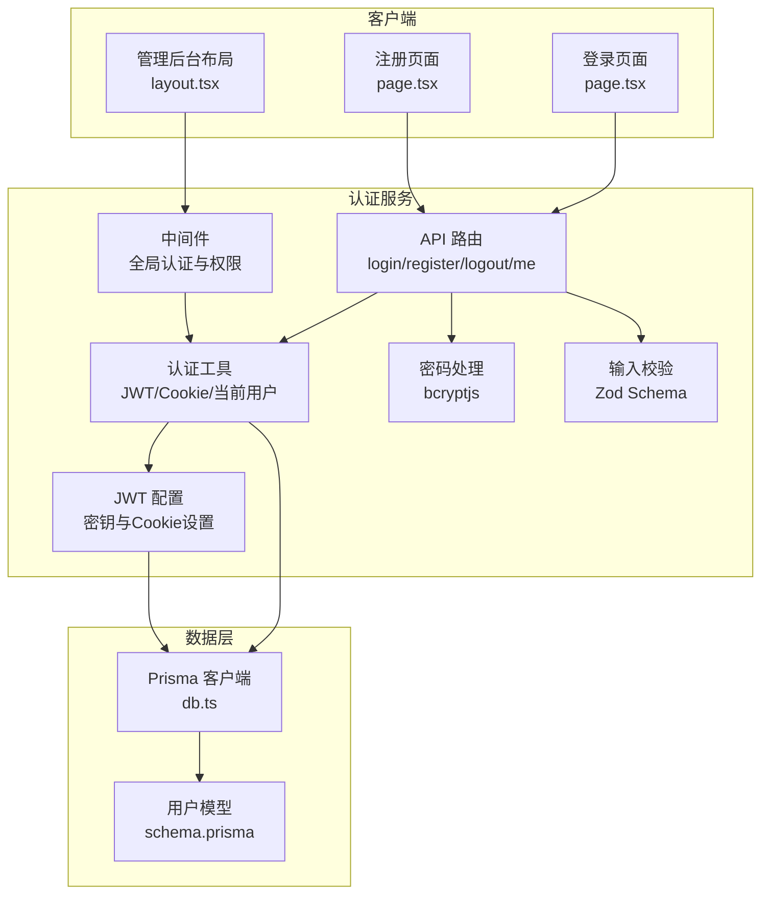
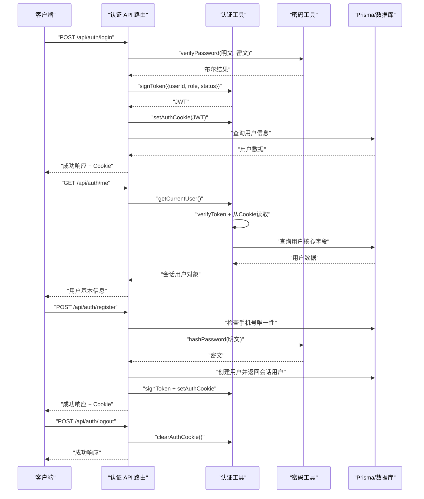
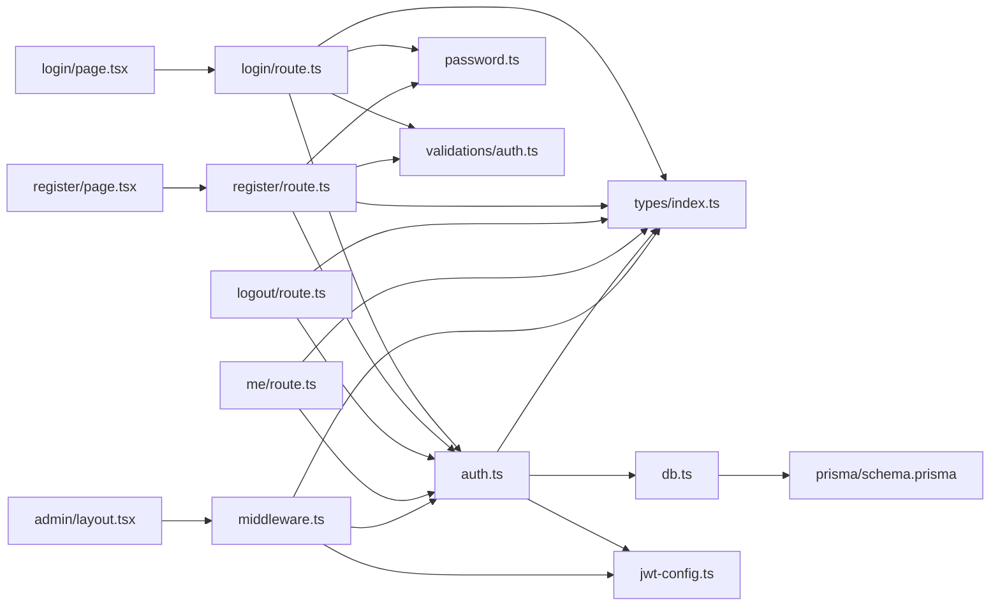

# 认证系统

<cite>
**本文档引用的文件**
- [src/lib/auth.ts](file://src/lib/auth.ts)
- [src/lib/password.ts](file://src/lib/password.ts)
- [src/lib/db.ts](file://src/lib/db.ts)
- [src/lib/validations/auth.ts](file://src/lib/validations/auth.ts)
- [src/middleware.ts](file://src/middleware.ts)
- [src/tokens/index.ts](file://src/types/index.ts)
- [src/lib/jwt-config.ts](file://src/lib/jwt-config.ts)
- [src/app/api/auth/login/route.ts](file://src/app/api/auth/login/route.ts)
- [src/app/api/auth/register/route.ts](file://src/app/api/auth/register/route.ts)
- [src/app/api/auth/logout/route.ts](file://src/app/api/auth/logout/route.ts)
- [src/app/api/auth/me/route.ts](file://src/app/api/auth/me/route.ts)
- [src/app/[locale]/storefront/(auth)/login/page.tsx](file://src/app/[locale]/storefront/(auth)/login/page.tsx)
- [src/app/[locale]/storefront/(auth)/register/page.tsx](file://src/app/[locale]/storefront/(auth)/register/page.tsx)
- [src/app/admin/layout.tsx](file://src/app/admin/layout.tsx)
- [prisma/schema.prisma](file://prisma/schema.prisma)
</cite>

## 更新摘要
**所做更改**
- 新增 /api/auth/me 端点用于获取当前用户信息
- 更新中间件实现，增强角色权限控制和状态管理
- 完善客户端认证页面组件
- 优化 JWT 配置和安全策略
- 增强用户状态管理（PENDING/ACTIVE）

## 目录
1. [简介](#简介)
2. [项目结构](#项目结构)
3. [核心组件](#核心组件)
4. [架构总览](#架构总览)
5. [详细组件分析](#详细组件分析)
6. [依赖关系分析](#依赖关系分析)
7. [性能考量](#性能考量)
8. [故障排查指南](#故障排查指南)
9. [结论](#结论)
10. [附录](#附录)

## 简介
本文件为 Celestia 认证系统的完整技术文档，覆盖用户注册与登录流程、JWT 令牌管理、会话与权限控制、API 设计与错误处理、认证中间件与路由保护、以及安全策略与最佳实践。系统采用 Next.js App Router 的 API 路由与中间件进行统一认证与权限控制，并使用 Prisma 作为数据访问层。

**更新** 新增了 /api/auth/me 端点用于获取当前用户信息，完善了客户端认证页面组件，并增强了中间件的角色权限控制和用户状态管理。

## 项目结构
认证相关的核心文件分布如下：
- 路由层：登录、注册、登出、获取用户信息 API 路由位于 src/app/api/auth/
- 认证工具：JWT 签发/校验、Cookie 管理、当前用户查询位于 src/lib/auth.ts
- 密码处理：bcryptjs 加密与校验位于 src/lib/password.ts
- 数据访问：Prisma 客户端初始化位于 src/lib/db.ts
- 输入校验：Zod Schema 定义位于 src/lib/validations/auth.ts
- 中间件：全局认证与权限控制位于 src/middleware.ts
- 类型定义：通用响应格式、JWT 载荷、会话用户类型位于 src/types/index.ts
- JWT 配置：密钥管理、Cookie 设置位于 src/lib/jwt-config.ts
- 数据模型：用户表结构定义位于 prisma/schema.prisma
- 客户端组件：认证页面位于 src/app/[locale]/storefront/(auth)/

**图表来源**
- [src/app/api/auth/login/route.ts:1-78](file://src/app/api/auth/login/route.ts#L1-L78)
- [src/app/api/auth/register/route.ts:1-89](file://src/app/api/auth/register/route.ts#L1-L89)
- [src/app/api/auth/logout/route.ts:1-22](file://src/app/api/auth/logout/route.ts#L1-L22)
- [src/app/api/auth/me/route.ts:1-37](file://src/app/api/auth/me/route.ts#L1-L37)
- [src/lib/auth.ts:1-100](file://src/lib/auth.ts#L1-L100)
- [src/lib/password.ts:1-18](file://src/lib/password.ts#L1-L18)
- [src/lib/validations/auth.ts:1-17](file://src/lib/validations/auth.ts#L1-L17)
- [src/middleware.ts:1-165](file://src/middleware.ts#L1-L165)
- [src/lib/jwt-config.ts:1-9](file://src/lib/jwt-config.ts#L1-L9)
- [src/lib/db.ts:1-18](file://src/lib/db.ts#L1-L18)
- [src/app/[locale]/storefront/(auth)/login/page.tsx:1-154](file://src/app/[locale]/storefront/(auth)/login/page.tsx#L1-L154)
- [src/app/[locale]/storefront/(auth)/register/page.tsx:1-211](file://src/app/[locale]/storefront/(auth)/register/page.tsx#L1-L211)
- [src/app/admin/layout.tsx:1-10](file://src/app/admin/layout.tsx#L1-L10)
- [prisma/schema.prisma:85-104](file://prisma/schema.prisma#L85-L104)

**章节来源**
- [src/app/api/auth/login/route.ts:1-78](file://src/app/api/auth/login/route.ts#L1-L78)
- [src/app/api/auth/register/route.ts:1-89](file://src/app/api/auth/register/route.ts#L1-L89)
- [src/app/api/auth/logout/route.ts:1-22](file://src/app/api/auth/logout/route.ts#L1-L22)
- [src/app/api/auth/me/route.ts:1-37](file://src/app/api/auth/me/route.ts#L1-L37)
- [src/lib/auth.ts:1-100](file://src/lib/auth.ts#L1-L100)
- [src/lib/password.ts:1-18](file://src/lib/password.ts#L1-L18)
- [src/lib/validations/auth.ts:1-17](file://src/lib/validations/auth.ts#L1-L17)
- [src/middleware.ts:1-165](file://src/middleware.ts#L1-L165)
- [src/lib/jwt-config.ts:1-9](file://src/lib/jwt-config.ts#L1-L9)
- [src/lib/db.ts:1-18](file://src/lib/db.ts#L1-L18)
- [src/app/[locale]/storefront/(auth)/login/page.tsx:1-154](file://src/app/[locale]/storefront/(auth)/login/page.tsx#L1-L154)
- [src/app/[locale]/storefront/(auth)/register/page.tsx:1-211](file://src/app/[locale]/storefront/(auth)/register/page.tsx#L1-L211)
- [src/app/admin/layout.tsx:1-10](file://src/app/admin/layout.tsx#L1-L10)
- [prisma/schema.prisma:85-104](file://prisma/schema.prisma#L85-L104)

## 核心组件
- JWT 令牌管理
  - 签发：基于 HS256 算法，载荷包含 userId、role、status，有效期 7 天
  - 校验：使用相同密钥验证签名与过期时间
  - 存储：通过 httpOnly、secure、sameSite=lax 的 Cookie 保存，路径为根路径，最大存活时间为 7 天
- 密码加密与校验
  - 使用 bcryptjs，盐值轮数为 12，确保安全性与性能平衡
- 会话与当前用户
  - 从 Cookie 读取并校验 JWT，随后查询数据库返回会话用户信息
- API 路由
  - 登录：校验输入、查询用户、校验密码、签发 JWT 并设置 Cookie
  - 注册：校验输入、检查手机号唯一性、加密密码、创建用户、签发 JWT 并设置 Cookie
  - 登出：清除认证 Cookie
  - 获取用户：验证 JWT 并返回用户基本信息
- 中间件
  - 对 /api（除 /api/auth/*）进行认证拦截
  - 对 /admin 进行角色限制（仅 ADMIN）
  - 对 storefront 路由进行登录态与角色重定向控制
  - 支持用户状态管理（PENDING/ACTIVE）
- 类型与校验
  - 统一响应格式 ApiResponse
  - JWT 载荷 JwtPayload
  - 会话用户 SessionUser
  - Zod 登录/注册 Schema

**更新** 新增了 /api/auth/me 端点用于获取当前用户信息，中间件增强了用户状态管理功能，支持 PENDING 和 ACTIVE 两种状态的不同路由行为。

**章节来源**
- [src/lib/auth.ts:10-52](file://src/lib/auth.ts#L10-L52)
- [src/lib/password.ts:3-17](file://src/lib/password.ts#L3-L17)
- [src/app/api/auth/login/route.ts:13-78](file://src/app/api/auth/login/route.ts#L13-L78)
- [src/app/api/auth/register/route.ts:8-89](file://src/app/api/auth/register/route.ts#L8-L89)
- [src/app/api/auth/logout/route.ts:5-22](file://src/app/api/auth/logout/route.ts#L5-L22)
- [src/app/api/auth/me/route.ts:5-37](file://src/app/api/auth/me/route.ts#L5-L37)
- [src/middleware.ts:40-165](file://src/middleware.ts#L40-L165)
- [src/types/index.ts:41-61](file://src/types/index.ts#L41-L61)
- [src/lib/validations/auth.ts:3-17](file://src/lib/validations/auth.ts#L3-L17)

## 架构总览
认证系统采用"API 路由 + 中间件 + 工具函数"的分层架构：
- API 层负责业务入口与数据持久化
- 工具层负责 JWT、Cookie、当前用户与密码处理
- 中间件层负责全局认证与权限控制
- 类型与校验层保证接口一致性与输入安全

**图表来源**
- [src/app/api/auth/login/route.ts:13-78](file://src/app/api/auth/login/route.ts#L13-L78)
- [src/app/api/auth/register/route.ts:8-89](file://src/app/api/auth/register/route.ts#L8-L89)
- [src/app/api/auth/logout/route.ts:5-22](file://src/app/api/auth/logout/route.ts#L5-L22)
- [src/app/api/auth/me/route.ts:5-37](file://src/app/api/auth/me/route.ts#L5-L37)
- [src/lib/auth.ts:10-52](file://src/lib/auth.ts#L10-L52)
- [src/lib/password.ts:8-17](file://src/lib/password.ts#L8-L17)
- [src/lib/db.ts:1-18](file://src/lib/db.ts#L1-L18)

## 详细组件分析

### JWT 与 Cookie 管理
- 签发与校验
  - 使用 HS256 算法，密钥来自环境变量，未配置时抛出错误
  - 载荷包含 userId、role、status、签发时间与过期时间
- Cookie 策略
  - httpOnly 防止 XSS 读取
  - secure 在生产环境启用，要求 HTTPS
  - sameSite=lax 平衡 CSRF 与第三方场景
  - maxAge=7 天，路径为根路径
- 当前用户
  - 从 Cookie 读取 JWT，校验失败或用户不存在则返回空
  - 从数据库查询用户核心字段并转换为会话用户对象

**图表来源**
- [src/lib/auth.ts:57-99](file://src/lib/auth.ts#L57-L99)

**章节来源**
- [src/lib/auth.ts:10-52](file://src/lib/auth.ts#L10-L52)
- [src/lib/auth.ts:57-99](file://src/lib/auth.ts#L57-L99)
- [src/lib/jwt-config.ts:1-9](file://src/lib/jwt-config.ts#L1-L9)

### 密码加密与校验
- 加密
  - 使用 bcryptjs，固定盐值轮数为 12
- 校验
  - 将明文与数据库中的哈希值比较，返回布尔结果

**章节来源**
- [src/lib/password.ts:3-17](file://src/lib/password.ts#L3-L17)

### API 端点设计

#### 登录
- 方法与路径
  - POST /api/auth/login
- 请求体
  - 字段 phone、password，使用 Zod 校验
- 成功响应
  - 状态码 200，data 包含会话用户信息与用户状态
- 错误响应
  - 400：请求体校验失败
  - 401：用户名或密码错误
  - 500：服务器内部错误

#### 注册
- 方法与路径
  - POST /api/auth/register
- 请求体
  - 字段 phone、password、name、company（可选），使用 Zod 校验
- 成功响应
  - 状态码 201，data 包含会话用户信息
- 错误响应
  - 400：请求体校验失败
  - 409：手机号已注册
  - 500：服务器内部错误

#### 登出
- 方法与路径
  - POST /api/auth/logout
- 成功响应
  - 状态码 200
- 错误响应
  - 500：服务器内部错误

#### 获取当前用户
- 方法与路径
  - GET /api/auth/me
- 成功响应
  - 状态码 200，data 包含用户基本信息（name、phone、company）
- 错误响应
  - 401：未授权
  - 500：服务器内部错误

**更新** 新增了 /api/auth/me 端点，用于获取当前用户的简要信息，支持客户端侧的状态显示和导航控制。

**章节来源**
- [src/app/api/auth/login/route.ts:13-78](file://src/app/api/auth/login/route.ts#L13-L78)
- [src/app/api/auth/register/route.ts:8-89](file://src/app/api/auth/register/route.ts#L8-L89)
- [src/app/api/auth/logout/route.ts:5-22](file://src/app/api/auth/logout/route.ts#L5-L22)
- [src/app/api/auth/me/route.ts:5-37](file://src/app/api/auth/me/route.ts#L5-L37)
- [src/lib/validations/auth.ts:3-17](file://src/lib/validations/auth.ts#L3-L17)
- [src/types/index.ts:2-7](file://src/types/index.ts#L2-L7)

### 中间件与路由保护
- 全局 API 认证
  - 对 /api（除 /api/auth/*）进行认证拦截，无有效 token 返回 401
- 管理后台权限
  - 对 /admin 路由进行角色限制，非 ADMIN 角色重定向至商品列表
  - 支持 /admin/login 页面的特殊处理
- Storefront 路由保护
  - 登录/注册页面：已登录用户按角色和状态重定向
  - 其他 storefront 页面：未登录重定向至登录页
  - PENDING 状态用户：仅能访问 /pending 页面
  - ACTIVE 状态用户：访问 /pending 页面时重定向到首页
- 匹配器
  - 监听 /api/:path*、/admin/:path*、/:locale/storefront/:path*

**更新** 中间件现在支持更精细的用户状态管理，PENDING 状态用户只能访问 /pending 页面，ACTIVE 状态用户访问 /pending 页面时会被重定向到首页。

**图表来源**
- [src/middleware.ts:40-165](file://src/middleware.ts#L40-L165)

**章节来源**
- [src/middleware.ts:7-165](file://src/middleware.ts#L7-L165)

### 权限控制与会话管理
- 角色枚举
  - ADMIN、CUSTOMER
- 用户状态
  - PENDING、ACTIVE
- 会话用户
  - 包含 id、phone、name、role、status、markupRatio（字符串形式）、preferredLang
- 客户端组件
  - 登录页面：支持表单验证、错误处理、状态重定向
  - 注册页面：支持密码确认、表单验证、成功重定向

**更新** 客户端组件现在支持更完整的认证流程，包括状态重定向和错误处理。

**章节来源**
- [prisma/schema.prisma:16-24](file://prisma/schema.prisma#L16-L24)
- [src/types/index.ts:41-61](file://src/types/index.ts#L41-L61)
- [src/app/[locale]/storefront/(auth)/login/page.tsx:37-154](file://src/app/[locale]/storefront/(auth)/login/page.tsx#L37-L154)
- [src/app/[locale]/storefront/(auth)/register/page.tsx:42-211](file://src/app/[locale]/storefront/(auth)/register/page.tsx#L42-L211)

## 依赖关系分析

**图表来源**
- [src/app/api/auth/login/route.ts:1-78](file://src/app/api/auth/login/route.ts#L1-L78)
- [src/app/api/auth/register/route.ts:1-89](file://src/app/api/auth/register/route.ts#L1-L89)
- [src/app/api/auth/logout/route.ts:1-22](file://src/app/api/auth/logout/route.ts#L1-L22)
- [src/app/api/auth/me/route.ts:1-37](file://src/app/api/auth/me/route.ts#L1-L37)
- [src/lib/auth.ts:1-100](file://src/lib/auth.ts#L1-L100)
- [src/lib/password.ts:1-18](file://src/lib/password.ts#L1-L18)
- [src/lib/validations/auth.ts:1-17](file://src/lib/validations/auth.ts#L1-L17)
- [src/middleware.ts:1-165](file://src/middleware.ts#L1-L165)
- [src/lib/db.ts:1-18](file://src/lib/db.ts#L1-L18)
- [src/lib/jwt-config.ts:1-9](file://src/lib/jwt-config.ts#L1-L9)
- [src/types/index.ts:1-61](file://src/types/index.ts#L1-L61)
- [prisma/schema.prisma:85-104](file://prisma/schema.prisma#L85-L104)
- [src/app/[locale]/storefront/(auth)/login/page.tsx:1-154](file://src/app/[locale]/storefront/(auth)/login/page.tsx#L1-L154)
- [src/app/[locale]/storefront/(auth)/register/page.tsx:1-211](file://src/app/[locale]/storefront/(auth)/register/page.tsx#L1-L211)
- [src/app/admin/layout.tsx:1-10](file://src/app/admin/layout.tsx#L1-L10)

**章节来源**
- [src/app/api/auth/login/route.ts:1-78](file://src/app/api/auth/login/route.ts#L1-L78)
- [src/app/api/auth/register/route.ts:1-89](file://src/app/api/auth/register/route.ts#L1-L89)
- [src/app/api/auth/logout/route.ts:1-22](file://src/app/api/auth/logout/route.ts#L1-L22)
- [src/app/api/auth/me/route.ts:1-37](file://src/app/api/auth/me/route.ts#L1-L37)
- [src/lib/auth.ts:1-100](file://src/lib/auth.ts#L1-L100)
- [src/lib/password.ts:1-18](file://src/lib/password.ts#L1-L18)
- [src/lib/validations/auth.ts:1-17](file://src/lib/validations/auth.ts#L1-L17)
- [src/middleware.ts:1-165](file://src/middleware.ts#L1-L165)
- [src/lib/db.ts:1-18](file://src/lib/db.ts#L1-L18)
- [src/lib/jwt-config.ts:1-9](file://src/lib/jwt-config.ts#L1-L9)
- [src/types/index.ts:1-61](file://src/types/index.ts#L1-L61)
- [prisma/schema.prisma:85-104](file://prisma/schema.prisma#L85-L104)
- [src/app/[locale]/storefront/(auth)/login/page.tsx:1-154](file://src/app/[locale]/storefront/(auth)/login/page.tsx#L1-L154)
- [src/app/[locale]/storefront/(auth)/register/page.tsx:1-211](file://src/app/[locale]/storefront/(auth)/register/page.tsx#L1-L211)
- [src/app/admin/layout.tsx:1-10](file://src/app/admin/layout.tsx#L1-L10)

## 性能考量
- JWT 体积小、校验轻量，适合高并发场景
- bcrypt 轮数固定为 12，在安全性与性能之间取得平衡
- 中间件仅在匹配路径执行，避免对静态资源与公开路由的不必要开销
- Cookie 采用 httpOnly，减少前端存储带来的额外校验成本
- Prisma 使用连接池，提高数据库访问效率

**更新** 新增了 Prisma 连接池配置，进一步提升数据库访问性能。

**章节来源**
- [src/lib/db.ts:9-18](file://src/lib/db.ts#L9-L18)

## 故障排查指南
- 登录失败
  - 检查请求体是否符合 Zod 校验
  - 确认手机号是否存在且密码正确
  - 查看服务器日志定位异常
- 注册失败
  - 检查手机号是否已被注册
  - 确认密码强度与长度
  - 验证公司名称格式（如有填写）
- 401 未授权
  - 确认 Cookie 是否携带且未过期
  - 检查 JWT 密钥配置
  - 验证用户状态（PENDING/ACTIVE）
- 中间件重定向异常
  - 检查路径匹配规则与语言前缀
  - 确认用户角色与登录状态
  - 验证用户状态对路由的影响
- 客户端认证页面问题
  - 检查表单验证错误
  - 确认网络请求状态
  - 验证状态重定向逻辑

**更新** 新增了用户状态相关的故障排查指导。

**章节来源**
- [src/app/api/auth/login/route.ts:18-47](file://src/app/api/auth/login/route.ts#L18-L47)
- [src/app/api/auth/register/route.ts:13-33](file://src/app/api/auth/register/route.ts#L13-L33)
- [src/middleware.ts:41-165](file://src/middleware.ts#L41-L165)
- [src/app/[locale]/storefront/(auth)/login/page.tsx:58-85](file://src/app/[locale]/storefront/(auth)/login/page.tsx#L58-L85)
- [src/app/[locale]/storefront/(auth)/register/page.tsx:66-95](file://src/app/[locale]/storefront/(auth)/register/page.tsx#L66-L95)

## 结论
该认证系统以 JWT 为核心，结合中间件与 API 路由实现了完善的用户注册、登录、登出与权限控制。通过 bcryptjs 实现安全的密码存储，借助 httpOnly Cookie 降低 XSS 风险；中间件对 API 与页面路由进行统一保护，支持多角色与多语言场景。新增的 /api/auth/me 端点提供了更好的用户体验，客户端组件支持完整的认证流程。建议在生产环境中严格管理 JWT 密钥与 HTTPS 配置，并持续监控与审计认证相关日志。

**更新** 系统现已支持完整的用户状态管理，包括 PENDING 和 ACTIVE 两种状态的不同路由行为，为后续的客户审核流程奠定了基础。

## 附录

### API 端点一览
- 登录
  - 方法：POST
  - 路径：/api/auth/login
  - 请求体：phone、password
  - 响应：success、data（含会话用户与状态）、message
- 注册
  - 方法：POST
  - 路径：/api/auth/register
  - 请求体：phone、password、name、company（可选）
  - 响应：success、data（会话用户）、message
- 登出
  - 方法：POST
  - 路径：/api/auth/logout
  - 响应：success、message
- 获取当前用户
  - 方法：GET
  - 路径：/api/auth/me
  - 响应：success、data（用户基本信息）、message

**更新** 新增了 /api/auth/me 端点，用于获取当前用户的简要信息。

**章节来源**
- [src/app/api/auth/login/route.ts:13-78](file://src/app/api/auth/login/route.ts#L13-L78)
- [src/app/api/auth/register/route.ts:8-89](file://src/app/api/auth/register/route.ts#L8-L89)
- [src/app/api/auth/logout/route.ts:5-22](file://src/app/api/auth/logout/route.ts#L5-L22)
- [src/app/api/auth/me/route.ts:5-37](file://src/app/api/auth/me/route.ts#L5-L37)

### 安全策略与最佳实践
- XSS 防护
  - 使用 httpOnly Cookie 存储 token
  - 生产环境启用 secure
- CSRF 防护
  - 启用 sameSite=lax，结合后端中间件校验
- SQL 注入防护
  - 使用 Prisma ORM，自动参数化查询
- 密码安全
  - bcryptjs 固定轮数，避免弱口令
- 用户状态管理
  - 支持 PENDING 和 ACTIVE 两种状态
  - 不同状态对应不同的路由权限
- 日志与监控
  - 记录认证异常与中间件拦截事件，定期审计

**更新** 新增了用户状态管理的安全策略，确保不同状态的用户只能访问相应的功能。

**章节来源**
- [src/lib/auth.ts:35-52](file://src/lib/auth.ts#L35-L52)
- [src/lib/password.ts:3-17](file://src/lib/password.ts#L3-L17)
- [src/lib/db.ts:1-18](file://src/lib/db.ts#L1-L18)
- [src/middleware.ts:41-165](file://src/middleware.ts#L41-L165)
- [prisma/schema.prisma:21-24](file://prisma/schema.prisma#L21-L24)