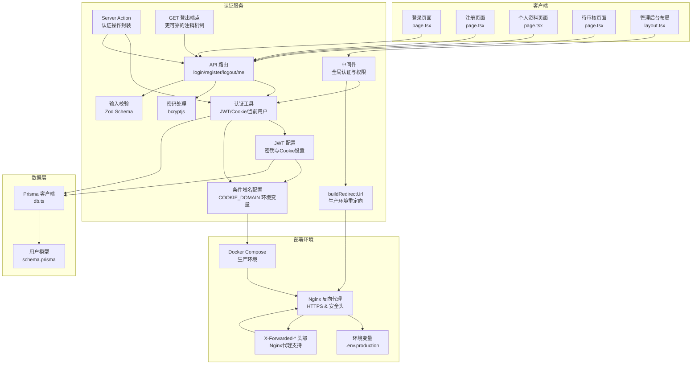
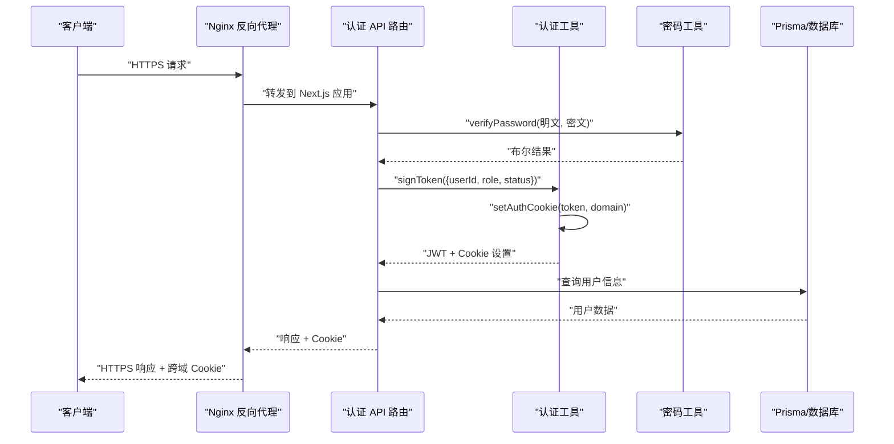
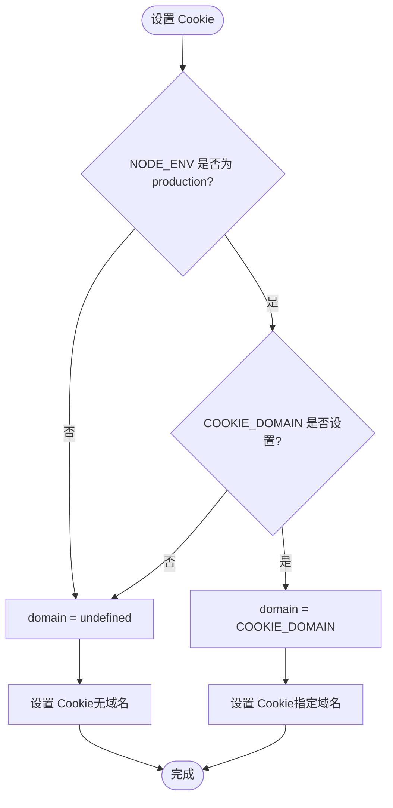
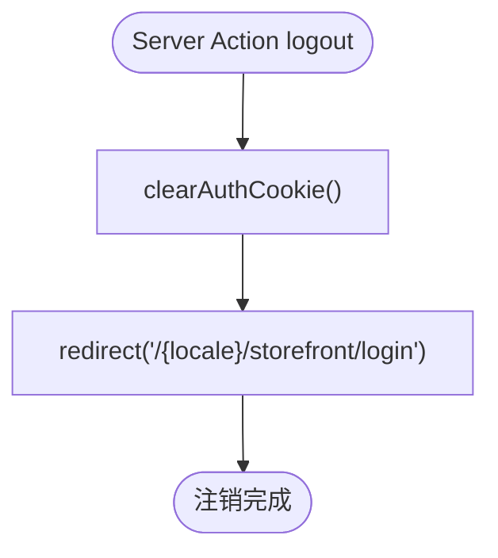
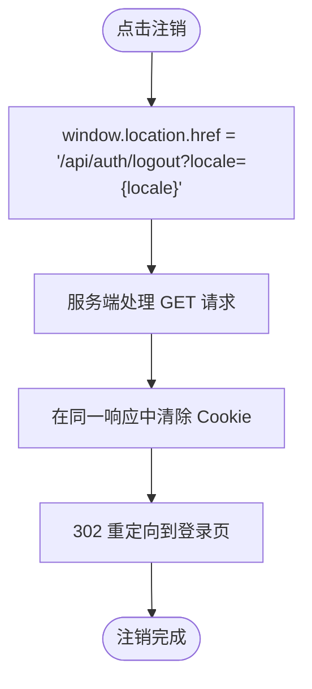
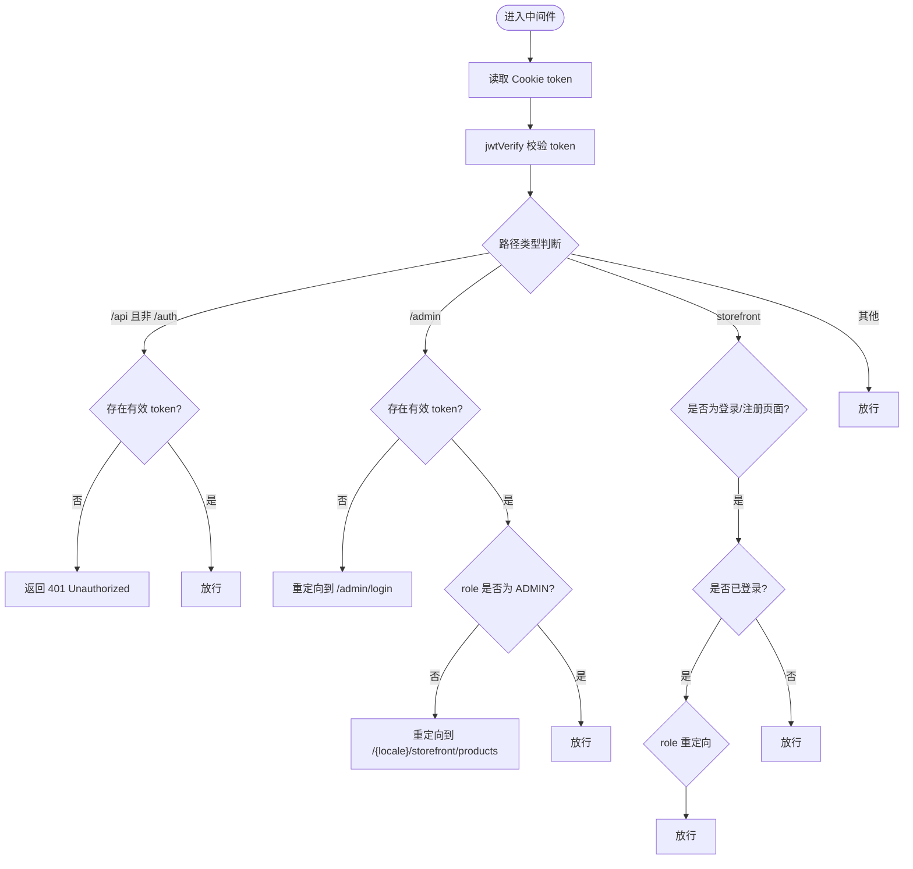
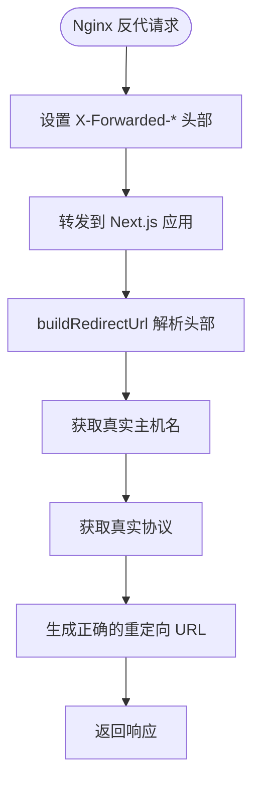
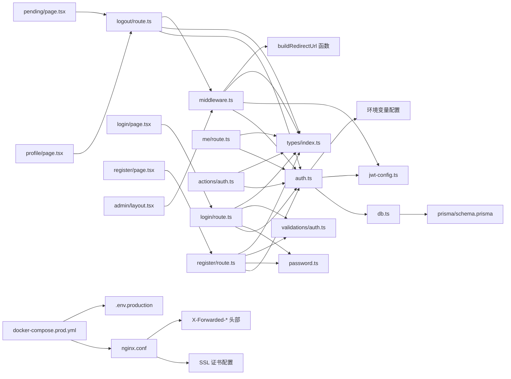

# 认证系统

<cite>
**本文档引用的文件**
- [src/lib/auth.ts](file://src/lib/auth.ts)
- [src/lib/password.ts](file://src/lib/password.ts)
- [src/lib/db.ts](file://src/lib/db.ts)
- [src/lib/validations/auth.ts](file://src/lib/validations/auth.ts)
- [src/middleware.ts](file://src/middleware.ts)
- [src/lib/jwt-config.ts](file://src/lib/jwt-config.ts)
- [src/lib/actions/auth.ts](file://src/lib/actions/auth.ts)
- [src/app/api/auth/login/route.ts](file://src/app/api/auth/login/route.ts)
- [src/app/api/auth/register/route.ts](file://src/app/api/auth/register/route.ts)
- [src/app/api/auth/logout/route.ts](file://src/app/api/auth/logout/route.ts)
- [src/app/api/auth/me/route.ts](file://src/app/api/auth/me/route.ts)
- [src/app/[locale]/storefront/(auth)/login/page.tsx](file://src/app/[locale]/storefront/(auth)/login/page.tsx)
- [src/app/[locale]/storefront/(auth)/register/page.tsx](file://src/app/[locale]/storefront/(auth)/register/page.tsx)
- [src/app/[locale]/storefront/profile/page.tsx](file://src/app/[locale]/storefront/profile/page.tsx)
- [src/app/[locale]/storefront/(auth)/pending/page.tsx](file://src/app/[locale]/storefront/(auth)/pending/page.tsx)
- [src/app/admin/layout.tsx](file://src/app/admin/layout.tsx)
- [prisma/schema.prisma](file://prisma/schema.prisma)
- [.env.production.example](file://.env.production.example)
- [docker-compose.prod.yml](file://docker-compose.prod.yml)
- [docker/nginx/nginx.conf](file://docker/nginx/nginx.conf)
</cite>

## 更新摘要
**所做更改**
- 新增GET方法的登出端点，提供更可靠的登出机制
- 中间件新增buildRedirectUrl函数用于构建生产环境安全的重定向URL
- 改进注销流程，确保在同一HTTP响应中完成cookie清除和重定向
- 新增条件域名配置功能，支持生产环境下的动态域名设置
- 解决跨域认证问题，通过动态设置 Cookie Domain
- 增强生产环境部署配置和安全策略
- 完善 Nginx 反向代理配置以支持 HTTPS 和安全头
- **新增** 改进Nginx代理支持，通过X-Forwarded-*头部正确处理生产环境重定向

## 目录
1. [简介](#简介)
2. [项目结构](#项目结构)
3. [核心组件](#核心组件)
4. [架构总览](#架构总览)
5. [详细组件分析](#详细组件分析)
6. [依赖关系分析](#依赖关系分析)
7. [性能考量](#性能考量)
8. [故障排查指南](#故障排查指南)
9. [结论](#结论)
10. [附录](#附录)

## 简介
本文件为 Celestia 认证系统的完整技术文档，覆盖用户注册与登录流程、JWT 令牌管理、会话与权限控制、API 设计与错误处理、认证中间件与路由保护、以及安全策略与最佳实践。系统采用 Next.js App Router 的 API 路由与中间件进行统一认证与权限控制，并使用 Prisma 作为数据访问层。

**更新** 新增了GET方法的登出端点，提供更可靠的登出机制。前端登出实现已从复杂的客户端异步登出改为直接导航到服务端GET端点，确保在各种边缘情况下都能可靠地进行页面跳转。同时新增了条件域名配置功能，支持生产环境下的动态域名设置，通过 `COOKIE_DOMAIN` 环境变量实现跨域认证，解决了多域名和子域名场景下的认证问题。中间件新增的buildRedirectUrl函数专门处理Nginx反代后的生产环境重定向，通过X-Forwarded-*头部正确解析真实的主机名和协议。

## 项目结构
认证相关的核心文件分布如下：
- 路由层：登录、注册、登出、获取用户信息 API 路由位于 src/app/api/auth/
- 认证工具：JWT 签发/校验、Cookie 管理、当前用户查询位于 src/lib/auth.ts
- 密码处理：bcryptjs 加密与校验位于 src/lib/password.ts
- 数据访问：Prisma 客户端初始化位于 src/lib/db.ts
- 输入校验：Zod Schema 定义位于 src/lib/validations/auth.ts
- 中间件：全局认证与权限控制位于 src/middleware.ts
- JWT 配置：密钥管理、Cookie 设置位于 src/lib/jwt-config.ts
- **Server Action**：提供服务端认证操作，包括注销功能位于 src/lib/actions/auth.ts
- 数据模型：用户表结构定义位于 prisma/schema.prisma
- 客户端组件：认证页面位于 src/app/[locale]/storefront/(auth)/
- **增强的注销组件**：包含直接浏览器导航的注销功能
- 环境配置：生产环境配置位于 .env.production.example
- 容器编排：Docker Compose 配置位于 docker-compose.prod.yml
- 反向代理：Nginx 配置位于 docker/nginx/nginx.conf



**图表来源**
- [src/app/api/auth/login/route.ts:1-78](file://src/app/api/auth/login/route.ts#L1-L78)
- [src/app/api/auth/register/route.ts:1-89](file://src/app/api/auth/register/route.ts#L1-L89)
- [src/app/api/auth/logout/route.ts:1-56](file://src/app/api/auth/logout/route.ts#L1-L56)
- [src/app/api/auth/me/route.ts:1-37](file://src/app/api/auth/me/route.ts#L1-L37)
- [src/lib/auth.ts:1-116](file://src/lib/auth.ts#L1-L116)
- [src/lib/password.ts:1-18](file://src/lib/password.ts#L1-L18)
- [src/lib/validations/auth.ts:1-17](file://src/lib/validations/auth.ts#L1-L17)
- [src/middleware.ts:1-164](file://src/middleware.ts#L1-L164)
- [src/lib/jwt-config.ts:1-9](file://src/lib/jwt-config.ts#L1-L9)
- [src/lib/actions/auth.ts:1-22](file://src/lib/actions/auth.ts#L1-L22)
- [src/app/[locale]/storefront/(auth)/login/page.tsx:1-154](file://src/app/[locale]/storefront/(auth)/login/page.tsx#L1-L154)
- [src/app/[locale]/storefront/(auth)/register/page.tsx:1-211](file://src/app/[locale]/storefront/(auth)/register/page.tsx#L1-L211)
- [src/app/[locale]/storefront/profile/page.tsx:1-247](file://src/app/[locale]/storefront/profile/page.tsx#L1-L247)
- [src/app/[locale]/storefront/(auth)/pending/page.tsx:1-85](file://src/app/[locale]/storefront/(auth)/pending/page.tsx#L1-L85)
- [src/app/admin/layout.tsx:1-10](file://src/app/admin/layout.tsx#L1-L10)
- [prisma/schema.prisma:85-104](file://prisma/schema.prisma#L85-L104)
- [.env.production.example:1-27](file://.env.production.example#L1-L27)
- [docker-compose.prod.yml:1-69](file://docker-compose.prod.yml#L1-L69)
- [docker/nginx/nginx.conf:1-88](file://docker/nginx/nginx.conf#L1-L88)

## 核心组件
- JWT 令牌管理
  - 签发：基于 HS256 算法，载荷包含 userId、role、status，有效期 7 天
  - 校验：使用相同密钥验证签名与过期时间
  - 存储：通过 httpOnly、secure、sameSite=lax 的 Cookie 保存，路径为根路径，最大存活时间为 7 天
  - **条件域名支持**：生产环境下通过 `COOKIE_DOMAIN` 环境变量动态设置 Cookie 域名，支持跨域认证
- 密码加密与校验
  - 使用 bcryptjs，盐值轮数为 12，确保安全性与性能平衡
- 会话与当前用户
  - 从 Cookie 读取并校验 JWT，随后查询数据库返回会话用户信息
- API 路由
  - 登录：校验输入、查询用户、校验密码、签发 JWT 并设置 Cookie
  - 注册：校验输入、检查手机号唯一性、加密密码、创建用户、签发 JWT 并设置 Cookie
  - **登出**：支持 POST 和 GET 两种方式
    - POST：JSON 响应，清除认证 Cookie
    - GET：在同一 HTTP 响应中清除 Cookie 并 302 重定向到登录页，提供更可靠的注销机制
  - 获取用户：验证 JWT 并返回用户基本信息
- **Server Action**
  - 提供服务端认证操作封装，包括 getSession 和 logout 功能
  - 支持直接的浏览器导航跳转，确保注销可靠性
- 中间件
  - 对 /api（除 /api/auth/*）进行认证拦截
  - 对 /admin 进行角色限制（仅 ADMIN）
  - 对 storefront 路由进行登录态与角色重定向控制
  - 支持用户状态管理（PENDING/ACTIVE）
  - **新增** buildRedirectUrl 函数专门处理生产环境的重定向URL构建
- 类型与校验
  - 统一响应格式 ApiResponse
  - JWT 载荷 JwtPayload
  - 会话用户 SessionUser
  - Zod 登录/注册 Schema
- **部署配置**
  - Docker Compose 生产环境配置
  - Nginx 反向代理 HTTPS 支持
  - 环境变量管理（JWT_SECRET、COOKIE_DOMAIN、NEXT_PUBLIC_BASE_URL）
  - **新增** Nginx代理通过X-Forwarded-*头部正确处理生产环境重定向

**更新** 新增了GET方法的登出端点，提供更可靠的注销机制。前端登出实现已简化为直接导航到服务端GET端点，确保在各种边缘情况下都能可靠地进行页面跳转。同时新增了条件域名配置功能，通过 `COOKIE_DOMAIN` 环境变量实现动态域名设置，支持生产环境下的跨域认证需求。中间件新增的buildRedirectUrl函数专门处理Nginx反代后的生产环境重定向，通过X-Forwarded-*头部正确解析真实的主机名和协议。

**章节来源**
- [src/lib/auth.ts:35-68](file://src/lib/auth.ts#L35-L68)
- [src/lib/password.ts:3-17](file://src/lib/password.ts#L3-L17)
- [src/app/api/auth/login/route.ts:13-78](file://src/app/api/auth/login/route.ts#L13-L78)
- [src/app/api/auth/register/route.ts:8-89](file://src/app/api/auth/register/route.ts#L8-L89)
- [src/app/api/auth/logout/route.ts:5-56](file://src/app/api/auth/logout/route.ts#L5-L56)
- [src/app/api/auth/me/route.ts:5-37](file://src/app/api/auth/me/route.ts#L5-L37)
- [src/lib/actions/auth.ts:14-21](file://src/lib/actions/auth.ts#L14-L21)
- [src/middleware.ts:40-164](file://src/middleware.ts#L40-L164)
- [src/lib/jwt-config.ts:1-9](file://src/lib/jwt-config.ts#L1-L9)
- [.env.production.example:5-8](file://.env.production.example#L5-L8)
- [docker-compose.prod.yml:14](file://docker-compose.prod.yml#L14)
- [docker/nginx/nginx.conf:46-84](file://docker/nginx/nginx.conf#L46-L84)

## 架构总览
认证系统采用"API 路由 + 中间件 + 工具函数 + 条件域名配置 + Server Action"的分层架构：
- API 层负责业务入口与数据持久化
- 工具层负责 JWT、Cookie、当前用户与密码处理
- 中间件层负责全局认证与权限控制，包含生产环境重定向处理
- 类型与校验层保证接口一致性与输入安全
- **Server Action 层**提供服务端认证操作封装
- **部署层**负责环境配置与反向代理



**图表来源**
- [src/app/api/auth/login/route.ts:13-78](file://src/app/api/auth/login/route.ts#L13-L78)
- [src/app/api/auth/register/route.ts:8-89](file://src/app/api/auth/register/route.ts#L8-L89)
- [src/app/api/auth/logout/route.ts:5-56](file://src/app/api/auth/logout/route.ts#L5-L56)
- [src/app/api/auth/me/route.ts:5-37](file://src/app/api/auth/me/route.ts#L5-L37)
- [src/lib/auth.ts:35-68](file://src/lib/auth.ts#L35-L68)
- [src/lib/password.ts:8-17](file://src/lib/password.ts#L8-L17)
- [src/lib/db.ts:1-18](file://src/lib/db.ts#L1-L18)
- [docker/nginx/nginx.conf:46-84](file://docker/nginx/nginx.conf#L46-L84)

## 详细组件分析

### 条件域名配置与跨域认证

**更新** 新增条件域名配置功能，通过动态设置 Cookie Domain 解决跨域认证问题。

- **环境变量配置**
  - `COOKIE_DOMAIN`：生产环境专用的 Cookie 域名设置
  - 支持顶级域名（如 `.your-domain.com`）和子域名（如 `.app.your-domain.com`）
  - 开发环境不设置域名，便于本地调试
- **动态域名设置**
  - 仅在 `NODE_ENV=production` 时生效
  - 未设置时使用 `undefined`，浏览器使用默认域名
  - 支持多域名共享认证状态
- **跨域认证机制**
  - 设置 `domain` 属性使 Cookie 在指定域名范围内可用
  - 支持主域名和子域名之间的认证共享
  - 解决 CDN、API 网关等多域名场景下的认证问题



**图表来源**
- [src/lib/auth.ts:35-68](file://src/lib/auth.ts#L35-L68)
- [.env.production.example:8](file://.env.production.example#L8)
- [docker-compose.prod.yml:14](file://docker-compose.prod.yml#L14)

**章节来源**
- [src/lib/auth.ts:35-68](file://src/lib/auth.ts#L35-L68)
- [.env.production.example:8](file://.env.production.example#L8)
- [docker-compose.prod.yml:14](file://docker-compose.prod.yml#L14)

### JWT 与 Cookie 管理
- 签发与校验
  - 使用 HS256 算法，密钥来自环境变量，未配置时抛出错误
  - 载荷包含 userId、role、status、签发时间与过期时间
- Cookie 策略
  - httpOnly 防止 XSS 读取
  - secure 在生产环境启用，要求 HTTPS
  - sameSite=lax 平衡 CSRF 与第三方场景
  - maxAge=7 天，路径为根路径
  - **动态域名**：根据环境变量设置 domain 属性
- 当前用户
  - 从 Cookie 读取 JWT，校验失败或用户不存在则返回空
  - 从数据库查询用户核心字段并转换为会话用户对象

**章节来源**
- [src/lib/auth.ts:10-68](file://src/lib/auth.ts#L10-L68)
- [src/lib/jwt-config.ts:1-9](file://src/lib/jwt-config.ts#L1-L9)

### 密码加密与校验
- 加密
  - 使用 bcryptjs，固定盐值轮数为 12
- 校验
  - 将明文与数据库中的哈希值比较，返回布尔结果

**章节来源**
- [src/lib/password.ts:3-17](file://src/lib/password.ts#L3-L17)

### Server Action 认证操作

**更新** 新增 Server Action 版本的认证操作，提供更可靠的注销功能。

- **getSession**
  - 服务端获取当前会话用户信息
  - 通过 getCurrentUser 函数实现
- **logout**
  - 服务端注销操作，清除认证 Cookie
  - 使用 redirect 进行页面跳转，确保可靠性
  - 支持指定语言区域，默认为 'en'



**图表来源**
- [src/lib/actions/auth.ts:14-21](file://src/lib/actions/auth.ts#L14-L21)

**章节来源**
- [src/lib/actions/auth.ts:1-22](file://src/lib/actions/auth.ts#L1-L22)

### API 端点设计

#### 登录
- 方法与路径
  - POST /api/auth/login
- 请求体
  - 字段 phone、password，使用 Zod 校验
- 成功响应
  - 状态码 200，data 包含会话用户信息与用户状态
  - **响应 Cookie**：包含认证 Cookie，支持跨域访问
- 错误响应
  - 400：请求体校验失败
  - 401：用户名或密码错误
  - 500：服务器内部错误

#### 注册
- 方法与路径
  - POST /api/auth/register
- 请求体
  - 字段 phone、password、name、company（可选），使用 Zod 校验
- 成功响应
  - 状态码 201，data 包含会话用户信息
  - **响应 Cookie**：包含认证 Cookie，状态为 PENDING
- 错误响应
  - 400：请求体校验失败
  - 409：手机号已注册
  - 500：服务器内部错误

#### 登出
- 方法与路径
  - POST /api/auth/logout - JSON 响应（保留兼容）
  - **GET /api/auth/logout?locale=en - 更可靠的注销机制**
- POST 成功响应
  - 状态码 200
  - **响应 Cookie**：清除认证 Cookie
- **GET 成功响应**
  - 状态码 302，立即重定向到登录页
  - **响应 Cookie**：在同一 HTTP 响应中清除认证 Cookie
  - **语言支持**：通过 locale 参数支持多语言重定向
  - **生产环境支持**：通过 X-Forwarded-* 头部正确解析真实主机名和协议
- 错误响应
  - 500：服务器内部错误

#### 获取当前用户
- 方法与路径
  - GET /api/auth/me
- 成功响应
  - 状态码 200，data 包含用户基本信息（name、phone、company）
- 错误响应
  - 401：未授权
  - 500：服务器内部错误

**更新** 登出端点现在支持两种方法：POST（JSON 响应，兼容现有实现）和 GET（在同一 HTTP 响应中完成 cookie 清除和重定向，提供更可靠的注销机制）。前端登出实现已简化为直接导航到服务端 GET 端点。GET 端点特别增强了生产环境支持，通过 X-Forwarded-* 头部正确解析真实主机名和协议，确保在 Nginx 反代后的环境中也能正确构建重定向 URL。

**章节来源**
- [src/app/api/auth/login/route.ts:13-78](file://src/app/api/auth/login/route.ts#L13-L78)
- [src/app/api/auth/register/route.ts:8-89](file://src/app/api/auth/register/route.ts#L8-L89)
- [src/app/api/auth/logout/route.ts:5-56](file://src/app/api/auth/logout/route.ts#L5-L56)
- [src/app/api/auth/me/route.ts:5-37](file://src/app/api/auth/me/route.ts#L5-L37)
- [src/lib/validations/auth.ts:3-17](file://src/lib/validations/auth.ts#L3-L17)

### 增强的注销流程

**更新** 改进了注销流程，使用直接的浏览器导航确保在各种边缘情况下都能可靠地进行页面跳转。

- **Profile 页面注销**
  - 使用 `window.location.href` 直接导航到 GET 登出端点
  - 服务端在同一 HTTP 响应中清除 Cookie 并重定向到登录页
  - 即使网络错误也保持导航到登录页面
- **Pending 页面注销**
  - 提供专门的注销页面，支持直接浏览器导航
  - 直接导航到 GET 登出端点，服务端同时清除 Cookie 并重定向
  - 即使 API 调用失败也会强制跳转
- **Server Action 版本**
  - 提供服务端版本的注销操作
  - 使用 redirect 确保注销的可靠性
  - 支持指定语言区域，默认为 'en'



**图表来源**
- [src/app/[locale]/storefront/profile/page.tsx:65-70](file://src/app/[locale]/storefront/profile/page.tsx#L65-L70)
- [src/app/[locale]/storefront/(auth)/pending/page.tsx:25-29](file://src/app/[locale]/storefront/(auth)/pending/page.tsx#L25-L29)
- [src/lib/actions/auth.ts:18-21](file://src/lib/actions/auth.ts#L18-L21)
- [src/app/api/auth/logout/route.ts:26-56](file://src/app/api/auth/logout/route.ts#L26-L56)

**章节来源**
- [src/app/[locale]/storefront/profile/page.tsx:65-70](file://src/app/[locale]/storefront/profile/page.tsx#L65-L70)
- [src/app/[locale]/storefront/(auth)/pending/page.tsx:25-29](file://src/app/[locale]/storefront/(auth)/pending/page.tsx#L25-L29)
- [src/lib/actions/auth.ts:18-21](file://src/lib/actions/auth.ts#L18-L21)
- [src/app/api/auth/logout/route.ts:26-56](file://src/app/api/auth/logout/route.ts#L26-L56)

### 中间件与路由保护
- 全局 API 认证
  - 对 /api（除 /api/auth/*）进行认证拦截，无有效 token 返回 401
- 管理后台权限
  - 对 /admin 路由进行角色限制，非 ADMIN 角色重定向至商品列表
  - 支持 /admin/login 页面的特殊处理
- Storefront 路由保护
  - 登录/注册页面：已登录用户按角色和状态重定向
  - 其他 storefront 页面：未登录重定向至登录页
  - PENDING 状态用户：仅能访问 /pending 页面
  - ACTIVE 状态用户：访问 /pending 页面时重定向到首页
- 匹配器
  - 监听 /api/:path*、/admin/:path*、/:locale/storefront/:path*
- **新增** buildRedirectUrl 函数
  - 专门处理生产环境的重定向URL构建
  - 通过 X-Forwarded-* 头部正确解析真实主机名和协议
  - 支持 Nginx 反代后的环境



**章节来源**
- [src/middleware.ts:7-164](file://src/middleware.ts#L7-L164)

### 权限控制与会话管理
- 角色枚举
  - ADMIN、CUSTOMER
- 用户状态
  - PENDING、ACTIVE
- 会话用户
  - 包含 id、phone、name、role、status、markupRatio（字符串形式）、preferredLang
- 客户端组件
  - 登录页面：支持表单验证、错误处理、状态重定向
  - 注册页面：支持密码确认、表单验证、成功重定向
  - **Profile 页面**：支持注销功能，使用直接浏览器导航到 GET 端点
  - **Pending 页面**：提供专门的注销页面，支持直接浏览器导航

**章节来源**
- [prisma/schema.prisma:16-24](file://prisma/schema.prisma#L16-L24)
- [src/lib/auth.ts:70-115](file://src/lib/auth.ts#L70-L115)
- [src/app/[locale]/storefront/(auth)/login/page.tsx:37-154](file://src/app/[locale]/storefront/(auth)/login/page.tsx#L37-L154)
- [src/app/[locale]/storefront/(auth)/register/page.tsx:42-211](file://src/app/[locale]/storefront/(auth)/register/page.tsx#L42-L211)
- [src/app/[locale]/storefront/profile/page.tsx:65-70](file://src/app/[locale]/storefront/profile/page.tsx#L65-L70)
- [src/app/[locale]/storefront/(auth)/pending/page.tsx:25-29](file://src/app/[locale]/storefront/(auth)/pending/page.tsx#L25-L29)

### 生产环境部署配置

**更新** 新增生产环境部署配置，包括 Docker Compose 和 Nginx 反向代理。

- **Docker Compose 配置**
  - 环境变量传递：JWT_SECRET、COOKIE_DOMAIN、NEXT_PUBLIC_BASE_URL
  - 服务依赖：app 依赖 db 健康检查
  - Nginx 反向代理：端口映射 80→80, 443→443
- **Nginx 反向代理**
  - HTTPS 强制重定向：HTTP→HTTPS
  - SSL 证书：Cloudflare Origin Certificate
  - 安全头：X-Frame-Options、X-Content-Type-Options、X-XSS-Protection
  - 性能优化：Gzip 压缩、缓存策略
  - **新增** X-Forwarded-* 头部支持：正确传递主机名和协议信息
- **环境变量管理**
  - `.env.production.example` 提供完整配置模板
  - 必需变量：JWT_SECRET、COOKIE_DOMAIN、NEXT_PUBLIC_BASE_URL
  - 可选变量：数据库连接、存储配置、翻译服务

**章节来源**
- [docker-compose.prod.yml:1-69](file://docker-compose.prod.yml#L1-L69)
- [docker/nginx/nginx.conf:1-88](file://docker/nginx/nginx.conf#L1-L88)
- [.env.production.example:1-27](file://.env.production.example#L1-L27)

### Nginx 反向代理与生产环境支持

**更新** 新增 Nginx 反向代理配置，增强生产环境支持。

- **X-Forwarded-* 头部处理**
  - X-Forwarded-Proto：正确传递 HTTPS 协议信息
  - X-Forwarded-Host：正确传递真实主机名
  - X-Real-IP：传递客户端真实 IP
  - X-Forwarded-For：传递完整的代理链路
- **生产环境重定向**
  - 通过 buildRedirectUrl 函数解析 X-Forwarded-* 头部
  - 确保重定向 URL 基于真实主机名而非容器内网地址
  - 支持多域名和子域名场景下的正确重定向
- **安全配置**
  - HTTPS 强制重定向
  - SSL 证书配置
  - 安全头设置
  - Gzip 压缩优化



**图表来源**
- [src/middleware.ts:40-45](file://src/middleware.ts#L40-L45)
- [docker/nginx/nginx.conf:76-84](file://docker/nginx/nginx.conf#L76-L84)

**章节来源**
- [src/middleware.ts:40-45](file://src/middleware.ts#L40-L45)
- [docker/nginx/nginx.conf:76-84](file://docker/nginx/nginx.conf#L76-L84)

## 依赖关系分析



**图表来源**
- [src/app/api/auth/login/route.ts:1-78](file://src/app/api/auth/login/route.ts#L1-L78)
- [src/app/api/auth/register/route.ts:1-89](file://src/app/api/auth/register/route.ts#L1-L89)
- [src/app/api/auth/logout/route.ts:1-56](file://src/app/api/auth/logout/route.ts#L1-L56)
- [src/app/api/auth/me/route.ts:1-37](file://src/app/api/auth/me/route.ts#L1-L37)
- [src/lib/auth.ts:1-116](file://src/lib/auth.ts#L1-L116)
- [src/lib/password.ts:1-18](file://src/lib/password.ts#L1-L18)
- [src/lib/validations/auth.ts:1-17](file://src/lib/validations/auth.ts#L1-L17)
- [src/middleware.ts:1-164](file://src/middleware.ts#L1-L164)
- [src/lib/db.ts:1-18](file://src/lib/db.ts#L1-L18)
- [src/lib/jwt-config.ts:1-9](file://src/lib/jwt-config.ts#L1-L9)
- [src/lib/actions/auth.ts:1-22](file://src/lib/actions/auth.ts#L1-L22)
- [docker-compose.prod.yml:1-69](file://docker-compose.prod.yml#L1-L69)
- [docker/nginx/nginx.conf:1-88](file://docker/nginx/nginx.conf#L1-L88)
- [prisma/schema.prisma:85-104](file://prisma/schema.prisma#L85-L104)
- [src/app/[locale]/storefront/(auth)/login/page.tsx:1-154](file://src/app/[locale]/storefront/(auth)/login/page.tsx#L1-L154)
- [src/app/[locale]/storefront/(auth)/register/page.tsx:1-211](file://src/app/[locale]/storefront/(auth)/register/page.tsx#L1-L211)
- [src/app/[locale]/storefront/profile/page.tsx:1-247](file://src/app/[locale]/storefront/profile/page.tsx#L1-L247)
- [src/app/[locale]/storefront/(auth)/pending/page.tsx:1-85](file://src/app/[locale]/storefront/(auth)/pending/page.tsx#L1-L85)
- [src/app/admin/layout.tsx:1-10](file://src/app/admin/layout.tsx#L1-L10)

## 性能考量
- JWT 体积小、校验轻量，适合高并发场景
- bcrypt 轮数固定为 12，在安全性与性能之间取得平衡
- 中间件仅在匹配路径执行，避免对静态资源与公开路由的不必要开销
- Cookie 采用 httpOnly，减少前端存储带来的额外校验成本
- Prisma 使用连接池，提高数据库访问效率
- **条件域名优化**：动态域名设置减少不必要的 Cookie 配置开销
- **Nginx 优化**：Gzip 压缩、缓存策略提升静态资源加载性能
- **注销流程优化**：直接浏览器导航确保在各种边缘情况下的可靠性
- **GET 登出端点优化**：在同一 HTTP 响应中完成 cookie 清除和重定向，减少往返次数
- **生产环境优化**：buildRedirectUrl 函数避免重复解析头部，提升重定向性能
- **Nginx 反代优化**：X-Forwarded-* 头部处理减少应用层解析开销

**更新** 新增了条件域名配置、Nginx 优化和注销流程优化相关的性能考量，包括 GET 登出端点的性能优势和生产环境优化。

**章节来源**
- [src/lib/db.ts:9-18](file://src/lib/db.ts#L9-L18)
- [docker/nginx/nginx.conf:27-31](file://docker/nginx/nginx.conf#L27-L31)

## 故障排查指南
- 登录失败
  - 检查请求体是否符合 Zod 校验
  - 确认手机号是否存在且密码正确
  - 查看服务器日志定位异常
- 注册失败
  - 检查手机号是否已被注册
  - 确认密码强度与长度
  - 验证公司名称格式（如有填写）
- 401 未授权
  - 确认 Cookie 是否携带且未过期
  - 检查 JWT 密钥配置
  - 验证用户状态（PENDING/ACTIVE）
- 中间件重定向异常
  - 检查路径匹配规则与语言前缀
  - 确认用户角色与登录状态
  - 验证用户状态对路由的影响
  - **新增** 检查 buildRedirectUrl 函数是否正确解析 X-Forwarded-* 头部
- 客户端认证页面问题
  - 检查表单验证错误
  - 确认网络请求状态
  - 验证状态重定向逻辑
- **跨域认证问题**
  - 检查 `COOKIE_DOMAIN` 环境变量配置
  - 确认域名设置与实际访问域名一致
  - 验证 HTTPS 环境下的 secure Cookie 设置
  - 检查 Nginx 反向代理配置
- **生产环境部署问题**
  - 检查 Docker Compose 服务健康状态
  - 确认 SSL 证书配置正确
  - 验证环境变量文件加载
  - **新增** 检查 Nginx X-Forwarded-* 头部是否正确传递
- **注销问题**
  - 检查 API 路由是否正常响应
  - 确认 Cookie 是否被正确清除
  - 验证浏览器导航是否正常工作
  - 检查 Server Action 版本的 redirect 功能
  - **GET 登出端点问题**：检查 locale 参数传递和重定向逻辑
  - **新增** 检查 X-Forwarded-* 头部是否正确设置
- **新登出机制问题**
  - 检查 GET 端点的 cookie 清除逻辑
  - 确认 302 重定向的目标 URL
  - 验证语言区域参数的正确传递
  - **新增** 检查生产环境重定向 URL 构建是否正确

**更新** 新增了跨域认证、生产环境部署和注销相关的故障排查指导，包括新的 GET 登出端点问题排查和 Nginx 反代相关的故障排查。

**章节来源**
- [src/app/api/auth/login/route.ts:18-47](file://src/app/api/auth/login/route.ts#L18-L47)
- [src/app/api/auth/register/route.ts:13-33](file://src/app/api/auth/register/route.ts#L13-L33)
- [src/middleware.ts:41-164](file://src/middleware.ts#L41-L164)
- [src/lib/auth.ts:35-68](file://src/lib/auth.ts#L35-L68)
- [docker/nginx/nginx.conf:46-84](file://docker/nginx/nginx.conf#L46-L84)
- [src/app/api/auth/logout/route.ts:26-56](file://src/app/api/auth/logout/route.ts#L26-L56)

## 结论
该认证系统以 JWT 为核心，结合中间件与 API 路由实现了完善的用户注册、登录、登出与权限控制。通过 bcryptjs 实现安全的密码存储，借助 httpOnly Cookie 降低 XSS 风险；中间件对 API 与页面路由进行统一保护，支持多角色与多语言场景。新增的条件域名配置功能解决了生产环境下的跨域认证问题，通过动态设置 Cookie Domain 实现多域名共享认证状态。Nginx 反向代理提供 HTTPS 支持和安全头配置，Docker Compose 简化了生产环境部署。

**最新的重大改进**包括新增的 GET 方法登出端点，提供更可靠的注销机制。前端登出实现已简化为直接导航到服务端 GET 端点，确保在各种边缘情况下都能可靠地进行页面跳转。这一改进在同一 HTTP 响应中完成 cookie 清除和重定向，减少了网络往返次数，提升了用户体验和系统稳定性。中间件新增的 buildRedirectUrl 函数专门处理生产环境的重定向 URL 构建，通过解析 X-Forwarded-* 头部确保在 Nginx 反代后的环境中也能正确解析真实主机名和协议。建议在生产环境中严格管理 JWT 密钥与 HTTPS 配置，并持续监控与审计认证相关日志。

**更新** 系统现已支持完整的条件域名配置、跨域认证、增强的注销流程、更可靠的 GET 登出端点、生产环境重定向支持和 Nginx 反向代理优化，为多域名和子域名场景提供了完整的解决方案。

## 附录

### API 端点一览
- 登录
  - 方法：POST
  - 路径：/api/auth/login
  - 请求体：phone、password
  - 响应：success、data（含会话用户与状态）、message
  - **Cookie**：认证 Cookie（支持跨域）
- 注册
  - 方法：POST
  - 路径：/api/auth/register
  - 请求体：phone、password、name、company（可选）
  - 响应：success、data（会话用户）、message
  - **Cookie**：认证 Cookie（状态：PENDING）
- 登出
  - **POST /api/auth/logout**
    - 方法：POST
    - 路径：/api/auth/logout
    - 响应：success、message
    - **Cookie**：清除认证 Cookie
  - **GET /api/auth/logout?locale=en**
    - 方法：GET
    - 路径：/api/auth/logout?locale=en
    - 响应：302 重定向到登录页
    - **Cookie**：在同一响应中清除认证 Cookie
    - **语言支持**：通过 locale 参数支持多语言重定向
    - **生产环境支持**：通过 X-Forwarded-* 头部正确解析真实主机名和协议
- 获取当前用户
  - 方法：GET
  - 路径：/api/auth/me
  - 响应：success、data（用户基本信息）、message

### 条件域名配置指南

**更新** 新增条件域名配置使用指南。

- **环境变量设置**
  ```bash
  # 生产环境配置
  COOKIE_DOMAIN=.your-domain.com
  NEXT_PUBLIC_BASE_URL=https://your-domain.com
  ```
- **域名配置规则**
  - 顶级域名：`.your-domain.com`（支持所有子域名）
  - 子域名：`.app.your-domain.com`（仅支持指定子域名）
  - 本地开发：不设置（使用默认域名）
- **跨域认证验证**
  - 主域名：`https://your-domain.com`
  - 子域名：`https://app.your-domain.com`
  - API 域名：`https://api.your-domain.com`
  - 所有域名共享同一认证状态

### 增强的注销流程指南

**更新** 新增增强注销流程使用指南。

- **Profile 页面注销**
  - 使用 `window.location.href` 直接导航到 GET 登出端点
  - 服务端在同一 HTTP 响应中清除 Cookie 并重定向到登录页
  - 即使网络错误也保持导航到登录页面
- **Pending 页面注销**
  - 提供专门的注销页面，支持直接浏览器导航
  - 直接导航到 GET 登出端点，服务端同时清除 Cookie 并重定向
  - 即使 API 调用失败也会强制跳转
- **Server Action 版本**
  - 适用于服务端组件
  - 使用 redirect 确保注销的可靠性
  - 支持指定语言区域

### GET 登出端点使用指南

**更新** 新增 GET 登出端点使用指南。

- **基本用法**
  - 直接访问：`/api/auth/logout?locale=en`
  - 自动重定向到：`/{locale}/storefront/login`
- **语言支持**
  - 通过 locale 参数指定语言区域
  - 默认语言：en
  - 支持的语言：en、ar、zh
- **Cookie 清除**
  - 在同一 HTTP 响应中清除认证 Cookie
  - 设置 maxAge=0 立即失效
  - 保持其他 Cookie 属性不变
- **可靠性优势**
  - 减少网络往返次数
  - 确保 Cookie 清除和重定向的原子性
  - 在各种边缘情况下都能可靠工作
- **生产环境支持**
  - 通过 X-Forwarded-* 头部正确解析真实主机名
  - 支持 Nginx 反代后的环境
  - 确保重定向 URL 的正确性

### buildRedirectUrl 函数使用指南

**更新** 新增 buildRedirectUrl 函数使用指南。

- **函数作用**
  - 专门处理生产环境的重定向 URL 构建
  - 解析 X-Forwarded-* 头部获取真实主机信息
- **参数**
  - path：要重定向的路径
  - request：Next.js 请求对象
- **返回值**
  - 正确的 URL 对象，包含真实协议和主机名
- **使用场景**
  - 中间件重定向
  - API 端点重定向
  - 生产环境的任何重定向操作

### Nginx 反向代理配置指南

**更新** 新增 Nginx 反向代理配置使用指南。

- **必需的 X-Forwarded-* 头部**
  - X-Forwarded-Proto：传递真实协议（http/https）
  - X-Forwarded-Host：传递真实主机名
  - X-Real-IP：传递客户端真实 IP
  - X-Forwarded-For：传递完整的代理链路
- **配置示例**
  ```nginx
  proxy_set_header X-Forwarded-Proto $scheme;
  proxy_set_header X-Forwarded-Host $host;
  proxy_set_header X-Real-IP $remote_addr;
  proxy_set_header X-Forwarded-For $proxy_add_x_forwarded_for;
  ```
- **安全配置**
  - HTTPS 强制重定向
  - SSL 证书配置
  - 安全头设置
  - Gzip 压缩优化

### 安全策略与最佳实践
- XSS 防护
  - 使用 httpOnly Cookie 存储 token
  - 生产环境启用 secure
- CSRF 防护
  - 启用 sameSite=lax，结合后端中间件校验
- SQL 注入防护
  - 使用 Prisma ORM，自动参数化查询
- 密码安全
  - bcryptjs 固定轮数，避免弱口令
- 用户状态管理
  - 支持 PENDING 和 ACTIVE 两种状态
  - 不同状态对应不同的路由权限
- **跨域认证安全**
  - 严格验证 COOKIE_DOMAIN 配置
  - 确保 HTTPS 环境下的 secure Cookie
  - 验证域名与访问域名的一致性
- **生产环境安全**
  - Nginx 安全头配置
  - SSL 证书管理
  - 环境变量安全存储
  - **X-Forwarded-* 头部验证**
- **注销安全**
  - 使用直接浏览器导航确保可靠性
  - 即使 API 调用失败也强制跳转
  - Server Action 版本提供服务端安全保障
  - **GET 端点提供最高可靠性**
- **新登出机制安全**
  - 在同一 HTTP 响应中完成 cookie 清除和重定向
  - 减少中间状态暴露的风险
  - 确保用户不会看到部分注销状态
- **生产环境重定向安全**
  - 通过 X-Forwarded-* 头部验证真实来源
  - 防止重定向到不受信任的主机
  - 支持多域名和子域名的安全重定向
- 日志与监控
  - 记录认证异常与中间件拦截事件，定期审计
  - **新增** 监控 Nginx 反代和重定向行为

**更新** 新增了跨域认证、生产环境安全、增强注销流程、GET 登出端点、buildRedirectUrl 函数和 Nginx 反向代理相关的最佳实践。

**章节来源**
- [src/lib/auth.ts:35-68](file://src/lib/auth.ts#L35-L68)
- [src/lib/password.ts:3-17](file://src/lib/password.ts#L3-L17)
- [src/lib/db.ts:1-18](file://src/lib/db.ts#L1-L18)
- [src/middleware.ts:41-164](file://src/middleware.ts#L41-L164)
- [prisma/schema.prisma:21-24](file://prisma/schema.prisma#L21-L24)
- [docker/nginx/nginx.conf:56-60](file://docker/nginx/nginx.conf#L56-L60)
- [.env.production.example:5-8](file://.env.production.example#L5-L8)
- [src/app/[locale]/storefront/profile/page.tsx:65-70](file://src/app/[locale]/storefront/profile/page.tsx#L65-L70)
- [src/app/[locale]/storefront/(auth)/pending/page.tsx:25-29](file://src/app/[locale]/storefront/(auth)/pending/page.tsx#L25-L29)
- [src/lib/actions/auth.ts:18-21](file://src/lib/actions/auth.ts#L18-L21)
- [src/app/api/auth/logout/route.ts:26-56](file://src/app/api/auth/logout/route.ts#L26-L56)
- [src/middleware.ts:40-45](file://src/middleware.ts#L40-L45)
- [docker/nginx/nginx.conf:76-84](file://docker/nginx/nginx.conf#L76-L84)