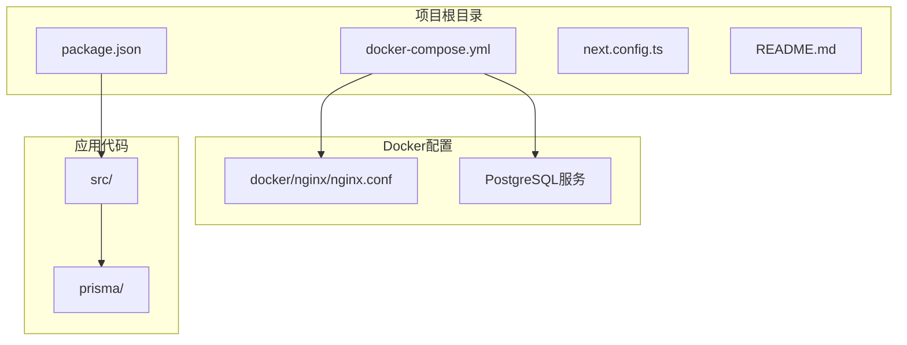
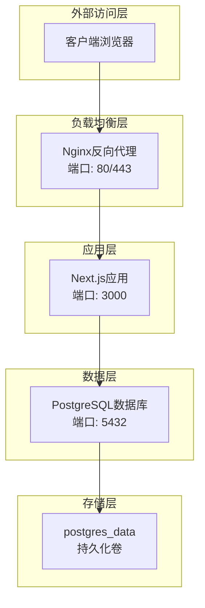
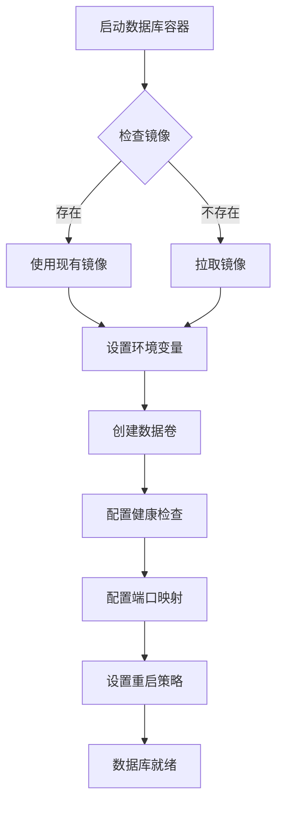
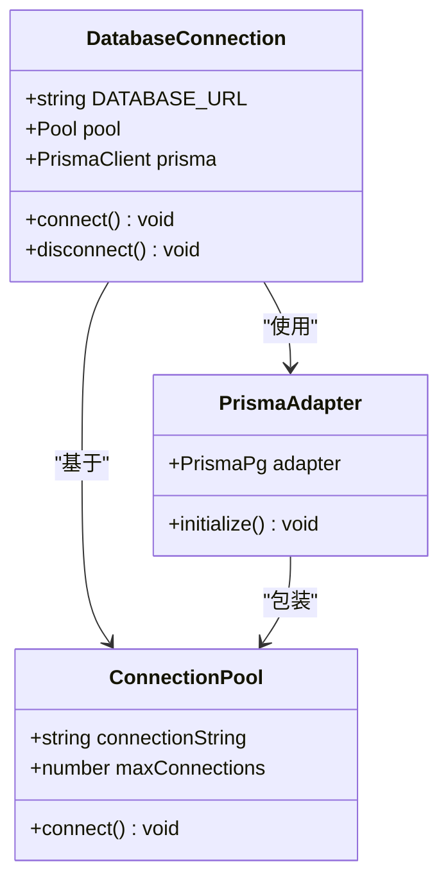
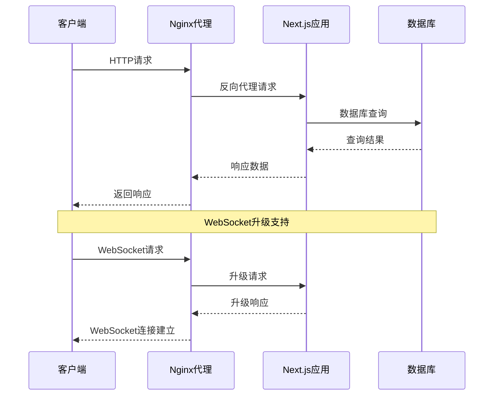
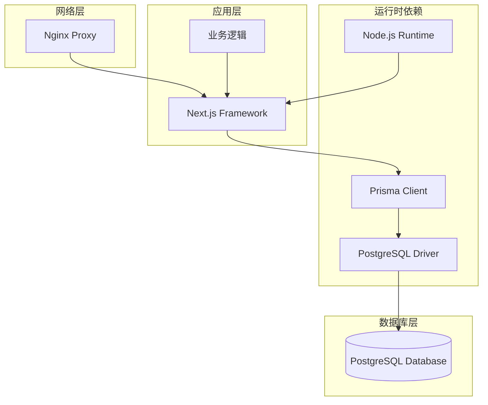
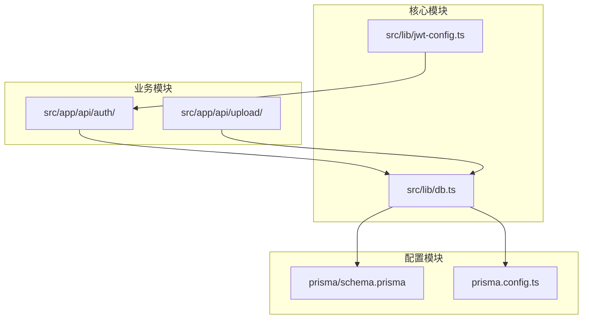

# Docker容器化部署

<cite>
**本文档引用的文件**
- [docker-compose.yml](file://docker-compose.yml)
- [nginx.conf](file://docker/nginx/nginx.conf)
- [db.ts](file://src/lib/db.ts)
- [schema.prisma](file://prisma/schema.prisma)
- [prisma.config.ts](file://prisma.config.ts)
- [package.json](file://package.json)
- [next.config.ts](file://next.config.ts)
- [README.md](file://README.md)
</cite>

## 目录
1. [简介](#简介)
2. [项目结构](#项目结构)
3. [核心组件](#核心组件)
4. [架构概览](#架构概览)
5. [详细组件分析](#详细组件分析)
6. [依赖关系分析](#依赖关系分析)
7. [性能考虑](#性能考虑)
8. [故障排除指南](#故障排除指南)
9. [结论](#结论)
10. [附录](#附录)

## 简介

本文件提供了Celestia项目的Docker容器化部署完整指南。该项目是一个基于Next.js的应用程序，使用PostgreSQL作为数据库，并通过Nginx进行反向代理。文档涵盖了docker-compose.yml配置文件的完整结构、PostgreSQL数据库服务配置、环境变量设置、数据卷挂载、容器健康检查机制、重启策略和端口映射等关键内容。

## 项目结构

该项目采用标准的Next.js项目结构，Docker相关配置主要集中在根目录的docker-compose.yml文件和docker/nginx目录下的Nginx配置文件中。



**图表来源**
- [docker-compose.yml:1-22](file://docker-compose.yml#L1-L22)
- [nginx.conf:1-26](file://docker/nginx/nginx.conf#L1-L26)

**章节来源**
- [docker-compose.yml:1-22](file://docker-compose.yml#L1-L22)
- [nginx.conf:1-26](file://docker/nginx/nginx.conf#L1-L26)

## 核心组件

### PostgreSQL数据库服务

数据库服务配置位于docker-compose.yml文件中，使用PostgreSQL 16-alpine镜像，提供以下关键特性：

- **镜像选择**: 使用轻量级的alpine版本，减少容器大小和攻击面
- **容器命名**: 容器名为`celestia-db`，便于识别和管理
- **重启策略**: `unless-stopped`确保数据库在非人为停止时自动重启
- **端口映射**: 将主机的5432端口映射到容器内部的5432端口
- **数据持久化**: 通过命名卷`postgres_data`实现数据持久化

### Nginx反向代理

Nginx配置文件提供HTTP到Next.js应用的反向代理功能：

- **上游服务器**: 配置指向`app:3000`的上游服务器
- **监听端口**: 默认监听80端口，支持HTTPS配置
- **WebSocket支持**: 包含必要的头部设置以支持WebSocket升级
- **代理头设置**: 提供完整的代理头部配置，包括真实IP、转发信息等

**章节来源**
- [docker-compose.yml:2-18](file://docker-compose.yml#L2-L18)
- [nginx.conf:1-26](file://docker/nginx/nginx.conf#L1-L26)

## 架构概览

系统采用多容器架构，包含数据库、应用和反向代理三个核心组件。



**图表来源**
- [docker-compose.yml:1-22](file://docker-compose.yml#L1-L22)
- [nginx.conf:1-26](file://docker/nginx/nginx.conf#L1-L26)

## 详细组件分析

### 数据库服务配置分析

数据库服务配置体现了生产级别的最佳实践：



**图表来源**
- [docker-compose.yml:2-18](file://docker-compose.yml#L2-L18)

#### 环境变量配置

数据库环境变量配置包括：
- `POSTGRES_DB`: 设置默认数据库名称为`celestia`
- `POSTGRES_USER`: 设置默认用户名为`celestia`
- `POSTGRES_PASSWORD`: 支持环境变量覆盖，默认值为`celestia_dev`

#### 健康检查机制

健康检查配置确保数据库服务的可靠性：
- **检查命令**: 使用`pg_isready -U celestia`验证数据库连接
- **检查间隔**: 每10秒执行一次健康检查
- **超时时间**: 每次检查最多等待5秒
- **重试次数**: 最多重试5次

#### 数据持久化策略

通过命名卷`postgres_data`实现数据持久化：
- 存储路径: `/var/lib/postgresql/data`
- 确保容器重启后数据不丢失
- 支持备份和迁移操作

**章节来源**
- [docker-compose.yml:8-18](file://docker-compose.yml#L8-L18)

### 应用数据库连接配置

应用通过Prisma ORM连接到PostgreSQL数据库，配置具有以下特点：



**图表来源**
- [db.ts:1-18](file://src/lib/db.ts#L1-L18)

#### 连接池配置

应用使用连接池管理数据库连接：
- **连接字符串**: 从`DATABASE_URL`环境变量读取
- **适配器模式**: 使用`@prisma/adapter-pg`适配器
- **全局实例**: 使用全局单例模式避免重复连接

#### 开发环境配置

开发环境具有增强的日志功能：
- **查询日志**: 启用数据库查询日志
- **错误日志**: 记录所有数据库错误
- **警告日志**: 记录潜在问题警告

**章节来源**
- [db.ts:9-15](file://src/lib/db.ts#L9-L15)

### Nginx反向代理配置

Nginx配置提供生产级别的反向代理功能：



**图表来源**
- [nginx.conf:1-26](file://docker/nginx/nginx.conf#L1-L26)

#### 代理头部配置

Nginx正确设置代理头部以确保应用获得准确的客户端信息：
- `X-Real-IP`: 客户端真实IP地址
- `X-Forwarded-For`: 代理链路信息
- `X-Forwarded-Proto`: 请求协议信息
- `Host`: 原始主机名

#### WebSocket支持

配置包含完整的WebSocket升级支持：
- `Upgrade`头部传递
- `Connection`头部设置为`upgrade`
- `proxy_cache_bypass`确保WebSocket连接不被缓存

**章节来源**
- [nginx.conf:14-24](file://docker/nginx/nginx.conf#L14-L24)

## 依赖关系分析

### 外部依赖

项目依赖关系显示了各组件之间的相互依赖：



**图表来源**
- [package.json:11-39](file://package.json#L11-L39)
- [db.ts:1-3](file://src/lib/db.ts#L1-L3)

### 内部模块依赖

应用内部模块之间的依赖关系：



**图表来源**
- [db.ts:1-18](file://src/lib/db.ts#L1-L18)
- [schema.prisma:1-281](file://prisma/schema.prisma#L1-L281)

**章节来源**
- [package.json:11-39](file://package.json#L11-L39)
- [db.ts:1-18](file://src/lib/db.ts#L1-L18)

## 性能考虑

### 数据库性能优化

- **连接池管理**: 使用连接池避免频繁建立数据库连接
- **索引设计**: Prisma schema中包含多个索引定义，优化查询性能
- **查询日志**: 开发环境启用详细日志，便于性能分析

### 应用性能配置

- **静态资源优化**: Next.js内置静态资源优化
- **缓存策略**: Nginx代理支持HTTP缓存
- **并发处理**: Node.js事件驱动架构支持高并发

### 资源限制建议

虽然当前配置未包含资源限制，但建议在生产环境中添加：

```yaml
# 示例：添加资源限制
db:
  # ... 现有配置
  deploy:
    resources:
      limits:
        memory: "512Mi"
        cpu: "500m"
      reservations:
        memory: "256Mi"
        cpu: "250m"
```

## 故障排除指南

### 数据库连接问题

**常见问题**: 应用无法连接到数据库
**排查步骤**:
1. 检查数据库容器状态: `docker-compose ps db`
2. 查看数据库日志: `docker-compose logs db`
3. 验证环境变量配置
4. 确认端口映射正常工作

**解决方案**:
- 确保`DATABASE_URL`环境变量格式正确
- 检查网络连接和防火墙设置
- 验证数据库凭据是否正确

### Nginx代理问题

**常见问题**: 反向代理无法正常工作
**排查步骤**:
1. 检查Nginx配置语法: `nginx -t`
2. 查看Nginx错误日志
3. 验证上游服务器可达性
4. 检查端口占用情况

**解决方案**:
- 确认上游服务器地址和端口正确
- 检查代理头部配置
- 验证SSL证书配置（如启用HTTPS）

### 健康检查失败

**常见问题**: 数据库健康检查持续失败
**排查步骤**:
1. 手动执行健康检查命令
2. 检查PostgreSQL服务状态
3. 验证认证凭据
4. 查看数据库日志

**解决方案**:
- 确认数据库服务正常运行
- 检查用户权限设置
- 验证网络连通性

**章节来源**
- [docker-compose.yml:14-18](file://docker-compose.yml#L14-L18)
- [nginx.conf:14-24](file://docker/nginx/nginx.conf#L14-L24)

## 结论

本Docker容器化部署方案提供了生产级别的基础设施配置，包括：

- **可靠的数据库服务**: 使用PostgreSQL 16-alpine镜像，配置健康检查和数据持久化
- **高效的反向代理**: Nginx提供HTTP和WebSocket支持，具备完整的代理头部配置
- **现代化的应用架构**: 基于Next.js框架，使用Prisma ORM进行数据库操作
- **可扩展的设计**: 支持环境变量配置和容器编排

该方案适合中小型Web应用的容器化部署需求，为开发者和运维人员提供了清晰的实施指南。

## 附录

### 环境变量参考

| 变量名 | 描述 | 默认值 | 必需 |
|--------|------|--------|------|
| DB_PASSWORD | PostgreSQL数据库密码 | celestia_dev | 否 |
| DATABASE_URL | 数据库连接字符串 | 由应用生成 | 否 |
| JWT_SECRET | JWT令牌密钥 | 无 | 是 |

### 端口映射参考

| 服务 | 容器端口 | 主机端口 | 用途 |
|------|----------|----------|------|
| PostgreSQL | 5432 | 5432 | 数据库服务 |
| Nginx | 80 | 80 | HTTP服务 |
| Next.js | 3000 | 3000 | 应用服务 |

### 命令参考

```bash
# 启动所有服务
docker-compose up -d

# 查看服务状态
docker-compose ps

# 查看服务日志
docker-compose logs -f db

# 停止所有服务
docker-compose down

# 重建服务
docker-compose up -d --build
```