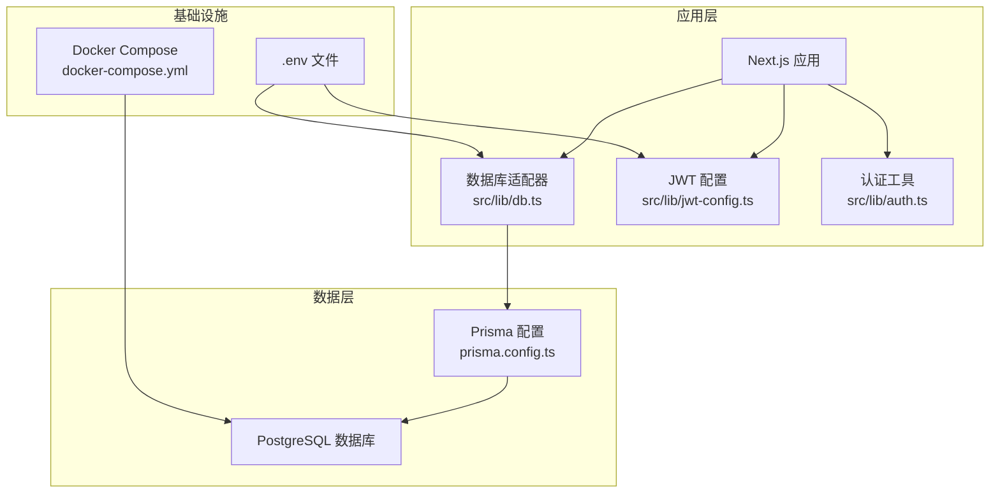
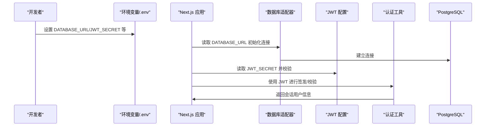
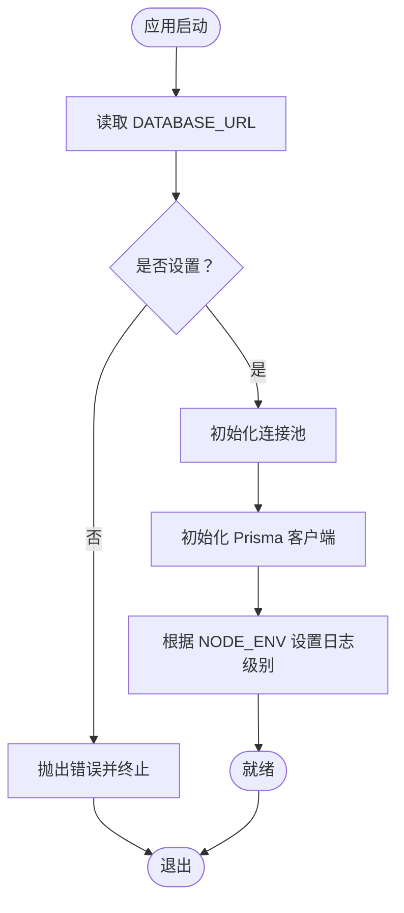
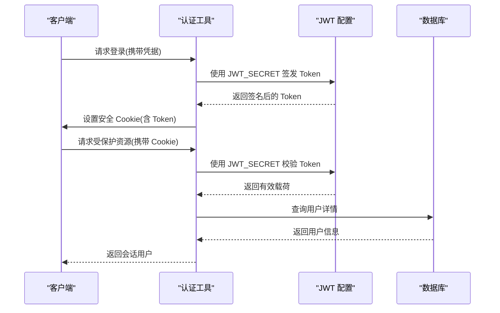
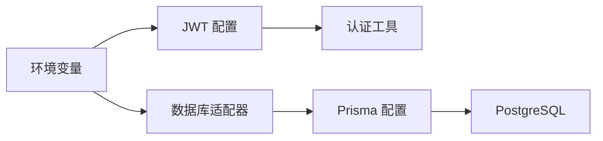

# 环境变量配置

<cite>
**本文档引用的文件**
- [package.json](file://package.json)
- [next.config.ts](file://next.config.ts)
- [prisma.config.ts](file://prisma.config.ts)
- [docker-compose.yml](file://docker-compose.yml)
- [src/lib/db.ts](file://src/lib/db.ts)
- [src/lib/jwt-config.ts](file://src/lib/jwt-config.ts)
- [src/lib/auth.ts](file://src/lib/auth.ts)
- [src/lib/constants.ts](file://src/lib/constants.ts)
- [src/types/index.ts](file://src/types/index.ts)
</cite>

## 目录
1. [简介](#简介)
2. [项目结构](#项目结构)
3. [核心组件](#核心组件)
4. [架构总览](#架构总览)
5. [详细组件分析](#详细组件分析)
6. [依赖关系分析](#依赖关系分析)
7. [性能考虑](#性能考虑)
8. [故障排除指南](#故障排除指南)
9. [结论](#结论)
10. [附录](#附录)

## 简介
本文件面向开发与运维团队，系统化梳理本项目在不同部署环境（开发、测试、生产）中的环境变量配置与管理策略。重点覆盖以下方面：
- 生产环境所需的关键环境变量清单：数据库连接、JWT 密钥、AWS S3 凭证、第三方服务凭证
- 安全存储与管理：敏感信息加密、访问控制、最小权限原则
- 不同环境的配置差异与切换方法：通过环境变量与容器编排实现
- 环境变量验证机制、默认值设置与错误处理
- Next.js 框架的环境配置选项与运行时配置
- 标准化的环境配置模板与最佳实践

## 项目结构
本项目采用 Next.js 16 应用，结合 Prisma 进行数据库访问，并通过 Docker Compose 提供本地 Postgres 数据库服务。当前代码库中显式使用的环境变量主要集中在数据库连接与 JWT 密钥配置上；AWS S3 依赖已在依赖清单中声明，但尚未在代码中直接使用。

图表来源
- [src/lib/db.ts:1-18](file://src/lib/db.ts#L1-L18)
- [prisma.config.ts:1-15](file://prisma.config.ts#L1-L15)
- [docker-compose.yml:1-22](file://docker-compose.yml#L1-L22)

章节来源
- [package.json:1-52](file://package.json#L1-L52)
- [next.config.ts:1-8](file://next.config.ts#L1-L8)
- [prisma.config.ts:1-15](file://prisma.config.ts#L1-L15)
- [docker-compose.yml:1-22](file://docker-compose.yml#L1-L22)

## 核心组件
本节概述与环境变量直接相关的核心模块及其职责：
- 数据库连接：通过连接字符串读取数据库 URL，初始化 Prisma 客户端与 PostgreSQL 连接池
- JWT 配置：从环境变量加载密钥，进行签发与校验，并设置安全 Cookie
- 认证流程：基于 JWT 的登录、登出与当前用户查询
- 部署与环境：通过 Docker Compose 提供本地数据库服务，支持默认环境变量

章节来源
- [src/lib/db.ts:1-18](file://src/lib/db.ts#L1-L18)
- [src/lib/jwt-config.ts:1-9](file://src/lib/jwt-config.ts#L1-L9)
- [src/lib/auth.ts:1-98](file://src/lib/auth.ts#L1-L98)

## 架构总览
下图展示了环境变量在系统中的流向与使用点：

图表来源
- [src/lib/db.ts:9](file://src/lib/db.ts#L9)
- [src/lib/jwt-config.ts:1](file://src/lib/jwt-config.ts#L1)
- [src/lib/auth.ts:10](file://src/lib/auth.ts#L10)

## 详细组件分析

### 数据库连接配置
- 关键变量
  - DATABASE_URL：PostgreSQL 连接字符串，由 Prisma 与数据库适配器共同使用
- 默认值与回退
  - Docker Compose 中为数据库服务提供了默认密码占位符，便于本地开发快速启动
- 日志级别
  - 根据 NODE_ENV 动态调整日志级别，开发环境更详细，生产环境仅记录错误

图表来源
- [src/lib/db.ts:9](file://src/lib/db.ts#L9)
- [src/lib/db.ts:12](file://src/lib/db.ts#L12)
- [src/lib/db.ts:14](file://src/lib/db.ts#L14)
- [docker-compose.yml:11](file://docker-compose.yml#L11)

章节来源
- [src/lib/db.ts:1-18](file://src/lib/db.ts#L1-L18)
- [prisma.config.ts:11-14](file://prisma.config.ts#L11-L14)
- [docker-compose.yml:8-13](file://docker-compose.yml#L8-L13)

### JWT 与认证配置
- 关键变量
  - JWT_SECRET：用于 HS256 签名的对称密钥
- 必要性检查
  - 启动时若未设置密钥则直接抛错，确保不会在无密钥情况下运行
- Cookie 安全属性
  - 在生产环境启用 secure 属性，统一使用 httpOnly、sameSite、maxAge 等
- 认证流程
  - 登录签发 Token，设置安全 Cookie
  - 校验 Token 并查询用户信息，返回会话对象

图表来源
- [src/lib/jwt-config.ts:1](file://src/lib/jwt-config.ts#L1)
- [src/lib/jwt-config.ts:5](file://src/lib/jwt-config.ts#L5)
- [src/lib/auth.ts:10](file://src/lib/auth.ts#L10)
- [src/lib/auth.ts:23](file://src/lib/auth.ts#L23)
- [src/lib/auth.ts:35](file://src/lib/auth.ts#L35)
- [src/lib/auth.ts:57](file://src/lib/auth.ts#L57)

章节来源
- [src/lib/jwt-config.ts:1-9](file://src/lib/jwt-config.ts#L1-L9)
- [src/lib/auth.ts:1-98](file://src/lib/auth.ts#L1-L98)
- [src/types/index.ts:41-59](file://src/types/index.ts#L41-L59)

### AWS S3 与第三方服务凭证
- 依赖现状
  - 已在依赖清单中声明 AWS SDK 相关包，表明未来可能接入 S3 或其他云服务
  - 当前代码库未发现直接使用 S3 的实现
- 建议
  - 若接入 S3，建议新增如下变量：AWS_ACCESS_KEY_ID、AWS_SECRET_ACCESS_KEY、AWS_REGION、S3_BUCKET_NAME
  - 对于其他第三方服务（如邮件、支付），建议以 SERVICE_NAME_API_KEY 形式命名并集中管理

章节来源
- [package.json:12](file://package.json#L12)
- [package.json:22](file://package.json#L22)

### Next.js 环境配置与运行时
- Next 配置
  - 当前配置为空对象，可扩展运行时配置、实验特性等
- 运行时行为
  - NODE_ENV 控制日志级别与 Cookie 安全标志
  - 通过进程环境变量影响数据库与认证行为

章节来源
- [next.config.ts:1-8](file://next.config.ts#L1-L8)
- [src/lib/db.ts:14](file://src/lib/db.ts#L14)
- [src/lib/auth.ts:39](file://src/lib/auth.ts#L39)

## 依赖关系分析
- 组件耦合
  - 数据库适配器依赖 DATABASE_URL
  - JWT 配置依赖 JWT_SECRET
  - 认证工具同时依赖 JWT 配置与数据库适配器
- 外部依赖
  - AWS SDK 包已声明，但未在代码中使用
  - Prisma 与 Postgres 通过连接字符串耦合

图表来源
- [src/lib/db.ts:9](file://src/lib/db.ts#L9)
- [src/lib/jwt-config.ts:1](file://src/lib/jwt-config.ts#L1)
- [src/lib/auth.ts:1](file://src/lib/auth.ts#L1)
- [prisma.config.ts:12](file://prisma.config.ts#L12)

章节来源
- [src/lib/db.ts:1-18](file://src/lib/db.ts#L1-L18)
- [src/lib/jwt-config.ts:1-9](file://src/lib/jwt-config.ts#L1-L9)
- [src/lib/auth.ts:1-98](file://src/lib/auth.ts#L1-L98)
- [prisma.config.ts:1-15](file://prisma.config.ts#L1-L15)

## 性能考虑
- 日志级别
  - 开发环境开启详细日志，有助于定位问题；生产环境仅记录错误，降低 I/O 压力
- 连接池
  - 使用连接池减少频繁建立/断开连接的开销
- Cookie 安全
  - 在生产环境启用 secure 属性，避免在非 HTTPS 下传输敏感 Cookie

章节来源
- [src/lib/db.ts:14](file://src/lib/db.ts#L14)
- [src/lib/auth.ts:39](file://src/lib/auth.ts#L39)

## 故障排除指南
- 启动时报错“JWT_SECRET 未设置”
  - 现象：应用启动即抛出错误
  - 排查：确认 .env 文件中存在 JWT_SECRET，且加载顺序正确
  - 参考路径：[src/lib/jwt-config.ts:1-4](file://src/lib/jwt-config.ts#L1-L4)
- 数据库连接失败
  - 现象：应用无法连接到数据库
  - 排查：确认 DATABASE_URL 格式正确；检查 Docker Compose 是否正常运行；核对默认密码占位符
  - 参考路径：[src/lib/db.ts:9](file://src/lib/db.ts#L9)，[docker-compose.yml:11](file://docker-compose.yml#L11)
- 认证失败或 Cookie 未生效
  - 现象：登录成功但后续请求仍提示未登录
  - 排查：确认 Cookie 安全标志（secure、httpOnly）与域名一致；检查 JWT 过期时间与服务器时间同步
  - 参考路径：[src/lib/auth.ts:35](file://src/lib/auth.ts#L35)，[src/lib/auth.ts:23](file://src/lib/auth.ts#L23)

章节来源
- [src/lib/jwt-config.ts:1-4](file://src/lib/jwt-config.ts#L1-L4)
- [src/lib/db.ts:9](file://src/lib/db.ts#L9)
- [docker-compose.yml:11](file://docker-compose.yml#L11)
- [src/lib/auth.ts:23](file://src/lib/auth.ts#L23)
- [src/lib/auth.ts:35](file://src/lib/auth.ts#L35)

## 结论
本项目已具备基础的环境变量使用能力：数据库连接与 JWT 密钥配置。建议下一步完善以下内容：
- 明确列出生产环境所需的所有环境变量清单
- 引入统一的环境变量验证与默认值机制
- 建立多环境配置模板与 CI/CD 中的注入流程
- 如计划接入 AWS S3，补充相应的变量与最小权限策略

## 附录

### A. 环境变量清单与用途
- 数据库相关
  - DATABASE_URL：PostgreSQL 连接字符串
- 认证相关
  - JWT_SECRET：HS256 对称密钥
- 运行时相关
  - NODE_ENV：开发/生产环境标识
- 可选（建议）
  - AWS_ACCESS_KEY_ID、AWS_SECRET_ACCESS_KEY、AWS_REGION、S3_BUCKET_NAME
  - 第三方服务凭证（按服务命名）

章节来源
- [src/lib/db.ts:9](file://src/lib/db.ts#L9)
- [src/lib/jwt-config.ts:1](file://src/lib/jwt-config.ts#L1)
- [src/lib/auth.ts:39](file://src/lib/auth.ts#L39)

### B. 不同环境的配置差异与切换
- 开发环境
  - 使用本地 Docker Compose 提供的数据库，默认密码占位符便于快速启动
  - NODE_ENV=development，日志更详细
- 测试环境
  - 使用独立的测试数据库实例，隔离数据
  - NODE_ENV=test，日志级别可按需调整
- 生产环境
  - 使用专用数据库与密钥管理服务，启用 secure Cookie
  - NODE_ENV=production，严格限制日志输出

章节来源
- [docker-compose.yml:8-13](file://docker-compose.yml#L8-L13)
- [src/lib/db.ts:14](file://src/lib/db.ts#L14)
- [src/lib/auth.ts:39](file://src/lib/auth.ts#L39)

### C. 安全存储与管理策略
- 最小权限原则：仅为服务授予必要权限
- 加密与轮换：密钥定期轮换，旧密钥在一段时间内保留以兼容正在使用的 Token
- 访问控制：限制密钥读取范围，仅限运行时服务账户可见
- 审计与监控：记录密钥使用事件，异常访问及时告警

### D. 环境变量验证机制与默认值
- 必填项强制校验：未设置时立即抛错，避免静默失败
- 默认值策略：仅在本地开发场景提供合理默认值，生产环境必须显式配置
- 类型与格式校验：建议在启动阶段对 DATABASE_URL 进行格式校验

章节来源
- [src/lib/jwt-config.ts:1-4](file://src/lib/jwt-config.ts#L1-L4)
- [docker-compose.yml:11](file://docker-compose.yml#L11)

### E. Next.js 环境配置选项与运行时配置
- 运行时配置：可在 next.config.ts 中扩展，如实验特性、构建优化等
- 环境变量：通过 process.env 注入，注意区分构建期与运行时可用的变量

章节来源
- [next.config.ts:1-8](file://next.config.ts#L1-L8)