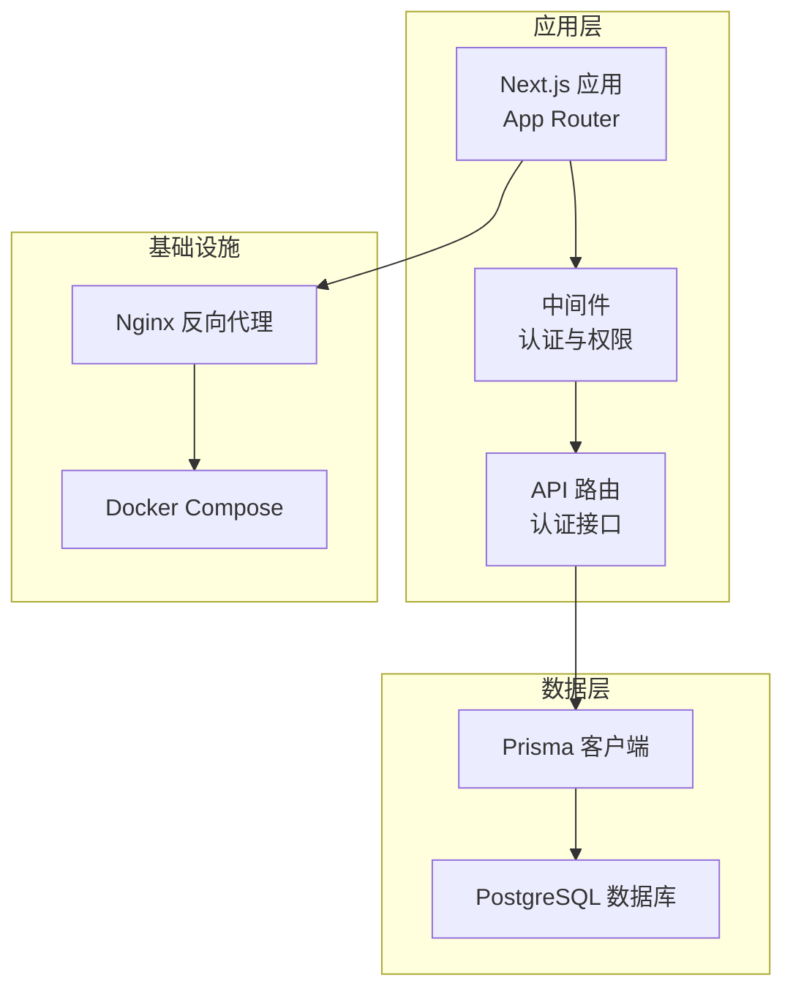
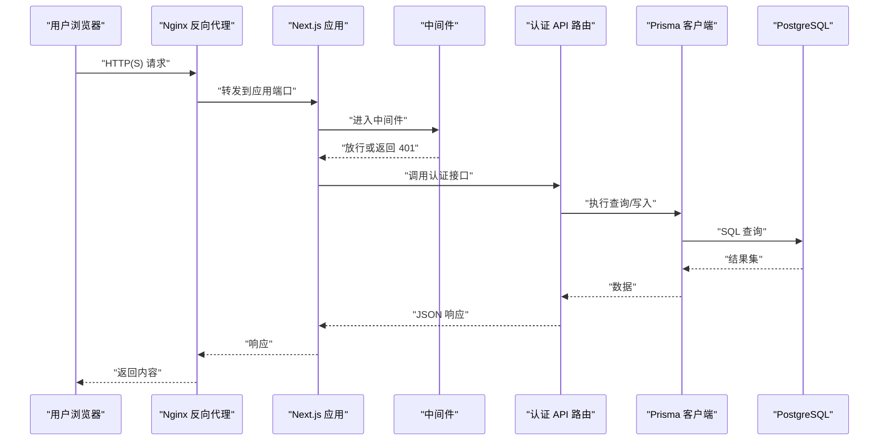
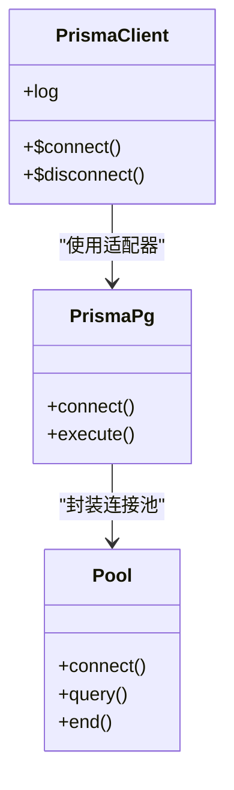
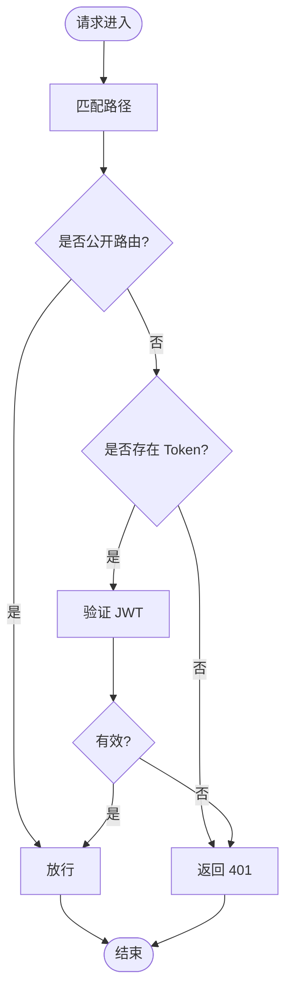
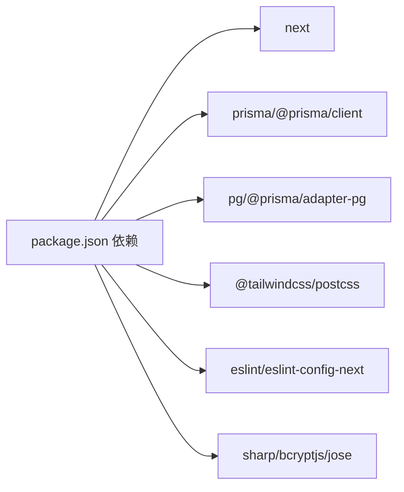

# 生产环境优化

<cite>
**本文引用的文件**
- [next.config.ts](file://next.config.ts)
- [package.json](file://package.json)
- [docker-compose.yml](file://docker-compose.yml)
- [prisma/schema.prisma](file://prisma/schema.prisma)
- [src/lib/db.ts](file://src/lib/db.ts)
- [docker/nginx/nginx.conf](file://docker/nginx/nginx.conf)
- [src/app/layout.tsx](file://src/app/layout.tsx)
- [src/app/globals.css](file://src/app/globals.css)
- [tsconfig.json](file://tsconfig.json)
- [src/middleware.ts](file://src/middleware.ts)
- [src/app/api/auth/login/route.ts](file://src/app/api/auth/login/route.ts)
- [src/app/api/auth/register/route.ts](file://src/app/api/auth/register/route.ts)
- [src/lib/constants.ts](file://src/lib/constants.ts)
- [src/lib/utils.ts](file://src/lib/utils.ts)
- [postcss.config.mjs](file://postcss.config.mjs)
</cite>

## 目录
1. [简介](#简介)
2. [项目结构](#项目结构)
3. [核心组件](#核心组件)
4. [架构总览](#架构总览)
5. [详细组件分析](#详细组件分析)
6. [依赖关系分析](#依赖关系分析)
7. [性能考量](#性能考量)
8. [故障排除指南](#故障排除指南)
9. [结论](#结论)
10. [附录](#附录)

## 简介
本文件面向运维与开发团队，提供一套系统化的生产环境优化指南，覆盖以下方面：
- Next.js 应用的生产构建配置、代码分割与预渲染策略
- 数据库连接池优化、查询性能调优与索引策略
- 静态资源优化、图片压缩与 CDN 集成方案
- 缓存策略、负载均衡与自动扩缩容机制
- SSL/TLS 配置、安全头设置与 HTTPS 重定向
- 性能监控指标、APM 工具集成与错误追踪配置
- 面向生产的部署与运维实践建议

## 项目结构
该项目采用 Next.js App Router 结构，使用 Prisma 作为 ORM，PostgreSQL 作为数据存储，并通过 Docker Compose 提供本地数据库服务。前端样式基于 TailwindCSS 与自定义主题变量。

图表来源
- [src/middleware.ts](file://src/middleware.ts)
- [src/app/api/auth/login/route.ts](file://src/app/api/auth/login/route.ts)
- [src/app/api/auth/register/route.ts](file://src/app/api/auth/register/route.ts)
- [src/lib/db.ts](file://src/lib/db.ts)
- [docker-compose.yml](file://docker-compose.yml)
- [docker/nginx/nginx.conf](file://docker/nginx/nginx.conf)

章节来源
- [package.json](file://package.json)
- [tsconfig.json](file://tsconfig.json)
- [src/app/layout.tsx](file://src/app/layout.tsx)
- [src/app/globals.css](file://src/app/globals.css)
- [postcss.config.mjs](file://postcss.config.mjs)

## 核心组件
- Next.js 构建与运行：通过脚本进行开发、构建与启动，支持国际化与多语言。
- 数据访问层：使用 Prisma 客户端与 PostgreSQL，通过连接池适配器实现稳定连接。
- 中间件：统一处理认证与权限校验，拦截 API 请求并校验 JWT。
- Nginx 反向代理：提供上游 Next.js 实例的反向代理与基础头部透传。
- Docker Compose：本地快速搭建数据库服务，包含健康检查与持久化卷。

章节来源
- [package.json](file://package.json)
- [src/lib/db.ts](file://src/lib/db.ts)
- [src/middleware.ts](file://src/middleware.ts)
- [docker-compose.yml](file://docker-compose.yml)
- [docker/nginx/nginx.conf](file://docker/nginx/nginx.conf)

## 架构总览
下图展示生产环境中的典型流量路径：客户端请求经 Nginx 到达 Next.js 应用；应用通过中间件进行认证校验；API 路由访问 Prisma 客户端，最终查询 PostgreSQL 数据库。

图表来源
- [docker/nginx/nginx.conf](file://docker/nginx/nginx.conf)
- [src/middleware.ts](file://src/middleware.ts)
- [src/app/api/auth/login/route.ts](file://src/app/api/auth/login/route.ts)
- [src/app/api/auth/register/route.ts](file://src/app/api/auth/register/route.ts)
- [src/lib/db.ts](file://src/lib/db.ts)
- [prisma/schema.prisma](file://prisma/schema.prisma)

## 详细组件分析

### Next.js 构建与运行配置
- 构建脚本：提供开发、构建与启动命令，便于在不同环境中切换。
- 国际化：引入国际化框架，支持多语言页面与消息。
- 类型严格性：启用严格模式与增量编译，提升类型安全与开发体验。
- 样式体系：TailwindCSS 与自定义主题变量，支持深色模式与品牌色系。

章节来源
- [package.json](file://package.json)
- [tsconfig.json](file://tsconfig.json)
- [src/app/layout.tsx](file://src/app/layout.tsx)
- [src/app/globals.css](file://src/app/globals.css)
- [postcss.config.mjs](file://postcss.config.mjs)

### 数据库连接池与 ORM 配置
- 连接池：使用 pg 的 Pool 创建连接池，通过 PrismaPg 适配器注入 Prisma 客户端。
- 日志级别：开发环境开启详细日志，生产环境仅记录错误以降低开销。
- 全局单例：避免重复实例化导致的连接泄漏与资源浪费。

图表来源
- [src/lib/db.ts](file://src/lib/db.ts)

章节来源
- [src/lib/db.ts](file://src/lib/db.ts)
- [prisma/schema.prisma](file://prisma/schema.prisma)

### 认证中间件与 API 路由
- 中间件职责：识别公开路由与认证路由，校验 JWT 并放行或拒绝请求。
- 认证 API：登录与注册接口，包含输入校验、密码哈希、令牌签发与 Cookie 设置。
- 用户会话：从 Cookie 读取并验证 JWT，按需查询用户完整信息。

图表来源
- [src/middleware.ts](file://src/middleware.ts)
- [src/app/api/auth/login/route.ts](file://src/app/api/auth/login/route.ts)
- [src/app/api/auth/register/route.ts](file://src/app/api/auth/register/route.ts)

章节来源
- [src/middleware.ts](file://src/middleware.ts)
- [src/app/api/auth/login/route.ts](file://src/app/api/auth/login/route.ts)
- [src/app/api/auth/register/route.ts](file://src/app/api/auth/register/route.ts)

### Prisma Schema 与索引策略
- 枚举与模型：涵盖用户、品类、商品、SKU、图片、订单、订单项、支付与物流等核心实体。
- 索引设计：在关键查询字段上建立索引，如产品分类、状态、订单用户、订单项 SKU 等，以提升查询性能。
- 关系映射：明确外键与级联删除策略，确保数据一致性。

章节来源
- [prisma/schema.prisma](file://prisma/schema.prisma)

### 样式与主题
- 主题变量：定义品牌色与暗色模式变量，统一全局样式与组件风格。
- 字体与排版：使用 Google Fonts 与可交换字体显示策略，提升首屏渲染体验。
- 动画与交互：结合动画库与 UI 组件，提供流畅的用户体验。

章节来源
- [src/app/globals.css](file://src/app/globals.css)
- [src/app/layout.tsx](file://src/app/layout.tsx)

## 依赖关系分析
- 依赖生态：Next.js 16、Prisma 7、PostgreSQL、TailwindCSS、AWS S3 客户端等。
- 开发工具链：ESLint、TypeScript、PostCSS 插件等。
- 运行时依赖：pg、@prisma/adapter-pg、bcryptjs、jose 等。

图表来源
- [package.json](file://package.json)

章节来源
- [package.json](file://package.json)

## 性能考量

### Next.js 生产构建与代码分割
- 构建产物：使用构建脚本生成生产包，建议在 CI 中缓存依赖与构建产物以缩短时间。
- 代码分割：利用 App Router 的路由级分割与动态导入，减少初始包体积。
- 预渲染策略：对静态页面启用静态生成；对需要实时数据的页面使用服务端渲染或客户端渲染，避免不必要的预渲染。

章节来源
- [package.json](file://package.json)
- [next.config.ts](file://next.config.ts)

### 数据库连接池与查询优化
- 连接池参数：根据并发请求数与数据库承载能力调整最大连接数、空闲超时与获取超时。
- 查询优化：优先使用带索引的过滤条件；避免 N+1 查询，使用 include 或 select 精准加载所需字段。
- 索引策略：对高频过滤与排序字段建立复合索引；定期分析查询计划，剔除冗余索引。

章节来源
- [src/lib/db.ts](file://src/lib/db.ts)
- [prisma/schema.prisma](file://prisma/schema.prisma)

### 静态资源优化与 CDN 集成
- 图片压缩：使用图像处理库进行压缩与 WebP 转换，结合响应式尺寸与懒加载。
- CDN 集成：将静态资源与媒体文件托管至 CDN，配置缓存头与边缘加速。
- 资源版本化：通过文件名哈希实现长期缓存与更新控制。

章节来源
- [src/app/globals.css](file://src/app/globals.css)
- [docker/nginx/nginx.conf](file://docker/nginx/nginx.conf)

### 缓存策略与负载均衡
- 应用缓存：对不敏感的查询结果使用短期缓存；对配置与字典类数据使用长缓存。
- 负载均衡：使用反向代理或云负载均衡分发请求，配置健康检查与会话保持策略。
- 自动扩缩容：基于 CPU、内存与请求延迟指标设置扩缩容策略，确保高可用与成本优化。

章节来源
- [docker/nginx/nginx.conf](file://docker/nginx/nginx.conf)
- [docker-compose.yml](file://docker-compose.yml)

### SSL/TLS、安全头与 HTTPS 重定向
- SSL/TLS：在生产环境启用 HTTPS，配置证书与私钥；禁用弱协议与加密套件。
- 安全头：设置严格的 CSP、HSTS、X-Frame-Options、X-Content-Type-Options 等。
- HTTPS 重定向：强制将 HTTP 请求重定向至 HTTPS，确保传输安全。

章节来源
- [docker/nginx/nginx.conf](file://docker/nginx/nginx.conf)

### 性能监控与错误追踪
- 指标采集：收集请求延迟、吞吐量、错误率、数据库查询耗时与连接池利用率。
- APM 集成：接入应用性能监控平台，跟踪慢事务与异常堆栈。
- 错误追踪：集中化日志与错误上报，区分严重度并设置告警阈值。

章节来源
- [src/lib/db.ts](file://src/lib/db.ts)
- [src/middleware.ts](file://src/middleware.ts)

## 故障排除指南

### 数据库连接问题
- 症状：连接超时、连接池耗尽、查询失败。
- 排查：检查连接字符串、网络连通性与数据库健康状态；查看连接池参数与日志级别。
- 处理：增加最大连接数、优化慢查询、启用连接复用与健康检查。

章节来源
- [src/lib/db.ts](file://src/lib/db.ts)
- [docker-compose.yml](file://docker-compose.yml)

### 认证与权限异常
- 症状：登录成功但接口返回 401，JWT 校验失败。
- 排查：确认中间件路径匹配、Cookie 名称一致、JWT 秘钥正确且未过期。
- 处理：统一密钥管理、检查时钟同步、清理无效 Cookie。

章节来源
- [src/middleware.ts](file://src/middleware.ts)
- [src/app/api/auth/login/route.ts](file://src/app/api/auth/login/route.ts)
- [src/app/api/auth/register/route.ts](file://src/app/api/auth/register/route.ts)

### Nginx 代理与路由问题
- 症状：代理后无法访问、WebSocket 升级失败、头部丢失。
- 排查：确认上游服务地址、头部透传配置与升级头设置。
- 处理：启用必要的代理头、升级头与缓存绕过规则。

章节来源
- [docker/nginx/nginx.conf](file://docker/nginx/nginx.conf)

### 样式与主题异常
- 症状：主题变量未生效、深色模式切换异常。
- 排查：检查全局样式加载顺序、CSS 变量定义与类名拼接逻辑。
- 处理：确保样式按序加载、变量命名规范与组件类名合并函数正确使用。

章节来源
- [src/app/globals.css](file://src/app/globals.css)
- [src/app/layout.tsx](file://src/app/layout.tsx)
- [src/lib/utils.ts](file://src/lib/utils.ts)

## 结论
通过合理的构建配置、数据库优化、静态资源与 CDN 策略、缓存与负载均衡、安全加固以及完善的监控与故障排查流程，可以显著提升系统的稳定性、性能与可维护性。建议在生产环境中持续评估与迭代上述策略，结合业务增长与用户规模动态调整。

## 附录

### 生产环境推荐清单
- 启用 HTTPS 并配置安全头
- 使用连接池与查询优化
- 配置 CDN 与图片压缩
- 设置缓存与自动扩缩容
- 集成 APM 与错误追踪
- 定期审查索引与查询计划