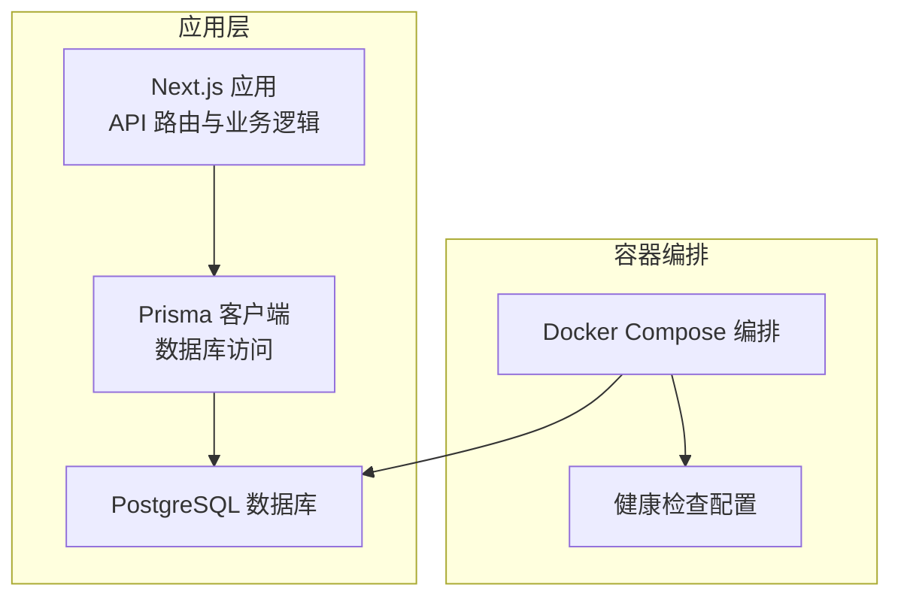
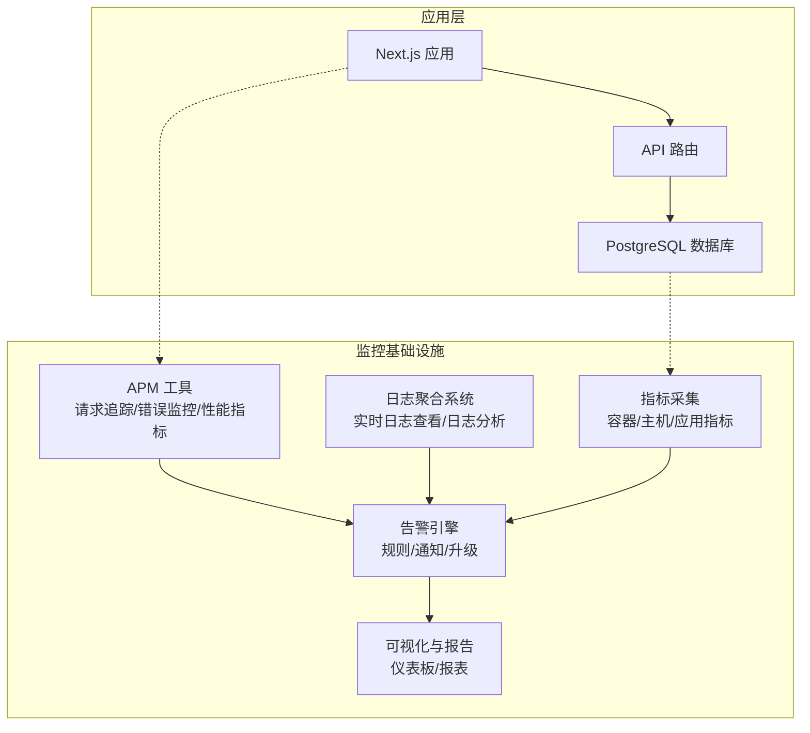
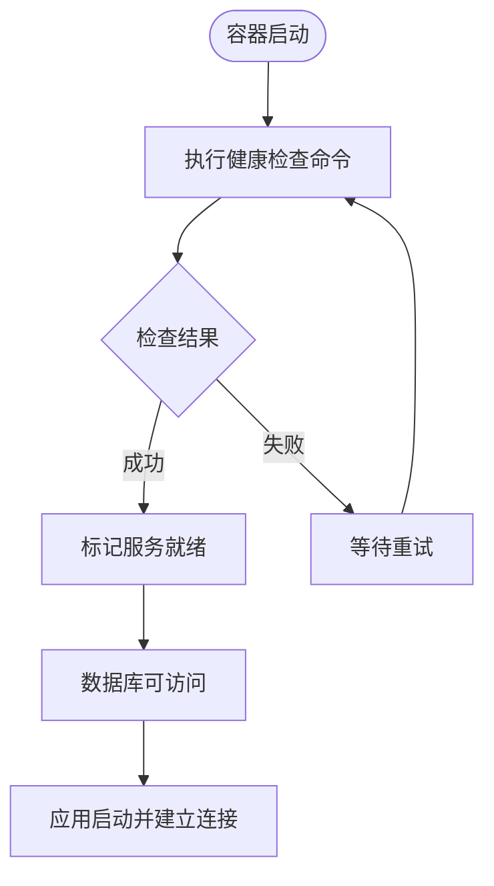
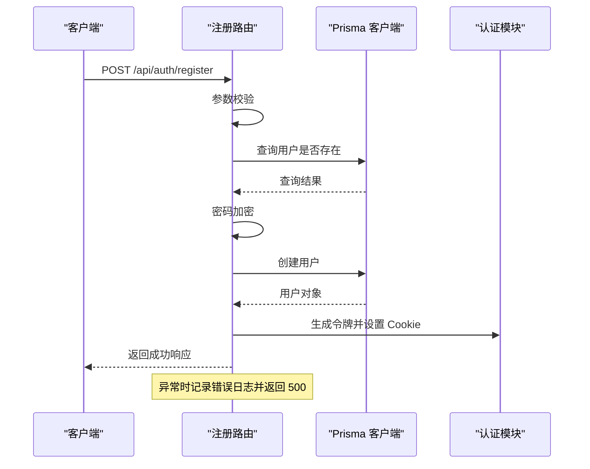
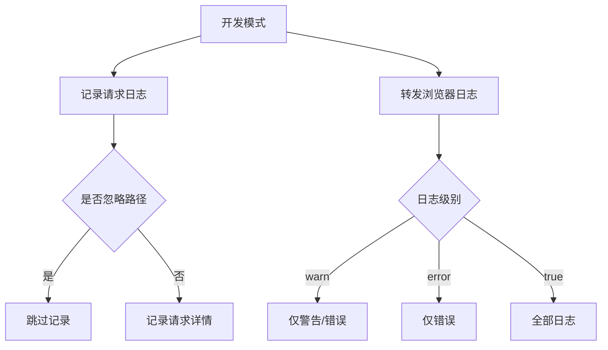
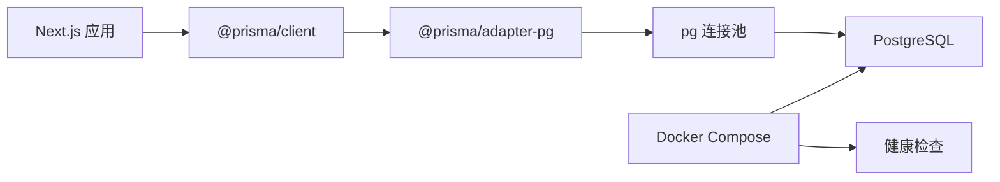

# 监控告警系统

<cite>
**本文档引用的文件**
- [docker-compose.yml](file://docker-compose.yml)
- [package.json](file://package.json)
- [README.md](file://README.md)
- [AGENTS.md](file://AGENTS.md)
- [CLAUDE.md](file://CLAUDE.md)
- [logging.md](file://node_modules/next/dist/docs/01-app/03-api-reference/05-config/01-next-config-js/logging.md)
- [db.ts](file://src/lib/db.ts)
- [prisma.config.ts](file://prisma.config.ts)
- [register/route.ts](file://src/app/api/auth/register/route.ts)
</cite>

## 目录
1. [简介](#简介)
2. [项目结构](#项目结构)
3. [核心组件](#核心组件)
4. [架构概览](#架构概览)
5. [详细组件分析](#详细组件分析)
6. [依赖关系分析](#依赖关系分析)
7. [性能考虑](#性能考虑)
8. [故障排查指南](#故障排查指南)
9. [结论](#结论)
10. [附录](#附录)

## 简介
本实施文档面向运维团队，提供基于当前代码库的监控告警体系建设与运维最佳实践指南。文档聚焦以下方面：
- 应用性能监控（APM）：请求追踪、错误监控、性能指标收集
- 日志聚合与分析：实时日志查看与日志分析工具集成
- 基础设施监控：容器健康检查与资源使用率监控
- 告警规则与通知：告警规则配置、通知渠道设置与升级策略
- 可视化与报告：监控数据可视化、仪表板配置与报告生成
- 故障排查与预防：故障排查流程、根因分析方法与预防性维护建议

当前代码库以 Next.js 16 应用为核心，采用 PostgreSQL 数据库，通过 Prisma 进行数据访问。监控体系应围绕应用层、数据库层与容器层进行统一设计。

## 项目结构
项目采用前后端一体化的 Next.js 应用结构，数据库通过 Prisma 连接 PostgreSQL。容器编排使用 Docker Compose，包含数据库服务及其健康检查配置。

**图表来源**
- [docker-compose.yml:1-22](file://docker-compose.yml#L1-L22)
- [db.ts:1-18](file://src/lib/db.ts#L1-L18)

**章节来源**
- [README.md:1-37](file://README.md#L1-L37)
- [docker-compose.yml:1-22](file://docker-compose.yml#L1-L22)
- [package.json:1-58](file://package.json#L1-L58)

## 核心组件
- 应用框架与运行时：Next.js 16，支持开发模式下的日志配置与请求追踪能力
- 数据库访问：Prisma 客户端通过 @prisma/adapter-pg 连接 PostgreSQL
- 容器编排：Docker Compose 管理数据库服务与健康检查
- 日志配置：Next.js 开发模式下的请求日志、浏览器控制台日志转发等

**章节来源**
- [package.json:11-44](file://package.json#L11-L44)
- [db.ts:1-18](file://src/lib/db.ts#L1-L18)
- [docker-compose.yml:14-18](file://docker-compose.yml#L14-L18)
- [logging.md:84-113](file://node_modules/next/dist/docs/01-app/03-api-reference/05-config/01-next-config-js/logging.md#L84-L113)

## 架构概览
下图展示了监控告警系统在当前代码库中的落地位置与交互关系：

[此图为概念性架构示意，不直接映射具体源文件，故无图表来源]

## 详细组件分析

### 数据库监控与健康检查
- 健康检查：数据库服务定义了健康检查指令与重试策略，可用于容器编排层面的可用性监控
- 连接池与日志：Prisma 使用连接池连接数据库；开发环境下启用查询、错误、警告日志，生产环境仅记录错误日志

**图表来源**
- [docker-compose.yml:14-18](file://docker-compose.yml#L14-L18)

**章节来源**
- [docker-compose.yml:14-18](file://docker-compose.yml#L14-L18)
- [db.ts:9-15](file://src/lib/db.ts#L9-L15)

### API 路由与错误处理
- 注册接口：包含输入校验、重复检测、密码加密、用户创建与会话签发
- 错误处理：捕获异常并输出错误日志，返回标准化响应

**图表来源**
- [register/route.ts:8-86](file://src/app/api/auth/register/route.ts#L8-L86)

**章节来源**
- [register/route.ts:8-86](file://src/app/api/auth/register/route.ts#L8-L86)

### 日志配置与开发调试
- 请求日志：开发模式下默认记录所有请求，可通过配置忽略特定路径
- 浏览器日志：可将浏览器控制台日志转发到终端，便于前端调试
- 日志级别：支持按需调整日志输出范围

**图表来源**
- [logging.md:64-82](file://node_modules/next/dist/docs/01-app/03-api-reference/05-config/01-next-config-js/logging.md#L64-L82)
- [logging.md:88-113](file://node_modules/next/dist/docs/01-app/03-api-reference/05-config/01-next-config-js/logging.md#L88-L113)

**章节来源**
- [logging.md:64-82](file://node_modules/next/dist/docs/01-app/03-api-reference/05-config/01-next-config-js/logging.md#L64-L82)
- [logging.md:88-113](file://node_modules/next/dist/docs/01-app/03-api-reference/05-config/01-next-config-js/logging.md#L88-L113)

## 依赖关系分析
- 应用依赖 Next.js 16 与 Prisma 生态，数据库连接通过 @prisma/adapter-pg 与 pg 实现
- Docker Compose 提供数据库服务与健康检查
- 日志与监控工具需与应用层、数据库层及容器层协同部署

**图表来源**
- [package.json:11-44](file://package.json#L11-L44)
- [db.ts:1-18](file://src/lib/db.ts#L1-L18)
- [docker-compose.yml:1-22](file://docker-compose.yml#L1-L22)

**章节来源**
- [package.json:11-44](file://package.json#L11-L44)
- [db.ts:1-18](file://src/lib/db.ts#L1-L18)
- [docker-compose.yml:1-22](file://docker-compose.yml#L1-L22)

## 性能考虑
- 数据库连接池：合理配置连接池大小与超时时间，避免高并发下的连接争用
- 日志级别：生产环境降低日志量，避免 I/O 影响性能
- 请求追踪：对关键路径启用采样式追踪，平衡性能与可观测性
- 缓存策略：结合应用缓存与数据库索引优化热点查询

[本节为通用性能建议，无需源文件引用]

## 故障排查指南
- 数据库不可达
  - 检查容器健康状态与网络连通性
  - 查看数据库日志与连接池状态
  - 验证连接字符串与凭据
- API 错误
  - 关注注册路由中的异常日志与状态码
  - 校验输入参数与业务规则
- 日志问题
  - 开发模式下确认请求日志与浏览器日志转发配置
  - 检查日志级别与忽略规则

**章节来源**
- [docker-compose.yml:14-18](file://docker-compose.yml#L14-L18)
- [register/route.ts:78-84](file://src/app/api/auth/register/route.ts#L78-L84)
- [logging.md:64-82](file://node_modules/next/dist/docs/01-app/03-api-reference/05-config/01-next-config-js/logging.md#L64-L82)

## 结论
本实施文档基于现有代码库提出了监控告警系统的建设方案，覆盖应用、数据库与容器三层监控，并提供了故障排查与运维最佳实践。建议在现有基础上逐步引入 APM 工具、日志聚合系统与指标采集平台，完善告警规则与可视化展示，形成闭环的监控运维体系。

[本节为总结性内容，无需源文件引用]

## 附录
- 术语说明
  - APM：应用性能监控，包含请求追踪、错误监控与性能指标
  - 日志聚合：集中收集、存储与分析多源日志
  - 健康检查：容器或服务可用性验证机制
- 参考资料
  - Next.js 日志配置文档
  - Prisma 数据库配置与连接池
  - Docker Compose 健康检查

[本节为参考信息，无需源文件引用]