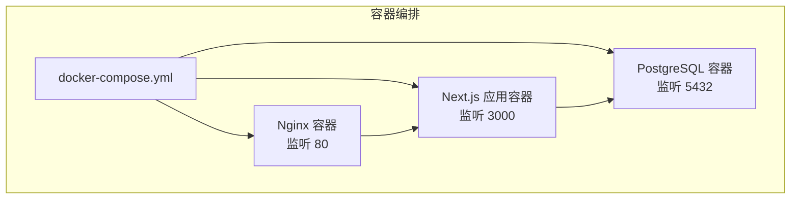
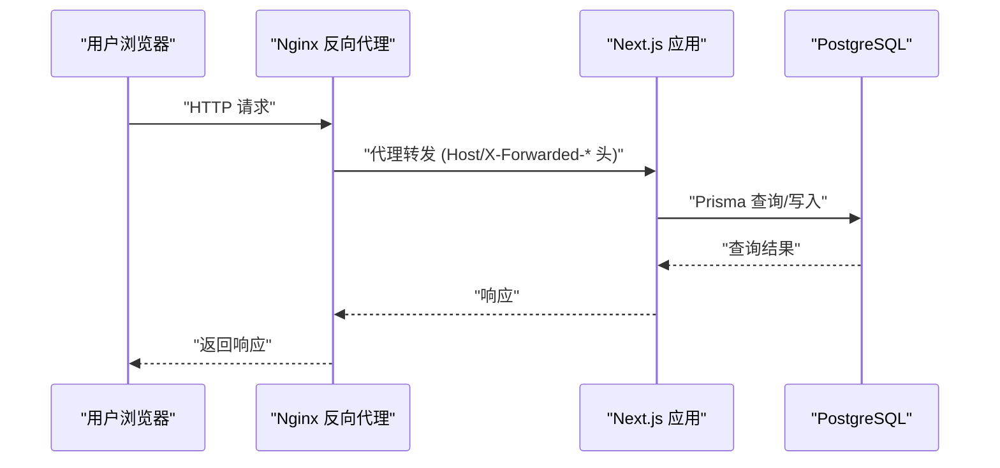
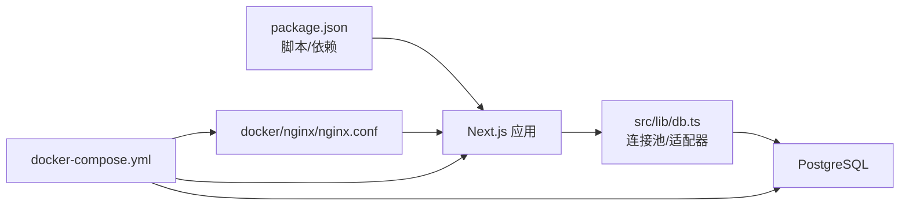

# 部署配置

<cite>
**本文引用的文件**
- [docker-compose.yml](file://docker-compose.yml)
- [nginx.conf](file://docker/nginx/nginx.conf)
- [package.json](file://package.json)
- [next.config.ts](file://next.config.ts)
- [schema.prisma](file://prisma/schema.prisma)
- [db.ts](file://src/lib/db.ts)
- [constants.ts](file://src/lib/constants.ts)
- [utils.ts](file://src/lib/utils.ts)
</cite>

## 目录
1. [简介](#简介)
2. [项目结构](#项目结构)
3. [核心组件](#核心组件)
4. [架构总览](#架构总览)
5. [详细组件分析](#详细组件分析)
6. [依赖关系分析](#依赖关系分析)
7. [性能考虑](#性能考虑)
8. [故障排查指南](#故障排查指南)
9. [结论](#结论)
10. [附录](#附录)

## 简介
本文件面向运维工程师与DevOps团队，提供Celestia项目的完整部署实施指南。内容覆盖Docker容器化部署、Nginx反向代理配置、环境变量管理、生产环境优化、负载均衡与SSL证书设置、CI/CD流水线与自动化部署/回滚策略、云平台部署指南（含AWS与Vercel思路）、数据库连接与文件存储集成、监控告警与日志管理、性能调优、安全加固、备份与灾难恢复等。

## 项目结构
- 应用层：Next.js应用，使用App Router组织页面与API路由。
- 数据层：PostgreSQL数据库，通过Prisma ORM访问。
- 反向代理：Nginx作为HTTP入口，转发到Next.js应用。
- 容器编排：docker-compose定义数据库服务与数据卷。
- 配置与脚本：package.json中的构建与启动脚本；Next.js配置文件；Prisma Schema定义数据模型与枚举。

图表来源
- [docker-compose.yml:1-22](file://docker-compose.yml#L1-L22)
- [nginx.conf:1-26](file://docker/nginx/nginx.conf#L1-L26)

章节来源
- [docker-compose.yml:1-22](file://docker-compose.yml#L1-L22)
- [nginx.conf:1-26](file://docker/nginx/nginx.conf#L1-L26)
- [package.json:1-52](file://package.json#L1-L52)
- [next.config.ts:1-8](file://next.config.ts#L1-L8)

## 核心组件
- Docker Compose编排：定义数据库服务、环境变量、端口映射与健康检查。
- Nginx反向代理：将请求转发至Next.js应用，并设置必要的头部信息。
- Next.js应用：通过Prisma访问PostgreSQL，使用环境变量控制数据库连接与日志级别。
- 数据库：PostgreSQL，使用Prisma适配器与连接池。
- 包管理与脚本：构建、启动、开发脚本，以及对AWS S3 SDK的依赖。

章节来源
- [docker-compose.yml:1-22](file://docker-compose.yml#L1-L22)
- [nginx.conf:1-26](file://docker/nginx/nginx.conf#L1-L26)
- [db.ts:1-18](file://src/lib/db.ts#L1-L18)
- [schema.prisma:1-281](file://prisma/schema.prisma#L1-L281)
- [package.json:1-52](file://package.json#L1-L52)

## 架构总览
下图展示从Nginx到Next.js再到PostgreSQL的整体请求链路与数据流向。

图表来源
- [nginx.conf:14-24](file://docker/nginx/nginx.conf#L14-L24)
- [db.ts:9-15](file://src/lib/db.ts#L9-L15)

## 详细组件分析

### Docker容器化部署
- 数据库服务
  - 使用官方PostgreSQL镜像，设置数据库名、用户名、密码（优先使用环境变量）。
  - 暴露5432端口，挂载持久化卷以保存数据。
  - 健康检查使用pg_isready命令，定期检测数据库可用性。
- 应用与反向代理
  - Nginx上游指向应用容器的3000端口。
  - 监听80端口，支持可选的HTTPS配置注释块。
  - 设置必要的代理头，包括Host、X-Real-IP、X-Forwarded-For、X-Forwarded-Proto等。
  - WebSocket升级头与缓存绕过配置确保实时通信。
- 启动与运行
  - Next.js使用默认的dev/start/build脚本，结合环境变量DATABASE_URL连接数据库。
  - 开发环境下日志级别较高，生产环境降低到仅错误级别。

章节来源
- [docker-compose.yml:1-22](file://docker-compose.yml#L1-L22)
- [nginx.conf:1-26](file://docker/nginx/nginx.conf#L1-L26)
- [db.ts:1-18](file://src/lib/db.ts#L1-L18)
- [package.json:5-10](file://package.json#L5-L10)

### Nginx反向代理配置
- 上游集群：指向应用容器的3000端口。
- 监听与证书：当前监听80；HTTPS注释块预留证书路径，便于生产启用。
- 代理头：设置Host、X-Real-IP、X-Forwarded-For、X-Forwarded-Proto等，确保应用正确识别客户端IP与协议。
- WebSocket与缓存：保留Upgrade与Connection头，缓存绕过$http_upgrade以支持长连接。

章节来源
- [nginx.conf:1-26](file://docker/nginx/nginx.conf#L1-L26)

### 环境变量管理
- 数据库连接
  - 应用通过DATABASE_URL连接PostgreSQL，使用连接池与Prisma适配器。
  - docker-compose中DB_PASSWORD支持环境变量覆盖，默认值为开发用途。
- 日志级别
  - NODE_ENV决定日志输出范围，开发环境开启查询/错误/警告，生产环境仅错误。
- 时区与区域
  - 支持多语言与RTL布局常量，便于国际化部署。

章节来源
- [db.ts:9-15](file://src/lib/db.ts#L9-L15)
- [docker-compose.yml:8-11](file://docker-compose.yml#L8-L11)
- [constants.ts:40-46](file://src/lib/constants.ts#L40-L46)

### 生产环境优化策略
- 日志与监控
  - 生产环境降低日志级别，减少I/O开销。
  - 建议在容器编排中配置日志驱动与轮转策略。
- 反向代理
  - 在Nginx中启用gzip/缓存静态资源（如适用），限制请求体大小，超时参数按业务调优。
- 数据库
  - 使用连接池参数（最大连接数、空闲连接、超时）与只读副本（如需）。
  - 合理索引与查询计划，避免慢查询。
- 应用
  - 启用Next.js生产构建与静态导出（如适用），预渲染动态路由。
  - 对外暴露的API增加限流与校验中间件。

章节来源
- [db.ts:14-15](file://src/lib/db.ts#L14-L15)
- [next.config.ts:1-8](file://next.config.ts#L1-L8)

### 负载均衡配置
- 内部负载均衡
  - 在容器编排层面，可通过复制应用实例实现水平扩展，Nginx上游指向多个实例。
- 外部负载均衡
  - 在云平台或硬件负载均衡器上，将流量分发到多个Nginx实例。
- 会话与共享状态
  - 无状态应用适合横向扩展；会话建议使用Redis或数据库存储。

章节来源
- [nginx.conf:1-3](file://docker/nginx/nginx.conf#L1-L3)

### SSL证书设置
- Nginx
  - 当前配置为注释块，生产启用时需提供证书与私钥路径。
  - 建议启用TLS版本与加密套件强化。
- 应用层
  - 若使用反向代理终止TLS，应用内部无需再做证书处理。
  - 如需应用直连，应配置证书与密钥文件。

章节来源
- [nginx.conf:9-12](file://docker/nginx/nginx.conf#L9-L12)

### CI/CD流水线配置、自动化部署与回滚策略
- 构建阶段
  - 使用Next.js构建脚本生成静态产物与运行时包。
- 镜像构建
  - 基于Node镜像构建应用镜像，COPY产物后设置非root用户运行。
- 部署阶段
  - docker-compose拉起服务；或在Kubernetes中使用Deployment/Service/Ingress。
- 回滚策略
  - 采用蓝绿/金丝雀发布，失败自动回滚；镜像版本化管理。
- 安全
  - 私密环境变量与密钥管理（如Secrets Manager/HashiCorp Vault）。
  - 仅允许最小权限访问数据库与对象存储。

章节来源
- [package.json:5-10](file://package.json#L5-L10)
- [docker-compose.yml:1-22](file://docker-compose.yml#L1-L22)

### 云平台部署指南
- AWS（通用思路）
  - 使用ECS/EKS部署容器；RDS托管PostgreSQL；S3用于文件存储；CloudFront加速静态资源。
  - IAM角色与安全组限制访问；参数/秘密管理器存放敏感信息。
- Vercel（前端托管思路）
  - 将Next.js作为边缘函数或静态站点托管；数据库与文件存储由后端服务提供。
  - 通过环境变量注入数据库URL与第三方服务凭据。
- 其他平台
  - Render、Railway、Fly.io等平台均支持容器化部署与数据库服务。

章节来源
- [package.json:11-38](file://package.json#L11-L38)
- [schema.prisma:8-10](file://prisma/schema.prisma#L8-L10)

### 数据库连接配置
- 连接字符串
  - 应用通过DATABASE_URL连接PostgreSQL，使用连接池与Prisma适配器。
- 数据模型
  - Prisma Schema定义了用户、品类、商品、订单、支付、物流等模型与枚举。
- 索引与约束
  - 模型中包含索引与外键关系，确保查询效率与数据一致性。

章节来源
- [db.ts:9-15](file://src/lib/db.ts#L9-L15)
- [schema.prisma:89-281](file://prisma/schema.prisma#L89-L281)

### 文件存储集成
- 依赖
  - 项目包含AWS S3客户端SDK，可用于对象存储集成。
- 建议
  - 使用预签名URL上传；鉴权与权限最小化；CDN加速与缓存策略。

章节来源
- [package.json:11-12](file://package.json#L11-L12)

### 监控告警、日志管理与性能调优
- 监控
  - Nginx访问/错误日志；应用日志（stdout/stderr）；数据库慢查询日志。
  - 指标：CPU/内存/磁盘/网络；请求延迟与错误率；数据库连接数。
- 告警
  - 阈值触发（如错误率>5%持续5分钟）；邮件/Slack通知。
- 日志管理
  - 使用集中式日志系统（如ELK/Vector/Loki）收集与聚合。
- 性能调优
  - 应用：预渲染、静态资源优化、缓存策略；数据库：索引、连接池、只读副本。
  - 反向代理：压缩、缓存、超时与限流。

章节来源
- [db.ts:14-15](file://src/lib/db.ts#L14-L15)
- [nginx.conf:14-24](file://docker/nginx/nginx.conf#L14-L24)

### 安全加固措施
- 网络
  - 仅开放必要端口；使用防火墙/安全组；内网隔离数据库。
- 应用
  - 最小权限原则；输入校验与输出编码；CSRF/CORS配置；强密码与会话管理。
- 传输
  - 强制HTTPS；TLS版本与套件加固；HSTS。
- 密钥与配置
  - 环境变量与密钥管理；禁止将敏感信息提交到仓库。

章节来源
- [nginx.conf:9-12](file://docker/nginx/nginx.conf#L9-L12)
- [db.ts:9-15](file://src/lib/db.ts#L9-L15)

### 备份策略与灾难恢复
- 数据库
  - 定期逻辑/物理备份；增量备份；异地容灾；恢复演练。
- 配置与代码
  - 配置即代码；基础设施即代码；版本化管理。
- 灾难恢复
  - RTO/RPO目标；多可用区部署；自动故障转移。

章节来源
- [docker-compose.yml:12-13](file://docker-compose.yml#L12-L13)

## 依赖关系分析

图表来源
- [package.json:1-52](file://package.json#L1-L52)
- [db.ts:1-18](file://src/lib/db.ts#L1-L18)
- [nginx.conf:1-26](file://docker/nginx/nginx.conf#L1-L26)
- [docker-compose.yml:1-22](file://docker-compose.yml#L1-L22)

章节来源
- [package.json:1-52](file://package.json#L1-L52)
- [db.ts:1-18](file://src/lib/db.ts#L1-L18)
- [nginx.conf:1-26](file://docker/nginx/nginx.conf#L1-L26)
- [docker-compose.yml:1-22](file://docker-compose.yml#L1-L22)

## 性能考虑
- 应用层
  - 使用生产构建；静态资源优化；预渲染与缓存策略。
- 数据库层
  - 合理索引；连接池参数；慢查询分析；只读副本。
- 网络层
  - 反向代理压缩与缓存；CDN加速；TLS优化。
- 容器与编排
  - 资源限制与HPA；健康检查与重启策略；滚动更新。

章节来源
- [db.ts:14-15](file://src/lib/db.ts#L14-L15)
- [next.config.ts:1-8](file://next.config.ts#L1-L8)
- [nginx.conf:14-24](file://docker/nginx/nginx.conf#L14-L24)

## 故障排查指南
- 数据库不可达
  - 检查DATABASE_URL格式与可达性；确认容器网络；查看健康检查日志。
- Nginx无法代理
  - 检查上游地址与端口；确认代理头是否正确传递；查看Nginx错误日志。
- 应用启动失败
  - 查看容器日志；确认NODE_ENV与日志级别；检查依赖安装。
- 性能问题
  - 分析慢查询与索引；评估连接池与并发；检查反向代理缓存与压缩。

章节来源
- [db.ts:14-15](file://src/lib/db.ts#L14-L15)
- [docker-compose.yml:14-18](file://docker-compose.yml#L14-L18)
- [nginx.conf:14-24](file://docker/nginx/nginx.conf#L14-L24)

## 结论
本指南提供了从容器编排、反向代理、数据库连接到生产优化、安全加固与灾备的完整部署蓝图。建议在实际落地时结合自身云平台与合规要求，细化配置并进行充分测试与演练。

## 附录

### 环境变量清单
- DATABASE_URL：数据库连接字符串
- NODE_ENV：开发/生产环境标识
- DB_PASSWORD：数据库密码（docker-compose）

章节来源
- [db.ts:9-15](file://src/lib/db.ts#L9-L15)
- [docker-compose.yml:8-11](file://docker-compose.yml#L8-L11)