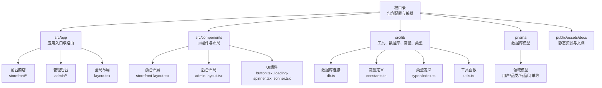
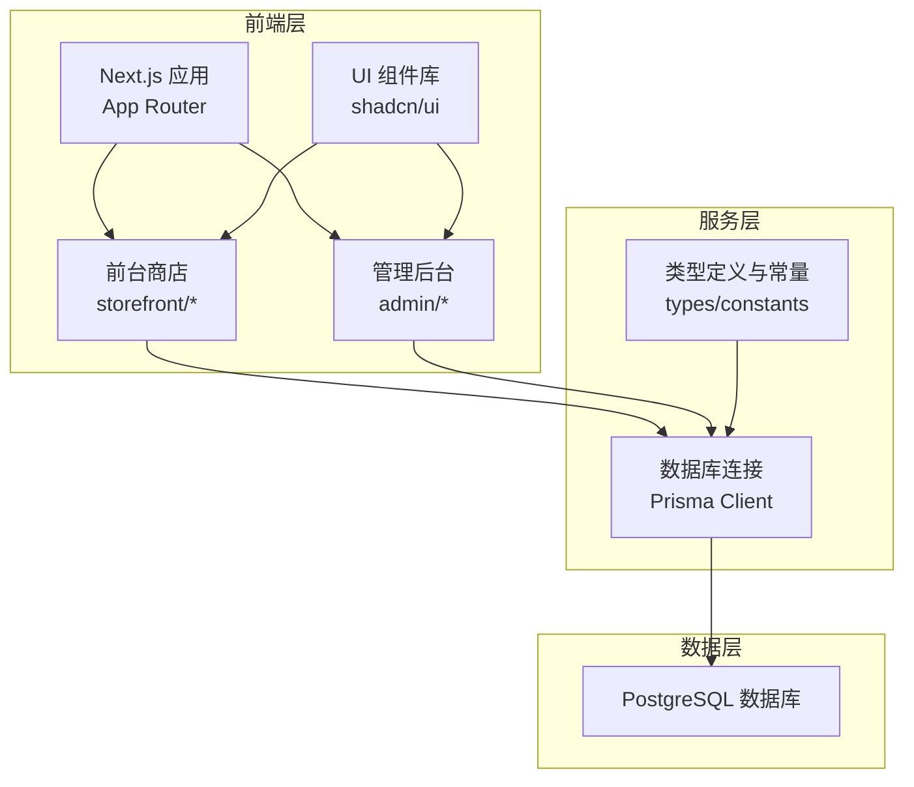
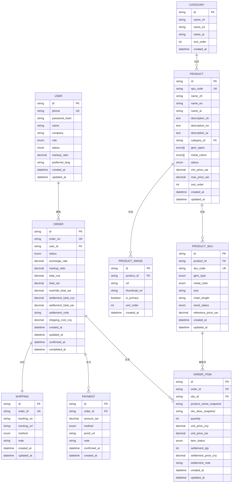
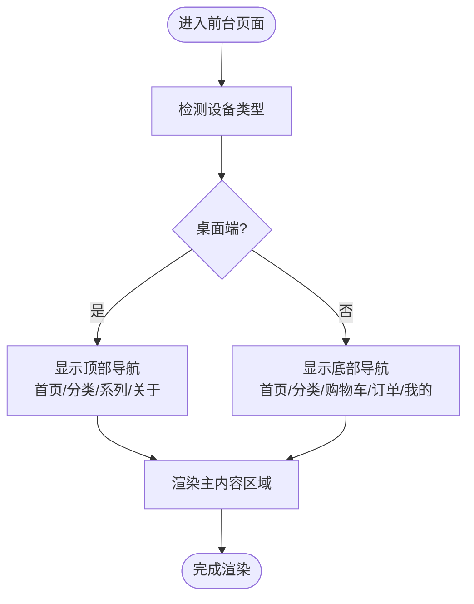
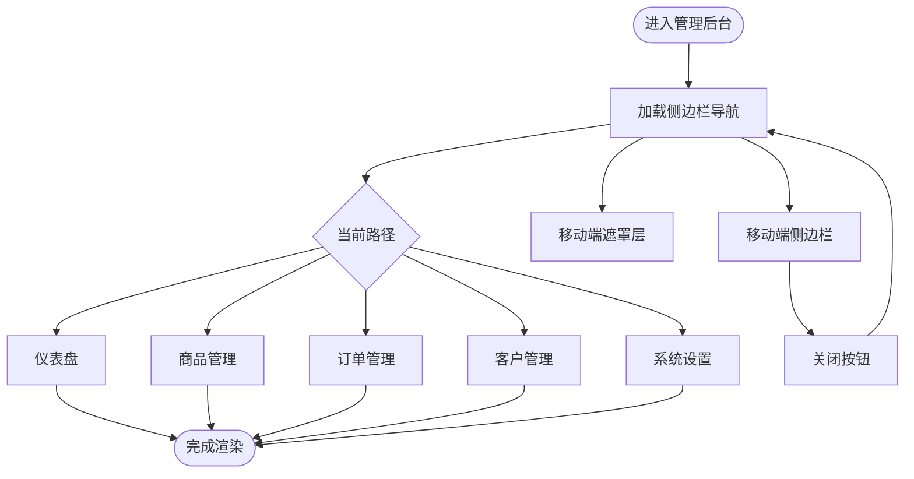
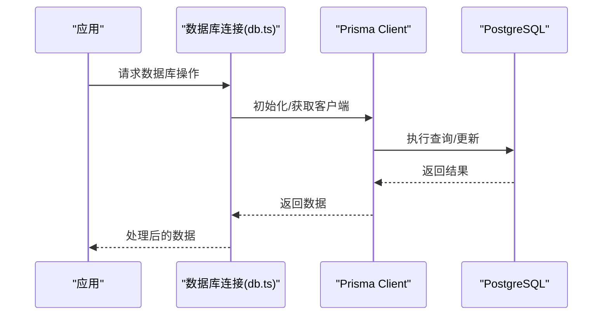
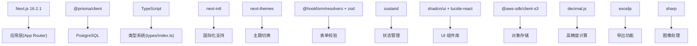

# 项目概述

<cite>
**本文档引用的文件**
- [README.md](file://README.md)
- [package.json](file://package.json)
- [next.config.ts](file://next.config.ts)
- [prisma/schema.prisma](file://prisma/schema.prisma)
- [src/lib/db.ts](file://src/lib/db.ts)
- [src/app/layout.tsx](file://src/app/layout.tsx)
- [src/components/admin/admin-layout.tsx](file://src/components/admin/admin-layout.tsx)
- [src/components/storefront/storefront-layout.tsx](file://src/components/storefront/storefront-layout.tsx)
- [src/lib/constants.ts](file://src/lib/constants.ts)
- [src/types/index.ts](file://src/types/index.ts)
- [components.json](file://components.json)
- [docker-compose.yml](file://docker-compose.yml)
- [AGENTS.md](file://AGENTS.md)
</cite>

## 目录
1. [引言](#引言)
2. [项目结构](#项目结构)
3. [核心组件](#核心组件)
4. [架构总览](#架构总览)
5. [详细组件分析](#详细组件分析)
6. [依赖关系分析](#依赖关系分析)
7. [性能考虑](#性能考虑)
8. [故障排除指南](#故障排除指南)
9. [结论](#结论)
10. [附录](#附录)

## 引言
Celestia 是一个基于 Next.js 16.2.1 构建的高端珠宝电商平台，旨在为全球用户提供奢华珠宝的在线购买体验，并为运营团队提供高效的商品与订单管理能力。项目以“奢华重新定义”为核心品牌理念，通过现代化的技术栈与精心设计的用户体验，打造从前台商店到管理后台的完整商业闭环。

项目具备以下关键特征：
- 前台商店：面向终端用户的珠宝浏览、搜索、下单与个人中心功能。
- 管理后台：面向运营与管理团队的订单、商品、客户与系统配置管理。
- 多语言支持：内置国际化基础，支持多语言展示与交互。
- 数据驱动：采用 Prisma 进行数据库建模与访问，确保类型安全与开发效率。
- 设计体系：基于 shadcn/ui 的组件化设计，统一视觉风格与交互一致性。

**章节来源**
- [README.md:1-37](file://README.md#L1-L37)
- [package.json:1-50](file://package.json#L1-L50)

## 项目结构
项目采用 Next.js App Router 的目录结构，结合功能域划分与共享层组织，形成清晰的层次化架构：

- 根目录包含运行时配置、Docker 编排与文档说明，确保本地开发与部署的一致性。
- src/app：应用入口与路由层，包含前台商店与管理后台的页面布局与根布局。
- src/components：可复用 UI 组件与页面级布局组件，如前台与后台的布局容器。
- src/lib：通用工具、数据库连接、常量与类型定义，支撑业务逻辑与数据访问。
- prisma：数据库模型与迁移脚本，定义珠宝电商的核心领域模型。
- public/assets/docs：静态资源与文档，便于品牌展示与用户帮助。

**图表来源**
- [src/app/layout.tsx:17-42](file://src/app/layout.tsx#L17-L42)
- [src/components/admin/admin-layout.tsx:40-206](file://src/components/admin/admin-layout.tsx#L40-L206)
- [src/components/storefront/storefront-layout.tsx:21-99](file://src/components/storefront/storefront-layout.tsx#L21-L99)
- [src/lib/db.ts:1-12](file://src/lib/db.ts#L1-L12)
- [prisma/schema.prisma:1-281](file://prisma/schema.prisma#L1-L281)

**章节来源**
- [AGENTS.md:1-6](file://AGENTS.md#L1-L6)
- [docker-compose.yml:1-22](file://docker-compose.yml#L1-L22)

## 核心组件
- 应用根布局与主题：全局布局负责站点元数据、字体与通知组件的注入，确保一致的品牌视觉与交互体验。
- 前台布局：提供移动端底部导航与桌面端顶部导航，承载首页、分类、购物车、订单与个人中心等页面。
- 后台布局：提供侧边栏导航与顶部标题，覆盖仪表盘、商品管理、订单管理、客户管理与系统设置等模块。
- 数据库连接：通过 Prisma Client 提供类型安全的数据访问，开发环境启用日志以便调试。
- 类型与常量：统一的 API 响应格式、分页参数、订单状态配置与多语言支持，保证前后端契约一致。
- 组件体系：基于 shadcn/ui 的组件库，结合 Tailwind CSS 实现可定制的设计系统。

**章节来源**
- [src/app/layout.tsx:12-42](file://src/app/layout.tsx#L12-L42)
- [src/components/storefront/storefront-layout.tsx:13-99](file://src/components/storefront/storefront-layout.tsx#L13-L99)
- [src/components/admin/admin-layout.tsx:24-98](file://src/components/admin/admin-layout.tsx#L24-L98)
- [src/lib/db.ts:7-11](file://src/lib/db.ts#L7-L11)
- [src/lib/constants.ts:1-46](file://src/lib/constants.ts#L1-L46)
- [src/types/index.ts:1-58](file://src/types/index.ts#L1-L58)
- [components.json:1-26](file://components.json#L1-L26)

## 架构总览
系统采用前后端一体化的全栈架构，前端使用 Next.js App Router，后端通过 Prisma 连接 PostgreSQL 数据库，配合 Docker 进行本地开发环境编排。整体流程如下：

**图表来源**
- [src/app/layout.tsx:17-42](file://src/app/layout.tsx#L17-L42)
- [src/components/storefront/storefront-layout.tsx:21-99](file://src/components/storefront/storefront-layout.tsx#L21-L99)
- [src/components/admin/admin-layout.tsx:40-206](file://src/components/admin/admin-layout.tsx#L40-L206)
- [src/lib/db.ts:1-12](file://src/lib/db.ts#L1-L12)
- [prisma/schema.prisma:1-281](file://prisma/schema.prisma#L1-L281)

## 详细组件分析

### 数据模型与业务领域
项目通过 Prisma 定义了完整的珠宝电商领域模型，涵盖用户、品类、商品、SKU、图片、订单、支付与物流等核心实体，并通过枚举类型表达业务状态与属性。该设计确保了数据一致性与扩展性，适合多语言、多币种与复杂定价策略的业务场景。

**图表来源**
- [prisma/schema.prisma:89-281](file://prisma/schema.prisma#L89-L281)

**章节来源**
- [prisma/schema.prisma:1-281](file://prisma/schema.prisma#L1-L281)

### 前台商店布局与导航
前台布局提供桌面端与移动端的导航体验，支持首页、分类、系列、关于等页面跳转，并在移动端以底部导航栏呈现核心功能入口。该设计兼顾易用性与品牌识别度，符合珠宝品牌的高端定位。

**图表来源**
- [src/components/storefront/storefront-layout.tsx:21-99](file://src/components/storefront/storefront-layout.tsx#L21-L99)

**章节来源**
- [src/components/storefront/storefront-layout.tsx:13-99](file://src/components/storefront/storefront-layout.tsx#L13-L99)

### 管理后台布局与导航
管理后台提供仪表盘、商品管理、订单管理、客户管理与系统设置等模块的导航入口，支持桌面端与移动端的侧边栏交互。通过明确的权限与状态管理，提升运营效率与操作一致性。

**图表来源**
- [src/components/admin/admin-layout.tsx:40-206](file://src/components/admin/admin-layout.tsx#L40-L206)

**章节来源**
- [src/components/admin/admin-layout.tsx:24-98](file://src/components/admin/admin-layout.tsx#L24-L98)

### 数据访问与连接
数据库连接通过 Prisma Client 实现，开发环境下启用查询日志，生产环境仅记录错误日志，确保性能与可观测性的平衡。该模式避免了重复初始化与连接泄漏问题，适合长期演进的业务需求。

**图表来源**
- [src/lib/db.ts:1-12](file://src/lib/db.ts#L1-L12)

**章节来源**
- [src/lib/db.ts:7-11](file://src/lib/db.ts#L7-L11)

## 依赖关系分析
项目依赖围绕 Next.js 16.2.1 与 Prisma 生态展开，同时引入国际化、主题切换、表单验证与状态管理等增强功能。下图展示了关键依赖之间的关系：

**图表来源**
- [package.json:11-37](file://package.json#L11-L37)
- [src/types/index.ts:41-58](file://src/types/index.ts#L41-L58)

**章节来源**
- [package.json:1-50](file://package.json#L1-L50)

## 性能考虑
- 数据库连接优化：通过全局缓存 Prisma Client，减少重复初始化开销，提高并发下的稳定性。
- 开发体验：开发环境开启 Prisma 查询日志，便于快速定位性能瓶颈与异常。
- 前端渲染：App Router 的并行数据获取与流式传输能力，结合 Tailwind CSS 的原子化样式，降低打包体积与首屏渲染时间。
- 图像与静态资源：利用 Next.js 的自动优化与缓存策略，结合 sharp 进行图像处理，提升加载速度与带宽利用率。
- 国际化与主题：next-intl 与 next-themes 的组合，确保多语言与深色/浅色主题的切换性能与一致性。

**章节来源**
- [src/lib/db.ts:7-11](file://src/lib/db.ts#L7-L11)
- [next.config.ts:3-5](file://next.config.ts#L3-L5)

## 故障排除指南
- 开发服务器启动失败：检查 Node.js 版本与包管理器兼容性，确认端口未被占用。
- 数据库连接异常：核对 docker-compose 中的环境变量与卷挂载，确保 PostgreSQL 正常启动并通过健康检查。
- Prisma 客户端报错：确认 schema.prisma 的数据源配置与数据库连通性，执行数据库迁移后再启动应用。
- 国际化消息缺失：检查 locales 列表与消息文件映射，确保 supportedLocales 与 RTL 语言配置正确。
- UI 组件样式异常：确认 shadcn/ui 的安装与 Tailwind 配置，检查组件别名与颜色变量是否生效。

**章节来源**
- [docker-compose.yml:1-22](file://docker-compose.yml#L1-L22)
- [prisma/schema.prisma:8-10](file://prisma/schema.prisma#L8-L10)
- [src/lib/constants.ts:40-46](file://src/lib/constants.ts#L40-L46)
- [components.json:6-12](file://components.json#L6-L12)

## 结论
Celestia 项目以 Next.js 16.2.1 为基础，结合 Prisma、TypeScript 与 shadcn/ui 等现代技术栈，构建了一个兼具美观与实用的珠宝电商解决方案。其清晰的模块划分、完善的领域模型与一致的设计体系，既满足初学者的学习需求，也为有经验的开发者提供了良好的扩展空间。通过前台商店与管理后台的协同，项目能够有效支撑品牌营销、客户服务与运营管理，具备明确的市场定位与业务价值。

## 附录
- 技术选型优势
  - Next.js：App Router 提供强大的路由与数据获取能力，适合复杂业务场景。
  - Prisma：类型安全的数据库访问与迁移工具，显著提升开发效率。
  - TypeScript：强类型系统保障代码质量与可维护性。
  - shadcn/ui：可定制的组件库，契合品牌视觉与交互规范。
- 业务价值
  - 提升客户体验：多语言、多币种与移动端适配，扩大全球市场覆盖。
  - 增强运营效率：后台管理模块化设计，简化商品与订单管理流程。
  - 保障数据安全：严格的类型约束与权限控制，降低业务风险。
- 开发团队期望
  - 保持代码整洁与文档完善，便于知识传承与协作。
  - 持续优化性能与用户体验，关注细节与可访问性。
  - 遵循设计系统与命名规范，确保界面一致性与可维护性。